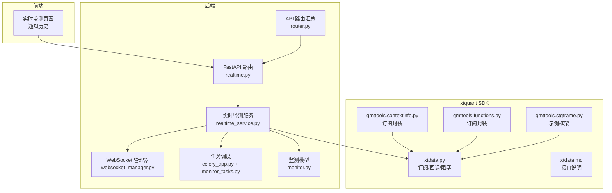
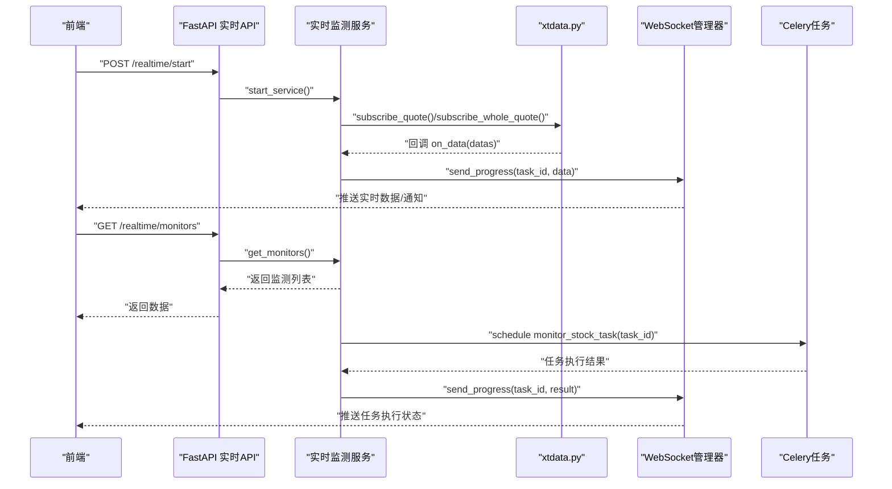
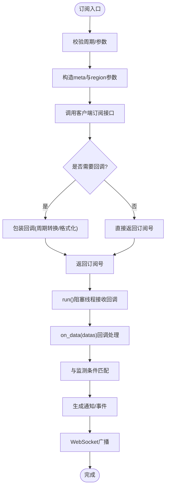
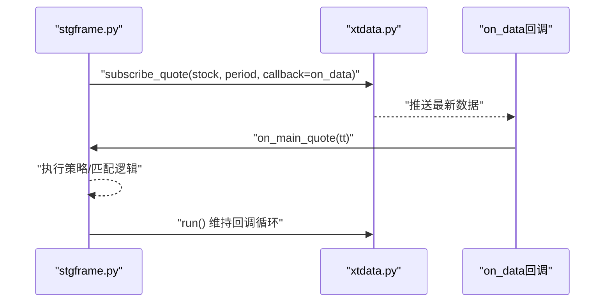
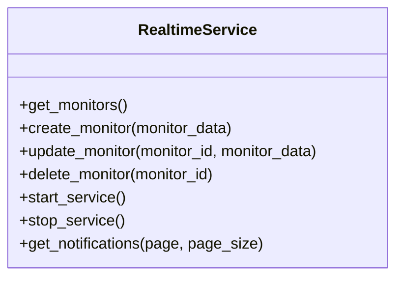
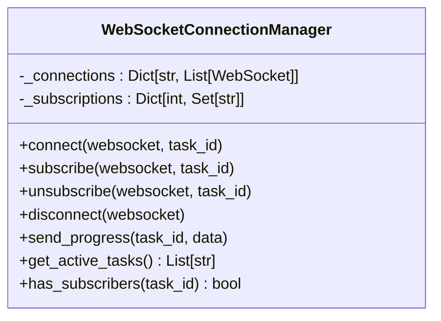
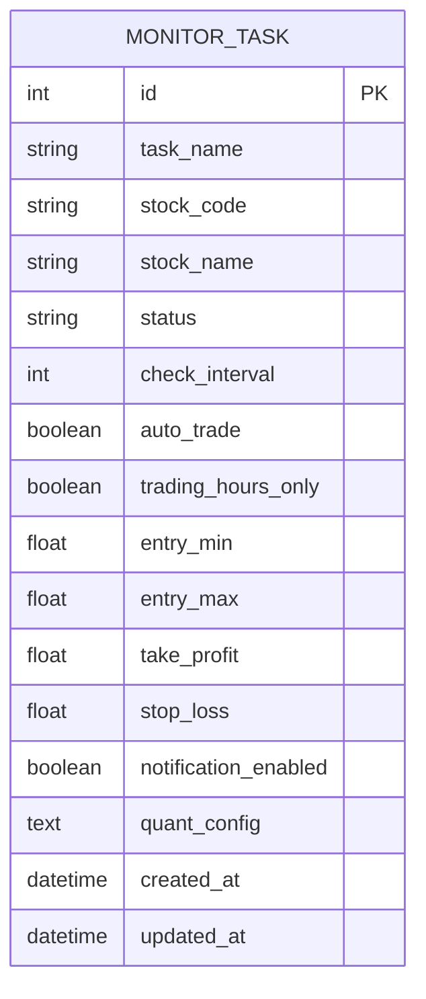
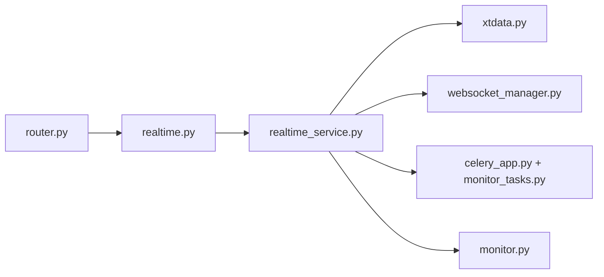

# 实时数据源集成

<cite>
**本文引用的文件**
- [xtdata.py](file://xtquant/xtdata.py)
- [xtdata.md](file://xtquant/doc/xtdata.md)
- [contextinfo.py](file://xtquant/qmttools/contextinfo.py)
- [functions.py](file://xtquant/qmttools/functions.py)
- [stgframe.py](file://xtquant/qmttools/stgframe.py)
- [websocket_manager.py](file://backend/app/core/websocket_manager.py)
- [websocket.py](file://backend/app/api/websocket.py)
- [realtime.py](file://backend/app/api/v1/realtime.py)
- [realtime_service.py](file://backend/app/services/realtime_service.py)
- [monitor.py](file://backend/app/models/monitor.py)
- [monitor_service.py](file://backend/app/services/monitor_service.py)
- [monitor_tasks.py](file://backend/app/tasks/monitor_tasks.py)
- [celery_app.py](file://backend/app/tasks/celery_app.py)
- [router.py](file://backend/app/api/v1/router.py)
- [001_add_monitor_task_fields.py](file://backend/alembic/versions/001_add_monitor_task_fields.py)
</cite>

## 目录
1. [引言](#引言)
2. [项目结构](#项目结构)
3. [核心组件](#核心组件)
4. [架构总览](#架构总览)
5. [详细组件分析](#详细组件分析)
6. [依赖关系分析](#依赖关系分析)
7. [性能考量](#性能考量)
8. [故障排查指南](#故障排查指南)
9. [结论](#结论)

## 引言
本文件聚焦于如何通过xtdata.py集成xtquant平台的实时行情数据，构建后端订阅与高频数据处理流水线，并与本地监测任务进行实时匹配。文档覆盖以下要点：
- 如何通过xtdata.py订阅股票价格流（单股/全推）、处理回调数据
- 高频数据更新的处理策略与批量化思路
- 与本地监测任务的关联机制（基于任务模型与服务层）
- 数据拉取频率控制、批量处理策略与系统资源平衡
- 结合代码示例路径，给出可落地的实现建议

## 项目结构
围绕实时数据源集成的关键目录与文件：
- 后端API与服务层：FastAPI路由、实时监测服务、任务调度（Celery）、WebSocket管理
- 监测模型与数据库迁移：MonitorTask模型、字段扩展
- 前端对接：实时监测API路由注册
- xtquant SDK：xtdata.py行情订阅接口、辅助工具与示例框架

图表来源
- [realtime.py](file://backend/app/api/v1/realtime.py#L1-L104)
- [realtime_service.py](file://backend/app/services/realtime_service.py#L1-L49)
- [websocket_manager.py](file://backend/app/core/websocket_manager.py#L1-L119)
- [monitor_tasks.py](file://backend/app/tasks/monitor_tasks.py#L1-L13)
- [celery_app.py](file://backend/app/tasks/celery_app.py#L1-L21)
- [monitor.py](file://backend/app/models/monitor.py#L1-L39)
- [router.py](file://backend/app/api/v1/router.py#L1-L36)
- [xtdata.py](file://xtquant/xtdata.py#L1204-L1519)
- [xtdata.md](file://xtquant/doc/xtdata.md#L199-L354)
- [contextinfo.py](file://xtquant/qmttools/contextinfo.py#L144-L158)
- [functions.py](file://xtquant/qmttools/functions.py#L39-L47)
- [stgframe.py](file://xtquant/qmttools/stgframe.py#L165-L216)

章节来源
- [realtime.py](file://backend/app/api/v1/realtime.py#L1-L104)
- [router.py](file://backend/app/api/v1/router.py#L1-L36)

## 核心组件
- xtdata.py：提供订阅单股/全推行情、反订阅、阻塞回调、订阅状态查询等能力；支持周期参数与回调包装
- qmttools：提供subscribe_quote/subscribe_whole_quote等封装，简化调用
- FastAPI实时监测API：提供启动/停止服务、获取监测列表、通知历史等接口
- WebSocket管理器：维护任务级订阅与广播
- 监测模型与服务：MonitorTask模型、任务启停与更新逻辑
- Celery任务：异步调度监测任务（当前占位，后续扩展）

章节来源
- [xtdata.py](file://xtquant/xtdata.py#L1204-L1519)
- [xtdata.md](file://xtquant/doc/xtdata.md#L199-L354)
- [contextinfo.py](file://xtquant/qmttools/contextinfo.py#L144-L158)
- [functions.py](file://xtquant/qmttools/functions.py#L39-L47)
- [stgframe.py](file://xtquant/qmttools/stgframe.py#L165-L216)
- [realtime.py](file://backend/app/api/v1/realtime.py#L1-L104)
- [websocket_manager.py](file://backend/app/core/websocket_manager.py#L1-L119)
- [monitor.py](file://backend/app/models/monitor.py#L1-L39)
- [monitor_service.py](file://backend/app/services/monitor_service.py#L194-L330)
- [monitor_tasks.py](file://backend/app/tasks/monitor_tasks.py#L1-L13)
- [celery_app.py](file://backend/app/tasks/celery_app.py#L1-L21)

## 架构总览
后端通过FastAPI暴露实时监测接口，服务层负责任务生命周期管理与数据推送；xtdata.py负责与xtquant行情服务建立订阅并处理高频回调；WebSocket管理器将任务进度与通知广播给前端；Celery用于异步调度监测任务。

图表来源
- [realtime.py](file://backend/app/api/v1/realtime.py#L68-L103)
- [realtime_service.py](file://backend/app/services/realtime_service.py#L34-L49)
- [xtdata.py](file://xtquant/xtdata.py#L1204-L1519)
- [websocket_manager.py](file://backend/app/core/websocket_manager.py#L84-L110)
- [monitor_tasks.py](file://backend/app/tasks/monitor_tasks.py#L1-L13)
- [celery_app.py](file://backend/app/tasks/celery_app.py#L1-L21)

## 详细组件分析

### 组件A：xtdata.py 行情订阅与回调处理
- 订阅接口
  - 单股订阅：subscribe_quote/subscribe_quote2，支持周期、历史范围与除权类型，回调参数为 {stock_code: [data1, data2, ...]}
  - 全推订阅：subscribe_whole_quote，回调参数为 {stock1: data1, stock2: data2, ...}
  - 反订阅：unsubscribe_quote(seq)
  - 阻塞回调：run()，维持线程运行并检测连接状态
- 回调包装与周期校验
  - 内部对周期进行校验与转换，必要时包装回调以统一输出格式
- 订阅状态查询
  - get_current_connect_sub_info()/get_all_sub_info() 查询当前连接与所有订阅信息

图表来源
- [xtdata.py](file://xtquant/xtdata.py#L1204-L1519)
- [xtdata.md](file://xtquant/doc/xtdata.md#L199-L354)

章节来源
- [xtdata.py](file://xtquant/xtdata.py#L1204-L1519)
- [xtdata.md](file://xtquant/doc/xtdata.md#L199-L354)

### 组件B：qmttools 订阅封装与示例
- 提供 subscribe_quote/subscribe_whole_quote 的便捷封装，简化调用
- 示例框架 stgframe.py 展示了如何在主行情订阅回调中触发业务逻辑，并通过 run() 维持回调循环

图表来源
- [stgframe.py](file://xtquant/qmttools/stgframe.py#L165-L216)
- [functions.py](file://xtquant/qmttools/functions.py#L39-L47)
- [contextinfo.py](file://xtquant/qmttools/contextinfo.py#L144-L158)

章节来源
- [stgframe.py](file://xtquant/qmttools/stgframe.py#L165-L216)
- [functions.py](file://xtquant/qmttools/functions.py#L39-L47)
- [contextinfo.py](file://xtquant/qmttools/contextinfo.py#L144-L158)

### 组件C：FastAPI 实时监测API与服务层
- API路由：提供获取监测列表、创建/更新/删除监测、启动/停止服务、通知历史等接口
- 服务层：RealtimeService目前为占位实现，后续需接入xtdata订阅与匹配逻辑

图表来源
- [realtime_service.py](file://backend/app/services/realtime_service.py#L1-L49)
- [realtime.py](file://backend/app/api/v1/realtime.py#L1-L104)

章节来源
- [realtime_service.py](file://backend/app/services/realtime_service.py#L1-L49)
- [realtime.py](file://backend/app/api/v1/realtime.py#L1-L104)

### 组件D：WebSocket 管理器与广播
- 维护任务级连接池与订阅关系，支持订阅/取消订阅、进度广播、活跃任务查询
- 与前端实时推送配合，实现任务状态与通知的即时下发

图表来源
- [websocket_manager.py](file://backend/app/core/websocket_manager.py#L1-L119)

章节来源
- [websocket_manager.py](file://backend/app/core/websocket_manager.py#L1-L119)

### 组件E：监测模型与任务调度
- 模型：MonitorTask包含任务名、股票代码、状态、检查间隔、交易时段开关、止盈止损、通知开关、量化配置等字段
- 服务：MonitorService负责任务的创建、更新、启动/停止、删除；当前与xtdata集成尚未实现，需扩展
- 任务：monitor_tasks.py为Celery任务占位，后续可在此执行高频轮询或回调驱动的匹配逻辑

图表来源
- [monitor.py](file://backend/app/models/monitor.py#L1-L39)
- [001_add_monitor_task_fields.py](file://backend/alembic/versions/001_add_monitor_task_fields.py#L1-L43)

章节来源
- [monitor.py](file://backend/app/models/monitor.py#L1-L39)
- [monitor_service.py](file://backend/app/services/monitor_service.py#L194-L330)
- [monitor_tasks.py](file://backend/app/tasks/monitor_tasks.py#L1-L13)
- [celery_app.py](file://backend/app/tasks/celery_app.py#L1-L21)

## 依赖关系分析
- 后端API路由汇总：router.py将realtime模块路由挂载至/api/v1/realtime
- 实时监测服务依赖xtdata.py进行行情订阅与回调处理
- WebSocket管理器为实时推送提供基础设施
- Celery任务为异步调度提供基础，当前monitor_tasks.py为占位

图表来源
- [router.py](file://backend/app/api/v1/router.py#L1-L36)
- [realtime.py](file://backend/app/api/v1/realtime.py#L1-L104)
- [realtime_service.py](file://backend/app/services/realtime_service.py#L1-L49)
- [xtdata.py](file://xtquant/xtdata.py#L1204-L1519)
- [websocket_manager.py](file://backend/app/core/websocket_manager.py#L1-L119)
- [monitor_tasks.py](file://backend/app/tasks/monitor_tasks.py#L1-L13)
- [celery_app.py](file://backend/app/tasks/celery_app.py#L1-L21)
- [monitor.py](file://backend/app/models/monitor.py#L1-L39)

章节来源
- [router.py](file://backend/app/api/v1/router.py#L1-L36)

## 性能考量
- 订阅粒度与回调频率
  - 单股订阅不宜过多，避免回调风暴；可采用全推订阅+过滤策略降低回调量
  - 回调包装统一输出格式，减少上层分支判断成本
- 数据拉取频率控制
  - 利用check_interval与trading_hours_only控制轮询频率与交易时段限制
  - 对高频周期（如1分钟）建议采用增量更新策略，仅处理最新bar
- 批量处理策略
  - 回调数据按股票聚合后批量写入/匹配，避免逐条处理带来的锁竞争
  - 使用队列/缓冲区暂存回调数据，定期flush
- 资源消耗平衡
  - run()阻塞线程维持回调循环，注意连接断开检测与重连
  - WebSocket连接池按任务维度管理，及时清理断开连接
- 量化配置与策略解耦
  - 将匹配逻辑与xtdata回调解耦，通过事件/消息队列驱动策略执行

[本节为通用指导，无需特定文件来源]

## 故障排查指南
- 连接与订阅
  - 检查xtquant服务是否启动，connect/reconnect流程是否成功
  - 使用get_current_connect_sub_info()/get_all_sub_info()确认订阅状态
- 回调处理
  - 确认回调包装是否正确（周期转换/格式化），避免解析异常
  - run()阻塞线程中若连接断开会抛出异常，需捕获并重连
- WebSocket推送
  - 检查WebSocket管理器的订阅关系与活跃任务列表
  - 断开连接后自动清理，确保前端重连逻辑健壮
- 任务启停
  - MonitorService中若任务已在运行，需先停止再删除或更新
  - Celery任务占位需补充实际逻辑，否则不会产生任何副作用

章节来源
- [xtdata.py](file://xtquant/xtdata.py#L1510-L1519)
- [websocket_manager.py](file://backend/app/core/websocket_manager.py#L84-L110)
- [monitor_service.py](file://backend/app/services/monitor_service.py#L290-L330)

## 结论
通过xtdata.py提供的订阅接口与回调机制，后端可高效接入xtquant实时行情数据。结合WebSocket管理器与FastAPI实时API，能够实现任务级的实时推送与通知。当前服务层与任务层仍处于占位阶段，建议按以下步骤推进：
- 在RealtimeService中实现xtdata订阅与回调处理，按股票聚合数据并进行条件匹配
- 将匹配结果通过WebSocket广播给前端，或写入通知历史
- 扩展MonitorService的任务启停逻辑，结合check_interval与trading_hours_only进行频率控制
- 完成monitor_tasks.py的Celery任务实现，支持异步调度与批量处理
- 使用get_current_connect_sub_info()/get_all_sub_info()持续监控订阅状态，保障稳定性

[本节为总结，无需特定文件来源]