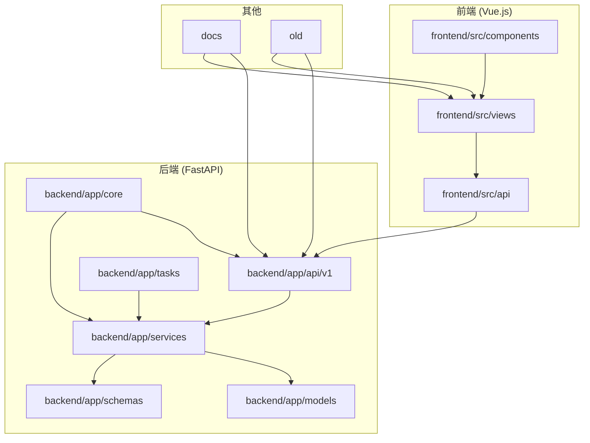
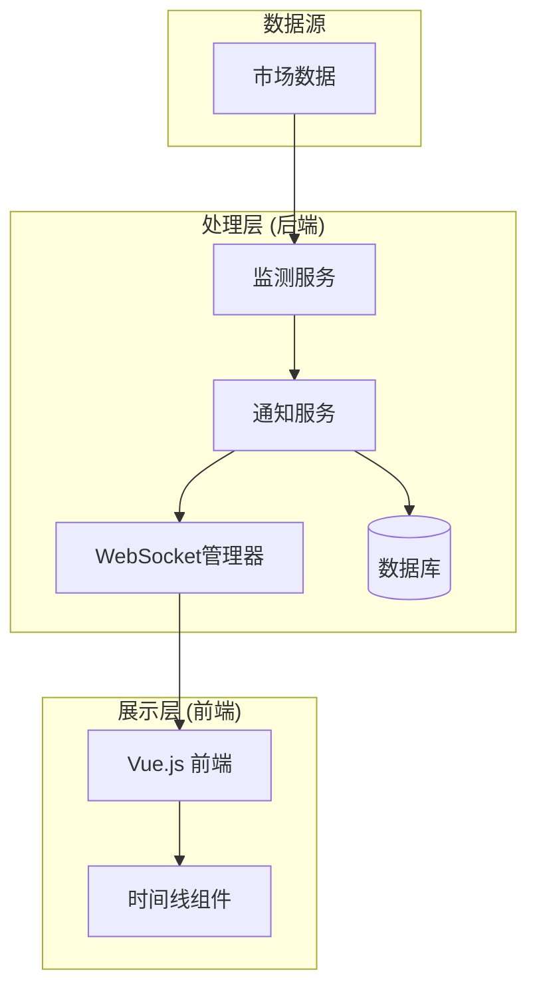
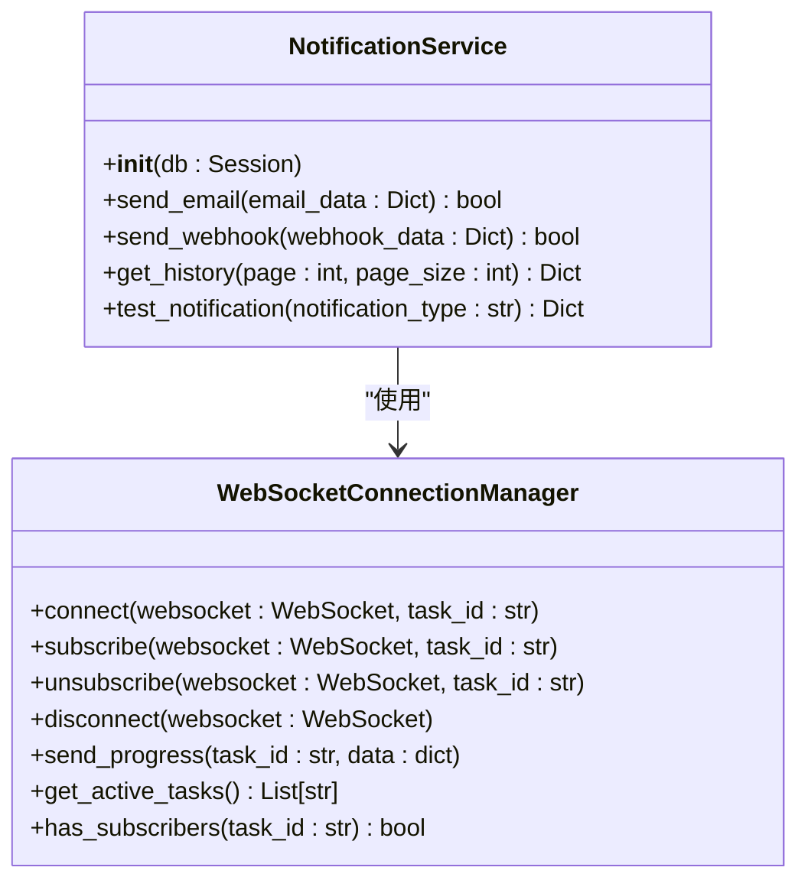
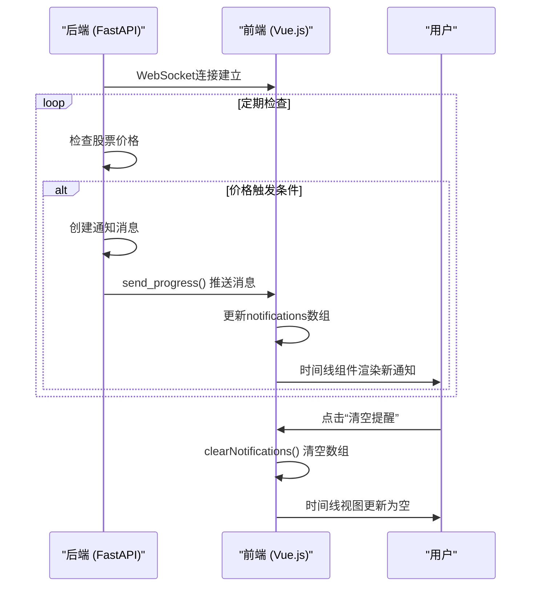
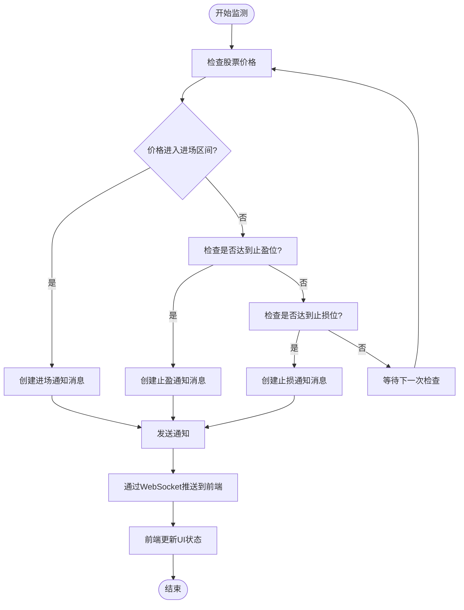
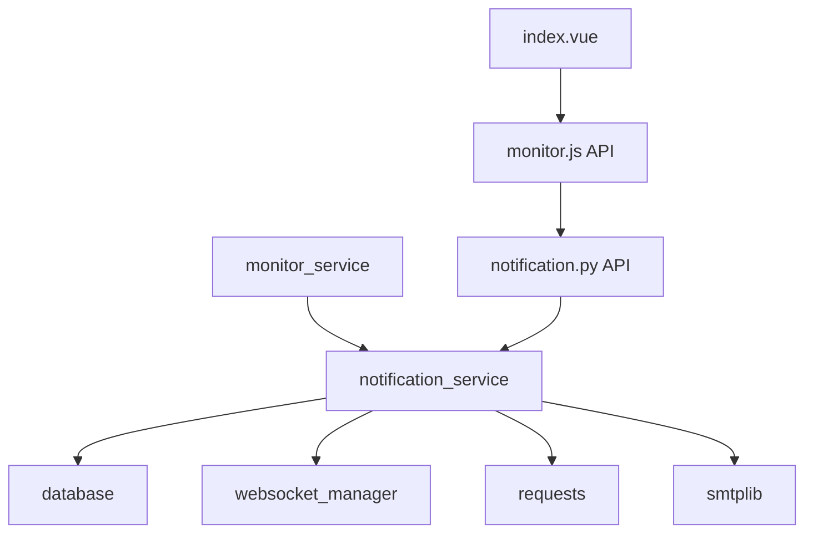

# 通知消息设计

<cite>
**本文档引用的文件**   
- [notification.py](file://backend/app/api/v1/notification.py)
- [notification_service.py](file://backend/app/services/notification_service.py)
- [websocket_manager.py](file://backend/app/core/websocket_manager.py)
- [websocket.py](file://backend/app/api/websocket.py)
- [monitor.py](file://backend/app/models/monitor.py)
- [monitor.py](file://backend/app/schemas/monitor.py)
- [monitor_tasks.py](file://backend/app/tasks/monitor_tasks.py)
- [notifications.vue](file://frontend/src/views/realtime/notifications.vue)
- [index.vue](file://frontend/src/views/realtime/index.vue)
- [old/notification_service.py](file://old/notification_service.py)
- [old/monitor_manager.py](file://old/monitor_manager.py)
- [前后端拆分规划文档.md](file://docs/前后端拆分规划文档.md)
</cite>

## 目录
1. [引言](#引言)
2. [项目结构](#项目结构)
3. [核心组件](#核心组件)
4. [架构概述](#架构概述)
5. [详细组件分析](#详细组件分析)
6. [依赖分析](#依赖分析)
7. [性能考虑](#性能考虑)
8. [故障排除指南](#故障排除指南)
9. [结论](#结论)
10. [附录](#附录) (如有必要)

## 引言
本项目是一个基于AI的股票分析与实时监测系统，其核心功能之一是通过实时通知机制向用户推送股票价格变动、交易信号和系统状态等关键信息。通知消息设计是整个系统用户体验的关键组成部分，它确保了用户能够及时获取重要的市场动态和投资建议。该系统采用现代化的前后端分离架构，后端使用FastAPI框架提供RESTful API和WebSocket服务，前端则基于Vue.js构建用户界面。通知系统的设计不仅需要考虑消息的实时性和可靠性，还需要兼顾不同类型通知的分类展示和用户交互反馈。通过WebSocket技术，系统能够实现服务器到客户端的低延迟、双向通信，确保用户在第一时间收到价格突破、区间触发等关键事件的通知。同时，系统还支持邮件和Webhook等多种通知渠道，满足不同用户的偏好和需求。

## 项目结构
该项目采用清晰的分层架构，将后端、前端和文档等不同部分分离。后端主要由FastAPI应用构成，包含API路由、核心服务、数据库模型、业务逻辑服务和任务调度等模块。`backend/app/api/v1/`目录下定义了各种API端点，包括实时监测、通知管理、投资组合分析等。`backend/app/services/`目录包含了核心业务逻辑，如通知服务、监测服务和实时数据服务。`backend/app/models/`和`schemas/`分别定义了数据库模型和API数据传输对象。前端部分位于`frontend/`目录下，采用Vue.js框架，通过`src/views/`下的视图组件与后端API进行交互，`src/api/`目录封装了所有API调用。`old/`目录包含了系统的早期版本，提供了重要的历史实现参考。`docs/`目录存放了详细的开发文档和使用指南。这种结构化的组织方式使得代码易于维护和扩展，同时也方便了新开发人员快速理解系统架构。

**Diagram sources**
- [project_structure](file://project_structure)

## 核心组件
通知消息系统的核心在于后端如何构造标准化的消息体并通过WebSocket推送到前端。后端通过`WebSocketConnectionManager`类管理所有活跃的WebSocket连接，它维护了一个以任务ID为键的连接列表，允许系统将特定任务的进度或通知推送给订阅了该任务的客户端。当监测任务触发特定条件（如价格进入预设区间）时，系统会创建一个包含事件类型、股票信息和时间戳的JSON消息体，并通过`send_progress`方法广播给所有订阅该任务的客户端。前端则通过`realtime/index.vue`中的`el-timeline`组件来渲染这些通知，形成一个按时间排序的提醒流。尽管`notifications.vue`文件目前仅包含一个占位符，表明该功能仍在开发中，但`index.vue`已经实现了通知的展示逻辑。通知的类型体系在前端通过`itemColor`方法进行区分，为不同类型的提醒（如进场、止盈、止损）分配不同的颜色，从而提供直观的视觉反馈。

**Section sources**
- [websocket_manager.py](file://backend/app/core/websocket_manager.py#L1-L119)
- [index.vue](file://frontend/src/views/realtime/index.vue#L315-L334)

## 架构概述
整个通知系统的架构可以分为三个主要层次：数据源层、处理层和展示层。数据源层负责从外部市场获取实时股票数据。处理层是系统的核心，由FastAPI后端构成，它包含监测服务、通知服务和WebSocket管理器。监测服务（`monitor_service`）定期检查股票价格是否满足预设条件（如进入进场区间、达到止盈/止损位）。一旦条件满足，它会调用通知服务（`notification_service`）来处理通知逻辑。通知服务不仅负责通过WebSocket向在线用户推送实时消息，还负责将通知持久化到数据库，并根据配置通过邮件或Webhook（如钉钉、飞书）发送给用户。展示层由Vue.js前端构成，它通过WebSocket连接接收来自后端的实时消息，并利用Element UI组件库中的时间线（`el-timeline`）和卡片（`el-card`）等组件，将通知以清晰、美观的方式呈现给用户。这种分层架构确保了系统的可维护性和可扩展性。

**Diagram sources**
- [monitor_service.py](file://backend/app/services/monitor_service.py)
- [notification_service.py](file://backend/app/services/notification_service.py)
- [websocket_manager.py](file://backend/app/core/websocket_manager.py#L1-L119)
- [index.vue](file://frontend/src/views/realtime/index.vue)

## 详细组件分析

### 后端通知服务分析
后端通知服务是整个通知系统的大脑。`notification_service.py`文件定义了`NotificationService`类，它封装了发送邮件、Webhook和获取通知历史等核心功能。尽管当前版本的方法体为空（标记为`# TODO`），但其接口设计清晰，表明了未来实现的方向。该服务通过依赖注入从数据库获取会话，确保了与数据层的解耦。`send_email`和`send_webhook`方法接受一个包含通知数据的字典，这为消息的标准化提供了基础。`get_history`方法支持分页查询，这对于处理大量历史通知记录至关重要。该服务的设计遵循了单一职责原则，专注于通知的发送和管理，而不涉及监测逻辑本身。

#### 对于API/Service Components:

**Diagram sources**
- [notification_service.py](file://backend/app/services/notification_service.py#L8-L34)
- [websocket_manager.py](file://backend/app/core/websocket_manager.py#L12-L119)

### 前端通知展示分析
前端的通知展示主要在`realtime/index.vue`文件中实现。该组件使用Element UI的`el-timeline`组件来构建一个时间线视图，用于展示最新的提醒。通知列表（`notificationList`）是一个计算属性，它从组件的`notifications`数据中获取数据。每个时间线项（`el-timeline-item`）的`timestamp`属性绑定到通知的`time`字段，`color`属性则通过`itemColor`方法根据通知的`type`（如'entry'、'take_profit'、'stop_loss'）动态设置，从而实现不同类型的提醒用不同颜色标识。用户可以通过点击“清空提醒”按钮来清除当前的提醒列表。值得注意的是，当前的实现使用了硬编码的示例数据（`FALLBACK_NOTIFICATIONS`），这表明后端API的实时通知推送功能可能尚未完全集成，或者前端正在使用模拟数据进行开发。

#### 对于API/Service Components:

**Diagram sources**
- [websocket_manager.py](file://backend/app/core/websocket_manager.py#L84-L102)
- [index.vue](file://frontend/src/views/realtime/index.vue#L315-L334)

### 通知消息格式与类型体系分析
通知消息的格式和类型体系在系统中是隐式定义的，主要通过实际的数据流和前端渲染逻辑来体现。从`old/notification_service.py`的历史代码中可以推断出，一个典型的通知消息体包含以下关键字段：`symbol`（股票代码）、`name`（股票名称）、`type`（提醒类型，如'entry'、'take_profit'、'stop_loss'）、`message`（提醒内容）和`triggered_at`（触发时间）。前端通过`itemColor`方法将这些类型映射为不同的颜色，例如'entry'对应绿色（#67C23A），'take_profit'对应橙色（#E6A23C），'stop_loss'对应红色（#F56C6C）。这种设计使得用户能够一目了然地识别通知的紧急程度和性质。消息体通过WebSocket以JSON格式传输，确保了轻量级和跨平台的兼容性。

#### 对于复杂逻辑组件:

**Diagram sources**
- [old/monitor_service.py](file://old/monitor_service.py#L190-L210)
- [index.vue](file://frontend/src/views/realtime/index.vue#L428-L430)

## 依赖分析
该通知系统依赖于多个内部和外部组件。内部依赖方面，`notification_service`依赖于`database`模块来持久化通知记录和配置，依赖于`websocket_manager`来实现实时推送。`monitor_service`则依赖于`notification_service`来触发通知。前端`realtime/index.vue`组件依赖于`src/api/monitor.js`来调用后端API，并依赖于Element UI库的组件来构建UI。外部依赖方面，系统通过`requests`库发送Webhook通知到钉钉或飞书，通过`smtplib`库发送邮件。WebSocket功能依赖于FastAPI和`websockets`库。这些依赖关系在`requirements.txt`文件中定义。值得注意的是，系统存在一个潜在的循环依赖风险：`monitor_service`调用`notification_service`，而`notification_service`可能需要查询`monitor_db`来获取股票信息，这需要在设计时通过合理的接口抽象来避免。

**Diagram sources**
- [requirements.txt](file://backend/requirements.txt)
- [notification_service.py](file://backend/app/services/notification_service.py)
- [monitor_service.py](file://backend/app/services/monitor_service.py)

## 性能考虑
在性能方面，WebSocket是实现实时通知的理想选择，因为它避免了HTTP轮询带来的高延迟和服务器负载。`WebSocketConnectionManager`通过维护连接池和任务订阅关系，能够高效地将消息广播给特定的客户端组。然而，需要考虑大量并发连接时的内存消耗。通知的持久化操作（写入数据库）可能会成为瓶颈，尤其是在高频率监测场景下，因此可以考虑使用异步数据库操作或消息队列（如Celery）来解耦通知的生成和持久化。前端的时间线组件在处理大量历史通知时可能会导致页面卡顿，建议实现分页加载或虚拟滚动。此外，监测任务的检查间隔（`check_interval`）是一个关键的性能调优参数，过短的间隔会增加服务器和API提供商的负载，过长的间隔则会降低通知的实时性，需要根据实际需求进行权衡。

## 故障排除指南
当用户无法收到实时通知时，可以按照以下步骤进行排查：
1.  **检查WebSocket连接**：确认前端是否成功建立了WebSocket连接。可以在浏览器的开发者工具中查看网络（Network）标签页，寻找WebSocket连接（ws://或wss://）。
2.  **检查后端服务状态**：确认FastAPI后端服务正在运行，并且`monitor_service`处于“运行中”状态。可以通过`display_monitor_status`函数中的状态指示器来判断。
3.  **检查通知配置**：在前端的监测任务中，确认“启用通知”开关已打开。同时，检查全局的邮件和Webhook配置是否正确（在`.env`文件中）。
4.  **检查日志**：查看后端日志（`websocket_manager.py`中的`logger`）和前端控制台日志，寻找任何错误信息，如连接失败、消息发送失败等。
5.  **检查股票价格**：确认监测的股票价格确实已经触发了预设的条件（如进入进场区间）。可以手动更新一次价格来测试。
6.  **检查前端组件**：确认`realtime/index.vue`中的`notificationList`数据是否被正确更新。如果数据有更新但UI未渲染，可能是Vue的响应式系统出现了问题。

**Section sources**
- [websocket_manager.py](file://backend/app/core/websocket_manager.py#L9-L119)
- [index.vue](file://frontend/src/views/realtime/index.vue#L315-L334)

## 结论
综上所述，该系统的通知消息设计围绕实时性、可靠性和用户体验展开。后端通过`WebSocketConnectionManager`实现了高效的实时消息推送，前端则利用`el-timeline`组件提供了清晰直观的通知展示。虽然当前的实现（特别是`notification_service.py`）仍处于待开发状态，但其架构设计是合理的。未来的开发应着重于完善通知服务的具体实现，包括邮件和Webhook的发送逻辑，并将WebSocket推送与监测服务更紧密地集成。同时，应考虑引入消息队列来提高系统的可扩展性和容错能力。通过优化这些方面，可以构建一个强大、稳定且用户友好的实时通知系统。

## 附录
### 通知类型与颜色映射表
| 通知类型 (type) | 前端显示颜色 | 颜色代码 |
| :--- | :--- | :--- |
| entry (进场) | 绿色 | #67C23A |
| take_profit (止盈) | 橙色 | #E6A23C |
| stop_loss (止损) | 红色 | #F56C6C |
| 其他/默认 | 灰色 | #909399 |

**Section sources**
- [index.vue](file://frontend/src/views/realtime/index.vue#L511-L518)