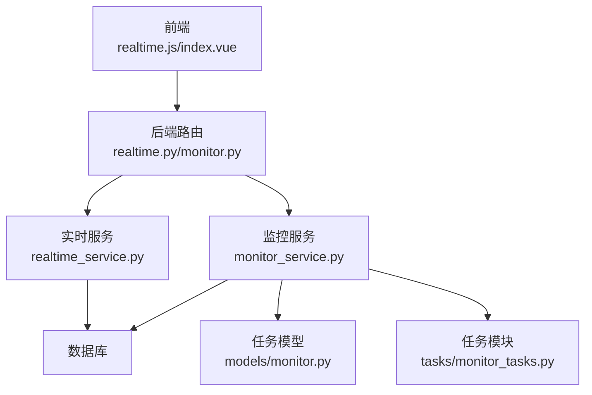
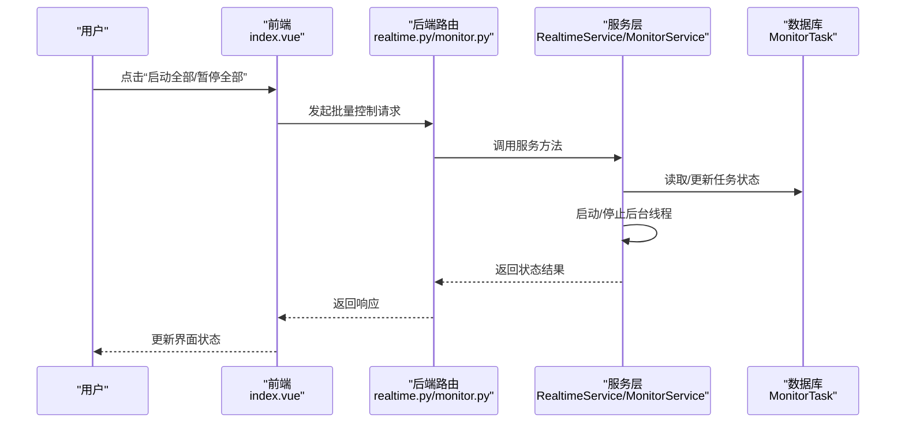
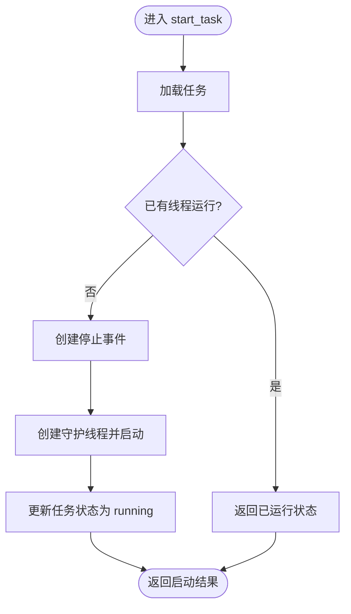
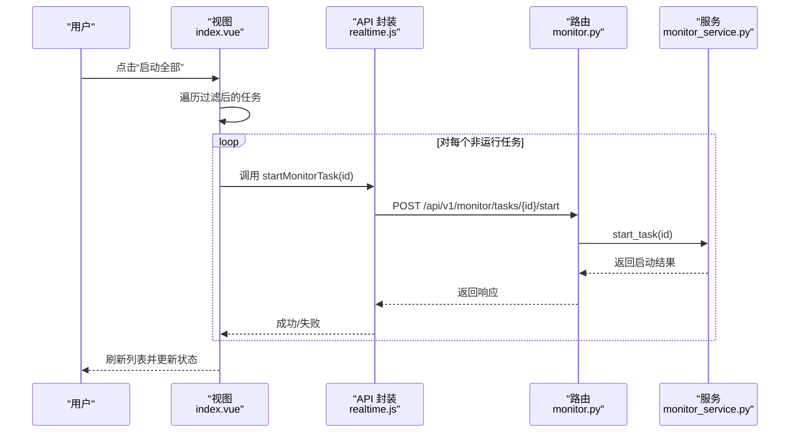
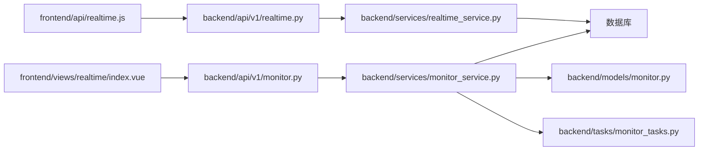

# 实时服务控制

<cite>
**本文引用的文件**
- [realtime_service.py](file://backend/app/services/realtime_service.py)
- [realtime.py](file://backend/app/api/v1/realtime.py)
- [monitor_service.py](file://backend/app/services/monitor_service.py)
- [monitor.py](file://backend/app/models/monitor.py)
- [monitor.py](file://backend/app/api/v1/monitor.py)
- [monitor_tasks.py](file://backend/app/tasks/monitor_tasks.py)
- [realtime.js](file://frontend/src/api/realtime.js)
- [index.vue](file://frontend/src/views/realtime/index.vue)
- [exceptions.py](file://backend/app/core/exceptions.py)
- [实时监测定时功能说明.md](file://docs/实时监测定时功能说明.md)
</cite>

## 目录
1. [简介](#简介)
2. [项目结构](#项目结构)
3. [核心组件](#核心组件)
4. [架构总览](#架构总览)
5. [组件详解](#组件详解)
6. [依赖关系分析](#依赖关系分析)
7. [性能考量](#性能考量)
8. [故障排查指南](#故障排查指南)
9. [结论](#结论)

## 简介
本文件聚焦于“实时服务控制”能力，围绕实时监测服务的启动与停止机制展开，详细说明 start_service 与 stop_service 两个核心方法的实现原理，涵盖服务状态管理、后台任务调度与资源释放等关键环节；结合前端 UI 中“启动全部”和“暂停全部”按钮，解释批量控制多个监测任务的实现逻辑；同时给出异常处理策略与健康检查最佳实践，帮助读者在生产环境中安全、稳定地运行实时监测服务。

## 项目结构
实时服务控制涉及前后端多层协作：
- 前端通过 API 方法发起“启动全部/暂停全部”请求；
- 后端 FastAPI 路由接收请求，委派给服务层 RealtimeService 或 MonitorService；
- 服务层负责状态管理、线程调度与资源清理；
- 数据模型与任务模块支撑任务持久化与异步执行。

图表来源
- [realtime.py](file://backend/app/api/v1/realtime.py#L1-L104)
- [monitor.py](file://backend/app/api/v1/monitor.py#L1-L135)
- [realtime_service.py](file://backend/app/services/realtime_service.py#L1-L49)
- [monitor_service.py](file://backend/app/services/monitor_service.py#L1-L733)
- [monitor.py](file://backend/app/models/monitor.py#L1-L39)
- [monitor_tasks.py](file://backend/app/tasks/monitor_tasks.py#L1-L13)
- [realtime.js](file://frontend/src/api/realtime.js#L1-L63)
- [index.vue](file://frontend/src/views/realtime/index.vue#L597-L610)

章节来源
- [realtime.py](file://backend/app/api/v1/realtime.py#L1-L104)
- [monitor.py](file://backend/app/api/v1/monitor.py#L1-L135)
- [realtime_service.py](file://backend/app/services/realtime_service.py#L1-L49)
- [monitor_service.py](file://backend/app/services/monitor_service.py#L1-L733)
- [monitor.py](file://backend/app/models/monitor.py#L1-L39)
- [monitor_tasks.py](file://backend/app/tasks/monitor_tasks.py#L1-L13)
- [realtime.js](file://frontend/src/api/realtime.js#L1-L63)
- [index.vue](file://frontend/src/views/realtime/index.vue#L597-L610)

## 核心组件
- RealtimeService：提供实时监测服务的统一入口，包含启动/停止/查询等方法占位实现。
- MonitorService：负责具体监控任务的生命周期管理，包括任务创建、更新、删除、启动/停止单个任务，以及后台线程调度与资源释放。
- API 层：FastAPI 路由将前端请求映射到服务层方法。
- 数据模型：MonitorTask 描述任务字段，包括状态、检查间隔、止盈止损、通知开关等。
- 任务模块：Celery 任务模板，用于异步执行监测任务（当前为占位）。
- 前端 API 与视图：realtime.js 提供启动/停止服务的 HTTP 请求封装；index.vue 提供“启动全部/暂停全部”的批量控制逻辑。

章节来源
- [realtime_service.py](file://backend/app/services/realtime_service.py#L1-L49)
- [monitor_service.py](file://backend/app/services/monitor_service.py#L1-L733)
- [monitor.py](file://backend/app/models/monitor.py#L1-L39)
- [monitor_tasks.py](file://backend/app/tasks/monitor_tasks.py#L1-L13)
- [realtime.js](file://frontend/src/api/realtime.js#L1-L63)
- [index.vue](file://frontend/src/views/realtime/index.vue#L597-L610)

## 架构总览
实时服务控制的端到端流程如下：

图表来源
- [index.vue](file://frontend/src/views/realtime/index.vue#L597-L610)
- [realtime.py](file://backend/app/api/v1/realtime.py#L67-L86)
- [monitor.py](file://backend/app/api/v1/monitor.py#L68-L93)
- [monitor_service.py](file://backend/app/services/monitor_service.py#L309-L389)
- [monitor.py](file://backend/app/models/monitor.py#L1-L39)

## 组件详解

### RealtimeService：实时服务控制入口
- 职责：作为实时监测服务的统一入口，提供启动/停止/查询等方法占位实现，便于后续扩展。
- 关键点：
  - start_service/stop_service 当前为占位，留待实现。
  - 与数据库 Session 注入，便于后续持久化与状态管理。

章节来源
- [realtime_service.py](file://backend/app/services/realtime_service.py#L1-L49)

### MonitorService：监控任务生命周期与后台调度
- 状态管理：
  - 使用类级字典维护“监控线程集合”和“停止标志”，键为股票代码，值为线程对象与事件对象。
  - 任务状态字段：running/stopped，配合数据库 MonitorTask.status 字段同步。
- 启动单个任务：
  - start_task：若任务未运行且未有同股票代码线程，创建停止事件与守护线程，启动 _start_monitor_thread。
  - 更新任务状态为 running 并提交数据库。
- 停止单个任务：
  - stop_task：若存在对应线程，设置停止事件并 join 线程，清理线程与停止标志，更新任务状态为 stopped。
- 后台调度与资源释放：
  - _start_monitor_thread：创建守护线程，传入检查间隔、自动交易、仅交易时段等参数。
  - _stop_monitor_thread：设置停止事件，等待线程退出并清理集合。
  - _monitor_loop：循环内执行分析逻辑（占位），随后按 check_interval 等待；异常被捕获并记录。
- 异常处理：
  - 服务层对数据库操作进行 try/catch 并回滚事务，记录错误日志。
  - 对外抛出异常由 API 层捕获并转换为 HTTP 500。

图表来源
- [monitor_service.py](file://backend/app/services/monitor_service.py#L309-L349)

章节来源
- [monitor_service.py](file://backend/app/services/monitor_service.py#L309-L389)

### API 层：路由与异常处理
- Realtime API：
  - /api/v1/realtime/start：调用 RealtimeService.start_service。
  - /api/v1/realtime/stop：调用 RealtimeService.stop_service。
  - 异常统一捕获并返回 HTTP 500。
- Monitor API：
  - /api/v1/monitor/tasks/{id}/start：调用 MonitorService.start_task。
  - /api/v1/monitor/tasks/{id}/stop：调用 MonitorService.stop_task。
  - 异常统一捕获并返回 HTTP 500。

章节来源
- [realtime.py](file://backend/app/api/v1/realtime.py#L67-L86)
- [monitor.py](file://backend/app/api/v1/monitor.py#L68-L93)

### 数据模型：MonitorTask
- 字段要点：任务状态、检查间隔、止盈止损、通知开关、量化配置等。
- 作用：为服务层提供持久化依据，支持状态同步与配置管理。

章节来源
- [monitor.py](file://backend/app/models/monitor.py#L1-L39)

### 任务模块：Celery 任务模板
- 当前为占位实现，预留 monitor_stock_task 任务函数，便于后续接入异步调度。

章节来源
- [monitor_tasks.py](file://backend/app/tasks/monitor_tasks.py#L1-L13)

### 前端：批量控制“启动全部/暂停全部”
- “启动全部”：遍历过滤后的任务列表，对非运行中的任务逐个调用 startMonitorTask。
- “暂停全部”：遍历过滤后的任务列表，对运行中的任务逐个调用 stopMonitorTask。
- 禁用条件：根据是否有运行中/暂停中的任务动态禁用按钮。
- 示例数据：当后端接口未就绪时，前端以示例数据兜底，保证 UI 可用性。

图表来源
- [index.vue](file://frontend/src/views/realtime/index.vue#L597-L610)
- [realtime.js](file://frontend/src/api/realtime.js#L1-L63)
- [monitor.py](file://backend/app/api/v1/monitor.py#L68-L93)
- [monitor_service.py](file://backend/app/services/monitor_service.py#L309-L349)

章节来源
- [index.vue](file://frontend/src/views/realtime/index.vue#L597-L610)
- [realtime.js](file://frontend/src/api/realtime.js#L1-L63)

## 依赖关系分析
- 前端依赖：
  - realtime.js 提供启动/停止服务的 HTTP 请求封装。
  - index.vue 依赖 API 方法实现批量控制。
- 后端依赖：
  - RealtimeService 依赖数据库 Session。
  - MonitorService 依赖 MonitorTask 模型、数据获取模块、QMT 服务、线程与事件。
  - API 层依赖服务层与响应封装。
- 异常处理：
  - 服务层捕获异常并回滚事务，API 层统一转换为 HTTP 500。
  - core.exceptions 提供通用异常类型，可在后续实现中复用。

图表来源
- [realtime.js](file://frontend/src/api/realtime.js#L1-L63)
- [index.vue](file://frontend/src/views/realtime/index.vue#L597-L610)
- [realtime.py](file://backend/app/api/v1/realtime.py#L1-L104)
- [monitor.py](file://backend/app/api/v1/monitor.py#L1-L135)
- [realtime_service.py](file://backend/app/services/realtime_service.py#L1-L49)
- [monitor_service.py](file://backend/app/services/monitor_service.py#L1-L733)
- [monitor.py](file://backend/app/models/monitor.py#L1-L39)
- [monitor_tasks.py](file://backend/app/tasks/monitor_tasks.py#L1-L13)

章节来源
- [realtime.js](file://frontend/src/api/realtime.js#L1-L63)
- [index.vue](file://frontend/src/views/realtime/index.vue#L597-L610)
- [realtime.py](file://backend/app/api/v1/realtime.py#L1-L104)
- [monitor.py](file://backend/app/api/v1/monitor.py#L1-L135)
- [realtime_service.py](file://backend/app/services/realtime_service.py#L1-L49)
- [monitor_service.py](file://backend/app/services/monitor_service.py#L1-L733)
- [monitor.py](file://backend/app/models/monitor.py#L1-L39)
- [monitor_tasks.py](file://backend/app/tasks/monitor_tasks.py#L1-L13)

## 性能考量
- 线程模型：使用守护线程与事件控制，避免主线程阻塞；线程退出时及时清理集合，防止资源泄漏。
- 循环节拍：按 check_interval 等待，避免忙轮询；异常捕获后继续循环，提升鲁棒性。
- 数据访问：数据库操作在 try/catch 中，失败时回滚并记录日志，减少脏状态风险。
- 异步任务：Celery 任务模板预留，便于后续将耗时分析放入队列执行，降低主线程压力。
- 前端批量控制：前端按需逐个请求，避免一次性大量并发导致后端压力过大；可考虑增加节流/去抖策略。

[本节为通用指导，无需列出章节来源]

## 故障排查指南
- 启动/停止失败：
  - 检查服务层日志，定位数据库操作异常或线程启动失败原因。
  - 确认 MonitorTask 状态与线程集合一致性，避免重复启动或遗漏停止。
- 权限不足/连接失败：
  - QMT 连接失败时，服务层记录警告并切换模拟模式；前端提示用户确保 QMT 已连接。
  - 数据源异常可参考 core.exceptions 中的 DataSourceException，按需扩展。
- 健康检查建议：
  - 定期检查线程集合大小与停止标志状态，确保无悬挂线程。
  - 记录每次启动/停止的时间戳与结果，便于审计与回溯。
  - 结合定时调度文档，验证交易时段内的自动启停行为是否符合预期。

章节来源
- [monitor_service.py](file://backend/app/services/monitor_service.py#L39-L64)
- [exceptions.py](file://backend/app/core/exceptions.py#L1-L32)
- [实时监测定时功能说明.md](file://docs/实时监测定时功能说明.md#L53-L90)

## 结论
- start_service 与 stop_service 当前为占位实现，建议在 RealtimeService 中补充完整的服务状态管理与后台任务编排逻辑。
- MonitorService 已具备完善的单任务启动/停止与线程生命周期管理，可作为实时服务控制的基础能力。
- 前端“启动全部/暂停全部”通过逐个调用单任务控制接口实现批量控制，具备良好的可扩展性。
- 建议完善异常处理与健康检查机制，确保在复杂环境下仍能稳定运行。

[本节为总结，无需列出章节来源]