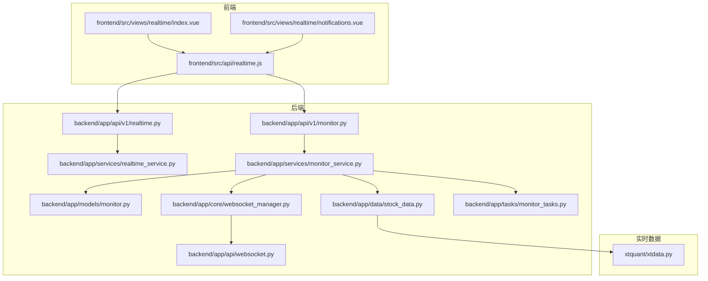
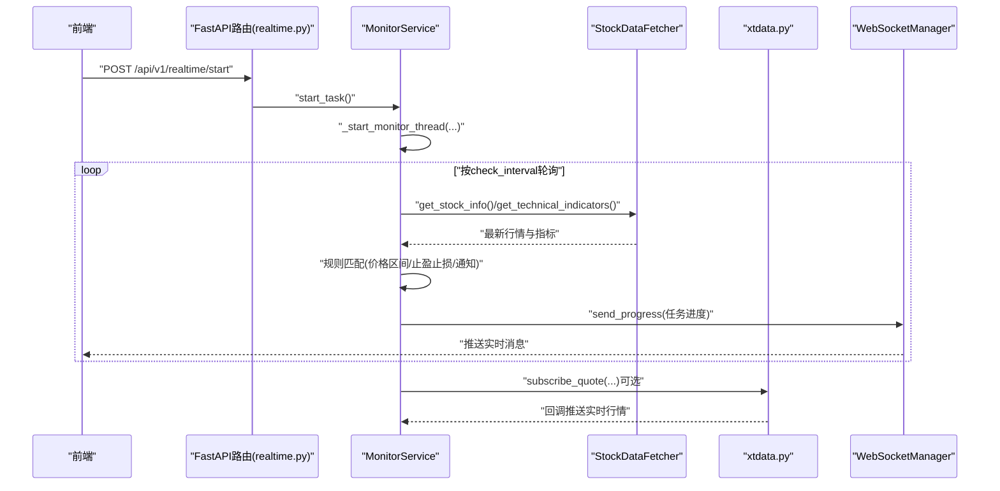
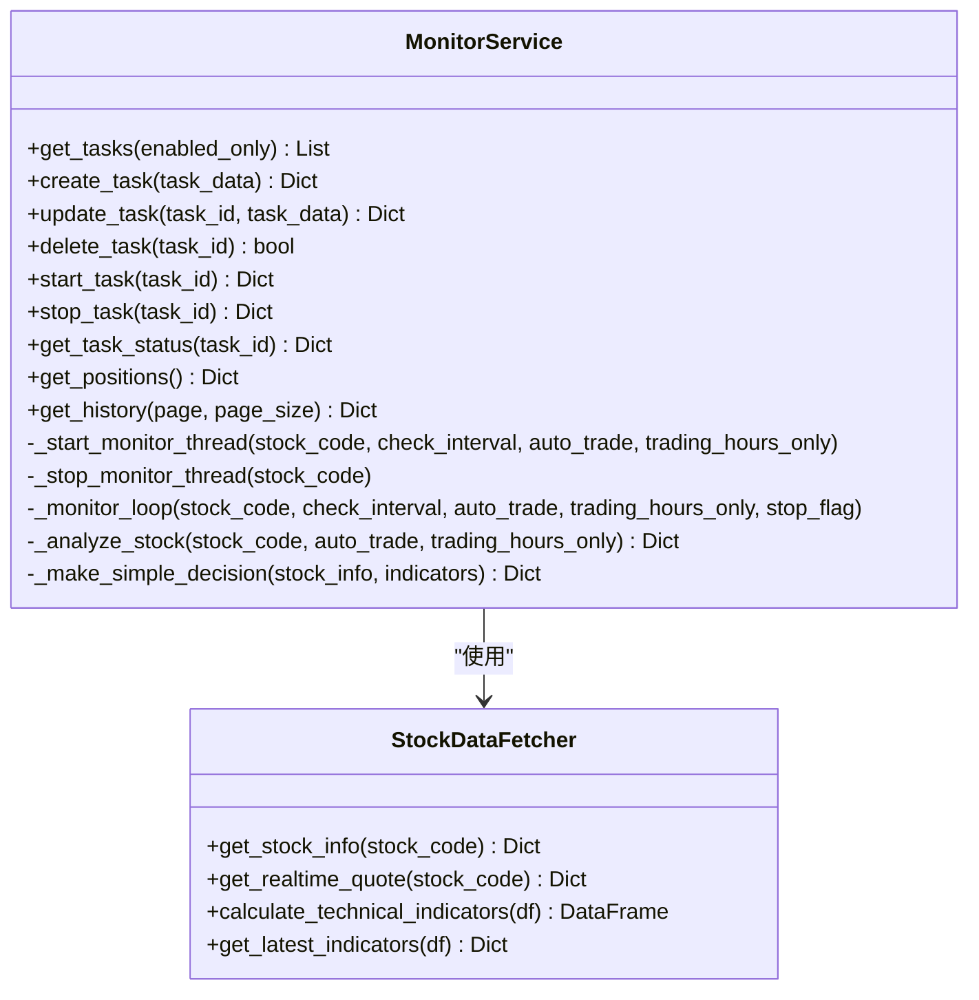
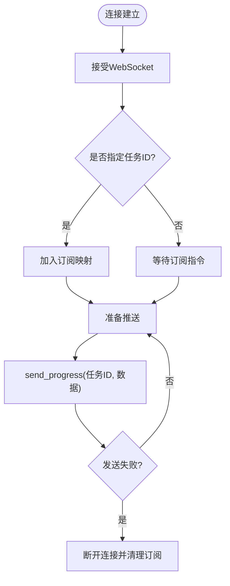
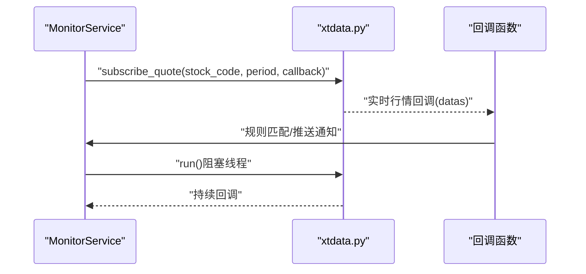
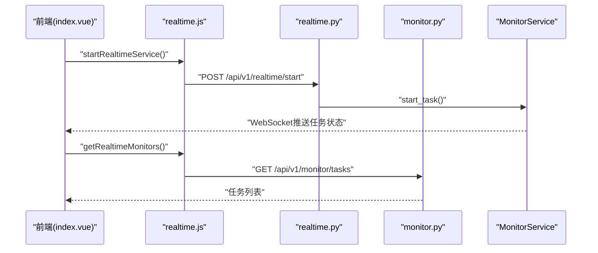
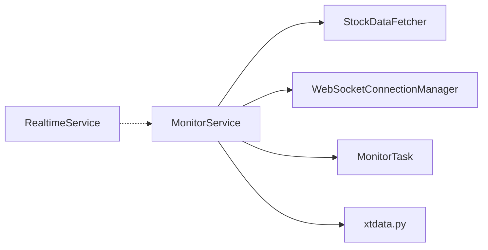

# 实时监测核心服务

<cite>
**本文引用的文件**
- [backend/app/services/realtime_service.py](file://backend/app/services/realtime_service.py)
- [backend/app/api/v1/realtime.py](file://backend/app/api/v1/realtime.py)
- [xtquant/xtdata.py](file://xtquant/xtdata.py)
- [backend/app/services/monitor_service.py](file://backend/app/services/monitor_service.py)
- [backend/app/models/monitor.py](file://backend/app/models/monitor.py)
- [backend/app/api/v1/monitor.py](file://backend/app/api/v1/monitor.py)
- [backend/app/tasks/monitor_tasks.py](file://backend/app/tasks/monitor_tasks.py)
- [backend/app/core/websocket_manager.py](file://backend/app/core/websocket_manager.py)
- [backend/app/api/websocket.py](file://backend/app/api/websocket.py)
- [backend/app/data/stock_data.py](file://backend/app/data/stock_data.py)
- [frontend/src/api/realtime.js](file://frontend/src/api/realtime.js)
- [frontend/src/views/realtime/index.vue](file://frontend/src/views/realtime/index.vue)
- [frontend/src/views/realtime/notifications.vue](file://frontend/src/views/realtime/notifications.vue)
- [docs/Webhook功能完成说明.md](file://docs/Webhook功能完成说明.md)
- [docs/前后端拆分规划文档.md](file://docs/前后端拆分规划文档.md)
</cite>

## 目录
1. [简介](#简介)
2. [项目结构](#项目结构)
3. [核心组件](#核心组件)
4. [架构总览](#架构总览)
5. [详细组件分析](#详细组件分析)
6. [依赖关系分析](#依赖关系分析)
7. [性能考虑](#性能考虑)
8. [故障排查指南](#故障排查指南)
9. [结论](#结论)
10. [附录](#附录)

## 简介
本文件围绕“实时监测核心服务”的设计与实现展开，重点说明：
- RealtimeService 如何通过 xtdata.py 对接实时行情数据源并处理高频数据流；
- 监测规则的定义与匹配机制（价格区间、技术指标触发等）；
- 服务启动/停止的生命周期管理与任务调度执行流程；
- 结合 realtime.py 中的 API 接口，描述前端如何通过 WebSocket 实现实时数据推送；
- 性能优化建议（数据缓存策略、连接池管理、异常重连机制）以保障高并发稳定性。

## 项目结构
后端采用 FastAPI + SQLAlchemy 架构，前端使用 Vue3。实时监测涉及以下关键模块：
- API 层：提供 /api/v1/realtime 与 /api/v1/monitor 接口；
- 服务层：RealtimeService（当前为占位）、MonitorService（智能盯盘与任务调度）；
- 数据层：MonitorTask 模型、StockDataFetcher（技术指标计算）；
- 实时数据层：xtdata.py 提供订阅行情、运行回调等能力；
- WebSocket 层：WebSocketConnectionManager 管理连接与订阅；
- 前端：realtime.js 调用后端接口，index.vue 与 notifications.vue 展示面板与通知历史。

图表来源
- [backend/app/api/v1/realtime.py](file://backend/app/api/v1/realtime.py#L1-L104)
- [backend/app/api/v1/monitor.py](file://backend/app/api/v1/monitor.py#L1-L135)
- [backend/app/services/realtime_service.py](file://backend/app/services/realtime_service.py#L1-L49)
- [backend/app/services/monitor_service.py](file://backend/app/services/monitor_service.py#L1-L733)
- [backend/app/models/monitor.py](file://backend/app/models/monitor.py#L1-L39)
- [backend/app/data/stock_data.py](file://backend/app/data/stock_data.py#L1-L318)
- [backend/app/core/websocket_manager.py](file://backend/app/core/websocket_manager.py#L1-L119)
- [backend/app/api/websocket.py](file://backend/app/api/websocket.py#L1-L41)
- [backend/app/tasks/monitor_tasks.py](file://backend/app/tasks/monitor_tasks.py#L1-L13)
- [xtquant/xtdata.py](file://xtquant/xtdata.py#L1-L800)

章节来源
- [backend/app/api/v1/realtime.py](file://backend/app/api/v1/realtime.py#L1-L104)
- [backend/app/api/v1/monitor.py](file://backend/app/api/v1/monitor.py#L1-L135)
- [backend/app/services/realtime_service.py](file://backend/app/services/realtime_service.py#L1-L49)
- [backend/app/services/monitor_service.py](file://backend/app/services/monitor_service.py#L1-L733)
- [backend/app/models/monitor.py](file://backend/app/models/monitor.py#L1-L39)
- [backend/app/data/stock_data.py](file://backend/app/data/stock_data.py#L1-L318)
- [backend/app/core/websocket_manager.py](file://backend/app/core/websocket_manager.py#L1-L119)
- [backend/app/api/websocket.py](file://backend/app/api/websocket.py#L1-L41)
- [backend/app/tasks/monitor_tasks.py](file://backend/app/tasks/monitor_tasks.py#L1-L13)
- [xtquant/xtdata.py](file://xtquant/xtdata.py#L1-L800)

## 核心组件
- RealtimeService：当前为占位实现，预留监测列表、创建/更新/删除监测、启动/停止服务、通知历史等接口；
- MonitorService：负责任务管理、线程调度、技术指标计算与决策（当前为简化逻辑，正式版本应接入 AI 决策）；
- MonitorTask 模型：定义监测任务字段（价格区间、止盈止损、通知开关、量化配置等）；
- StockDataFetcher：封装数据获取与技术指标计算（移动平均、MACD、RSI、布林带等）；
- WebSocketConnectionManager：管理 WebSocket 连接与订阅，向订阅者推送进度；
- xtdata.py：提供行情订阅、运行回调、连接管理等能力，是高频数据流的关键入口。

章节来源
- [backend/app/services/realtime_service.py](file://backend/app/services/realtime_service.py#L1-L49)
- [backend/app/services/monitor_service.py](file://backend/app/services/monitor_service.py#L1-L733)
- [backend/app/models/monitor.py](file://backend/app/models/monitor.py#L1-L39)
- [backend/app/data/stock_data.py](file://backend/app/data/stock_data.py#L1-L318)
- [backend/app/core/websocket_manager.py](file://backend/app/core/websocket_manager.py#L1-L119)
- [xtquant/xtdata.py](file://xtquant/xtdata.py#L1-L800)

## 架构总览
实时监测的总体流程如下：
- 前端通过 /api/v1/realtime 接口控制服务启停与查询；
- MonitorService 在独立线程中按任务配置轮询检查（当前为简化逻辑，未来接入 xtdata 实时订阅）；
- 技术指标由 StockDataFetcher 计算，结合任务配置（价格区间、止盈止损、通知开关）进行规则匹配；
- WebSocketConnectionManager 将任务状态与通知推送给前端；
- xtdata.py 提供行情订阅与回调，支撑高频数据流。

图表来源
- [backend/app/api/v1/realtime.py](file://backend/app/api/v1/realtime.py#L68-L88)
- [backend/app/services/monitor_service.py](file://backend/app/services/monitor_service.py#L518-L733)
- [backend/app/data/stock_data.py](file://backend/app/data/stock_data.py#L1-L318)
- [backend/app/core/websocket_manager.py](file://backend/app/core/websocket_manager.py#L1-L119)
- [xtquant/xtdata.py](file://xtquant/xtdata.py#L1204-L1262)

## 详细组件分析

### RealtimeService（实时监测服务）
- 当前职责：预留接口（获取监测列表、创建/更新/删除监测、启动/停止服务、通知历史）；
- 未来扩展：对接 xtdata 实时订阅，实现高频数据流处理；将规则匹配逻辑迁移到服务层。

章节来源
- [backend/app/services/realtime_service.py](file://backend/app/services/realtime_service.py#L1-L49)

### MonitorService（智能盯盘服务）
- 任务管理：创建/更新/删除任务，查询任务列表，获取任务状态；
- 生命周期：使用线程池管理每个股票的监控线程，支持启动/停止；
- 规则匹配：当前为简化逻辑（基于均线与RSI），未来应接入更复杂的规则与AI决策；
- 通知：通过 WebSocket 推送任务进度与触发事件；
- 数据获取：依赖 StockDataFetcher 获取实时行情与技术指标。

图表来源
- [backend/app/services/monitor_service.py](file://backend/app/services/monitor_service.py#L1-L733)
- [backend/app/data/stock_data.py](file://backend/app/data/stock_data.py#L1-L318)

章节来源
- [backend/app/services/monitor_service.py](file://backend/app/services/monitor_service.py#L1-L733)
- [backend/app/data/stock_data.py](file://backend/app/data/stock_data.py#L1-L318)

### MonitorTask 模型（监测任务）
- 字段覆盖：任务名称、股票代码、状态、检查间隔、自动交易、仅交易时段、进场区间、止盈止损、通知开关、量化配置（JSON）等；
- 用途：作为 MonitorService 的任务载体，驱动线程调度与规则匹配。

章节来源
- [backend/app/models/monitor.py](file://backend/app/models/monitor.py#L1-L39)

### WebSocket 管理器
- WebSocketConnectionManager：维护任务到连接的映射、订阅关系、断线清理与消息广播；
- 与旧版 ConnectionManager 的区别：支持按任务粒度订阅，适合多任务并行推送。

图表来源
- [backend/app/core/websocket_manager.py](file://backend/app/core/websocket_manager.py#L1-L119)

章节来源
- [backend/app/core/websocket_manager.py](file://backend/app/core/websocket_manager.py#L1-L119)
- [backend/app/api/websocket.py](file://backend/app/api/websocket.py#L1-L41)

### xtdata.py（实时行情数据源）
- 连接与重连：connect/reconnect/disconnect/get_client/hello；
- 订阅接口：subscribe_quote/subscribe_quote2/subscribe_whole_quote/unsubscribe_quote；
- 运行回调：run（阻塞线程接收行情回调）；
- 与 MonitorService 的集成点：在任务线程中订阅实时行情，回调中进行规则匹配与推送。

图表来源
- [xtquant/xtdata.py](file://xtquant/xtdata.py#L1204-L1262)
- [xtquant/xtdata.py](file://xtquant/xtdata.py#L1510-L1520)

章节来源
- [xtquant/xtdata.py](file://xtquant/xtdata.py#L1-L800)
- [xtquant/xtdata.py](file://xtquant/xtdata.py#L1204-L1262)
- [xtquant/xtdata.py](file://xtquant/xtdata.py#L1510-L1520)

### API 与前端交互
- 后端 API：/api/v1/realtime 提供监测启停与通知历史接口；
- 前端接口封装：frontend/src/api/realtime.js；
- 前端视图：index.vue 展示面板与操作，notifications.vue 展示通知历史（当前为占位）；
- WebSocket 客户端：docs/前后端拆分规划文档.md 提供 WebSocket 封装与重连策略。

图表来源
- [frontend/src/views/realtime/index.vue](file://frontend/src/views/realtime/index.vue#L1-L35)
- [frontend/src/views/realtime/notifications.vue](file://frontend/src/views/realtime/notifications.vue#L1-L13)
- [frontend/src/api/realtime.js](file://frontend/src/api/realtime.js#L1-L62)
- [backend/app/api/v1/realtime.py](file://backend/app/api/v1/realtime.py#L68-L88)
- [backend/app/api/v1/monitor.py](file://backend/app/api/v1/monitor.py#L1-L135)
- [backend/app/services/monitor_service.py](file://backend/app/services/monitor_service.py#L518-L733)

章节来源
- [frontend/src/views/realtime/index.vue](file://frontend/src/views/realtime/index.vue#L1-L35)
- [frontend/src/views/realtime/notifications.vue](file://frontend/src/views/realtime/notifications.vue#L1-L13)
- [frontend/src/api/realtime.js](file://frontend/src/api/realtime.js#L1-L62)
- [backend/app/api/v1/realtime.py](file://backend/app/api/v1/realtime.py#L1-L104)
- [backend/app/api/v1/monitor.py](file://backend/app/api/v1/monitor.py#L1-L135)
- [backend/app/services/monitor_service.py](file://backend/app/services/monitor_service.py#L1-L733)

## 依赖关系分析
- MonitorService 依赖 StockDataFetcher 计算技术指标；
- MonitorService 依赖 WebSocketConnectionManager 推送任务状态；
- MonitorService 与 MonitorTask 模型耦合，驱动线程调度；
- RealtimeService 与 MonitorService 并行存在，前者预留实时监测能力，后者为现有智能盯盘实现；
- xtdata.py 为高频数据流提供底层支撑，MonitorService 可通过其订阅实时行情。

图表来源
- [backend/app/services/monitor_service.py](file://backend/app/services/monitor_service.py#L1-L733)
- [backend/app/data/stock_data.py](file://backend/app/data/stock_data.py#L1-L318)
- [backend/app/core/websocket_manager.py](file://backend/app/core/websocket_manager.py#L1-L119)
- [backend/app/models/monitor.py](file://backend/app/models/monitor.py#L1-L39)
- [backend/app/services/realtime_service.py](file://backend/app/services/realtime_service.py#L1-L49)
- [xtquant/xtdata.py](file://xtquant/xtdata.py#L1-L800)

章节来源
- [backend/app/services/monitor_service.py](file://backend/app/services/monitor_service.py#L1-L733)
- [backend/app/data/stock_data.py](file://backend/app/data/stock_data.py#L1-L318)
- [backend/app/core/websocket_manager.py](file://backend/app/core/websocket_manager.py#L1-L119)
- [backend/app/models/monitor.py](file://backend/app/models/monitor.py#L1-L39)
- [backend/app/services/realtime_service.py](file://backend/app/services/realtime_service.py#L1-L49)
- [xtquant/xtdata.py](file://xtquant/xtdata.py#L1-L800)

## 性能考虑
- 数据缓存策略
  - 对高频指标（如最近 N 条 K 线）进行内存缓存，减少重复计算；
  - 缓存失效策略：基于时间窗口或增量更新，避免过期数据污染；
  - 对于 xtdata 订阅数据，可在回调中直接写入环形缓冲区，降低序列化成本。
- 连接池管理
  - xtdata 连接采用 get_client()/connect/reconnect 模式，建议：
    - 保持长连接，定期心跳检测；
    - 失败时指数退避重连，限制最大重试次数；
    - 多任务共享连接，避免重复连接导致资源浪费。
- 异常重连机制
  - WebSocket 层面：参考 docs/前后端拆分规划文档.md 的 WebSocketClient 设计，实现自动重连与最大尝试次数；
  - 后端线程：MonitorService 的监控线程应捕获异常并优雅重启，避免主线程崩溃。
- 规则匹配优化
  - 将规则表达式编译为可复用对象，减少每次匹配的开销；
  - 对热点股票采用优先级队列，保证高优先级任务的响应及时性。
- I/O 与并发
  - 使用异步 I/O 与线程池分离 CPU 密集型（指标计算）与 IO 密集型（网络请求/推送）；
  - WebSocket 广播采用批量发送与去抖策略，避免频繁小包推送。

[本节为通用指导，无需特定文件引用]

## 故障排查指南
- 行情连接失败
  - 检查 QMT/极简版是否启动，确认 xtdata.connect 返回正常；
  - 查看 hello 输出与 get_client 状态，必要时调用 reconnect。
- WebSocket 断开
  - 检查 WebSocketConnectionManager 的断线清理逻辑，确认订阅映射被正确移除；
  - 前端 WebSocketClient 应具备重连与错误上报能力。
- 任务未启动/停止
  - 确认 MonitorService 的线程池与 stop_flag 状态；
  - 检查任务状态字段与数据库一致性。
- 通知未推送
  - 确认订阅任务ID与连接映射；
  - 检查 send_progress 的消息序列化与异常捕获。

章节来源
- [xtquant/xtdata.py](file://xtquant/xtdata.py#L94-L158)
- [backend/app/core/websocket_manager.py](file://backend/app/core/websocket_manager.py#L1-L119)
- [docs/前后端拆分规划文档.md](file://docs/前后端拆分规划文档.md#L1073-L1144)

## 结论
- RealtimeService 当前为占位实现，建议尽快对接 xtdata 实时订阅，完善规则匹配与通知推送；
- MonitorService 已具备任务调度与 WebSocket 推送能力，是实时监测的核心执行体；
- 技术指标计算由 StockDataFetcher 提供，建议进一步完善指标体系与规则表达；
- 前端通过 API 与 WebSocket 实现可视化与实时反馈，需配合重连与异常处理提升稳定性。

[本节为总结，无需特定文件引用]

## 附录
- 监测规则定义与匹配机制（建议）
  - 价格突破：基于实时报价与历史区间阈值；
  - 技术指标触发：基于 MA、RSI、MACD、布林带等指标；
  - 止盈止损：基于入场价与设定比例；
  - 通知策略：Webhook/邮件/站内通知组合，支持关键词过滤与频率控制。
- 通知历史与 Webhook
  - 参考 docs/Webhook功能完成说明.md 的配置与使用场景；
  - 前端 notifications.vue 为通知历史占位页面，后续可接入历史查询与展示。

章节来源
- [docs/Webhook功能完成说明.md](file://docs/Webhook功能完成说明.md#L279-L329)
- [frontend/src/views/realtime/notifications.vue](file://frontend/src/views/realtime/notifications.vue#L1-L13)