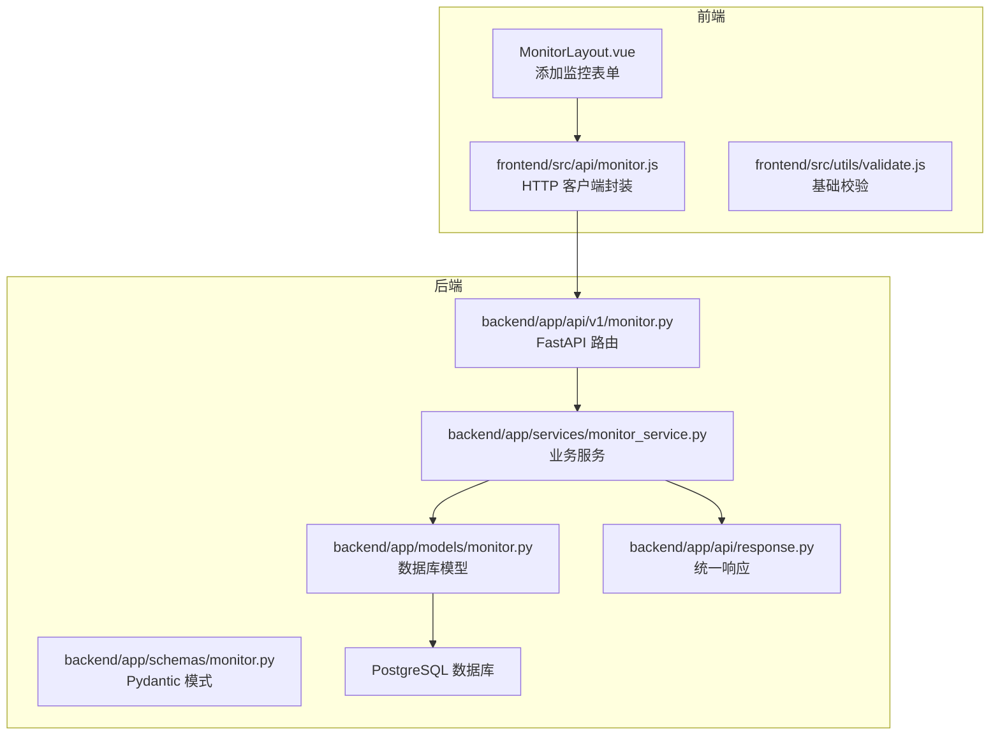
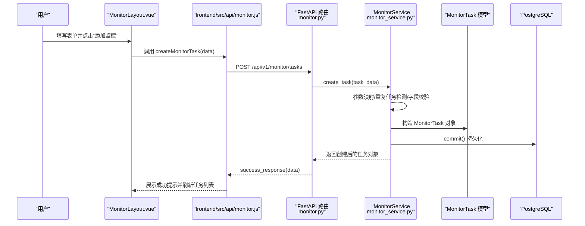
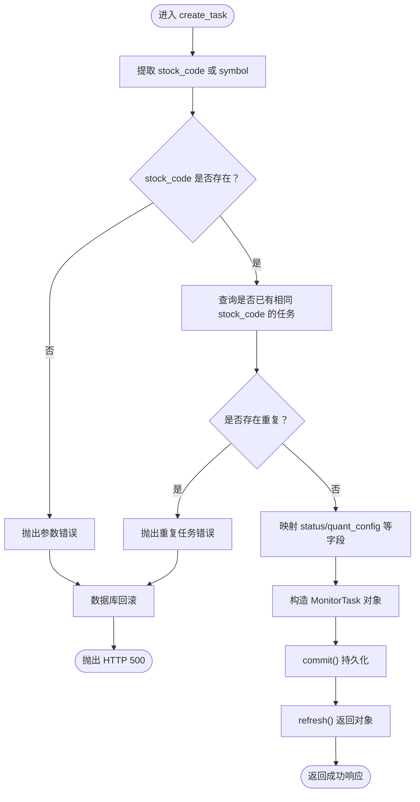
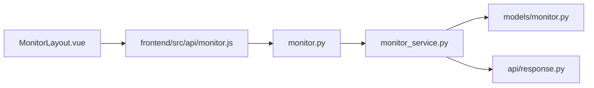

# 创建实时监测任务

<cite>
**本文引用的文件**
- [backend/app/api/v1/monitor.py](file://backend/app/api/v1/monitor.py)
- [backend/app/services/monitor_service.py](file://backend/app/services/monitor_service.py)
- [backend/app/models/monitor.py](file://backend/app/models/monitor.py)
- [backend/app/schemas/monitor.py](file://backend/app/schemas/monitor.py)
- [backend/app/api/response.py](file://backend/app/api/response.py)
- [frontend/src/views/monitor/components/MonitorLayout.vue](file://frontend/src/views/monitor/components/MonitorLayout.vue)
- [frontend/src/api/monitor.js](file://frontend/src/api/monitor.js)
- [frontend/src/utils/validate.js](file://frontend/src/utils/validate.js)
- [backend/app/utils/validators.py](file://backend/app/utils/validators.py)
- [backend/app/core/security.py](file://backend/app/core/security.py)
- [backend/test_stock_code_parsing.py](file://backend/test_stock_code_parsing.py)
- [backend/app/data/stock_data.py](file://backend/app/data/stock_data.py)
</cite>

## 目录
1. [简介](#简介)
2. [项目结构](#项目结构)
3. [核心组件](#核心组件)
4. [架构总览](#架构总览)
5. [详细组件分析](#详细组件分析)
6. [依赖关系分析](#依赖关系分析)
7. [性能考量](#性能考量)
8. [故障排查指南](#故障排查指南)
9. [结论](#结论)
10. [附录](#附录)

## 简介
本文件围绕“创建实时监测任务”的完整链路进行深入说明，覆盖前端表单设计与验证、API 请求参数结构、后端服务处理流程、股票代码解析、价格阈值校验、用户权限验证，以及任务持久化到数据库的关键步骤。文档同时给出从 Vue 组件发起请求到 FastAPI 接收并处理的端到端序列图，并解释错误处理机制（重复任务检测、非法参数拦截等）。

## 项目结构
- 后端采用 FastAPI + SQLAlchemy 架构，路由集中在 monitor.py，业务逻辑在 monitor_service.py，数据模型在 models/monitor.py，请求/响应模式在 schemas/monitor.py，统一响应封装在 api/response.py。
- 前端使用 Vue + Element UI，MonitorLayout.vue 提供“添加监控”表单，frontend/src/api/monitor.js 封装了与后端交互的 API 方法，frontend/src/utils/validate.js 提供基础校验工具。

图表来源
- [backend/app/api/v1/monitor.py](file://backend/app/api/v1/monitor.py#L1-L135)
- [backend/app/services/monitor_service.py](file://backend/app/services/monitor_service.py#L1-L200)
- [backend/app/models/monitor.py](file://backend/app/models/monitor.py#L1-L39)
- [backend/app/schemas/monitor.py](file://backend/app/schemas/monitor.py#L1-L32)
- [backend/app/api/response.py](file://backend/app/api/response.py#L1-L31)
- [frontend/src/views/monitor/components/MonitorLayout.vue](file://frontend/src/views/monitor/components/MonitorLayout.vue#L319-L436)
- [frontend/src/api/monitor.js](file://frontend/src/api/monitor.js#L1-L79)

章节来源
- [backend/app/api/v1/monitor.py](file://backend/app/api/v1/monitor.py#L1-L135)
- [frontend/src/views/monitor/components/MonitorLayout.vue](file://frontend/src/views/monitor/components/MonitorLayout.vue#L319-L436)
- [frontend/src/api/monitor.js](file://frontend/src/api/monitor.js#L1-L79)

## 核心组件
- 前端表单组件：MonitorLayout.vue 的“添加监控”面板包含股票代码、名称、监测间隔、进场区间、止盈止损、通知开关、量化配置等字段；表单规则包含股票代码必填。
- 前端 API 封装：frontend/src/api/monitor.js 提供 createMonitorTask 等方法，统一调用 /api/v1/monitor/tasks。
- 后端路由：backend/app/api/v1/monitor.py 的 POST /api/v1/monitor/tasks 接收任务创建请求。
- 业务服务：backend/app/services/monitor_service.py 的 create_task 负责参数映射、重复任务检测、字段校验、持久化与返回。
- 数据模型：backend/app/models/monitor.py 定义 MonitorTask 表结构，包含股票代码、状态、检查间隔、量化配置等字段。
- 请求/响应模式：backend/app/schemas/monitor.py 定义 MonitorTaskCreate/MonitorTaskResponse 的 Pydantic 模式。
- 统一响应：backend/app/api/response.py 提供 success_response/error_response 统一返回结构。

章节来源
- [frontend/src/views/monitor/components/MonitorLayout.vue](file://frontend/src/views/monitor/components/MonitorLayout.vue#L319-L436)
- [frontend/src/api/monitor.js](file://frontend/src/api/monitor.js#L1-L79)
- [backend/app/api/v1/monitor.py](file://backend/app/api/v1/monitor.py#L25-L36)
- [backend/app/services/monitor_service.py](file://backend/app/services/monitor_service.py#L119-L199)
- [backend/app/models/monitor.py](file://backend/app/models/monitor.py#L9-L39)
- [backend/app/schemas/monitor.py](file://backend/app/schemas/monitor.py#L9-L32)
- [backend/app/api/response.py](file://backend/app/api/response.py#L1-L31)

## 架构总览
从用户在前端表单填写并提交，到后端接收、校验、持久化，再到返回统一响应的整体流程如下：

图表来源
- [frontend/src/views/monitor/components/MonitorLayout.vue](file://frontend/src/views/monitor/components/MonitorLayout.vue#L319-L436)
- [frontend/src/api/monitor.js](file://frontend/src/api/monitor.js#L13-L18)
- [backend/app/api/v1/monitor.py](file://backend/app/api/v1/monitor.py#L25-L36)
- [backend/app/services/monitor_service.py](file://backend/app/services/monitor_service.py#L119-L199)
- [backend/app/models/monitor.py](file://backend/app/models/monitor.py#L9-L39)
- [backend/app/api/response.py](file://backend/app/api/response.py#L10-L16)

## 详细组件分析

### 前端表单设计与验证逻辑
- 表单字段与默认值：
  - 股票代码：必填，支持中/美/港股代码格式（前端未内置正则校验，后端负责解析与校验）。
  - 股票名称：可选，为空时可自动获取。
  - 监测间隔：滑块范围 5-120 分钟，默认 15 分钟。
  - 进场区间：最小值与最大值，精度两位小数。
  - 止盈/止损：数值输入框，精度两位小数。
  - 通知开关：布尔值，默认开启。
  - 量化开关：启用后弹出量化配置面板（最大仓位、自动止盈、自动止损）。
- 表单规则：
  - 股票代码必填，其余字段按需校验。
- 数据提交：
  - 调用 createMonitorTask(data)，将表单数据以 JSON 形式 POST 到 /api/v1/monitor/tasks。

章节来源
- [frontend/src/views/monitor/components/MonitorLayout.vue](file://frontend/src/views/monitor/components/MonitorLayout.vue#L319-L436)
- [frontend/src/api/monitor.js](file://frontend/src/api/monitor.js#L13-L18)
- [frontend/src/utils/validate.js](file://frontend/src/utils/validate.js#L1-L21)

### API 接口请求参数结构
- 路由：POST /api/v1/monitor/tasks
- 请求体（任务创建）：
  - 必填：stock_code（支持 symbol 或 stock_code 两种字段名）
  - 可选：task_name、stock_name、check_interval（默认 300）、auto_trade（默认 False）、trading_hours_only（默认 True）、entry_min、entry_max、take_profit、stop_loss、notification_enabled（默认 False）、quant_config（字典，将被序列化为 JSON 字符串）
- 响应体：success_response(data)，其中 data 为创建后的任务对象，包含 id、task_name、stock_code、stock_name、status、check_interval、auto_trade、trading_hours_only、entry_min、entry_max、take_profit、stop_loss、notification_enabled、quant_config、created_at 等字段。

章节来源
- [backend/app/api/v1/monitor.py](file://backend/app/api/v1/monitor.py#L25-L36)
- [backend/app/schemas/monitor.py](file://backend/app/schemas/monitor.py#L9-L32)
- [backend/app/api/response.py](file://backend/app/api/response.py#L10-L16)

### 后端服务处理新任务创建流程
- 参数映射：
  - 支持 stock_code 或 symbol 字段名，若两者都缺失则抛错。
  - status 字段映射：只有显式传入 running 才设为 running，否则为 stopped。
  - quant_config 若为字典，序列化为 JSON 字符串存入数据库。
- 重复任务检测：
  - 依据 stock_code 查询是否存在同股票代码的任务，若存在则抛错。
- 字段校验与默认值：
  - check_interval 默认 300 秒；trading_hours_only 默认 True；auto_trade 默认 False；notification_enabled 默认 False。
- 持久化：
  - 构造 MonitorTask 对象并 commit()，随后 refresh() 返回完整对象。
- 错误处理：
  - 异常捕获后回滚事务并记录日志，最终由路由层抛出 HTTP 500。

图表来源
- [backend/app/services/monitor_service.py](file://backend/app/services/monitor_service.py#L119-L199)
- [backend/app/models/monitor.py](file://backend/app/models/monitor.py#L9-L39)

章节来源
- [backend/app/services/monitor_service.py](file://backend/app/services/monitor_service.py#L119-L199)

### 股票代码解析与价格阈值校验
- 股票代码解析：
  - 前端未内置正则校验，后端通过数据获取模块（StockDataFetcher）进行解析与规范化，测试用例覆盖了中国A股、港股等格式识别与规范化。
  - 代码解析能力在测试文件中体现，确保不同后缀（如 .SH/.SZ/.HK）与短代码（如 700）能被正确识别与标准化。
- 价格阈值校验：
  - 前端提供进场区间（entry_min/entry_max）、止盈（take_profit）、止损（stop_loss）的数值输入，精度为两位小数。
  - 后端未对阈值进行额外的业务规则校验（例如 min ≤ max），具体约束以实际业务为准；若需要，可在 create_task 中增加校验逻辑并在异常中返回 400。

章节来源
- [backend/test_stock_code_parsing.py](file://backend/test_stock_code_parsing.py#L1-L89)
- [frontend/src/views/monitor/components/MonitorLayout.vue](file://frontend/src/views/monitor/components/MonitorLayout.vue#L363-L403)
- [backend/app/data/stock_data.py](file://backend/app/data/stock_data.py)

### 用户权限验证
- 当前仓库中未发现针对 monitor 路由的权限装饰器或中间件，因此默认未做用户鉴权。
- 若需启用 JWT 权限控制，可参考 core/security.py 中的 OAuth2PasswordBearer 与 token 工具，结合 FastAPI 的 Depends 在路由层注入用户身份。

章节来源
- [backend/app/core/security.py](file://backend/app/core/security.py#L1-L37)
- [backend/app/api/v1/monitor.py](file://backend/app/api/v1/monitor.py#L1-L135)

### 任务持久化到数据库
- 数据模型：MonitorTask 表包含任务名称、股票代码、状态、检查间隔、自动交易、仅交易时段监控、进场区间、止盈止损、通知开关、量化配置（JSON）等字段。
- 持久化路径：MonitorService.create_task 中构造 MonitorTask 对象后，通过 db.add() 和 db.commit() 完成持久化；返回时解析 quant_config（若存在）并返回给前端。

章节来源
- [backend/app/models/monitor.py](file://backend/app/models/monitor.py#L9-L39)
- [backend/app/services/monitor_service.py](file://backend/app/services/monitor_service.py#L154-L174)

### 错误处理机制
- 重复任务检测：若 stock_code 已存在监控任务，则抛出 ValueError，路由层捕获并返回 HTTP 500。
- 非法参数拦截：若未提供 stock_code/symbol，则抛出 ValueError，路由层捕获并返回 HTTP 500。
- 统一响应：success_response 与 error_response 提供统一的响应结构，便于前端统一处理。

章节来源
- [backend/app/services/monitor_service.py](file://backend/app/services/monitor_service.py#L130-L142)
- [backend/app/api/response.py](file://backend/app/api/response.py#L10-L30)
- [backend/app/api/v1/monitor.py](file://backend/app/api/v1/monitor.py#L25-L36)

## 依赖关系分析
- 前端依赖：
  - MonitorLayout.vue 依赖 frontend/src/api/monitor.js 发起请求。
  - 前端未直接依赖后端服务，仅通过 HTTP 接口交互。
- 后端依赖：
  - monitor.py 依赖 MonitorService。
  - MonitorService 依赖 MonitorTask 模型与数据库会话。
  - MonitorService 依赖数据获取模块（StockDataFetcher）与量化交易模块（qmt_service）。
  - 响应统一由 api/response.py 提供。

图表来源
- [frontend/src/views/monitor/components/MonitorLayout.vue](file://frontend/src/views/monitor/components/MonitorLayout.vue#L319-L436)
- [frontend/src/api/monitor.js](file://frontend/src/api/monitor.js#L1-L79)
- [backend/app/api/v1/monitor.py](file://backend/app/api/v1/monitor.py#L1-L135)
- [backend/app/services/monitor_service.py](file://backend/app/services/monitor_service.py#L1-L120)
- [backend/app/models/monitor.py](file://backend/app/models/monitor.py#L1-L39)
- [backend/app/api/response.py](file://backend/app/api/response.py#L1-L31)

章节来源
- [frontend/src/views/monitor/components/MonitorLayout.vue](file://frontend/src/views/monitor/components/MonitorLayout.vue#L319-L436)
- [frontend/src/api/monitor.js](file://frontend/src/api/monitor.js#L1-L79)
- [backend/app/api/v1/monitor.py](file://backend/app/api/v1/monitor.py#L1-L135)
- [backend/app/services/monitor_service.py](file://backend/app/services/monitor_service.py#L1-L120)
- [backend/app/models/monitor.py](file://backend/app/models/monitor.py#L1-L39)
- [backend/app/api/response.py](file://backend/app/api/response.py#L1-L31)

## 性能考量
- 监控线程管理：MonitorService 使用类级字典维护监控线程与停止标志，避免重复启动同一股票的监控线程。
- 数据获取：StockDataFetcher 作为延迟初始化的共享实例，减少重复初始化开销。
- 数据库事务：创建任务时一次性 commit()，异常时回滚，保证一致性。
- 建议：
  - 对高频请求可考虑缓存热点任务列表。
  - 对股票代码解析与数据获取可引入本地缓存与降级策略。
  - 对前端表单可增加防抖与节流，减少无效请求。

[本节为通用性能建议，无需特定文件引用]

## 故障排查指南
- 常见错误与定位：
  - 重复任务：若提示“股票代码已存在监控任务”，检查是否已有相同 stock_code 的任务，或清理旧任务后再创建。
  - 缺少参数：若提示“股票代码不能为空”，确认前端表单已填写 stock_code 或 symbol。
  - 数据库异常：查看后端日志，确认数据库连接与权限；异常时会自动回滚。
- 前端调试：
  - 检查 createMonitorTask 的调用参数是否符合后端要求。
  - 查看网络面板，确认 POST /api/v1/monitor/tasks 的响应码与消息。
- 后端调试：
  - 在 MonitorService.create_task 中增加日志输出，定位参数映射与持久化阶段的问题。
  - 如需启用权限控制，可在 monitor.py 路由层添加依赖注入与用户校验。

章节来源
- [backend/app/services/monitor_service.py](file://backend/app/services/monitor_service.py#L130-L142)
- [backend/app/api/v1/monitor.py](file://backend/app/api/v1/monitor.py#L25-L36)

## 结论
本文从前后端视角梳理了“创建实时监测任务”的完整链路：前端表单收集必要参数，后端路由接收请求，服务层完成参数映射、重复任务检测与持久化，最终返回统一响应。股票代码解析与价格阈值校验在后端完成，前端提供直观的表单与默认值。若需进一步提升安全性与健壮性，建议补充权限控制、参数校验与更完善的错误处理。

[本节为总结性内容，无需特定文件引用]

## 附录

### API 定义与示例路径
- 创建任务
  - 方法：POST
  - 路径：/api/v1/monitor/tasks
  - 请求体字段：参见“API 接口请求参数结构”
  - 成功响应：success_response(data)
  - 示例路径：[frontend/src/api/monitor.js](file://frontend/src/api/monitor.js#L13-L18)、[backend/app/api/v1/monitor.py](file://backend/app/api/v1/monitor.py#L25-L36)、[backend/app/api/response.py](file://backend/app/api/response.py#L10-L16)

章节来源
- [frontend/src/api/monitor.js](file://frontend/src/api/monitor.js#L13-L18)
- [backend/app/api/v1/monitor.py](file://backend/app/api/v1/monitor.py#L25-L36)
- [backend/app/api/response.py](file://backend/app/api/response.py#L10-L16)