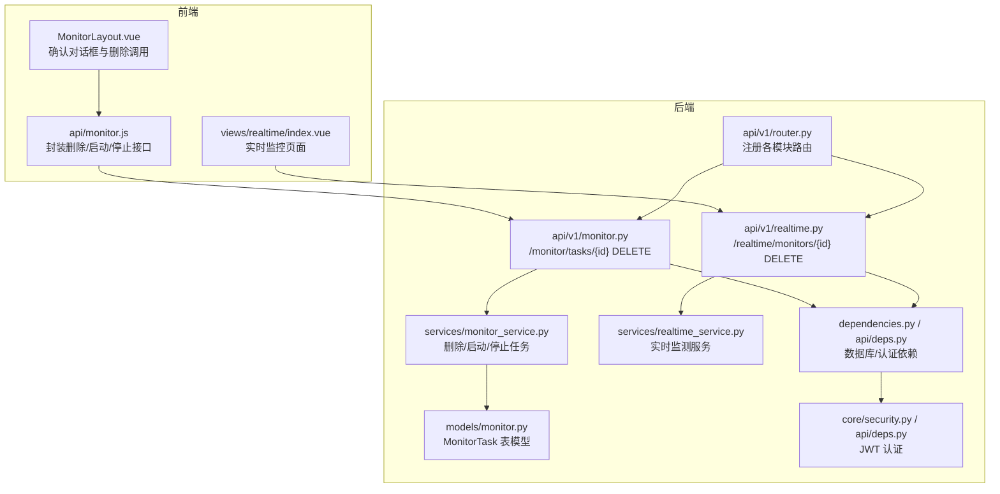
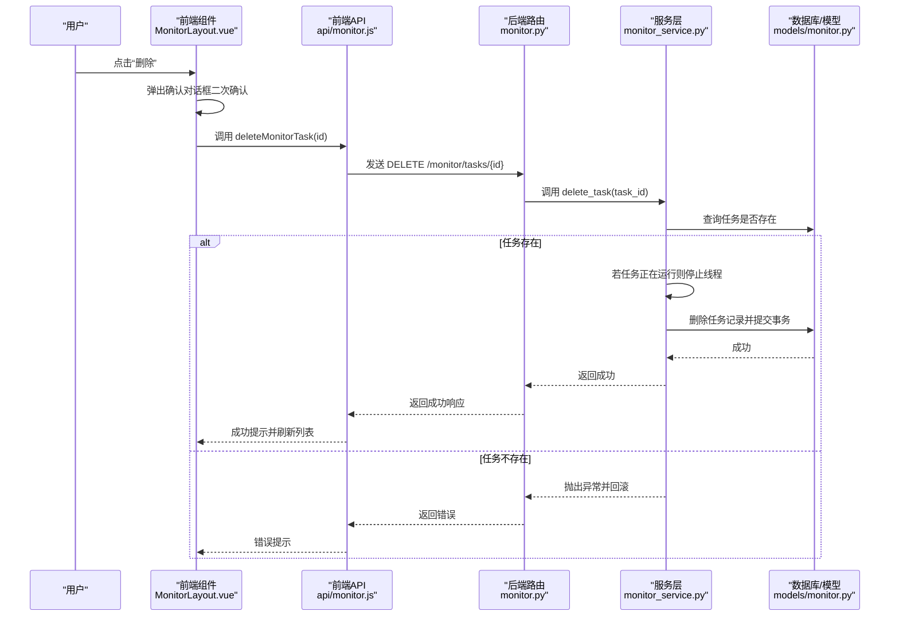
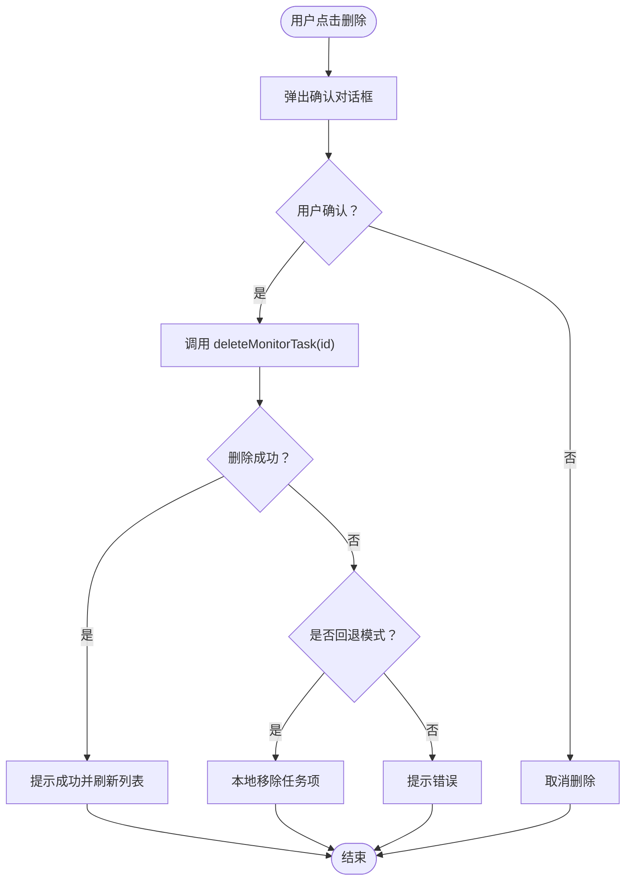
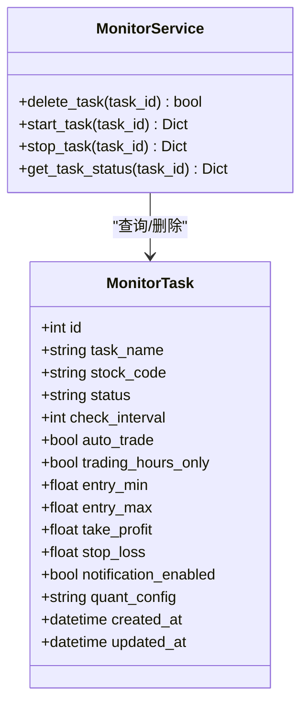
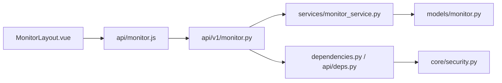

# 删除实时监测任务

<cite>
**本文引用的文件**
- [backend/app/api/v1/monitor.py](file://backend/app/api/v1/monitor.py)
- [backend/app/services/monitor_service.py](file://backend/app/services/monitor_service.py)
- [backend/app/models/monitor.py](file://backend/app/models/monitor.py)
- [frontend/src/views/monitor/components/MonitorLayout.vue](file://frontend/src/views/monitor/components/MonitorLayout.vue)
- [frontend/src/api/monitor.js](file://frontend/src/api/monitor.js)
- [frontend/src/views/realtime/index.vue](file://frontend/src/views/realtime/index.vue)
- [backend/app/api/v1/realtime.py](file://backend/app/api/v1/realtime.py)
- [backend/app/services/realtime_service.py](file://backend/app/services/realtime_service.py)
- [backend/app/api/v1/router.py](file://backend/app/api/v1/router.py)
- [backend/app/dependencies.py](file://backend/app/dependencies.py)
- [backend/app/core/security.py](file://backend/app/core/security.py)
- [backend/app/api/deps.py](file://backend/app/api/deps.py)
- [backend/alembic/versions/001_add_monitor_task_fields.py](file://backend/alembic/versions/001_add_monitor_task_fields.py)
</cite>

## 目录
1. [简介](#简介)
2. [项目结构](#项目结构)
3. [核心组件](#核心组件)
4. [架构总览](#架构总览)
5. [详细组件分析](#详细组件分析)
6. [依赖关系分析](#依赖关系分析)
7. [性能考量](#性能考量)
8. [故障排查指南](#故障排查指南)
9. [结论](#结论)

## 简介
本文件围绕“删除实时监测任务”的完整流程进行系统化文档化，覆盖前端确认对话框交互、单个与批量删除路径、后端API的安全执行（软/硬删除）、关联资源清理、调度器联动、权限控制、删除前状态检查与异常回滚机制，确保数据一致性与用户体验。

## 项目结构
- 后端采用 FastAPI + SQLAlchemy 架构，路由按模块划分，监控任务相关位于 monitor 模块；实时监测相关位于 realtime 模块。
- 前端使用 Vue3 + Element Plus，通过统一请求封装调用后端 API。

图表来源
- [backend/app/api/v1/router.py](file://backend/app/api/v1/router.py#L1-L36)
- [backend/app/api/v1/monitor.py](file://backend/app/api/v1/monitor.py#L47-L92)
- [backend/app/api/v1/realtime.py](file://backend/app/api/v1/realtime.py#L45-L86)
- [backend/app/services/monitor_service.py](file://backend/app/services/monitor_service.py#L280-L350)
- [backend/app/services/realtime_service.py](file://backend/app/services/realtime_service.py#L1-L48)
- [backend/app/models/monitor.py](file://backend/app/models/monitor.py#L1-L39)
- [backend/app/dependencies.py](file://backend/app/dependencies.py#L1-L15)
- [backend/app/api/deps.py](file://backend/app/api/deps.py#L1-L43)
- [backend/app/core/security.py](file://backend/app/core/security.py#L1-L38)
- [frontend/src/views/monitor/components/MonitorLayout.vue](file://frontend/src/views/monitor/components/MonitorLayout.vue#L932-L957)
- [frontend/src/api/monitor.js](file://frontend/src/api/monitor.js#L30-L36)
- [frontend/src/views/realtime/index.vue](file://frontend/src/views/realtime/index.vue#L586-L594)

章节来源
- [backend/app/api/v1/router.py](file://backend/app/api/v1/router.py#L1-L36)

## 核心组件
- 前端交互层
  - MonitorLayout.vue：提供删除确认对话框，调用 deleteMonitorTask 并刷新列表。
  - api/monitor.js：封装删除、启动、停止等接口。
  - realtime/index.vue：提供“移除”入口，调用删除接口。
- 后端接口层
  - monitor.py：定义 /monitor/tasks/{id} DELETE 接口，调用 MonitorService。
  - realtime.py：定义 /realtime/monitors/{id} DELETE 接口，调用 RealtimeService。
- 业务服务层
  - monitor_service.py：实现删除、启动、停止任务，包含状态检查与事务回滚。
  - realtime_service.py：实时监测服务（当前为占位，后续扩展）。
- 数据模型层
  - models/monitor.py：MonitorTask 表模型，包含任务字段与时间戳。

章节来源
- [frontend/src/views/monitor/components/MonitorLayout.vue](file://frontend/src/views/monitor/components/MonitorLayout.vue#L932-L957)
- [frontend/src/api/monitor.js](file://frontend/src/api/monitor.js#L30-L36)
- [frontend/src/views/realtime/index.vue](file://frontend/src/views/realtime/index.vue#L586-L594)
- [backend/app/api/v1/monitor.py](file://backend/app/api/v1/monitor.py#L47-L92)
- [backend/app/api/v1/realtime.py](file://backend/app/api/v1/realtime.py#L45-L86)
- [backend/app/services/monitor_service.py](file://backend/app/services/monitor_service.py#L280-L350)
- [backend/app/services/realtime_service.py](file://backend/app/services/realtime_service.py#L1-L48)
- [backend/app/models/monitor.py](file://backend/app/models/monitor.py#L1-L39)

## 架构总览
删除实时监测任务的端到端流程如下：

图表来源
- [frontend/src/views/monitor/components/MonitorLayout.vue](file://frontend/src/views/monitor/components/MonitorLayout.vue#L932-L957)
- [frontend/src/api/monitor.js](file://frontend/src/api/monitor.js#L30-L36)
- [backend/app/api/v1/monitor.py](file://backend/app/api/v1/monitor.py#L47-L92)
- [backend/app/services/monitor_service.py](file://backend/app/services/monitor_service.py#L280-L350)
- [backend/app/models/monitor.py](file://backend/app/models/monitor.py#L1-L39)

## 详细组件分析

### 前端确认对话框与交互
- 确认对话框
  - 使用 Element Plus 的 $confirm 弹窗，文案明确“删除后无法恢复”，类型为 warning。
  - 确认后才调用删除方法，取消则不执行。
- 删除调用
  - MonitorLayout.vue 中 confirmDeleteTask(task) 触发删除，handleDeleteTask(task) 调用 deleteMonitorTask。
  - 删除成功后提示“任务已删除”，并重新加载任务列表。
  - 失败时根据是否处于回退模式（tasksFallback）决定本地回滚或提示错误。
- 实时监控页面
  - realtime/index.vue 提供 handleRemove(task) 作为“移除”入口，内部同样调用 deleteMonitorTask 并刷新。

图表来源
- [frontend/src/views/monitor/components/MonitorLayout.vue](file://frontend/src/views/monitor/components/MonitorLayout.vue#L932-L957)
- [frontend/src/views/realtime/index.vue](file://frontend/src/views/realtime/index.vue#L586-L594)
- [frontend/src/api/monitor.js](file://frontend/src/api/monitor.js#L30-L36)

章节来源
- [frontend/src/views/monitor/components/MonitorLayout.vue](file://frontend/src/views/monitor/components/MonitorLayout.vue#L932-L957)
- [frontend/src/views/realtime/index.vue](file://frontend/src/views/realtime/index.vue#L586-L594)
- [frontend/src/api/monitor.js](file://frontend/src/api/monitor.js#L30-L36)

### 后端API与服务层删除逻辑
- 路由与依赖
  - monitor.py 定义 DELETE /monitor/tasks/{id}，依赖数据库会话 get_database。
  - 路由注册由 api/v1/router.py 完成。
- 服务层删除
  - MonitorService.delete_task(task_id)：
    - 校验任务是否存在，不存在则抛错。
    - 若任务正在运行（依据 _monitoring_threads），先停止对应监控线程。
    - 执行删除并提交事务；异常时回滚并记录日志。
- 数据模型
  - MonitorTask 包含任务基础字段与时间戳，用于状态与审计。

图表来源
- [backend/app/models/monitor.py](file://backend/app/models/monitor.py#L1-L39)
- [backend/app/services/monitor_service.py](file://backend/app/services/monitor_service.py#L280-L350)

章节来源
- [backend/app/api/v1/monitor.py](file://backend/app/api/v1/monitor.py#L47-L92)
- [backend/app/services/monitor_service.py](file://backend/app/services/monitor_service.py#L280-L350)
- [backend/app/models/monitor.py](file://backend/app/models/monitor.py#L1-L39)
- [backend/app/api/v1/router.py](file://backend/app/api/v1/router.py#L1-L36)
- [backend/app/dependencies.py](file://backend/app/dependencies.py#L1-L15)

### 批量删除与单个删除路径
- 单个删除
  - 前端：MonitorLayout.vue 的 confirmDeleteTask -> handleDeleteTask -> deleteMonitorTask。
  - 后端：monitor.py DELETE /monitor/tasks/{id} -> MonitorService.delete_task。
- 批量删除
  - 当前仓库未提供后端批量删除接口（/monitor/tasks?ids=...）。若需实现，建议：
    - 在 monitor.py 新增 POST /monitor/tasks/delete-batch 接口，接收 id 数组。
    - 在 MonitorService 中循环校验与删除，统一事务提交/回滚。
    - 前端在 MonitorLayout.vue 中增加多选与批量删除按钮，调用新增接口。
  - 说明：本节为概念性扩展，非现有实现，故不附带具体代码片段。

章节来源
- [frontend/src/views/monitor/components/MonitorLayout.vue](file://frontend/src/views/monitor/components/MonitorLayout.vue#L932-L957)
- [frontend/src/api/monitor.js](file://frontend/src/api/monitor.js#L30-L36)
- [backend/app/api/v1/monitor.py](file://backend/app/api/v1/monitor.py#L47-L92)

### 权限控制与认证
- 认证方案
  - 后端使用 OAuth2PasswordBearer，JWT 密钥与算法在 core/config 中配置。
  - api/deps.py 提供 get_current_user(token) 依赖，当前简化实现返回 payload。
- 建议
  - 在 monitor.py 的 DELETE /monitor/tasks/{id} 路由上增加 get_current_user 依赖，以校验用户身份。
  - 结合角色/权限模型对任务归属进行鉴权（如仅任务创建者或管理员可删）。

章节来源
- [backend/app/core/security.py](file://backend/app/core/security.py#L1-L38)
- [backend/app/api/deps.py](file://backend/app/api/deps.py#L1-L43)

### 删除前状态检查与异常回滚
- 状态检查
  - MonitorService.delete_task(task_id) 会检查任务是否存在；若任务正在运行（stock_code 在 _monitoring_threads），先停止对应监控线程，避免资源泄漏。
- 异常回滚
  - 服务层捕获异常后执行 self.db.rollback()，保证事务一致性。
  - 日志记录错误信息，便于排查。

章节来源
- [backend/app/services/monitor_service.py](file://backend/app/services/monitor_service.py#L280-L350)

### 关联资源清理与调度器联动
- 关联资源
  - MonitorTask 模型包含多个字段（入场区间、止盈止损、通知开关、量化配置等），删除任务即清理这些配置。
- 调度器联动
  - 当前 MonitorService.delete_task 仅删除数据库记录，未显式通知调度器移除任务。
  - 建议在删除后同步更新调度器内部任务映射（如移除 stock_code 对应的监控线程），确保不再触发。
  - 若存在定时调度器模块，可在删除后调用调度器的 remove_task 或类似方法。

章节来源
- [backend/app/models/monitor.py](file://backend/app/models/monitor.py#L1-L39)
- [backend/app/services/monitor_service.py](file://backend/app/services/monitor_service.py#L280-L350)

### 数据库迁移与字段演进
- 字段演进
  - alembic/versions/001_add_monitor_task_fields.py 为 monitor_tasks 表添加了进场区间、止盈止损、通知开关、量化配置等字段。
- 影响
  - 删除任务时，这些字段随记录一并清理，无需额外清理逻辑。

章节来源
- [backend/alembic/versions/001_add_monitor_task_fields.py](file://backend/alembic/versions/001_add_monitor_task_fields.py#L1-L43)

## 依赖关系分析
- 组件耦合
  - 前端 MonitorLayout.vue 与 api/monitor.js 耦合度低，便于替换或扩展。
  - 后端 monitor.py 与 monitor_service.py 通过依赖注入解耦，便于测试与维护。
- 外部依赖
  - 数据库：SQLAlchemy ORM + Session。
  - 认证：FastAPI OAuth2 + JWT。
- 循环依赖
  - 未发现明显循环导入；MonitorService 与 MonitorTask 为单向依赖。

图表来源
- [frontend/src/views/monitor/components/MonitorLayout.vue](file://frontend/src/views/monitor/components/MonitorLayout.vue#L932-L957)
- [frontend/src/api/monitor.js](file://frontend/src/api/monitor.js#L30-L36)
- [backend/app/api/v1/monitor.py](file://backend/app/api/v1/monitor.py#L47-L92)
- [backend/app/services/monitor_service.py](file://backend/app/services/monitor_service.py#L280-L350)
- [backend/app/models/monitor.py](file://backend/app/models/monitor.py#L1-L39)
- [backend/app/dependencies.py](file://backend/app/dependencies.py#L1-L15)
- [backend/app/api/deps.py](file://backend/app/api/deps.py#L1-L43)
- [backend/app/core/security.py](file://backend/app/core/security.py#L1-L38)

## 性能考量
- 删除操作复杂度
  - 查询与删除均为 O(1)（按主键 id），性能开销极小。
- 并发与线程
  - 若同一 stock_code 的监控线程正在运行，删除前先停止，避免长时间阻塞。
- 事务与回滚
  - 删除在事务内执行，异常时回滚，保障一致性。

[本节为通用指导，不涉及具体文件分析]

## 故障排查指南
- 常见问题
  - 删除失败：检查任务是否存在、是否正在运行、网络/数据库异常。
  - 前端无反馈：确认前端 deleteMonitorTask 调用链是否正确，控制台是否有错误。
  - 权限错误：确认 JWT 令牌有效，后端是否启用用户鉴权依赖。
- 排查步骤
  - 后端：查看 MonitorService.delete_task 的日志输出与异常栈。
  - 前端：确认 $confirm 是否被触发，deleteMonitorTask 是否返回成功。
  - 数据库：确认 MonitorTask 记录是否被删除，相关字段是否清理。

章节来源
- [backend/app/services/monitor_service.py](file://backend/app/services/monitor_service.py#L280-L350)
- [frontend/src/views/monitor/components/MonitorLayout.vue](file://frontend/src/views/monitor/components/MonitorLayout.vue#L932-L957)
- [frontend/src/api/monitor.js](file://frontend/src/api/monitor.js#L30-L36)

## 结论
- 删除实时监测任务的端到端流程清晰：前端二次确认 -> 调用后端 DELETE 接口 -> 服务层校验与停止运行中的任务 -> 删除记录并提交事务 -> 前端刷新列表。
- 当前实现具备基本的安全性（存在性检查、异常回滚）与一致性（事务），但缺少权限控制与调度器联动清理。
- 建议补充点：
  - 后端路由增加用户鉴权依赖；
  - 删除后同步清理调度器内部任务映射；
  - 如需批量删除，新增后端接口与前端交互。