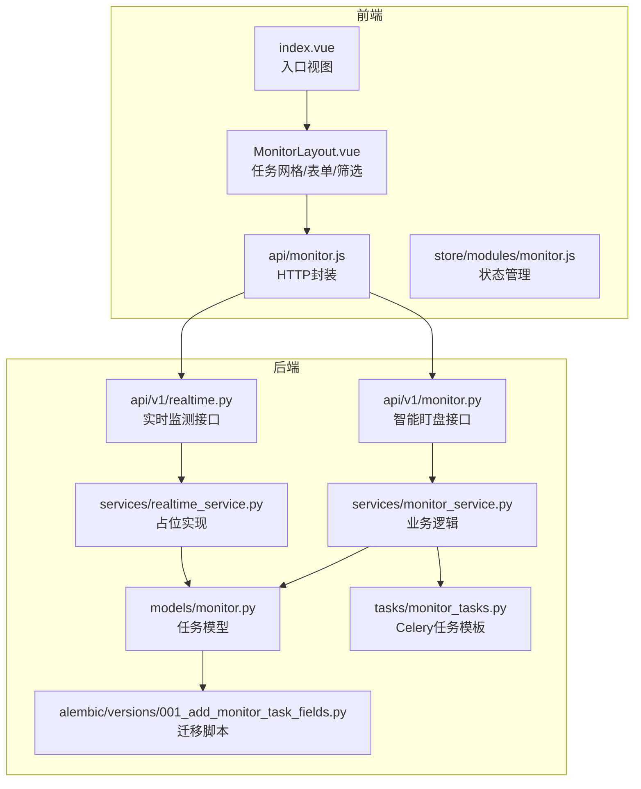
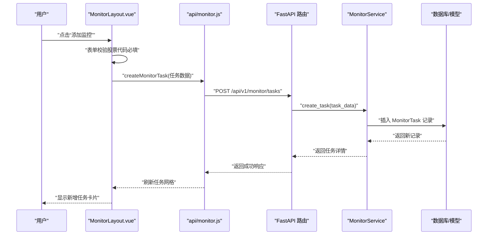
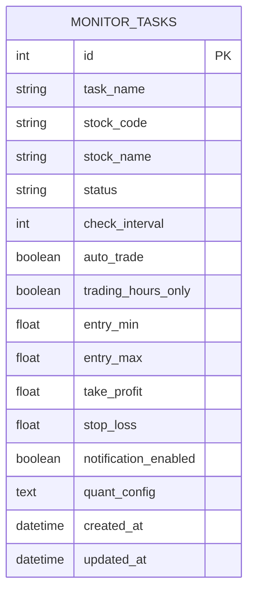
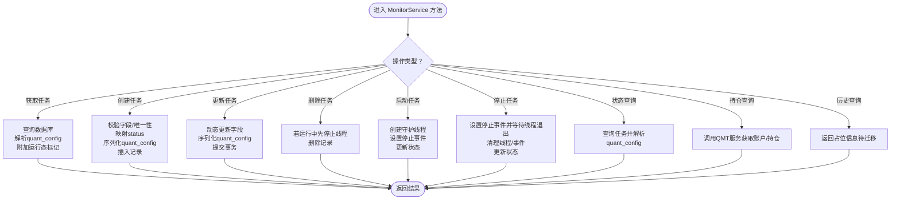
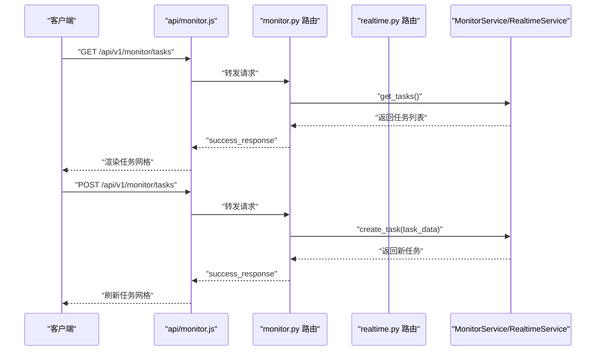
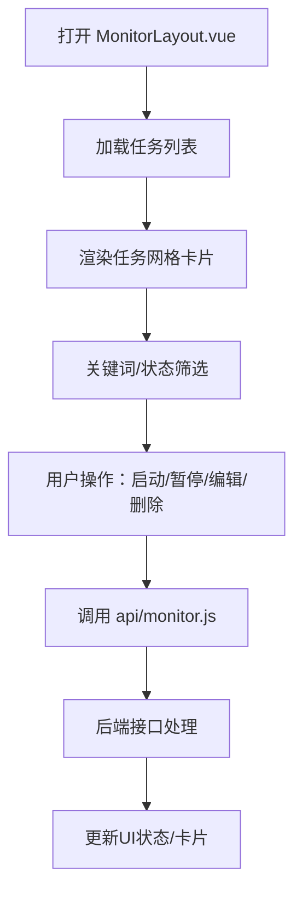
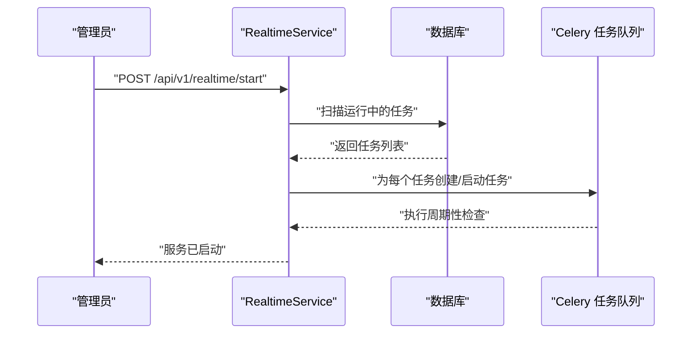
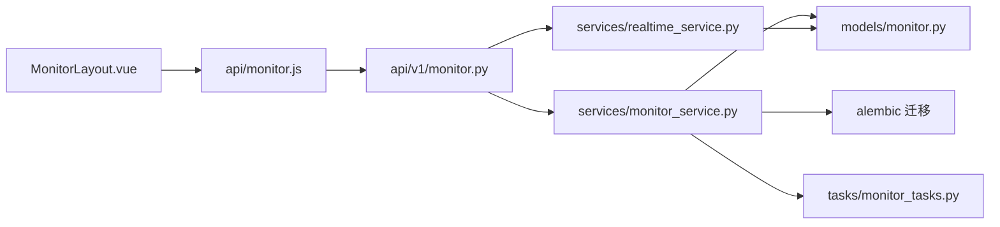

# 实时监测管理

<cite>
**本文引用的文件**
- [backend/app/api/v1/monitor.py](file://backend/app/api/v1/monitor.py)
- [backend/app/api/v1/realtime.py](file://backend/app/api/v1/realtime.py)
- [backend/app/services/monitor_service.py](file://backend/app/services/monitor_service.py)
- [backend/app/services/realtime_service.py](file://backend/app/services/realtime_service.py)
- [backend/app/models/monitor.py](file://backend/app/models/monitor.py)
- [backend/app/schemas/monitor.py](file://backend/app/schemas/monitor.py)
- [backend/app/db/monitor_db.py](file://backend/app/db/monitor_db.py)
- [backend/alembic/versions/001_add_monitor_task_fields.py](file://backend/alembic/versions/001_add_monitor_task_fields.py)
- [backend/app/tasks/monitor_tasks.py](file://backend/app/tasks/monitor_tasks.py)
- [frontend/src/views/monitor/index.vue](file://frontend/src/views/monitor/index.vue)
- [frontend/src/views/monitor/components/MonitorLayout.vue](file://frontend/src/views/monitor/components/MonitorLayout.vue)
- [frontend/src/api/monitor.js](file://frontend/src/api/monitor.js)
- [frontend/src/store/modules/monitor.js](file://frontend/src/store/modules/monitor.js)
</cite>

## 目录
1. [简介](#简介)
2. [项目结构](#项目结构)
3. [核心组件](#核心组件)
4. [架构总览](#架构总览)
5. [详细组件分析](#详细组件分析)
6. [依赖关系分析](#依赖关系分析)
7. [性能考量](#性能考量)
8. [故障排查指南](#故障排查指南)
9. [结论](#结论)
10. [附录](#附录)

## 简介
本文件围绕“实时监测管理”功能，系统性阐述如何通过后端服务与前端界面协同，完成监测任务的全生命周期管理（创建、读取、更新、删除）。文档重点覆盖：
- 监测任务数据模型设计与字段语义
- 前端表单校验、任务网格布局与筛选过滤
- API 接口调用链路与后端数据持久化流程
- 实时监测服务的启动/停止与任务线程管理
- 通知历史与历史记录的现状与扩展方向

## 项目结构
该功能横跨前后端与数据库层，主要涉及以下模块：
- 后端
  - API 层：提供 REST 接口，分别在智能盯盘与实时监测两个路由下暴露 CRUD 与状态控制能力
  - 服务层：MonitorService 负责业务逻辑与数据库交互；RealtimeService 当前为占位实现
  - 模型与迁移：MonitorTask 模型及 Alembic 迁移脚本定义了进场区间、止盈止损、通知与量化配置等字段
  - 任务调度：Celery 任务模板预留
- 前端
  - MonitorLayout 组件承载任务网格、筛选、表单与通知历史等交互
  - API 封装统一调用后端接口
  - Vuex Store 提供状态管理

图表来源
- [frontend/src/views/monitor/index.vue](file://frontend/src/views/monitor/index.vue#L1-L14)
- [frontend/src/views/monitor/components/MonitorLayout.vue](file://frontend/src/views/monitor/components/MonitorLayout.vue#L1-L120)
- [frontend/src/api/monitor.js](file://frontend/src/api/monitor.js#L1-L79)
- [backend/app/api/v1/monitor.py](file://backend/app/api/v1/monitor.py#L1-L135)
- [backend/app/api/v1/realtime.py](file://backend/app/api/v1/realtime.py#L1-L104)
- [backend/app/services/monitor_service.py](file://backend/app/services/monitor_service.py#L1-L120)
- [backend/app/services/realtime_service.py](file://backend/app/services/realtime_service.py#L1-L49)
- [backend/app/models/monitor.py](file://backend/app/models/monitor.py#L1-L39)
- [backend/alembic/versions/001_add_monitor_task_fields.py](file://backend/alembic/versions/001_add_monitor_task_fields.py#L1-L44)
- [backend/app/tasks/monitor_tasks.py](file://backend/app/tasks/monitor_tasks.py#L1-L13)

章节来源
- [frontend/src/views/monitor/index.vue](file://frontend/src/views/monitor/index.vue#L1-L14)
- [frontend/src/views/monitor/components/MonitorLayout.vue](file://frontend/src/views/monitor/components/MonitorLayout.vue#L1-L120)
- [frontend/src/api/monitor.js](file://frontend/src/api/monitor.js#L1-L79)
- [backend/app/api/v1/monitor.py](file://backend/app/api/v1/monitor.py#L1-L135)
- [backend/app/api/v1/realtime.py](file://backend/app/api/v1/realtime.py#L1-L104)
- [backend/app/services/monitor_service.py](file://backend/app/services/monitor_service.py#L1-L120)
- [backend/app/services/realtime_service.py](file://backend/app/services/realtime_service.py#L1-L49)
- [backend/app/models/monitor.py](file://backend/app/models/monitor.py#L1-L39)
- [backend/alembic/versions/001_add_monitor_task_fields.py](file://backend/alembic/versions/001_add_monitor_task_fields.py#L1-L44)
- [backend/app/tasks/monitor_tasks.py](file://backend/app/tasks/monitor_tasks.py#L1-L13)

## 核心组件
- 数据模型（MonitorTask）
  - 关键字段：股票代码、股票名称、任务状态、检查间隔、是否自动交易、仅交易时段监控、进场区间、止盈止损、通知开关、量化配置（JSON）、创建/更新时间
  - 字段语义与约束：部分字段允许为空，如进场区间与止盈止损；通知默认关闭；量化配置以文本存储，便于灵活扩展
- 服务层（MonitorService）
  - 提供任务 CRUD、启动/停止、状态查询、持仓查询、历史查询等能力
  - 使用 SQLAlchemy 查询与事务管理，支持 JSON 字段解析与序列化
  - 内置线程池管理监控任务的运行/停止，维护运行状态标记
- API 层（monitor.py 与 realtime.py）
  - monitor.py：提供智能盯盘相关接口（任务 CRUD、启动/停止、状态、持仓、历史）
  - realtime.py：提供实时监测相关接口（监测 CRUD、服务启动/停止、通知历史）
- 前端组件（MonitorLayout.vue）
  - 任务网格布局：按卡片形式展示任务，包含状态标签、止盈止损、通知状态、量化配置摘要等
  - 表单校验：股票代码必填，滑条/数值输入限制范围
  - 筛选过滤：关键词（股票代码/名称/任务名）与状态筛选
  - 交互动作：启动/暂停、编辑、删除、刷新、批量启动/暂停

章节来源
- [backend/app/models/monitor.py](file://backend/app/models/monitor.py#L1-L39)
- [backend/app/schemas/monitor.py](file://backend/app/schemas/monitor.py#L1-L32)
- [backend/app/services/monitor_service.py](file://backend/app/services/monitor_service.py#L65-L204)
- [backend/app/api/v1/monitor.py](file://backend/app/api/v1/monitor.py#L14-L135)
- [backend/app/api/v1/realtime.py](file://backend/app/api/v1/realtime.py#L14-L104)
- [frontend/src/views/monitor/components/MonitorLayout.vue](file://frontend/src/views/monitor/components/MonitorLayout.vue#L170-L320)

## 架构总览
整体采用“前端组件 + API 封装 + 服务层 + 数据库”的分层架构。前端通过 MonitorLayout.vue 调用 api/monitor.js，后端在 FastAPI 中注册路由，服务层负责业务处理与数据库交互，模型定义数据结构与约束。

图表来源
- [frontend/src/views/monitor/components/MonitorLayout.vue](file://frontend/src/views/monitor/components/MonitorLayout.vue#L319-L436)
- [frontend/src/api/monitor.js](file://frontend/src/api/monitor.js#L13-L19)
- [backend/app/api/v1/monitor.py](file://backend/app/api/v1/monitor.py#L25-L37)
- [backend/app/services/monitor_service.py](file://backend/app/services/monitor_service.py#L119-L204)
- [backend/app/models/monitor.py](file://backend/app/models/monitor.py#L1-L39)

## 详细组件分析

### 数据模型与迁移
- MonitorTask 模型
  - 字段覆盖：任务标识、股票标识、状态、检查周期、自动交易、仅交易时段、进场区间、止盈止损、通知开关、量化配置、时间戳
  - 约束与索引：股票代码建立索引，便于唯一性与查询优化
- Alembic 迁移
  - 新增进场区间、止盈止损、通知开关、量化配置（JSON）字段，支持后续扩展

图表来源
- [backend/app/models/monitor.py](file://backend/app/models/monitor.py#L1-L39)
- [backend/alembic/versions/001_add_monitor_task_fields.py](file://backend/alembic/versions/001_add_monitor_task_fields.py#L19-L44)

章节来源
- [backend/app/models/monitor.py](file://backend/app/models/monitor.py#L1-L39)
- [backend/alembic/versions/001_add_monitor_task_fields.py](file://backend/alembic/versions/001_add_monitor_task_fields.py#L19-L44)

### 服务层：MonitorService 全生命周期
- 读取（获取任务列表）
  - 支持按状态筛选与倒序排序，解析 JSON 量化配置，附加运行态标记
- 创建（新增任务）
  - 字段映射：兼容 stock_code 与 symbol；校验唯一性；status 归一化；量化配置序列化
- 更新（修改任务）
  - 动态更新字段；JSON 配置序列化；更新时间戳
- 删除（移除任务）
  - 若任务正在运行，先停止对应监控线程；再删除记录
- 启动/停止（任务线程）
  - 启动：创建守护线程，设置停止事件；更新任务状态
  - 停止：设置停止事件并等待线程退出；清理线程与停止事件
- 状态查询
  - 返回任务完整信息，含运行态标记与解析后的量化配置
- 持仓查询
  - 通过 QMT 服务获取账户与持仓信息，兼容连接失败场景
- 历史查询
  - 当前返回占位信息，提示迁移进度

图表来源
- [backend/app/services/monitor_service.py](file://backend/app/services/monitor_service.py#L65-L204)
- [backend/app/services/monitor_service.py](file://backend/app/services/monitor_service.py#L281-L389)
- [backend/app/services/monitor_service.py](file://backend/app/services/monitor_service.py#L390-L437)
- [backend/app/services/monitor_service.py](file://backend/app/services/monitor_service.py#L438-L484)
- [backend/app/services/monitor_service.py](file://backend/app/services/monitor_service.py#L485-L517)
- [backend/app/services/monitor_service.py](file://backend/app/services/monitor_service.py#L518-L608)

章节来源
- [backend/app/services/monitor_service.py](file://backend/app/services/monitor_service.py#L65-L204)
- [backend/app/services/monitor_service.py](file://backend/app/services/monitor_service.py#L281-L389)
- [backend/app/services/monitor_service.py](file://backend/app/services/monitor_service.py#L390-L437)
- [backend/app/services/monitor_service.py](file://backend/app/services/monitor_service.py#L438-L484)
- [backend/app/services/monitor_service.py](file://backend/app/services/monitor_service.py#L485-L517)
- [backend/app/services/monitor_service.py](file://backend/app/services/monitor_service.py#L518-L608)

### API 层：REST 接口与调用链
- monitor.py（智能盯盘）
  - GET /tasks：获取任务列表
  - POST /tasks：创建任务
  - PUT /tasks/{task_id}：更新任务
  - DELETE /tasks/{task_id}：删除任务
  - POST /tasks/{task_id}/start：启动任务
  - POST /tasks/{task_id}/stop：停止任务
  - GET /tasks/{task_id}/status：获取任务状态
  - GET /positions：获取持仓
  - GET /history：获取历史
- realtime.py（实时监测）
  - GET /monitors：获取监测列表
  - POST /monitors：创建监测
  - PUT /monitors/{monitor_id}：更新监测
  - DELETE /monitors/{monitor_id}：删除监测
  - POST /start：启动监测服务
  - POST /stop：停止监测服务
  - GET /notifications：通知历史

图表来源
- [frontend/src/api/monitor.js](file://frontend/src/api/monitor.js#L1-L79)
- [backend/app/api/v1/monitor.py](file://backend/app/api/v1/monitor.py#L14-L135)
- [backend/app/api/v1/realtime.py](file://backend/app/api/v1/realtime.py#L14-L104)
- [backend/app/services/monitor_service.py](file://backend/app/services/monitor_service.py#L65-L118)
- [backend/app/services/realtime_service.py](file://backend/app/services/realtime_service.py#L14-L48)

章节来源
- [frontend/src/api/monitor.js](file://frontend/src/api/monitor.js#L1-L79)
- [backend/app/api/v1/monitor.py](file://backend/app/api/v1/monitor.py#L14-L135)
- [backend/app/api/v1/realtime.py](file://backend/app/api/v1/realtime.py#L14-L104)
- [backend/app/services/monitor_service.py](file://backend/app/services/monitor_service.py#L65-L118)
- [backend/app/services/realtime_service.py](file://backend/app/services/realtime_service.py#L14-L48)

### 前端：任务网格布局与交互
- 任务网格
  - 卡片展示：股票代码/名称、状态标签、监测间隔、通知状态、止盈止损、量化配置摘要、创建/更新时间
  - 操作按钮：启动、暂停、编辑、删除
- 表单校验
  - 股票代码必填；滑条/数值输入限制范围；量化配置开关展开后可配置最大仓位与自动止盈止损
- 筛选与过滤
  - 关键词输入框（支持股票代码/名称/任务名）与状态下拉筛选
- 通知与历史
  - 通知时间线与历史记录区域，当前历史接口返回占位信息

图表来源
- [frontend/src/views/monitor/components/MonitorLayout.vue](file://frontend/src/views/monitor/components/MonitorLayout.vue#L170-L320)
- [frontend/src/views/monitor/components/MonitorLayout.vue](file://frontend/src/views/monitor/components/MonitorLayout.vue#L319-L436)
- [frontend/src/api/monitor.js](file://frontend/src/api/monitor.js#L1-L79)

章节来源
- [frontend/src/views/monitor/components/MonitorLayout.vue](file://frontend/src/views/monitor/components/MonitorLayout.vue#L170-L320)
- [frontend/src/views/monitor/components/MonitorLayout.vue](file://frontend/src/views/monitor/components/MonitorLayout.vue#L319-L436)
- [frontend/src/api/monitor.js](file://frontend/src/api/monitor.js#L1-L79)

### 实时监测服务（RealtimeService）现状与扩展
- 当前实现
  - 占位方法：获取监测列表、创建/更新/删除监测、启动/停止服务、通知历史
- 建议扩展方向
  - 引入 Celery 定时任务队列，将每个 MonitorTask 转换为后台任务
  - 在服务启动时扫描数据库，为每个运行中的任务创建 Celery 任务
  - 任务执行周期与检查间隔一致，支持交易时段过滤
  - 任务状态与数据库同步，失败重试与告警

图表来源
- [backend/app/api/v1/realtime.py](file://backend/app/api/v1/realtime.py#L68-L88)
- [backend/app/services/realtime_service.py](file://backend/app/services/realtime_service.py#L34-L42)
- [backend/app/tasks/monitor_tasks.py](file://backend/app/tasks/monitor_tasks.py#L1-L13)

章节来源
- [backend/app/api/v1/realtime.py](file://backend/app/api/v1/realtime.py#L68-L88)
- [backend/app/services/realtime_service.py](file://backend/app/services/realtime_service.py#L34-L42)
- [backend/app/tasks/monitor_tasks.py](file://backend/app/tasks/monitor_tasks.py#L1-L13)

## 依赖关系分析
- 前端依赖
  - MonitorLayout.vue 依赖 api/monitor.js 封装的 HTTP 请求
  - Store 提供全局状态，但 MonitorLayout.vue 也直接维护本地状态（如筛选、任务列表）
- 后端依赖
  - MonitorService 依赖 SQLAlchemy 模型、QMT 服务、DeepSeekClient、StockDataFetcher
  - API 层依赖 MonitorService 与 RealtimeService
  - Alembic 迁移脚本确保数据库结构演进

图表来源
- [frontend/src/views/monitor/components/MonitorLayout.vue](file://frontend/src/views/monitor/components/MonitorLayout.vue#L572-L582)
- [frontend/src/api/monitor.js](file://frontend/src/api/monitor.js#L1-L79)
- [backend/app/api/v1/monitor.py](file://backend/app/api/v1/monitor.py#L1-L135)
- [backend/app/api/v1/realtime.py](file://backend/app/api/v1/realtime.py#L1-L104)
- [backend/app/services/monitor_service.py](file://backend/app/services/monitor_service.py#L1-L64)
- [backend/app/services/realtime_service.py](file://backend/app/services/realtime_service.py#L1-L49)
- [backend/app/models/monitor.py](file://backend/app/models/monitor.py#L1-L39)
- [backend/alembic/versions/001_add_monitor_task_fields.py](file://backend/alembic/versions/001_add_monitor_task_fields.py#L1-L44)
- [backend/app/tasks/monitor_tasks.py](file://backend/app/tasks/monitor_tasks.py#L1-L13)

章节来源
- [frontend/src/views/monitor/components/MonitorLayout.vue](file://frontend/src/views/monitor/components/MonitorLayout.vue#L572-L582)
- [frontend/src/api/monitor.js](file://frontend/src/api/monitor.js#L1-L79)
- [backend/app/api/v1/monitor.py](file://backend/app/api/v1/monitor.py#L1-L135)
- [backend/app/api/v1/realtime.py](file://backend/app/api/v1/realtime.py#L1-L104)
- [backend/app/services/monitor_service.py](file://backend/app/services/monitor_service.py#L1-L64)
- [backend/app/services/realtime_service.py](file://backend/app/services/realtime_service.py#L1-L49)
- [backend/app/models/monitor.py](file://backend/app/models/monitor.py#L1-L39)
- [backend/alembic/versions/001_add_monitor_task_fields.py](file://backend/alembic/versions/001_add_monitor_task_fields.py#L1-L44)
- [backend/app/tasks/monitor_tasks.py](file://backend/app/tasks/monitor_tasks.py#L1-L13)

## 性能考量
- 数据库访问
  - 任务列表查询使用倒序与索引字段，减少排序开销
  - JSON 字段解析在服务层进行，避免重复序列化
- 线程管理
  - 使用守护线程与停止事件，避免资源泄漏；停止时等待线程退出
- 前端渲染
  - 任务网格采用骨架屏与空状态，提升大列表加载体验
- 可扩展性
  - 建议引入 Celery 任务队列，将高频检查任务异步化，降低主线程压力

## 故障排查指南
- 前端
  - 任务接口不可用：MonitorLayout.vue 已内置示例数据回退，查看控制台错误并提示
  - 表单校验失败：确认股票代码必填、数值范围合理
- 后端
  - 任务创建失败：检查股票代码唯一性、字段映射与 JSON 序列化
  - 启动/停止任务失败：查看线程是否存在、停止事件是否正确设置
  - 历史接口占位：提示迁移进度，等待后续版本
- 数据库
  - 迁移未执行：确认 Alembic 迁移脚本已应用，确保新字段存在

章节来源
- [frontend/src/views/monitor/components/MonitorLayout.vue](file://frontend/src/views/monitor/components/MonitorLayout.vue#L716-L780)
- [backend/app/services/monitor_service.py](file://backend/app/services/monitor_service.py#L119-L204)
- [backend/app/services/monitor_service.py](file://backend/app/services/monitor_service.py#L309-L389)
- [backend/app/services/monitor_service.py](file://backend/app/services/monitor_service.py#L485-L517)
- [backend/alembic/versions/001_add_monitor_task_fields.py](file://backend/alembic/versions/001_add_monitor_task_fields.py#L19-L44)

## 结论
本功能通过清晰的分层架构实现了监测任务的全生命周期管理。前端提供直观的网格与表单交互，后端以 MonitorService 为核心协调数据库与外部服务，实时监测服务（RealtimeService）目前为占位实现，建议尽快接入 Celery 任务队列以实现稳定可靠的周期性监测。数据模型与迁移脚本为后续扩展（如 AI 决策、通知策略）提供了良好基础。

## 附录
- 前端入口与布局
  - 入口视图：index.vue 引入 MonitorLayout.vue
  - 布局组件：MonitorLayout.vue 包含任务网格、表单、筛选、通知与历史区域
- API 封装
  - api/monitor.js 统一封装 GET/POST/PUT/DELETE 请求，便于复用与测试
- 状态管理
  - store/modules/monitor.js 提供基本的状态容器，MonitorLayout.vue 同时维护本地状态以提升交互体验

章节来源
- [frontend/src/views/monitor/index.vue](file://frontend/src/views/monitor/index.vue#L1-L14)
- [frontend/src/views/monitor/components/MonitorLayout.vue](file://frontend/src/views/monitor/components/MonitorLayout.vue#L1-L120)
- [frontend/src/api/monitor.js](file://frontend/src/api/monitor.js#L1-L79)
- [frontend/src/store/modules/monitor.js](file://frontend/src/store/modules/monitor.js#L1-L38)