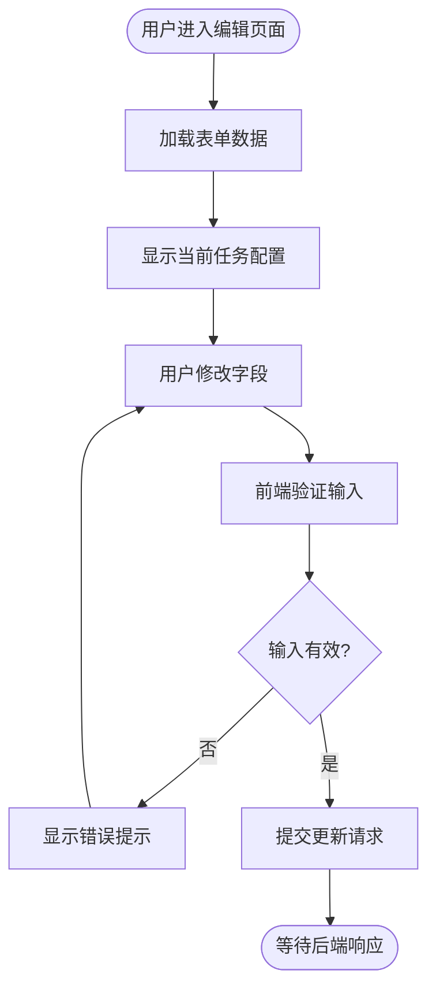
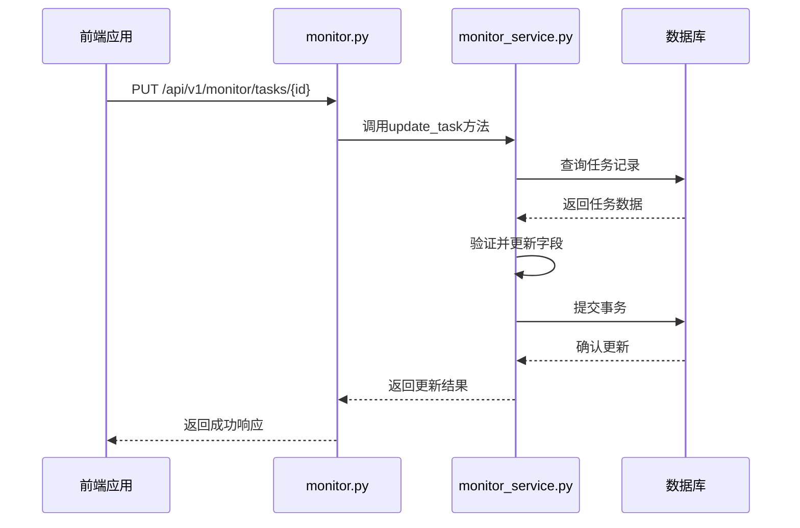
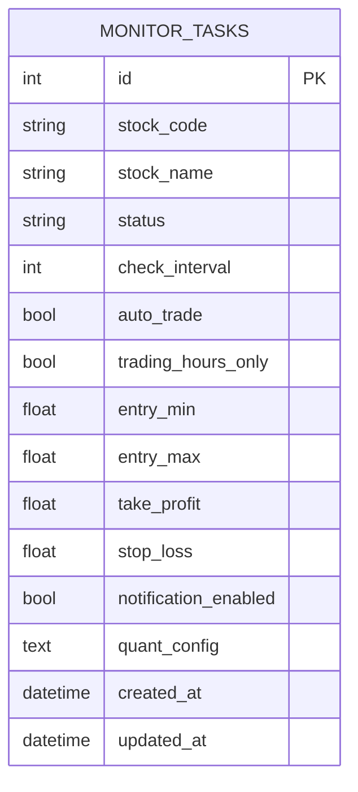

# 更新实时监测任务

<cite>
**本文档引用的文件**   
- [realtime_service.py](file://backend/app/services/realtime_service.py)
- [monitor.py](file://backend/app/api/v1/monitor.py)
- [index.vue](file://frontend/src/views/realtime/index.vue)
- [monitor.js](file://frontend/src/api/monitor.js)
- [monitor_service.py](file://backend/app/services/monitor_service.py)
- [monitor.py](file://backend/app/models/monitor.py)
- [001_add_monitor_task_fields.py](file://backend/alembic/versions/001_add_monitor_task_fields.py)
</cite>

## 目录
1. [引言](#引言)
2. [前端编辑表单机制](#前端编辑表单机制)
3. [后端更新逻辑与校验](#后端更新逻辑与校验)
4. [数据库事务与变更日志](#数据库事务与变更日志)
5. [任务调度器同步机制](#任务调度器同步机制)
6. [系统可追溯性设计](#系统可追溯性设计)
7. [结论](#结论)

## 引言

本系统实现了完整的实时监测任务更新机制，涵盖从前端表单交互到后端数据处理的全流程。系统允许用户对已创建的监测任务进行动态调整，包括价格区间、止盈止损价位等关键参数的修改。整个更新流程设计注重数据一致性、安全性和可追溯性，确保在多用户环境下能够稳定运行。

系统通过前后端分离架构实现功能解耦，前端提供直观的用户界面用于任务编辑，后端则负责数据校验、权限控制和持久化存储。当用户提交更新请求时，系统会执行严格的字段验证，防止不合理的价格区间设置，并通过数据库事务保证数据的一致性。同时，系统还集成了任务调度器，确保在任务状态变更时能够及时同步更新。

**Section sources**
- [realtime_service.py](file://backend/app/services/realtime_service.py#L1-L49)
- [monitor.py](file://backend/app/api/v1/monitor.py#L1-L135)

## 前端编辑表单机制

前端实时监测页面提供了完整的任务编辑功能，用户可以通过"添加监控"标签页中的表单对监测任务进行配置。表单包含股票代码、股票名称、投资评级、监测间隔、进场区间、止盈价位和止损价位等字段。其中，进场区间由两个输入框组成，分别用于设置价格下限和上限。

在用户提交表单前，系统会执行前端验证。通过`validateRange`方法检查进场区间的合理性，确保上下限值均大于零且上限大于下限。如果验证失败，系统会弹出相应的错误提示信息。这种前端验证机制能够及时反馈用户输入错误，提升用户体验。

**Diagram sources**
- [index.vue](file://frontend/src/views/realtime/index.vue#L247-L313)
- [monitor.js](file://frontend/src/api/monitor.js#L21-L28)

**Section sources**
- [index.vue](file://frontend/src/views/realtime/index.vue#L339-L664)
- [monitor.js](file://frontend/src/api/monitor.js#L21-L28)

## 后端更新逻辑与校验

后端通过`monitor_service.py`文件中的`update_task`方法处理监测任务的更新请求。该方法接收任务ID和更新数据作为参数，首先查询数据库中对应的任务记录。如果任务不存在，则抛出异常提示用户。

在更新过程中，系统会对各个字段进行条件性更新。只有当请求数据中包含特定字段时，才会更新数据库中的对应值。例如，只有当`task_data`中包含`entry_min`字段时，才会更新任务的进场最低价。这种设计避免了不必要的字段覆盖，确保未修改的字段保持原值。

系统还实现了价格区间的合理性校验。虽然当前代码中未直接体现校验逻辑，但从数据库字段定义可以看出，`entry_min`和`entry_max`字段被设计为浮点数类型且允许为空，这为后续实现更复杂的校验规则提供了基础。同时，系统通过`updated_at`字段自动记录每次更新的时间戳，便于追踪变更历史。

**Diagram sources**
- [monitor.py](file://backend/app/api/v1/monitor.py#L39-L52)
- [monitor_service.py](file://backend/app/services/monitor_service.py#L205-L279)

**Section sources**
- [monitor.py](file://backend/app/api/v1/monitor.py#L39-L52)
- [monitor_service.py](file://backend/app/services/monitor_service.py#L205-L279)

## 数据库事务与变更日志

系统使用Alembic进行数据库版本管理，在`001_add_monitor_task_fields.py`迁移脚本中定义了监测任务表的结构。该脚本通过`op.add_column`方法为`monitor_tasks`表添加了`entry_min`、`entry_max`、`take_profit`和`stop_loss`等字段，这些字段均被设置为可空的浮点数类型，以适应不同的业务场景。

在执行更新操作时，系统采用数据库事务来保证数据的一致性。`update_task`方法在`try`块中执行所有数据库操作，如果过程中发生任何异常，`except`块会执行`db.rollback()`回滚事务，防止产生不完整或错误的数据状态。只有当所有操作都成功完成时，才会调用`db.commit()`提交事务。

虽然当前系统尚未实现完整的变更日志功能，但从代码结构可以看出，系统已经为日志记录做好了准备。`updated_at`字段的自动更新机制可以作为变更时间戳的基础，结合用户身份信息，未来可以轻松扩展出完整的审计日志功能，记录每次变更的操作者、变更内容和时间等信息。

**Diagram sources**
- [monitor.py](file://backend/app/models/monitor.py#L9-L39)
- [001_add_monitor_task_fields.py](file://backend/alembic/versions/001_add_monitor_task_fields.py#L1-L43)

**Section sources**
- [monitor.py](file://backend/app/models/monitor.py#L9-L39)
- [001_add_monitor_task_fields.py](file://backend/alembic/versions/001_add_monitor_task_fields.py#L1-L43)

## 任务调度器同步机制

系统通过任务调度器确保监测任务的状态变更能够及时生效。当用户更新任务配置后，如果任务处于运行状态，调度器会根据新的配置参数调整监测行为。例如，如果用户修改了监测间隔，调度器会在下一次检查周期应用新的间隔值。

调度器的设计考虑了交易时段的限制，通过`trading_hours_only`字段控制是否仅在交易时段进行监测。这一机制可以有效避免在非交易时段产生不必要的提醒，减少对用户的干扰。同时，系统还支持启动和停止任务的API，允许用户手动控制任务的运行状态。

尽管当前代码中`realtime_service.py`文件的更新方法仍为待实现状态，但整体架构已经为调度器的集成做好了准备。通过`start_service`和`stop_service`等方法的定义，可以看出系统计划提供统一的服务控制接口，便于集中管理所有监测任务的生命周期。

**Section sources**
- [realtime_service.py](file://backend/app/services/realtime_service.py#L24-L48)
- [monitor_service.py](file://backend/app/services/monitor_service.py#L518-L571)

## 系统可追溯性设计

系统的可追溯性设计主要体现在两个方面：数据版本控制和操作时间戳记录。通过Alembic迁移脚本，系统能够清晰地追踪数据库结构的演变过程。每个迁移脚本都有唯一的版本号，并包含`upgrade`和`downgrade`两个方法，支持数据库结构的升级和回滚。

在数据层面，每个监测任务都有`created_at`和`updated_at`两个时间戳字段。前者记录任务创建时间，后者记录最后一次更新时间。这两个字段为分析任务生命周期提供了基础数据。结合前端的更新历史记录功能，用户可以了解任务配置的演变过程。

未来系统可以通过扩展`quant_config`字段的功能来增强可追溯性。该字段目前用于存储量化策略配置的JSON字符串，可以进一步利用来记录每次配置变更的详细信息，包括变更前后的参数对比、操作者信息等，从而构建完整的变更历史记录。

**Section sources**
- [001_add_monitor_task_fields.py](file://backend/alembic/versions/001_add_monitor_task_fields.py#L1-L43)
- [monitor.py](file://backend/app/models/monitor.py#L36-L37)

## 结论

本系统实现了完整的实时监测任务更新机制，从前端表单验证到后端数据处理，再到数据库事务管理，形成了一个闭环的更新流程。系统设计注重数据一致性和用户体验，通过多层次的验证和错误处理机制，确保更新操作的可靠性和安全性。

尽管部分功能仍在开发中，但整体架构已经为未来的功能扩展做好了准备。通过合理的模块划分和接口设计，系统具备良好的可维护性和可扩展性。建议后续开发中进一步完善价格区间校验逻辑，实现更详细的变更日志记录，并优化任务调度器的同步机制，以提供更强大的实时监测功能。