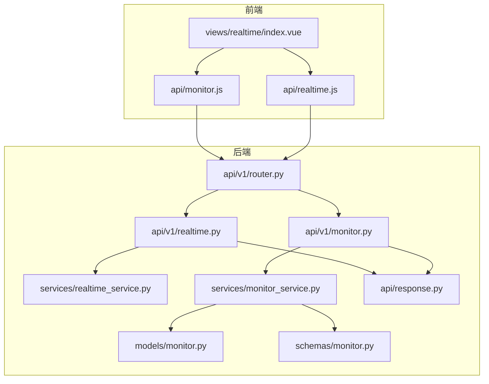
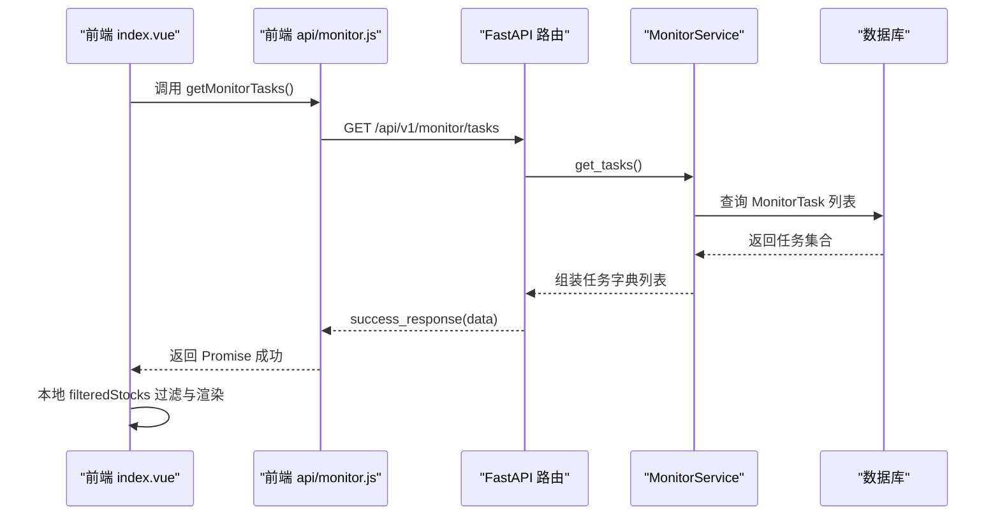
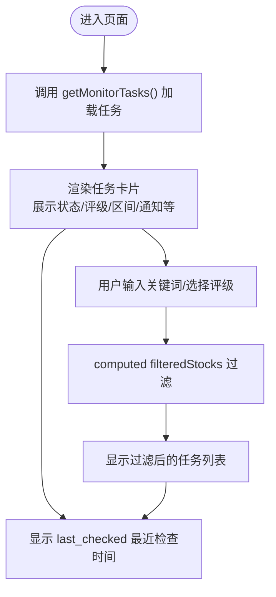
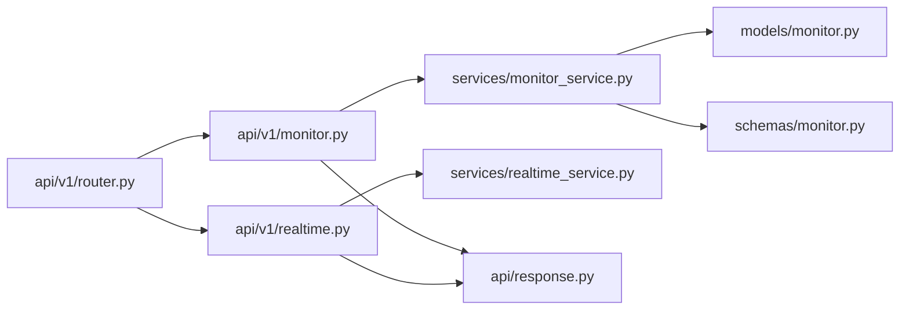

# 查询实时监测任务

<cite>
**本文引用的文件**
- [backend/app/api/v1/realtime.py](file://backend/app/api/v1/realtime.py)
- [backend/app/api/v1/monitor.py](file://backend/app/api/v1/monitor.py)
- [backend/app/api/v1/router.py](file://backend/app/api/v1/router.py)
- [backend/app/services/realtime_service.py](file://backend/app/services/realtime_service.py)
- [backend/app/services/monitor_service.py](file://backend/app/services/monitor_service.py)
- [backend/app/models/monitor.py](file://backend/app/models/monitor.py)
- [backend/app/schemas/monitor.py](file://backend/app/schemas/monitor.py)
- [backend/app/api/response.py](file://backend/app/api/response.py)
- [frontend/src/views/realtime/index.vue](file://frontend/src/views/realtime/index.vue)
- [frontend/src/api/monitor.js](file://frontend/src/api/monitor.js)
- [frontend/src/api/realtime.js](file://frontend/src/api/realtime.js)
</cite>

## 目录
1. [简介](#简介)
2. [项目结构](#项目结构)
3. [核心组件](#核心组件)
4. [架构总览](#架构总览)
5. [详细组件分析](#详细组件分析)
6. [依赖关系分析](#依赖关系分析)
7. [性能考量](#性能考量)
8. [故障排查指南](#故障排查指南)
9. [结论](#结论)

## 简介
本章节聚焦“查询实时监测任务”的功能实现，覆盖：
- 前端任务列表的渲染逻辑、分页与筛选机制
- 后端如何通过API提供任务列表、响应数据结构与状态字段含义
- 结合前端 index.vue 中的表格组件，说明如何动态展示任务状态标签、更新时间提示，并实现基于关键词的股票代码快速搜索

当前仓库中，实时监测任务的查询接口由两个API模块提供：
- /api/v1/realtime：提供实时监测相关接口（含任务列表），但其服务层实现尚为占位
- /api/v1/monitor：提供智能盯盘任务列表接口，服务层已完整实现

因此，本文以 /api/v1/monitor/tasks 为主要参考，同时说明 /api/v1/realtime/monitors 的设计意图与现状。

## 项目结构
- 后端采用 FastAPI + SQLAlchemy 架构，按功能模块划分 API 路由与服务层
- 前端使用 Vue + Element UI，通过封装的 API 模块发起请求并渲染视图

图表来源
- [backend/app/api/v1/router.py](file://backend/app/api/v1/router.py#L1-L36)
- [backend/app/api/v1/realtime.py](file://backend/app/api/v1/realtime.py#L1-L104)
- [backend/app/api/v1/monitor.py](file://backend/app/api/v1/monitor.py#L1-L135)
- [backend/app/services/realtime_service.py](file://backend/app/services/realtime_service.py#L1-L49)
- [backend/app/services/monitor_service.py](file://backend/app/services/monitor_service.py#L1-L120)
- [backend/app/models/monitor.py](file://backend/app/models/monitor.py#L1-L39)
- [backend/app/schemas/monitor.py](file://backend/app/schemas/monitor.py#L1-L32)
- [backend/app/api/response.py](file://backend/app/api/response.py#L1-L31)
- [frontend/src/views/realtime/index.vue](file://frontend/src/views/realtime/index.vue#L1-L120)
- [frontend/src/api/monitor.js](file://frontend/src/api/monitor.js#L1-L79)
- [frontend/src/api/realtime.js](file://frontend/src/api/realtime.js#L1-L62)

章节来源
- [backend/app/api/v1/router.py](file://backend/app/api/v1/router.py#L1-L36)
- [frontend/src/views/realtime/index.vue](file://frontend/src/views/realtime/index.vue#L1-L120)

## 核心组件
- 后端 API 层
  - /api/v1/monitor/tasks：返回任务列表
  - /api/v1/realtime/monitors：实时监测任务列表（服务层为占位）
- 服务层
  - MonitorService.get_tasks：组装任务列表，包含状态、区间、通知等字段
  - RealtimeService.get_monitors：实时监测任务列表（占位）
- 数据模型与序列化
  - MonitorTask：数据库模型
  - MonitorTaskResponse：响应序列化模型
- 前端
  - index.vue：渲染任务卡片、关键词搜索、状态标签、更新时间提示
  - api/monitor.js：封装 /api/v1/monitor/* 请求
  - api/realtime.js：封装 /api/v1/realtime/* 请求

章节来源
- [backend/app/api/v1/monitor.py](file://backend/app/api/v1/monitor.py#L1-L135)
- [backend/app/api/v1/realtime.py](file://backend/app/api/v1/realtime.py#L1-L104)
- [backend/app/services/monitor_service.py](file://backend/app/services/monitor_service.py#L65-L118)
- [backend/app/services/realtime_service.py](file://backend/app/services/realtime_service.py#L1-L49)
- [backend/app/models/monitor.py](file://backend/app/models/monitor.py#L1-L39)
- [backend/app/schemas/monitor.py](file://backend/app/schemas/monitor.py#L1-L32)
- [frontend/src/views/realtime/index.vue](file://frontend/src/views/realtime/index.vue#L140-L245)
- [frontend/src/api/monitor.js](file://frontend/src/api/monitor.js#L1-L79)
- [frontend/src/api/realtime.js](file://frontend/src/api/realtime.js#L1-L62)

## 架构总览
后端采用“路由 -> 服务 -> 模型/序列化 -> 统一响应”的分层设计；前端通过封装的 API 模块调用后端接口，并在 index.vue 中完成本地筛选与渲染。

图表来源
- [frontend/src/views/realtime/index.vue](file://frontend/src/views/realtime/index.vue#L454-L466)
- [frontend/src/api/monitor.js](file://frontend/src/api/monitor.js#L1-L10)
- [backend/app/api/v1/monitor.py](file://backend/app/api/v1/monitor.py#L14-L23)
- [backend/app/services/monitor_service.py](file://backend/app/services/monitor_service.py#L65-L118)
- [backend/app/api/response.py](file://backend/app/api/response.py#L10-L17)

## 详细组件分析

### 后端：实时监测任务列表接口设计
- 接口路径
  - /api/v1/realtime/monitors（GET）：实时监测任务列表
  - /api/v1/monitor/tasks（GET）：智能盯盘任务列表（生产可用）
- 路由与服务绑定
  - realtime.py：绑定 RealtimeService（当前服务层为占位）
  - monitor.py：绑定 MonitorService（get_tasks 完整实现）
- 响应结构
  - 统一响应：code、message、data
  - data 为任务数组，每条任务包含：
    - id、task_name、stock_code、stock_name、status
    - check_interval、auto_trade、trading_hours_only
    - entry_min、entry_max、take_profit、stop_loss
    - notification_enabled、quant_config
    - created_at、updated_at、is_running
- 状态字段含义
  - status：running / stopped（运行中 / 已停止）
  - is_running：服务层判断某股票是否在监控线程中运行
  - trading_hours_only：仅交易时段监控
  - auto_trade：是否启用量化（MiniQMT）
  - notification_enabled：是否启用通知
- 关于“最近触发时间”
  - 当前 MonitorService.get_tasks 返回的字段中未包含 last_checked 或 last_triggered 时间戳
  - 若需展示“最近触发时间”，可在服务层扩展字段或在前端显示 created_at/updated_at

章节来源
- [backend/app/api/v1/realtime.py](file://backend/app/api/v1/realtime.py#L14-L23)
- [backend/app/api/v1/monitor.py](file://backend/app/api/v1/monitor.py#L14-L23)
- [backend/app/services/realtime_service.py](file://backend/app/services/realtime_service.py#L14-L18)
- [backend/app/services/monitor_service.py](file://backend/app/services/monitor_service.py#L65-L118)
- [backend/app/api/response.py](file://backend/app/api/response.py#L10-L17)

### 前端：任务列表渲染与筛选
- 渲染容器
  - el-tab-pane 标签页“📈 监控列表”内，使用卡片网格展示任务
- 关键交互
  - 顶部筛选：关键词输入框（支持股票代码/名称模糊匹配）、评级选择器
  - 动态标签：状态标签（运行中/暂停中）、评级标签（买入/持有/卖出）、仅交易时段标签
  - 更新时间提示：last_checked（来自后端数据）用于显示“最近检查时间”
- 本地筛选逻辑
  - computed filteredStocks：基于 keyword 与 rating 的组合过滤
  - 支持回车与清空事件触发筛选
- 表格组件与卡片布局
  - 使用 Element UI 卡片组件展示任务关键信息（区间、止盈止损、通知开关等）
  - 通过样式类控制卡片间距与布局

图表来源
- [frontend/src/views/realtime/index.vue](file://frontend/src/views/realtime/index.vue#L140-L245)
- [frontend/src/views/realtime/index.vue](file://frontend/src/views/realtime/index.vue#L409-L418)
- [frontend/src/views/realtime/index.vue](file://frontend/src/views/realtime/index.vue#L454-L466)

章节来源
- [frontend/src/views/realtime/index.vue](file://frontend/src/views/realtime/index.vue#L140-L245)
- [frontend/src/views/realtime/index.vue](file://frontend/src/views/realtime/index.vue#L409-L418)
- [frontend/src/views/realtime/index.vue](file://frontend/src/views/realtime/index.vue#L454-L466)

### 分页与筛选机制
- 后端分页
  - /api/v1/realtime/notifications（GET）支持 page、page_size 参数
  - /api/v1/monitor/history（GET）支持 page、page_size 参数
  - 但 /api/v1/monitor/tasks（GET）未实现分页参数
- 前端分页
  - index.vue 未实现分页组件，当前为一次性加载全部任务
  - 若任务量增大，建议后端增加分页参数并在前端实现分页组件
- 筛选维度
  - 前端：关键词（股票代码/名称）、评级（买入/持有/卖出）
  - 后端：当前 MonitorService.get_tasks 未暴露按状态/评级的过滤参数

章节来源
- [backend/app/api/v1/realtime.py](file://backend/app/api/v1/realtime.py#L90-L103)
- [backend/app/api/v1/monitor.py](file://backend/app/api/v1/monitor.py#L121-L134)
- [frontend/src/views/realtime/index.vue](file://frontend/src/views/realtime/index.vue#L148-L163)

### 用户身份与数据隔离
- 认证与依赖
  - 后端提供 OAuth2 密钥方案与 get_current_user 依赖（用于后续完善）
  - 当前 monitor.py/realtime.py 的路由未强制依赖用户上下文
- 数据隔离建议
  - 在 MonitorService.get_tasks 中增加用户过滤条件（如 user_id 字段）
  - 在路由层引入 get_current_user 并传递至服务层
  - 保持与现有 MonitorTask 模型一致的字段映射

章节来源
- [backend/app/api/deps.py](file://backend/app/api/deps.py#L1-L43)
- [backend/app/api/v1/monitor.py](file://backend/app/api/v1/monitor.py#L14-L23)
- [backend/app/api/v1/realtime.py](file://backend/app/api/v1/realtime.py#L14-L23)

### 数据模型与序列化
- MonitorTask（数据库模型）
  - 字段：id、task_name、stock_code、stock_name、status、check_interval、auto_trade、trading_hours_only、entry_min、entry_max、take_profit、stop_loss、notification_enabled、quant_config、created_at、updated_at
- MonitorTaskResponse（响应模型）
  - 字段：id、task_name、stock_code、stock_name、status、check_interval、auto_trade、trading_hours_only、created_at、updated_at

章节来源
- [backend/app/models/monitor.py](file://backend/app/models/monitor.py#L1-L39)
- [backend/app/schemas/monitor.py](file://backend/app/schemas/monitor.py#L1-L32)

## 依赖关系分析
- 路由注册
  - /api/v1/router.py 将 monitor 与 realtime 模块路由注册到 /monitor 与 /realtime 前缀
- API 与服务
  - monitor.py -> MonitorService.get_tasks
  - realtime.py -> RealtimeService.get_monitors（占位）
- 统一响应
  - success_response/error_response 提供统一返回结构

图表来源
- [backend/app/api/v1/router.py](file://backend/app/api/v1/router.py#L1-L36)
- [backend/app/api/v1/monitor.py](file://backend/app/api/v1/monitor.py#L1-L135)
- [backend/app/api/v1/realtime.py](file://backend/app/api/v1/realtime.py#L1-L104)
- [backend/app/services/monitor_service.py](file://backend/app/services/monitor_service.py#L65-L118)
- [backend/app/services/realtime_service.py](file://backend/app/services/realtime_service.py#L1-L49)
- [backend/app/models/monitor.py](file://backend/app/models/monitor.py#L1-L39)
- [backend/app/schemas/monitor.py](file://backend/app/schemas/monitor.py#L1-L32)
- [backend/app/api/response.py](file://backend/app/api/response.py#L10-L17)

## 性能考量
- 前端
  - 一次性加载全部任务，若任务量大可能影响首屏渲染与内存占用
  - 建议：后端增加分页参数，前端实现分页组件与懒加载
- 后端
  - MonitorService.get_tasks 使用 ORM 查询并逐条组装字典，复杂度 O(n)
  - 建议：在数据库层面增加索引（如 stock_code、status、created_at），减少排序与过滤开销
- 网络
  - 统一响应结构便于前端处理，建议保持字段稳定，避免频繁变更

[本节为通用建议，无需特定文件来源]

## 故障排查指南
- 前端接口调用失败
  - index.vue 在加载失败时降级为示例数据，检查网络与 CORS 配置
  - 参考：[frontend/src/views/realtime/index.vue](file://frontend/src/views/realtime/index.vue#L454-L466)
- 后端接口未实现
  - /api/v1/realtime/monitors 对应的 RealtimeService 方法为占位
  - 参考：[backend/app/api/v1/realtime.py](file://backend/app/api/v1/realtime.py#L14-L23)、[backend/app/services/realtime_service.py](file://backend/app/services/realtime_service.py#L14-L18)
- 响应结构不一致
  - 统一使用 success_response，确保 data 字段承载业务数据
  - 参考：[backend/app/api/response.py](file://backend/app/api/response.py#L10-L17)
- 筛选无效
  - /api/v1/monitor/tasks 不支持后端分页与筛选参数，需在前端完成
  - 参考：[frontend/src/views/realtime/index.vue](file://frontend/src/views/realtime/index.vue#L148-L163)

章节来源
- [frontend/src/views/realtime/index.vue](file://frontend/src/views/realtime/index.vue#L454-L466)
- [backend/app/api/v1/realtime.py](file://backend/app/api/v1/realtime.py#L14-L23)
- [backend/app/services/realtime_service.py](file://backend/app/services/realtime_service.py#L14-L18)
- [backend/app/api/response.py](file://backend/app/api/response.py#L10-L17)

## 结论
- 当前“查询实时监测任务”的生产可用实现集中在 /api/v1/monitor/tasks，服务层 MonitorService.get_tasks 已完整返回任务列表及状态字段
- 前端 index.vue 提供了完善的本地筛选与渲染能力，支持关键词与评级筛选，并动态展示状态标签与最近检查时间
- 实时监测模块的 /api/v1/realtime/monitors 接口目前服务层为占位，建议尽快补齐实现并与 MonitorService 对齐字段
- 若需用户身份过滤与分页，建议在 MonitorService 中增加用户过滤与分页参数，并在路由层引入用户上下文