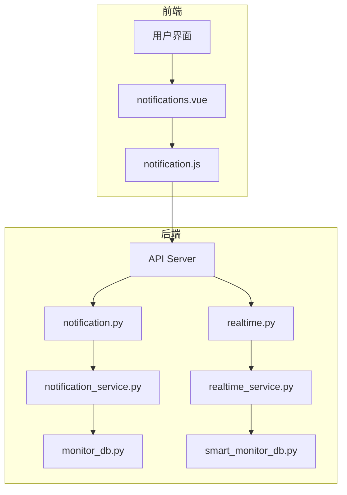
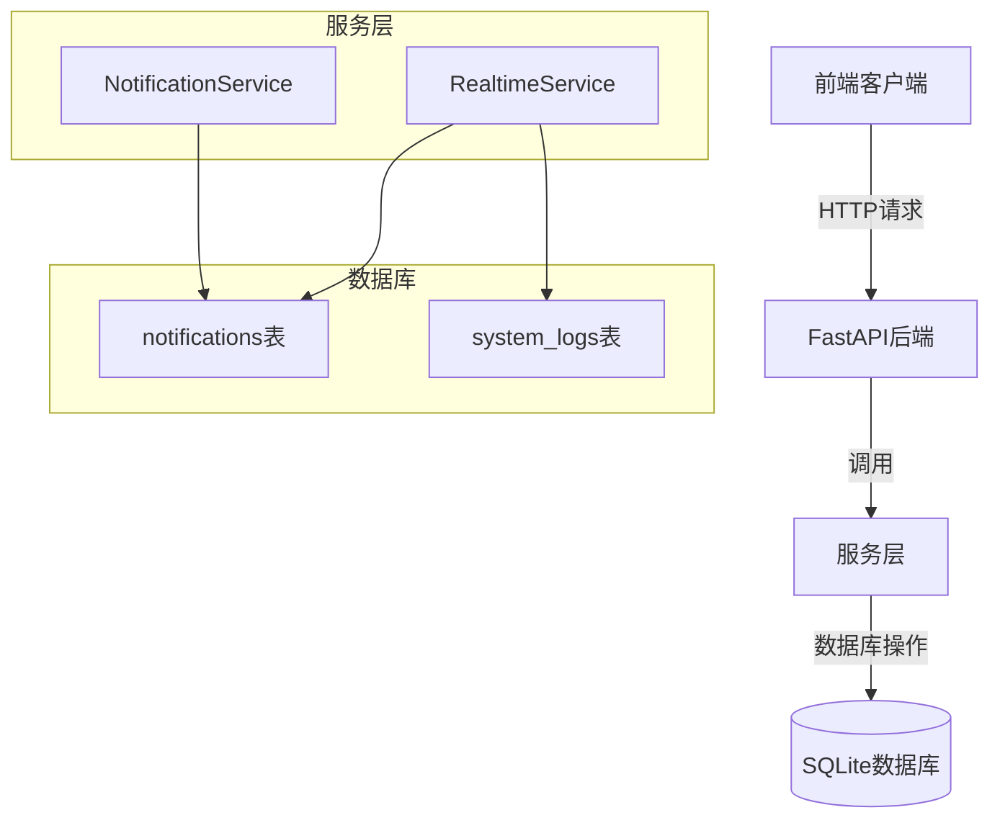
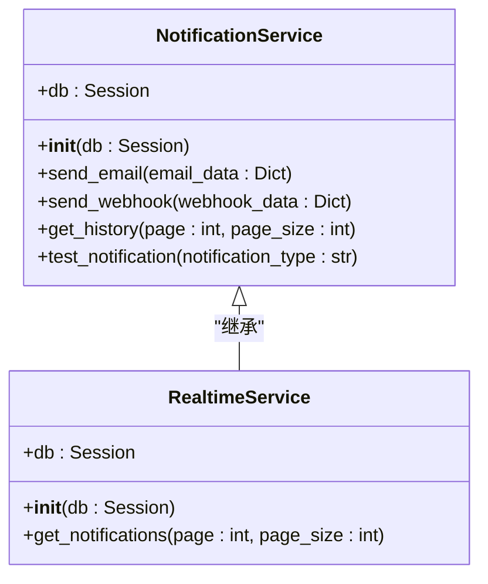
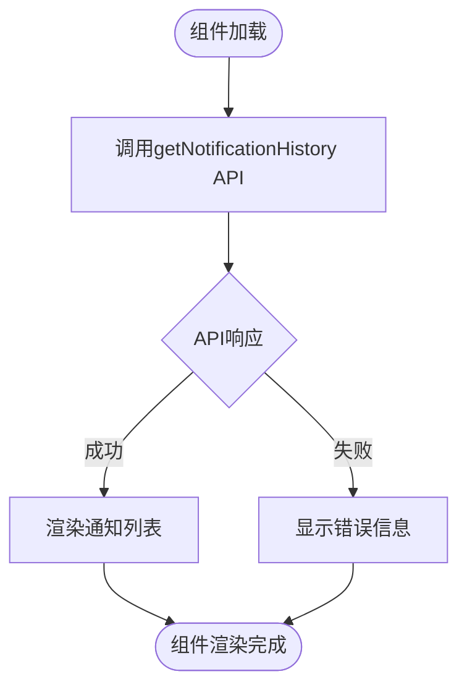
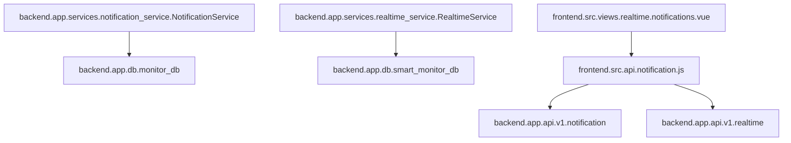

# 通知历史记录与查询

<cite>
**本文档引用的文件**  
- [notification.py](file://backend/app/api/v1/notification.py)
- [notification_service.py](file://backend/app/services/notification_service.py)
- [realtime.py](file://backend/app/api/v1/realtime.py)
- [realtime_service.py](file://backend/app/services/realtime_service.py)
- [monitor_db.py](file://old/monitor_db.py)
- [smart_monitor_db.py](file://old/smart_monitor_db.py)
- [notifications.vue](file://frontend/src/views/realtime/notifications.vue)
- [notification.js](file://frontend/src/api/notification.js)
- [monitor.py](file://backend/app/models/monitor.py)
</cite>

## 目录
1. [简介](#简介)
2. [项目结构](#项目结构)
3. [核心组件](#核心组件)
4. [架构概述](#架构概述)
5. [详细组件分析](#详细组件分析)
6. [依赖分析](#依赖分析)
7. [性能考虑](#性能考虑)
8. [故障排除指南](#故障排除指南)
9. [结论](#结论)

## 简介
本系统实现了完整的通知历史记录与查询功能，用于存储和管理所有已发送的通知记录。系统通过数据库持久化存储通知数据，支持分页查询、时间范围过滤等数据检索功能。前端通过 `notifications.vue` 组件展示通知列表，支持按时间排序和分类筛选。通知状态管理机制包括已发送、发送失败等状态，便于进行问题排查和审计追踪。

## 项目结构
系统采用前后端分离架构，后端使用 FastAPI 框架，前端使用 Vue.js 框架。通知功能主要分布在后端的 `backend/app/api/v1/notification.py` 和 `backend/app/services/notification_service.py` 文件中，前端相关代码位于 `frontend/src/views/realtime/notifications.vue` 和 `frontend/src/api/notification.js`。

**图示来源**  
- [notification.py](file://backend/app/api/v1/notification.py)
- [realtime.py](file://backend/app/api/v1/realtime.py)
- [notifications.vue](file://frontend/src/views/realtime/notifications.vue)

**本节来源**  
- [notification.py](file://backend/app/api/v1/notification.py)
- [realtime.py](file://backend/app/api/v1/realtime.py)
- [notifications.vue](file://frontend/src/views/realtime/notifications.vue)

## 核心组件
系统的核心组件包括通知服务类 `NotificationService` 和实时服务类 `RealtimeService`，它们分别处理通知的发送、存储和查询功能。通知历史记录通过数据库表进行持久化存储，包含通知类型、消息内容、触发时间、发送状态等关键字段。

**本节来源**  
- [notification_service.py](file://backend/app/services/notification_service.py)
- [realtime_service.py](file://backend/app/services/realtime_service.py)

## 架构概述
系统采用分层架构设计，前端通过 RESTful API 与后端交互。通知数据存储在 SQLite 数据库中，通过 SQLAlchemy ORM 进行数据访问。通知服务负责处理通知的发送逻辑，实时服务负责提供通知历史查询接口。

**图示来源**  
- [notification_service.py](file://backend/app/services/notification_service.py)
- [realtime_service.py](file://backend/app/services/realtime_service.py)
- [smart_monitor_db.py](file://old/smart_monitor_db.py)

## 详细组件分析

### 通知服务分析
通知服务类 `NotificationService` 负责处理通知的发送和历史查询功能。该服务通过数据库存储所有通知记录，支持邮件和 Webhook 两种通知方式。

#### 类图

**图示来源**  
- [notification_service.py](file://backend/app/services/notification_service.py)
- [realtime_service.py](file://backend/app/services/realtime_service.py)

### 前端组件分析
前端 `notifications.vue` 组件负责展示通知历史记录，通过调用 API 接口获取数据并进行分页显示。

#### 流程图

**图示来源**  
- [notifications.vue](file://frontend/src/views/realtime/notifications.vue)
- [notification.js](file://frontend/src/api/notification.js)

**本节来源**  
- [notification_service.py](file://backend/app/services/notification_service.py)
- [realtime_service.py](file://backend/app/services/realtime_service.py)
- [notifications.vue](file://frontend/src/views/realtime/notifications.vue)

## 依赖分析
系统依赖关系清晰，前端依赖后端 API，后端服务依赖数据库操作模块。通知服务和实时服务都依赖数据库会话，通过依赖注入方式获取数据库连接。

**图示来源**  
- [notification_service.py](file://backend/app/services/notification_service.py)
- [realtime_service.py](file://backend/app/services/realtime_service.py)
- [notification.js](file://frontend/src/api/notification.js)

**本节来源**  
- [notification_service.py](file://backend/app/services/notification_service.py)
- [realtime_service.py](file://backend/app/services/realtime_service.py)
- [notification.js](file://frontend/src/api/notification.js)

## 性能考虑
为确保在大量历史数据下的查询效率，系统采用了以下优化措施：
- 数据库查询使用分页机制，避免一次性加载过多数据
- 通知记录按触发时间倒序排列，便于快速获取最新通知
- 使用索引优化数据库查询性能

## 故障排除指南
当通知功能出现问题时，可通过以下步骤进行排查：
1. 检查数据库连接是否正常
2. 验证通知配置是否正确
3. 查看系统日志中的错误信息
4. 检查网络连接是否正常

**本节来源**  
- [smart_monitor_db.py](file://old/smart_monitor_db.py)
- [monitor_db.py](file://old/monitor_db.py)

## 结论
本系统实现了完整的通知历史记录与查询功能，通过合理的架构设计和数据库优化，确保了在大量历史数据下的查询效率。系统支持多种通知方式，提供了完善的错误处理和审计追踪机制，便于进行问题排查和系统维护。