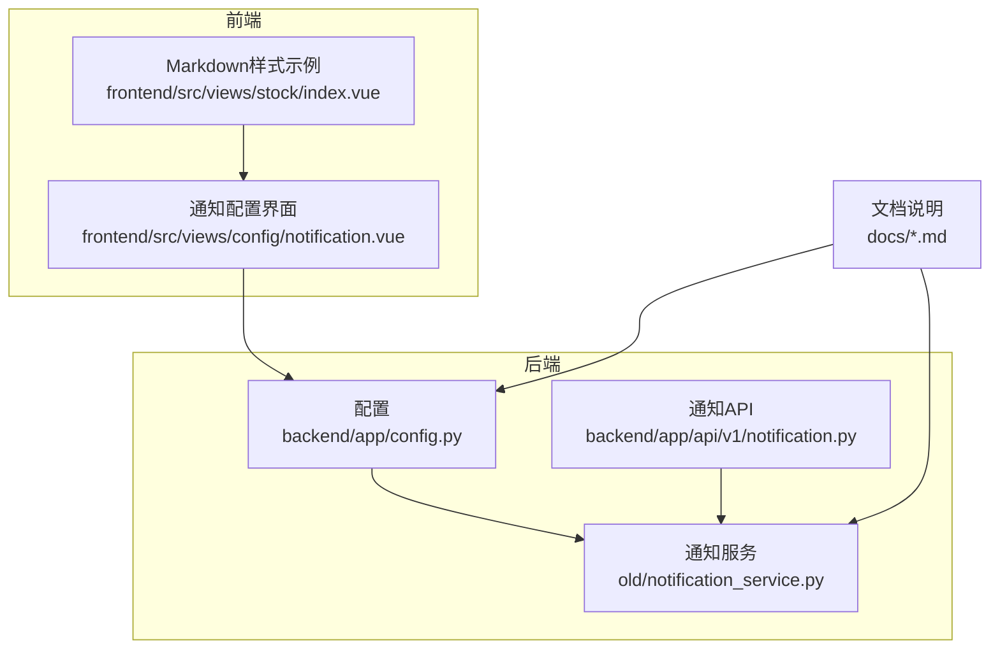
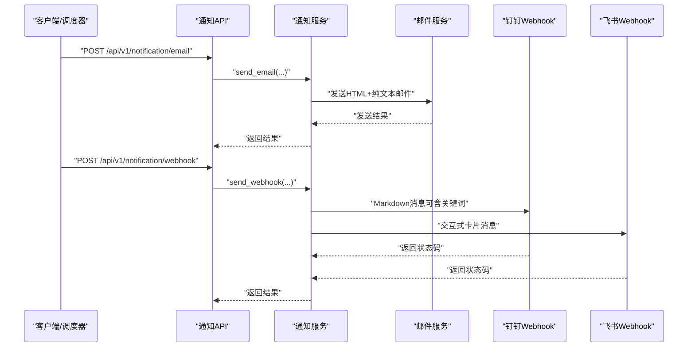
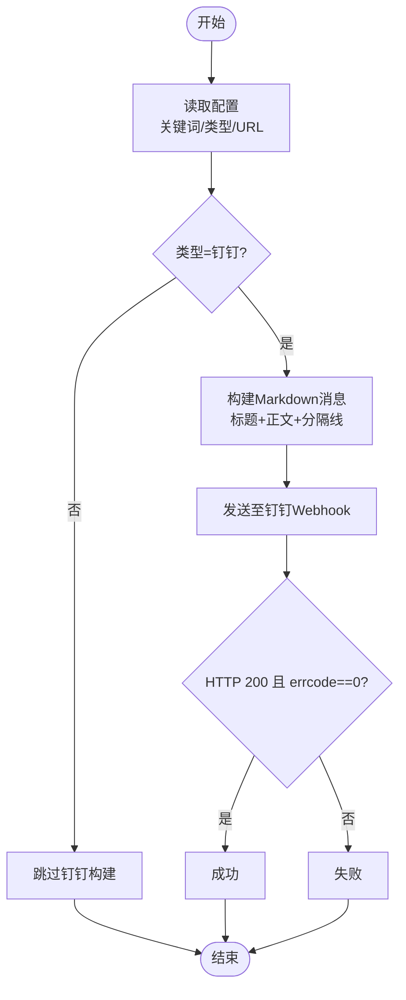
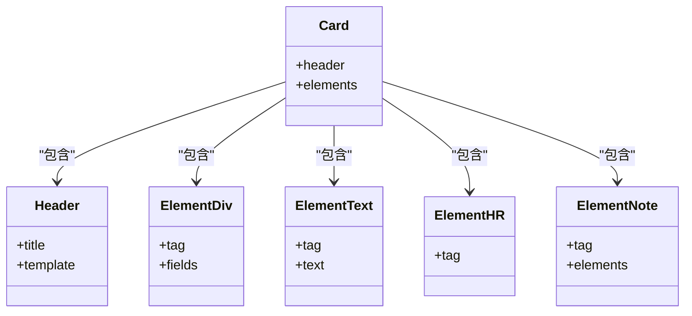
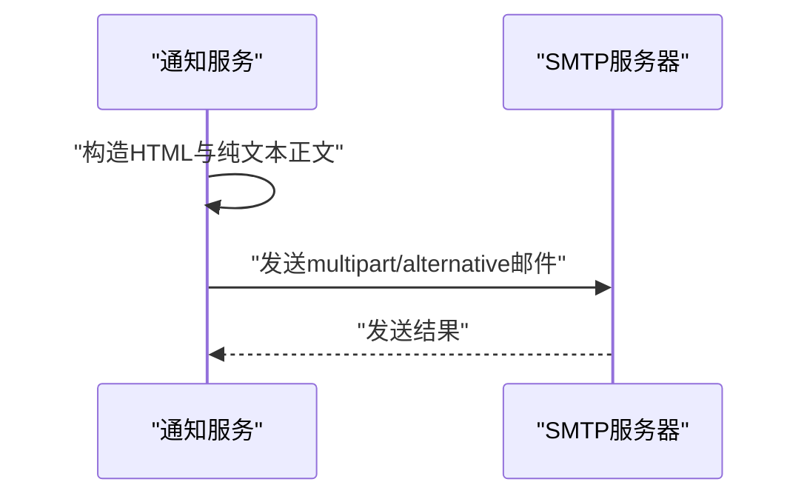
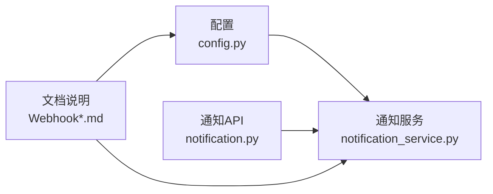

# 通知消息格式与模板

<cite>
**本文引用的文件**
- [notification_service.py](file://old/notification_service.py)
- [config.py](file://backend/app/config.py)
- [notification.py](file://backend/app/api/v1/notification.py)
- [notification.vue](file://frontend/src/views/config/notification.vue)
- [Webhook通知配置指南.md](file://docs/Webhook通知配置指南.md)
- [Webhook功能实现总结.md](file://docs/Webhook功能实现总结.md)
- [Webhook自定义关键词功能说明.md](file://docs/Webhook自定义关键词功能说明.md)
- [环境配置快速指南.md](file://docs/环境配置快速指南.md)
- [pdf_generator_pandoc.py](file://old/pdf_generator_pandoc.py)
- [main_force_pdf_generator.py](file://old/main_force_pdf_generator.py)
- [index.vue](file://frontend/src/views/stock/index.vue)
</cite>

## 目录
1. [简介](#简介)
2. [项目结构](#项目结构)
3. [核心组件](#核心组件)
4. [架构总览](#架构总览)
5. [详细组件分析](#详细组件分析)
6. [依赖关系分析](#依赖关系分析)
7. [性能考量](#性能考量)
8. [故障排查指南](#故障排查指南)
9. [结论](#结论)
10. [附录](#附录)

## 简介
本文件面向“通知消息格式与模板”的构建与配置，聚焦三类通知场景：
- 实时监测：股票价格触发时的即时提醒
- 持仓分析：定时批量分析完成后的汇总通知
- 系统状态：系统运行状态或维护提示

文档详细说明：
- 钉钉Webhook的Markdown消息构建规则（标题、文本、分隔线、关键词嵌入）
- 飞书Webhook的交互式卡片消息JSON结构（header、elements等字段）
- 邮件通知的HTML与纯文本双格式实现及可读性优化
- 消息模板的可配置性与扩展建议（关键词、消息体、样式）

## 项目结构
通知相关能力分布在后端服务、配置、API接口与前端界面中，并辅以文档说明与历史PDF生成示例，便于理解消息格式与样式设计思路。

图表来源
- [config.py](file://backend/app/config.py#L55-L70)
- [notification_service.py](file://old/notification_service.py#L289-L371)
- [notification.py](file://backend/app/api/v1/notification.py#L1-L70)
- [notification.vue](file://frontend/src/views/config/notification.vue#L1-L14)
- [index.vue](file://frontend/src/views/stock/index.vue#L1803-L1952)

章节来源
- [config.py](file://backend/app/config.py#L55-L70)
- [notification_service.py](file://old/notification_service.py#L289-L371)
- [notification.py](file://backend/app/api/v1/notification.py#L1-L70)
- [notification.vue](file://frontend/src/views/config/notification.vue#L1-L14)
- [index.vue](file://frontend/src/views/stock/index.vue#L1803-L1952)

## 核心组件
- 配置中心：集中管理邮件与Webhook的开关、类型、地址、关键词等
- 通知服务：负责邮件与Webhook两类通知的发送与测试
- API接口：对外暴露邮件、Webhook发送与测试接口
- 前端界面：提供通知配置入口与Markdown样式参考

章节来源
- [config.py](file://backend/app/config.py#L55-L70)
- [notification_service.py](file://old/notification_service.py#L109-L170)
- [notification.py](file://backend/app/api/v1/notification.py#L14-L70)
- [notification.vue](file://frontend/src/views/config/notification.vue#L1-L14)

## 架构总览
通知流程概览如下：

图表来源
- [notification.py](file://backend/app/api/v1/notification.py#L14-L70)
- [notification_service.py](file://old/notification_service.py#L109-L170)
- [notification_service.py](file://old/notification_service.py#L311-L368)
- [notification_service.py](file://old/notification_service.py#L369-L471)

## 详细组件分析

### 钉钉Webhook：Markdown消息构建规则
- 消息类型：markdown
- 标题与正文：
  - 标题字段包含“股票代码+名称”或“关键词+标题”
  - 正文采用Markdown语法，包含分节标题、字段对齐、分隔线等
- 关键词嵌入：
  - 若配置了关键词，则在标题与正文中相应位置前置关键词
  - 关键词来源于配置项，系统会自动判断是否为空并决定是否添加
- 分隔线：使用标准Markdown分隔符
- 字段组织：按“股票代码/名称/类型/内容/触发时间”等维度组织，便于移动端阅读

图表来源
- [notification_service.py](file://old/notification_service.py#L311-L368)
- [config.py](file://backend/app/config.py#L63-L68)

章节来源
- [notification_service.py](file://old/notification_service.py#L311-L368)
- [config.py](file://backend/app/config.py#L63-L68)
- [Webhook通知配置指南.md](file://docs/Webhook通知配置指南.md#L86-L131)
- [Webhook自定义关键词功能说明.md](file://docs/Webhook自定义关键词功能说明.md#L66-L89)

### 飞书Webhook：交互式卡片消息JSON结构
- 消息类型：interactive
- 卡片header：
  - title：包含“图表图标+标题+股票代码”
  - template：蓝色主题
- elements：
  - div字段：两列紧凑展示“股票代码/名称”、“提醒类型/触发时间”
  - div文本：展示“提醒内容”
  - hr：分隔线
  - note：底部说明文字（系统自动发送）
- 文本渲染：使用平台支持的富文本标记语言进行渲染

图表来源
- [notification_service.py](file://old/notification_service.py#L369-L471)

章节来源
- [notification_service.py](file://old/notification_service.py#L369-L471)
- [Webhook通知配置指南.md](file://docs/Webhook通知配置指南.md#L160-L201)

### 邮件通知：HTML与纯文本双格式
- HTML正文：
  - 包含标题、概要、明细等区块
  - 使用内联CSS样式，突出成功/失败、评级颜色等
- 纯文本正文：
  - 与HTML对应，保持关键信息一致
- 发送方式：multipart/alternative，同时附带HTML与纯文本版本

图表来源
- [notification_service.py](file://old/notification_service.py#L686-L710)
- [notification_service.py](file://old/notification_service.py#L520-L684)

章节来源
- [notification_service.py](file://old/notification_service.py#L686-L710)
- [notification_service.py](file://old/notification_service.py#L520-L684)
- [pdf_generator_pandoc.py](file://old/pdf_generator_pandoc.py#L176-L213)
- [main_force_pdf_generator.py](file://old/main_force_pdf_generator.py#L239-L291)

### 消息模板的可配置性
- 关键词配置：支持在配置中设置关键词，系统自动在钉钉消息标题与正文中插入
- Webhook类型：支持钉钉与飞书两种类型，分别采用Markdown与交互式卡片
- 邮件样式：HTML中使用内联样式，保证在不同邮件客户端的可读性
- 前端Markdown样式：提供Markdown渲染样式的参考，便于在界面中预览消息风格

章节来源
- [config.py](file://backend/app/config.py#L63-L68)
- [notification_service.py](file://old/notification_service.py#L311-L368)
- [notification_service.py](file://old/notification_service.py#L369-L471)
- [index.vue](file://frontend/src/views/stock/index.vue#L1803-L1952)

## 依赖关系分析
- 配置依赖：通知服务依赖配置中心提供的开关、类型、URL、关键词等
- API依赖：API层调用通知服务，封装返回结果
- 文档依赖：文档说明与实现一一对应，便于对照与验证

图表来源
- [config.py](file://backend/app/config.py#L55-L70)
- [notification_service.py](file://old/notification_service.py#L289-L371)
- [notification.py](file://backend/app/api/v1/notification.py#L1-L70)
- [Webhook通知配置指南.md](file://docs/Webhook通知配置指南.md#L1-L445)

章节来源
- [config.py](file://backend/app/config.py#L55-L70)
- [notification_service.py](file://old/notification_service.py#L289-L371)
- [notification.py](file://backend/app/api/v1/notification.py#L1-L70)
- [Webhook通知配置指南.md](file://docs/Webhook通知配置指南.md#L1-L445)

## 性能考量
- Webhook发送：采用同步HTTP请求，建议在高频场景下控制发送频率，避免触发平台限流
- 邮件发送：使用SMTP连接池与TLS握手，注意端口选择与超时设置
- 前端渲染：Markdown样式在前端已内置，有助于减少后端渲染压力

[本节为通用建议，不涉及具体文件分析]

## 故障排查指南
- 钉钉关键词不匹配：
  - 确认关键词与机器人设置一致；若为空则不会添加关键词前缀
- Webhook URL无效或网络超时：
  - 检查URL完整性与可达性；必要时更换为加签/IP白名单安全方式
- 飞书卡片消息格式异常：
  - 确认消息类型与header、elements字段结构正确
- 邮件发送失败：
  - 检查SMTP服务器、端口、授权码与收件人配置；参考测试输出定位问题

章节来源
- [Webhook自定义关键词功能说明.md](file://docs/Webhook自定义关键词功能说明.md#L118-L183)
- [Webhook通知配置指南.md](file://docs/Webhook通知配置指南.md#L299-L342)
- [环境配置快速指南.md](file://docs/环境配置快速指南.md#L133-L190)

## 结论
本项目提供了完整的通知消息格式与模板实现：
- 钉钉采用Markdown，强调关键词与分隔线，适合移动端快速阅读
- 飞书采用交互式卡片，字段分栏展示，适合团队协作与信息密度较高的场景
- 邮件同时提供HTML与纯文本版本，兼顾可读性与兼容性
- 配置中心支持关键词、类型、地址等关键参数，便于用户自定义与扩展

[本节为总结性内容，不涉及具体文件分析]

## 附录

### 不同类型通知的消息内容结构要点
- 实时监测（钉钉/飞书）：
  - 标题：包含股票代码与名称或关键词
  - 正文：字段对齐展示“股票代码/名称/类型/内容/触发时间”，使用分隔线分段
- 持仓分析（Webhook）：
  - 钉钉：Markdown，包含“分析概况/结果详情/同步结果”等分段
  - 飞书：交互式卡片，字段分栏与分隔线
- 系统状态（邮件）：
  - HTML：内联样式突出关键信息；纯文本：与HTML对应的关键字段

章节来源
- [notification_service.py](file://old/notification_service.py#L311-L368)
- [notification_service.py](file://old/notification_service.py#L369-L471)
- [notification_service.py](file://old/notification_service.py#L520-L684)

### Markdown渲染样式参考（前端）
前端提供了Markdown渲染样式，可用于预览消息在界面中的呈现效果，便于调整消息模板的可读性。

章节来源
- [index.vue](file://frontend/src/views/stock/index.vue#L1803-L1952)