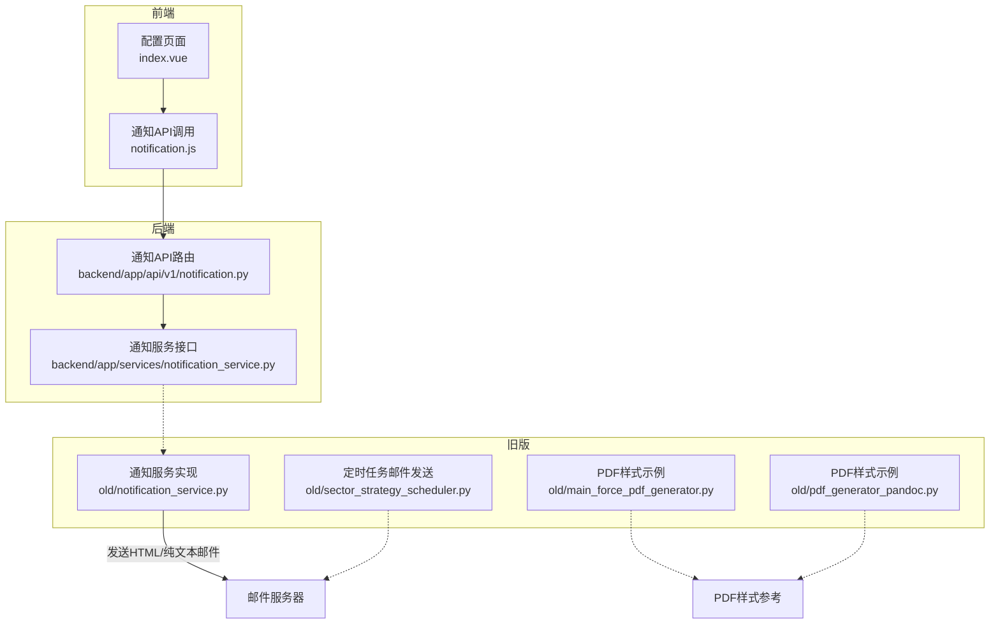
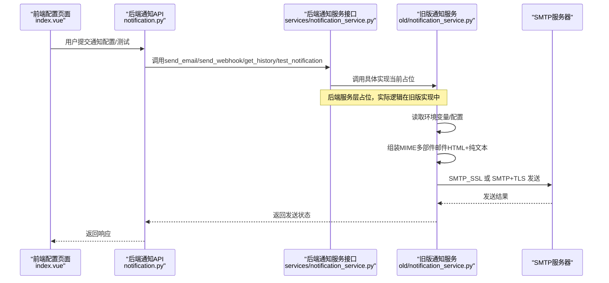
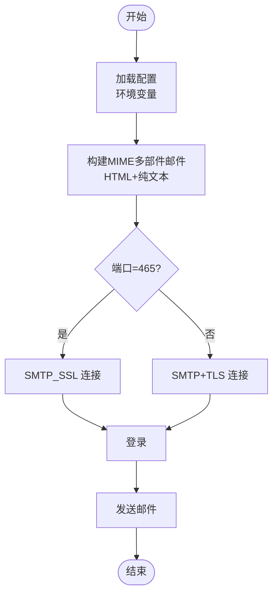
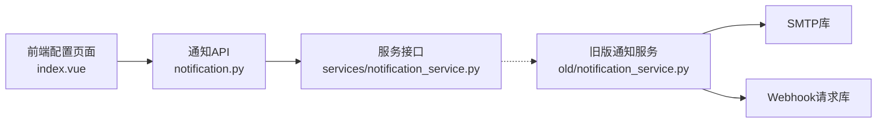

# 邮件通知模板与样式

<cite>
**本文引用的文件**
- [notification_service.py](file://old/notification_service.py)
- [邮件配置指南.md](file://docs/邮件配置指南.md)
- [notification.py](file://backend/app/api/v1/notification.py)
- [notification_service.py](file://backend/app/services/notification_service.py)
- [index.vue](file://frontend/src/views/config/index.vue)
- [notification.js](file://frontend/src/api/notification.js)
- [main_force_pdf_generator.py](file://old/main_force_pdf_generator.py)
- [pdf_generator_pandoc.py](file://old/pdf_generator_pandoc.py)
- [sector_strategy_scheduler.py](file://old/sector_strategy_scheduler.py)
</cite>

## 目录
1. [简介](#简介)
2. [项目结构](#项目结构)
3. [核心组件](#核心组件)
4. [架构总览](#架构总览)
5. [详细组件分析](#详细组件分析)
6. [依赖关系分析](#依赖关系分析)
7. [性能与兼容性考虑](#性能与兼容性考虑)
8. [故障排查指南](#故障排查指南)
9. [结论](#结论)
10. [附录](#附录)

## 简介
本文件围绕“邮件通知的双格式实现机制”展开，目标是：
- 解释HTML与纯文本双格式邮件的生成与发送流程；
- 说明HTML邮件中CSS内联样式的应用策略，确保在主流邮箱客户端（如QQ邮箱、Outlook）中的兼容性与视觉一致性；
- 提供包含表格布局、颜色标识、字体分级的模板示例思路，用于展示股票分析报告、持仓汇总、系统日志等复杂信息；
- 解释纯文本邮件的简洁格式设计原则，保证关键信息清晰传达；
- 描述模板引擎如何结合用户配置（发件人、收件人、SMTP参数）动态生成邮件内容，并集成到通知服务的发送流程中；
- 包含错误处理、编码设置、附件支持等高级配置说明。

## 项目结构
本仓库包含三部分与邮件通知密切相关的代码：
- 后端FastAPI API层与服务层：负责对外暴露通知接口、封装通知服务；
- 旧版（Streamlit）通知服务：提供完整的邮件发送、测试、Webhook联动与HTML/纯文本双格式模板；
- 前端Vue配置页面：提供SMTP/Webhook参数配置入口与校验预览。

图表来源
- [notification.py](file://backend/app/api/v1/notification.py#L1-L70)
- [notification_service.py](file://backend/app/services/notification_service.py#L1-L34)
- [notification_service.py](file://old/notification_service.py#L1-L759)
- [index.vue](file://frontend/src/views/config/index.vue#L1-L634)
- [notification.js](file://frontend/src/api/notification.js#L1-L38)
- [main_force_pdf_generator.py](file://old/main_force_pdf_generator.py#L239-L291)
- [pdf_generator_pandoc.py](file://old/pdf_generator_pandoc.py#L129-L179)
- [sector_strategy_scheduler.py](file://old/sector_strategy_scheduler.py#L378-L406)

章节来源
- [notification.py](file://backend/app/api/v1/notification.py#L1-L70)
- [notification_service.py](file://backend/app/services/notification_service.py#L1-L34)
- [notification_service.py](file://old/notification_service.py#L1-L759)
- [index.vue](file://frontend/src/views/config/index.vue#L1-L634)
- [notification.js](file://frontend/src/api/notification.js#L1-L38)
- [main_force_pdf_generator.py](file://old/main_force_pdf_generator.py#L239-L291)
- [pdf_generator_pandoc.py](file://old/pdf_generator_pandoc.py#L129-L179)
- [sector_strategy_scheduler.py](file://old/sector_strategy_scheduler.py#L378-L406)

## 核心组件
- 旧版通知服务（邮件/纯文本/HTML双格式、Webhook、测试）
  - 负责从环境变量加载SMTP配置，构造MIME多部件邮件，支持SMTP_SSL与SMTP+TLS两种连接方式，提供测试邮件发送与配置状态检测。
  - 支持发送HTML与纯文本双格式邮件，便于在不同客户端获得最佳呈现。
- 后端通知服务接口（占位实现）
  - 当前后端服务层仅定义接口，尚未实现具体邮件发送逻辑，但保留了send_email、send_webhook、get_history、test_notification等方法签名，便于后续扩展。
- 前端配置页面
  - 提供SMTP服务器、端口、发件人、授权码、收件人、Webhook类型/地址/关键词等配置项，支持保存至后端.env文件并进行配置校验。
- PDF样式参考
  - 旧版PDF生成器展示了表格、颜色、字体分级等排版样式，可作为HTML邮件模板的排版参考。

章节来源
- [notification_service.py](file://old/notification_service.py#L1-L759)
- [notification_service.py](file://backend/app/services/notification_service.py#L1-L34)
- [index.vue](file://frontend/src/views/config/index.vue#L1-L634)
- [main_force_pdf_generator.py](file://old/main_force_pdf_generator.py#L239-L291)
- [pdf_generator_pandoc.py](file://old/pdf_generator_pandoc.py#L129-L179)

## 架构总览
下图展示了从前端配置到后端接口再到旧版通知服务的调用链路，以及通知服务内部的发送流程。

图表来源
- [notification.py](file://backend/app/api/v1/notification.py#L1-L70)
- [notification_service.py](file://backend/app/services/notification_service.py#L1-L34)
- [notification_service.py](file://old/notification_service.py#L1-L759)

## 详细组件分析

### 旧版通知服务（邮件发送与模板）
- 配置加载
  - 从环境变量加载EMAIL_ENABLED、SMTP_SERVER、SMTP_PORT、EMAIL_FROM、EMAIL_PASSWORD、EMAIL_TO、WEBHOOK_*等配置。
- 发送流程
  - 支持Webhook优先：若启用Webhook且成功，则不再发送邮件。
  - 邮件发送：根据端口选择SMTP_SSL或SMTP+TLS；登录后发送；失败时回退到界面通知。
- HTML与纯文本双格式
  - 使用MIMEMultipart('alternative')同时附加纯文本与HTML版本，确保在不同客户端获得最佳呈现。
- 测试与配置状态
  - 提供测试邮件发送与配置状态检测，便于快速定位SMTP参数问题。
- 持仓分析通知（HTML/纯文本双格式）
  - 构造HTML摘要与列表，包含成功/失败计数、耗时、评级颜色、入场/止盈/止损等字段；
  - 同时生成纯文本版本，便于纯文本客户端阅读。

图表来源
- [notification_service.py](file://old/notification_service.py#L1-L759)

章节来源
- [notification_service.py](file://old/notification_service.py#L1-L759)

### 后端通知服务接口（占位实现）
- 当前仅定义接口方法，未实现具体逻辑，便于后续在旧版实现基础上迁移或扩展。

章节来源
- [notification_service.py](file://backend/app/services/notification_service.py#L1-L34)

### 前端配置页面（SMTP/Webhook）
- 提供SMTP服务器、端口、发件人、授权码、收件人、Webhook类型/地址/关键词等配置项；
- 支持保存配置到后端.env文件，并提供配置预览；
- 支持配置校验与重置。

章节来源
- [index.vue](file://frontend/src/views/config/index.vue#L1-L634)

### PDF样式参考（HTML模板排版思路）
- PDF生成器展示了表格、颜色、字体分级、边框、阴影等排版样式，可作为HTML邮件模板的排版参考：
  - 表格：border-collapse、th/td边框、奇偶行背景色；
  - 颜色：标题色、强调色、警示背景；
  - 字体分级：h1/h2/h3层级、段落对齐与行高；
  - 分割线与免责声明区域。

章节来源
- [main_force_pdf_generator.py](file://old/main_force_pdf_generator.py#L239-L291)
- [pdf_generator_pandoc.py](file://old/pdf_generator_pandoc.py#L129-L179)

### 定时任务中的纯文本邮件发送
- 定时任务场景中，使用纯文本正文并通过MIMEText('plain','utf-8')发送，确保兼容性与体积最小化。

章节来源
- [sector_strategy_scheduler.py](file://old/sector_strategy_scheduler.py#L378-L406)

## 依赖关系分析
- 前端配置页面通过API模块调用后端通知接口；
- 后端通知API路由依赖服务层接口；
- 服务层接口目前为占位，实际逻辑在旧版通知服务中实现；
- 旧版通知服务依赖SMTP库与Webhook请求库，用于邮件与外部通知通道。

图表来源
- [notification.py](file://backend/app/api/v1/notification.py#L1-L70)
- [notification_service.py](file://backend/app/services/notification_service.py#L1-L34)
- [notification_service.py](file://old/notification_service.py#L1-L759)

章节来源
- [notification.py](file://backend/app/api/v1/notification.py#L1-L70)
- [notification_service.py](file://backend/app/services/notification_service.py#L1-L34)
- [notification_service.py](file://old/notification_service.py#L1-L759)

## 性能与兼容性考虑
- HTML内联样式与兼容性
  - 邮件客户端对CSS的支持差异较大，建议采用内联样式而非嵌入式样式，减少对样式表的依赖；
  - 对于表格布局，使用内联样式控制边框、padding、宽度等，避免依赖外部CSS；
  - 颜色标识建议使用十六进制或常用颜色名，避免使用较新的CSS属性；
  - 字体分级采用h1/h2/h3等语义标签，配合内联样式控制字号与颜色，提升跨客户端一致性。
- 编码与字符集
  - 使用UTF-8编码，确保中文与特殊符号正确显示；
  - MIMEText构造时明确charset，避免乱码。
- 传输安全
  - 端口465使用SMTP_SSL，端口587使用SMTP+TLS，按服务商要求选择；
  - 若遇到TLS握手失败，检查网络与防火墙策略。
- 附件支持
  - 当前旧版通知服务未实现附件功能；如需附件，可在MIME多部件中添加附件部件，并注意附件大小限制与客户端兼容性。

章节来源
- [notification_service.py](file://old/notification_service.py#L1-L759)

## 故障排查指南
- 邮件配置不完整
  - 确认SMTP服务器、端口、发件人、授权码、收件人均已配置；
  - 使用测试邮件功能验证配置。
- 认证失败
  - 检查授权码是否正确，确认已开启SMTP服务；
  - 对于QQ邮箱，确保已生成授权码并在前端正确填写。
- 端口与加密
  - 端口587通常使用STARTTLS，465使用SSL；
  - 如遇超时或握手失败，检查网络连通性与防火墙。
- Webhook与邮件并存
  - 若Webhook启用且成功，将不会发送邮件；
  - 可临时关闭Webhook以验证邮件通道。

章节来源
- [notification_service.py](file://old/notification_service.py#L1-L759)
- [邮件配置指南.md](file://docs/邮件配置指南.md#L1-L114)

## 结论
- 本项目提供了HTML与纯文本双格式邮件的完整实现思路与示例，能够满足复杂信息（如股票分析报告、持仓汇总、系统日志）的展示需求；
- 通过内联样式与简洁的排版策略，可有效提升在主流邮箱客户端中的兼容性；
- 前端配置页面与后端接口形成闭环，便于统一管理通知参数；
- 后续可在此基础上扩展附件支持、模板引擎渲染与更丰富的样式体系。

## 附录
- 配置项说明（来自前端配置页面）
  - 邮件通知：启用开关、SMTP服务器、SMTP端口、发件人邮箱、邮箱授权码、收件人邮箱；
  - Webhook通知：启用开关、Webhook类型（钉钉/飞书）、Webhook地址、关键词（钉钉）。
- 邮件模板示例思路（基于旧版实现）
  - HTML模板：摘要区（总数、成功/失败、耗时）、监测同步结果（可选）、结果列表（评级颜色、入场/止盈/止损）；
  - 纯文本模板：与HTML对应的关键信息逐条列出，便于纯文本客户端阅读。

章节来源
- [index.vue](file://frontend/src/views/config/index.vue#L1-L634)
- [notification_service.py](file://old/notification_service.py#L520-L759)