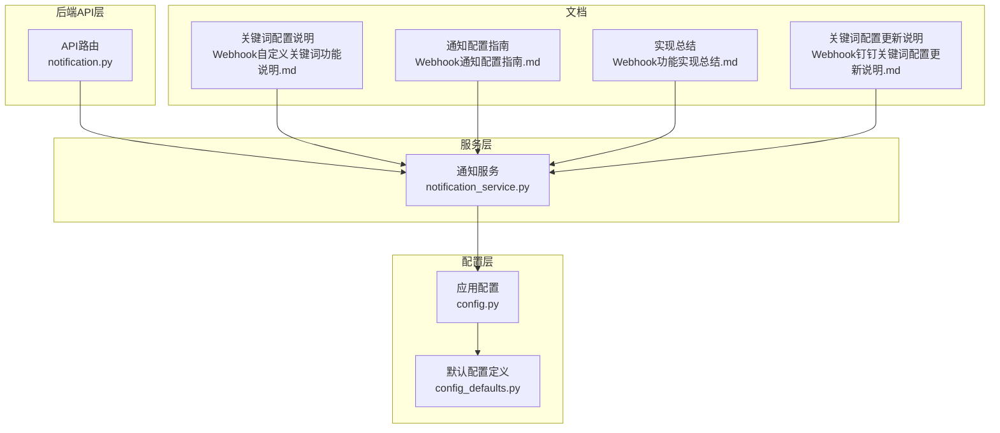
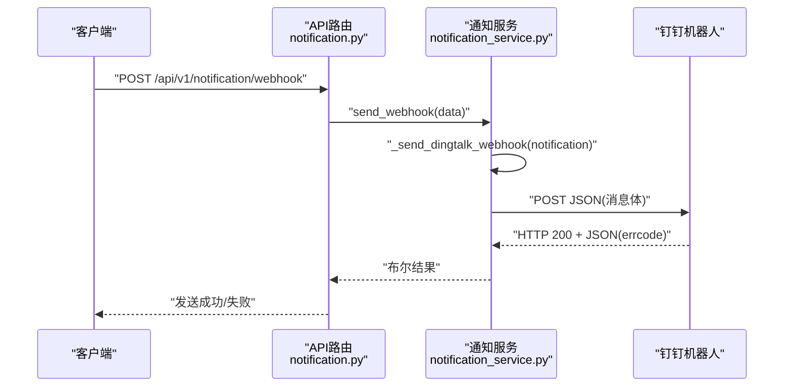
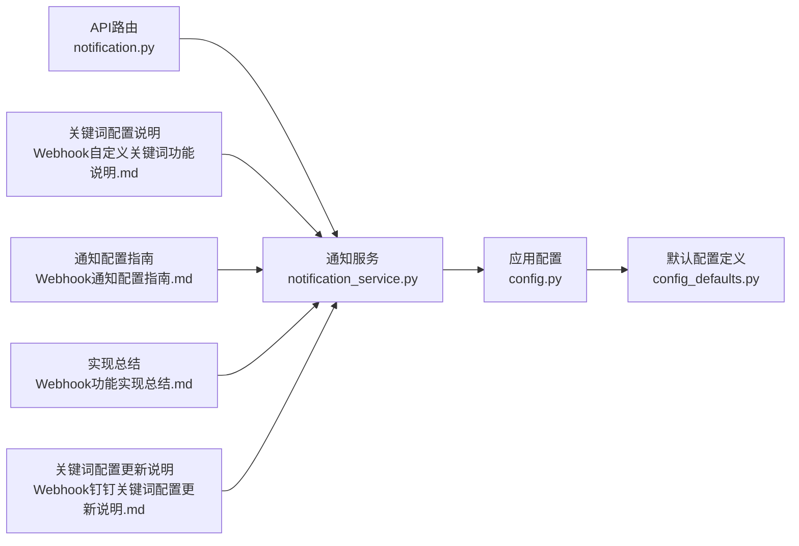

# 钉钉Webhook消息格式

<cite>
**本文引用的文件**
- [notification_service.py](file://old/notification_service.py)
- [notification.py](file://backend/app/api/v1/notification.py)
- [config.py](file://backend/app/config.py)
- [config_defaults.py](file://backend/app/core/config_defaults.py)
- [Webhook自定义关键词功能说明.md](file://docs/Webhook自定义关键词功能说明.md)
- [Webhook通知配置指南.md](file://docs/Webhook通知配置指南.md)
- [Webhook功能实现总结.md](file://docs/Webhook功能实现总结.md)
- [Webhook钉钉关键词配置更新说明.md](file://docs/Webhook钉钉关键词配置更新说明.md)
</cite>

## 目录
1. [简介](#简介)
2. [项目结构](#项目结构)
3. [核心组件](#核心组件)
4. [架构总览](#架构总览)
5. [详细组件分析](#详细组件分析)
6. [依赖关系分析](#依赖关系分析)
7. [性能与风控考量](#性能与风控考量)
8. [故障排查指南](#故障排查指南)
9. [结论](#结论)
10. [附录](#附录)

## 简介
本文件聚焦于钉钉Webhook消息的Markdown格式构建规则，涵盖标题层级、文本加粗、分隔线、代码块等语法在通知消息中的应用；解释如何通过自定义关键词（配置项WEBHOOK_KEYWORD）触发机器人消息；提供实时监测、持仓变化、系统告警等场景下的消息模板与变量替换机制说明；并结合notification_service.py中的发送逻辑，分析消息拼接过程与异常处理机制，帮助读者在不直接阅读代码的前提下理解消息格式与发送流程。

## 项目结构
围绕钉钉Webhook消息格式与发送的相关文件分布如下：
- 后端API层：负责对外暴露通知接口，调用服务层
- 服务层：封装通知发送逻辑（含钉钉/飞书）
- 配置层：集中管理WEBHOOK相关配置项
- 文档：提供关键词配置、消息格式示例、故障排查与最佳实践

图表来源
- [notification.py](file://backend/app/api/v1/notification.py#L1-L70)
- [notification_service.py](file://old/notification_service.py#L1-L759)
- [config.py](file://backend/app/config.py#L1-L92)
- [config_defaults.py](file://backend/app/core/config_defaults.py#L46-L99)
- [Webhook自定义关键词功能说明.md](file://docs/Webhook自定义关键词功能说明.md#L1-L252)
- [Webhook通知配置指南.md](file://docs/Webhook通知配置指南.md#L245-L375)
- [Webhook功能实现总结.md](file://docs/Webhook功能实现总结.md#L60-L304)
- [Webhook钉钉关键词配置更新说明.md](file://docs/Webhook钉钉关键词配置更新说明.md#L1-L81)

章节来源
- [notification.py](file://backend/app/api/v1/notification.py#L1-L70)
- [notification_service.py](file://old/notification_service.py#L1-L759)
- [config.py](file://backend/app/config.py#L1-L92)
- [config_defaults.py](file://backend/app/core/config_defaults.py#L46-L99)
- [Webhook自定义关键词功能说明.md](file://docs/Webhook自定义关键词功能说明.md#L1-L252)
- [Webhook通知配置指南.md](file://docs/Webhook通知配置指南.md#L245-L375)
- [Webhook功能实现总结.md](file://docs/Webhook功能实现总结.md#L60-L304)
- [Webhook钉钉关键词配置更新说明.md](file://docs/Webhook钉钉关键词配置更新说明.md#L1-L81)

## 核心组件
- 配置层
  - WEBHOOK_ENABLED：是否启用Webhook
  - WEBHOOK_TYPE：Webhook类型（dingtalk/feishu）
  - WEBHOOK_URL：Webhook地址
  - WEBHOOK_KEYWORD：自定义关键词（仅钉钉机器人安全验证使用）
- 服务层
  - _send_dingtalk_webhook：构建钉钉Markdown消息并发送
  - send_test_webhook：发送测试消息（包含关键词验证）
- API层
  - 对外提供发送Webhook、测试通知等接口

章节来源
- [config.py](file://backend/app/config.py#L55-L70)
- [notification_service.py](file://old/notification_service.py#L289-L510)
- [notification.py](file://backend/app/api/v1/notification.py#L28-L40)

## 架构总览
钉钉Webhook消息的发送流程如下：
- API接收请求，构造通知数据
- 服务层根据配置选择钉钉或飞书
- 针对钉钉：构建Markdown消息体，包含标题与内容两部分
- 使用requests发送POST请求至WEBHOOK_URL
- 解析返回结果，记录日志并返回状态

图表来源
- [notification.py](file://backend/app/api/v1/notification.py#L28-L40)
- [notification_service.py](file://old/notification_service.py#L289-L368)

## 详细组件分析

### 钉钉Markdown消息格式构建规则
钉钉Webhook采用Markdown消息体，包含标题与正文两部分。关键词（WEBHOOK_KEYWORD）可选，若存在则会同时出现在标题与正文中，以满足钉钉“自定义关键词”安全设置的要求。

- 标题层级
  - 使用Markdown标题层级，正文首段使用三级标题作为消息主标题
- 文本加粗
  - 使用Markdown加粗语法强调关键字段
- 分隔线
  - 使用Markdown分隔线语法分隔正文与落款
- 代码块
  - 当前钉钉消息模板未使用代码块语法；如需展示代码片段，可在消息中使用反引号包裹

消息模板要点（基于服务层实现）：
- 标题：标题前缀可包含关键词（当WEBHOOK_KEYWORD非空时）
- 正文：以三级标题开头，随后按字段顺序列出股票代码、名称、提醒类型、提醒内容、触发时间等
- 落款：使用分隔线与落款说明

章节来源
- [notification_service.py](file://old/notification_service.py#L311-L368)
- [Webhook自定义关键词功能说明.md](file://docs/Webhook自定义关键词功能说明.md#L64-L89)

### 关键词触发机制
- WEBHOOK_KEYWORD用于钉钉机器人“自定义关键词”安全设置
- 若关键词与钉钉机器人设置一致，消息可被成功发送
- 若关键词为空，则不会在消息中添加关键词前缀
- 飞书机器人通常不需要关键词，可将WEBHOOK_KEYWORD留空

章节来源
- [config.py](file://backend/app/config.py#L63-L68)
- [Webhook自定义关键词功能说明.md](file://docs/Webhook自定义关键词功能说明.md#L1-L63)
- [Webhook钉钉关键词配置更新说明.md](file://docs/Webhook钉钉关键词配置更新说明.md#L1-L81)

### 消息模板与变量替换机制
服务层在发送钉钉消息时，会将传入的notification对象中的字段值替换到消息模板中，形成最终的Markdown文本。典型字段包括：
- 股票代码（symbol）
- 股票名称（name）
- 提醒类型（type）
- 提醒内容（message）
- 触发时间（triggered_at）

章节来源
- [notification_service.py](file://old/notification_service.py#L311-L368)

### 发送逻辑与异常处理
- 请求发送
  - 使用requests.post发送JSON消息体至WEBHOOK_URL
  - 超时时间为10秒
- 返回解析
  - 针对钉钉：当errcode为0时视为成功
  - 针对飞书：当code为0时视为成功
- 异常处理
  - 捕获异常并打印日志
  - 若Webhook发送失败，系统会记录日志并继续运行，不影响核心功能

章节来源
- [notification_service.py](file://old/notification_service.py#L311-L368)
- [notification_service.py](file://old/notification_service.py#L369-L471)
- [Webhook通知配置指南.md](file://docs/Webhook通知配置指南.md#L315-L342)

### API接口与调用链
- API路由提供发送Webhook、测试通知等接口
- 服务层在API层之上，负责具体的发送逻辑
- 配置层提供WEBHOOK相关参数，贯穿发送流程

章节来源
- [notification.py](file://backend/app/api/v1/notification.py#L1-L70)
- [config.py](file://backend/app/config.py#L55-L70)

## 依赖关系分析
- 配置依赖
  - WEBHOOK_ENABLED/WEBHOOK_TYPE/WEBHOOK_URL/WEBHOOK_KEYWORD共同决定消息发送行为
- 组件耦合
  - API层依赖服务层
  - 服务层依赖配置层
  - 文档为配置与使用提供参考

图表来源
- [notification.py](file://backend/app/api/v1/notification.py#L1-L70)
- [notification_service.py](file://old/notification_service.py#L1-L759)
- [config.py](file://backend/app/config.py#L55-L70)
- [config_defaults.py](file://backend/app/core/config_defaults.py#L46-L99)
- [Webhook自定义关键词功能说明.md](file://docs/Webhook自定义关键词功能说明.md#L1-L252)
- [Webhook通知配置指南.md](file://docs/Webhook通知配置指南.md#L245-L375)
- [Webhook功能实现总结.md](file://docs/Webhook功能实现总结.md#L60-L304)
- [Webhook钉钉关键词配置更新说明.md](file://docs/Webhook钉钉关键词配置更新说明.md#L1-L81)

## 性能与风控考量
- 消息长度限制
  - 钉钉/飞书对消息长度有限制，建议控制消息内容简洁，避免过长文本
- 频率控制
  - 钉钉：每分钟最多20条
  - 飞书：每分钟最多50条
  - 系统应避免短时间内大量重复发送相同或相似消息
- 安全策略
  - Webhook地址属于敏感信息，不应公开分享或提交到版本控制
  - 建议定期更换Webhook地址
  - 针对钉钉，建议使用“自定义关键词”安全设置，关键词需与机器人设置一致

章节来源
- [Webhook通知配置指南.md](file://docs/Webhook通知配置指南.md#L278-L290)
- [Webhook功能实现总结.md](file://docs/Webhook功能实现总结.md#L335-L365)

## 故障排查指南
- 未收到Webhook消息
  - 检查WEBHOOK_ENABLED、WEBHOOK_URL、网络连接、机器人是否被移出群聊、关键词设置是否正确
- 关键词不匹配
  - 确认WEBHOOK_KEYWORD与钉钉机器人设置一致，避免多余空格
- 发送失败
  - 查看系统日志，确认HTTP状态码与返回信息
  - 网络超时或URL格式错误会导致发送失败

章节来源
- [Webhook通知配置指南.md](file://docs/Webhook通知配置指南.md#L300-L342)
- [Webhook钉钉关键词配置更新说明.md](file://docs/Webhook钉钉关键词配置更新说明.md#L181-L207)

## 结论
- 钉钉Webhook消息采用Markdown格式，标题与正文清晰分层，关键词可选但强烈建议启用以满足安全设置
- 服务层实现了完整的发送逻辑与异常处理，API层提供对外接口
- 配置层集中管理WEBHOOK相关参数，文档提供了关键词配置、消息格式示例与故障排查指南
- 在高频场景下，应关注频率限制与消息长度，避免触发风控

## 附录
- 场景示例
  - 实时监测：价格触发、涨跌幅触发、成交量异常
  - 智策定时分析：每日策略推送
  - 团队协作：将机器人加入团队群，统一推送
- 最佳实践
  - 同时使用邮件与Webhook，实现双重保障
  - 合理设置交易时段内的通知频率
  - 对Webhook地址进行妥善保护与定期轮换

章节来源
- [Webhook功能实现总结.md](file://docs/Webhook功能实现总结.md#L284-L477)
- [Webhook通知配置指南.md](file://docs/Webhook通知配置指南.md#L344-L375)