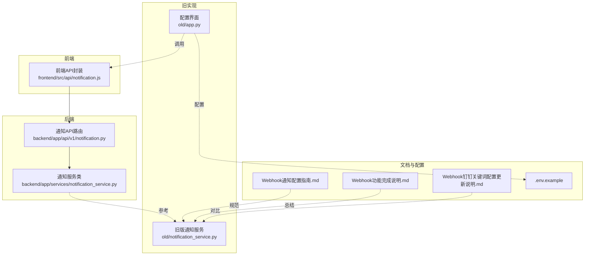
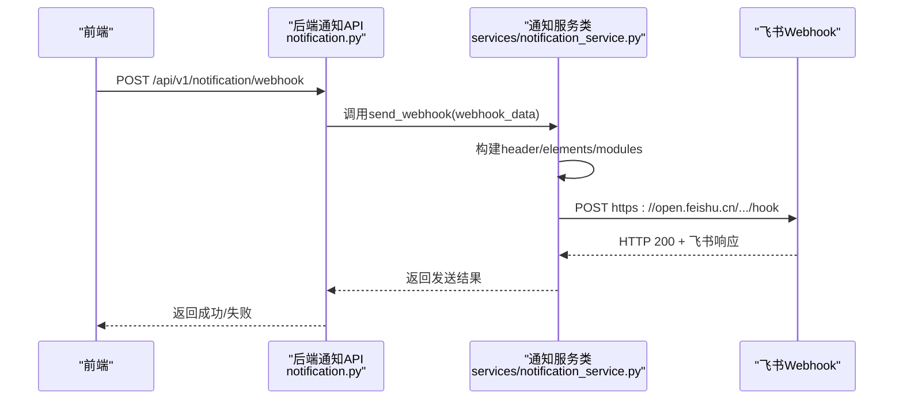
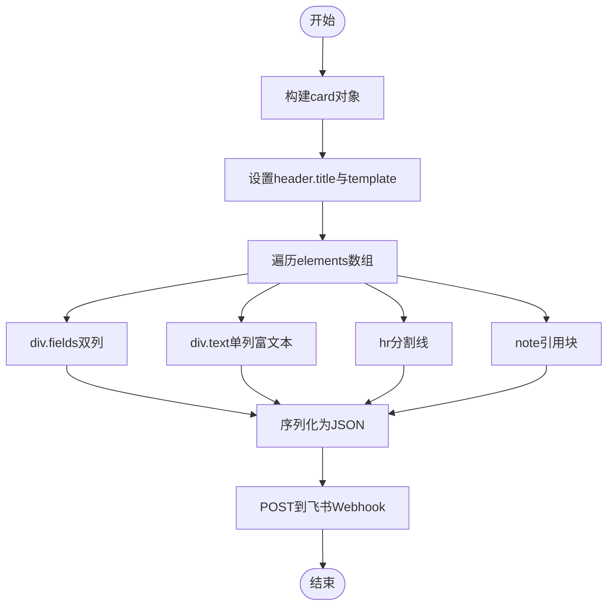
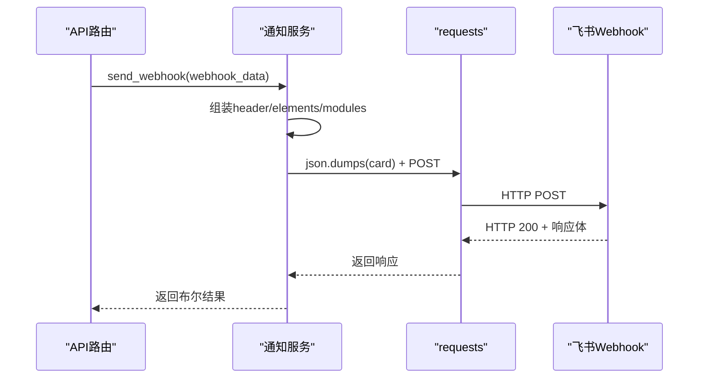
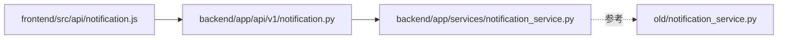

# 飞书Webhook消息格式

<cite>
**本文引用的文件**
- [notification_service.py](file://old/notification_service.py)
- [notification.py](file://backend/app/api/v1/notification.py)
- [notification_service.py](file://backend/app/services/notification_service.py)
- [Webhook通知配置指南.md](file://docs/Webhook通知配置指南.md)
- [Webhook功能完成说明.md](file://docs/Webhook功能完成说明.md)
- [Webhook钉钉关键词配置更新说明.md](file://docs/Webhook钉钉关键词配置更新说明.md)
- [app.py](file://old/app.py)
- [frontend/src/api/notification.js](file://frontend/src/api/notification.js)
- [.env.example](file://.env.example)
</cite>

## 目录
1. [简介](#简介)
2. [项目结构](#项目结构)
3. [核心组件](#核心组件)
4. [架构总览](#架构总览)
5. [详细组件分析](#详细组件分析)
6. [依赖关系分析](#依赖关系分析)
7. [性能与可靠性](#性能与可靠性)
8. [故障排查指南](#故障排查指南)
9. [结论](#结论)
10. [附录](#附录)

## 简介
本文件围绕飞书Webhook交互式卡片消息的JSON结构设计进行深入解析，重点覆盖以下方面：
- header、elements、modules等核心字段的配置方式与语义
- 不同通知类型（如实时价格突破、主力资金异动、持仓收益提醒）对应的卡片布局与交互元素（按钮、分割线、引用块）的使用规范
- 基于实际代码的模板示例路径，展示如何动态生成结构化消息内容
- 消息卡片的样式定制能力（颜色、图标、富文本排版），提升可读性与用户体验
- 结合服务端实现逻辑，阐述消息构建与序列化过程，以及飞书API的响应处理与错误重试机制

## 项目结构
与飞书Webhook交互式卡片消息相关的核心位置如下：
- 服务端通知实现：旧版实现位于旧目录的notification_service.py，新版后端API与服务类位于backend/app/api/v1/notification.py与backend/app/services/notification_service.py
- 前端接口封装：frontend/src/api/notification.js
- 文档与配置：docs/Webhook通知配置指南.md、Webhook功能完成说明.md、Webhook钉钉关键词配置更新说明.md、.env.example
- 配置界面：old/app.py中的Webhook配置UI

图表来源
- [notification.py](file://backend/app/api/v1/notification.py#L1-L70)
- [notification_service.py](file://backend/app/services/notification_service.py#L1-L34)
- [notification_service.py](file://old/notification_service.py#L369-L449)
- [app.py](file://old/app.py#L2297-L2367)
- [frontend/src/api/notification.js](file://frontend/src/api/notification.js#L1-L38)
- [.env.example](file://.env.example#L83-L110)

章节来源
- [notification.py](file://backend/app/api/v1/notification.py#L1-L70)
- [notification_service.py](file://backend/app/services/notification_service.py#L1-L34)
- [notification_service.py](file://old/notification_service.py#L369-L449)
- [app.py](file://old/app.py#L2297-L2367)
- [frontend/src/api/notification.js](file://frontend/src/api/notification.js#L1-L38)
- [.env.example](file://.env.example#L83-L110)

## 核心组件
- 旧版通知服务（飞书交互式卡片实现）：负责构建飞书交互式卡片消息的header、elements、modules等字段，并通过requests发送至飞书Webhook
- 新版后端通知API与服务类：提供统一的Webhook发送接口，具体消息格式由服务层按平台类型动态生成
- 前端API封装：提供发送Webhook、获取历史、测试通知等接口
- 文档与配置：提供飞书卡片消息格式示例、配置步骤与故障排查

章节来源
- [notification_service.py](file://old/notification_service.py#L369-L449)
- [notification_service.py](file://backend/app/services/notification_service.py#L1-L34)
- [notification.py](file://backend/app/api/v1/notification.py#L1-L70)
- [frontend/src/api/notification.js](file://frontend/src/api/notification.js#L1-L38)

## 架构总览
下图展示了从前端发起Webhook请求到服务端构建飞书交互式卡片消息并发送的完整流程。

图表来源
- [notification.py](file://backend/app/api/v1/notification.py#L28-L40)
- [notification_service.py](file://backend/app/services/notification_service.py#L19-L22)
- [notification_service.py](file://old/notification_service.py#L369-L449)

## 详细组件分析

### 飞书交互式卡片消息JSON结构设计
飞书交互式卡片消息采用“卡片”模型，核心字段包括：
- msg_type：消息类型，交互式卡片使用interactive
- card.header：卡片头部，包含标题与模板色
- card.elements：卡片主体元素数组，支持多种tag类型（div、hr、note、lark_md等）
- card.modules：模块化布局（部分文档与实现中提及，实际旧实现主要使用elements）

旧版实现中，飞书交互式卡片的构建要点：
- header.title.content：卡片标题内容
- header.template：卡片模板色（如blue）
- elements.div.fields：双列信息展示（is_short=true）
- elements.div.text：单列富文本内容（tag=lark_md）
- elements.hr：分割线
- elements.note：引用块/备注

图表来源
- [notification_service.py](file://old/notification_service.py#L369-L449)

章节来源
- [notification_service.py](file://old/notification_service.py#L369-L449)

### 不同通知类型的卡片布局与交互元素规范
根据仓库文档与实现，飞书交互式卡片用于“实时监测通知”，其布局规范如下：
- 卡片头部：标题包含“通知类型 + 股票代码”，模板色用于强调
- 主体区域：
  - 双列信息：股票代码、股票名称
  - 双列信息：提醒类型、触发时间
  - 单列富文本：提醒内容（支持lark_md）
  - 分割线：hr
  - 引用块：note（用于系统发送说明）
- 交互元素：旧实现未使用按钮；若需按钮，可在elements中增加对应tag并绑定回调

章节来源
- [Webhook通知配置指南.md](file://docs/Webhook通知配置指南.md#L160-L200)
- [notification_service.py](file://old/notification_service.py#L369-L449)

### 基于实际代码的模板示例（路径指引）
- 飞书交互式卡片构建（header/elements）：参见路径
  - [notification_service.py](file://old/notification_service.py#L369-L449)
- Webhook测试通知（飞书）：参见路径
  - [notification_service.py](file://old/notification_service.py#L480-L509)
- Webhook测试通知（钉钉）：参见路径
  - [notification_service.py](file://old/notification_service.py#L480-L509)
- Webhook配置状态检查：参见路径
  - [notification_service.py](file://old/notification_service.py#L511-L518)

章节来源
- [notification_service.py](file://old/notification_service.py#L369-L449)
- [notification_service.py](file://old/notification_service.py#L480-L509)
- [notification_service.py](file://old/notification_service.py#L511-L518)

### 样式定制能力（颜色、图标、富文本排版）
- 颜色：header.template用于设置卡片模板色（如blue），用于视觉强调
- 图标：可在header.title.content中加入emoji或图标字符以增强可读性
- 富文本排版：elements.div.text使用lark_md，支持加粗、换行等Markdown语法；elements.div.fields可配合短字段并排展示，提升信息密度

章节来源
- [notification_service.py](file://old/notification_service.py#L369-L449)
- [Webhook通知配置指南.md](file://docs/Webhook通知配置指南.md#L160-L200)

### 服务端实现逻辑与序列化过程
- 请求入口：后端API路由接收webhook_data参数
- 服务层：通知服务类负责消息构建与发送
- 序列化：将Python字典转换为JSON后通过requests.post发送
- 响应处理：根据HTTP状态码与平台特定字段判断成功与否

图表来源
- [notification.py](file://backend/app/api/v1/notification.py#L28-L40)
- [notification_service.py](file://backend/app/services/notification_service.py#L19-L22)
- [notification_service.py](file://old/notification_service.py#L369-L449)

章节来源
- [notification.py](file://backend/app/api/v1/notification.py#L28-L40)
- [notification_service.py](file://backend/app/services/notification_service.py#L19-L22)
- [notification_service.py](file://old/notification_service.py#L369-L449)

### 飞书API响应处理与错误重试机制
- 响应处理：
  - HTTP状态码：200视为网络层成功
  - 飞书平台特定字段：旧实现中未对飞书响应体进行严格校验，仅依据HTTP 200返回
- 错误重试机制：
  - 旧实现未内置重试逻辑
  - 建议在生产环境中增加指数退避重试、超时控制与幂等性保障

章节来源
- [notification_service.py](file://old/notification_service.py#L369-L449)

## 依赖关系分析
- 前端通过notification.js调用后端API
- 后端API依赖通知服务类进行消息构建与发送
- 旧实现中存在独立的通知服务（旧版notification_service.py），新后端服务类为占位实现，实际消息格式由旧实现提供参考

图表来源
- [frontend/src/api/notification.js](file://frontend/src/api/notification.js#L1-L38)
- [notification.py](file://backend/app/api/v1/notification.py#L1-L70)
- [notification_service.py](file://backend/app/services/notification_service.py#L1-L34)
- [notification_service.py](file://old/notification_service.py#L369-L449)

章节来源
- [frontend/src/api/notification.js](file://frontend/src/api/notification.js#L1-L38)
- [notification.py](file://backend/app/api/v1/notification.py#L1-L70)
- [notification_service.py](file://backend/app/services/notification_service.py#L1-L34)
- [notification_service.py](file://old/notification_service.py#L369-L449)

## 性能与可靠性
- 超时控制：请求发送设置超时，避免阻塞
- 错误降级：当Webhook失败时，系统可继续运行并记录日志
- 配置验证：前端与后端均提供配置状态检查，减少无效发送

章节来源
- [notification_service.py](file://old/notification_service.py#L369-L449)
- [notification_service.py](file://old/notification_service.py#L511-L518)

## 故障排查指南
- 飞书消息格式异常：确认选择了正确的Webhook类型（feishu），并重新保存配置后测试
- Webhook URL错误：检查URL是否完整、机器人是否仍在群内
- 网络连接问题：检查本地网络与防火墙设置
- 配置界面测试：通过前端“测试Webhook连通”按钮验证配置

章节来源
- [Webhook功能完成说明.md](file://docs/Webhook功能完成说明.md#L409-L417)
- [app.py](file://old/app.py#L2297-L2367)
- [.env.example](file://.env.example#L83-L110)

## 结论
本仓库提供了飞书Webhook交互式卡片消息的完整实现参考，核心在于：
- 正确设置header、elements与modules（以elements为主）
- 使用lark_md进行富文本排版，hr与note提升可读性
- 通过HTTP 200与平台特定字段进行响应处理
- 建议在生产环境中完善重试、超时与幂等性保障

[本节不涉及具体文件分析，故无章节来源]

## 附录
- 飞书交互式卡片消息格式示例（路径指引）：
  - [Webhook通知配置指南.md](file://docs/Webhook通知配置指南.md#L160-L200)
- Webhook配置与测试（路径指引）：
  - [Webhook功能完成说明.md](file://docs/Webhook功能完成说明.md#L279-L329)
  - [Webhook钉钉关键词配置更新说明.md](file://docs/Webhook钉钉关键词配置更新说明.md#L36-L81)
  - [.env.example](file://.env.example#L83-L110)

章节来源
- [Webhook通知配置指南.md](file://docs/Webhook通知配置指南.md#L160-L200)
- [Webhook功能完成说明.md](file://docs/Webhook功能完成说明.md#L279-L329)
- [Webhook钉钉关键词配置更新说明.md](file://docs/Webhook钉钉关键词配置更新说明.md#L36-L81)
- [.env.example](file://.env.example#L83-L110)