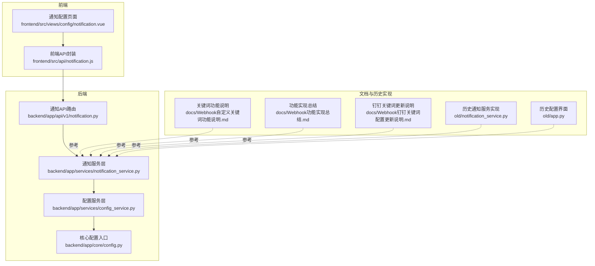
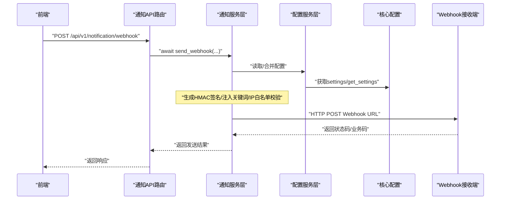
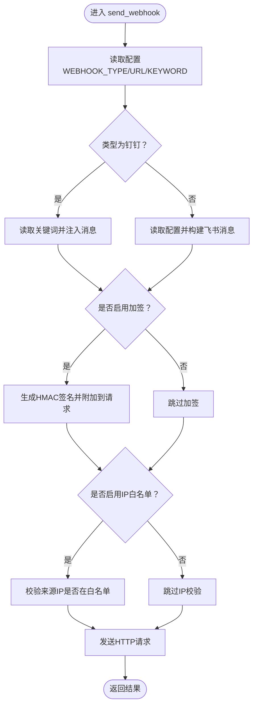
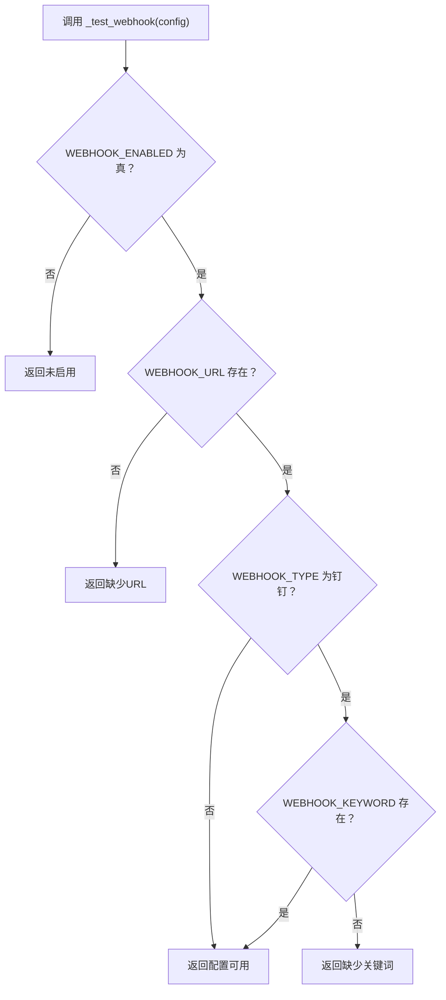
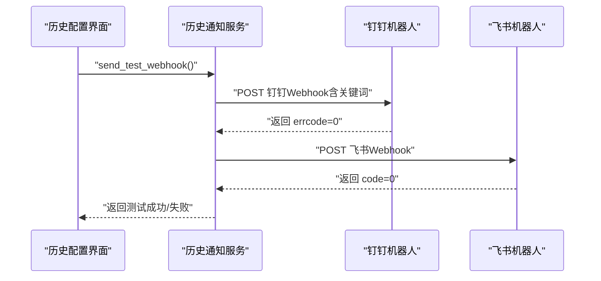
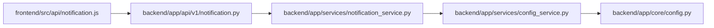

# Webhook安全机制

<cite>
**本文引用的文件**
- [backend/app/services/notification_service.py](file://backend/app/services/notification_service.py)
- [backend/app/api/v1/notification.py](file://backend/app/api/v1/notification.py)
- [backend/app/services/config_service.py](file://backend/app/services/config_service.py)
- [backend/app/core/config.py](file://backend/app/core/config.py)
- [frontend/src/api/notification.js](file://frontend/src/api/notification.js)
- [frontend/src/views/config/notification.vue](file://frontend/src/views/config/notification.vue)
- [docs/Webhook自定义关键词功能说明.md](file://docs/Webhook自定义关键词功能说明.md)
- [docs/Webhook功能实现总结.md](file://docs/Webhook功能实现总结.md)
- [docs/Webhook钉钉关键词配置更新说明.md](file://docs/Webhook钉钉关键词配置更新说明.md)
- [old/notification_service.py](file://old/notification_service.py)
- [old/app.py](file://old/app.py)
</cite>

## 目录
1. [简介](#简介)
2. [项目结构](#项目结构)
3. [核心组件](#核心组件)
4. [架构总览](#架构总览)
5. [详细组件分析](#详细组件分析)
6. [依赖关系分析](#依赖关系分析)
7. [性能考量](#性能考量)
8. [故障排查指南](#故障排查指南)
9. [结论](#结论)
10. [附录](#附录)

## 简介
本文件围绕Webhook通知系统的安全机制展开，重点解析以下三类防护手段：
- 加签验证：通过生成HMAC签名确保请求来源可信与消息未被篡改
- IP白名单：限制允许访问Webhook接收端的客户端IP范围
- 自定义关键词：在消息中注入关键词以满足钉钉等平台的安全策略

同时，结合后端服务层的send_webhook方法与历史实现，说明如何在发送请求时生成HMAC签名或添加安全关键词以通过接收方验证；并给出自定义关键词的存储、匹配与验证流程，以及其在防止未授权调用与CSRF攻击中的作用。最后对比不同安全机制的优缺点，并提供安全配置建议。

## 项目结构
Webhook相关能力分布在后端服务层、API路由层、配置服务层与前端交互层，文档与历史实现提供了关键词与测试流程的参考。

图表来源
- [backend/app/api/v1/notification.py](file://backend/app/api/v1/notification.py#L1-L70)
- [backend/app/services/notification_service.py](file://backend/app/services/notification_service.py#L1-L34)
- [backend/app/services/config_service.py](file://backend/app/services/config_service.py#L1-L182)
- [backend/app/core/config.py](file://backend/app/core/config.py#L1-L8)
- [frontend/src/api/notification.js](file://frontend/src/api/notification.js#L1-L38)
- [frontend/src/views/config/notification.vue](file://frontend/src/views/config/notification.vue#L1-L14)
- [docs/Webhook自定义关键词功能说明.md](file://docs/Webhook自定义关键词功能说明.md#L1-L120)
- [docs/Webhook功能实现总结.md](file://docs/Webhook功能实现总结.md#L60-L134)
- [docs/Webhook钉钉关键词配置更新说明.md](file://docs/Webhook钉钉关键词配置更新说明.md#L1-L81)
- [old/notification_service.py](file://old/notification_service.py#L1-L200)
- [old/app.py](file://old/app.py#L2297-L2367)

章节来源
- [backend/app/api/v1/notification.py](file://backend/app/api/v1/notification.py#L1-L70)
- [backend/app/services/notification_service.py](file://backend/app/services/notification_service.py#L1-L34)
- [backend/app/services/config_service.py](file://backend/app/services/config_service.py#L1-L182)
- [backend/app/core/config.py](file://backend/app/core/config.py#L1-L8)
- [frontend/src/api/notification.js](file://frontend/src/api/notification.js#L1-L38)
- [frontend/src/views/config/notification.vue](file://frontend/src/views/config/notification.vue#L1-L14)
- [docs/Webhook自定义关键词功能说明.md](file://docs/Webhook自定义关键词功能说明.md#L1-L120)
- [docs/Webhook功能实现总结.md](file://docs/Webhook功能实现总结.md#L60-L134)
- [docs/Webhook钉钉关键词配置更新说明.md](file://docs/Webhook钉钉关键词配置更新说明.md#L1-L81)
- [old/notification_service.py](file://old/notification_service.py#L1-L200)
- [old/app.py](file://old/app.py#L2297-L2367)

## 核心组件
- 通知API路由：提供发送Webhook、获取历史、测试通知等接口，其中send_webhook接口将请求转发至服务层。
- 通知服务层：负责Webhook发送逻辑（当前为占位实现），未来将承载加签、关键词注入、IP白名单等安全策略。
- 配置服务层：提供配置读取、更新、验证与测试能力，包含Webhook配置测试逻辑（如钉钉需关键词）。
- 前端API封装与配置页面：封装发送Webhook请求与展示通知配置页面。
- 文档与历史实现：提供关键词配置、测试流程与UI交互参考。

章节来源
- [backend/app/api/v1/notification.py](file://backend/app/api/v1/notification.py#L1-L70)
- [backend/app/services/notification_service.py](file://backend/app/services/notification_service.py#L1-L34)
- [backend/app/services/config_service.py](file://backend/app/services/config_service.py#L112-L125)
- [frontend/src/api/notification.js](file://frontend/src/api/notification.js#L12-L18)
- [frontend/src/views/config/notification.vue](file://frontend/src/views/config/notification.vue#L1-L14)
- [docs/Webhook自定义关键词功能说明.md](file://docs/Webhook自定义关键词功能说明.md#L1-L49)
- [docs/Webhook功能实现总结.md](file://docs/Webhook功能实现总结.md#L60-L134)
- [docs/Webhook钉钉关键词配置更新说明.md](file://docs/Webhook钉钉关键词配置更新说明.md#L1-L81)
- [old/notification_service.py](file://old/notification_service.py#L290-L367)
- [old/app.py](file://old/app.py#L2297-L2367)

## 架构总览
下图展示了从前端到后端服务层的关键调用链与安全策略落地点。

图表来源
- [backend/app/api/v1/notification.py](file://backend/app/api/v1/notification.py#L28-L40)
- [backend/app/services/notification_service.py](file://backend/app/services/notification_service.py#L19-L22)
- [backend/app/services/config_service.py](file://backend/app/services/config_service.py#L23-L41)
- [backend/app/core/config.py](file://backend/app/core/config.py#L1-L8)
- [old/notification_service.py](file://old/notification_service.py#L311-L367)

## 详细组件分析

### 组件A：通知服务层（send_webhook与安全策略）
- 当前实现：send_webhook为占位实现，尚未接入加签、关键词注入与IP白名单。
- 建议实现要点：
  - 加签验证：在发送前对请求体进行哈希计算，使用共享密钥生成HMAC签名，随请求头或请求体携带，接收端按相同算法验证。
  - IP白名单：在发送前校验调用来源IP是否在允许列表内，拒绝不在白名单的请求。
  - 关键词注入：根据配置决定是否在消息标题与内容中添加关键词，以满足钉钉等平台的安全策略。
- 与配置服务联动：通过配置服务读取WEBHOOK_TYPE、WEBHOOK_URL、WEBHOOK_KEYWORD等配置，必要时进行测试验证。

图表来源
- [backend/app/services/notification_service.py](file://backend/app/services/notification_service.py#L19-L22)
- [backend/app/services/config_service.py](file://backend/app/services/config_service.py#L112-L125)
- [docs/Webhook自定义关键词功能说明.md](file://docs/Webhook自定义关键词功能说明.md#L1-L49)
- [docs/Webhook钉钉关键词配置更新说明.md](file://docs/Webhook钉钉关键词配置更新说明.md#L1-L81)

章节来源
- [backend/app/services/notification_service.py](file://backend/app/services/notification_service.py#L19-L22)
- [backend/app/services/config_service.py](file://backend/app/services/config_service.py#L112-L125)
- [docs/Webhook自定义关键词功能说明.md](file://docs/Webhook自定义关键词功能说明.md#L1-L49)
- [docs/Webhook钉钉关键词配置更新说明.md](file://docs/Webhook钉钉关键词配置更新说明.md#L1-L81)

### 组件B：配置服务层（Webhook配置测试）
- 验证逻辑：当WEBHOOK_TYPE为“钉钉”时，若WEBHOOK_KEYWORD为空则判定为不完整；否则认为配置字段完整。
- 用途：前端在保存或测试前调用配置测试接口，提前发现配置问题。

图表来源
- [backend/app/services/config_service.py](file://backend/app/services/config_service.py#L112-L125)

章节来源
- [backend/app/services/config_service.py](file://backend/app/services/config_service.py#L112-L125)

### 组件C：历史实现参考（关键词注入与测试）
- 关键词注入：历史实现会在钉钉消息标题与内容中自动添加关键词，以满足钉钉机器人“自定义关键词”安全设置。
- 测试流程：历史实现提供测试Webhook功能，按当前配置向钉钉或飞书发送测试消息，并返回结果。

图表来源
- [old/notification_service.py](file://old/notification_service.py#L473-L510)
- [old/app.py](file://old/app.py#L2297-L2367)

章节来源
- [old/notification_service.py](file://old/notification_service.py#L473-L510)
- [old/app.py](file://old/app.py#L2297-L2367)

### 组件D：前端交互与API封装
- 前端API封装：提供发送Webhook、获取历史、测试通知的请求方法。
- 通知配置页面：当前处于开发中，后续将承载Webhook开关、类型、URL与关键词等配置项。

章节来源
- [frontend/src/api/notification.js](file://frontend/src/api/notification.js#L12-L18)
- [frontend/src/views/config/notification.vue](file://frontend/src/views/config/notification.vue#L1-L14)

## 依赖关系分析
- API路由依赖服务层；服务层依赖配置服务与核心配置；前端通过API封装调用后端。
- 配置服务依赖核心配置模块导出的settings/get_settings，用于读取运行时配置。

图表来源
- [frontend/src/api/notification.js](file://frontend/src/api/notification.js#L1-L38)
- [backend/app/api/v1/notification.py](file://backend/app/api/v1/notification.py#L1-L70)
- [backend/app/services/notification_service.py](file://backend/app/services/notification_service.py#L1-L34)
- [backend/app/services/config_service.py](file://backend/app/services/config_service.py#L1-L182)
- [backend/app/core/config.py](file://backend/app/core/config.py#L1-L8)

章节来源
- [frontend/src/api/notification.js](file://frontend/src/api/notification.js#L1-L38)
- [backend/app/api/v1/notification.py](file://backend/app/api/v1/notification.py#L1-L70)
- [backend/app/services/notification_service.py](file://backend/app/services/notification_service.py#L1-L34)
- [backend/app/services/config_service.py](file://backend/app/services/config_service.py#L1-L182)
- [backend/app/core/config.py](file://backend/app/core/config.py#L1-L8)

## 性能考量
- 请求超时与重试：发送Webhook时应设置合理超时时间，并在失败时进行有限重试，避免阻塞主流程。
- 并发控制：批量发送通知时应限制并发度，避免对第三方平台造成压力。
- 日志与可观测性：记录发送状态、错误码与耗时，便于定位问题与容量评估。
- 缓存与去重：对重复通知进行去重处理，减少无效请求。

## 故障排查指南
- 关键词不匹配：检查WEBHOOK_KEYWORD与钉钉机器人安全设置是否一致；确认.env文件编码与字符集。
- URL不可达：检查WEBHOOK_URL是否正确、网络连通性与防火墙策略。
- 类型不支持：确认WEBHOOK_TYPE为“dingtalk”或“feishu”，并按对应平台的消息格式准备数据。
- 配置未启用：确保WEBHOOK_ENABLED为“true”，否则不会尝试发送。
- 前端测试：使用前端提供的测试按钮，实时验证配置并查看反馈。

章节来源
- [docs/Webhook自定义关键词功能说明.md](file://docs/Webhook自定义关键词功能说明.md#L100-L120)
- [docs/Webhook功能实现总结.md](file://docs/Webhook功能实现总结.md#L60-L134)
- [docs/Webhook钉钉关键词配置更新说明.md](file://docs/Webhook钉钉关键词配置更新说明.md#L1-L81)
- [old/app.py](file://old/app.py#L2297-L2367)

## 结论
- 当前后端服务层的send_webhook仍为占位实现，尚未集成加签、IP白名单与关键词注入等安全机制。
- 历史实现提供了关键词注入与测试流程的参考，可作为新实现的起点。
- 建议优先实现关键词注入与配置测试，再逐步引入加签与IP白名单，形成多层防护。
- 通过组合使用多种机制、定期轮换密钥与监控异常调用行为，可显著提升Webhook通知的安全性与可靠性。

## 附录

### 自定义关键词实现逻辑（存储、匹配与验证）
- 存储：关键词通过环境变量或数据库配置项存储（如WEBHOOK_KEYWORD），并在配置服务中读取与验证。
- 匹配：发送前将关键词注入到消息标题与内容中，接收端（如钉钉）依据安全策略进行匹配。
- 验证：配置测试阶段对关键词进行必填校验，确保与机器人设置一致。

章节来源
- [docs/Webhook自定义关键词功能说明.md](file://docs/Webhook自定义关键词功能说明.md#L1-L49)
- [docs/Webhook功能实现总结.md](file://docs/Webhook功能实现总结.md#L60-L134)
- [docs/Webhook钉钉关键词配置更新说明.md](file://docs/Webhook钉钉关键词配置更新说明.md#L1-L81)
- [old/notification_service.py](file://old/notification_service.py#L311-L367)

### 加签验证与IP白名单（技术原理与代码实现要点）
- 加签验证（HMAC）：
  - 原理：对请求体（或特定字段）进行哈希计算，使用共享密钥生成签名，接收端用相同密钥与算法复核签名。
  - 实现要点：选择稳定算法（如SHA-256）、统一编码与排序规则、在请求头或请求体中携带签名、严格密钥管理与轮换。
- IP白名单：
  - 原理：仅允许来自白名单内的IP发起请求，其他来源一律拒绝。
  - 实现要点：维护动态白名单、支持CIDR网段、记录拒绝事件与告警、考虑NAT与CDN带来的IP变化。

章节来源
- [docs/Webhook功能实现总结.md](file://docs/Webhook功能实现总结.md#L120-L136)
- [docs/Webhook钉钉关键词配置更新说明.md](file://docs/Webhook钉钉关键词配置更新说明.md#L120-L136)

### 对比分析与安全配置建议
- 加签：强身份验证与完整性保护，但实现复杂、需妥善管理密钥与轮换。
- IP白名单：简单直接，但缺乏灵活性，不适合动态IP或CDN场景。
- 关键词验证：易于实现，安全性相对较低，适合基础防护与快速上线。
- 建议：
  - 组合使用：关键词作为第一道防线，加签作为强身份验证，IP白名单作为边界控制。
  - 定期轮换：对共享密钥与关键词进行周期性轮换，降低泄露风险。
  - 监控告警：记录异常调用行为（如频繁失败、异常IP、签名不匹配），及时告警处置。
  - 最小权限：仅暴露必要的Webhook端点，限制HTTP方法与路径，配合鉴权中间件。

章节来源
- [docs/Webhook功能实现总结.md](file://docs/Webhook功能实现总结.md#L120-L136)
- [docs/Webhook钉钉关键词配置更新说明.md](file://docs/Webhook钉钉关键词配置更新说明.md#L120-L136)