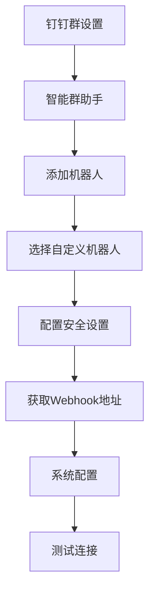
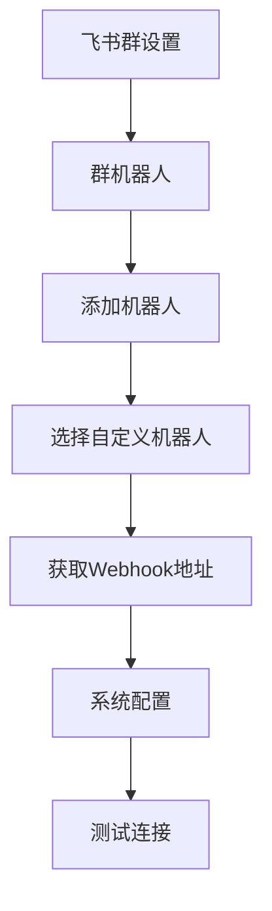
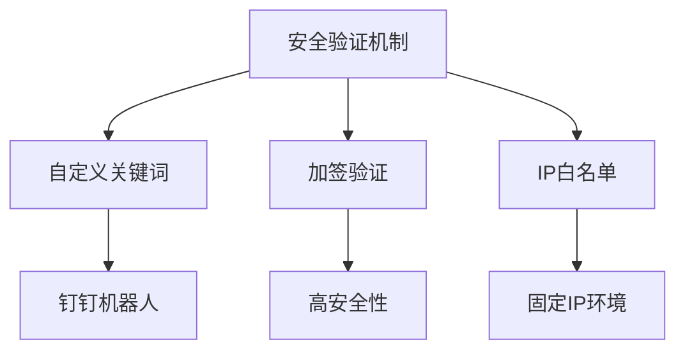
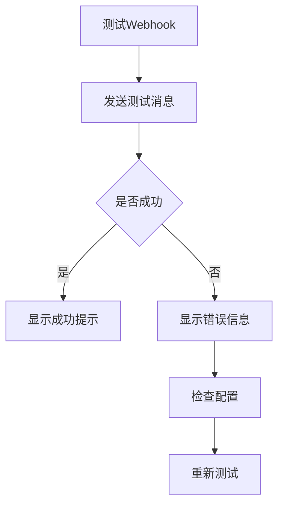

# Webhook通知配置

<cite>
**本文档引用文件**   
- [notification_service.py](file://old/notification_service.py)
- [config_manager.py](file://old/config_manager.py)
- [app.py](file://old/app.py)
- [sector_strategy_scheduler.py](file://old/sector_strategy_scheduler.py)
- [Webhook通知配置指南.md](file://docs/Webhook通知配置指南.md)
- [Webhook功能实现总结.md](file://docs/Webhook功能实现总结.md)
- [Webhook自定义关键词功能说明.md](file://docs/Webhook自定义关键词功能说明.md)
- [Webhook钉钉关键词配置更新说明.md](file://docs/Webhook钉钉关键词配置更新说明.md)
- [notification.js](file://frontend/src/api/notification.js)
- [index.vue](file://frontend/src/views/config/index.vue)
</cite>

## 目录
1. [配置流程概述](#配置流程概述)
2. [钉钉机器人集成](#钉钉机器人集成)
3. [飞书机器人集成](#飞书机器人集成)
4. [安全验证机制](#安全验证机制)
5. [消息格式与JSON结构](#消息格式与json结构)
6. [测试与异常处理](#测试与异常处理)
7. [安全最佳实践](#安全最佳实践)

## 配置流程概述

Webhook通知配置流程主要分为三个步骤：在目标平台创建自定义机器人、获取Webhook URL，以及在系统中配置相关参数。用户可以通过Web界面或直接编辑`.env`文件进行配置。

在系统中，Webhook配置主要涉及三个环境变量：`WEBHOOK_ENABLED`用于启用或禁用Webhook通知，`WEBHOOK_TYPE`用于指定Webhook类型（支持钉钉和飞书），以及`WEBHOOK_URL`用于填写从平台获取的Webhook地址。配置完成后，系统会自动根据配置类型发送相应格式的消息。

前端配置界面提供了直观的表单，用户可以在"环境配置"的"通知配置"标签页中完成所有设置。后端通过`config_manager.py`模块读取和保存配置，并在`notification_service.py`中实现消息发送逻辑。

**Section sources**
- [Webhook通知配置指南.md](file://docs/Webhook通知配置指南.md#L1-L445)
- [Webhook功能实现总结.md](file://docs/Webhook功能实现总结.md#L1-L477)
- [index.vue](file://frontend/src/views/config/index.vue#L211-L238)

## 钉钉机器人集成

钉钉机器人集成需要在钉钉群聊中创建自定义机器人并获取Webhook URL。首先，在钉钉群设置中选择"智能群助手"，然后添加自定义机器人。创建完成后，系统会生成一个唯一的Webhook地址，格式为`https://oapi.dingtalk.com/robot/send?access_token=xxxxxxxxxxxxxxxx`。

在安全设置中，推荐使用"自定义关键词"验证方式。系统支持的推荐关键词包括"股票"、"分析"、"智策"、"监测"和"提醒"，这些关键词已内置在系统消息中，无需额外配置。用户也可以选择加签验证或IP白名单等其他安全方式。

在系统配置中，需要将`WEBHOOK_TYPE`设置为`dingtalk`，并将获取的Webhook地址填入`WEBHOOK_URL`。如果使用了自定义关键词验证，还需在`WEBHOOK_KEYWORD`中填写相应的关键词。



**Diagram sources**
- [Webhook通知配置指南.md](file://docs/Webhook通知配置指南.md#L59-L85)
- [Webhook自定义关键词功能说明.md](file://docs/Webhook自定义关键词功能说明.md#L28-L48)

**Section sources**
- [Webhook通知配置指南.md](file://docs/Webhook通知配置指南.md#L59-L85)
- [Webhook自定义关键词功能说明.md](file://docs/Webhook自定义关键词功能说明.md#L28-L48)
- [notification_service.py](file://old/notification_service.py#L311-L368)

## 飞书机器人集成

飞书机器人集成流程与钉钉类似，需要在飞书群聊中创建自定义机器人。在群设置中选择"群机器人"，然后添加自定义机器人。创建完成后，系统会生成一个Webhook地址，格式为`https://open.feishu.cn/open-apis/bot/v2/hook/xxxxxxxxxxxxxxxx`。

飞书机器人的安全设置相对简单，通常不需要配置自定义关键词。系统会自动根据飞书的API要求格式化消息内容。在系统配置中，需要将`WEBHOOK_TYPE`设置为`feishu`，并将获取的Webhook地址填入`WEBHOOK_URL`。

飞书支持交互式卡片消息，系统会自动将通知内容格式化为卡片形式，提供更美观的展示效果。消息包含标题、内容、字段和分隔线等元素，确保信息清晰易读。



**Diagram sources**
- [Webhook通知配置指南.md](file://docs/Webhook通知配置指南.md#L134-L158)
- [notification_service.py](file://old/notification_service.py#L369-L471)

**Section sources**
- [Webhook通知配置指南.md](file://docs/Webhook通知配置指南.md#L134-L158)
- [notification_service.py](file://old/notification_service.py#L369-L471)

## 安全验证机制

系统支持多种安全验证机制来防止未授权调用，包括自定义关键词、加签验证和IP白名单。其中，自定义关键词是钉钉机器人最常用的验证方式，系统消息会自动包含预设的关键词以通过验证。

在配置文件中，`WEBHOOK_KEYWORD`环境变量用于设置自定义关键词。当发送消息时，系统会在消息标题和内容中自动插入该关键词。推荐使用"aiagents通知"作为关键词，确保消息能够成功发送。

加签验证提供了更高的安全性，但需要在代码中实现相应的加签逻辑。IP白名单则适合服务器IP固定的场景，可以限制访问来源。用户应根据实际需求选择合适的安全方式。



**Diagram sources**
- [Webhook钉钉关键词配置更新说明.md](file://docs/Webhook钉钉关键词配置更新说明.md#L121-L136)
- [notification_service.py](file://old/notification_service.py#L317-L320)

**Section sources**
- [Webhook钉钉关键词配置更新说明.md](file://docs/Webhook钉钉关键词配置更新说明.md#L121-L136)
- [notification_service.py](file://old/notification_service.py#L317-L320)

## 消息格式与JSON结构

系统根据Webhook类型自动格式化消息内容。对于钉钉机器人，使用Markdown格式；对于飞书机器人，使用交互式卡片格式。消息内容包括文本、富文本和卡片等多种类型。

钉钉消息的JSON结构如下：
```json
{
    "msgtype": "markdown",
    "markdown": {
        "title": "消息标题",
        "text": "### 消息标题\n\n**字段1**: 值1\n\n**字段2**: 值2\n\n---\n_此消息由系统自动发送_"
    }
}
```

飞书消息的JSON结构如下：
```json
{
    "msg_type": "interactive",
    "card": {
        "header": {
            "title": {
                "content": "消息标题",
                "tag": "plain_text"
            },
            "template": "blue"
        },
        "elements": [
            {
                "tag": "div",
                "fields": [
                    {
                        "is_short": true,
                        "text": {
                            "content": "**字段1**\n值1",
                            "tag": "lark_md"
                        }
                    }
                ]
            }
        ]
    }
}
```

系统会根据通知类型自动填充相应的字段，确保消息内容完整准确。

**Section sources**
- [Webhook通知配置指南.md](file://docs/Webhook通知配置指南.md#L86-L201)
- [notification_service.py](file://old/notification_service.py#L321-L341)
- [notification_service.py](file://old/notification_service.py#L375-L445)

## 测试与异常处理

系统提供了测试功能来验证Webhook配置是否正确。用户可以在配置界面点击"测试Webhook连通"按钮，系统会发送一条测试消息到指定群聊。测试消息包含基本的股票监测信息，用于验证连接是否正常。

在异常处理方面，系统会捕获网络超时、响应码错误等异常情况。对于网络超时，系统设置了10秒的超时时间；对于响应码错误，系统会根据返回的错误码进行相应处理。如果发送失败，系统会记录错误日志并继续运行，不会影响核心功能。

常见的错误码包括：
- `errcode: 310000`：关键词不匹配，需检查关键词设置
- `Connection timeout`：网络超时，需检查网络连接
- `Invalid URL`：URL格式错误，需检查URL完整性



**Diagram sources**
- [app.py](file://old/app.py#L2350-L2369)
- [notification_service.py](file://old/notification_service.py#L473-L510)

**Section sources**
- [app.py](file://old/app.py#L2350-L2369)
- [notification_service.py](file://old/notification_service.py#L473-L510)

## 安全最佳实践

为了确保Webhook通知的安全性，建议遵循以下最佳实践：

1. **密钥轮换**：定期更换Webhook地址，避免长期使用同一个地址。建议每3-6个月轮换一次。
2. **日志审计**：开启系统日志记录功能，定期检查发送记录和错误日志，及时发现异常情况。
3. **环境变量管理**：使用环境变量或配置文件管理敏感信息，不要将Webhook URL提交到版本控制系统。
4. **访问控制**：在可能的情况下，使用加签验证或IP白名单等更安全的验证方式。
5. **消息频率控制**：系统已自动控制发送频率，避免超过平台限制（钉钉20条/分钟，飞书50条/分钟）。

通过遵循这些最佳实践，可以有效提高系统的安全性和可靠性，确保通知功能稳定运行。

**Section sources**
- [Webhook通知配置指南.md](file://docs/Webhook通知配置指南.md#L284-L289)
- [Webhook功能实现总结.md](file://docs/Webhook功能实现总结.md#L354-L358)