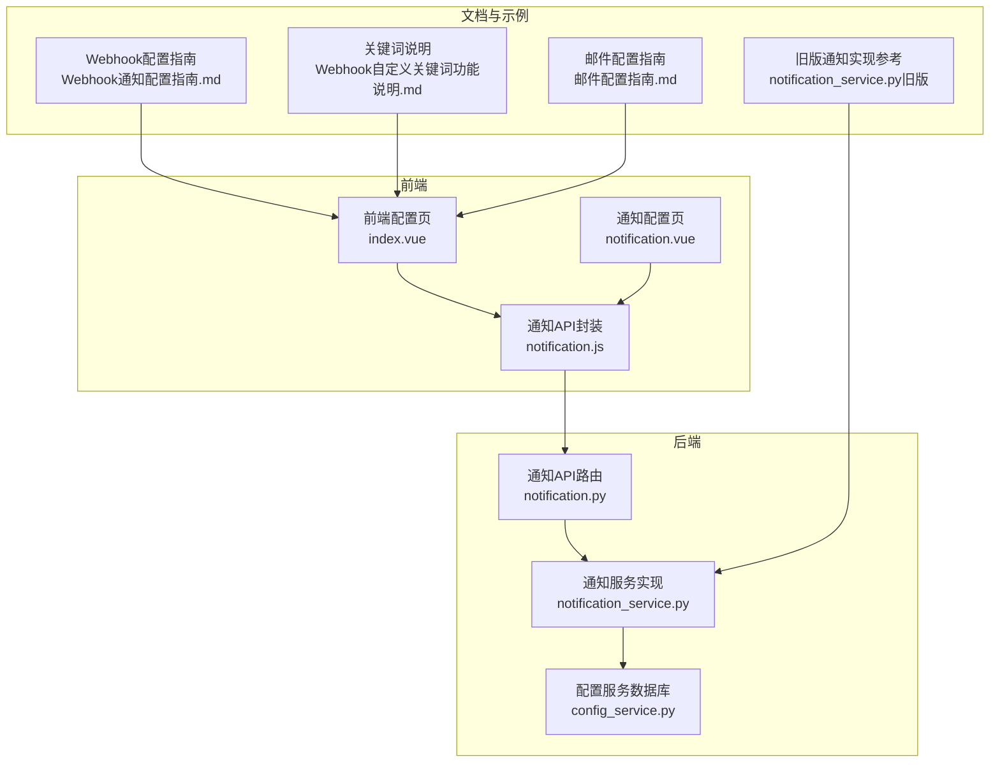
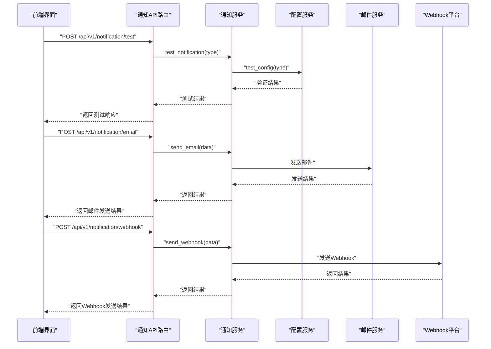
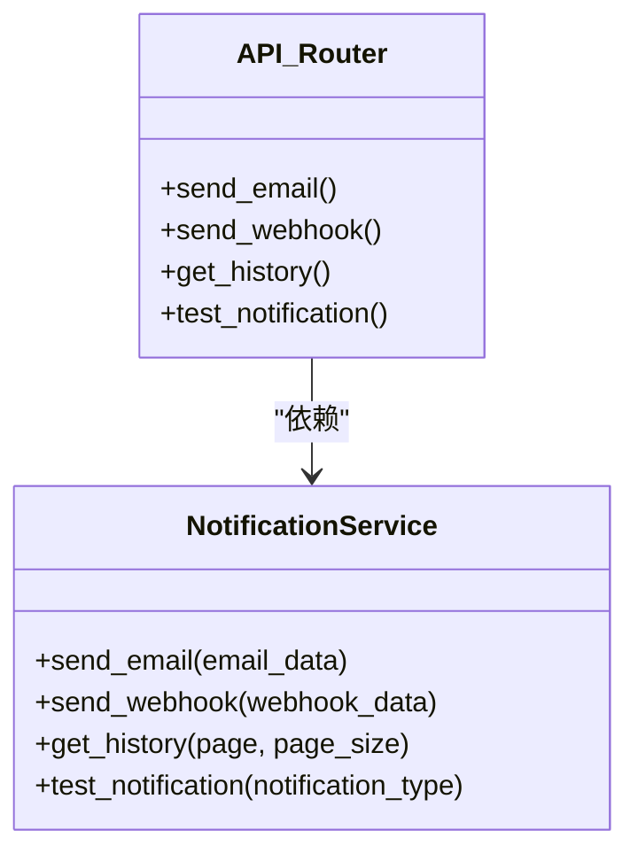
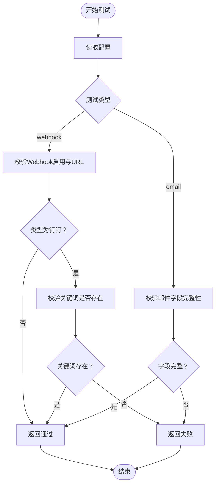
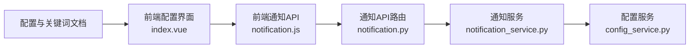

# 通知渠道配置与管理

<cite>
**本文引用的文件**
- [notification_service.py](file://backend/app/services/notification_service.py)
- [notification.py](file://backend/app/api/v1/notification.py)
- [config_service.py](file://backend/app/services/config_service.py)
- [notification.js](file://frontend/src/api/notification.js)
- [notification.vue](file://frontend/src/views/config/notification.vue)
- [index.vue](file://frontend/src/views/config/index.vue)
- [Webhook通知配置指南.md](file://docs/Webhook通知配置指南.md)
- [Webhook自定义关键词功能说明.md](file://docs/Webhook自定义关键词功能说明.md)
- [邮件配置指南.md](file://docs/邮件配置指南.md)
- [notification_service.py（旧版）](file://old/notification_service.py)
</cite>

## 目录
1. [简介](#简介)
2. [项目结构](#项目结构)
3. [核心组件](#核心组件)
4. [架构总览](#架构总览)
5. [详细组件分析](#详细组件分析)
6. [依赖关系分析](#依赖关系分析)
7. [性能与可靠性考量](#性能与可靠性考量)
8. [故障排查指南](#故障排查指南)
9. [结论](#结论)
10. [附录](#附录)

## 简介
本文件围绕通知渠道的配置与管理展开，覆盖邮件与Webhook两大通知方式。内容包括：
- 邮件通知：SMTP配置参数（服务器、端口、授权码）设置要求，主流邮箱服务商（QQ邮箱、163邮箱、Gmail）的配置示例，以及测试与故障排查要点。
- Webhook通知：钉钉与飞书机器人的创建流程、安全设置（尤其是自定义关键词的实现逻辑）、消息格式差异，以及通知发送失败后的备用方案（界面通知）。
- 结合后端服务层与前端配置界面，说明测试通知功能的实现细节与验证方法。

## 项目结构
通知相关能力由后端服务层、API路由、前端配置界面与配套文档共同构成。下图给出与通知配置与管理相关的文件与职责映射。

图表来源
- [notification.py](file://backend/app/api/v1/notification.py#L1-L70)
- [notification_service.py](file://backend/app/services/notification_service.py#L1-L34)
- [config_service.py](file://backend/app/services/config_service.py#L1-L182)
- [notification.js](file://frontend/src/api/notification.js#L1-L38)
- [notification.vue](file://frontend/src/views/config/notification.vue#L1-L14)
- [index.vue](file://frontend/src/views/config/index.vue#L172-L243)
- [Webhook通知配置指南.md](file://docs/Webhook通知配置指南.md#L1-L445)
- [Webhook自定义关键词功能说明.md](file://docs/Webhook自定义关键词功能说明.md#L1-L252)
- [邮件配置指南.md](file://docs/邮件配置指南.md#L1-L73)
- [notification_service.py（旧版）](file://old/notification_service.py#L1-L759)

章节来源
- [notification.py](file://backend/app/api/v1/notification.py#L1-L70)
- [notification_service.py](file://backend/app/services/notification_service.py#L1-L34)
- [config_service.py](file://backend/app/services/config_service.py#L1-L182)
- [notification.js](file://frontend/src/api/notification.js#L1-L38)
- [notification.vue](file://frontend/src/views/config/notification.vue#L1-L14)
- [index.vue](file://frontend/src/views/config/index.vue#L172-L243)
- [Webhook通知配置指南.md](file://docs/Webhook通知配置指南.md#L1-L445)
- [Webhook自定义关键词功能说明.md](file://docs/Webhook自定义关键词功能说明.md#L1-L252)
- [邮件配置指南.md](file://docs/邮件配置指南.md#L1-L73)
- [notification_service.py（旧版）](file://old/notification_service.py#L1-L759)

## 核心组件
- 后端通知服务类：负责邮件与Webhook发送、历史查询与测试通知的占位实现。
- API路由：提供邮件发送、Webhook发送、通知历史查询、测试通知的REST接口。
- 配置服务：提供配置读取、校验、测试（含邮件与Webhook）能力，并与数据库交互。
- 前端配置界面：提供邮件与Webhook配置表单、校验、保存与.env预览。
- 文档与示例：提供钉钉/飞书机器人创建、关键词配置、消息格式、测试方法等。

章节来源
- [notification_service.py](file://backend/app/services/notification_service.py#L1-L34)
- [notification.py](file://backend/app/api/v1/notification.py#L1-L70)
- [config_service.py](file://backend/app/services/config_service.py#L1-L182)
- [index.vue](file://frontend/src/views/config/index.vue#L172-L243)
- [notification.js](file://frontend/src/api/notification.js#L1-L38)

## 架构总览
通知发送的整体流程如下：前端配置通知参数并通过API提交；后端路由调用通知服务；通知服务根据配置选择邮件或Webhook发送；若均不可用或失败，采用界面通知作为备用；同时提供测试接口验证配置。

图表来源
- [notification.py](file://backend/app/api/v1/notification.py#L1-L70)
- [notification_service.py](file://backend/app/services/notification_service.py#L1-L34)
- [config_service.py](file://backend/app/services/config_service.py#L52-L125)

## 详细组件分析

### 后端通知服务与API
- 通知服务类目前提供占位实现，包含邮件发送、Webhook发送、历史查询与测试通知四个方法，后续将填充具体逻辑。
- API路由提供邮件发送、Webhook发送、历史查询与测试通知接口，统一返回成功响应与异常处理。

图表来源
- [notification_service.py](file://backend/app/services/notification_service.py#L1-L34)
- [notification.py](file://backend/app/api/v1/notification.py#L1-L70)

章节来源
- [notification_service.py](file://backend/app/services/notification_service.py#L1-L34)
- [notification.py](file://backend/app/api/v1/notification.py#L1-L70)

### 配置服务与测试
- 配置服务支持对邮件与Webhook配置进行验证与测试，确保关键字段完整且满足平台要求（如钉钉关键词）。
- 测试逻辑覆盖：邮件配置完整性检查、Webhook启用与URL检查、钉钉关键词必填校验等。

图表来源
- [config_service.py](file://backend/app/services/config_service.py#L52-L125)

章节来源
- [config_service.py](file://backend/app/services/config_service.py#L52-L125)

### 前端通知配置界面
- 前端提供“通知配置”标签页，包含邮件与Webhook两部分表单，支持开关、输入框、下拉选择与关键词输入。
- 提供“校验配置”“保存配置”“重置”等操作，并实时生成.env预览文本，便于核对。

章节来源
- [index.vue](file://frontend/src/views/config/index.vue#L172-L243)
- [notification.vue](file://frontend/src/views/config/notification.vue#L1-L14)
- [notification.js](file://frontend/src/api/notification.js#L1-L38)

### 邮件通知配置与安全机制
- SMTP配置参数
  - 服务器：不同邮箱服务商的SMTP地址与端口（如587/TLS或465/SSL）。
  - 授权码：使用邮箱授权码而非登录密码；QQ邮箱、163邮箱、Gmail等均需在邮箱设置中开启SMTP并生成授权码。
  - 收件人：目标邮箱地址。
- 配置示例与获取方式详见邮件配置指南文档。
- 安全要点
  - 使用授权码而非登录密码；
  - 端口选择遵循服务商要求；
  - 邮件发送失败时，系统可回退至界面通知作为备用方案（参考旧版实现思路）。

章节来源
- [邮件配置指南.md](file://docs/邮件配置指南.md#L1-L73)
- [notification_service.py（旧版）](file://old/notification_service.py#L109-L170)

### Webhook通知配置与安全机制
- 平台支持：钉钉与飞书。
- 机器人创建与安全设置
  - 钉钉：创建自定义机器人，安全设置可选择“自定义关键词”“加签”“IP地址段”等；关键词需与系统配置一致。
  - 飞书：通常无需关键词，可直接使用Webhook地址。
- 消息格式差异
  - 钉钉：Markdown格式，标题与内容包含关键词前缀（当配置了关键词时）。
  - 飞书：交互式卡片格式，包含标题、字段与备注等。
- 自定义关键词实现逻辑
  - 配置项：WEBHOOK_KEYWORD（可为空）。
  - 构建消息时，若关键词存在则在标题与内容前添加关键词前缀；否则不添加。
  - 若关键词为空，系统仍可发送消息，但需确保机器人安全设置允许（如加签或IP白名单）。

章节来源
- [Webhook通知配置指南.md](file://docs/Webhook通知配置指南.md#L1-L445)
- [Webhook自定义关键词功能说明.md](file://docs/Webhook自定义关键词功能说明.md#L1-L252)
- [notification_service.py（旧版）](file://old/notification_service.py#L311-L371)
- [notification_service.py（旧版）](file://old/notification_service.py#L369-L471)

### 通知发送失败重试与备用方案
- 旧版实现思路（可借鉴）：当Webhook或邮件发送失败时，使用界面通知作为备用方案，保证用户至少能看到通知。
- 当前后端服务类为占位实现，建议在完善具体发送逻辑后，沿用该备用策略：优先尝试Webhook，其次尝试邮件，最后回退到界面通知。

章节来源
- [notification_service.py（旧版）](file://old/notification_service.py#L86-L108)

### 测试通知功能
- 前端通过API封装调用“测试通知”接口，后端路由调用通知服务的测试方法。
- 配置服务提供“test_config”能力，按类型校验邮件或Webhook配置是否完整可用。
- 旧版实现包含邮件与Webhook的测试方法，可作为当前占位实现的参考。

章节来源
- [notification.js](file://frontend/src/api/notification.js#L31-L38)
- [notification.py](file://backend/app/api/v1/notification.py#L57-L69)
- [config_service.py](file://backend/app/services/config_service.py#L52-L125)
- [notification_service.py（旧版）](file://old/notification_service.py#L198-L272)
- [notification_service.py（旧版）](file://old/notification_service.py#L473-L510)

## 依赖关系分析
- 前端配置界面依赖后端配置接口与通知接口；通知接口再依赖通知服务与配置服务。
- 通知服务依赖配置服务提供的配置读取与测试能力。
- 文档与示例为配置与测试提供权威参考。

图表来源
- [index.vue](file://frontend/src/views/config/index.vue#L172-L243)
- [notification.js](file://frontend/src/api/notification.js#L1-L38)
- [notification.py](file://backend/app/api/v1/notification.py#L1-L70)
- [notification_service.py](file://backend/app/services/notification_service.py#L1-L34)
- [config_service.py](file://backend/app/services/config_service.py#L1-L182)
- [Webhook通知配置指南.md](file://docs/Webhook通知配置指南.md#L1-L445)
- [Webhook自定义关键词功能说明.md](file://docs/Webhook自定义关键词功能说明.md#L1-L252)

## 性能与可靠性考量
- 发送频率与平台限制：钉钉与飞书对消息频率有限制，应避免短时间内大量发送，必要时在业务层做节流。
- 超时与重试：对外部服务调用应设置合理超时与重试策略，避免阻塞主线程。
- 失败隔离：邮件与Webhook互不影响，任一失败不应影响另一通道；最终回退到界面通知，确保可观测性。
- 配置缓存与刷新：配置变更后建议在重启或热刷新后生效，避免并发读取不一致。

## 故障排查指南
- 邮件发送失败
  - 认证错误：确认使用授权码、服务商SMTP已开启、端口选择正确。
  - 网络问题：检查DNS解析、防火墙与代理。
- Webhook发送失败
  - URL无效或机器人被移除：核对Webhook地址与群内机器人状态。
  - 关键词不匹配（钉钉）：确保WEBHOOK_KEYWORD与机器人安全设置一致。
  - 频率限制：降低发送频率，避免触发平台限流。
- 配置校验
  - 使用前端“校验配置”或后端“test_config”接口快速定位缺失字段或格式问题。

章节来源
- [Webhook通知配置指南.md](file://docs/Webhook通知配置指南.md#L299-L341)
- [Webhook自定义关键词功能说明.md](file://docs/Webhook自定义关键词功能说明.md#L119-L183)
- [config_service.py](file://backend/app/services/config_service.py#L52-L125)

## 结论
- 当前后端通知服务为占位实现，建议尽快完善邮件与Webhook发送逻辑，并引入失败重试与备用方案（界面通知）。
- 前端配置界面与配置服务提供了完整的配置、校验与测试能力，配合官方文档可快速完成邮件与Webhook配置。
- 钉钉关键词与飞书消息格式差异明确，建议在配置阶段即明确平台类型与安全策略，减少后期调试成本。

## 附录
- 邮件配置示例与获取授权码方式参见邮件配置指南。
- 钉钉与飞书机器人创建、关键词配置与消息格式示例参见Webhook配置指南与关键词说明。
- 通知服务与API的占位实现路径：[notification_service.py](file://backend/app/services/notification_service.py#L1-L34)，[notification.py](file://backend/app/api/v1/notification.py#L1-L70)。