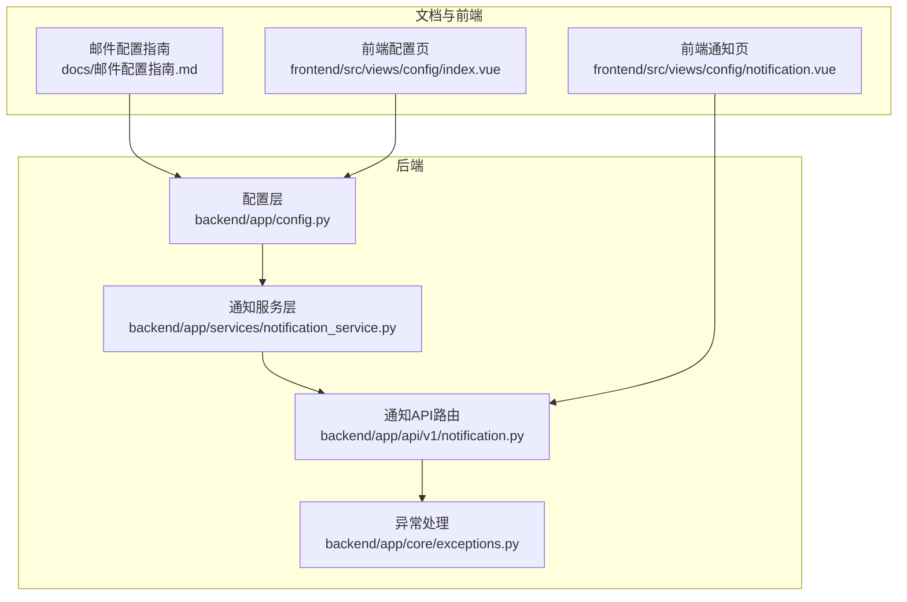
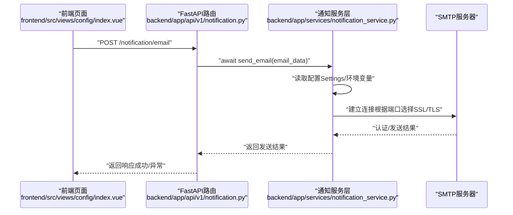
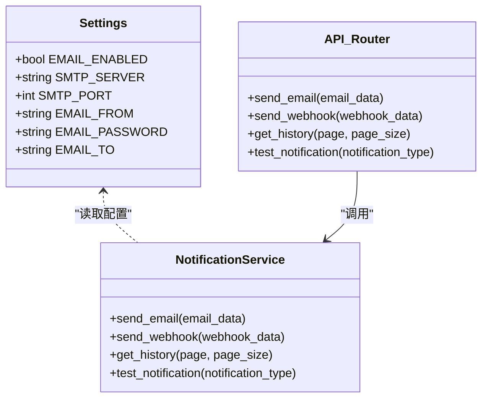
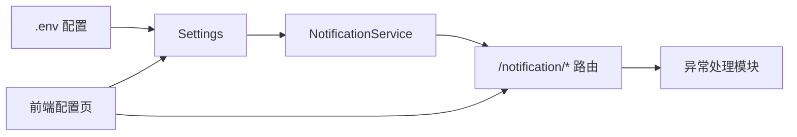

# 邮件通知配置

<cite>
**本文引用的文件**
- [backend/app/services/notification_service.py](file://backend/app/services/notification_service.py)
- [backend/app/api/v1/notification.py](file://backend/app/api/v1/notification.py)
- [backend/app/config.py](file://backend/app/config.py)
- [docs/邮件配置指南.md](file://docs/邮件配置指南.md)
- [old/notification_service.py](file://old/notification_service.py)
- [frontend/src/views/config/index.vue](file://frontend/src/views/config/index.vue)
- [frontend/src/views/config/notification.vue](file://frontend/src/views/config/notification.vue)
- [backend/app/core/exceptions.py](file://backend/app/core/exceptions.py)
</cite>

## 目录
1. [简介](#简介)
2. [项目结构](#项目结构)
3. [核心组件](#核心组件)
4. [架构总览](#架构总览)
5. [详细组件分析](#详细组件分析)
6. [依赖关系分析](#依赖关系分析)
7. [性能考虑](#性能考虑)
8. [故障排除指南](#故障排除指南)
9. [结论](#结论)
10. [附录](#附录)

## 简介
本文件面向运维与开发人员，系统化说明邮件通知的配置流程与实现机制，覆盖SMTP服务器、端口、发件人邮箱、授权码等核心参数设置方法，并结合QQ邮箱、163邮箱、Gmail等主流邮箱服务商的实际配置案例。同时，基于后端服务层的 send_email 方法，解析邮件发送的异步处理逻辑与异常捕获机制；给出 API 接口（/notification/email）的请求示例与字段说明；提供测试通知功能验证邮件配置有效性的方法；列举常见配置错误及解决方案；最后给出安全建议，包括敏感信息加密存储与访问权限控制。

## 项目结构
邮件通知相关代码分布在后端服务层、API 层、配置层以及文档与前端配置页面中。整体采用“配置驱动 + 服务层封装 + API 路由”的分层设计。

图表来源
- [backend/app/config.py](file://backend/app/config.py#L1-L92)
- [backend/app/services/notification_service.py](file://backend/app/services/notification_service.py#L1-L34)
- [backend/app/api/v1/notification.py](file://backend/app/api/v1/notification.py#L1-L70)
- [docs/邮件配置指南.md](file://docs/邮件配置指南.md#L1-L114)
- [frontend/src/views/config/index.vue](file://frontend/src/views/config/index.vue#L531-L544)
- [frontend/src/views/config/notification.vue](file://frontend/src/views/config/notification.vue#L1-L14)

章节来源
- [backend/app/config.py](file://backend/app/config.py#L1-L92)
- [backend/app/services/notification_service.py](file://backend/app/services/notification_service.py#L1-L34)
- [backend/app/api/v1/notification.py](file://backend/app/api/v1/notification.py#L1-L70)
- [docs/邮件配置指南.md](file://docs/邮件配置指南.md#L1-L114)
- [frontend/src/views/config/index.vue](file://frontend/src/views/config/index.vue#L531-L544)
- [frontend/src/views/config/notification.vue](file://frontend/src/views/config/notification.vue#L1-L14)

## 核心组件
- 配置层（Settings）：集中定义 EMAIL_ENABLED、SMTP_SERVER、SMTP_PORT、EMAIL_FROM、EMAIL_PASSWORD、EMAIL_TO 等邮件相关配置项，默认值来源于 .env 文件。
- 通知服务层（NotificationService）：封装邮件发送、Webhook 发送、历史查询与测试通知等能力。当前后端服务层仅声明方法，具体实现位于旧版实现文件中。
- API 路由层（/notification/*）：提供 /notification/email、/notification/webhook、/notification/history、/notification/test 等接口，负责参数校验、调用服务层并统一异常处理。
- 文档与前端：提供邮件配置指南与前端配置页面，便于用户填写与导出 .env 配置。

章节来源
- [backend/app/config.py](file://backend/app/config.py#L55-L62)
- [backend/app/services/notification_service.py](file://backend/app/services/notification_service.py#L14-L32)
- [backend/app/api/v1/notification.py](file://backend/app/api/v1/notification.py#L14-L69)
- [docs/邮件配置指南.md](file://docs/邮件配置指南.md#L1-L114)

## 架构总览
下图展示从前端配置到后端服务层再到 SMTP 服务器的完整调用链路与异常处理路径。

图表来源
- [backend/app/api/v1/notification.py](file://backend/app/api/v1/notification.py#L14-L26)
- [backend/app/services/notification_service.py](file://backend/app/services/notification_service.py#L14-L17)
- [backend/app/config.py](file://backend/app/config.py#L55-L62)

## 详细组件分析

### 配置层（Settings 与 .env）
- 配置项
  - EMAIL_ENABLED：是否启用邮件通知
  - SMTP_SERVER：SMTP 服务器地址
  - SMTP_PORT：SMTP 端口（常用 587 或 465）
  - EMAIL_FROM：发件人邮箱
  - EMAIL_PASSWORD：授权码（非登录密码）
  - EMAIL_TO：收件人邮箱
- 加载方式
  - 通过 pydantic-settings 从 .env 文件加载，键名与配置项一致。
  - 默认值可在配置类中设置，实际以 .env 中的值为准。
- 前端导出 .env
  - 前端配置页会将当前配置拼接为 .env 内容预览，便于复制保存。

章节来源
- [backend/app/config.py](file://backend/app/config.py#L55-L62)
- [frontend/src/views/config/index.vue](file://frontend/src/views/config/index.vue#L531-L544)
- [docs/邮件配置指南.md](file://docs/邮件配置指南.md#L1-L16)

### 通知服务层（send_email 与测试）
- 当前后端服务层仅声明 send_email 方法，具体实现位于旧版实现文件中。
- 旧版实现要点
  - 从 .env 动态加载配置，支持 EMAIL_ENABLED、SMTP_SERVER、SMTP_PORT、EMAIL_FROM、EMAIL_PASSWORD、EMAIL_TO 等。
  - 根据端口选择连接方式：端口为 465 使用 SSL，否则使用 TLS。
  - 认证失败、SMTP 错误、其他异常均被捕获并返回相应提示。
  - 提供测试邮件发送与配置状态检测方法，便于验证配置有效性。

章节来源
- [backend/app/services/notification_service.py](file://backend/app/services/notification_service.py#L14-L17)
- [old/notification_service.py](file://old/notification_service.py#L20-L56)
- [old/notification_service.py](file://old/notification_service.py#L147-L169)
- [old/notification_service.py](file://old/notification_service.py#L208-L215)
- [old/notification_service.py](file://old/notification_service.py#L217-L272)

### API 路由层（/notification/email）
- 路径与方法
  - POST /notification/email：发送邮件
  - POST /notification/webhook：发送 Webhook
  - GET /notification/history：查询通知历史
  - POST /notification/test：测试通知
- 参数与行为
  - /notification/email 接收 email_data 字典，内部调用服务层 send_email 并返回统一响应。
  - 异常统一捕获并转换为 HTTP 500。
- 前端交互
  - 前端配置页提供 .env 预览与测试按钮，便于一键验证配置。

章节来源
- [backend/app/api/v1/notification.py](file://backend/app/api/v1/notification.py#L14-L69)
- [frontend/src/views/config/index.vue](file://frontend/src/views/config/index.vue#L531-L544)

### 类关系与职责

图表来源
- [backend/app/config.py](file://backend/app/config.py#L55-L62)
- [backend/app/services/notification_service.py](file://backend/app/services/notification_service.py#L14-L32)
- [backend/app/api/v1/notification.py](file://backend/app/api/v1/notification.py#L14-L69)

## 依赖关系分析
- 配置依赖：服务层依赖配置层提供的 Settings 与 .env。
- 路由依赖：API 路由依赖服务层；异常处理依赖统一异常模块。
- 前端依赖：前端配置页依赖后端配置与 API 路由。

图表来源
- [backend/app/config.py](file://backend/app/config.py#L55-L62)
- [backend/app/services/notification_service.py](file://backend/app/services/notification_service.py#L14-L32)
- [backend/app/api/v1/notification.py](file://backend/app/api/v1/notification.py#L14-L69)
- [backend/app/core/exceptions.py](file://backend/app/core/exceptions.py#L1-L33)
- [frontend/src/views/config/index.vue](file://frontend/src/views/config/index.vue#L531-L544)

## 性能考虑
- 连接复用：当前实现每次发送邮件都会新建连接并退出，频繁发送时可考虑连接池或复用连接以降低握手开销。
- 超时设置：SMTP 连接与登录应设置合理超时，避免阻塞请求线程。
- 并发策略：对外部 SMTP 的并发请求应限速，避免被服务商限流。
- 日志与追踪：建议在服务层增加请求 ID 与上下文日志，便于定位问题。

## 故障排除指南
- 常见错误与解决
  - 授权码无效：确认使用的是应用专用密码或授权码，而非登录密码。
  - SSL/TLS 端口错误：端口 465 使用 SSL，587 使用 STARTTLS；若端口不匹配会导致握手失败。
  - SMTP 服务未开启：需在邮箱服务商后台开启 IMAP/SMTP 服务。
  - 网络与防火墙：确保服务器可访问对应 SMTP 服务器端口。
  - 垃圾邮件：首次发送可能被标记为垃圾邮件，检查垃圾箱。
- 定位手段
  - 使用测试接口发送测试邮件，观察返回信息与日志。
  - 检查 .env 配置是否正确、是否被前端页面导出覆盖。
  - 查看后端异常响应与统一异常模块的错误详情。

章节来源
- [docs/邮件配置指南.md](file://docs/邮件配置指南.md#L104-L114)
- [old/notification_service.py](file://old/notification_service.py#L208-L215)
- [old/notification_service.py](file://old/notification_service.py#L266-L272)

## 结论
邮件通知模块采用“配置驱动 + 服务层封装 + API 统一入口”的设计，具备良好的扩展性与可维护性。当前后端服务层方法处于占位状态，具体实现位于旧版实现文件中。建议尽快迁移至新架构，完善异常处理与日志追踪，并引入连接池与限流策略以提升稳定性与性能。

## 附录

### 邮件配置流程与参数说明
- 配置方式
  - 环境变量（推荐）：在项目根目录创建或修改 .env 文件，添加 EMAIL_ENABLED、SMTP_SERVER、SMTP_PORT、EMAIL_FROM、EMAIL_PASSWORD、EMAIL_TO 等键值。
  - 直接修改代码：在服务层配置加载处设置默认值（不推荐）。
- 服务商配置示例
  - QQ邮箱：SMTP_SERVER=smtp.qq.com，SMTP_PORT=587，EMAIL_FROM=your_qq@qq.com，EMAIL_PASSWORD=16位授权码。
  - 163邮箱：SMTP_SERVER=smtp.163.com，SMTP_PORT=587，EMAIL_FROM=your_email@163.com，EMAIL_PASSWORD=客户端授权密码。
  - Gmail：SMTP_SERVER=smtp.gmail.com，SMTP_PORT=587，EMAIL_FROM=your_email@gmail.com，EMAIL_PASSWORD=应用专用密码。
- 获取授权码/应用密码
  - QQ邮箱：开启 IMAP/SMTP 服务后生成授权码。
  - 163邮箱：开启 IMAP/SMTP 服务后设置客户端授权密码。
  - Gmail：开启两步验证后生成应用专用密码。

章节来源
- [docs/邮件配置指南.md](file://docs/邮件配置指南.md#L1-L59)
- [docs/邮件配置指南.md](file://docs/邮件配置指南.md#L60-L103)

### API 接口与请求示例
- 接口定义
  - POST /notification/email
    - 请求体：email_data（字典，包含必要字段与可选参数）
    - 返回：统一成功响应
    - 异常：HTTP 500
- 请求字段说明
  - 必要字段
    - EMAIL_FROM：发件人邮箱
    - EMAIL_TO：收件人邮箱
    - EMAIL_PASSWORD：授权码
  - 可选参数
    - SMTP_SERVER：SMTP 服务器地址
    - SMTP_PORT：SMTP 端口（默认 587）
    - EMAIL_ENABLED：是否启用邮件通知（默认关闭）
- 示例
  - 请求体示例（字段路径参考）
    - 发件人邮箱：EMAIL_FROM
    - 收件人邮箱：EMAIL_TO
    - 授权码：EMAIL_PASSWORD
    - SMTP 服务器：SMTP_SERVER
    - 端口：SMTP_PORT
    - 启用开关：EMAIL_ENABLED

章节来源
- [backend/app/api/v1/notification.py](file://backend/app/api/v1/notification.py#L14-L26)
- [backend/app/config.py](file://backend/app/config.py#L55-L62)
- [docs/邮件配置指南.md](file://docs/邮件配置指南.md#L1-L16)

### 测试通知功能验证
- 前端测试
  - 在前端配置页点击“发送测试邮件”，若成功会显示成功提示并弹出庆祝效果，失败则显示错误信息。
- 后端测试
  - 通过 /notification/test 接口触发测试逻辑（当前服务层占位，具体实现见旧版实现文件）。
- 建议步骤
  - 确认 .env 配置完整且生效
  - 使用测试接口发送测试邮件
  - 检查收件箱与垃圾箱

章节来源
- [frontend/src/views/config/index.vue](file://frontend/src/views/config/index.vue#L531-L544)
- [backend/app/api/v1/notification.py](file://backend/app/api/v1/notification.py#L57-L69)
- [old/notification_service.py](file://old/notification_service.py#L217-L272)

### 安全建议
- 敏感信息加密存储
  - 授权码与密码应存储在受控的密钥管理系统或环境变量中，避免明文写入代码或日志。
- 访问权限控制
  - 对配置页面与 API 的访问应限制在可信 IP 或通过鉴权中间件保护。
- 端口与协议
  - 优先使用 587（STARTTLS）或 465（SSL），并确保服务器与网络允许相应端口通信。
- 最小权限原则
  - 使用最小权限的应用专用密码，定期轮换授权码。

章节来源
- [docs/邮件配置指南.md](file://docs/邮件配置指南.md#L96-L103)
- [backend/app/core/exceptions.py](file://backend/app/core/exceptions.py#L1-L33)