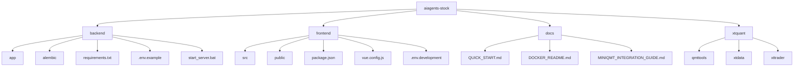
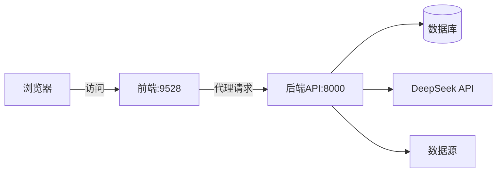

# 快速入门指南

<cite>
**本文档引用的文件**   
- [.env.example](file://.env.example)
- [start_backend.bat](file://start_backend.bat)
- [backend\requirements.txt](file://backend/requirements.txt)
- [frontend\package.json](file://frontend/package.json)
- [backend\app\main.py](file://backend/app/main.py)
- [frontend\vue.config.js](file://frontend/vue.config.js)
- [backend\app\config.py](file://backend/app/config.py)
- [frontend\src\views\login\index.vue](file://frontend/src/views/login/index.vue)
- [docs\QUICK_START.md](file://docs/QUICK_START.md)
</cite>

## 目录
1. [简介](#简介)
2. [项目结构](#项目结构)
3. [环境准备](#环境准备)
4. [配置系统](#配置系统)
5. [启动系统](#启动系统)
6. [首次登录与体验](#首次登录与体验)
7. [常见问题排查](#常见问题排查)
8. [结论](#结论)

## 简介
本快速入门指南旨在帮助新用户在本地环境中成功部署和运行aiagents-stock系统。该系统是一个基于AI的股票分析平台，结合了FastAPI后端和Vue前端，提供股票分析、板块策略、主力选股、智能盯盘等核心功能。通过本指南，您将学习如何克隆仓库、配置Python和Node.js环境、安装依赖、设置环境变量、启动服务并完成首次登录，最终体验系统的核心AI分析功能。

## 项目结构
aiagents-stock项目采用前后端分离的架构设计，主要由`backend`（后端）、`frontend`（前端）、`docs`（文档）和`xtquant`（量化交易组件）四个核心目录组成。



**Diagram sources**
- [backend](file://backend)
- [frontend](file://frontend)
- [docs](file://docs)
- [xtquant](file://xtquant)

**Section sources**
- [backend](file://backend)
- [frontend](file://frontend)

## 环境准备
在运行aiagents-stock系统之前，您需要准备以下环境和工具。

### Python环境配置
1. **安装Python**：系统要求Python 3.8或更高版本。请访问[Python官网](https://www.python.org/downloads/)下载并安装。
2. **创建虚拟环境**：建议使用conda或venv创建独立的Python环境，避免依赖冲突。
   ```bash
   conda create -n ai-agent python=3.8
   conda activate ai-agent
   ```
3. **安装后端依赖**：激活环境后，进入`backend`目录并安装所需的Python包。
   ```bash
   pip install -r requirements.txt
   ```

### Node.js环境配置
1. **安装Node.js**：前端开发需要Node.js 14.x或更高版本。请访问[Node.js官网](https://nodejs.org/)下载LTS版本。
2. **安装前端依赖**：进入`frontend`目录，使用npm或yarn安装依赖。
   ```bash
   npm install
   # 或者
   yarn install
   ```

### 其他工具
- **Git**：用于克隆项目仓库。
- **文本编辑器**：推荐使用VS Code、PyCharm或WebStorm进行代码编辑。

**Section sources**
- [backend\requirements.txt](file://backend/requirements.txt)
- [frontend\package.json](file://frontend/package.json)

## 配置系统
正确的配置是系统正常运行的关键。本节将指导您完成必要的配置步骤。

### 创建环境配置文件
1. 在项目根目录下，复制`.env.example`文件并重命名为`.env`。
   ```bash
   copy .env.example .env
   ```
2. 使用文本编辑器打开`.env`文件，根据您的实际情况填写配置项。

### 配置API密钥
- **DeepSeek API密钥**：这是系统的核心AI能力来源。您需要在[DeepSeek平台](https://platform.deepseek.com/api_keys)注册并获取API密钥，然后将其填入`.env`文件的`DEEPSEEK_API_KEY`字段。
  ```env
  DEEPSEEK_API_KEY=your_actual_deepseek_api_key_here
  ```

### 配置可选服务
- **邮件通知**：如果您希望系统通过邮件发送通知，可以配置QQ邮箱或163邮箱。
  ```env
  EMAIL_ENABLED=true
  SMTP_SERVER=smtp.qq.com
  SMTP_PORT=587
  EMAIL_FROM=your_email@qq.com
  EMAIL_PASSWORD=your_authorization_code
  EMAIL_TO=receiver@example.com
  ```
- **Webhook通知**：支持钉钉或飞书机器人通知。
  ```env
  WEBHOOK_ENABLED=true
  WEBHOOK_TYPE=dingtalk
  WEBHOOK_URL=https://oapi.dingtalk.com/robot/send?access_token=YOUR_TOKEN
  ```

**Section sources**
- [.env.example](file://.env.example)
- [backend\app\config.py](file://backend/app/config.py)

## 启动系统
完成配置后，您可以按照以下步骤启动系统。

### 启动后端服务
系统提供了Windows批处理脚本来简化后端启动流程。
1. 双击运行根目录下的`start_backend.bat`文件。
2. 该脚本会自动执行以下操作：
   - 激活名为`ai-agent`的conda环境
   - 切换到`backend`目录
   - 启动FastAPI服务
3. 启动成功后，您将在命令行中看到类似以下输出：
   ```
   启动 FastAPI 服务在 http://localhost:8000
   API 文档: http://localhost:8000/api/docs
   ```
   这表明后端服务已在8000端口成功运行。

### 启动前端服务
1. 打开新的命令行窗口，进入`frontend`目录。
2. 执行以下命令启动Vue开发服务器：
   ```bash
   npm run dev
   ```
3. 前端服务默认在9528端口启动。您可以在`vue.config.js`中通过修改`port`变量来更改端口。

### 服务端口说明
- **后端API**：http://localhost:8000
- **前端界面**：http://localhost:9528
- **API文档**：http://localhost:8000/api/docs



**Diagram sources**
- [start_backend.bat](file://start_backend.bat)
- [frontend\vue.config.js](file://frontend/vue.config.js)
- [backend\app\main.py](file://backend/app/main.py)

**Section sources**
- [start_backend.bat](file://start_backend.bat)
- [frontend\vue.config.js](file://frontend/vue.config.js)

## 首次登录与体验
系统启动后，您可以通过以下步骤完成首次登录并体验核心功能。

### 访问Web界面
1. 打开浏览器，访问`http://localhost:9528`。
2. 您将看到系统的登录页面，标题为"AI股票分析系统"。

### 完成首次登录
1. 在登录页面输入以下默认凭据：
   - **用户名**: `admin`
   - **密码**: 任意6位以上字符
2. 点击"Login"按钮进行登录。
3. 登录成功后，系统将自动跳转到股票分析首页。

### 体验核心功能
登录后，您可以通过以下步骤快速体验系统的核心AI分析能力：

1. **执行单股分析**：
   - 在左侧导航栏点击"股票分析" -> "单股分析"
   - 在搜索框中输入股票代码（如`600519`代表贵州茅台）
   - 点击"分析"按钮，系统将调用AI模型生成详细的股票分析报告

2. **查看AI生成报告**：
   - 分析完成后，您将看到包含技术分析、资金流向、AI评分等信息的综合报告
   - 点击"📄 生成并下载PDF报告"按钮，系统将生成包含中文内容的PDF报告

3. **探索其他功能**：
   - **主力选股**：进入"选股板块" -> "主力选股"，体验AI筛选潜力股的能力
   - **智能盯盘**：在"投资管理" -> "AI 盯盘"中，设置价格监控条件，体验实时预警功能

**Section sources**
- [frontend\src\views\login\index.vue](file://frontend/src/views/login/index.vue)
- [docs\QUICK_START.md](file://docs/QUICK_START.md)

## 常见问题排查
在初始化过程中，您可能会遇到一些常见问题。以下是解决方案。

### 端口冲突
- **问题现象**：启动服务时提示"Address already in use"。
- **解决方案**：
  1. 检查8000（后端）和9528（前端）端口是否被占用。
  2. 使用`netstat -ano | findstr :8000`命令查找占用进程。
  3. 结束占用进程或修改服务端口（在`start_backend.bat`中修改`--port`参数，在`vue.config.js`中修改`port`变量）。

### 依赖缺失
- **问题现象**：启动时出现"ModuleNotFoundError"。
- **解决方案**：
  1. 确认已激活正确的Python环境。
  2. 重新执行`pip install -r requirements.txt`。
  3. 对于特定包（如`akshare`），可尝试单独安装：`pip install akshare`。

### API密钥错误
- **问题现象**：分析功能无法使用，日志显示认证失败。
- **解决方案**：
  1. 确认`.env`文件中的`DEEPSEEK_API_KEY`已正确填写。
  2. 检查API密钥是否有效，可在DeepSeek平台重新生成。
  3. 确保`.env`文件位于项目根目录。

### 前后端通信失败
- **问题现象**：前端页面加载但数据无法显示。
- **解决方案**：
  1. 确认后端服务已在8000端口正常运行。
  2. 检查`vue.config.js`中的代理配置，确保`target`指向正确的后端地址。
  3. 查看浏览器开发者工具的网络面板，确认请求是否被正确代理。

**Section sources**
- [docs\QUICK_START.md](file://docs/QUICK_START.md)
- [frontend\vue.config.js](file://frontend/vue.config.js)

## 结论
通过本快速入门指南，您已经成功完成了aiagents-stock系统的本地部署和初步体验。您学会了如何配置Python和Node.js环境、设置关键的API密钥、启动前后端服务，并通过实际操作体验了AI股票分析的核心功能。系统提供了丰富的可选配置，如邮件通知和Webhook，您可以根据需要逐步启用。遇到问题时，可参考本文档的排查建议或查阅项目中的详细文档。现在，您可以开始深入探索这个强大的AI股票分析工具，让AI助手为您的投资决策提供支持。