# 技术栈与依赖

<cite>
**本文档引用的文件**
- [requirements.txt](file://backend/requirements.txt)
- [package.json](file://frontend/package.json)
- [Dockerfile](file://backend/Dockerfile)
- [main.py](file://backend/app/main.py)
- [deepseek_client.py](file://backend/app/agents/deepseek_client.py)
- [celery_app.py](file://backend/app/tasks/celery_app.py)
- [database.py](file://backend/app/database.py)
- [xtdata.py](file://xtquant/xtdata.py)
- [config.py](file://backend/app/config.py)
- [websocket.py](file://backend/app/api/websocket.py)
- [DOCKER_DEPLOYMENT.md](file://docs/DOCKER_DEPLOYMENT.md)
</cite>

## 目录
1. [技术栈概览](#技术栈概览)
2. [后端技术栈](#后端技术栈)
3. [前端技术栈](#前端技术栈)
4. [AI服务集成](#ai服务集成)
5. [量化交易平台集成](#量化交易平台集成)
6. [实时通信机制](#实时通信机制)
7. [任务队列系统](#任务队列系统)
8. [容器化部署方案](#容器化部署方案)
9. [开发环境依赖](#开发环境依赖)
10. [组件交互机制](#组件交互机制)

## 技术栈概览

本项目采用现代化的技术栈构建一个完整的AI股票分析系统，涵盖了从数据获取、AI分析、实时监控到交易执行的完整流程。系统采用前后端分离架构，后端使用Python生态的FastAPI框架，前端使用Vue.js框架，通过RESTful API和WebSocket进行通信。

系统集成了多种关键技术组件：使用SQLAlchemy作为数据库ORM，Celery作为异步任务队列，DeepSeek API提供AI分析能力，xtquant实现与量化交易平台的对接，以及WebSocket支持实时数据推送。整个系统通过Docker容器化部署，确保了环境的一致性和部署的便捷性。

**Section sources**
- [main.py](file://backend/app/main.py#L1-L92)
- [package.json](file://frontend/package.json#L1-L65)

## 后端技术栈

### FastAPI框架

项目后端采用FastAPI作为核心Web框架，这是一个现代、快速（高性能）的Python Web框架，基于标准Python类型提示。FastAPI提供了自动生成API文档（Swagger UI和ReDoc）、数据验证、序列化、依赖注入等特性。

FastAPI的选择原因在于其高性能（基于Starlette和Pydantic）、开发效率高、类型安全和自动生成API文档的能力。这些特性使得API开发更加高效和可靠，特别适合需要频繁迭代和调试的AI应用。

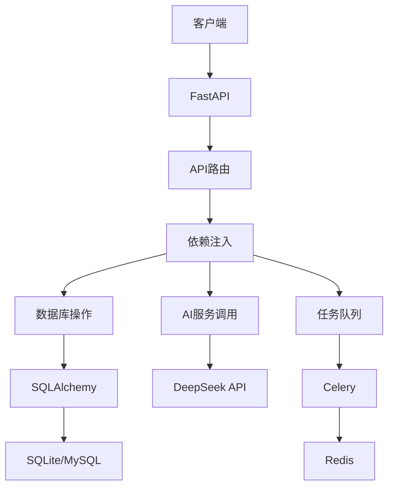

**Diagram sources**
- [main.py](file://backend/app/main.py#L1-L92)
- [database.py](file://backend/app/database.py#L1-L45)

### SQLAlchemy数据库ORM

项目使用SQLAlchemy作为数据库ORM（对象关系映射）工具，它提供了Python语言级别的数据库操作接口。SQLAlchemy支持多种数据库后端，包括SQLite和MySQL，在本项目中主要用于管理股票分析数据、用户配置和监测任务。

SQLAlchemy的选择原因在于其强大的功能、灵活性和成熟度。它提供了声明式语法，使得数据库模型定义更加直观；支持复杂的查询操作；并且与Alembic集成，提供了数据库迁移能力。

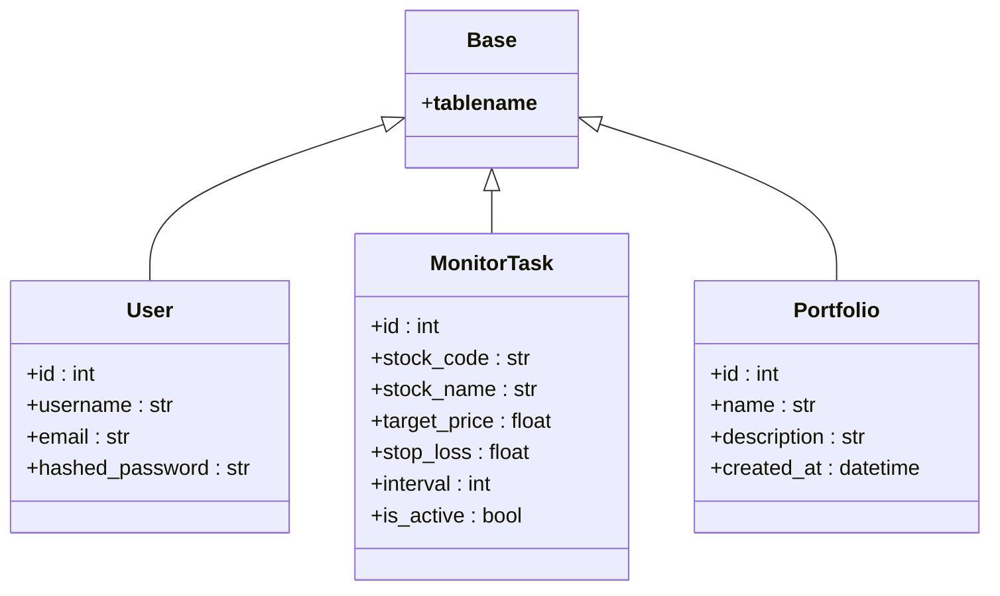

**Diagram sources**
- [database.py](file://backend/app/database.py#L1-L45)
- [models/user.py](file://backend/app/models/user.py)
- [models/monitor.py](file://backend/app/models/monitor.py)

**Section sources**
- [database.py](file://backend/app/database.py#L1-L45)
- [requirements.txt](file://backend/requirements.txt#L8-L9)

## 前端技术栈

### Vue.js框架

项目前端采用Vue.js作为核心框架，这是一个渐进式JavaScript框架，用于构建用户界面。Vue.js采用组件化架构，使得UI开发更加模块化和可维护。

Vue.js的选择原因在于其学习曲线平缓、灵活性高、生态系统完善。它提供了响应式数据绑定、组件系统、路由和状态管理等特性，非常适合构建复杂的单页应用（SPA）。

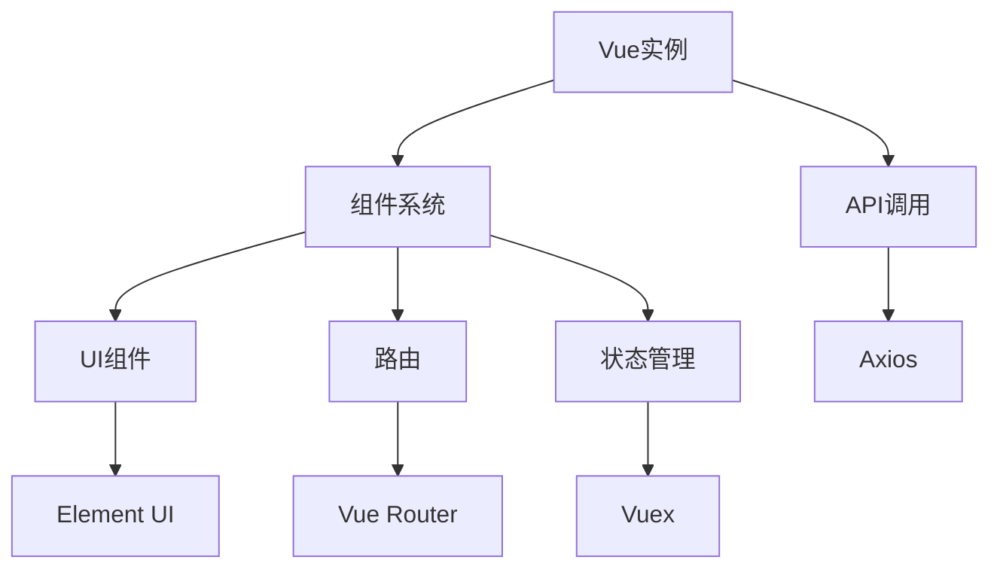

**Diagram sources**
- [main.js](file://frontend/src/main.js)
- [App.vue](file://frontend/src/App.vue)

### Element UI组件库

前端使用Element UI作为UI组件库，这是一个为开发者、设计师和产品经理准备的基于Vue 2.0的桌面端组件库。Element UI提供了丰富的预构建组件，如表格、表单、对话框、通知等，大大提高了UI开发效率。

Element UI的选择原因在于其组件丰富、文档完善、主题可定制和良好的浏览器兼容性。它与Vue.js无缝集成，使得开发者可以快速构建专业级的管理界面。

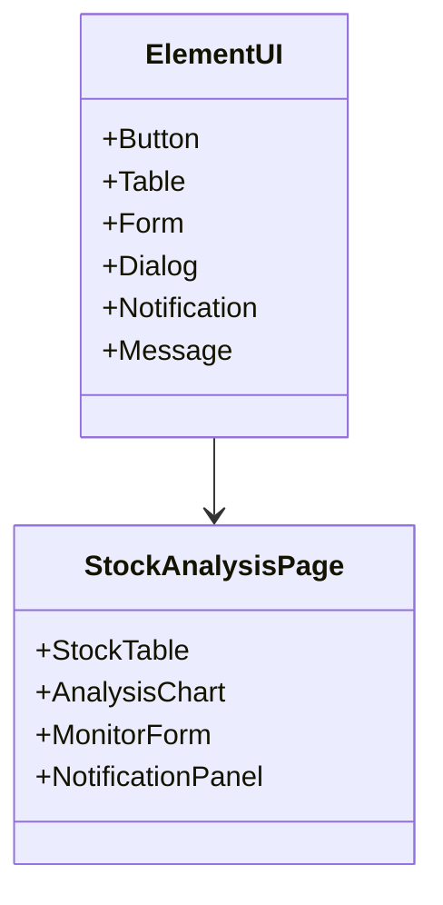

**Diagram sources**
- [package.json](file://frontend/package.json#L20)
- [src/views/stock/index.vue](file://frontend/src/views/stock/index.vue)

**Section sources**
- [package.json](file://frontend/package.json#L16-L29)
- [vue.config.js](file://frontend/vue.config.js#L1-L169)

## AI服务集成

### DeepSeek API集成

项目通过DeepSeek API集成AI能力，利用大语言模型进行股票的多维度分析。系统通过`deepseek_client.py`模块封装了与DeepSeek API的交互，实现了技术面、基本面和资金面的智能分析。

DeepSeek API的选择原因在于其强大的中文理解和生成能力、专业的金融知识处理能力和稳定的API服务。通过AI分析，系统能够提供超越传统量化模型的深度洞察。

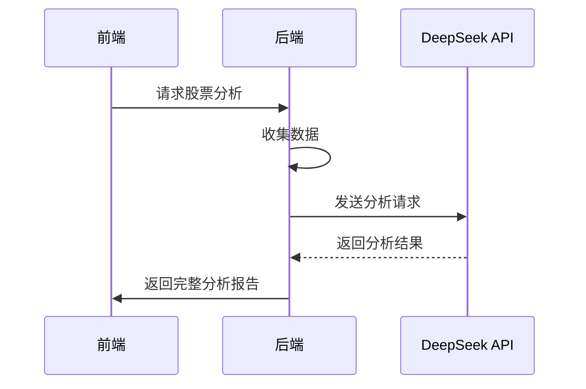

**Diagram sources**
- [deepseek_client.py](file://backend/app/agents/deepseek_client.py#L1-L458)
- [ai_agents.py](file://backend/app/agents/ai_agents.py)

### AI分析流程

系统实现了完整的AI分析流程，包括技术面分析、基本面分析、资金面分析和综合决策。每个分析维度都有专门的提示词（prompt）设计，确保AI输出的专业性和一致性。

分析流程首先收集相关数据，然后分别调用不同的分析方法，最后通过综合讨论和最终决策生成投资建议。这种分步分析方法确保了分析的全面性和逻辑性。

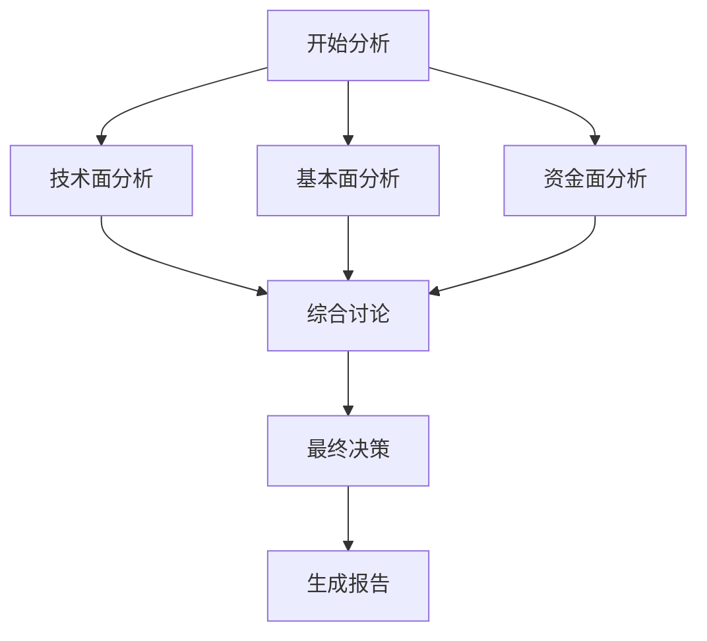

**Diagram sources**
- [deepseek_client.py](file://backend/app/agents/deepseek_client.py#L1-L458)
- [ai_agents.py](file://backend/app/agents/ai_agents.py)

**Section sources**
- [deepseek_client.py](file://backend/app/agents/deepseek_client.py#L1-L458)
- [requirements.txt](file://backend/requirements.txt#L48)

## 量化交易平台集成

### xtquant平台集成

项目通过xtquant库与量化交易平台集成，实现行情数据获取和交易执行功能。xtquant是迅投（Xuntou）提供的量化交易平台SDK，支持QMT（Quantitative Market Trading）系统。

xtquant的选择原因在于其本地化部署、低延迟、功能完整和稳定性。通过xtquant，系统可以直接访问交易所的Level-2行情数据，并执行交易指令，满足专业量化交易的需求。

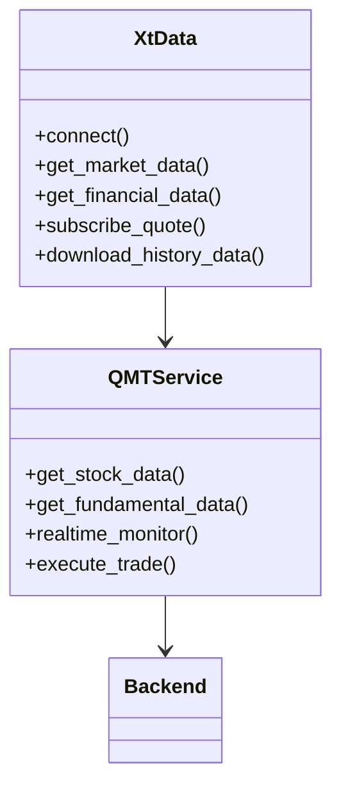

**Diagram sources**
- [xtdata.py](file://xtquant/xtdata.py#L1-L800)
- [qmt_service.py](file://backend/app/services/qmt_service.py)

### 数据获取能力

xtquant提供了全面的数据获取能力，包括历史行情数据、财务数据、资金流向、板块信息等。系统通过这些数据接口构建了完整的股票分析基础。

数据获取采用异步方式，确保不会阻塞主线程。对于大量数据的获取，系统实现了分批处理和缓存机制，提高了数据获取的效率和稳定性。

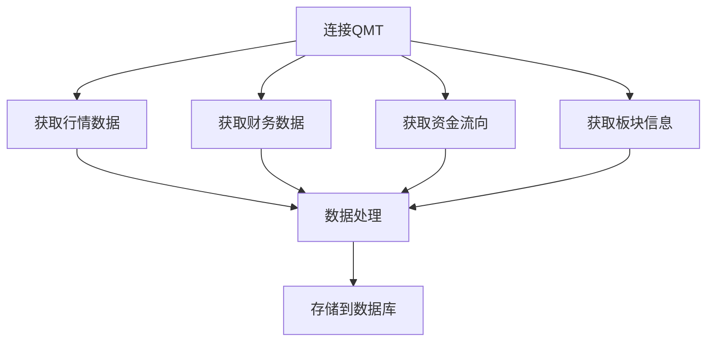

**Diagram sources**
- [xtdata.py](file://xtquant/xtdata.py#L1-L800)
- [data_service.py](file://backend/app/services/data_service.py)

**Section sources**
- [xtdata.py](file://xtquant/xtdata.py#L1-L800)
- [config.py](file://backend/app/config.py#L70-L74)

## 实时通信机制

### WebSocket实时推送

系统采用WebSocket协议实现服务器到客户端的实时数据推送，主要用于实时监测功能。当监测的股票价格达到预设条件时，服务器会通过WebSocket连接立即通知前端。

WebSocket的选择原因在于其全双工通信、低延迟和高效性。相比传统的轮询方式，WebSocket大大减少了网络开销，提供了真正的实时体验。

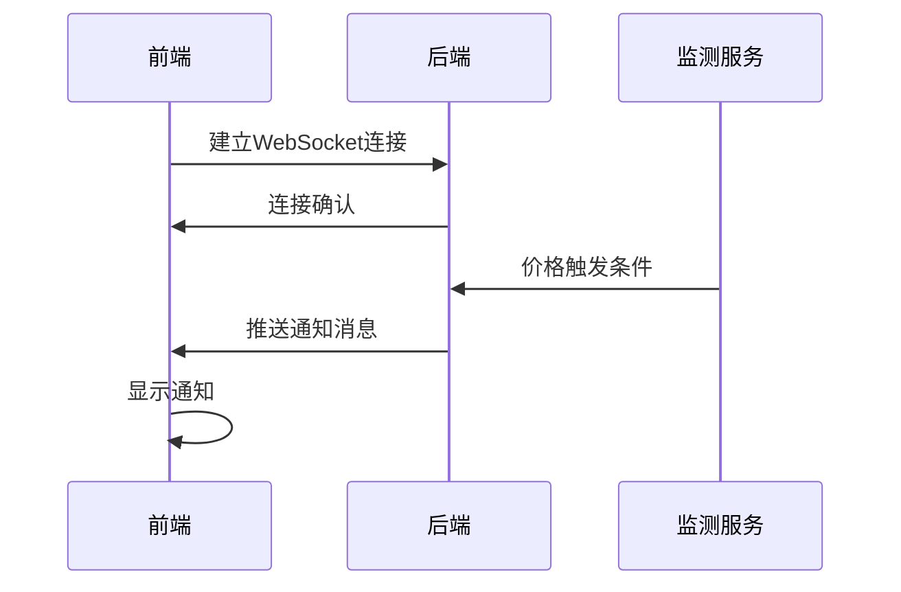

**Diagram sources**
- [websocket.py](file://backend/app/api/websocket.py#L1-L41)
- [realtime_service.py](file://backend/app/services/realtime_service.py)

### 连接管理

系统通过`ConnectionManager`类管理WebSocket连接，维护活跃连接列表。当有新的WebSocket连接建立时，将其添加到活跃连接列表；当连接断开时，从列表中移除。

这种连接管理机制确保了资源的有效利用，避免了无效连接的积累。同时，通过广播功能，系统可以向所有客户端推送全局通知。

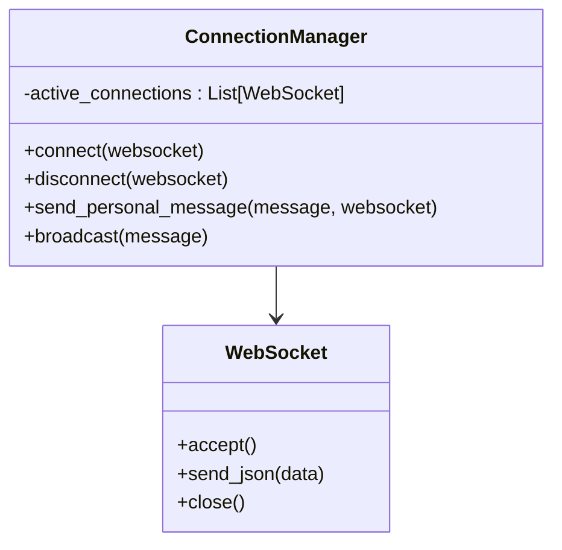

**Diagram sources**
- [websocket.py](file://backend/app/api/websocket.py#L1-L41)
- [realtime.py](file://backend/app/api/v1/realtime.py)

**Section sources**
- [websocket.py](file://backend/app/api/websocket.py#L1-L41)
- [main.py](file://backend/app/main.py#L10)

## 任务队列系统

### Celery异步任务

系统使用Celery作为异步任务队列，处理耗时的任务，如股票分析、数据同步和定时监测。Celery通过将任务分发到工作进程，实现了任务的异步执行和并行处理。

Celery的选择原因在于其成熟稳定、功能丰富、与Python生态集成良好。它支持多种消息代理，本项目使用Redis作为Broker，确保了任务队列的高性能和可靠性。

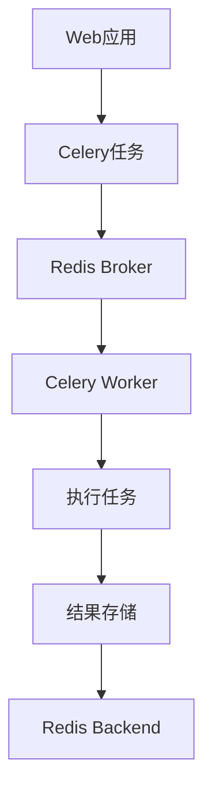

**Diagram sources**
- [celery_app.py](file://backend/app/tasks/celery_app.py#L1-L21)
- [monitor_tasks.py](file://backend/app/tasks/monitor_tasks.py)

### 任务调度

系统实现了基于Celery的任务调度机制，用于定时执行监测任务。每个监测任务都有预设的执行间隔，Celery Beat作为调度器，按照预定时间将任务发送到队列。

任务调度机制确保了监测的准时性和可靠性。系统还实现了任务状态跟踪和错误处理，确保即使在任务执行失败的情况下也能恢复和重试。

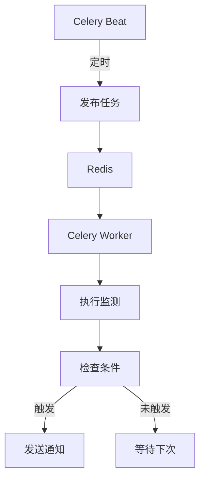

**Diagram sources**
- [celery_app.py](file://backend/app/tasks/celery_app.py#L1-L21)
- [monitor_service.py](file://backend/app/services/monitor_service.py)

**Section sources**
- [celery_app.py](file://backend/app/tasks/celery_app.py#L1-L21)
- [requirements.txt](file://backend/requirements.txt#L24-L25)

## 容器化部署方案

### Docker部署

系统通过Docker实现容器化部署，确保了开发、测试和生产环境的一致性。Dockerfile定义了应用的运行环境，包括Python版本、依赖安装和启动命令。

Docker部署方案简化了应用的部署和扩展，使得系统可以在任何支持Docker的平台上快速运行。同时，通过Docker Compose，可以方便地管理多个服务的协同运行。

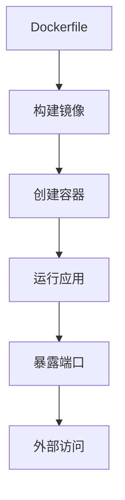

**Diagram sources**
- [Dockerfile](file://backend/Dockerfile#L1-L28)
- [DOCKER_DEPLOYMENT.md](file://docs/DOCKER_DEPLOYMENT.md#L1-L400)

### 依赖服务

容器化部署方案依赖于多个外部服务，包括Redis用于Celery任务队列，MySQL用于持久化存储，以及QMT客户端用于量化交易。这些服务可以通过Docker Compose统一管理。

部署方案还考虑了数据持久化，通过卷挂载将数据库文件和配置文件保存在宿主机上，确保容器重启后数据不丢失。

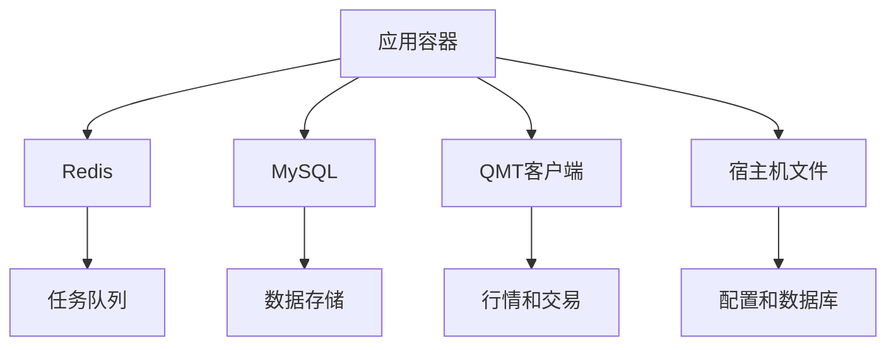

**Diagram sources**
- [Dockerfile](file://backend/Dockerfile#L1-L28)
- [docker-compose.yml](file://docker-compose.yml)

**Section sources**
- [Dockerfile](file://backend/Dockerfile#L1-L28)
- [DOCKER_DEPLOYMENT.md](file://docs/DOCKER_DEPLOYMENT.md#L1-L400)

## 开发环境依赖

### 基础软件清单

开发环境需要安装以下基础软件：

- **Python 3.11**：后端应用运行环境
- **Node.js**：前端开发和构建环境
- **Redis**：作为Celery的任务队列和结果存储
- **Docker**：用于容器化部署和环境隔离
- **QMT客户端**：量化交易平台客户端

这些软件构成了系统开发和运行的基础环境，确保了各组件能够正常协同工作。

### Python依赖

后端Python依赖通过`requirements.txt`文件管理，主要依赖包括：

- **FastAPI**：Web框架
- **SQLAlchemy**：数据库ORM
- **Celery**：异步任务队列
- **Redis**：消息代理
- **OpenAI**：AI服务客户端
- **Pandas**：数据处理
- **AkShare**：金融数据获取

这些依赖经过精心选择和版本控制，确保了系统的稳定性和兼容性。

### Node.js依赖

前端Node.js依赖通过`package.json`文件管理，主要依赖包括：

- **Vue 2.6.10**：前端框架
- **Element UI 2.13.2**：UI组件库
- **Axios**：HTTP客户端
- **Vuex**：状态管理
- **Vue Router**：路由管理

前端依赖相对稳定，主要使用Vue 2生态的成熟组件，确保了前端应用的性能和兼容性。

**Section sources**
- [requirements.txt](file://backend/requirements.txt#L1-L56)
- [package.json](file://frontend/package.json#L1-L65)
- [Dockerfile](file://backend/Dockerfile#L1-L28)

## 组件交互机制

### 技术协同机制

系统各组件通过清晰的接口和协议进行交互，形成了高效的技术协同机制：

- **前后端交互**：通过RESTful API和WebSocket协议
- **数据流**：从xtquant获取原始数据，经过处理后存储到数据库，供AI分析使用
- **任务调度**：通过Celery实现异步任务处理，解耦了请求处理和耗时操作
- **AI集成**：通过HTTP API调用DeepSeek服务，将AI能力融入分析流程
- **实时通信**：通过WebSocket实现服务器到客户端的实时推送

这种分层和解耦的设计使得系统具有良好的可维护性和可扩展性，各组件可以独立开发和测试。

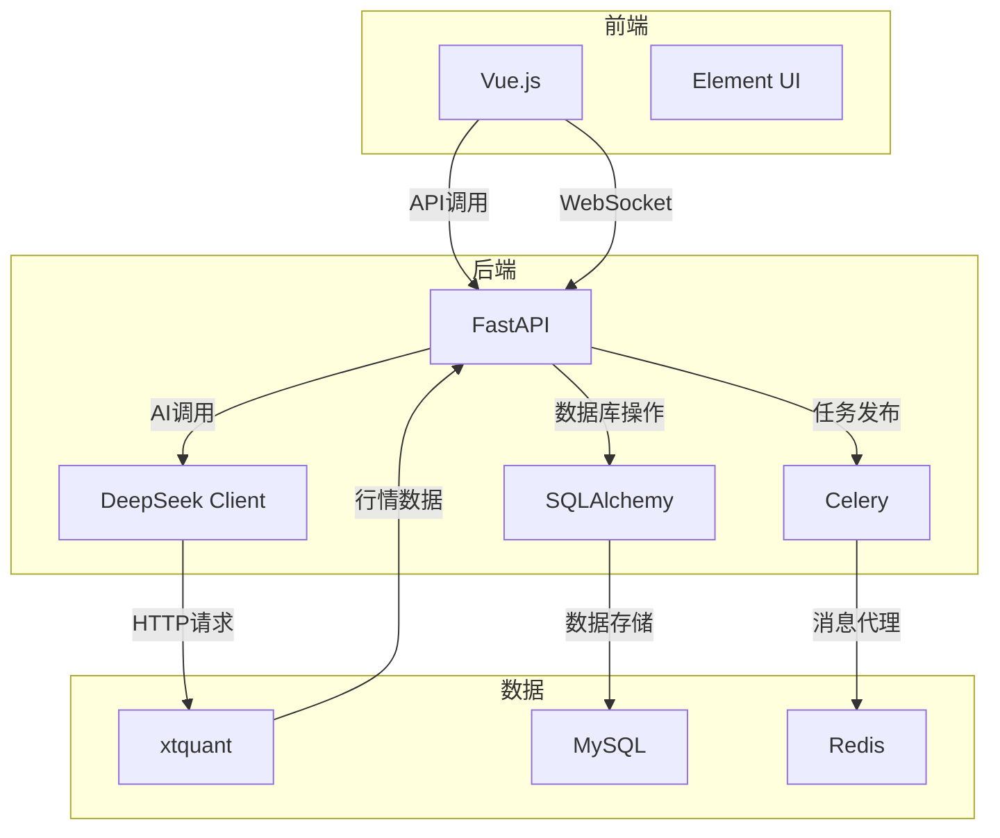

**Diagram sources**
- [main.py](file://backend/app/main.py#L1-L92)
- [config.py](file://backend/app/config.py#L1-L92)

**Section sources**
- [main.py](file://backend/app/main.py#L1-L92)
- [config.py](file://backend/app/config.py#L1-L92)