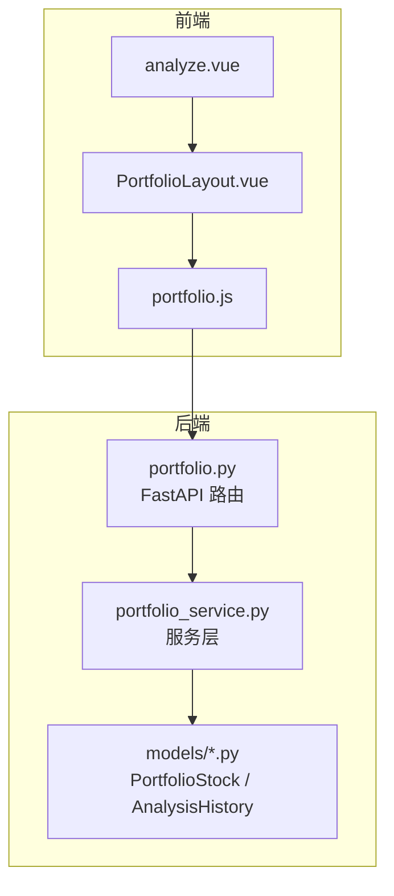
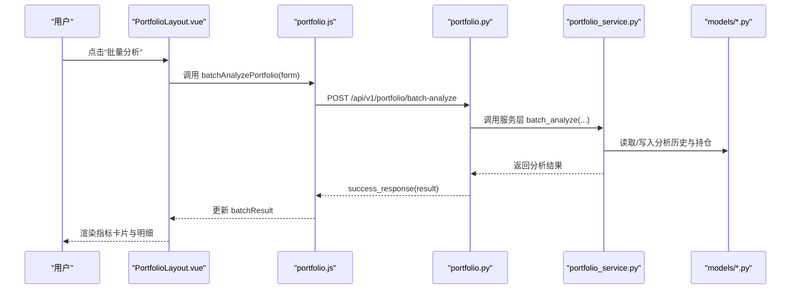
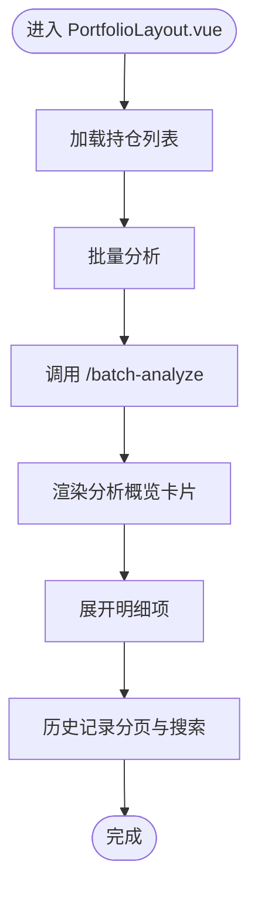
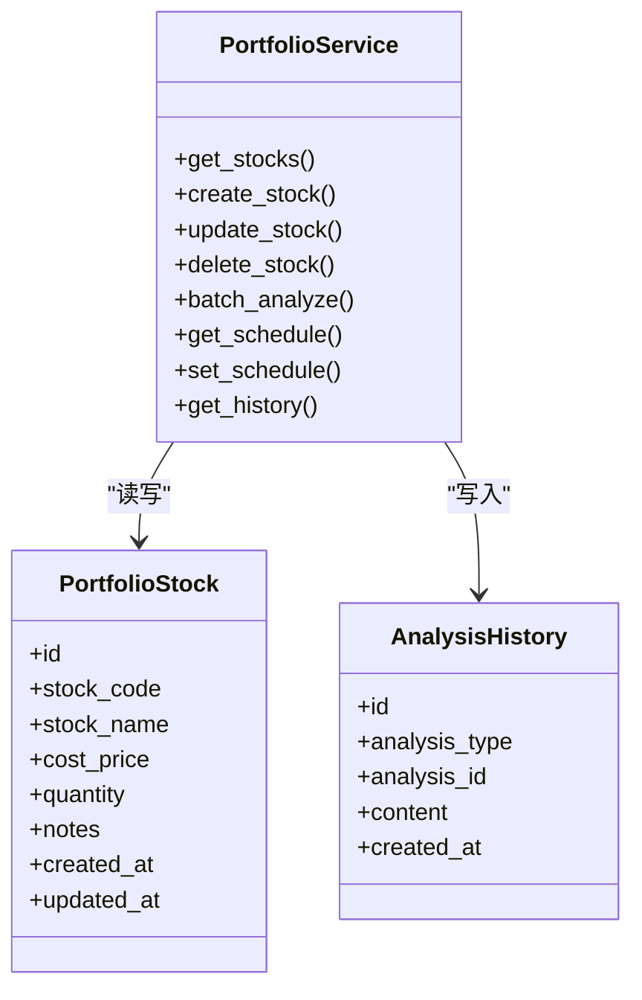
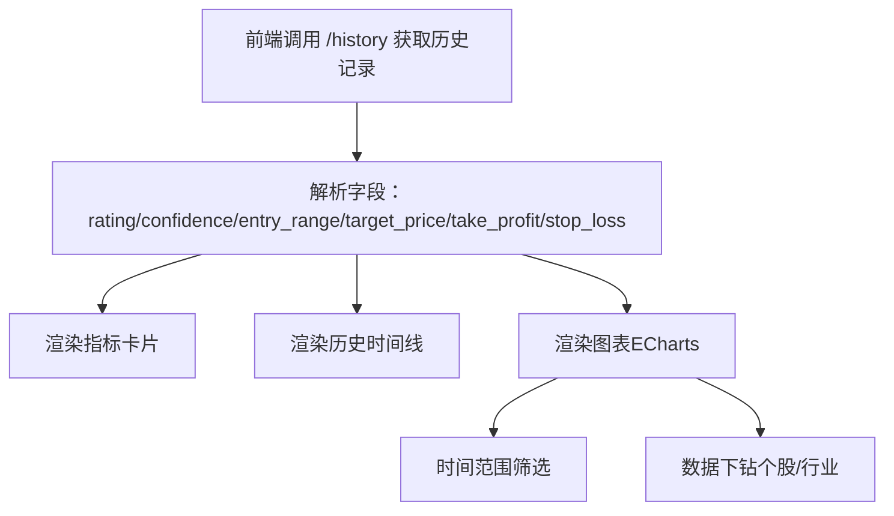
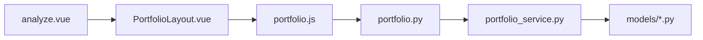

# 分析报告与可视化

<cite>
**本文引用的文件**
- [analyze.vue](file://frontend/src/views/portfolio/analyze.vue)
- [PortfolioLayout.vue](file://frontend/src/views/portfolio/components/PortfolioLayout.vue)
- [portfolio.js](file://frontend/src/api/portfolio.js)
- [portfolio.py](file://backend/app/api/v1/portfolio.py)
- [portfolio_service.py](file://backend/app/services/portfolio_service.py)
- [portfolio.py（模型）](file://backend/app/models/portfolio.py)
- [analysis.py（模型）](file://backend/app/models/analysis.py)
- [analysis.py（Schema）](file://backend/app/schemas/analysis.py)
- [UNIFIED_ANALYSIS_SPEC.md](file://docs/UNIFIED_ANALYSIS_SPEC.md)
- [PORTFOLIO_USAGE.md](file://docs/PORTFOLIO_USAGE.md)
</cite>

## 目录
1. [简介](#简介)
2. [项目结构](#项目结构)
3. [核心组件](#核心组件)
4. [架构总览](#架构总览)
5. [详细组件分析](#详细组件分析)
6. [依赖关系分析](#依赖关系分析)
7. [性能考量](#性能考量)
8. [故障排查指南](#故障排查指南)
9. [结论](#结论)
10. [附录](#附录)

## 简介
本文件面向“投资组合分析报告的生成与前端可视化”主题，系统阐述从前端 analyze.vue 组件到后端 portfolio_service 的调用链路、分析结果的数据结构、前端可视化渲染方式，以及在大数据量场景下的性能优化策略。当前仓库中，前端 analyze.vue 作为入口，通过 PortfolioLayout.vue 集成“持仓管理、批量分析、定时任务、历史记录”等能力；后端 portfolio.py 定义了 /api/v1/portfolio/* 接口，portfolio_service.py 作为服务层占位，尚未实现具体算法。本文在不展示具体代码的前提下，结合现有 API 文档与前端实现，给出可落地的可视化与性能优化方案。

## 项目结构
- 前端
  - analyze.vue：页面入口，承载 PortfolioLayout.vue
  - PortfolioLayout.vue：核心布局与交互，负责调用后端接口、渲染指标卡片与历史记录
  - portfolio.js：封装 /api/v1/portfolio/* 请求
- 后端
  - portfolio.py：FastAPI 路由，暴露 /stocks、/batch-analyze、/schedule、/history 等接口
  - portfolio_service.py：服务层（占位，待实现）
  - models：PortfolioStock、AnalysisHistory 等模型（用于历史记录与分析结果持久化）



**图表来源**
- [analyze.vue](file://frontend/src/views/portfolio/analyze.vue#L1-L14)
- [PortfolioLayout.vue](file://frontend/src/views/portfolio/components/PortfolioLayout.vue#L1-L120)
- [portfolio.js](file://frontend/src/api/portfolio.js#L1-L73)
- [portfolio.py](file://backend/app/api/v1/portfolio.py#L1-L123)
- [portfolio_service.py](file://backend/app/services/portfolio_service.py#L1-L54)
- [portfolio.py（模型）](file://backend/app/models/portfolio.py#L1-L22)
- [analysis.py（模型）](file://backend/app/models/analysis.py#L1-L19)

**章节来源**
- [analyze.vue](file://frontend/src/views/portfolio/analyze.vue#L1-L14)
- [PortfolioLayout.vue](file://frontend/src/views/portfolio/components/PortfolioLayout.vue#L1-L120)
- [portfolio.js](file://frontend/src/api/portfolio.js#L1-L73)
- [portfolio.py](file://backend/app/api/v1/portfolio.py#L1-L123)
- [portfolio_service.py](file://backend/app/services/portfolio_service.py#L1-L54)
- [portfolio.py（模型）](file://backend/app/models/portfolio.py#L1-L22)
- [analysis.py（模型）](file://backend/app/models/analysis.py#L1-L19)

## 核心组件
- 前端入口与布局
  - analyze.vue：页面容器，引入 PortfolioLayout.vue
  - PortfolioLayout.vue：提供“持仓管理、批量分析、定时任务、历史记录”四大 Tab，内置演示数据与分页加载逻辑
- 前端 API 封装
  - portfolio.js：封装 /stocks、/batch-analyze、/schedule、/history 等请求方法
- 后端路由
  - portfolio.py：定义 /stocks、/batch-analyze、/schedule、/history 等接口，返回 success_response 包裹的数据
- 服务层与模型
  - portfolio_service.py：服务层（占位），后续将承载收益、风险、分布等算法
  - models：PortfolioStock、AnalysisHistory 等模型，支撑历史记录与分析结果持久化

**章节来源**
- [analyze.vue](file://frontend/src/views/portfolio/analyze.vue#L1-L14)
- [PortfolioLayout.vue](file://frontend/src/views/portfolio/components/PortfolioLayout.vue#L1-L120)
- [portfolio.js](file://frontend/src/api/portfolio.js#L1-L73)
- [portfolio.py](file://backend/app/api/v1/portfolio.py#L1-L123)
- [portfolio_service.py](file://backend/app/services/portfolio_service.py#L1-L54)
- [portfolio.py（模型）](file://backend/app/models/portfolio.py#L1-L22)
- [analysis.py（模型）](file://backend/app/models/analysis.py#L1-L19)

## 架构总览
前端通过 PortfolioLayout.vue 调用 portfolio.js，进而访问后端 FastAPI 路由。后端 portfolio_service.py 作为服务层承载业务逻辑，最终与数据库模型交互以持久化分析历史。当前服务层尚未实现具体算法，前端已具备演示数据与分页加载能力。



**图表来源**
- [PortfolioLayout.vue](file://frontend/src/views/portfolio/components/PortfolioLayout.vue#L895-L908)
- [portfolio.js](file://frontend/src/api/portfolio.js#L38-L45)
- [portfolio.py](file://backend/app/api/v1/portfolio.py#L68-L81)
- [portfolio_service.py](file://backend/app/services/portfolio_service.py#L34-L37)
- [analysis.py（模型）](file://backend/app/models/analysis.py#L1-L19)

## 详细组件分析

### 前端：analyze.vue 与 PortfolioLayout.vue
- analyze.vue 作为页面容器，引入 PortfolioLayout.vue，后者承担实际布局与交互
- PortfolioLayout.vue
  - 持仓管理 Tab：渲染指标卡片（如“持仓股票数”、“自动同步”、“已填写持仓”、“估算持仓成本”），支持表格、编辑/删除、添加对话框
  - 批量分析 Tab：提供分析模式（顺序/并行）、并行线程数、自动同步与通知开关；发起 /batch-analyze 请求后渲染概览与明细
  - 定时任务 Tab：配置每日分析时间、分析模式、并行线程、自动同步与通知；支持保存与刷新
  - 历史记录 Tab：支持搜索、分页（page/page_size）、时间线展示；内置演示数据 fallback
  - 数据加载与降级：当后端接口不可用时，自动回退到演示数据并提示用户



**图表来源**
- [PortfolioLayout.vue](file://frontend/src/views/portfolio/components/PortfolioLayout.vue#L1-L120)
- [PortfolioLayout.vue](file://frontend/src/views/portfolio/components/PortfolioLayout.vue#L895-L908)
- [PortfolioLayout.vue](file://frontend/src/views/portfolio/components/PortfolioLayout.vue#L995-L1034)

**章节来源**
- [analyze.vue](file://frontend/src/views/portfolio/analyze.vue#L1-L14)
- [PortfolioLayout.vue](file://frontend/src/views/portfolio/components/PortfolioLayout.vue#L1-L120)
- [PortfolioLayout.vue](file://frontend/src/views/portfolio/components/PortfolioLayout.vue#L895-L908)
- [PortfolioLayout.vue](file://frontend/src/views/portfolio/components/PortfolioLayout.vue#L995-L1034)

### 前端：portfolio.js 与后端 portfolio.py
- portfolio.js
  - getPortfolioStocks / createPortfolioStock / updatePortfolioStock / deletePortfolioStock
  - batchAnalyzePortfolio
  - getPortfolioSchedule / setPortfolioSchedule
  - getPortfolioHistory（含分页参数）
- portfolio.py
  - /stocks：GET/POST/PUT/DELETE
  - /batch-analyze：POST（mode、max_workers）
  - /schedule：GET/POST
  - /history：GET（stock_code、page、page_size）

```mermaid
classDiagram
class PortfolioLayout {
+loadStocks()
+handleBatchAnalyze()
+loadSchedule()
+saveSchedule()
+loadHistory()
}
class PortfolioAPI {
+getPortfolioStocks()
+createPortfolioStock()
+updatePortfolioStock()
+deletePortfolioStock()
+batchAnalyzePortfolio()
+getPortfolioSchedule()
+setPortfolioSchedule()
+getPortfolioHistory()
}
class FastAPI_Router {
+GET /stocks
+POST /stocks
+PUT /stocks/{id}
+DELETE /stocks/{id}
+POST /batch-analyze
+GET /schedule
+POST /schedule
+GET /history
}
PortfolioLayout --> PortfolioAPI : "调用"
PortfolioAPI --> FastAPI_Router : "HTTP 请求"
```

**图表来源**
- [PortfolioLayout.vue](file://frontend/src/views/portfolio/components/PortfolioLayout.vue#L771-L908)
- [portfolio.js](file://frontend/src/api/portfolio.js#L1-L73)
- [portfolio.py](file://backend/app/api/v1/portfolio.py#L14-L123)

**章节来源**
- [portfolio.js](file://frontend/src/api/portfolio.js#L1-L73)
- [portfolio.py](file://backend/app/api/v1/portfolio.py#L14-L123)

### 后端：portfolio_service.py 与模型
- portfolio_service.py：当前为占位，后续将实现 get_stocks/create_stock/update_stock/delete_stock/batch_analyze/get_schedule/set_schedule/get_history 等方法
- models
  - PortfolioStock：持仓股票模型（stock_code、stock_name、cost_price、quantity、notes、created_at、updated_at）
  - AnalysisHistory：分析历史记录模型（analysis_type、analysis_id、content、created_at）



**图表来源**
- [portfolio_service.py](file://backend/app/services/portfolio_service.py#L1-L54)
- [portfolio.py（模型）](file://backend/app/models/portfolio.py#L1-L22)
- [analysis.py（模型）](file://backend/app/models/analysis.py#L1-L19)

**章节来源**
- [portfolio_service.py](file://backend/app/services/portfolio_service.py#L1-L54)
- [portfolio.py（模型）](file://backend/app/models/portfolio.py#L1-L22)
- [analysis.py（模型）](file://backend/app/models/analysis.py#L1-L19)

### 分析结果数据结构与可视化要点
- 统一分析规范
  - 参考统一分析规范文档，明确 final_decision 字段（如 rating、confidence_level、entry_range、take_profit、stop_loss、target_price、advice 等），确保前后端字段一致
- 前端渲染
  - PortfolioLayout.vue 已内置演示数据（FALLBACK_BATCH_RESULT、FALLBACK_HISTORY），可直接映射到卡片与时间线展示
  - 历史记录支持分页与搜索，前端通过 getPortfolioHistory(params) 传入 page/page_size/stock_code
- 可视化建议
  - 指标卡片：总股票数、成功数、失败数、耗时
  - 绩效曲线：按分析时间序列绘制累计收益/净值（需后端提供序列化数据）
  - 资产分布：饼图/柱状图展示按行业/板块/个股的权重
  - 风险热力图：按波动率/最大回撤等指标热力呈现
  - ECharts 使用：在 PortfolioLayout.vue 中引入 ECharts，按 tab 切换动态渲染图表；支持时间范围筛选与数据下钻



**图表来源**
- [PortfolioLayout.vue](file://frontend/src/views/portfolio/components/PortfolioLayout.vue#L995-L1034)
- [UNIFIED_ANALYSIS_SPEC.md](file://docs/UNIFIED_ANALYSIS_SPEC.md#L46-L131)

**章节来源**
- [UNIFIED_ANALYSIS_SPEC.md](file://docs/UNIFIED_ANALYSIS_SPEC.md#L46-L131)
- [PortfolioLayout.vue](file://frontend/src/views/portfolio/components/PortfolioLayout.vue#L995-L1034)

### 后端算法实现建议（收益、风险、分布）
以下为通用算法思路与数据来源，供服务层实现参考（当前服务层尚未实现，以下为概念性说明）：
- 年化收益率
  - 公式：(1 + 总收益率)^(252/持有天数) - 1（工作日）
  - 数据来源：历史净值序列（日频）、成本与份额
- 最大回撤（Max Drawdown）
  - 定义：从峰值到随后谷底的回落幅度
  - 计算：对净值序列求滚动最大值，再计算回撤率的最大值
- 夏普比率
  - 公式：(平均超额收益)/标准差（通常以无风险利率为基准）
  - 数据来源：日度超额收益序列
- 资产分布统计
  - 按行业/板块/个股计算市值占比，生成饼图/柱状图数据
- 风险热力图
  - 指标：波动率、VaR、最大回撤等，按时间窗口滑动计算

上述指标可在 portfolio_service.py 的 batch_analyze 或独立方法中实现，并通过 AnalysisHistory 持久化。

**章节来源**
- [portfolio_service.py](file://backend/app/services/portfolio_service.py#L34-L37)
- [analysis.py（模型）](file://backend/app/models/analysis.py#L1-L19)

## 依赖关系分析
- 前端依赖
  - analyze.vue 依赖 PortfolioLayout.vue
  - PortfolioLayout.vue 依赖 portfolio.js
  - portfolio.js 依赖后端 FastAPI 路由
- 后端依赖
  - portfolio.py 依赖 portfolio_service.py
  - portfolio_service.py 依赖 models（PortfolioStock、AnalysisHistory）



**图表来源**
- [analyze.vue](file://frontend/src/views/portfolio/analyze.vue#L1-L14)
- [PortfolioLayout.vue](file://frontend/src/views/portfolio/components/PortfolioLayout.vue#L1-L120)
- [portfolio.js](file://frontend/src/api/portfolio.js#L1-L73)
- [portfolio.py](file://backend/app/api/v1/portfolio.py#L1-L123)
- [portfolio_service.py](file://backend/app/services/portfolio_service.py#L1-L54)
- [portfolio.py（模型）](file://backend/app/models/portfolio.py#L1-L22)
- [analysis.py（模型）](file://backend/app/models/analysis.py#L1-L19)

**章节来源**
- [analyze.vue](file://frontend/src/views/portfolio/analyze.vue#L1-L14)
- [PortfolioLayout.vue](file://frontend/src/views/portfolio/components/PortfolioLayout.vue#L1-L120)
- [portfolio.js](file://frontend/src/api/portfolio.js#L1-L73)
- [portfolio.py](file://backend/app/api/v1/portfolio.py#L1-L123)
- [portfolio_service.py](file://backend/app/services/portfolio_service.py#L1-L54)
- [portfolio.py（模型）](file://backend/app/models/portfolio.py#L1-L22)
- [analysis.py（模型）](file://backend/app/models/analysis.py#L1-L19)

## 性能考量
- 前端
  - 分页加载：历史记录已内置分页（page/page_size），建议在大数据量下默认使用分页
  - 演示数据降级：接口不可用时自动回退演示数据，保证用户体验
  - 图表渲染：ECharts 按需渲染，避免一次性渲染过多数据
- 后端
  - 批量分析模式：顺序/并行两种模式，可根据持仓数量与 API 限额选择
  - 数据持久化：AnalysisHistory 仅存储 JSON 内容，建议控制单条记录大小
- 参考性能参数
  - 文档提供了不同模式与线程数下的参考耗时，可据此优化调度策略

**章节来源**
- [PortfolioLayout.vue](file://frontend/src/views/portfolio/components/PortfolioLayout.vue#L995-L1034)
- [PORTFOLIO_USAGE.md](file://docs/PORTFOLIO_USAGE.md#L293-L312)

## 故障排查指南
- 接口不可用
  - 前端会自动回退演示数据并提示用户；检查后端服务是否启动、路由是否正确
- 批量分析失败
  - 检查分析模式与并行线程数；关注网络稳定性与 API 额度
- 监测同步不生效
  - 确认分析成功且包含进场区间与止盈止损；检查自动监测开关
- 历史记录为空
  - 确认分页参数与搜索关键字；必要时清空搜索重试

**章节来源**
- [PortfolioLayout.vue](file://frontend/src/views/portfolio/components/PortfolioLayout.vue#L771-L908)
- [PORTFOLIO_USAGE.md](file://docs/PORTFOLIO_USAGE.md#L243-L291)

## 结论
当前项目前端已具备完善的布局与交互能力，后端接口已就绪但服务层尚未实现核心算法。建议优先完成 portfolio_service.py 的收益、风险、分布等算法实现，并通过 AnalysisHistory 持久化分析结果；前端在 PortfolioLayout.vue 中扩展 ECharts 图表与时间范围筛选、数据下钻能力，以满足投资组合分析报告的可视化需求。

## 附录
- 统一分析字段与解析规范
  - 参考统一分析规范文档，确保字段名与解析逻辑一致
- 历史记录查询
  - 前端通过 getPortfolioHistory(params) 查询，params 包含 stock_code、page、page_size

**章节来源**
- [UNIFIED_ANALYSIS_SPEC.md](file://docs/UNIFIED_ANALYSIS_SPEC.md#L46-L131)
- [PortfolioLayout.vue](file://frontend/src/views/portfolio/components/PortfolioLayout.vue#L995-L1034)