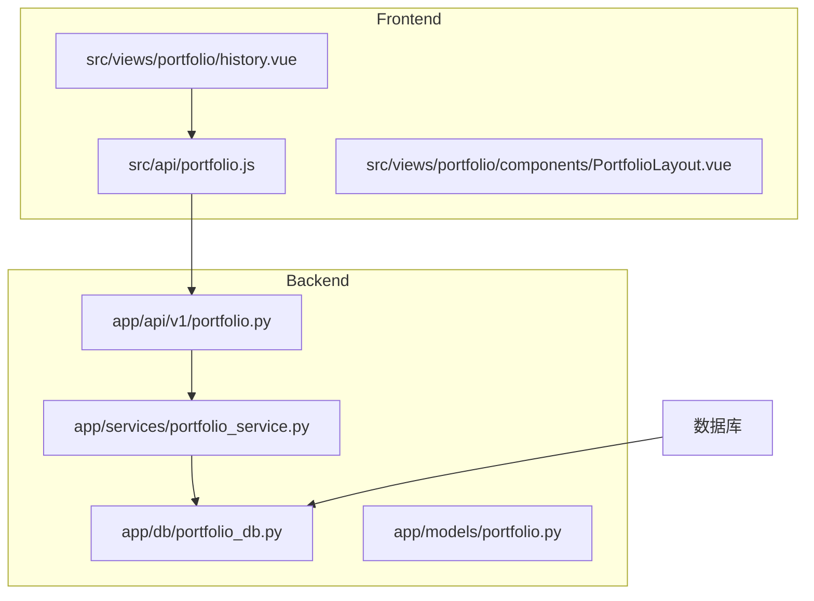
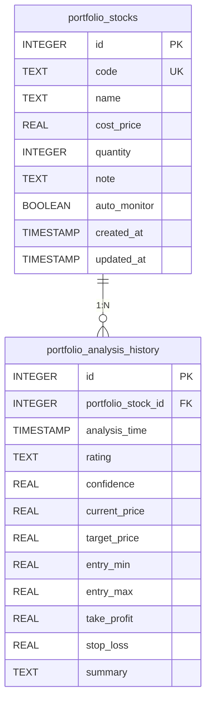

# 历史记录与版本控制

<cite>
**本文档引用文件**   
- [portfolio_db.py](file://backend/app/db/portfolio_db.py)
- [portfolio.py](file://backend/app/api/v1/portfolio.py)
- [portfolio_service.py](file://backend/app/services/portfolio_service.py)
- [history.vue](file://frontend/src/views/portfolio/history.vue)
- [portfolio.js](file://frontend/src/api/portfolio.js)
- [mainforce_batch_db.py](file://backend/app/db/mainforce_batch_db.py)
- [database.py](file://backend/app/database.py)
</cite>

## 目录
1. [项目结构](#项目结构)
2. [核心组件](#核心组件)
3. [数据库设计](#数据库设计)
4. [后端API实现](#后端api实现)
5. [前端实现](#前端实现)
6. [数据保留与优化](#数据保留与优化)

## 项目结构

投资组合历史记录功能分布在前后端多个模块中，主要涉及以下目录结构：



**图源**
- [portfolio.py](file://backend/app/api/v1/portfolio.py)
- [history.vue](file://frontend/src/views/portfolio/history.vue)
- [PortfolioLayout.vue](file://frontend/src/views/portfolio/components/PortfolioLayout.vue)

## 核心组件

投资组合历史记录功能由前后端协同实现，主要包括数据库层、服务层、API层和前端UI层。系统通过分层架构确保数据一致性与查询效率。

**本节源**
- [portfolio_service.py](file://backend/app/services/portfolio_service.py)
- [portfolio.py](file://backend/app/api/v1/portfolio.py)
- [history.vue](file://frontend/src/views/portfolio/history.vue)

## 数据库设计

### 投资组合历史表结构

根据旧版代码分析，投资组合历史记录功能依赖于两个核心表：`portfolio_stocks`（持仓股票表）和`portfolio_analysis_history`（持仓分析历史表）。



**图源**
- [portfolio_db.py](file://old/portfolio_db.py#L40-L73)

### 数据存储与序列化

历史记录中的分析结果采用JSON格式序列化存储，确保复杂数据结构的完整保存。系统通过`_clean_results_for_json`方法清理数据，处理DataFrame、Series等特殊类型，限制数据大小以避免存储膨胀。

```python
def _clean_results_for_json(self, results: List[Dict]) -> List[Dict]:
    """
    清理结果数据，确保可以JSON序列化
    
    Args:
        results: 原始结果列表
        
    Returns:
        清理后的结果列表
    """
    def clean_value(value):
        """递归清理值"""
        if value is None:
            return None
        elif isinstance(value, pd.DataFrame):
            if len(value) > 100:
                return value.head(100).to_dict('records')
            return value.to_dict('records')
        elif isinstance(value, pd.Series):
            return value.to_dict()
        # ... 其他类型处理
```

**本节源**
- [mainforce_batch_db.py](file://backend/app/db/mainforce_batch_db.py#L51-L78)
- [portfolio_db.py](file://old/portfolio_db.py)

### 索引优化

为提升查询性能，系统创建了多个数据库索引：

- `idx_portfolio_analysis_stock_id`：基于`portfolio_stock_id`的索引，加速特定股票的历史记录查询
- `idx_analysis_date`：基于`analysis_date`的索引，优化按分析时间的查询效率
- `created_at`字段上的索引，确保按创建时间排序的查询性能

这些索引设计确保了在大数据量下的高效查询能力。

**本节源**
- [mainforce_batch_db.py](file://backend/app/db/mainforce_batch_db.py#L44-L45)
- [portfolio_db.py](file://old/portfolio_db.py#L76-L78)

## 后端API实现

### API端点设计

系统提供`GET /api/v1/portfolio/history`接口支持分页查询历史记录，该接口支持以下参数：

- `stock_code`：可选，按股票代码过滤
- `page`：当前页码，默认为1
- `page_size`：每页记录数，默认为20

```python
@router.get("/history")
async def get_history(
    stock_code: str = None,
    page: int = 1,
    page_size: int = 20,
    db: Session = Depends(get_database)
):
    """分析历史"""
    service = PortfolioService(db)
    try:
        result = await service.get_history(stock_code, page, page_size)
        return success_response(result)
    except Exception as e:
        raise HTTPException(status_code=500, detail=str(e))
```

**本节源**
- [portfolio.py](file://backend/app/api/v1/portfolio.py#L108-L123)

### 服务层实现

`PortfolioService`类的`get_history`方法负责处理历史记录查询逻辑，包括分页处理和数据格式化：

```python
async def get_history(self, stock_code: Optional[str] = None, page: int = 1, page_size: int = 20):
    """分析历史"""
    # TODO: 实现分析历史查询逻辑
    pass
```

分页逻辑采用简单的切片方式实现，数据库查询结果已按`created_at`降序排列：

```python
# 简单分页（数据库已按created_at DESC排序）
start_idx = (page - 1) * page_size
end_idx = start_idx + page_size
items = history[start_idx:end_idx]

return {
    "total": len(history),
    "page": page,
    "page_size": page_size,
    "items": items
}
```

**本节源**
- [portfolio_service.py](file://backend/app/services/portfolio_service.py#L49-L52)
- [mainforce_service.py](file://backend/app/services/mainforce_service.py#L220-L230)

### 数据完整性保障

系统通过以下机制确保数据完整性：

1. **外键约束**：`portfolio_analysis_history`表中的`portfolio_stock_id`字段设置为外键，引用`portfolio_stocks`表的`id`字段，并配置`ON DELETE CASCADE`，确保删除持仓股票时自动清理相关历史记录。

2. **事务处理**：所有数据库操作在事务中执行，确保操作的原子性。

3. **数据验证**：在服务层对输入参数进行验证，防止无效数据写入数据库。

4. **异常处理**：完善的异常捕获和日志记录机制，便于问题追踪和系统维护。

**本节源**
- [portfolio_db.py](file://old/portfolio_db.py#L71-L72)
- [portfolio_service.py](file://backend/app/services/portfolio_service.py)

## 前端实现

### UI设计

`history.vue`组件通过`PortfolioLayout`组件的"分析历史"标签页展示历史记录，采用时间轴（Timeline）布局展示分析历史，每个时间点显示股票代码、名称、评级、信心度及关键价格信息。

```vue
<el-tab-pane label="📈 分析历史" name="history">
  <el-card shadow="never" class="section-card">
    <div class="section-header">
      <h3>历史记录</h3>
      <div class="header-actions">
        <el-button icon="el-icon-refresh" :loading="historyLoading" @click="loadHistory">
          刷新
        </el-button>
      </div>
    </div>
    <el-form :inline="true" size="small" class="history-toolbar">
      <!-- 搜索框 -->
    </el-form>
    <el-timeline v-else>
      <el-timeline-item
        v-for="record in filteredHistory"
        :key="record.id"
        :timestamp="formatDate(record.analysis_time)"
        placement="top"
      >
        <!-- 历史记录卡片 -->
      </el-timeline-item>
    </el-timeline>
    <div v-if="showHistoryPagination" class="pagination-wrapper">
      <el-pagination
        layout="prev, pager, next"
        :current-page="historyPagination.page"
        :page-size="historyPagination.page_size"
        :total="historyPagination.total"
        @current-change="handleHistoryPageChange"
      />
    </div>
  </el-card>
</el-tab-pane>
```

**本节源**
- [history.vue](file://frontend/src/views/portfolio/history.vue#L324-L405)
- [PortfolioLayout.vue](file://frontend/src/views/portfolio/components/PortfolioLayout.vue#L324-L405)

### 交互逻辑

前端通过`portfolio.js`中的`getPortfolioHistory`函数调用后端API获取历史记录：

```javascript
// 分析历史
export function getPortfolioHistory(params) {
  return request({
    url: '/api/v1/portfolio/history',
    method: 'get',
    params
  })
}
```

用户交互逻辑包括：

1. **分页浏览**：通过`el-pagination`组件实现分页功能，支持前后翻页。
2. **搜索过滤**：提供搜索框，支持按股票代码或名称过滤历史记录。
3. **实时刷新**：提供刷新按钮，可手动重新加载历史记录。
4. **时间排序**：历史记录按分析时间倒序排列，最新记录显示在最上方。

**本节源**
- [portfolio.js](file://frontend/src/api/portfolio.js#L64-L72)
- [PortfolioLayout.vue](file://frontend/src/views/portfolio/components/PortfolioLayout.vue#L751-L788)

## 数据保留与优化

### 数据保留策略

系统采用以下数据保留策略：

1. **有限存储**：通过`limit`参数限制返回的历史记录数量，默认为50条，避免一次性加载过多数据影响性能。

2. **按需加载**：采用分页机制，只加载当前页所需数据，减少网络传输量。

3. **数据清理**：提供删除接口，支持清理过期或无用的历史记录。

### 存储空间优化

为优化存储空间，系统采取以下措施：

1. **数据压缩**：对DataFrame等大数据对象，只保留前100行，避免存储过大。

2. **索引优化**：创建必要的数据库索引，提升查询效率，减少全表扫描。

3. **数据归档**：虽然当前代码未实现，但可通过定期归档旧数据到冷存储来优化主数据库性能。

4. **缓存机制**：前端对历史记录进行缓存，减少重复请求。

### 性能优化建议

1. **数据库分区**：对历史记录表按时间分区，提升查询性能。
2. **异步处理**：将历史记录查询改为异步任务，避免阻塞主线程。
3. **缓存层**：引入Redis等缓存系统，缓存常用查询结果。
4. **数据压缩**：对JSON数据进行GZIP压缩存储，减少存储空间占用。

**本节源**
- [mainforce_batch_db.py](file://backend/app/db/mainforce_batch_db.py#L66-L68)
- [portfolio_db.py](file://old/portfolio_db.py)