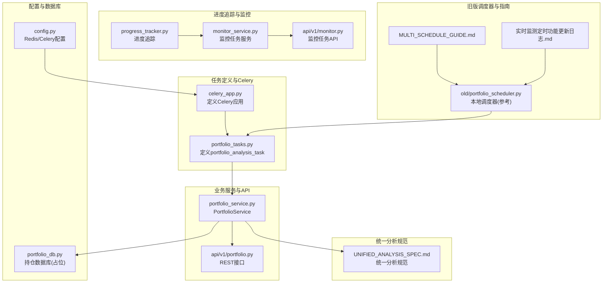
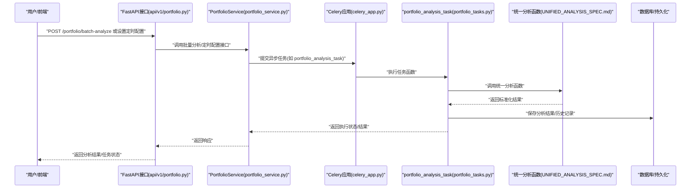
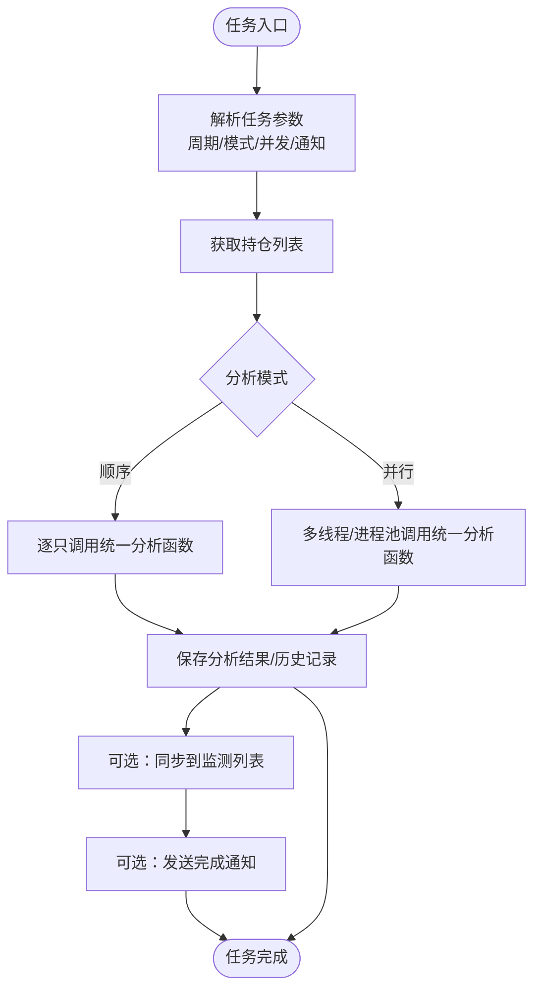
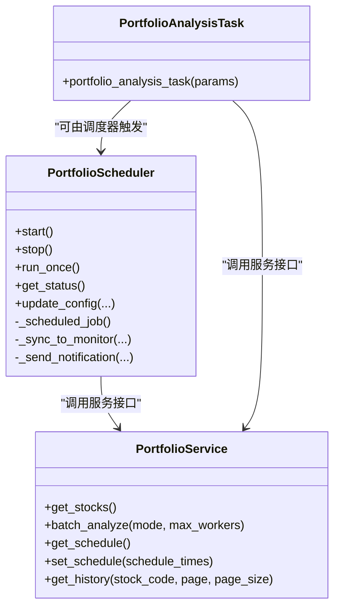
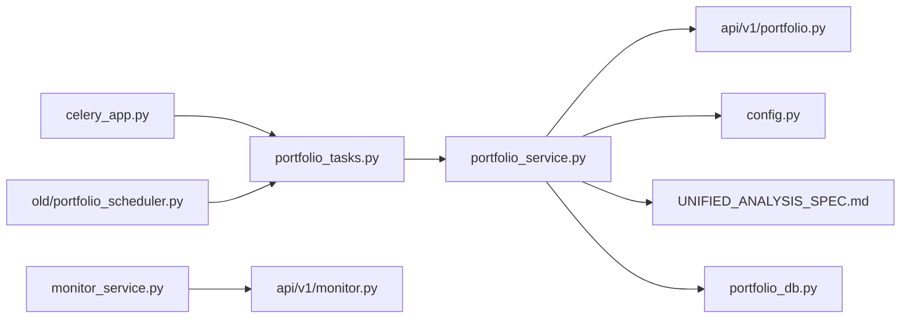

# 定时分析任务

<cite>
**本文引用的文件**
- [backend/app/tasks/portfolio_tasks.py](file://backend/app/tasks/portfolio_tasks.py)
- [backend/app/tasks/celery_app.py](file://backend/app/tasks/celery_app.py)
- [backend/app/services/portfolio_service.py](file://backend/app/services/portfolio_service.py)
- [backend/app/api/v1/portfolio.py](file://backend/app/api/v1/portfolio.py)
- [docs/UNIFIED_ANALYSIS_SPEC.md](file://docs/UNIFIED_ANALYSIS_SPEC.md)
- [backend/app/config.py](file://backend/app/config.py)
- [backend/app/db/portfolio_db.py](file://backend/app/db/portfolio_db.py)
- [backend/app/core/progress_tracker.py](file://backend/app/core/progress_tracker.py)
- [backend/app/services/monitor_service.py](file://backend/app/services/monitor_service.py)
- [backend/app/api/v1/monitor.py](file://backend/app/api/v1/monitor.py)
- [old/portfolio_scheduler.py](file://old/portfolio_scheduler.py)
- [docs/MULTI_SCHEDULE_GUIDE.md](file://docs/MULTI_SCHEDULE_GUIDE.md)
- [docs/实时监测定时功能更新日志.md](file://docs/实时监测定时功能更新日志.md)
</cite>

## 目录
1. [引言](#引言)
2. [项目结构](#项目结构)
3. [核心组件](#核心组件)
4. [架构总览](#架构总览)
5. [详细组件分析](#详细组件分析)
6. [依赖分析](#依赖分析)
7. [性能考虑](#性能考虑)
8. [故障排查指南](#故障排查指南)
9. [结论](#结论)
10. [附录](#附录)

## 引言
本文件聚焦于“投资组合定时分析任务”的实现机制，围绕 portfolio_tasks.py 中的 Celery 异步任务定义与调度逻辑展开，说明系统如何基于用户配置的周期（如每日、每周）自动触发组合分析流程，并调用统一分析接口（遵循 UNIFIED_ANALYSIS_SPEC.md 规范）执行多维度评估。同时阐述任务调度器与 portfolio_service.py 的协作关系，包括任务参数传递、执行状态追踪与结果回调处理；并给出任务失败重试策略、超时控制及日志记录的最佳实践，结合代码示例路径展示如何注册定时任务、配置 Crontab 表达式以及监控任务执行情况。

## 项目结构
围绕“定时分析任务”，本仓库中与之直接相关的关键文件与职责如下：
- 任务定义与Celery应用
  - backend/app/tasks/celery_app.py：定义 Celery 应用实例，配置序列化、时区与连接参数。
  - backend/app/tasks/portfolio_tasks.py：定义 portfolio_analysis_task 异步任务入口（当前为占位实现，后续扩展）。
- 业务服务与API
  - backend/app/services/portfolio_service.py：提供持仓列表、批量分析、定时配置、历史查询等服务接口（当前为占位实现，后续扩展）。
  - backend/app/api/v1/portfolio.py：提供前端交互的 REST API，包括获取/设置定时配置、批量分析等。
- 统一分析规范
  - docs/UNIFIED_ANALYSIS_SPEC.md：明确统一分析函数、字段名、解析规则与最佳实践。
- 配置与数据库
  - backend/app/config.py：Redis/Celery 连接配置项。
  - backend/app/db/portfolio_db.py：持仓数据库层（当前为占位，后续迁移）。
- 进度追踪与监控
  - backend/app/core/progress_tracker.py：通用任务进度追踪与清理策略。
  - backend/app/services/monitor_service.py、backend/app/api/v1/monitor.py：监控任务的生命周期管理（启动/停止/删除/状态查询），可作为定时任务执行状态的参考实现。
- 旧版调度器与指南
  - old/portfolio_scheduler.py：旧版基于 schedule 库的本地定时调度器实现，包含多时间点、并行模式、通知与同步等完整流程，可作为 Celery 版本的参考蓝图。
  - docs/MULTI_SCHEDULE_GUIDE.md、docs/实时监测定时功能更新日志.md：多时间点调度与使用建议。

图表来源
- [backend/app/tasks/celery_app.py](file://backend/app/tasks/celery_app.py#L1-L21)
- [backend/app/tasks/portfolio_tasks.py](file://backend/app/tasks/portfolio_tasks.py#L1-L13)
- [backend/app/services/portfolio_service.py](file://backend/app/services/portfolio_service.py#L1-L54)
- [backend/app/api/v1/portfolio.py](file://backend/app/api/v1/portfolio.py#L1-L123)
- [docs/UNIFIED_ANALYSIS_SPEC.md](file://docs/UNIFIED_ANALYSIS_SPEC.md#L1-L273)
- [backend/app/config.py](file://backend/app/config.py#L1-L92)
- [backend/app/db/portfolio_db.py](file://backend/app/db/portfolio_db.py#L1-L6)
- [backend/app/core/progress_tracker.py](file://backend/app/core/progress_tracker.py#L149-L170)
- [backend/app/services/monitor_service.py](file://backend/app/services/monitor_service.py#L194-L408)
- [backend/app/api/v1/monitor.py](file://backend/app/api/v1/monitor.py#L47-L92)
- [old/portfolio_scheduler.py](file://old/portfolio_scheduler.py#L1-L735)
- [docs/MULTI_SCHEDULE_GUIDE.md](file://docs/MULTI_SCHEDULE_GUIDE.md)
- [docs/实时监测定时功能更新日志.md](file://docs/实时监测定时功能更新日志.md)

章节来源
- [backend/app/tasks/celery_app.py](file://backend/app/tasks/celery_app.py#L1-L21)
- [backend/app/tasks/portfolio_tasks.py](file://backend/app/tasks/portfolio_tasks.py#L1-L13)
- [backend/app/services/portfolio_service.py](file://backend/app/services/portfolio_service.py#L1-L54)
- [backend/app/api/v1/portfolio.py](file://backend/app/api/v1/portfolio.py#L1-L123)
- [docs/UNIFIED_ANALYSIS_SPEC.md](file://docs/UNIFIED_ANALYSIS_SPEC.md#L1-L273)
- [backend/app/config.py](file://backend/app/config.py#L1-L92)
- [backend/app/db/portfolio_db.py](file://backend/app/db/portfolio_db.py#L1-L6)
- [backend/app/core/progress_tracker.py](file://backend/app/core/progress_tracker.py#L149-L170)
- [backend/app/services/monitor_service.py](file://backend/app/services/monitor_service.py#L194-L408)
- [backend/app/api/v1/monitor.py](file://backend/app/api/v1/monitor.py#L47-L92)
- [old/portfolio_scheduler.py](file://old/portfolio_scheduler.py#L1-L735)
- [docs/MULTI_SCHEDULE_GUIDE.md](file://docs/MULTI_SCHEDULE_GUIDE.md)
- [docs/实时监测定时功能更新日志.md](file://docs/实时监测定时功能更新日志.md)

## 核心组件
- Celery 应用与任务
  - celery_app.py：创建 Celery 实例，设置 broker/backend、序列化、时区与 UTC 开关，供任务模块导入使用。
  - portfolio_tasks.py：定义 portfolio_analysis_task 异步任务装饰器入口，当前为占位实现，后续扩展为实际分析流程。
- 业务服务与API
  - portfolio_service.py：PortfolioService 提供 get_stocks/batch_analyze/get_schedule/set_schedule/get_history 等接口（当前为占位，后续扩展）。
  - api/v1/portfolio.py：提供获取/设置定时配置、批量分析、历史查询等 API。
- 统一分析规范
  - UNIFIED_ANALYSIS_SPEC.md：强制统一分析函数、字段名与解析规则，确保所有分析场景输出一致。
- 配置与数据库
  - config.py：提供 REDIS_URL/REDIS_ENABLED 等配置项，影响 Celery 连接。
  - portfolio_db.py：持仓数据库层（当前占位，后续迁移）。
- 进度追踪与监控
  - progress_tracker.py：通用任务进度追踪与清理策略（可借鉴到定时任务的状态管理）。
  - monitor_service.py、api/v1/monitor.py：监控任务的生命周期管理，可作为定时任务执行状态的参考实现。

章节来源
- [backend/app/tasks/celery_app.py](file://backend/app/tasks/celery_app.py#L1-L21)
- [backend/app/tasks/portfolio_tasks.py](file://backend/app/tasks/portfolio_tasks.py#L1-L13)
- [backend/app/services/portfolio_service.py](file://backend/app/services/portfolio_service.py#L1-L54)
- [backend/app/api/v1/portfolio.py](file://backend/app/api/v1/portfolio.py#L1-L123)
- [docs/UNIFIED_ANALYSIS_SPEC.md](file://docs/UNIFIED_ANALYSIS_SPEC.md#L1-L273)
- [backend/app/config.py](file://backend/app/config.py#L1-L92)
- [backend/app/db/portfolio_db.py](file://backend/app/db/portfolio_db.py#L1-L6)
- [backend/app/core/progress_tracker.py](file://backend/app/core/progress_tracker.py#L149-L170)
- [backend/app/services/monitor_service.py](file://backend/app/services/monitor_service.py#L194-L408)
- [backend/app/api/v1/monitor.py](file://backend/app/api/v1/monitor.py#L47-L92)

## 架构总览
下面以“Celery 异步任务 + 统一分析接口 + 服务层 + API 层”的视角，展示定时分析任务的整体架构与数据流。

图表来源
- [backend/app/api/v1/portfolio.py](file://backend/app/api/v1/portfolio.py#L1-L123)
- [backend/app/services/portfolio_service.py](file://backend/app/services/portfolio_service.py#L1-L54)
- [backend/app/tasks/celery_app.py](file://backend/app/tasks/celery_app.py#L1-L21)
- [backend/app/tasks/portfolio_tasks.py](file://backend/app/tasks/portfolio_tasks.py#L1-L13)
- [docs/UNIFIED_ANALYSIS_SPEC.md](file://docs/UNIFIED_ANALYSIS_SPEC.md#L1-L273)

## 详细组件分析

### Celery 异步任务定义与调度
- 任务定义
  - 在 portfolio_tasks.py 中，通过 celery_app.task 装饰器定义 portfolio_analysis_task，作为定时分析的异步入口。
  - 当前实现为占位，后续需在此函数内完成：读取用户配置的周期、获取持仓列表、调用统一分析接口、保存结果、触发通知与同步等。
- Celery 应用配置
  - celery_app.py 初始化 Celery，设置 broker/backend（优先使用 REDIS_URL/REDIS_ENABLED）、序列化、时区与 UTC。
  - 配置项来自 backend/app/config.py，确保与部署环境一致。
- 任务参数传递
  - 可通过任务签名传参（如周期、模式、并发数、通知开关等），并在任务内部解析与校验。
- 执行状态追踪
  - 可参考 monitor_service.py 的任务状态管理思路，为 portfolio_analysis_task 增加状态字段（如 pending/running/completed/failed）与持久化。
- 结果回调处理
  - 任务完成后可回调通知服务或触发同步至监测列表，参考 old/portfolio_scheduler.py 的通知与同步流程。

图表来源
- [backend/app/tasks/portfolio_tasks.py](file://backend/app/tasks/portfolio_tasks.py#L1-L13)
- [docs/UNIFIED_ANALYSIS_SPEC.md](file://docs/UNIFIED_ANALYSIS_SPEC.md#L1-L273)
- [old/portfolio_scheduler.py](file://old/portfolio_scheduler.py#L191-L253)

章节来源
- [backend/app/tasks/celery_app.py](file://backend/app/tasks/celery_app.py#L1-L21)
- [backend/app/tasks/portfolio_tasks.py](file://backend/app/tasks/portfolio_tasks.py#L1-L13)
- [backend/app/config.py](file://backend/app/config.py#L1-L92)
- [docs/UNIFIED_ANALYSIS_SPEC.md](file://docs/UNIFIED_ANALYSIS_SPEC.md#L1-L273)
- [old/portfolio_scheduler.py](file://old/portfolio_scheduler.py#L191-L253)

### 统一分析接口与多维度评估
- 统一分析函数
  - UNIFIED_ANALYSIS_SPEC.md 明确了统一分析函数的调用方式、字段名与解析规则，确保所有分析场景输出一致。
- 多维度评估
  - 通过 enabled_analysts_config 控制技术面、基本面、资金流、风险、情绪、新闻等维度的启用与否。
- 输出一致性
  - 统一字段名（如 rating、confidence_level、entry_range、take_profit、stop_loss、target_price、advice）便于 UI 展示与通知推送。

章节来源
- [docs/UNIFIED_ANALYSIS_SPEC.md](file://docs/UNIFIED_ANALYSIS_SPEC.md#L1-L273)

### 任务调度器与 portfolio_service 的协作
- 调度器职责（参考旧版本地调度器）
  - old/portfolio_scheduler.py 展示了完整的调度器实现：支持多时间点、顺序/并行模式、自动同步到监测、通知推送、状态查询与线程安全停止。
- 与服务层协作
  - portfolio_service.py 提供 get_stocks/batch_analyze/get_schedule/set_schedule/get_history 等接口，供调度器或 API 层调用。
  - 任务执行时，portfolio_analysis_task 通过服务层获取持仓列表与配置，再调用统一分析接口执行分析。
- 参数传递与状态追踪
  - 任务参数可通过 API 或调度器注入；执行状态可持久化以便前端查询与运维监控。
- 结果回调
  - 分析完成后可触发自动同步与通知，参考 old/portfolio_scheduler.py 的回调流程。

图表来源
- [backend/app/services/portfolio_service.py](file://backend/app/services/portfolio_service.py#L1-L54)
- [old/portfolio_scheduler.py](file://old/portfolio_scheduler.py#L1-L735)
- [backend/app/tasks/portfolio_tasks.py](file://backend/app/tasks/portfolio_tasks.py#L1-L13)

章节来源
- [backend/app/services/portfolio_service.py](file://backend/app/services/portfolio_service.py#L1-L54)
- [old/portfolio_scheduler.py](file://old/portfolio_scheduler.py#L1-L735)
- [backend/app/tasks/portfolio_tasks.py](file://backend/app/tasks/portfolio_tasks.py#L1-L13)

### 任务失败重试策略、超时控制与日志记录
- 失败重试
  - 在 celery_app.py 中可配置任务重试策略（如 retries、retry_backoff、retry_backoff_max、max_retries），并在任务内部捕获异常后抛出，交由 Celery 重试。
- 超时控制
  - 通过任务级 soft_time_limit/hard_time_limit 控制执行超时；对长耗时分析建议采用分批/分组策略并记录中间状态。
- 日志记录
  - 在任务执行前后记录关键事件（开始/完成/错误），并结合统一字段名进行日志格式化，便于监控与告警。
- 状态追踪
  - 可参考 progress_tracker.py 的清理策略，定期清理已完成/失败任务，避免内存膨胀。

章节来源
- [backend/app/core/progress_tracker.py](file://backend/app/core/progress_tracker.py#L149-L170)
- [backend/app/tasks/celery_app.py](file://backend/app/tasks/celery_app.py#L1-L21)

### 注册定时任务与配置 Crontab 表达式
- 注册方式
  - 在 Celery 中使用周期性任务注册（如每分钟/每小时/每日/每周），或在任务内部根据用户配置动态注册。
- Crontab 表达式
  - 可参考 docs/MULTI_SCHEDULE_GUIDE.md 中的多时间点调度建议，结合 Celery 的 Crontab 表达式实现每日固定时间点触发。
- 监控执行情况
  - 通过 API 查询任务状态（参考 monitor_service.py 的状态管理），或使用 Celery Flower/Redis 等工具监控队列与任务执行。

章节来源
- [docs/MULTI_SCHEDULE_GUIDE.md](file://docs/MULTI_SCHEDULE_GUIDE.md)
- [docs/实时监测定时功能更新日志.md](file://docs/实时监测定时功能更新日志.md)
- [backend/app/services/monitor_service.py](file://backend/app/services/monitor_service.py#L194-L408)
- [backend/app/api/v1/monitor.py](file://backend/app/api/v1/monitor.py#L47-L92)

## 依赖分析
- 组件耦合与内聚
  - portfolio_tasks.py 与 celery_app.py 耦合度低，通过导入 celery_app 实例解耦任务定义与应用配置。
  - portfolio_service.py 与 API 层通过 FastAPI 路由解耦，便于单元测试与替换实现。
- 外部依赖
  - Celery 依赖 Redis（或替代后端），配置来源于 backend/app/config.py。
  - 统一分析接口依赖 UNIFIED_ANALYSIS_SPEC.md 的规范约束，保证跨模块一致性。
- 循环依赖
  - 当前文件未发现循环依赖迹象；若后续引入数据库模型与服务层双向引用，需谨慎设计模块边界。

图表来源
- [backend/app/tasks/celery_app.py](file://backend/app/tasks/celery_app.py#L1-L21)
- [backend/app/tasks/portfolio_tasks.py](file://backend/app/tasks/portfolio_tasks.py#L1-L13)
- [backend/app/services/portfolio_service.py](file://backend/app/services/portfolio_service.py#L1-L54)
- [backend/app/api/v1/portfolio.py](file://backend/app/api/v1/portfolio.py#L1-L123)
- [backend/app/config.py](file://backend/app/config.py#L1-L92)
- [backend/app/db/portfolio_db.py](file://backend/app/db/portfolio_db.py#L1-L6)
- [backend/app/services/monitor_service.py](file://backend/app/services/monitor_service.py#L194-L408)
- [backend/app/api/v1/monitor.py](file://backend/app/api/v1/monitor.py#L47-L92)
- [old/portfolio_scheduler.py](file://old/portfolio_scheduler.py#L1-L735)

章节来源
- [backend/app/tasks/celery_app.py](file://backend/app/tasks/celery_app.py#L1-L21)
- [backend/app/tasks/portfolio_tasks.py](file://backend/app/tasks/portfolio_tasks.py#L1-L13)
- [backend/app/services/portfolio_service.py](file://backend/app/services/portfolio_service.py#L1-L54)
- [backend/app/api/v1/portfolio.py](file://backend/app/api/v1/portfolio.py#L1-L123)
- [backend/app/config.py](file://backend/app/config.py#L1-L92)
- [backend/app/db/portfolio_db.py](file://backend/app/db/portfolio_db.py#L1-L6)
- [backend/app/services/monitor_service.py](file://backend/app/services/monitor_service.py#L194-L408)
- [backend/app/api/v1/monitor.py](file://backend/app/api/v1/monitor.py#L47-L92)
- [old/portfolio_scheduler.py](file://old/portfolio_scheduler.py#L1-L735)

## 性能考虑
- 并发与吞吐
  - 通过并行模式缩短单次执行时间，但需注意资源限制与限流策略，避免对数据源与模型服务造成压力。
- 资源隔离
  - 将长耗时任务放入独立队列，配合 worker 数量与并发限制，提升稳定性。
- 数据持久化
  - 分析结果与历史记录应异步落库，避免阻塞任务主线程。
- 监控与告警
  - 建立任务耗时、失败率、队列积压等指标，结合日志与通知体系及时预警。

## 故障排查指南
- 任务未执行
  - 检查 Celery worker 是否启动、broker/backend 地址是否正确（来自 config.py）。
  - 确认任务已注册且 Crontab 表达式正确。
- 任务失败
  - 查看任务日志与异常堆栈，定位统一分析接口调用失败或字段解析错误。
  - 检查 enabled_analysts_config 与 selected_model 配置是否符合预期。
- 结果不一致
  - 确认使用了统一分析函数与字段名，避免废弃字段导致 UI 显示异常。
- 状态不可见
  - 参考 monitor_service.py 的状态管理，为 portfolio_analysis_task 增加状态持久化与查询接口。

章节来源
- [backend/app/config.py](file://backend/app/config.py#L1-L92)
- [docs/UNIFIED_ANALYSIS_SPEC.md](file://docs/UNIFIED_ANALYSIS_SPEC.md#L1-L273)
- [backend/app/services/monitor_service.py](file://backend/app/services/monitor_service.py#L194-L408)

## 结论
本文件梳理了投资组合定时分析任务的实现蓝图：以 Celery 异步任务为核心，结合 portfolio_service 的服务接口与 UNIFIED_ANALYSIS_SPEC.md 的统一规范，形成“配置驱动 + 统一接口 + 统一字段”的闭环。当前代码处于占位阶段，后续应在 portfolio_tasks.py 中完善任务逻辑，并在 portfolio_service.py 中补齐服务实现，最终实现稳定、可观测、可扩展的定时分析能力。

## 附录
- 代码示例路径（不展示具体代码内容）
  - Celery 应用初始化：[backend/app/tasks/celery_app.py](file://backend/app/tasks/celery_app.py#L1-L21)
  - 任务定义入口：[backend/app/tasks/portfolio_tasks.py](file://backend/app/tasks/portfolio_tasks.py#L1-L13)
  - 服务接口占位实现：[backend/app/services/portfolio_service.py](file://backend/app/services/portfolio_service.py#L1-L54)
  - API 接口占位实现：[backend/app/api/v1/portfolio.py](file://backend/app/api/v1/portfolio.py#L1-L123)
  - 统一分析规范：[docs/UNIFIED_ANALYSIS_SPEC.md](file://docs/UNIFIED_ANALYSIS_SPEC.md#L1-L273)
  - 配置项（Redis/Celery）：[backend/app/config.py](file://backend/app/config.py#L1-L92)
  - 旧版调度器参考：[old/portfolio_scheduler.py](file://old/portfolio_scheduler.py#L1-L735)
  - 多时间点调度指南：[docs/MULTI_SCHEDULE_GUIDE.md](file://docs/MULTI_SCHEDULE_GUIDE.md)
  - 定时功能更新日志：[docs/实时监测定时功能更新日志.md](file://docs/实时监测定时功能更新日志.md)
  - 进度追踪清理策略：[backend/app/core/progress_tracker.py](file://backend/app/core/progress_tracker.py#L149-L170)
  - 监控任务状态管理：[backend/app/services/monitor_service.py](file://backend/app/services/monitor_service.py#L194-L408)
  - 监控任务 API：[backend/app/api/v1/monitor.py](file://backend/app/api/v1/monitor.py#L47-L92)