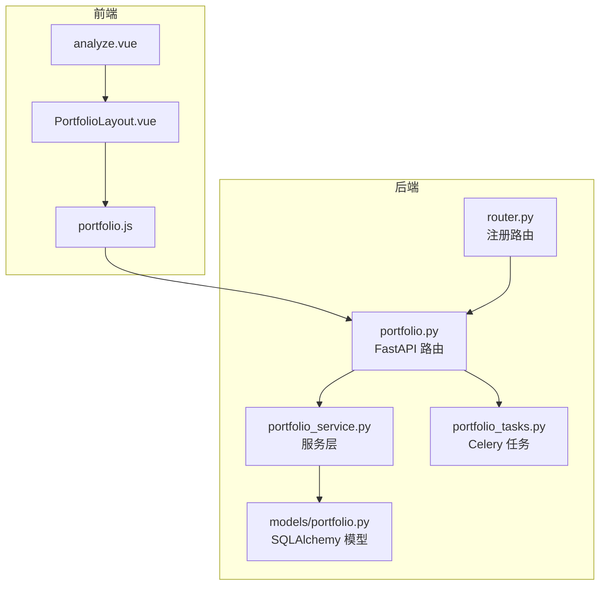
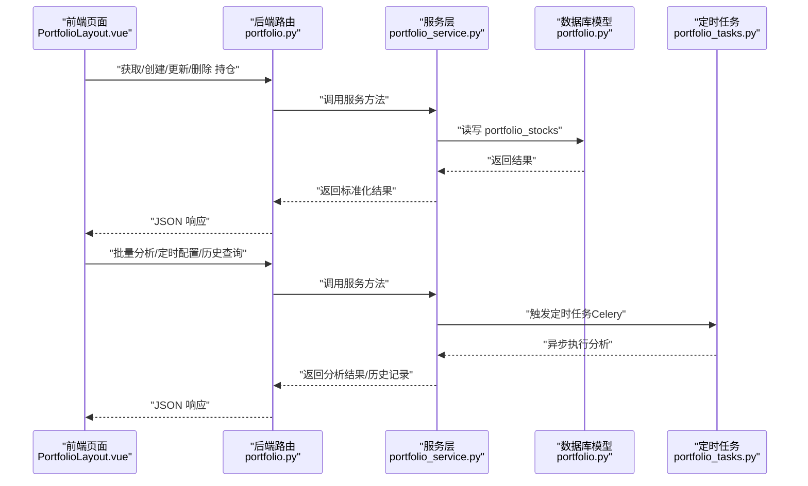
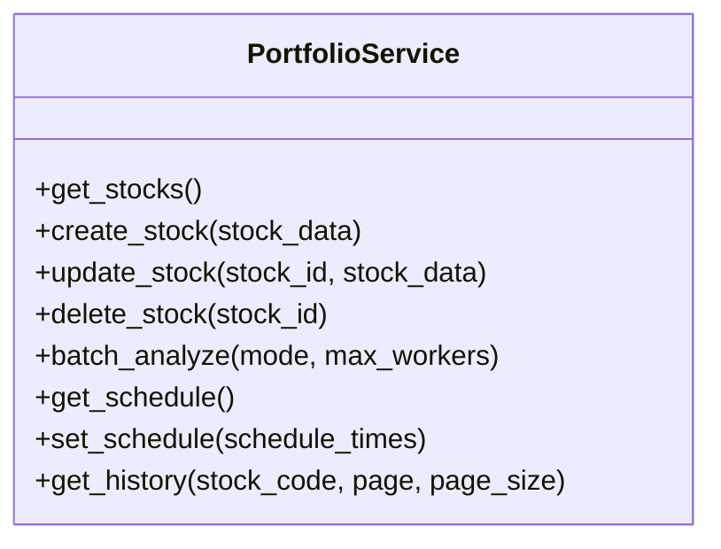
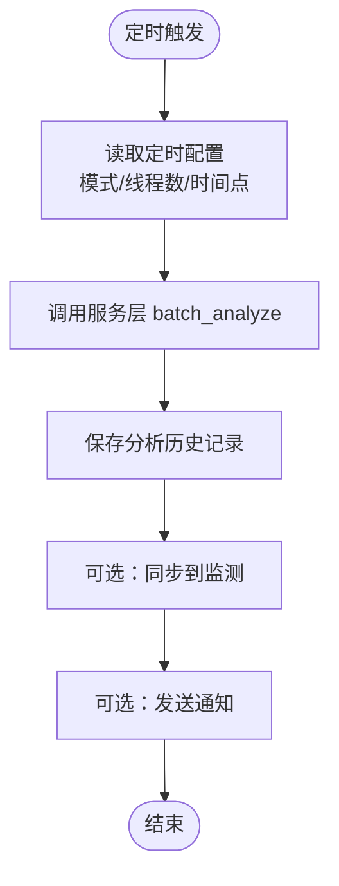
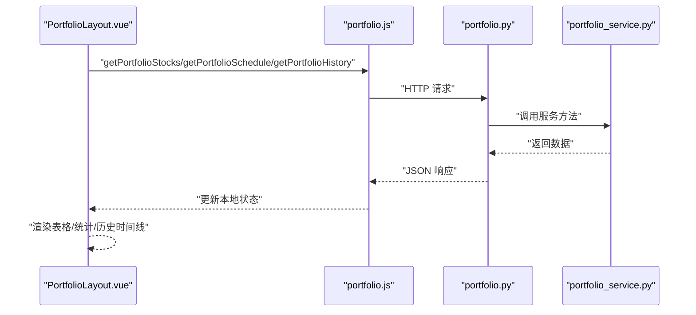
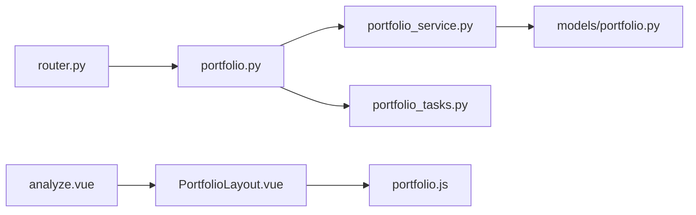

# 投资组合分析

<cite>
**本文引用的文件**
- [backend/app/tasks/portfolio_tasks.py](file://backend/app/tasks/portfolio_tasks.py)
- [backend/app/api/v1/portfolio.py](file://backend/app/api/v1/portfolio.py)
- [backend/app/services/portfolio_service.py](file://backend/app/services/portfolio_service.py)
- [backend/app/db/portfolio_db.py](file://backend/app/db/portfolio_db.py)
- [backend/app/models/portfolio.py](file://backend/app/models/portfolio.py)
- [backend/app/api/v1/router.py](file://backend/app/api/v1/router.py)
- [frontend/src/views/portfolio/analyze.vue](file://frontend/src/views/portfolio/analyze.vue)
- [frontend/src/views/portfolio/components/PortfolioLayout.vue](file://frontend/src/views/portfolio/components/PortfolioLayout.vue)
- [frontend/src/api/portfolio.js](file://frontend/src/api/portfolio.js)
- [docs/PORTFOLIO_USAGE.md](file://docs/PORTFOLIO_USAGE.md)
</cite>

## 目录
1. [简介](#简介)
2. [项目结构](#项目结构)
3. [核心组件](#核心组件)
4. [架构总览](#架构总览)
5. [详细组件分析](#详细组件分析)
6. [依赖关系分析](#依赖关系分析)
7. [性能考量](#性能考量)
8. [故障排查指南](#故障排查指南)
9. [结论](#结论)
10. [附录：API 接口文档](#附录api-接口文档)

## 简介
本技术文档围绕“投资组合分析”功能，系统阐述组合创建、资产配置、收益计算、风险评估等核心能力；说明系统如何聚合多个持仓股票的数据并生成整体表现报告；梳理定时分析任务（portfolio_tasks.py）的调度逻辑与执行流程；解释前端分析页面（analyze.vue）的图表展示逻辑与数据更新机制；提供通过 RESTful 接口管理组合与获取分析结果的 API 文档；最后讨论数据一致性保障与并发访问处理策略。

## 项目结构
后端采用 FastAPI + SQLAlchemy 架构，前端采用 Vue3 + Element Plus。投资组合分析功能位于 backend/app/api/v1/portfolio.py，服务层 portfolio_service.py，模型 portfolio.py，定时任务 portfolio_tasks.py；前端页面位于 frontend/src/views/portfolio/*，并通过 frontend/src/api/portfolio.js 调用后端接口。

**图示来源**
- [frontend/src/views/portfolio/analyze.vue](file://frontend/src/views/portfolio/analyze.vue#L1-L14)
- [frontend/src/views/portfolio/components/PortfolioLayout.vue](file://frontend/src/views/portfolio/components/PortfolioLayout.vue#L1-L120)
- [frontend/src/api/portfolio.js](file://frontend/src/api/portfolio.js#L1-L73)
- [backend/app/api/v1/portfolio.py](file://backend/app/api/v1/portfolio.py#L1-L123)
- [backend/app/services/portfolio_service.py](file://backend/app/services/portfolio_service.py#L1-L54)
- [backend/app/models/portfolio.py](file://backend/app/models/portfolio.py#L1-L22)
- [backend/app/tasks/portfolio_tasks.py](file://backend/app/tasks/portfolio_tasks.py#L1-L13)
- [backend/app/api/v1/router.py](file://backend/app/api/v1/router.py#L1-L36)

**章节来源**
- [backend/app/api/v1/router.py](file://backend/app/api/v1/router.py#L1-L36)
- [frontend/src/views/portfolio/analyze.vue](file://frontend/src/views/portfolio/analyze.vue#L1-L14)
- [frontend/src/views/portfolio/components/PortfolioLayout.vue](file://frontend/src/views/portfolio/components/PortfolioLayout.vue#L1-L120)
- [frontend/src/api/portfolio.js](file://frontend/src/api/portfolio.js#L1-L73)
- [backend/app/api/v1/portfolio.py](file://backend/app/api/v1/portfolio.py#L1-L123)
- [backend/app/services/portfolio_service.py](file://backend/app/services/portfolio_service.py#L1-L54)
- [backend/app/models/portfolio.py](file://backend/app/models/portfolio.py#L1-L22)
- [backend/app/tasks/portfolio_tasks.py](file://backend/app/tasks/portfolio_tasks.py#L1-L13)

## 核心组件
- 后端路由与控制器：提供获取/创建/更新/删除持仓、批量分析、定时配置、历史查询等接口。
- 服务层：封装业务逻辑，负责调用数据库与外部分析引擎，并返回标准化结果。
- 数据模型：定义 portfolio_stocks 表结构，承载持仓基本信息。
- 定时任务：Celery 任务入口，用于执行定时分析。
- 前端页面：PortfolioLayout.vue 负责展示持仓管理、批量分析、定时任务、历史记录四大面板，并通过 portfolio.js 统一调用后端接口。

**章节来源**
- [backend/app/api/v1/portfolio.py](file://backend/app/api/v1/portfolio.py#L1-L123)
- [backend/app/services/portfolio_service.py](file://backend/app/services/portfolio_service.py#L1-L54)
- [backend/app/models/portfolio.py](file://backend/app/models/portfolio.py#L1-L22)
- [backend/app/tasks/portfolio_tasks.py](file://backend/app/tasks/portfolio_tasks.py#L1-L13)
- [frontend/src/views/portfolio/components/PortfolioLayout.vue](file://frontend/src/views/portfolio/components/PortfolioLayout.vue#L1-L120)
- [frontend/src/api/portfolio.js](file://frontend/src/api/portfolio.js#L1-L73)

## 架构总览
后端通过 FastAPI 路由注册 portfolio 模块，服务层 PortfolioService 封装数据库与分析逻辑，前端通过 portfolio.js 发起请求，PortfolioLayout.vue 负责渲染与交互。定时分析任务通过 Celery 触发，服务层负责协调分析与历史记录持久化。

**图示来源**
- [frontend/src/views/portfolio/components/PortfolioLayout.vue](file://frontend/src/views/portfolio/components/PortfolioLayout.vue#L1-L120)
- [frontend/src/api/portfolio.js](file://frontend/src/api/portfolio.js#L1-L73)
- [backend/app/api/v1/portfolio.py](file://backend/app/api/v1/portfolio.py#L1-L123)
- [backend/app/services/portfolio_service.py](file://backend/app/services/portfolio_service.py#L1-L54)
- [backend/app/models/portfolio.py](file://backend/app/models/portfolio.py#L1-L22)
- [backend/app/tasks/portfolio_tasks.py](file://backend/app/tasks/portfolio_tasks.py#L1-L13)

## 详细组件分析

### 后端路由与控制器（portfolio.py）
- 提供以下接口：
  - GET /portfolio/stocks：获取持仓列表
  - POST /portfolio/stocks：添加持仓
  - PUT /portfolio/stocks/{stock_id}：更新持仓
  - DELETE /portfolio/stocks/{stock_id}：删除持仓
  - POST /portfolio/batch-analyze：批量分析（支持顺序/并行模式与线程数）
  - GET /portfolio/schedule：获取定时配置
  - POST /portfolio/schedule：设置定时配置（时间点、模式、线程数、自动同步、通知）
  - GET /portfolio/history：查询分析历史（支持股票筛选、分页）

- 控制器职责：
  - 依赖注入数据库 Session
  - 调用 PortfolioService 执行业务逻辑
  - 返回 success_response 包裹的成功/失败响应
  - 异常捕获并转换为 HTTP 500

**章节来源**
- [backend/app/api/v1/portfolio.py](file://backend/app/api/v1/portfolio.py#L1-L123)
- [backend/app/api/v1/router.py](file://backend/app/api/v1/router.py#L1-L36)

### 服务层（portfolio_service.py）
- PortfolioService 类封装：
  - get_stocks/update_stock/delete_stock/create_stock：对 portfolio_stocks 的 CRUD
  - batch_analyze(mode, max_workers)：批量分析入口（顺序/并行）
  - get_schedule/set_schedule：定时配置读写
  - get_history(stock_code, page, page_size)：历史记录查询
- 当前实现均为 TODO 占位，实际逻辑待完善

**图示来源**
- [backend/app/services/portfolio_service.py](file://backend/app/services/portfolio_service.py#L1-L54)

**章节来源**
- [backend/app/services/portfolio_service.py](file://backend/app/services/portfolio_service.py#L1-L54)

### 数据模型（models/portfolio.py）
- 定义 portfolio_stocks 表：
  - 字段：id、stock_code、stock_name、cost_price、quantity、notes、created_at、updated_at
  - 索引：stock_code
- 为后续收益计算与风险评估提供基础数据支撑

**章节来源**
- [backend/app/models/portfolio.py](file://backend/app/models/portfolio.py#L1-L22)

### 定时任务（tasks/portfolio_tasks.py）
- 当前实现为占位，标注 TODO：实现持仓分析任务逻辑
- 任务入口使用 Celery 应用装饰器注册
- 与服务层 batch_analyze 对接，支持顺序/并行模式与线程数

**图示来源**
- [backend/app/tasks/portfolio_tasks.py](file://backend/app/tasks/portfolio_tasks.py#L1-L13)
- [backend/app/services/portfolio_service.py](file://backend/app/services/portfolio_service.py#L1-L54)

**章节来源**
- [backend/app/tasks/portfolio_tasks.py](file://backend/app/tasks/portfolio_tasks.py#L1-L13)
- [backend/app/services/portfolio_service.py](file://backend/app/services/portfolio_service.py#L1-L54)

### 前端分析页面（views/portfolio/analyze.vue 与 components/PortfolioLayout.vue）
- analyze.vue 作为入口，嵌套 PortfolioLayout.vue
- PortfolioLayout.vue 提供四大面板：
  - 持仓管理：列表、统计卡片、增删改、自动监测开关
  - 批量分析：模式选择（顺序/并行）、线程数、自动同步、通知、结果概览与详情
  - 定时任务：时间点列表、配置保存、刷新状态
  - 历史记录：搜索、分页、时间线展示
- 数据来源：
  - 通过 portfolio.js 调用后端接口
  - 若接口不可用，使用内置演示数据（FALLBACK_*）进行展示
- 交互逻辑：
  - Tab 切换与路由同步
  - 加载状态、骨架屏、空状态提示
  - 成功/失败提示与错误降级

**图示来源**
- [frontend/src/views/portfolio/analyze.vue](file://frontend/src/views/portfolio/analyze.vue#L1-L14)
- [frontend/src/views/portfolio/components/PortfolioLayout.vue](file://frontend/src/views/portfolio/components/PortfolioLayout.vue#L1-L120)
- [frontend/src/api/portfolio.js](file://frontend/src/api/portfolio.js#L1-L73)
- [backend/app/api/v1/portfolio.py](file://backend/app/api/v1/portfolio.py#L1-L123)
- [backend/app/services/portfolio_service.py](file://backend/app/services/portfolio_service.py#L1-L54)

**章节来源**
- [frontend/src/views/portfolio/analyze.vue](file://frontend/src/views/portfolio/analyze.vue#L1-L14)
- [frontend/src/views/portfolio/components/PortfolioLayout.vue](file://frontend/src/views/portfolio/components/PortfolioLayout.vue#L1-L120)
- [frontend/src/api/portfolio.js](file://frontend/src/api/portfolio.js#L1-L73)
- [backend/app/api/v1/portfolio.py](file://backend/app/api/v1/portfolio.py#L1-L123)

## 依赖关系分析
- 路由注册：router.py 将 portfolio 路由挂载到 /portfolio 前缀
- 控制器依赖：portfolio.py 依赖数据库 Session 与 PortfolioService
- 服务层依赖：portfolio_service.py 依赖数据库 Session（当前为占位）
- 前端依赖：PortfolioLayout.vue 依赖 portfolio.js；analyze.vue 作为入口组件
- 定时任务：portfolio_tasks.py 依赖 Celery 应用

**图示来源**
- [backend/app/api/v1/router.py](file://backend/app/api/v1/router.py#L1-L36)
- [backend/app/api/v1/portfolio.py](file://backend/app/api/v1/portfolio.py#L1-L123)
- [backend/app/services/portfolio_service.py](file://backend/app/services/portfolio_service.py#L1-L54)
- [backend/app/models/portfolio.py](file://backend/app/models/portfolio.py#L1-L22)
- [backend/app/tasks/portfolio_tasks.py](file://backend/app/tasks/portfolio_tasks.py#L1-L13)
- [frontend/src/views/portfolio/analyze.vue](file://frontend/src/views/portfolio/analyze.vue#L1-L14)
- [frontend/src/views/portfolio/components/PortfolioLayout.vue](file://frontend/src/views/portfolio/components/PortfolioLayout.vue#L1-L120)
- [frontend/src/api/portfolio.js](file://frontend/src/api/portfolio.js#L1-L73)

**章节来源**
- [backend/app/api/v1/router.py](file://backend/app/api/v1/router.py#L1-L36)
- [backend/app/api/v1/portfolio.py](file://backend/app/api/v1/portfolio.py#L1-L123)
- [frontend/src/views/portfolio/analyze.vue](file://frontend/src/views/portfolio/analyze.vue#L1-L14)
- [frontend/src/views/portfolio/components/PortfolioLayout.vue](file://frontend/src/views/portfolio/components/PortfolioLayout.vue#L1-L120)
- [frontend/src/api/portfolio.js](file://frontend/src/api/portfolio.js#L1-L73)

## 性能考量
- 批量分析性能参考（来自使用指南）：
  - 顺序分析 vs 并行分析（2-10 线程），随持仓数量增加而线性增长
  - 资源消耗：基础内存 + 每线程约 10MB；CPU 单线程<5%，多线程<20%
  - 网络：每只股票约 2-5MB 数据传输；数据库每条历史记录约 1-2KB
- 并发与线程：
  - 前端支持顺序/并行两种模式与线程数配置
  - 服务层 batch_analyze 待实现，建议在服务层内控制最大并发，避免资源争用
- I/O 与缓存：
  - 建议对分析结果进行缓存与去重，减少重复请求
  - 历史查询分页与关键词过滤，降低前端渲染压力

**章节来源**
- [docs/PORTFOLIO_USAGE.md](file://docs/PORTFOLIO_USAGE.md#L293-L332)

## 故障排查指南
- 接口不可用降级：
  - 前端 PortfolioLayout.vue 在加载持仓/批量分析/历史时若接口失败，会回退到演示数据并提示
- 监测同步不生效：
  - 检查“自动监测”开关、分析是否成功、结果是否包含进场区间与止盈止损
- 定时任务未触发：
  - 确认定时配置已保存、Celery 任务已注册、调度器运行状态
- 数据一致性：
  - 建议在服务层使用数据库事务包裹关键写入（如批量分析与历史记录），并在异常时回滚
- 并发访问：
  - 对同一股票的并发写入建议加锁或使用乐观锁；对读多写少场景可考虑缓存热点数据

**章节来源**
- [frontend/src/views/portfolio/components/PortfolioLayout.vue](file://frontend/src/views/portfolio/components/PortfolioLayout.vue#L740-L820)
- [docs/PORTFOLIO_USAGE.md](file://docs/PORTFOLIO_USAGE.md#L275-L291)

## 结论
当前投资组合分析功能已完成前后端页面与路由对接，定时任务入口已就绪，服务层与数据库层仍处于占位阶段。建议优先完善服务层业务逻辑（批量分析、定时配置、历史记录），并补齐数据库模型与迁移脚本，随后完善 Celery 定时任务与并发控制策略，最终形成完整的“组合创建—资产配置—收益计算—风险评估—整体报告”的闭环。

## 附录：API 接口文档

- 获取持仓列表
  - 方法：GET
  - 路径：/api/v1/portfolio/stocks
  - 参数：无
  - 返回：success_response 包裹的列表
  - 示例路径：[backend/app/api/v1/portfolio.py](file://backend/app/api/v1/portfolio.py#L14-L23)

- 添加持仓
  - 方法：POST
  - 路径：/api/v1/portfolio/stocks
  - 请求体：字典（stock_code、stock_name、cost_price、quantity、notes、auto_monitor 等）
  - 返回：success_response，消息“持仓创建成功”
  - 示例路径：[backend/app/api/v1/portfolio.py](file://backend/app/api/v1/portfolio.py#L25-L37)

- 更新持仓
  - 方法：PUT
  - 路径：/api/v1/portfolio/stocks/{stock_id}
  - 路径参数：stock_id（整数）
  - 请求体：字典（同上）
  - 返回：success_response，消息“持仓更新成功”
  - 示例路径：[backend/app/api/v1/portfolio.py](file://backend/app/api/v1/portfolio.py#L39-L52)

- 删除持仓
  - 方法：DELETE
  - 路径：/api/v1/portfolio/stocks/{stock_id}
  - 路径参数：stock_id（整数）
  - 返回：success_response，消息“持仓删除成功”
  - 示例路径：[backend/app/api/v1/portfolio.py](file://backend/app/api/v1/portfolio.py#L54-L66)

- 批量分析
  - 方法：POST
  - 路径：/api/v1/portfolio/batch-analyze
  - 请求体参数：
    - mode：字符串，“sequential” 或 “parallel”
    - max_workers：整数，默认 3
  - 返回：success_response（包含 total/succeeded/failed/elapsed_time/results 等）
  - 示例路径：[backend/app/api/v1/portfolio.py](file://backend/app/api/v1/portfolio.py#L68-L81)

- 获取定时配置
  - 方法：GET
  - 路径：/api/v1/portfolio/schedule
  - 返回：success_response（包含 times、analysis_mode、max_workers、auto_sync、send_notification 等）
  - 示例路径：[backend/app/api/v1/portfolio.py](file://backend/app/api/v1/portfolio.py#L83-L92)

- 设置定时配置
  - 方法：POST
  - 路径：/api/v1/portfolio/schedule
  - 请求体参数：schedule_times（字符串数组，如 ["HH:MM"]）
  - 返回：success_response，消息“定时配置已更新”
  - 示例路径：[backend/app/api/v1/portfolio.py](file://backend/app/api/v1/portfolio.py#L94-L106)

- 分析历史
  - 方法：GET
  - 路径：/api/v1/portfolio/history
  - 查询参数：
    - stock_code：字符串（可选）
    - page：整数，默认 1
    - page_size：整数，默认 20
  - 返回：success_response（包含分页与历史记录列表）
  - 示例路径：[backend/app/api/v1/portfolio.py](file://backend/app/api/v1/portfolio.py#L108-L122)

- 前端调用封装
  - portfolio.js 提供 getPortfolioStocks、createPortfolioStock、updatePortfolioStock、deletePortfolioStock、batchAnalyzePortfolio、getPortfolioSchedule、setPortfolioSchedule、getPortfolioHistory 等方法
  - 示例路径：[frontend/src/api/portfolio.js](file://frontend/src/api/portfolio.js#L1-L73)

- 路由注册
  - router.py 将 portfolio 路由挂载至 /portfolio 前缀
  - 示例路径：[backend/app/api/v1/router.py](file://backend/app/api/v1/router.py#L1-L36)