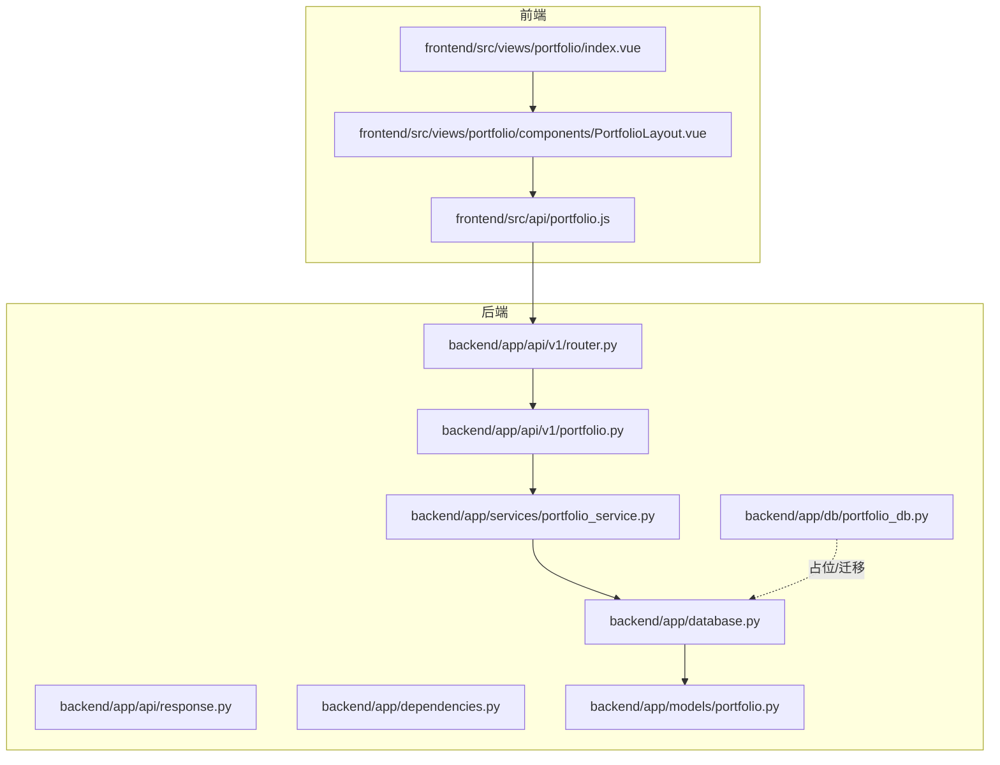
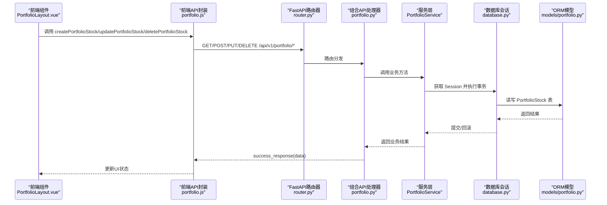
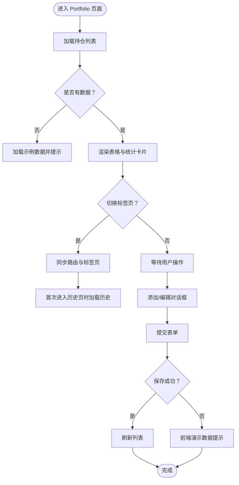
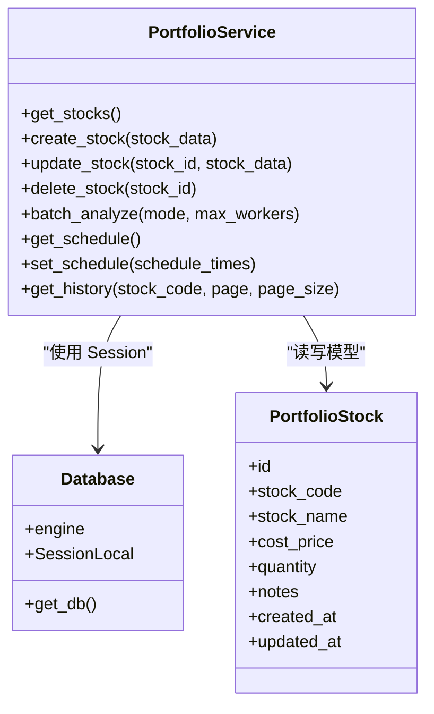
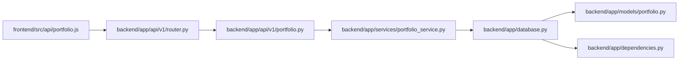

# 投资组合创建与管理

<cite>
**本文引用的文件**
- [backend/app/api/v1/portfolio.py](file://backend/app/api/v1/portfolio.py)
- [backend/app/api/v1/router.py](file://backend/app/api/v1/router.py)
- [backend/app/api/response.py](file://backend/app/api/response.py)
- [backend/app/dependencies.py](file://backend/app/dependencies.py)
- [backend/app/database.py](file://backend/app/database.py)
- [backend/app/models/portfolio.py](file://backend/app/models/portfolio.py)
- [backend/app/services/portfolio_service.py](file://backend/app/services/portfolio_service.py)
- [backend/app/db/portfolio_db.py](file://backend/app/db/portfolio_db.py)
- [frontend/src/views/portfolio/index.vue](file://frontend/src/views/portfolio/index.vue)
- [frontend/src/views/portfolio/components/PortfolioLayout.vue](file://frontend/src/views/portfolio/components/PortfolioLayout.vue)
- [frontend/src/api/portfolio.js](file://frontend/src/api/portfolio.js)
- [docs/PORTFOLIO_USAGE.md](file://docs/PORTFOLIO_USAGE.md)
- [docs/前后端拆分规划文档.md](file://docs/前后端拆分规划文档.md)
</cite>

## 目录
1. [简介](#简介)
2. [项目结构](#项目结构)
3. [核心组件](#核心组件)
4. [架构总览](#架构总览)
5. [详细组件分析](#详细组件分析)
6. [依赖关系分析](#依赖关系分析)
7. [性能考虑](#性能考虑)
8. [故障排查指南](#故障排查指南)
9. [结论](#结论)
10. [附录：RESTful API 接口规范](#附录restful-api-接口规范)

## 简介
本技术文档聚焦“投资组合创建与管理”功能，覆盖前端界面交互与状态管理、后端服务层的数据持久化与一致性校验、以及完整的 RESTful API 规范。内容包括：
- 前端组合管理界面（index.vue 与 PortfolioLayout.vue）的交互逻辑与状态管理机制
- 后端通过 portfolio_service.py 处理组合数据的持久化存储与一致性校验
- 提供 POST /api/v1/portfolio/stocks 创建组合、PUT /api/v1/portfolio/stocks/{id} 更新组合、DELETE /api/v1/portfolio/stocks/{id} 删除组合等端点的请求参数、响应格式与错误码
- 结合代码示例说明服务层如何调用数据库模型进行事务处理，并讨论并发场景下的数据锁定策略与异常回滚机制

## 项目结构
围绕“投资组合”功能，前后端的关键文件分布如下：
- 前端
  - 视图入口：frontend/src/views/portfolio/index.vue
  - 布局与交互：frontend/src/views/portfolio/components/PortfolioLayout.vue
  - API 封装：frontend/src/api/portfolio.js
- 后端
  - 路由注册：backend/app/api/v1/router.py
  - 组合 API：backend/app/api/v1/portfolio.py
  - 统一响应：backend/app/api/response.py
  - 依赖注入：backend/app/dependencies.py
  - 数据库连接：backend/app/database.py
  - ORM 模型：backend/app/models/portfolio.py
  - 服务层：backend/app/services/portfolio_service.py
  - 数据库适配层（占位）：backend/app/db/portfolio_db.py
- 文档
  - 使用指南：docs/PORTFOLIO_USAGE.md
  - 前后端拆分规划（含表结构）：docs/前后端拆分规划文档.md

图表来源
- [backend/app/api/v1/router.py](file://backend/app/api/v1/router.py#L1-L36)
- [backend/app/api/v1/portfolio.py](file://backend/app/api/v1/portfolio.py#L1-L123)
- [backend/app/api/response.py](file://backend/app/api/response.py#L1-L31)
- [backend/app/dependencies.py](file://backend/app/dependencies.py#L1-L15)
- [backend/app/database.py](file://backend/app/database.py#L1-L45)
- [backend/app/models/portfolio.py](file://backend/app/models/portfolio.py#L1-L22)
- [backend/app/services/portfolio_service.py](file://backend/app/services/portfolio_service.py#L1-L54)
- [backend/app/db/portfolio_db.py](file://backend/app/db/portfolio_db.py#L1-L6)
- [frontend/src/views/portfolio/index.vue](file://frontend/src/views/portfolio/index.vue#L1-L14)
- [frontend/src/views/portfolio/components/PortfolioLayout.vue](file://frontend/src/views/portfolio/components/PortfolioLayout.vue#L1-L120)
- [frontend/src/api/portfolio.js](file://frontend/src/api/portfolio.js#L1-L73)

章节来源
- [backend/app/api/v1/router.py](file://backend/app/api/v1/router.py#L1-L36)
- [backend/app/api/v1/portfolio.py](file://backend/app/api/v1/portfolio.py#L1-L123)
- [frontend/src/views/portfolio/index.vue](file://frontend/src/views/portfolio/index.vue#L1-L14)
- [frontend/src/views/portfolio/components/PortfolioLayout.vue](file://frontend/src/views/portfolio/components/PortfolioLayout.vue#L1-L120)
- [frontend/src/api/portfolio.js](file://frontend/src/api/portfolio.js#L1-L73)

## 核心组件
- 前端视图与交互
  - index.vue 作为组合页面入口，承载 PortfolioLayout.vue 布局组件，负责切换标签页、加载示例数据与调用 API。
  - PortfolioLayout.vue 负责：展示持仓列表、添加/编辑/删除对话框、批量分析、定时任务配置、历史记录等。
  - API 封装 portfolio.js 提供统一的 HTTP 请求方法，映射到后端 /api/v1/portfolio/* 路径。
- 后端路由与服务
  - 路由汇总 router.py 将 /portfolio 前缀挂载至 portfolio.py。
  - portfolio.py 定义 /stocks、/batch-analyze、/schedule、/history 等端点，统一返回 success_response。
  - services/portfolio_service.py 作为服务层，目前为占位实现，后续将对接数据库模型与事务处理。
  - models/portfolio.py 定义 ORM 模型 PortfolioStock，描述组合股票的字段与索引。
  - database.py 提供数据库引擎与会话工厂；dependencies.py 提供 get_database 依赖注入。
  - db/portfolio_db.py 为迁移占位文件，原项目 portfolio_db.py 已实现 SQLite 持久化逻辑。

章节来源
- [frontend/src/views/portfolio/index.vue](file://frontend/src/views/portfolio/index.vue#L1-L14)
- [frontend/src/views/portfolio/components/PortfolioLayout.vue](file://frontend/src/views/portfolio/components/PortfolioLayout.vue#L1-L120)
- [frontend/src/api/portfolio.js](file://frontend/src/api/portfolio.js#L1-L73)
- [backend/app/api/v1/router.py](file://backend/app/api/v1/router.py#L1-L36)
- [backend/app/api/v1/portfolio.py](file://backend/app/api/v1/portfolio.py#L1-L123)
- [backend/app/api/response.py](file://backend/app/api/response.py#L1-L31)
- [backend/app/dependencies.py](file://backend/app/dependencies.py#L1-L15)
- [backend/app/database.py](file://backend/app/database.py#L1-L45)
- [backend/app/models/portfolio.py](file://backend/app/models/portfolio.py#L1-L22)
- [backend/app/services/portfolio_service.py](file://backend/app/services/portfolio_service.py#L1-L54)
- [backend/app/db/portfolio_db.py](file://backend/app/db/portfolio_db.py#L1-L6)

## 架构总览
从前端到后端的数据流与职责划分如下：
- 前端通过 portfolio.js 发起 HTTP 请求，路由到 /api/v1/portfolio/*。
- FastAPI 路由器将请求交由 portfolio.py 处理，构造 PortfolioService 实例。
- 服务层 PortfolioService 负责业务逻辑与数据一致性校验，随后通过数据库会话与 ORM 模型进行读写。
- database.py 提供会话生命周期管理，dependencies.py 以依赖注入方式提供 Session。
- 返回统一 success_response 包裹数据，错误通过 HTTPException 抛出。

图表来源
- [frontend/src/views/portfolio/components/PortfolioLayout.vue](file://frontend/src/views/portfolio/components/PortfolioLayout.vue#L770-L857)
- [frontend/src/api/portfolio.js](file://frontend/src/api/portfolio.js#L1-L73)
- [backend/app/api/v1/router.py](file://backend/app/api/v1/router.py#L1-L36)
- [backend/app/api/v1/portfolio.py](file://backend/app/api/v1/portfolio.py#L1-L123)
- [backend/app/services/portfolio_service.py](file://backend/app/services/portfolio_service.py#L1-L54)
- [backend/app/database.py](file://backend/app/database.py#L1-L45)
- [backend/app/models/portfolio.py](file://backend/app/models/portfolio.py#L1-L22)

## 详细组件分析

### 前端：Portfolio 管理界面与状态管理
- 页面入口
  - index.vue 仅引入 PortfolioLayout.vue 并设置默认标签页为“持仓管理”，便于统一导航。
- 布局与交互
  - PortfolioLayout.vue 提供四大标签页：
    - 持仓管理：展示统计卡片、表格、操作按钮（编辑、删除），支持添加/编辑对话框。
    - 批量分析：配置分析模式、并行线程、自动同步与通知开关，发起批量分析请求。
    - 定时任务：维护每日分析时间列表与分析配置，支持保存与刷新。
    - 分析历史：分页查询历史记录，支持关键词筛选与分页。
  - 状态管理要点：
    - 数据加载：loadStocks/loadSchedule/loadHistory 控制 loading 状态与 fallback 示例数据。
    - 表单校验：基于 Element UI 表单规则，提交前校验必填项。
    - 对话框：打开/关闭时重置表单，区分新建与编辑两种模式。
    - 错误兜底：当后端接口不可用时，降级为前端演示数据并提示。
- API 调用
  - portfolio.js 将前端方法映射到 /api/v1/portfolio/*，包括：
    - 获取/创建/更新/删除 持仓股票
    - 批量分析
    - 获取/设置 定时配置
    - 获取历史记录

图表来源
- [frontend/src/views/portfolio/components/PortfolioLayout.vue](file://frontend/src/views/portfolio/components/PortfolioLayout.vue#L744-L857)
- [frontend/src/api/portfolio.js](file://frontend/src/api/portfolio.js#L1-L73)

章节来源
- [frontend/src/views/portfolio/index.vue](file://frontend/src/views/portfolio/index.vue#L1-L14)
- [frontend/src/views/portfolio/components/PortfolioLayout.vue](file://frontend/src/views/portfolio/components/PortfolioLayout.vue#L1-L404)
- [frontend/src/api/portfolio.js](file://frontend/src/api/portfolio.js#L1-L73)

### 后端：API 路由与服务层
- 路由注册
  - router.py 将 /portfolio 前缀挂载 portfolio.py，统一标签为“持仓分析”。
- 组合 API
  - /stocks：GET 获取列表、POST 创建、PUT 更新、DELETE 删除
  - /batch-analyze：POST 批量分析
  - /schedule：GET 获取定时配置、POST 设置定时配置
  - /history：GET 获取历史记录
- 统一响应
  - success_response/error_response 提供统一的响应结构，便于前端解析。
- 依赖注入
  - get_database 以生成器方式提供 Session，确保每个请求独立会话并在结束时关闭。
- 服务层
  - PortfolioService 目前为占位实现，后续将实现 get_stocks/create_stock/update_stock/delete_stock/batch_analyze/get_schedule/set_schedule/get_history 等方法，并在其中进行数据校验与事务处理。
- ORM 模型
  - PortfolioStock 定义组合股票字段（股票代码、名称、成本价、数量、备注、创建/更新时间等），并具备索引与注释，便于查询与维护。
- 数据库适配层
  - portfolio_db.py 为迁移占位；原项目 portfolio_db.py 提供 SQLite 持久化能力，包含 add_stock/update_stock/delete_stock 等 CRUD 与事务回滚逻辑。

图表来源
- [backend/app/services/portfolio_service.py](file://backend/app/services/portfolio_service.py#L1-L54)
- [backend/app/models/portfolio.py](file://backend/app/models/portfolio.py#L1-L22)
- [backend/app/database.py](file://backend/app/database.py#L1-L45)

章节来源
- [backend/app/api/v1/router.py](file://backend/app/api/v1/router.py#L1-L36)
- [backend/app/api/v1/portfolio.py](file://backend/app/api/v1/portfolio.py#L1-L123)
- [backend/app/api/response.py](file://backend/app/api/response.py#L1-L31)
- [backend/app/dependencies.py](file://backend/app/dependencies.py#L1-L15)
- [backend/app/models/portfolio.py](file://backend/app/models/portfolio.py#L1-L22)
- [backend/app/services/portfolio_service.py](file://backend/app/services/portfolio_service.py#L1-L54)
- [backend/app/db/portfolio_db.py](file://backend/app/db/portfolio_db.py#L1-L6)

### 数据库模型与表结构
- 模型定义
  - PortfolioStock：包含主键 id、股票代码 stock_code（索引）、股票名称 stock_name、成本价 cost_price、数量 quantity、备注 notes、创建时间 created_at、更新时间 updated_at。
- 历史表（参考文档）
  - 文档中给出 portfolio_stocks 与 scheduled_tasks 等表结构，用于支撑定时任务与历史记录的持久化。

章节来源
- [backend/app/models/portfolio.py](file://backend/app/models/portfolio.py#L1-L22)
- [docs/前后端拆分规划文档.md](file://docs/前后端拆分规划文档.md#L740-L774)

### 服务层事务处理与并发控制
- 事务与回滚
  - 建议在 PortfolioService 中使用 SQLAlchemy 事务：begin/commit/rollback，确保多步写入的一致性。
  - 异常捕获后统一抛出 HTTPException，由上层统一响应。
- 并发与锁
  - 对于高并发场景，建议：
    - 使用数据库行级锁（SELECT ... FOR UPDATE）保护关键写入路径
    - 对同一股票代码的唯一性约束（唯一索引/唯一约束）防止重复插入
    - 采用幂等设计（如按 stock_code 去重、更新而非重复创建）
- 原项目 SQLite 实践
  - 原 portfolio_db.py 展示了典型的 CRUD + rollback 模式，可作为迁移与实现参考。

章节来源
- [backend/app/services/portfolio_service.py](file://backend/app/services/portfolio_service.py#L1-L54)
- [backend/app/database.py](file://backend/app/database.py#L1-L45)
- [docs/PORTFOLIO_USAGE.md](file://docs/PORTFOLIO_USAGE.md#L1-L399)

## 依赖关系分析
- 前端到后端
  - PortfolioLayout.vue 通过 portfolio.js 调用 /api/v1/portfolio/*，路由由 router.py 注册，处理器在 portfolio.py 中实现。
- 后端内部
  - portfolio.py 依赖 get_database 提供 Session，构造 PortfolioService，再由服务层与 ORM 模型交互。
  - database.py 提供 engine 与 SessionLocal，dependencies.py 以 get_db 生成器提供 Session 生命周期。

图表来源
- [frontend/src/api/portfolio.js](file://frontend/src/api/portfolio.js#L1-L73)
- [backend/app/api/v1/router.py](file://backend/app/api/v1/router.py#L1-L36)
- [backend/app/api/v1/portfolio.py](file://backend/app/api/v1/portfolio.py#L1-L123)
- [backend/app/services/portfolio_service.py](file://backend/app/services/portfolio_service.py#L1-L54)
- [backend/app/database.py](file://backend/app/database.py#L1-L45)
- [backend/app/dependencies.py](file://backend/app/dependencies.py#L1-L15)
- [backend/app/models/portfolio.py](file://backend/app/models/portfolio.py#L1-L22)

章节来源
- [frontend/src/api/portfolio.js](file://frontend/src/api/portfolio.js#L1-L73)
- [backend/app/api/v1/router.py](file://backend/app/api/v1/router.py#L1-L36)
- [backend/app/api/v1/portfolio.py](file://backend/app/api/v1/portfolio.py#L1-L123)
- [backend/app/services/portfolio_service.py](file://backend/app/services/portfolio_service.py#L1-L54)
- [backend/app/database.py](file://backend/app/database.py#L1-L45)
- [backend/app/dependencies.py](file://backend/app/dependencies.py#L1-L15)
- [backend/app/models/portfolio.py](file://backend/app/models/portfolio.py#L1-L22)

## 性能考虑
- 前端
  - 使用骨架屏与分页加载历史记录，减少首屏压力。
  - 批量分析时禁用按钮并显示 loading，避免重复提交。
- 后端
  - 使用异步服务层（PortfolioService）提升并发处理能力。
  - 对高频查询建立索引（stock_code 等），降低查询延迟。
  - 控制批量分析的并发度（max_workers），避免过度占用资源。
- 数据库
  - 使用连接池与会话生命周期管理，避免连接泄漏。
  - 对大结果集分页查询，限制 page_size。

[本节为通用指导，不直接分析具体文件]

## 故障排查指南
- 前端
  - 若接口不可用，页面会降级为示例数据并提示“持仓接口暂未接入”。检查后端是否启动、路由是否正确挂载。
  - 表单校验失败时，检查必填字段与格式（如股票代码）。
- 后端
  - 统一响应结构包含 code/message/data 字段，便于前端识别错误类型。
  - 异常通过 HTTPException 抛出，可在日志中定位具体错误。
- 数据库
  - 若出现“未找到股票/重复插入”等问题，检查 stock_code 唯一性约束与事务回滚逻辑。

章节来源
- [frontend/src/views/portfolio/components/PortfolioLayout.vue](file://frontend/src/views/portfolio/components/PortfolioLayout.vue#L770-L857)
- [backend/app/api/response.py](file://backend/app/api/response.py#L1-L31)
- [backend/app/api/v1/portfolio.py](file://backend/app/api/v1/portfolio.py#L1-L123)

## 结论
本项目在前后端分离架构下，通过清晰的路由与服务层职责划分，实现了投资组合的创建、编辑、删除与历史查询等核心功能。前端以 PortfolioLayout.vue 为中心，提供直观的交互与状态管理；后端以 FastAPI + SQLAlchemy 为基础，提供统一响应与依赖注入。服务层 PortfolioService 目前为占位实现，后续应完善事务处理、并发控制与一致性校验，并与 ORM 模型深度整合，以满足生产环境的可靠性与性能要求。

[本节为总结性内容，不直接分析具体文件]

## 附录：RESTful API 接口规范

- 统一响应结构
  - 成功响应：包含 code、message、data 字段
  - 错误响应：包含 code、message、data 字段
- 依赖注入
  - 通过 get_database 提供 Session，确保每个请求独立会话

接口定义
- 获取持仓列表
  - 方法：GET
  - 路径：/api/v1/portfolio/stocks
  - 请求参数：无
  - 响应：success_response(data: 列表)
  - 错误码：500
- 创建持仓
  - 方法：POST
  - 路径：/api/v1/portfolio/stocks
  - 请求体：stock_data（字典，字段参考 PortfolioStock 模型）
  - 响应：success_response(data: 新增记录)
  - 错误码：500
- 更新持仓
  - 方法：PUT
  - 路径：/api/v1/portfolio/stocks/{id}
  - 路径参数：id（整数）
  - 请求体：stock_data（字典，字段参考 PortfolioStock 模型）
  - 响应：success_response(data: 更新后的记录)
  - 错误码：500
- 删除持仓
  - 方法：DELETE
  - 路径：/api/v1/portfolio/stocks/{id}
  - 路径参数：id（整数）
  - 响应：success_response(data: 删除结果)
  - 错误码：500
- 批量分析
  - 方法：POST
  - 路径：/api/v1/portfolio/batch-analyze
  - 请求体：mode（字符串，sequential/parallel）、max_workers（整数）
  - 响应：success_response(data: 分析概要与结果列表)
  - 错误码：500
- 获取定时配置
  - 方法：GET
  - 路径：/api/v1/portfolio/schedule
  - 响应：success_response(data: 定时配置对象)
  - 错误码：500
- 设置定时配置
  - 方法：POST
  - 路径：/api/v1/portfolio/schedule
  - 请求体：schedule_times（字符串数组，时间格式 HH:mm）
  - 响应：success_response(data: 保存结果)
  - 错误码：500
- 获取历史记录
  - 方法：GET
  - 路径：/api/v1/portfolio/history
  - 查询参数：stock_code（可选）、page（整数，默认1）、page_size（整数，默认20）
  - 响应：success_response(data: 历史记录列表与分页信息)
  - 错误码：500

章节来源
- [backend/app/api/v1/portfolio.py](file://backend/app/api/v1/portfolio.py#L1-L123)
- [backend/app/api/response.py](file://backend/app/api/response.py#L1-L31)
- [backend/app/dependencies.py](file://backend/app/dependencies.py#L1-L15)
- [backend/app/models/portfolio.py](file://backend/app/models/portfolio.py#L1-L22)
- [frontend/src/api/portfolio.js](file://frontend/src/api/portfolio.js#L1-L73)