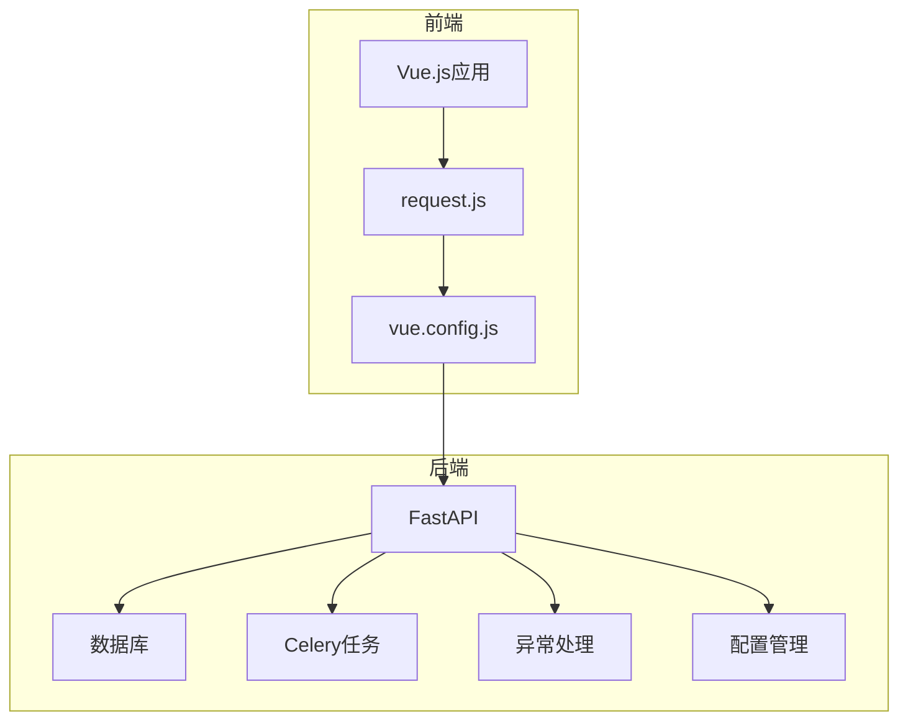
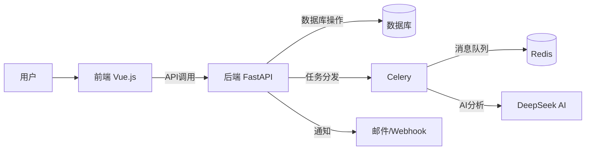
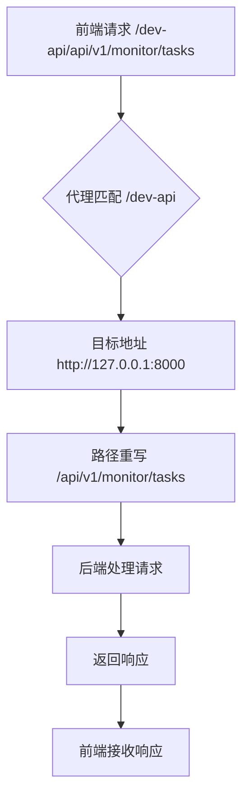
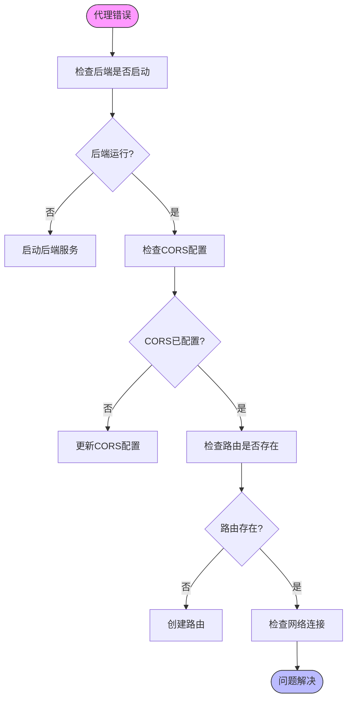
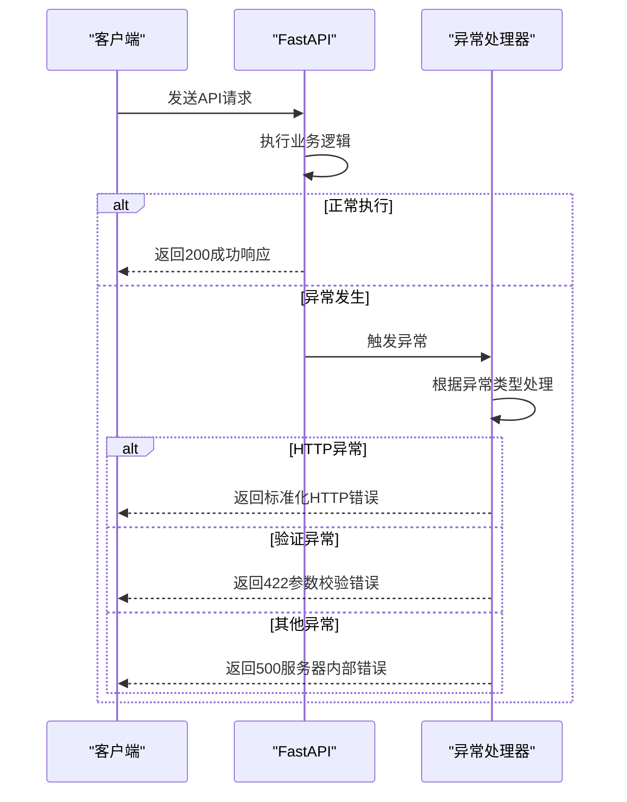
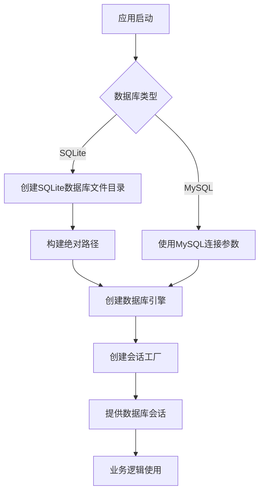
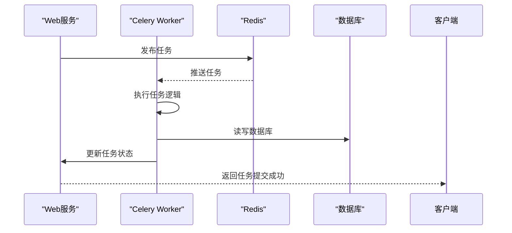
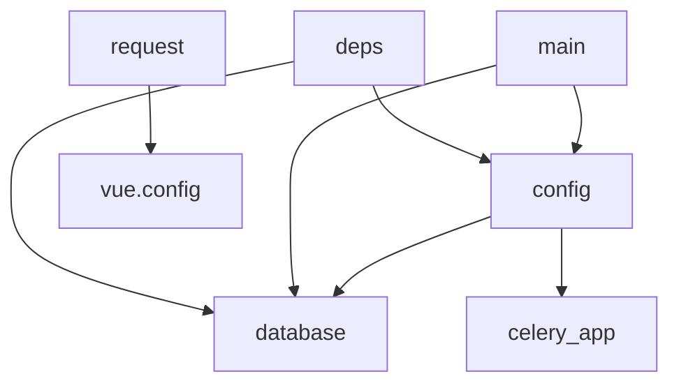

# 故障排除与常见问题

<cite>
**本文档引用的文件**
- [main.py](file://backend/app/main.py)
- [config.py](file://backend/app/config.py)
- [database.py](file://backend/app/database.py)
- [celery_app.py](file://backend/app/tasks/celery_app.py)
- [request.js](file://frontend/src/utils/request.js)
- [vue.config.js](file://frontend/vue.config.js)
- [requirements.txt](file://backend/requirements.txt)
- [前端代理问题排查指南.md](file://前端代理问题排查指南.md)
- [DOCKER_DEPLOYMENT.md](file://docs/DOCKER_DEPLOYMENT.md)
- [环境配置功能说明.md](file://docs/环境配置功能说明.md)
- [exceptions.py](file://backend/app/core/exceptions.py)
- [deps.py](file://backend/app/api/deps.py)
</cite>

## 目录
1. [简介](#简介)
2. [项目结构](#项目结构)
3. [核心组件](#核心组件)
4. [架构概述](#架构概述)
5. [详细组件分析](#详细组件分析)
6. [依赖分析](#依赖分析)
7. [性能考虑](#性能考虑)
8. [故障排除指南](#故障排除指南)
9. [结论](#结论)
10. [附录](#附录)（如有必要）

## 简介
本文档旨在为AI股票分析系统提供全面的故障排除与常见问题解决方案。系统采用前后端分离架构，前端基于Vue.js框架，后端采用FastAPI构建，通过Celery实现异步任务处理，使用Redis作为消息队列和缓存，SQLite/MySQL作为数据存储。系统集成了DeepSeek AI服务进行股票分析，支持多种数据源（Tushare、TDX等），并提供邮件和Webhook通知功能。文档将重点解决前端代理配置错误、API调用失败、数据库连接异常、AI服务超时、任务队列阻塞等典型问题。

## 项目结构
系统由前端、后端和第三方组件三大部分组成。后端采用模块化设计，包含API路由、数据库操作、服务逻辑、任务队列和核心工具等模块。前端采用Vue.js单页应用架构，通过Axios与后端API交互。系统通过Docker实现容器化部署，简化了环境配置和部署流程。



**图示来源**
- [vue.config.js](file://frontend/vue.config.js#L20-L64)
- [main.py](file://backend/app/main.py#L13-L31)

**本节来源**
- [vue.config.js](file://frontend/vue.config.js)
- [main.py](file://backend/app/main.py)

## 核心组件
系统核心组件包括：FastAPI后端服务、Vue.js前端应用、Celery异步任务队列、Redis消息代理、SQLite/MySQL数据库以及DeepSeek AI服务。这些组件协同工作，实现了股票数据分析、实时监测、智能选股和自动化交易等功能。系统通过统一的异常处理机制和配置管理系统，确保了稳定性和可维护性。

**本节来源**
- [main.py](file://backend/app/main.py)
- [config.py](file://backend/app/config.py)
- [database.py](file://backend/app/database.py)
- [celery_app.py](file://backend/app/tasks/celery_app.py)

## 架构概述
系统采用典型的微服务架构模式，前后端完全分离，通过RESTful API进行通信。后端服务提供数据访问和业务逻辑处理，前端负责用户界面展示和交互。异步任务通过Celery和Redis实现，确保了高并发场景下的系统响应性。配置管理采用环境变量和配置文件相结合的方式，支持灵活的环境切换。



**图示来源**
- [main.py](file://backend/app/main.py#L13-L31)
- [celery_app.py](file://backend/app/tasks/celery_app.py#L7-L11)
- [config.py](file://backend/app/config.py#L75-L78)

## 详细组件分析

### 前端代理配置分析
前端通过Vue CLI的devServer代理功能解决开发环境下的跨域问题。代理配置将`/dev-api`前缀的请求转发到后端服务，并移除前缀，实现无缝的API调用。

#### 代理配置流程


**图示来源**
- [vue.config.js](file://frontend/vue.config.js#L27-L33)
- [前端代理问题排查指南.md](file://前端代理问题排查指南.md#L38-L47)

#### 代理异常处理


**图示来源**
- [vue.config.js](file://frontend/vue.config.js#L50-L63)
- [前端代理问题排查指南.md](file://前端代理问题排查指南.md#L115-L137)

**本节来源**
- [vue.config.js](file://frontend/vue.config.js#L20-L64)
- [request.js](file://frontend/src/utils/request.js#L6-L11)
- [前端代理问题排查指南.md](file://前端代理问题排查指南.md)

### 后端服务分析
后端服务采用FastAPI框架，提供高性能的API接口。通过中间件实现CORS跨域支持，统一的异常处理机制确保了API响应的一致性。

#### API异常处理流程


**图示来源**
- [main.py](file://backend/app/main.py#L34-L72)
- [exceptions.py](file://backend/app/core/exceptions.py)

**本节来源**
- [main.py](file://backend/app/main.py#L34-L72)
- [exceptions.py](file://backend/app/core/exceptions.py)

### 数据库连接分析
系统支持SQLite和MySQL两种数据库，通过SQLAlchemy ORM实现数据库操作。配置灵活，可根据环境需求切换数据库类型。

#### 数据库连接流程


**图示来源**
- [database.py](file://backend/app/database.py#L14-L28)
- [config.py](file://backend/app/config.py#L28-L54)

**本节来源**
- [database.py](file://backend/app/database.py)
- [config.py](file://backend/app/config.py)

### 任务队列分析
系统使用Celery作为异步任务队列，Redis作为消息代理，实现了耗时操作的异步处理，如股票分析、数据抓取等。

#### 任务队列工作流程


**图示来源**
- [celery_app.py](file://backend/app/tasks/celery_app.py)
- [config.py](file://backend/app/config.py#L75-L78)

**本节来源**
- [celery_app.py](file://backend/app/tasks/celery_app.py)
- [config.py](file://backend/app/config.py)

## 依赖分析
系统依赖关系清晰，各组件耦合度低，便于维护和扩展。前端依赖Vue.js生态，后端依赖FastAPI生态，任务队列依赖Celery生态。



**图示来源**
- [config.py](file://backend/app/config.py)
- [database.py](file://backend/app/database.py)
- [celery_app.py](file://backend/app/tasks/celery_app.py)
- [main.py](file://backend/app/main.py)
- [deps.py](file://backend/app/api/deps.py)
- [request.js](file://frontend/src/utils/request.js)
- [vue.config.js](file://frontend/vue.config.js)

**本节来源**
- [requirements.txt](file://backend/requirements.txt)
- [package.json](file://frontend/package.json)

## 性能考虑
系统在设计时考虑了性能优化，包括数据库连接池、Redis缓存、异步任务处理等机制。建议生产环境使用MySQL替代SQLite，配置Redis启用，以获得更好的并发性能。对于AI服务调用，应合理设置超时时间，避免长时间阻塞。

## 故障排除指南
本节提供系统常见问题的详细排查步骤和解决方案，帮助技术支持团队快速响应和解决问题。

### 前端代理配置错误
#### 问题现象
前端无法通过代理访问后端API，浏览器控制台出现CORS错误或连接拒绝错误。

#### 排查步骤
1. **确认后端服务状态**
   ```bash
   # 检查端口8000是否监听
   netstat -an | findstr 8000
   # 或使用PowerShell
   Test-NetConnection 127.0.0.1 -Port 8000
   ```

2. **验证后端API可访问性**
   在浏览器中直接访问 `http://127.0.0.1:8000/health`，应返回健康检查结果。

3. **检查前端代理配置**
   确认 `frontend/vue.config.js` 中的代理配置正确：
   ```javascript
   proxy: {
     '/dev-api': {
       target: 'http://127.0.0.1:8000',
       changeOrigin: true,
       pathRewrite: { '^/dev-api': '' }
     }
   }
   ```

4. **查看代理日志**
   启动前端服务时，观察控制台输出的代理日志，确认请求是否被正确转发。

#### 常见解决方案
- **连接被拒绝**：启动后端服务 `.\start_server.bat`
- **CORS错误**：检查 `backend/app/config.py` 中的 `CORS_ORIGINS` 配置
- **404错误**：确认后端路由存在且已注册

**本节来源**
- [前端代理问题排查指南.md](file://前端代理问题排查指南.md)
- [vue.config.js](file://frontend/vue.config.js)
- [config.py](file://backend/app/config.py)

### API调用失败
#### 问题现象
API返回非200状态码，如422参数校验失败、500服务器内部错误等。

#### 排查步骤
1. **检查请求参数**
   使用Postman或curl测试API，确保请求参数格式正确。

2. **查看后端日志**
   检查后端控制台输出，定位具体错误信息。

3. **验证认证信息**
   确认请求头中包含有效的Authorization令牌。

#### 常见错误码及解决方案
| 错误码 | 错误类型 | 解决方案 |
|-------|---------|---------|
| 422 | 参数校验失败 | 检查请求体JSON格式和必填字段 |
| 401 | 认证失败 | 检查JWT令牌是否过期或无效 |
| 500 | 服务器内部错误 | 查看后端日志，定位异常堆栈 |

**本节来源**
- [main.py](file://backend/app/main.py#L48-L72)
- [deps.py](file://backend/app/api/deps.py)

### 数据库连接异常
#### 问题现象
应用启动时报错"unable to open database file"或数据库操作失败。

#### 排查步骤
1. **检查数据库配置**
   确认 `backend/app/config.py` 中的 `DATABASE_URL` 配置正确。

2. **验证数据库文件权限**
   对于SQLite，确保应用有权限创建和写入数据库文件目录。

3. **测试MySQL连接**
   使用数据库客户端测试MySQL连接参数是否正确。

#### 解决方案
- **SQLite路径问题**：确保路径存在且可写
- **MySQL连接失败**：检查主机、端口、用户名、密码是否正确
- **权限问题**：以管理员权限运行应用或修改文件权限

**本节来源**
- [database.py](file://backend/app/database.py#L14-L22)
- [config.py](file://backend/app/config.py#L28-L54)

### AI服务超时
#### 问题现象
股票分析任务长时间无响应，日志显示AI服务调用超时。

#### 排查步骤
1. **检查DeepSeek API配置**
   确认 `.env` 文件中的 `DEEPSEEK_API_KEY` 和 `DEEPSEEK_BASE_URL` 配置正确。

2. **测试API连通性**
   使用curl测试API可达性：
   ```bash
   curl -H "Authorization: Bearer sk-xxxx" https://api.deepseek.com/v1/models
   ```

3. **查看网络状况**
   确认服务器可以访问外部网络。

#### 解决方案
- **API密钥无效**：重新获取并配置有效的API密钥
- **网络不通**：检查防火墙和代理设置
- **服务限流**：降低请求频率或升级API配额

**本节来源**
- [config.py](file://backend/app/config.py#L37-L40)
- [环境配置功能说明.md](file://docs/环境配置功能说明.md)

### 任务队列阻塞
#### 问题现象
异步任务无法执行，Celery Worker无响应。

#### 排查步骤
1. **检查Redis服务**
   确认Redis服务正在运行且可连接。

2. **查看Celery日志**
   检查Celery Worker的输出日志，定位错误信息。

3. **验证任务注册**
   确认任务已正确注册到Celery应用。

#### 解决方案
- **Redis未启动**：启动Redis服务
- **连接配置错误**：检查 `REDIS_URL` 配置
- **Worker未运行**：启动Celery Worker进程

**本节来源**
- [celery_app.py](file://backend/app/tasks/celery_app.py)
- [config.py](file://backend/app/config.py#L75-L78)

### 环境配置问题
#### 问题现象
系统功能异常，提示配置缺失或无效。

#### 排查步骤
1. **检查.env文件**
   确认 `.env` 文件存在且包含必要配置项。

2. **使用可视化配置**
   通过前端"环境配置"界面检查和修改配置。

3. **验证配置加载**
   查看应用启动日志，确认配置被正确加载。

#### 解决方案
- **文件缺失**：复制 `.env.example` 创建 `.env` 文件
- **配置错误**：使用可视化界面或手动编辑 `.env` 文件
- **权限问题**：确保应用有读取 `.env` 文件的权限

**本节来源**
- [环境配置功能说明.md](file://docs/环境配置功能说明.md)
- [config.py](file://backend/app/config.py)

## 结论
本文档系统地整理了AI股票分析系统的常见故障和解决方案。通过理解系统的架构和组件关系，技术支持团队可以快速定位和解决各类问题。建议定期更新文档，记录新出现的问题和解决方案，持续优化系统的稳定性和可用性。

## 附录
### 健康检查命令
```bash
# 后端健康检查
curl http://127.0.0.1:8000/health

# Redis检查
redis-cli ping

# 数据库连接测试
python -c "from app.database import engine; print(engine.execute('SELECT 1').fetchone())"
```

### 诊断工具
- **日志分析**：查看 `backend` 和 `frontend` 目录下的日志文件
- **网络诊断**：使用 `ping`、`telnet`、`curl` 等工具
- **性能监控**：使用 `docker stats` 监控容器资源使用