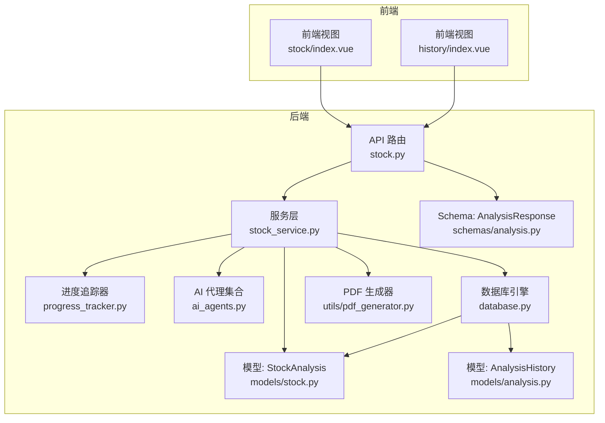
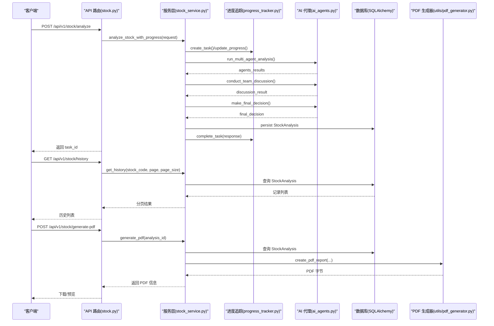
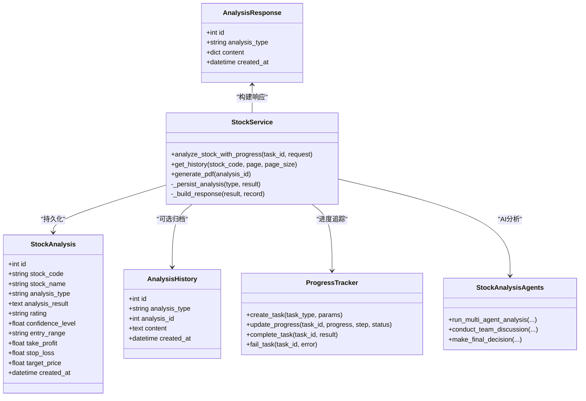
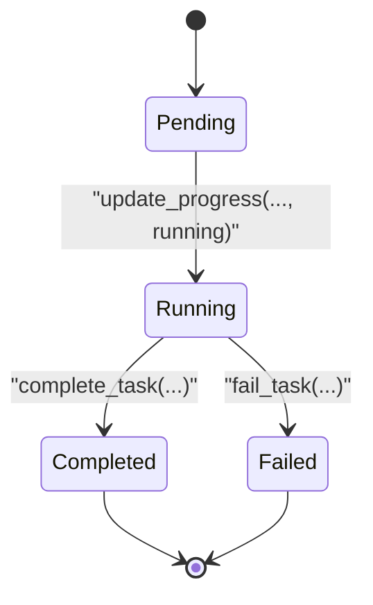
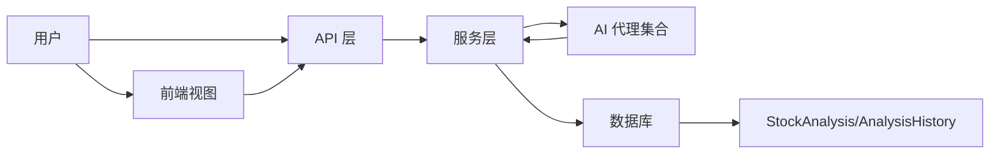
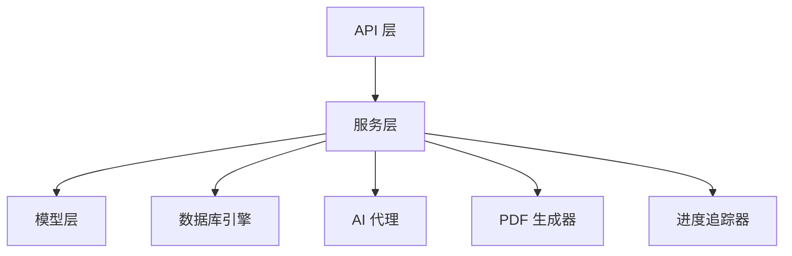

# 分析报告模型

<cite>
**本文引用的文件**
- [backend/app/models/stock.py](file://backend/app/models/stock.py)
- [backend/app/models/analysis.py](file://backend/app/models/analysis.py)
- [backend/app/schemas/analysis.py](file://backend/app/schemas/analysis.py)
- [backend/app/services/stock_service.py](file://backend/app/services/stock_service.py)
- [backend/app/api/v1/stock.py](file://backend/app/api/v1/stock.py)
- [backend/app/core/progress_tracker.py](file://backend/app/core/progress_tracker.py)
- [backend/app/database.py](file://backend/app/database.py)
- [backend/app/agents/ai_agents.py](file://backend/app/agents/ai_agents.py)
- [backend/app/utils/pdf_generator.py](file://backend/app/utils/pdf_generator.py)
- [docs/UNIFIED_ANALYSIS_SPEC.md](file://docs/UNIFIED_ANALYSIS_SPEC.md)
- [docs/前后端拆分规划文档.md](file://docs/前后端拆分规划文档.md)
- [frontend/src/views/stock/index.vue](file://frontend/src/views/stock/index.vue)
- [frontend/src/views/history/index.vue](file://frontend/src/views/history/index.vue)
</cite>

## 目录
1. [简介](#简介)
2. [项目结构](#项目结构)
3. [核心组件](#核心组件)
4. [架构总览](#架构总览)
5. [详细组件分析](#详细组件分析)
6. [依赖关系分析](#依赖关系分析)
7. [性能与扩展性](#性能与扩展性)
8. [故障排查指南](#故障排查指南)
9. [结论](#结论)
10. [附录](#附录)

## 简介
本文件面向“分析报告模型”的专业文档需求，聚焦于后端数据库模型、服务层处理、API接口、AI代理协作、以及前端展示与历史查询等环节，系统化梳理分析报告实体的字段语义、状态流转、异常处理、大文本存储策略、与用户/股票/AI代理的关系，并给出高并发下的分页、缓存与搜索优化建议及复合索引设计。

## 项目结构
围绕分析报告模型，后端采用 FastAPI + SQLAlchemy 的分层架构：
- 数据模型层：定义分析记录的持久化结构
- 服务层：封装分析流程、进度追踪、持久化与响应构建
- API 层：对外提供异步分析、进度查询、历史查询、PDF 生成等接口
- AI 代理层：多智能体协同生成分析内容
- 前端层：展示分析结果、最终决策与历史记录

**图表来源**
- [backend/app/api/v1/stock.py](file://backend/app/api/v1/stock.py#L1-L190)
- [backend/app/services/stock_service.py](file://backend/app/services/stock_service.py#L1-L573)
- [backend/app/core/progress_tracker.py](file://backend/app/core/progress_tracker.py#L1-L170)
- [backend/app/agents/ai_agents.py](file://backend/app/agents/ai_agents.py#L1-L546)
- [backend/app/database.py](file://backend/app/database.py#L1-L45)
- [backend/app/models/stock.py](file://backend/app/models/stock.py#L1-L26)
- [backend/app/models/analysis.py](file://backend/app/models/analysis.py#L1-L19)
- [backend/app/schemas/analysis.py](file://backend/app/schemas/analysis.py#L1-L21)
- [backend/app/utils/pdf_generator.py](file://backend/app/utils/pdf_generator.py#L1-L206)
- [frontend/src/views/stock/index.vue](file://frontend/src/views/stock/index.vue#L361-L392)
- [frontend/src/views/history/index.vue](file://frontend/src/views/history/index.vue#L113-L136)

**章节来源**
- [backend/app/api/v1/stock.py](file://backend/app/api/v1/stock.py#L1-L190)
- [backend/app/services/stock_service.py](file://backend/app/services/stock_service.py#L1-L573)
- [backend/app/models/stock.py](file://backend/app/models/stock.py#L1-L26)
- [backend/app/models/analysis.py](file://backend/app/models/analysis.py#L1-L19)
- [backend/app/schemas/analysis.py](file://backend/app/schemas/analysis.py#L1-L21)
- [backend/app/core/progress_tracker.py](file://backend/app/core/progress_tracker.py#L1-L170)
- [backend/app/database.py](file://backend/app/database.py#L1-L45)
- [backend/app/agents/ai_agents.py](file://backend/app/agents/ai_agents.py#L1-L546)
- [backend/app/utils/pdf_generator.py](file://backend/app/utils/pdf_generator.py#L1-L206)
- [frontend/src/views/stock/index.vue](file://frontend/src/views/stock/index.vue#L361-L392)
- [frontend/src/views/history/index.vue](file://frontend/src/views/history/index.vue#L113-L136)

## 核心组件
- 数据模型
  - StockAnalysis：单/批量分析记录，包含股票代码、名称、分析类型、分析结果(JSON)、评级、置信度、入场/止盈/止损/目标价、创建时间等
  - AnalysisHistory：历史归档记录，包含分析类型、关联ID、内容(JSON)、创建时间
- 服务层
  - StockService：封装分析流程、进度追踪、持久化、响应构建、PDF 生成
- API 层
  - 提供异步分析、进度查询、历史查询、PDF 生成等接口
- AI 代理层
  - 多智能体并行生成技术、基本面、资金流、风险、情绪、新闻等维度的分析内容
- Schema
  - AnalysisResponse：统一响应结构，包含 id、analysis_type、content、created_at

**章节来源**
- [backend/app/models/stock.py](file://backend/app/models/stock.py#L1-L26)
- [backend/app/models/analysis.py](file://backend/app/models/analysis.py#L1-L19)
- [backend/app/schemas/analysis.py](file://backend/app/schemas/analysis.py#L1-L21)
- [backend/app/services/stock_service.py](file://backend/app/services/stock_service.py#L1-L573)
- [backend/app/api/v1/stock.py](file://backend/app/api/v1/stock.py#L1-L190)
- [backend/app/agents/ai_agents.py](file://backend/app/agents/ai_agents.py#L1-L546)

## 架构总览
分析报告从“请求—异步任务—进度追踪—AI分析—持久化—响应—前端展示”的完整链路如下：

**图表来源**
- [backend/app/api/v1/stock.py](file://backend/app/api/v1/stock.py#L1-L190)
- [backend/app/services/stock_service.py](file://backend/app/services/stock_service.py#L1-L573)
- [backend/app/core/progress_tracker.py](file://backend/app/core/progress_tracker.py#L1-L170)
- [backend/app/agents/ai_agents.py](file://backend/app/agents/ai_agents.py#L1-L546)
- [backend/app/utils/pdf_generator.py](file://backend/app/utils/pdf_generator.py#L1-L206)

## 详细组件分析

### 数据模型与字段语义
- StockAnalysis（分析记录）
  - id：主键，索引
  - stock_code：股票代码，索引
  - stock_name：股票名称
  - analysis_type：分析类型（single/batch）
  - analysis_result：JSON 文本，存储完整分析内容（agents_results、discussion_result、final_decision、stock_info 等）
  - rating：评级（买入/持有/卖出）
  - confidence_level：置信度（0-1）
  - entry_range：建议进场区间
  - take_profit：止盈价
  - stop_loss：止损价
  - target_price：目标价
  - created_at：创建时间（服务器默认）

- AnalysisHistory（历史归档）
  - id：主键，索引
  - analysis_type：分析类型标识（stock/sector/longhubang）
  - analysis_id：关联分析记录ID
  - content：JSON 文本
  - created_at：创建时间

- AnalysisResponse（Schema）
  - id：记录ID
  - analysis_type：分析类型
  - content：分析内容（字典）
  - created_at：创建时间

**图表来源**
- [backend/app/models/stock.py](file://backend/app/models/stock.py#L1-L26)
- [backend/app/models/analysis.py](file://backend/app/models/analysis.py#L1-L19)
- [backend/app/schemas/analysis.py](file://backend/app/schemas/analysis.py#L1-L21)
- [backend/app/services/stock_service.py](file://backend/app/services/stock_service.py#L1-L573)
- [backend/app/core/progress_tracker.py](file://backend/app/core/progress_tracker.py#L1-L170)
- [backend/app/agents/ai_agents.py](file://backend/app/agents/ai_agents.py#L1-L546)

**章节来源**
- [backend/app/models/stock.py](file://backend/app/models/stock.py#L1-L26)
- [backend/app/models/analysis.py](file://backend/app/models/analysis.py#L1-L19)
- [backend/app/schemas/analysis.py](file://backend/app/schemas/analysis.py#L1-L21)

### 报告生成流程与状态转换
- 异步任务与进度追踪
  - API 接收分析请求，创建任务并立即返回 task_id
  - 服务层在后台执行分析，按阶段更新进度（准备数据、获取财务/资金流/情绪/新闻/风险数据、AI分析、团队讨论、生成最终决策），并持久化记录
  - 任务状态枚举：pending、running、completed、failed
  - WebSocket 实时推送进度，便于前端交互
- 状态转换规则
  - pending → running：任务创建后进入运行态
  - running → completed：分析成功完成
  - running → failed：分析异常或持久化失败
  - completed/failed 任务在一定时间后清理，避免内存膨胀
- 异常处理机制
  - 任意阶段异常均 fail_task 并记录错误
  - 前端通过任务ID轮询或 WS 接收错误信息
  - PDF 生成失败时抛出异常并由 API 层转换为 HTTP 500

**图表来源**
- [backend/app/core/progress_tracker.py](file://backend/app/core/progress_tracker.py#L1-L170)
- [backend/app/api/v1/stock.py](file://backend/app/api/v1/stock.py#L1-L190)
- [backend/app/services/stock_service.py](file://backend/app/services/stock_service.py#L1-L573)

**章节来源**
- [backend/app/core/progress_tracker.py](file://backend/app/core/progress_tracker.py#L1-L170)
- [backend/app/api/v1/stock.py](file://backend/app/api/v1/stock.py#L1-L190)
- [backend/app/services/stock_service.py](file://backend/app/services/stock_service.py#L1-L573)

### 大文本内容存储策略
- 存储方式
  - analysis_result 以 JSON 文本形式存储在数据库字段中，包含 agents_results、discussion_result、final_decision、stock_info 等
  - PDF 报告以二进制字节流返回，前端可下载或预览
- 存储优化建议
  - 对于超长文本（如 AI 生成的详细分析），建议：
    - 分表归档：将 analysis_result 按时间/类型拆分至 AnalysisHistory 或独立表，保留 StockAnalysis 精简字段
    - 对象存储：将 PDF 与大文本导出至对象存储（如 MinIO/S3），数据库仅存元数据与访问链接
    - 压缩：对 JSON 文本启用压缩存储（如 gzip），减少 IO
    - 索引：对高频查询字段建立复合索引（见“性能与扩展性”）
- 现状说明
  - 当前实现将完整 JSON 存入 analysis_result，适合中小体量；若体量增大，建议采用分表/对象存储策略

**章节来源**
- [backend/app/models/stock.py](file://backend/app/models/stock.py#L1-L26)
- [backend/app/services/stock_service.py](file://backend/app/services/stock_service.py#L230-L260)
- [backend/app/utils/pdf_generator.py](file://backend/app/utils/pdf_generator.py#L1-L206)

### 报告与用户、股票、AI代理的关系
- 与用户
  - 通过 API 访问分析接口，任务进度通过 WS 推送，历史记录与 PDF 生成供用户查看与下载
- 与股票
  - StockAnalysis 记录包含 stock_code、stock_name、analysis_type、analysis_result 等，analysis_result 中包含 stock_info、agents_results、discussion_result、final_decision 等
- 与 AI 代理
  - 多智能体并行生成技术、基本面、资金流、风险、情绪、新闻等维度分析，随后团队讨论形成综合研判，最终生成投资决策
  - AI 代理通过 DeepSeekClient 调用外部模型，生成分析文本并写入 analysis_result

**图表来源**
- [backend/app/api/v1/stock.py](file://backend/app/api/v1/stock.py#L1-L190)
- [backend/app/services/stock_service.py](file://backend/app/services/stock_service.py#L1-L573)
- [backend/app/agents/ai_agents.py](file://backend/app/agents/ai_agents.py#L1-L546)
- [frontend/src/views/stock/index.vue](file://frontend/src/views/stock/index.vue#L575-L600)
- [frontend/src/views/history/index.vue](file://frontend/src/views/history/index.vue#L113-L136)

**章节来源**
- [backend/app/agents/ai_agents.py](file://backend/app/agents/ai_agents.py#L1-L546)
- [backend/app/services/stock_service.py](file://backend/app/services/stock_service.py#L1-L573)
- [frontend/src/views/stock/index.vue](file://frontend/src/views/stock/index.vue#L575-L600)
- [frontend/src/views/history/index.vue](file://frontend/src/views/history/index.vue#L113-L136)

### 高并发查询优化：分页、缓存与搜索
- 分页
  - 历史查询接口支持 page/page_size 参数，服务层按 created_at 降序分页
  - 建议：对 stock_code、created_at 建立复合索引，提升分页查询性能
- 缓存
  - 对热点股票的最新分析记录可做 LRU 缓存（Redis/Memcached），命中则直接返回，未命中再查库
  - 对 PDF 生成结果可做短期缓存（如 5-10 分钟），降低重复生成成本
- 搜索
  - 支持按 stock_code 过滤；建议增加 analysis_type、rating、confidence_level 等维度的二级索引
  - 对 analysis_result 的 JSON 字段可考虑物化列（如 rating、confidence_level）以便检索
- 并发控制
  - 异步任务通过任务队列与进度追踪器隔离，避免阻塞主线程
  - PDF 生成在线程池中执行，避免阻塞 API

**章节来源**
- [backend/app/api/v1/stock.py](file://backend/app/api/v1/stock.py#L147-L161)
- [backend/app/services/stock_service.py](file://backend/app/services/stock_service.py#L170-L221)
- [backend/app/core/progress_tracker.py](file://backend/app/core/progress_tracker.py#L1-L170)

### 复合索引设计建议
- 建议索引
  - (stock_code, created_at)：按股票分组、时间倒序查询
  - (analysis_type, stock_code)：按分析类型与股票过滤
  - (rating, created_at)：按评级与时间筛选
  - (confidence_level, created_at)：按置信度与时间筛选
- 物化列建议
  - analysis_result 中的 rating/confidence_level/target_price 等可单独建列，便于检索与排序
- 索引维护
  - 定期统计查询模式，调整索引覆盖度；对冷数据可考虑分区或归档

**章节来源**
- [backend/app/models/stock.py](file://backend/app/models/stock.py#L1-L26)
- [backend/app/services/stock_service.py](file://backend/app/services/stock_service.py#L170-L221)

## 依赖关系分析
- 组件耦合
  - API 层依赖服务层；服务层依赖模型、数据库、AI 代理与 PDF 生成器
  - 进度追踪器与 WebSocket 管理器为横切关注点，被服务层调用
- 外部依赖
  - 数据库：SQLAlchemy ORM + 数据库引擎
  - AI：DeepSeekClient（外部模型调用）
  - PDF：本地生成器，可替换为对象存储直链
- 循环依赖
  - 当前结构清晰，未发现循环依赖

**图表来源**
- [backend/app/api/v1/stock.py](file://backend/app/api/v1/stock.py#L1-L190)
- [backend/app/services/stock_service.py](file://backend/app/services/stock_service.py#L1-L573)
- [backend/app/database.py](file://backend/app/database.py#L1-L45)
- [backend/app/agents/ai_agents.py](file://backend/app/agents/ai_agents.py#L1-L546)
- [backend/app/utils/pdf_generator.py](file://backend/app/utils/pdf_generator.py#L1-L206)
- [backend/app/core/progress_tracker.py](file://backend/app/core/progress_tracker.py#L1-L170)

**章节来源**
- [backend/app/api/v1/stock.py](file://backend/app/api/v1/stock.py#L1-L190)
- [backend/app/services/stock_service.py](file://backend/app/services/stock_service.py#L1-L573)
- [backend/app/database.py](file://backend/app/database.py#L1-L45)

## 性能与扩展性
- 性能特征
  - AI 分析耗时较长，建议异步化与并行化；PDF 生成亦为 CPU 密集型
  - 建议引入任务队列（Celery/RQ）与缓存层（Redis）提升吞吐
- 存储扩展
  - 大体量 JSON 文本建议分表/对象存储；PDF 可直链下载
- 索引与查询
  - 基于 stock_code、analysis_type、created_at、rating、confidence_level 建立复合索引
- 监控与告警
  - 任务队列积压、PDF 生成耗时、数据库慢查询应纳入监控

[本节为通用指导，无需特定文件来源]

## 故障排查指南
- 常见问题
  - 任务不存在：检查 task_id 是否正确，或是否已被清理
  - 分析失败：查看进度追踪器中的 error 字段，定位异常阶段
  - PDF 生成失败：确认 analysis_id 存在且 analysis_result 可解析
- 排查步骤
  - 通过 /api/v1/stock/analyze-progress/{task_id} 获取任务状态
  - 检查服务日志与数据库异常堆栈
  - 核对 analysis_result JSON 结构与字段命名（参见统一规范）
- 统一规范参考
  - 评级、置信度、进场/止盈/止损/目标价等字段命名与展示规范

**章节来源**
- [backend/app/api/v1/stock.py](file://backend/app/api/v1/stock.py#L54-L64)
- [backend/app/services/stock_service.py](file://backend/app/services/stock_service.py#L63-L107)
- [docs/UNIFIED_ANALYSIS_SPEC.md](file://docs/UNIFIED_ANALYSIS_SPEC.md#L102-L154)

## 结论
本分析报告模型以 StockAnalysis 为核心，结合多智能体 AI 分析、进度追踪与异步任务，实现了从请求到结果的完整闭环。当前实现简洁高效，适合中小体量；随着数据规模增长，建议引入分表/对象存储、缓存与复合索引优化，以满足高并发与大文本存储需求。同时，统一字段命名与展示规范有助于前后端一致性与可维护性。

[本节为总结，无需特定文件来源]

## 附录
- 字段语义对照
  - stock_code：股票代码
  - stock_name：股票名称
  - analysis_type：分析类型（single/batch）
  - analysis_result：完整分析 JSON（包含 agents_results、discussion_result、final_decision、stock_info）
  - rating：投资评级
  - confidence_level：置信度（0-1）
  - entry_range：建议进场区间
  - take_profit：止盈价
  - stop_loss：止损价
  - target_price：目标价
  - created_at：创建时间
- 前端展示要点
  - 评级颜色、置信度可视化、最终决策卡片、PDF 下载入口

**章节来源**
- [backend/app/models/stock.py](file://backend/app/models/stock.py#L1-L26)
- [frontend/src/views/stock/index.vue](file://frontend/src/views/stock/index.vue#L361-L392)
- [frontend/src/views/history/index.vue](file://frontend/src/views/history/index.vue#L113-L136)