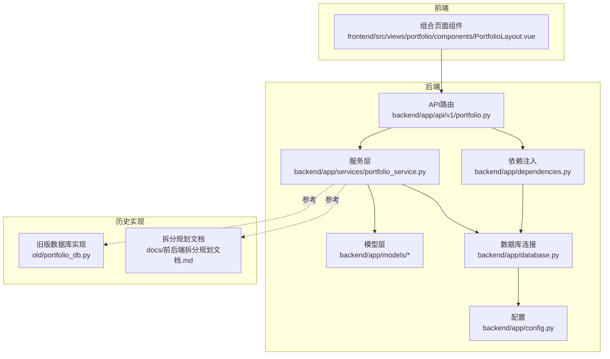
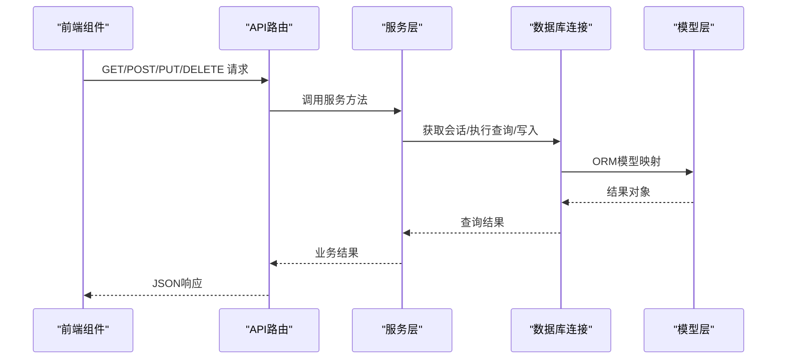
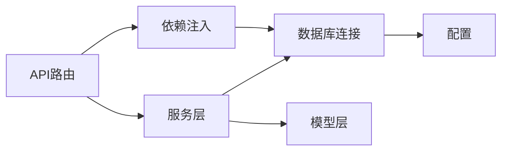
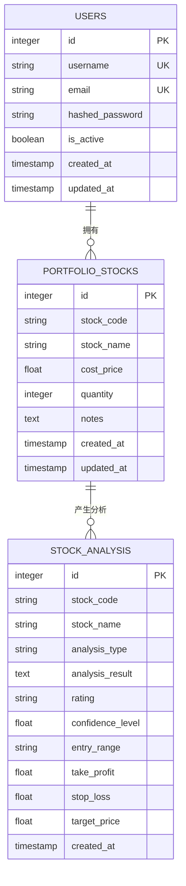
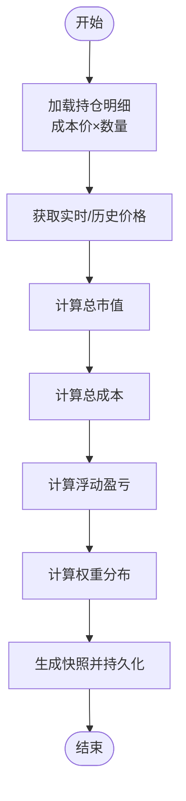
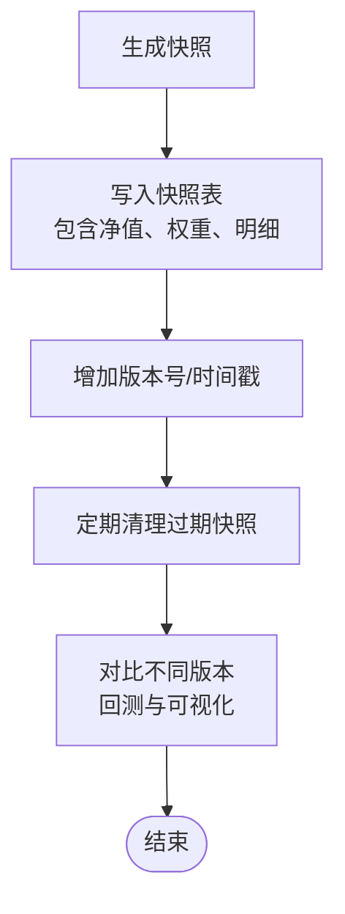

# 投资组合模型

<cite>
**本文引用的文件**
- [backend/app/models/portfolio.py](file://backend/app/models/portfolio.py)
- [backend/app/models/user.py](file://backend/app/models/user.py)
- [backend/app/models/stock.py](file://backend/app/models/stock.py)
- [backend/app/db/portfolio_db.py](file://backend/app/db/portfolio_db.py)
- [backend/app/services/portfolio_service.py](file://backend/app/services/portfolio_service.py)
- [backend/app/api/v1/portfolio.py](file://backend/app/api/v1/portfolio.py)
- [backend/app/database.py](file://backend/app/database.py)
- [backend/app/dependencies.py](file://backend/app/dependencies.py)
- [backend/app/config.py](file://backend/app/config.py)
- [old/portfolio_db.py](file://old/portfolio_db.py)
- [docs/前后端拆分规划文档.md](file://docs/前后端拆分规划文档.md)
- [frontend/src/views/portfolio/components/PortfolioLayout.vue](file://frontend/src/views/portfolio/components/PortfolioLayout.vue)
</cite>

## 目录
1. [简介](#简介)
2. [项目结构](#项目结构)
3. [核心组件](#核心组件)
4. [架构总览](#架构总览)
5. [详细组件分析](#详细组件分析)
6. [依赖关系分析](#依赖关系分析)
7. [性能考量](#性能考量)
8. [故障排查指南](#故障排查指南)
9. [结论](#结论)
10. [附录](#附录)

## 简介
本文件面向“投资组合数据模型”的完整文档需求，聚焦于Portfolio实体及其关联表的设计、字段定义、约束与业务逻辑，阐明与用户的一对多关系以及与股票的多对多关系（通过持仓明细表）。同时，梳理组合估值计算、权重分布、收益跟踪等业务规则在数据层的实现方式，并说明组合历史快照的存储策略与版本控制机制。最后，提供高性能查询持仓明细的SQL优化建议与索引配置方案。

## 项目结构
围绕投资组合模型，后端采用FastAPI + SQLAlchemy ORM，数据库连接由独立模块管理；前端提供组合页面交互，调用后端API获取持仓与历史数据。

图表来源
- [backend/app/api/v1/portfolio.py](file://backend/app/api/v1/portfolio.py#L1-L123)
- [backend/app/services/portfolio_service.py](file://backend/app/services/portfolio_service.py#L1-L54)
- [backend/app/models/portfolio.py](file://backend/app/models/portfolio.py#L1-L22)
- [backend/app/models/user.py](file://backend/app/models/user.py#L1-L21)
- [backend/app/models/stock.py](file://backend/app/models/stock.py#L1-L26)
- [backend/app/database.py](file://backend/app/database.py#L1-L45)
- [backend/app/dependencies.py](file://backend/app/dependencies.py#L1-L15)
- [backend/app/config.py](file://backend/app/config.py#L1-L92)
- [old/portfolio_db.py](file://old/portfolio_db.py#L1-L626)
- [docs/前后端拆分规划文档.md](file://docs/前后端拆分规划文档.md#L740-L774)
- [frontend/src/views/portfolio/components/PortfolioLayout.vue](file://frontend/src/views/portfolio/components/PortfolioLayout.vue#L618-L669)

章节来源
- [backend/app/api/v1/portfolio.py](file://backend/app/api/v1/portfolio.py#L1-L123)
- [backend/app/services/portfolio_service.py](file://backend/app/services/portfolio_service.py#L1-L54)
- [backend/app/models/portfolio.py](file://backend/app/models/portfolio.py#L1-L22)
- [backend/app/models/user.py](file://backend/app/models/user.py#L1-L21)
- [backend/app/models/stock.py](file://backend/app/models/stock.py#L1-L26)
- [backend/app/database.py](file://backend/app/database.py#L1-L45)
- [backend/app/dependencies.py](file://backend/app/dependencies.py#L1-L15)
- [backend/app/config.py](file://backend/app/config.py#L1-L92)
- [old/portfolio_db.py](file://old/portfolio_db.py#L1-L626)
- [docs/前后端拆分规划文档.md](file://docs/前后端拆分规划文档.md#L740-L774)
- [frontend/src/views/portfolio/components/PortfolioLayout.vue](file://frontend/src/views/portfolio/components/PortfolioLayout.vue#L618-L669)

## 核心组件
- 持仓明细模型：portfolio_stocks（后端ORM模型与历史实现中的表结构一致）
- 用户模型：users（预留，用于一对多关系）
- 股票分析模型：stock_analysis（用于分析结果的通用结构，便于理解组合分析数据）
- 服务层：PortfolioService（当前为占位实现，后续承载组合估值、权重、历史快照等逻辑）
- API层：portfolio.py（提供获取/新增/更新/删除持仓与批量分析、定时配置、历史查询等接口）
- 数据库连接：database.py（统一数据库引擎与会话工厂）
- 依赖注入：dependencies.py（提供get_database会话依赖）
- 配置：config.py（数据库URL等）

章节来源
- [backend/app/models/portfolio.py](file://backend/app/models/portfolio.py#L1-L22)
- [backend/app/models/user.py](file://backend/app/models/user.py#L1-L21)
- [backend/app/models/stock.py](file://backend/app/models/stock.py#L1-L26)
- [backend/app/services/portfolio_service.py](file://backend/app/services/portfolio_service.py#L1-L54)
- [backend/app/api/v1/portfolio.py](file://backend/app/api/v1/portfolio.py#L1-L123)
- [backend/app/database.py](file://backend/app/database.py#L1-L45)
- [backend/app/dependencies.py](file://backend/app/dependencies.py#L1-L15)
- [backend/app/config.py](file://backend/app/config.py#L1-L92)

## 架构总览
后端采用分层架构：API路由负责HTTP请求与响应封装，服务层承载业务逻辑，模型层映射数据库表，数据库连接与依赖注入提供基础设施。前端通过API获取组合相关数据。

图表来源
- [backend/app/api/v1/portfolio.py](file://backend/app/api/v1/portfolio.py#L1-L123)
- [backend/app/services/portfolio_service.py](file://backend/app/services/portfolio_service.py#L1-L54)
- [backend/app/database.py](file://backend/app/database.py#L1-L45)
- [backend/app/models/portfolio.py](file://backend/app/models/portfolio.py#L1-L22)

## 详细组件分析

### 持仓明细模型（portfolio_stocks）
- 表名：portfolio_stocks
- 字段与约束
  - id：主键，自增，索引
  - stock_code：字符串，非空，索引
  - stock_name：字符串
  - cost_price：浮点数（元）
  - quantity：整数（股）
  - notes：文本
  - created_at：时间戳，默认当前时间
  - updated_at：时间戳，默认更新时写入当前时间
- 关系
  - 与用户：当前ORM模型未直接体现用户外键，但API层参数中存在user_id字段，可在迁移至完整模型时补充
  - 与股票分析：通过分析历史表portfolio_analysis_history关联，形成“组合内某只股票”的分析快照链路

章节来源
- [backend/app/models/portfolio.py](file://backend/app/models/portfolio.py#L1-L22)
- [old/portfolio_db.py](file://old/portfolio_db.py#L40-L84)
- [docs/前后端拆分规划文档.md](file://docs/前后端拆分规划文档.md#L740-L774)

### 用户模型（users）
- 表名：users
- 字段
  - id：主键
  - username：唯一，索引
  - email：唯一，索引
  - hashed_password：加密密码
  - is_active：布尔
  - created_at/updated_at：时间戳
- 关系
  - 与组合：一对多（一个用户拥有多个组合/持仓）

章节来源
- [backend/app/models/user.py](file://backend/app/models/user.py#L1-L21)

### 股票分析模型（stock_analysis）
- 表名：stock_analysis
- 字段
  - id：主键
  - stock_code/stock_name：分析对象标识
  - analysis_type：分析类型（single/batch）
  - analysis_result：JSON格式的分析结果
  - rating/confidence_level：评级与置信度
  - entry_range/take_profit/stop_loss/target_price：入场区间、止盈止损、目标价
  - created_at：时间戳
- 作用
  - 作为通用分析记录模型，便于理解组合分析数据的结构与来源

章节来源
- [backend/app/models/stock.py](file://backend/app/models/stock.py#L1-L26)

### 服务层（PortfolioService）
- 当前职责
  - 提供获取/新增/更新/删除持仓的方法占位
  - 提供批量分析、定时配置、历史查询的方法占位
- 数据层扩展方向
  - 组合估值计算：基于持仓明细的cost_price与quantity计算总成本；结合实时/历史行情计算总市值与收益
  - 权重分布：按市值计算权重，支持导出权重序列
  - 收益跟踪：基于成本与当前市价计算浮动盈亏，支持区间收益统计
  - 历史快照：定期持久化组合快照（净值、权重、持仓明细），支持回测与对比
  - 版本控制：通过时间戳与版本号字段实现快照版本管理

章节来源
- [backend/app/services/portfolio_service.py](file://backend/app/services/portfolio_service.py#L1-L54)

### API层（portfolio.py）
- 接口能力
  - 获取/新增/更新/删除持仓
  - 批量分析（支持模式与并发参数）
  - 定时配置（获取/设置）
  - 历史查询（支持分页与过滤）
- 与服务层协作
  - 通过依赖注入获取数据库会话，调用服务层方法

章节来源
- [backend/app/api/v1/portfolio.py](file://backend/app/api/v1/portfolio.py#L1-L123)

### 数据库连接与依赖注入
- database.py
  - 统一创建数据库引擎与会话工厂，支持SQLite绝对路径与目录预创建
- dependencies.py
  - 提供get_database会话依赖，供API路由注入

章节来源
- [backend/app/database.py](file://backend/app/database.py#L1-L45)
- [backend/app/dependencies.py](file://backend/app/dependencies.py#L1-L15)

### 历史实现与迁移参考（old/portfolio_db.py）
- 表结构
  - portfolio_stocks：成本价、数量、备注、自动监测开关、时间戳
  - portfolio_analysis_history：分析时间、评级、置信度、当前价、目标价、入场区间、止盈止损、摘要
- 索引
  - portfolio_analysis_history(portfolio_stock_id)
  - portfolio_analysis_history(analysis_time DESC)
- 功能
  - CRUD、搜索、统计、清理过期历史、获取最新分析、评级变化追踪、批量分析历史聚合

章节来源
- [old/portfolio_db.py](file://old/portfolio_db.py#L1-L626)

### 前端交互参考（PortfolioLayout.vue）
- 展示与交互
  - 持仓列表、添加/编辑/删除、批量分析、定时配置、历史查询与分页
- 与后端API对接
  - 通过getPortfolioHistory等接口获取历史数据

章节来源
- [frontend/src/views/portfolio/components/PortfolioLayout.vue](file://frontend/src/views/portfolio/components/PortfolioLayout.vue#L618-L669)
- [frontend/src/views/portfolio/components/PortfolioLayout.vue](file://frontend/src/views/portfolio/components/PortfolioLayout.vue#L1002-L1045)

## 依赖关系分析
- 组件耦合
  - API路由依赖服务层；服务层依赖数据库连接与模型层；模型层依赖数据库引擎
  - 依赖注入模块提供统一的会话获取入口
- 外部依赖
  - 数据库URL来自配置模块
  - 前端通过HTTP接口与后端交互

图表来源
- [backend/app/api/v1/portfolio.py](file://backend/app/api/v1/portfolio.py#L1-L123)
- [backend/app/services/portfolio_service.py](file://backend/app/services/portfolio_service.py#L1-L54)
- [backend/app/database.py](file://backend/app/database.py#L1-L45)
- [backend/app/dependencies.py](file://backend/app/dependencies.py#L1-L15)
- [backend/app/config.py](file://backend/app/config.py#L1-L92)

章节来源
- [backend/app/api/v1/portfolio.py](file://backend/app/api/v1/portfolio.py#L1-L123)
- [backend/app/services/portfolio_service.py](file://backend/app/services/portfolio_service.py#L1-L54)
- [backend/app/database.py](file://backend/app/database.py#L1-L45)
- [backend/app/dependencies.py](file://backend/app/dependencies.py#L1-L15)
- [backend/app/config.py](file://backend/app/config.py#L1-L92)

## 性能考量
- 索引建议（基于历史实现与拆分规划文档）
  - portfolio_analysis_history(portfolio_stock_id)：加速按股票维度查询分析历史
  - portfolio_analysis_history(analysis_time DESC)：加速按时间倒序查询
  - portfolio_stocks(stock_code)：加速按股票代码检索
  - portfolio_stocks(id)：主键索引已存在
- 查询优化
  - 使用LIMIT与分页，避免一次性加载大量历史记录
  - 对常用过滤条件（如analysis_time范围）建立复合索引（如portfolio_analysis_history(portfolio_stock_id, analysis_time DESC)）
- 写入优化
  - 批量插入分析历史时，使用事务提交减少磁盘I/O
  - 定期清理过期历史（如保留90天），降低表膨胀
- 缓存策略
  - 对热点组合的最新分析结果进行缓存，减少重复查询

章节来源
- [old/portfolio_db.py](file://old/portfolio_db.py#L75-L84)
- [docs/前后端拆分规划文档.md](file://docs/前后端拆分规划文档.md#L740-L774)

## 故障排查指南
- 数据库连接问题
  - SQLite路径：确认数据库URL指向的绝对路径存在且可写
  - 会话生命周期：确保在依赖注入的作用域内正确关闭会话
- API错误处理
  - API路由对异常进行捕获并返回HTTP 500，检查服务层实现与数据库异常栈
- 历史数据清理
  - 如发现历史表增长过快，可通过清理接口删除过期记录

章节来源
- [backend/app/database.py](file://backend/app/database.py#L1-L45)
- [backend/app/api/v1/portfolio.py](file://backend/app/api/v1/portfolio.py#L1-L123)
- [old/portfolio_db.py](file://old/portfolio_db.py#L512-L541)

## 结论
当前后端实现了投资组合相关API与服务层占位，模型层包含持仓明细与用户/股票分析的基础结构。历史实现提供了完整的表结构、索引与历史快照能力。建议在后续迭代中完善：
- 完整的Portfolio实体模型（含id、name、user_id、created_at、total_value、risk_level等字段与约束）
- 与用户的一对多关系与与股票的多对多关系（通过中间表）
- 组合估值、权重分布、收益跟踪与历史快照的完整数据层实现
- 性能优化与索引策略落地

## 附录

### 数据模型图（概念示意）

图表来源
- [backend/app/models/user.py](file://backend/app/models/user.py#L1-L21)
- [backend/app/models/portfolio.py](file://backend/app/models/portfolio.py#L1-L22)
- [backend/app/models/stock.py](file://backend/app/models/stock.py#L1-L26)

### 组合估值与权重计算流程（概念示意）

[此图为概念流程，不对应具体源码文件]

### 历史快照与版本控制（概念示意）

[此图为概念流程，不对应具体源码文件]