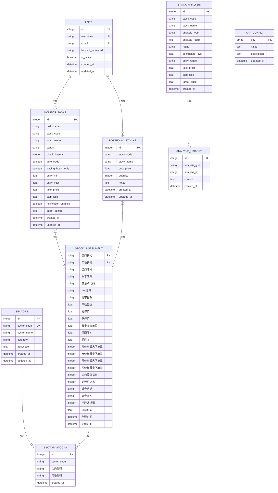

# 数据模型与数据库设计

<cite>
**本文档引用的文件**
- [user.py](file://backend/app/models/user.py)
- [stock.py](file://backend/app/models/stock.py)
- [portfolio.py](file://backend/app/models/portfolio.py)
- [monitor.py](file://backend/app/models/monitor.py)
- [analysis.py](file://backend/app/models/analysis.py)
- [sector.py](file://backend/app/models/sector.py)
- [config.py](file://backend/app/models/config.py)
- [database.py](file://backend/app/database.py)
- [init_db.py](file://backend/init_db.py)
- [migrate_db.py](file://backend/migrate_db.py)
- [001_add_monitor_task_fields.py](file://backend/alembic/versions/001_add_monitor_task_fields.py)
</cite>

## 目录
1. [简介](#简介)
2. [核心数据模型](#核心数据模型)
3. [实体关系与数据库表结构](#实体关系与数据库表结构)
4. [索引设计](#索引设计)
5. [数据库迁移管理](#数据库迁移管理)
6. [数据生命周期管理](#数据生命周期管理)
7. [数据访问最佳实践](#数据访问最佳实践)

## 简介
本系统是一个基于AI的股票交易分析平台，其数据模型设计围绕用户、股票、持仓、监测任务、板块分析等核心实体构建。系统采用SQLAlchemy作为ORM框架，使用SQLite作为默认数据库，通过Alembic进行数据库版本管理。数据模型设计注重可扩展性和业务逻辑的清晰表达，支持复杂的金融分析场景和自动化交易策略。

## 核心数据模型

### 用户模型 (User)
用户模型用于存储系统用户的基本信息，目前为预留模型，支持未来用户认证和权限管理功能的扩展。

**字段定义：**
- `id`: 主键ID，整数类型，自增
- `username`: 用户名，字符串(50)，唯一索引
- `email`: 邮箱地址，字符串(100)，唯一索引
- `hashed_password`: 加密密码，字符串(255)
- `is_active`: 是否激活，布尔类型，默认为True
- `created_at`: 创建时间，DateTime类型，服务器默认值
- `updated_at`: 更新时间，DateTime类型，更新时自动更新

**Section sources**
- [user.py](file://backend/app/models/user.py#L9-L21)

### 股票分析模型 (StockAnalysis)
该模型存储单股或批量股票分析的结果，是系统AI分析功能的核心数据载体。

**字段定义：**
- `id`: 主键ID，整数类型，自增
- `stock_code`: 股票代码，字符串(20)，非空，索引
- `stock_name`: 股票名称，字符串(100)
- `analysis_type`: 分析类型，字符串(50)，枚举值：single(单股分析)、batch(批量分析)
- `analysis_result`: 分析结果，Text类型，存储JSON格式数据
- `rating`: 评级，字符串(20)，如"买入"、"持有"、"卖出"
- `confidence_level`: 置信度，浮点数类型，范围0-1
- `entry_range`: 建议进场区间，字符串(50)
- `take_profit`: 止盈价位，浮点数类型，单位元
- `stop_loss`: 止损价位，浮点数类型，单位元
- `target_price`: 目标价，浮点数类型，单位元
- `created_at`: 创建时间，DateTime类型，服务器默认值

**Section sources**
- [stock.py](file://backend/app/models/stock.py#L9-L26)

### 持仓模型 (PortfolioStock)
该模型管理用户的实际持仓信息，支持成本价、持有数量和备注等关键投资信息的记录。

**字段定义：**
- `id`: 主键ID，整数类型，自增
- `stock_code`: 股票代码，字符串(20)，非空，索引
- `stock_name`: 股票名称，字符串(100)
- `cost_price`: 成本价，浮点数类型，单位元
- `quantity`: 持有数量，整数类型，单位股
- `notes`: 备注信息，Text类型
- `created_at`: 创建时间，DateTime类型，服务器默认值
- `updated_at`: 更新时间，DateTime类型，更新时自动更新

**Section sources**
- [portfolio.py](file://backend/app/models/portfolio.py#L9-L22)

### 监测任务模型 (MonitorTask)
这是系统最复杂的核心模型之一，用于定义和管理对特定股票的实时监控任务，支持自动化交易策略。

**字段定义：**
- `id`: 主键ID，整数类型，自增
- `task_name`: 任务名称，字符串(100)
- `stock_code`: 股票代码，字符串(20)，非空，索引
- `stock_name`: 股票名称，字符串(100)
- `status`: 任务状态，字符串(20)，枚举值：running(运行中)、stopped(已停止)
- `check_interval`: 检查间隔，整数类型，单位秒
- `auto_trade`: 是否自动交易，布尔类型，默认False
- `trading_hours_only`: 是否仅交易时段监控，布尔类型，默认False
- `entry_min`: 进场最低价，浮点数类型，可为空
- `entry_max`: 进场最高价，浮点数类型，可为空
- `take_profit`: 止盈价位，浮点数类型，可为空
- `stop_loss`: 止损价位，浮点数类型，可为空
- `notification_enabled`: 是否启用通知，布尔类型，默认False
- `quant_config`: 量化策略配置，Text类型，存储JSON字符串，可为空
- `created_at`: 创建时间，DateTime类型，服务器默认值
- `updated_at`: 更新时间，DateTime类型，更新时自动更新

**Section sources**
- [monitor.py](file://backend/app/models/monitor.py#L9-L39)

### 分析历史模型 (AnalysisHistory)
该模型记录所有类型的分析历史，提供统一的分析结果存储接口。

**字段定义：**
- `id`: 主键ID，整数类型，自增
- `analysis_type`: 分析类型，字符串(50)，枚举值：stock(股票分析)、sector(板块分析)、longhubang(龙虎榜分析)
- `analysis_id`: 关联分析记录ID，整数类型，索引
- `content`: 分析内容，Text类型，存储JSON格式数据
- `created_at`: 创建时间，DateTime类型，服务器默认值

**Section sources**
- [analysis.py](file://backend/app/models/analysis.py#L9-L19)

### 板块模型 (Sector)
该模型管理股票板块信息，支持行业、概念、地域等多维度的板块分类。

**字段定义：**
- `id`: 主键ID，整数类型，自增
- `sector_code`: 板块代码，字符串(50)，唯一，非空，索引
- `sector_name`: 板块名称，字符串(100)，非空
- `category`: 板块类别，字符串(50)，如"行业"、"概念"、"地域"
- `description`: 板块描述，Text类型
- `created_at`: 创建时间，DateTime类型，服务器默认值
- `updated_at`: 更新时间，DateTime类型，更新时自动更新

**Section sources**
- [sector.py](file://backend/app/models/sector.py#L9-L24)

### 股票合约基础信息模型 (StockInstrument)
该模型存储详细的股票合约基础信息，包含交易所需的各种参数。

**字段定义：**
- `合约代码`: 合约代码（纯数字），字符串(20)，主键，非空
- `市场代码`: 合约市场代码，字符串(10)，主键，非空
- `合约名称`: 合约名称，字符串(100)
- `拼音简写`: 合约名称的拼音简写，字符串(50)
- `交易所代码`: 交易所代码，字符串(20)
- `IPO日期`: IPO日期（股票），字符串(20)
- `退市日期`: 退市日或者到期日，字符串(20)
- `前收盘价`: 前收盘价格，浮点数类型
- `涨停价`: 当日涨停价，浮点数类型
- `跌停价`: 当日跌停价，浮点数类型
- `最小变价单位`: 最小变价单位，浮点数类型
- `流通股本`: 流通股本，浮点数类型
- `总股本`: 总股本，浮点数类型
- `市价单最大下单量`: 市价单最大下单量，整数类型
- `市价单最小下单量`: 市价单最小下单量，整数类型
- `限价单最大下单量`: 限价单最大下单量，整数类型
- `限价单最小下单量`: 限价单最小下单量，整数类型
- `合约停牌状态`: 合约停牌状态，整数类型
- `是否可交易`: 合约是否可交易，整数类型
- `证券分类`: 证券分类，字符串(50)
- `证券属性`: 证券属性，字符串(50)
- `港股通标识`: 港股是否为沪港通或深港通标的证券，整数类型
- `注册资本`: 注册资本（单位:百万），浮点数类型
- `创建时间`: 记录创建时间，DateTime类型，服务器默认值
- `更新时间`: 记录更新时间，DateTime类型，更新时自动更新

**Section sources**
- [sector.py](file://backend/app/models/sector.py#L27-L80)

### 板块-股票关系模型 (SectorStock)
该模型实现板块与股票之间的多对多关系，是连接板块分析和个股分析的桥梁。

**字段定义：**
- `id`: 主键ID，整数类型，自增
- `sector_code`: 板块代码，字符串(50)，非空，索引
- `合约代码`: 合约代码，字符串(20)，非空，索引
- `市场代码`: 市场代码，字符串(10)，非空
- `created_at`: 创建时间，DateTime类型，服务器默认值

**Section sources**
- [sector.py](file://backend/app/models/sector.py#L83-L98)

### 配置存储模型 (AppConfig)
该模型采用键值对形式存储系统配置，支持灵活的配置管理。

**字段定义：**
- `key`: 配置键，字符串(128)，主键，索引
- `value`: 配置值，Text类型，非空，默认空字符串
- `description`: 配置说明，Text类型，可为空
- `updated_at`: 更新时间，DateTime类型，非空，默认当前UTC时间，更新时自动更新

**Section sources**
- [config.py](file://backend/app/models/config.py#L11-L21)

## 实体关系与数据库表结构



**Diagram sources**
- [user.py](file://backend/app/models/user.py#L9-L21)
- [stock.py](file://backend/app/models/stock.py#L9-L26)
- [portfolio.py](file://backend/app/models/portfolio.py#L9-L22)
- [monitor.py](file://backend/app/models/monitor.py#L9-L39)
- [analysis.py](file://backend/app/models/analysis.py#L9-L19)
- [sector.py](file://backend/app/models/sector.py#L9-L98)
- [config.py](file://backend/app/models/config.py#L11-L21)

## 索引设计

系统在关键字段上建立了索引以优化查询性能：

1. **主键索引**：所有表的主键字段自动创建主键索引
2. **唯一索引**：
   - `users`表的`username`和`email`字段
   - `sectors`表的`sector_code`字段
   - `app_config`表的`key`字段
3. **普通索引**：
   - `users`、`stock_analysis`、`portfolio_stocks`、`monitor_tasks`、`analysis_history`、`sectors`、`sector_stocks`表的`created_at`字段
   - `stock_analysis`、`portfolio_stocks`、`monitor_tasks`表的`stock_code`字段
   - `analysis_history`表的`analysis_id`字段
   - `sector_stocks`表的`sector_code`和`合约代码`字段
4. **复合唯一索引**：
   - `sector_stocks`表的`(sector_code, 合约代码, 市场代码)`字段组合，确保板块与股票关系的唯一性

这些索引设计考虑了系统的典型查询模式，如按股票代码查询、按时间范围查询、按用户查询等，有效提升了数据检索效率。

**Section sources**
- [user.py](file://backend/app/models/user.py#L13-L15)
- [stock.py](file://backend/app/models/stock.py#L14)
- [portfolio.py](file://backend/app/models/portfolio.py#L14)
- [monitor.py](file://backend/app/models/monitor.py#L15)
- [analysis.py](file://backend/app/models/analysis.py#L13-L15)
- [sector.py](file://backend/app/models/sector.py#L14-L24)
- [sector.py](file://backend/app/models/sector.py#L83-L98)
- [config.py](file://backend/app/models/config.py#L16)

## 数据库迁移管理

系统采用Alembic作为数据库迁移工具，实现数据库模式的版本控制和演进管理。

### Alembic迁移脚本分析

`001_add_monitor_task_fields.py`迁移脚本展示了系统的迁移管理实践：

```python
def upgrade():
    """添加新字段"""
    # 进场区间
    op.add_column('monitor_tasks', sa.Column('entry_min', sa.Float(), nullable=True))
    op.add_column('monitor_tasks', sa.Column('entry_max', sa.Float(), nullable=True))
    
    # 止盈止损
    op.add_column('monitor_tasks', sa.Column('take_profit', sa.Float(), nullable=True))
    op.add_column('monitor_tasks', sa.Column('stop_loss', sa.Float(), nullable=True))
    
    # 通知设置
    op.add_column('monitor_tasks', sa.Column('notification_enabled', sa.Boolean(), nullable=True, server_default='0'))
    
    # 量化配置（JSON格式存储）
    op.add_column('monitor_tasks', sa.Column('quant_config', sa.Text(), nullable=True))

def downgrade():
    """回滚删除字段"""
    op.drop_column('monitor_tasks', 'quant_config')
    op.drop_column('monitor_tasks', 'notification_enabled')
    op.drop_column('monitor_tasks', 'stop_loss')
    op.drop_column('monitor_tasks', 'take_profit')
    op.drop_column('monitor_tasks', 'entry_max')
    op.drop_column('monitor_tasks', 'entry_min')
```

该迁移脚本通过`upgrade()`函数向`monitor_tasks`表添加了6个新字段，包括进场区间、止盈止损、通知设置和量化配置。`downgrade()`函数提供了回滚机制，确保数据库版本可以安全地降级。

### 迁移执行流程

系统提供了两种迁移执行方式：
1. **Alembic方式**：标准的数据库迁移管理，支持版本控制和回滚
2. **手动脚本方式**：`migrate_db.py`脚本提供了直接的数据库操作，包含错误处理和事务管理

`init_db.py`脚本负责数据库的初始化，通过`Base.metadata.create_all(bind=engine)`创建所有定义的表，是系统首次部署时的关键脚本。

**Section sources**
- [001_add_monitor_task_fields.py](file://backend/alembic/versions/001_add_monitor_task_fields.py#L19-L44)
- [migrate_db.py](file://backend/migrate_db.py#L13-L81)
- [init_db.py](file://backend/init_db.py#L18-L34)

## 数据生命周期管理

系统目前的数据生命周期管理策略主要体现在以下几个方面：

1. **数据创建**：所有记录在创建时自动记录`created_at`时间戳
2. **数据更新**：支持更新的模型（如`User`、`PortfolioStock`、`MonitorTask`）在更新时自动更新`updated_at`时间戳
3. **数据保留**：系统未实现自动删除策略，所有数据默认永久保留
4. **历史记录**：通过`AnalysisHistory`模型专门存储分析历史，实现了分析结果的版本化管理

建议未来实现以下数据生命周期管理功能：
- **历史数据归档**：对超过一定时间（如1年）的分析历史和监测记录进行归档
- **数据清理策略**：为临时数据和日志数据设置自动清理规则
- **软删除机制**：为关键业务数据实现软删除，避免误删
- **数据备份**：建立定期备份机制，确保数据安全

## 数据访问最佳实践

### 1. 使用依赖注入获取数据库会话
遵循FastAPI的最佳实践，使用`get_db()`依赖函数获取数据库会话：

```python
from fastapi import Depends
from app.database import get_db

def some_api_endpoint(db: Session = Depends(get_db)):
    # 使用db进行数据库操作
    pass
```

### 2. 事务管理
对于涉及多个操作的业务逻辑，确保使用事务保证数据一致性：

```python
try:
    # 多个数据库操作
    db.commit()
except Exception as e:
    db.rollback()
    raise e
```

### 3. 查询优化
- 使用`filter()`和`filter_by()`进行条件查询
- 对大量数据使用分页查询
- 避免N+1查询问题，使用`joinedload`等技术进行预加载

### 4. 模型更新
更新现有记录时，先查询再更新，确保数据完整性：

```python
db_task = db.query(MonitorTask).filter(MonitorTask.id == task_id).first()
if db_task:
    for key, value in update_data.items():
        setattr(db_task, key, value)
    db.add(db_task)
    db.commit()
```

### 5. 错误处理
始终包含适当的错误处理机制，特别是数据库操作：

```python
from sqlalchemy.exc import SQLAlchemyError

try:
    db.add(new_record)
    db.commit()
except SQLAlchemyError as e:
    db.rollback()
    # 记录错误日志
    raise HTTPException(status_code=500, detail="数据库操作失败")
```

**Section sources**
- [database.py](file://backend/app/database.py#L37-L43)
- [init_db.py](file://backend/init_db.py#L24)
- [migrate_db.py](file://backend/migrate_db.py#L17-L64)