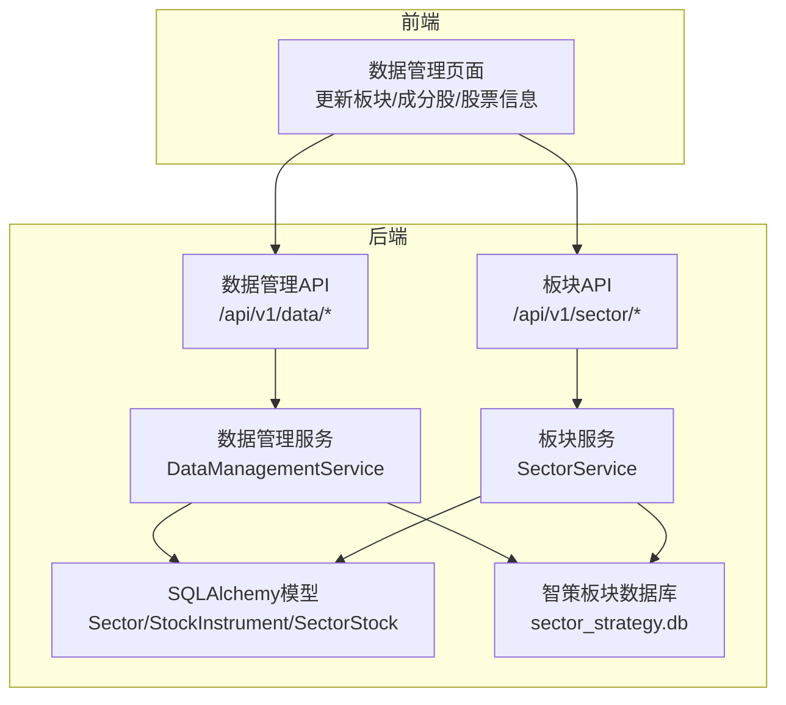
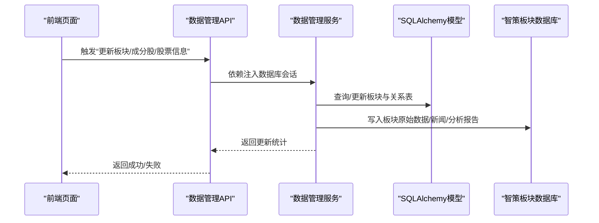
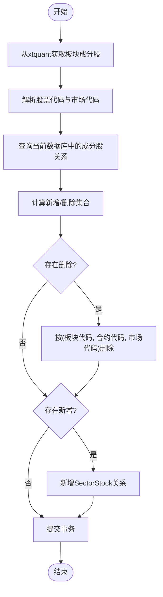
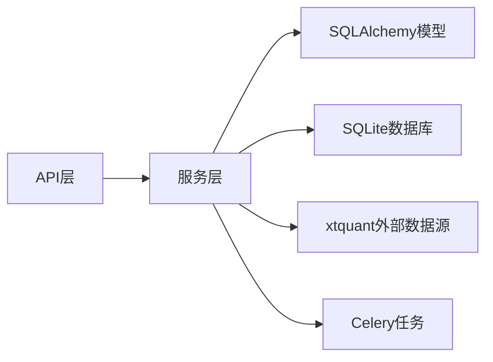

# 板块分析模型

<cite>
**本文引用的文件**
- [backend/app/models/sector.py](file://backend/app/models/sector.py)
- [backend/app/db/sector_db.py](file://backend/app/db/sector_db.py)
- [backend/app/services/data_management_service.py](file://backend/app/services/data_management_service.py)
- [backend/app/api/v1/data_management.py](file://backend/app/api/v1/data_management.py)
- [backend/app/api/v1/sector.py](file://backend/app/api/v1/sector.py)
- [backend/app/services/sector_service.py](file://backend/app/services/sector_service.py)
- [backend/app/times/sector_tasks.py](file://backend/app/times/sector_tasks.py)
- [backend/app/models/analysis.py](file://backend/app/models/analysis.py)
- [frontend/src/views/data/index.vue](file://frontend/src/views/data/index.vue)
- [frontend/src/api/data_management.js](file://frontend/src/api/data_management.js)
- [docs/数据源冗余机制使用指南.md](file://docs/数据源冗余机制使用指南.md)
</cite>

## 目录
1. [简介](#简介)
2. [项目结构](#项目结构)
3. [核心组件](#核心组件)
4. [架构总览](#架构总览)
5. [详细组件分析](#详细组件分析)
6. [依赖关系分析](#依赖关系分析)
7. [性能考虑](#性能考虑)
8. [故障排查指南](#故障排查指南)
9. [结论](#结论)
10. [附录](#附录)

## 简介
本技术文档围绕“板块分析数据模型”展开，系统性阐述 Sector 实体字段定义、板块与股票的多对多关系映射、动态成分股管理策略、板块评分与趋势分析结果的存储格式与更新频率，并提供面向快速板块轮动分析的数据库查询优化建议（物化视图与预计算汇总表设计思路）、数据一致性维护与外部数据源同步方案。文档同时给出关键文件与调用链路，帮助读者快速定位实现位置与扩展点。

## 项目结构
板块分析相关能力由后端模型层、数据库层、服务层、API 层与前端交互层协同实现；同时包含独立的“智策板块数据库模块”，用于历史数据、新闻、分析报告与追踪表的持久化与版本管理。

图表来源
- [backend/app/api/v1/data_management.py](file://backend/app/api/v1/data_management.py#L35-L71)
- [backend/app/api/v1/sector.py](file://backend/app/api/v1/sector.py#L1-L107)
- [backend/app/services/data_management_service.py](file://backend/app/services/data_management_service.py#L140-L286)
- [backend/app/services/sector_service.py](file://backend/app/services/sector_service.py#L1-L48)
- [backend/app/models/sector.py](file://backend/app/models/sector.py#L1-L98)
- [backend/app/db/sector_db.py](file://backend/app/db/sector_db.py#L1-L148)

章节来源
- [backend/app/api/v1/data_management.py](file://backend/app/api/v1/data_management.py#L35-L71)
- [backend/app/api/v1/sector.py](file://backend/app/api/v1/sector.py#L1-L107)
- [backend/app/services/data_management_service.py](file://backend/app/services/data_management_service.py#L140-L286)
- [backend/app/services/sector_service.py](file://backend/app/services/sector_service.py#L1-L48)
- [backend/app/models/sector.py](file://backend/app/models/sector.py#L1-L98)
- [backend/app/db/sector_db.py](file://backend/app/db/sector_db.py#L1-L148)

## 核心组件
- Sector 实体：板块基础信息，包含唯一板块代码、名称、类别、描述及时间戳。
- StockInstrument 实体：股票合约基础信息（精简版），用于与板块-股票关系表配合。
- SectorStock 关系表：板块与股票的多对多关系，通过板块代码与股票合约代码/市场代码联合索引保证唯一性与查询效率。
- 智策板块数据库模块：以 SQLite 为核心，提供板块原始数据、新闻数据、分析报告、追踪表与数据版本管理，支持版本号生成、最新数据读取、清理旧数据等能力。
- 数据管理服务：负责从外部数据源（xtquant）拉取板块与成分股，执行新增/删除关系的同步更新。
- 板块服务与API：提供板块分析、定时任务、手动触发、历史报告、PDF生成等接口占位。
- 前端交互：提供“更新板块/成分股/股票信息”的按钮与分页查询接口。

章节来源
- [backend/app/models/sector.py](file://backend/app/models/sector.py#L1-L98)
- [backend/app/db/sector_db.py](file://backend/app/db/sector_db.py#L1-L148)
- [backend/app/services/data_management_service.py](file://backend/app/services/data_management_service.py#L140-L286)
- [frontend/src/views/data/index.vue](file://frontend/src/views/data/index.vue#L197-L369)
- [frontend/src/api/data_management.js](file://frontend/src/api/data_management.js#L1-L49)

## 架构总览
板块分析的端到端流程如下：
- 前端触发“更新板块/成分股/股票信息”；
- API 层接收请求并注入数据库会话；
- 服务层调用 SQLAlchemy 模型与智策板块数据库模块；
- 数据管理服务通过 xtquant 获取板块与成分股，计算差异并更新 SectorStock 关系表；
- 智策板块数据库模块负责板块原始数据、新闻、分析报告与追踪表的版本化存储与清理；
- 板块服务与API提供分析、定时任务、历史报告等能力占位，等待实现。

图表来源
- [frontend/src/views/data/index.vue](file://frontend/src/views/data/index.vue#L197-L369)
- [frontend/src/api/data_management.js](file://frontend/src/api/data_management.js#L1-L49)
- [backend/app/api/v1/data_management.py](file://backend/app/api/v1/data_management.py#L35-L71)
- [backend/app/services/data_management_service.py](file://backend/app/services/data_management_service.py#L140-L286)
- [backend/app/db/sector_db.py](file://backend/app/db/sector_db.py#L1-L148)

## 详细组件分析

### Sector 实体与字段定义
- 字段说明
  - id：主键，自增，索引。
  - sector_code：板块代码，唯一、索引，用于外部识别与关联。
  - sector_name：板块名称，索引。
  - category：板块类别（行业/概念/地域等），便于筛选与聚合。
  - description：板块描述，便于业务说明。
  - created_at/updated_at：时间戳，默认值与自动更新。
- 在智策板块功能中的角色
  - 作为板块维度的唯一标识，支撑板块评分、趋势分析与轮动策略的维度基准。
  - 与 SectorStock 关系表共同构成板块-股票多对多映射。

章节来源
- [backend/app/models/sector.py](file://backend/app/models/sector.py#L1-L25)

### 板块-股票多对多关系映射与动态成分股管理
- 关系模型
  - SectorStock：记录板块代码与股票合约代码/市场代码的对应关系，具备联合唯一索引，避免重复。
  - StockInstrument：股票合约基础信息（精简版），用于与 SectorStock 的合约字段匹配。
- 动态成分股管理策略
  - 从外部数据源（xtquant）获取板块成分股列表；
  - 计算新旧成分股集合差集，分别执行删除与新增；
  - 对于删除：按板块代码+合约代码+市场代码精确删除；
  - 对于新增：构造 SectorStock 记录并插入；
  - 提交事务，累计统计新增/删除数量。
- 前端触发与接口
  - 前端提供“更新板块/成分股/股票信息”按钮；
  - API 提供更新接口，支持按板块或全量更新；
  - 服务层封装差异计算与数据库操作。

图表来源
- [backend/app/services/data_management_service.py](file://backend/app/services/data_management_service.py#L140-L286)
- [backend/app/models/sector.py](file://backend/app/models/sector.py#L83-L98)
- [frontend/src/views/data/index.vue](file://frontend/src/views/data/index.vue#L197-L369)
- [frontend/src/api/data_management.js](file://frontend/src/api/data_management.js#L1-L49)

章节来源
- [backend/app/services/data_management_service.py](file://backend/app/services/data_management_service.py#L140-L286)
- [backend/app/models/sector.py](file://backend/app/models/sector.py#L83-L98)
- [frontend/src/views/data/index.vue](file://frontend/src/views/data/index.vue#L197-L369)
- [frontend/src/api/data_management.js](file://frontend/src/api/data_management.js#L1-L49)

### 板块评分、趋势分析结果的存储格式与更新频率
- 存储格式
  - 板块原始数据：以“日期+类型+版本号”三元组唯一约束，包含板块代码、名称、价格、涨跌幅、成交量、成交额、总市值、PE/PB 等指标，以及数据类型与版本号。
  - 新闻数据：包含新闻日期、标题、内容、来源、URL、相关板块、情感分、重要性分、版本号。
  - 分析报告：包含分析日期、数据日期范围、分析内容（JSON 字符串或字典）、推荐板块、摘要、置信度、风险等级、投资周期、市场展望等。
  - 追踪表：记录推荐板块的后续表现（推荐日期、推荐价格、目标价、止损价、当前价、盈亏百分比、状态、备注等）。
  - 数据版本管理：记录数据类型、日期、版本、状态、抓取成功标志、错误信息、记录数等。
- 更新频率
  - 智策板块数据库模块提供“保存原始数据/新闻/分析报告”接口，并在保存时生成版本号；“获取最新数据”接口按“最近成功版本”读取。
  - 前端提供“更新板块/成分股/股票信息”按钮，触发服务层更新逻辑；板块分析API占位，等待实现后可接入定时任务与手动触发。
- 版本化与清理
  - 通过 data_versions 表记录每个日期与类型的最新版本，支持清理旧数据（默认保留30天）。

章节来源
- [backend/app/db/sector_db.py](file://backend/app/db/sector_db.py#L1-L148)
- [backend/app/db/sector_db.py](file://backend/app/db/sector_db.py#L149-L313)
- [backend/app/db/sector_db.py](file://backend/app/db/sector_db.py#L314-L461)
- [backend/app/db/sector_db.py](file://backend/app/db/sector_db.py#L462-L543)
- [backend/app/db/sector_db.py](file://backend/app/db/sector_db.py#L544-L696)
- [backend/app/db/sector_db.py](file://backend/app/db/sector_db.py#L697-L815)

### 支持快速板块轮动分析的数据库查询优化
- 索引与唯一约束
  - Sector：sector_code、sector_name 索引；唯一索引保障外部识别一致性。
  - SectorStock：sector_code、合约代码、市场代码联合唯一索引，加速多对多查询与去重。
  - 智策板块数据库：按日期、板块代码、数据类型、版本号建立索引，提升最新数据读取与过滤效率。
- 物化视图与预计算汇总表设计思路
  - 预计算表：按“板块代码+日期”汇总涨跌幅、成交量、成交额、资金流等指标，减少分析时的聚合开销。
  - 物化视图：若数据库支持物化视图，可定期刷新，存储热点查询结果（如近N日涨跌幅排序、热门板块排行）。
  - 缓存策略：利用“最近X小时有效缓存”接口，避免频繁访问磁盘，降低延迟。
- 查询优化建议
  - 使用联合索引过滤（如按日期+类型+版本号）；
  - 采用“版本化读取”策略，避免并发写入导致的脏读；
  - 对高频轮动分析（如涨幅Top N）采用预计算表或物化视图，缩短响应时间。

章节来源
- [backend/app/models/sector.py](file://backend/app/models/sector.py#L1-L25)
- [backend/app/models/sector.py](file://backend/app/models/sector.py#L83-L98)
- [backend/app/db/sector_db.py](file://backend/app/db/sector_db.py#L1-L148)
- [backend/app/db/sector_db.py](file://backend/app/db/sector_db.py#L697-L815)

### 数据一致性维护与外部数据源同步方案
- 外部数据源同步
  - 通过 xtquant 获取板块与成分股，服务层逐板块计算差异并更新数据库，保证关系表与外部数据源一致。
  - 前端提供“更新板块/成分股/股票信息”按钮，支持全量或定向更新。
- 数据一致性
  - SectorStock 联合唯一索引避免重复关系；
  - 智策板块数据库采用“版本号+唯一约束”策略，同一日期+类型+版本的数据仅保留一份，防止并发写入冲突；
  - “获取最新数据”接口优先读取“最近成功版本”，确保分析结果稳定可靠。
- 数据源冗余与容错
  - 文档提供数据源冗余机制使用指南，包含 Akshare/Tushare 的自动切换与容错流程，提升数据获取可用性与稳定性。

章节来源
- [backend/app/services/data_management_service.py](file://backend/app/services/data_management_service.py#L140-L286)
- [frontend/src/views/data/index.vue](file://frontend/src/views/data/index.vue#L197-L369)
- [docs/数据源冗余机制使用指南.md](file://docs/数据源冗余机制使用指南.md#L59-L117)

## 依赖关系分析
- 模块耦合
  - API 层仅依赖服务层，服务层依赖 SQLAlchemy 会话与智策板块数据库模块；
  - 数据管理服务依赖 Sector/SectorStock 模型与外部数据源（xtquant）；
  - 前端通过 API 与后端交互，不直接依赖模型层。
- 外部依赖
  - SQLite 作为本地持久化存储；
  - xtquant 提供板块与成分股数据；
  - Celery 任务框架预留板块分析任务入口。

图表来源
- [backend/app/api/v1/data_management.py](file://backend/app/api/v1/data_management.py#L35-L71)
- [backend/app/api/v1/sector.py](file://backend/app/api/v1/sector.py#L1-L107)
- [backend/app/services/data_management_service.py](file://backend/app/services/data_management_service.py#L140-L286)
- [backend/app/times/sector_tasks.py](file://backend/app/times/sector_tasks.py#L1-L13)

章节来源
- [backend/app/api/v1/data_management.py](file://backend/app/api/v1/data_management.py#L35-L71)
- [backend/app/api/v1/sector.py](file://backend/app/api/v1/sector.py#L1-L107)
- [backend/app/services/data_management_service.py](file://backend/app/services/data_management_service.py#L140-L286)
- [backend/app/times/sector_tasks.py](file://backend/app/times/sector_tasks.py#L1-L13)

## 性能考虑
- 索引与唯一约束：合理使用索引与唯一约束，避免重复与全表扫描。
- 版本化读取：通过 data_versions 表获取最新成功版本，减少并发写入带来的读取冲突。
- 缓存与预计算：利用“最近X小时有效缓存”接口与预计算汇总表/物化视图，降低分析时的聚合成本。
- 批量更新：在更新成分股时，按板块循环处理并一次性提交，减少事务次数。

## 故障排查指南
- 数据源不可用
  - 若 xtquant 不可用，前端会提示检查 QMT 安装、启动与第三方连接权限。
- 数据获取失败
  - 参考数据源冗余机制使用指南，Akshare 失败时自动尝试 Tushare，若均失败，检查 Token 与限额。
- 数据不一致
  - 检查 SectorStock 联合唯一索引是否生效，确认更新流程是否正确执行删除与新增。
- 版本冲突
  - 使用“获取最新数据”接口，确保读取到最近成功版本；必要时清理旧版本数据。

章节来源
- [backend/app/services/data_management_service.py](file://backend/app/services/data_management_service.py#L140-L166)
- [docs/数据源冗余机制使用指南.md](file://docs/数据源冗余机制使用指南.md#L59-L117)

## 结论
本文件系统梳理了板块分析数据模型的字段定义、板块-股票多对多关系映射与动态成分股管理策略，明确了板块评分与趋势分析结果的存储格式与更新频率，并给出了数据库查询优化与数据一致性维护方案。通过前端按钮与 API 的协同，实现了从外部数据源到数据库的闭环同步，为后续板块轮动分析与策略落地提供了坚实的数据基础。

## 附录
- 关键实现位置
  - Sector/StockInstrument/SectorStock 模型定义：[backend/app/models/sector.py](file://backend/app/models/sector.py#L1-L98)
  - 智策板块数据库模块：[backend/app/db/sector_db.py](file://backend/app/db/sector_db.py#L1-L148)
  - 数据管理服务（成分股同步）：[backend/app/services/data_management_service.py](file://backend/app/services/data_management_service.py#L140-L286)
  - 数据管理API：[backend/app/api/v1/data_management.py](file://backend/app/api/v1/data_management.py#L35-L71)
  - 板块API占位：[backend/app/api/v1/sector.py](file://backend/app/api/v1/sector.py#L1-L107)
  - 板块服务占位：[backend/app/services/sector_service.py](file://backend/app/services/sector_service.py#L1-L48)
  - 前端交互：[frontend/src/views/data/index.vue](file://frontend/src/views/data/index.vue#L197-L369)、[frontend/src/api/data_management.js](file://frontend/src/api/data_management.js#L1-L49)
  - 数据源冗余机制：[docs/数据源冗余机制使用指南.md](file://docs/数据源冗余机制使用指南.md#L59-L117)