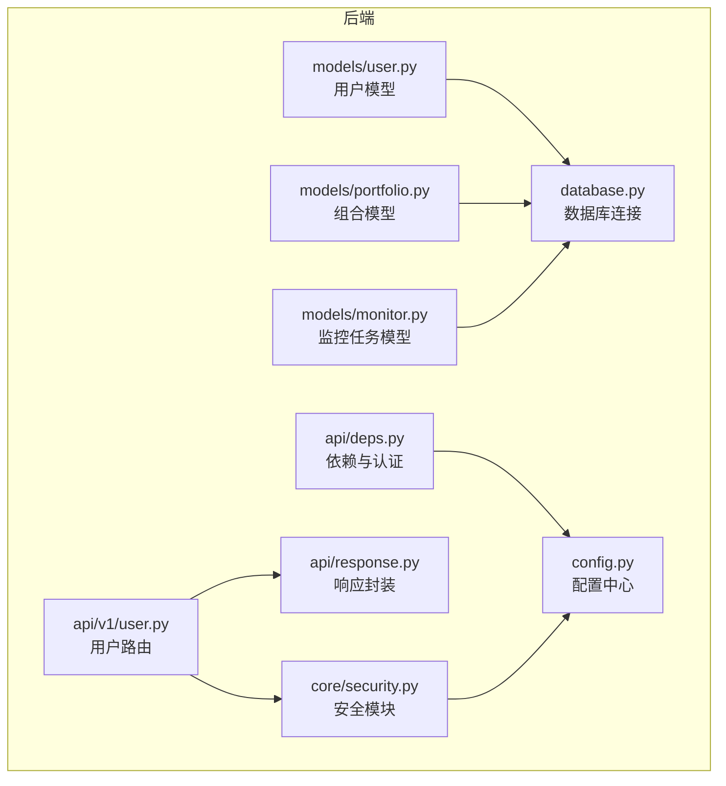
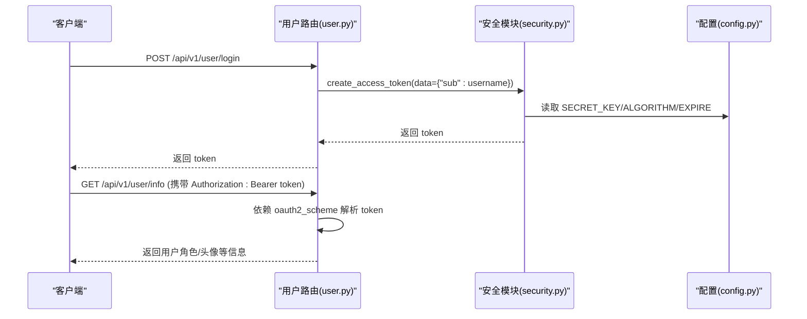
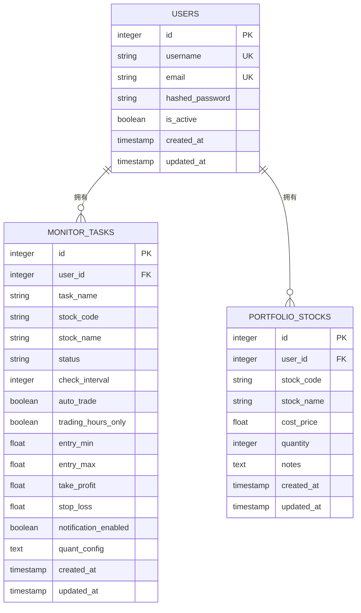
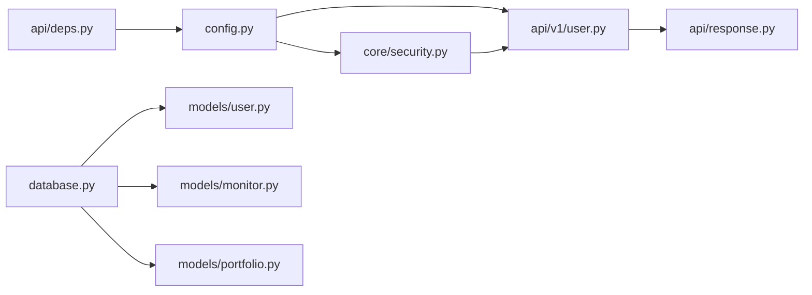

# 用户模型

<cite>
**本文引用的文件**
- [backend/app/models/user.py](file://backend/app/models/user.py)
- [backend/app/models/portfolio.py](file://backend/app/models/portfolio.py)
- [backend/app/models/monitor.py](file://backend/app/models/monitor.py)
- [backend/app/api/v1/user.py](file://backend/app/api/v1/user.py)
- [backend/app/core/security.py](file://backend/app/core/security.py)
- [backend/app/database.py](file://backend/app/database.py)
- [backend/app/config.py](file://backend/app/config.py)
- [backend/app/api/deps.py](file://backend/app/api/deps.py)
- [backend/app/api/response.py](file://backend/app/api/response.py)
- [backend/alembic/versions/001_add_monitor_task_fields.py](file://backend/alembic/versions/001_add_monitor_task_fields.py)
</cite>

## 目录
1. [简介](#简介)
2. [项目结构](#项目结构)
3. [核心组件](#核心组件)
4. [架构总览](#架构总览)
5. [详细组件分析](#详细组件分析)
6. [依赖分析](#依赖分析)
7. [性能考虑](#性能考虑)
8. [故障排除指南](#故障排除指南)
9. [结论](#结论)
10. [附录](#附录)

## 简介
本文件围绕用户数据模型进行系统化梳理，覆盖字段定义、数据类型、约束与业务含义；说明用户模型与 Portfolio、MonitorTask 的一对多关系与外键关联机制；给出数据库表结构示意与索引设计说明；解释用户模型在 JWT 认证与权限控制中的作用；并提供账户生命周期管理策略（如账户禁用与软删除）与安全访问最佳实践（密码哈希存储与敏感信息脱敏）。

## 项目结构
用户模型位于后端 SQLAlchemy ORM 层，配合 FastAPI 路由与安全模块共同构成认证与权限体系。数据库连接与声明基类由独立模块提供，配置中心集中管理密钥与算法参数。

图表来源
- [backend/app/models/user.py](file://backend/app/models/user.py#L1-L21)
- [backend/app/models/portfolio.py](file://backend/app/models/portfolio.py#L1-L22)
- [backend/app/models/monitor.py](file://backend/app/models/monitor.py#L1-L39)
- [backend/app/core/security.py](file://backend/app/core/security.py#L1-L38)
- [backend/app/config.py](file://backend/app/config.py#L1-L92)
- [backend/app/database.py](file://backend/app/database.py#L1-L45)
- [backend/app/api/v1/user.py](file://backend/app/api/v1/user.py#L1-L39)
- [backend/app/api/deps.py](file://backend/app/api/deps.py#L1-L59)
- [backend/app/api/response.py](file://backend/app/api/response.py#L1-L31)

章节来源
- [backend/app/models/user.py](file://backend/app/models/user.py#L1-L21)
- [backend/app/database.py](file://backend/app/database.py#L1-L45)
- [backend/app/config.py](file://backend/app/config.py#L1-L92)

## 核心组件
- 用户模型（User）：定义用户标识、凭证、状态与时间戳字段，具备唯一性与索引约束。
- 安全模块（Security）：提供密码哈希、密码校验与 JWT 令牌签发。
- 配置中心（Config）：集中管理数据库 URL、JWT 密钥、算法与过期时间等。
- 数据库连接（Database）：统一创建引擎、会话工厂与声明基类。
- 用户路由（API v1 user）：提供登录、获取用户信息与登出接口。
- 依赖与认证（API deps）：提供 OAuth2 密码流与 JWT 解码依赖。
- 统一响应（API response）：封装成功/失败响应格式。

章节来源
- [backend/app/models/user.py](file://backend/app/models/user.py#L1-L21)
- [backend/app/core/security.py](file://backend/app/core/security.py#L1-L38)
- [backend/app/config.py](file://backend/app/config.py#L1-L92)
- [backend/app/database.py](file://backend/app/database.py#L1-L45)
- [backend/app/api/v1/user.py](file://backend/app/api/v1/user.py#L1-L39)
- [backend/app/api/deps.py](file://backend/app/api/deps.py#L1-L59)
- [backend/app/api/response.py](file://backend/app/api/response.py#L1-L31)

## 架构总览
用户模型通过 ORM 映射到数据库表 users，并与监控任务表 monitor_tasks 形成一对多关系（一个用户可拥有多个监控任务）。认证流程基于 JWT，前端通过 Bearer Token 访问受保护资源。

图表来源
- [backend/app/api/v1/user.py](file://backend/app/api/v1/user.py#L1-L39)
- [backend/app/core/security.py](file://backend/app/core/security.py#L1-L38)
- [backend/app/config.py](file://backend/app/config.py#L1-L92)

## 详细组件分析

### 用户模型字段定义与约束
- 字段与类型
  - id: 整型，主键，带索引
  - username: 字符串，长度上限 50，唯一且带索引
  - email: 字符串，长度上限 100，唯一且带索引
  - hashed_password: 字符串，长度上限 255，用于存储加密后的密码
  - is_active: 布尔，默认 True，表示账户是否激活
  - created_at: 时间戳，默认服务器当前时间
  - updated_at: 时间戳，更新时自动写入当前时间
- 约束与业务含义
  - 唯一性：username 与 email 均唯一，确保用户标识不重复
  - 激活状态：is_active 支持账户禁用/启用
  - 时间戳：created_at/updated_at 记录创建与更新时间，便于审计与排序
- 索引设计
  - 主键索引：id
  - 唯一索引：username、email
  - 普通索引：id（主键已隐含），可用于查询加速

章节来源
- [backend/app/models/user.py](file://backend/app/models/user.py#L1-L21)

### 用户与监控任务的关系（一对多）
- 关系说明
  - 一个用户可创建多个监控任务；每个监控任务属于一个用户
  - 外键关联：monitor_tasks 表需包含指向 users.id 的外键列（当前模型未显式声明外键，但业务上应建立）
- 关联字段
  - monitor_tasks 中应包含 user_id 外键字段，指向 users.id
  - 可选：在 ORM 层通过 relationship 建立反向引用（当前模型未显式声明）
- 约束与一致性
  - 删除用户时，建议采用级联删除或置空外键策略，以保证数据一致性

章节来源
- [backend/app/models/monitor.py](file://backend/app/models/monitor.py#L1-L39)

### 用户与组合（Portfolio）的关系
- 关系说明
  - 一个用户可拥有多个组合（PortfolioStock 等），形成一对多关系
  - 外键关联：PortfolioStock 表需包含指向 users.id 的外键列（当前模型未显式声明外键）
- 关联字段
  - PortfolioStock 中应包含 user_id 外键字段，指向 users.id
- 约束与一致性
  - 删除用户时，建议采用级联删除或置空外键策略

章节来源
- [backend/app/models/portfolio.py](file://backend/app/models/portfolio.py#L1-L22)

### 数据库表结构示意

图表来源
- [backend/app/models/user.py](file://backend/app/models/user.py#L1-L21)
- [backend/app/models/monitor.py](file://backend/app/models/monitor.py#L1-L39)
- [backend/app/models/portfolio.py](file://backend/app/models/portfolio.py#L1-L22)

### JWT 认证与权限控制
- 登录流程
  - 客户端提交用户名与密码
  - 后端验证成功后签发 JWT，载荷包含 sub（用户标识）
- 令牌解析
  - 依赖 OAuth2PasswordBearer 指定 tokenUrl
  - 使用配置中的 SECRET_KEY 与 ALGORITHM 对 token 进行解码
- 权限控制
  - 当前路由示例返回固定角色信息（如 admin），实际项目应结合数据库用户表与角色映射实现 RBAC
- 安全要点
  - 使用 HTTPS 传输
  - 控制 ACCESS_TOKEN_EXPIRE_MINUTES
  - 前端妥善保存 token，避免泄露

章节来源
- [backend/app/api/v1/user.py](file://backend/app/api/v1/user.py#L1-L39)
- [backend/app/core/security.py](file://backend/app/core/security.py#L1-L38)
- [backend/app/config.py](file://backend/app/config.py#L1-L92)
- [backend/app/api/deps.py](file://backend/app/api/deps.py#L1-L59)

### 用户数据生命周期管理
- 账户禁用
  - 通过 is_active 字段控制用户是否可用
- 软删除
  - 建议新增 deleted_at 字段与 is_deleted 标记位，配合查询过滤实现软删除
- 硬删除
  - 删除用户时，需同步删除其关联的监控任务与组合数据（或置空外键）
- 审计与归档
  - 建议保留 created_at/updated_at 并定期归档历史数据

章节来源
- [backend/app/models/user.py](file://backend/app/models/user.py#L1-L21)

### 安全访问最佳实践
- 密码存储
  - 使用 bcrypt 进行哈希存储，禁止明文保存
  - 提供 verify_password 校验函数
- 敏感信息脱敏
  - 响应中避免返回 hashed_password
  - 日志中避免输出 token 与密码
- 传输安全
  - 强制 HTTPS
  - 配置 CORS 白名单
- 令牌管理
  - 设置合理过期时间
  - 提供刷新机制（当前路由未实现，建议补充）
- 输入验证与 SQL 注入防护
  - 使用 ORM 与 Pydantic 验证
  - 避免拼接 SQL

章节来源
- [backend/app/core/security.py](file://backend/app/core/security.py#L1-L38)
- [backend/app/api/response.py](file://backend/app/api/response.py#L1-L31)
- [backend/app/config.py](file://backend/app/config.py#L1-L92)

## 依赖分析
- 模块耦合
  - models 依赖 database 的 Base
  - api 路由依赖 security 与 response
  - security 依赖 config
  - deps 依赖 config 与 database
- 外键关系
  - monitor_tasks 与 portfolio_stocks 应显式声明 user_id 外键
- 迁移与演进
  - monitor_tasks 新增字段通过 Alembic 版本脚本管理

图表来源
- [backend/app/config.py](file://backend/app/config.py#L1-L92)
- [backend/app/core/security.py](file://backend/app/core/security.py#L1-L38)
- [backend/app/api/v1/user.py](file://backend/app/api/v1/user.py#L1-L39)
- [backend/app/api/response.py](file://backend/app/api/response.py#L1-L31)
- [backend/app/api/deps.py](file://backend/app/api/deps.py#L1-L59)
- [backend/app/database.py](file://backend/app/database.py#L1-L45)
- [backend/app/models/user.py](file://backend/app/models/user.py#L1-L21)
- [backend/app/models/monitor.py](file://backend/app/models/monitor.py#L1-L39)
- [backend/app/models/portfolio.py](file://backend/app/models/portfolio.py#L1-L22)

章节来源
- [backend/app/models/user.py](file://backend/app/models/user.py#L1-L21)
- [backend/app/models/monitor.py](file://backend/app/models/monitor.py#L1-L39)
- [backend/app/models/portfolio.py](file://backend/app/models/portfolio.py#L1-L22)
- [backend/alembic/versions/001_add_monitor_task_fields.py](file://backend/alembic/versions/001_add_monitor_task_fields.py#L1-L44)

## 性能考虑
- 索引优化
  - 为 username、email 建立唯一索引，提升登录与查询效率
  - 为 monitor_tasks 与 portfolio_stocks 的 user_id 建立普通索引，加速按用户筛选
- 查询优化
  - 避免 N+1 查询，使用 join 或预加载
  - 对高频查询字段增加复合索引（如 user_id + created_at）
- 缓存策略
  - 将用户基本信息与角色缓存至 Redis，降低数据库压力
- 事务与连接池
  - 合理配置连接池大小与超时，避免阻塞

## 故障排除指南
- 登录失败
  - 检查用户名/密码是否正确
  - 确认 SECRET_KEY、ALGORITHM 与 ACCESS_TOKEN_EXPIRE_MINUTES 配置
- 令牌无效
  - 确认 Authorization 头格式为 Bearer <token>
  - 校验 token 是否过期
- 数据库连接异常
  - 检查 DATABASE_URL 与 SQLite 路径权限
- 外键约束错误
  - 确认 monitor_tasks 与 portfolio_stocks 的 user_id 外键存在
  - 删除用户前清理其关联数据

章节来源
- [backend/app/api/v1/user.py](file://backend/app/api/v1/user.py#L1-L39)
- [backend/app/api/deps.py](file://backend/app/api/deps.py#L1-L59)
- [backend/app/config.py](file://backend/app/config.py#L1-L92)
- [backend/app/database.py](file://backend/app/database.py#L1-L45)

## 结论
用户模型提供了基础的身份标识、凭证与状态管理能力。结合 JWT 认证与权限控制，可支撑系统的安全访问。建议在现有模型基础上补充外键关系、软删除与角色权限体系，并完善令牌刷新与缓存策略，以满足生产环境的安全与性能需求。

## 附录

### 字段与约束对照表
- users 表
  - id: 整型，主键，索引
  - username: 字符串(50)，唯一，索引
  - email: 字符串(100)，唯一，索引
  - hashed_password: 字符串(255)
  - is_active: 布尔，默认 True
  - created_at: 时间戳，默认服务器当前时间
  - updated_at: 时间戳，更新时自动写入
- monitor_tasks 表
  - user_id: 外键，指向 users.id（建议显式声明）
  - 其他字段详见模型定义
- portfolio_stocks 表
  - user_id: 外键，指向 users.id（建议显式声明）
  - 其他字段详见模型定义

章节来源
- [backend/app/models/user.py](file://backend/app/models/user.py#L1-L21)
- [backend/app/models/monitor.py](file://backend/app/models/monitor.py#L1-L39)
- [backend/app/models/portfolio.py](file://backend/app/models/portfolio.py#L1-L22)