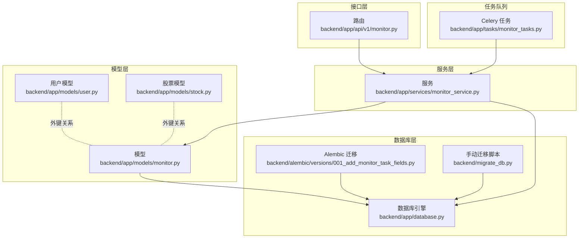
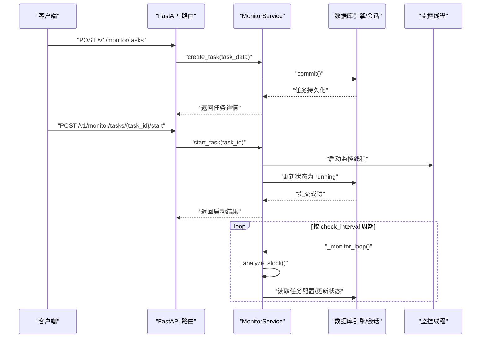
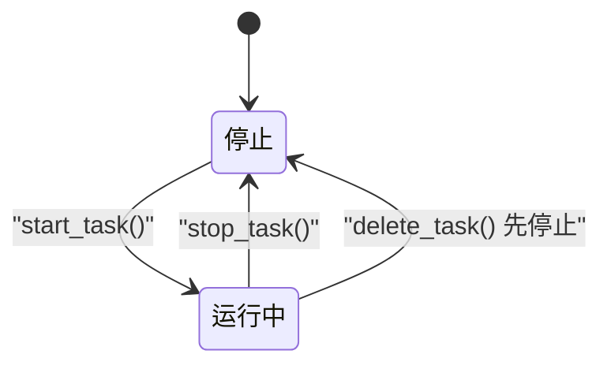
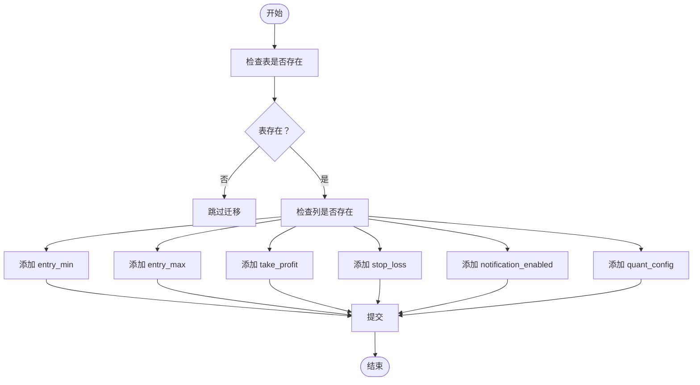
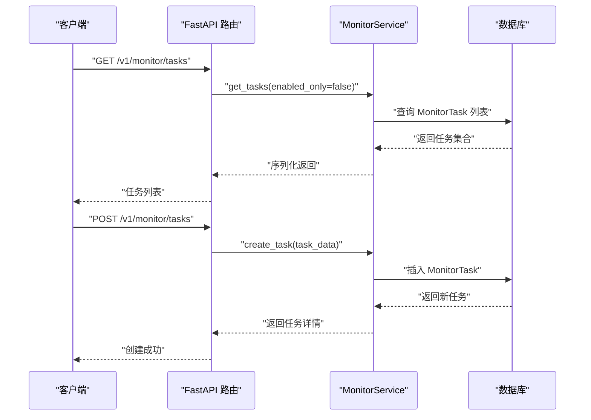
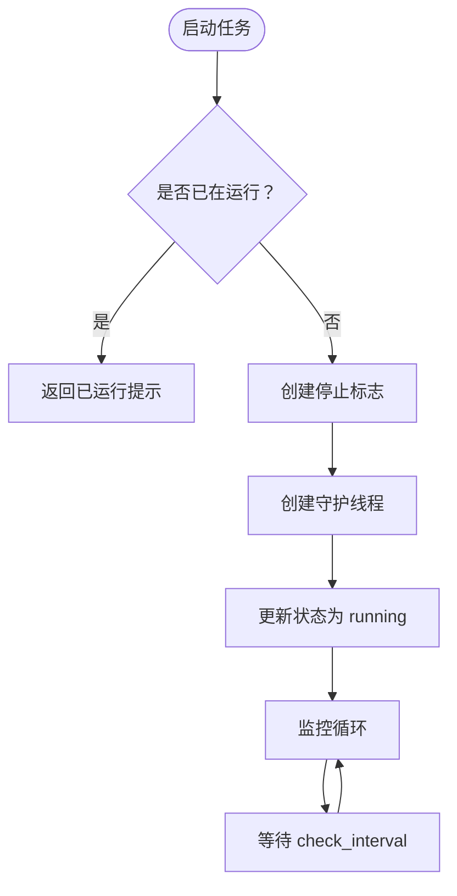
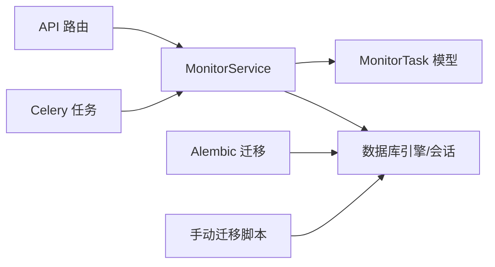

# 监测任务模型

<cite>
**本文引用的文件**
- [backend/app/models/monitor.py](file://backend/app/models/monitor.py)
- [backend/app/schemas/monitor.py](file://backend/app/schemas/monitor.py)
- [backend/app/services/monitor_service.py](file://backend/app/services/monitor_service.py)
- [backend/app/api/v1/monitor.py](file://backend/app/api/v1/monitor.py)
- [backend/app/database.py](file://backend/app/database.py)
- [backend/alembic/versions/001_add_monitor_task_fields.py](file://backend/alembic/versions/001_add_monitor_task_fields.py)
- [backend/migrate_db.py](file://backend/migrate_db.py)
- [backend/app/tasks/monitor_tasks.py](file://backend/app/tasks/monitor_tasks.py)
- [backend/app/models/user.py](file://backend/app/models/user.py)
- [backend/app/models/stock.py](file://backend/app/models/stock.py)
</cite>

## 目录
1. [简介](#简介)
2. [项目结构](#项目结构)
3. [核心组件](#核心组件)
4. [架构总览](#架构总览)
5. [详细组件分析](#详细组件分析)
6. [依赖关系分析](#依赖关系分析)
7. [性能考虑](#性能考虑)
8. [故障排查指南](#故障排查指南)
9. [结论](#结论)
10. [附录](#附录)

## 简介
本文件围绕“监测任务数据模型”进行系统化深度文档化，重点覆盖：
- MonitorTask 实体字段结构与用途
- 状态机流转逻辑与触发条件表达式存储方式
- 与用户、股票的外键关系及级联删除行为
- 基于 Alembic 的字段演进与版本控制策略
- 实时监测场景下的高并发读写优化方案（含 Redis 缓存与数据库同步机制）
- 任务调度与状态更新的事务处理最佳实践

## 项目结构
监测任务相关代码主要分布在以下模块：
- 数据模型层：MonitorTask 定义于 ORM 模型文件
- 接口层：FastAPI 路由提供任务 CRUD、启停、状态查询等接口
- 服务层：MonitorService 提供业务逻辑、状态管理、线程调度
- 数据库层：Alembic 迁移脚本与手动迁移工具
- 任务队列：Celery 任务占位，未来扩展异步监测任务
- 数据库连接：SQLAlchemy 引擎与会话工厂

图表来源
- [backend/app/api/v1/monitor.py](file://backend/app/api/v1/monitor.py#L1-L135)
- [backend/app/services/monitor_service.py](file://backend/app/services/monitor_service.py#L1-L733)
- [backend/app/models/monitor.py](file://backend/app/models/monitor.py#L1-L39)
- [backend/app/models/user.py](file://backend/app/models/user.py#L1-L21)
- [backend/app/models/stock.py](file://backend/app/models/stock.py#L1-L26)
- [backend/app/database.py](file://backend/app/database.py#L1-L45)
- [backend/alembic/versions/001_add_monitor_task_fields.py](file://backend/alembic/versions/001_add_monitor_task_fields.py#L1-L44)
- [backend/migrate_db.py](file://backend/migrate_db.py#L1-L67)
- [backend/app/tasks/monitor_tasks.py](file://backend/app/tasks/monitor_tasks.py#L1-L13)

章节来源
- [backend/app/api/v1/monitor.py](file://backend/app/api/v1/monitor.py#L1-L135)
- [backend/app/services/monitor_service.py](file://backend/app/services/monitor_service.py#L1-L733)
- [backend/app/models/monitor.py](file://backend/app/models/monitor.py#L1-L39)
- [backend/app/database.py](file://backend/app/database.py#L1-L45)

## 核心组件
- MonitorTask 实体：定义监测任务的持久化字段，包括基础信息、风控区间、通知开关、量化配置等
- MonitorService：封装任务生命周期管理、状态机流转、线程调度、与外部数据/交易接口交互
- FastAPI 路由：提供任务 CRUD、启停、状态查询等 API
- Alembic 迁移：用于添加/回滚 MonitorTask 新增字段
- Celery 任务：当前为占位，未来可用于异步监测任务

章节来源
- [backend/app/models/monitor.py](file://backend/app/models/monitor.py#L1-L39)
- [backend/app/services/monitor_service.py](file://backend/app/services/monitor_service.py#L1-L733)
- [backend/app/api/v1/monitor.py](file://backend/app/api/v1/monitor.py#L1-L135)
- [backend/alembic/versions/001_add_monitor_task_fields.py](file://backend/alembic/versions/001_add_monitor_task_fields.py#L1-L44)
- [backend/app/tasks/monitor_tasks.py](file://backend/app/tasks/monitor_tasks.py#L1-L13)

## 架构总览
监测任务的端到端流程如下：
- API 层接收请求，调用服务层
- 服务层通过 SQLAlchemy 会话访问数据库，读写 MonitorTask
- 服务层维护线程池，按任务配置周期性执行监测逻辑
- 量化配置以 JSON 文本形式存储，便于灵活扩展策略

图表来源
- [backend/app/api/v1/monitor.py](file://backend/app/api/v1/monitor.py#L1-L135)
- [backend/app/services/monitor_service.py](file://backend/app/services/monitor_service.py#L1-L733)
- [backend/app/database.py](file://backend/app/database.py#L1-L45)

## 详细组件分析

### MonitorTask 实体字段结构与用途
- 基础信息
  - id：主键，索引
  - task_name：任务名称
  - stock_code、stock_name：股票代码与名称
  - status：任务状态（running/stopped），用于控制线程启停
  - check_interval：检查间隔（秒）
  - auto_trade：是否自动交易
  - trading_hours_only：是否仅交易时段监控
- 进场区间
  - entry_min、entry_max：进场最低/最高价（元）
- 止盈止损
  - take_profit、stop_loss：止盈/止损价位（元）
- 通知设置
  - notification_enabled：是否启用通知
- 量化配置
  - quant_config：JSON 字符串，存储策略配置，便于灵活扩展
- 时间戳
  - created_at、updated_at：自动维护

字段复杂度与索引
- stock_code 建有索引，便于按股票维度检索
- id 建有索引，作为主键索引
- created_at 使用服务器默认值，便于排序与审计

章节来源
- [backend/app/models/monitor.py](file://backend/app/models/monitor.py#L1-L39)

### 状态机流转逻辑
- 状态集合：running、stopped
- 触发条件
  - 启动：调用 start_task，若线程未运行则创建线程并更新状态为 running
  - 停止：调用 stop_task，停止线程并更新状态为 stopped
  - 删除：若任务正在运行，先停止再删除
- 线程管理
  - 使用类级字典维护监控线程与停止标志
  - 线程以守护线程方式运行，按 check_interval 等待
  - 监控循环内调用分析方法，异常时记录日志

图表来源
- [backend/app/services/monitor_service.py](file://backend/app/services/monitor_service.py#L309-L389)

章节来源
- [backend/app/services/monitor_service.py](file://backend/app/services/monitor_service.py#L309-L389)

### 触发条件表达式存储方式
- 进场区间：entry_min、entry_max 以数值字段存储，表示价格范围
- 止盈止损：take_profit、stop_loss 以数值字段存储，表示目标价位
- 通知开关：notification_enabled 以布尔字段存储
- 量化配置：quant_config 以 Text 字段存储 JSON，便于动态扩展策略参数
- 交易时段：trading_hours_only 以布尔字段存储，控制是否仅在交易时段执行

注意
- 该实现采用“数值阈值 + 开关”的直接存储方式；若需更复杂的表达式（如多条件组合、跨字段比较），可在 quant_config 中以结构化 JSON 表达，并在服务层解析执行。

章节来源
- [backend/app/models/monitor.py](file://backend/app/models/monitor.py#L1-L39)
- [backend/app/services/monitor_service.py](file://backend/app/services/monitor_service.py#L119-L204)

### 与用户、股票的外键关系及级联删除行为
- 用户关系：当前模型未显式声明 user_id 外键，也未定义级联删除行为
- 股票关系：当前模型未显式声明 stock_id 外键，也未定义级联删除行为
- 影响
  - 若未来引入 user_id 或 stock_id 外键，应在 Alembic 迁移中显式声明
  - 级联删除需谨慎设计，避免误删关联数据

章节来源
- [backend/app/models/monitor.py](file://backend/app/models/monitor.py#L1-L39)
- [backend/app/models/user.py](file://backend/app/models/user.py#L1-L21)
- [backend/app/models/stock.py](file://backend/app/models/stock.py#L1-L26)

### 字段演进与版本控制策略（基于 Alembic）
- 版本脚本 001：新增进场区间、止盈止损、通知开关、量化配置字段
- 升级流程：执行 upgrade() 添加列
- 回滚流程：执行 downgrade() 删除列
- 手动迁移：提供 migrate_db.py 用于 SQLite 环境的增量迁移

图表来源
- [backend/alembic/versions/001_add_monitor_task_fields.py](file://backend/alembic/versions/001_add_monitor_task_fields.py#L1-L44)
- [backend/migrate_db.py](file://backend/migrate_db.py#L1-L67)

章节来源
- [backend/alembic/versions/001_add_monitor_task_fields.py](file://backend/alembic/versions/001_add_monitor_task_fields.py#L1-L44)
- [backend/migrate_db.py](file://backend/migrate_db.py#L1-L67)

### API 与服务交互流程
- GET /v1/monitor/tasks：获取任务列表，支持按状态过滤
- POST /v1/monitor/tasks：创建任务，校验唯一性并持久化
- PUT /v1/monitor/tasks/{task_id}：更新任务，支持部分字段更新
- DELETE /v1/monitor/tasks/{task_id}：删除任务，必要时先停止线程
- POST /v1/monitor/tasks/{task_id}/start：启动任务线程并更新状态
- POST /v1/monitor/tasks/{task_id}/stop：停止任务线程并更新状态
- GET /v1/monitor/tasks/{task_id}/status：查询任务状态与运行态

图表来源
- [backend/app/api/v1/monitor.py](file://backend/app/api/v1/monitor.py#L1-L135)
- [backend/app/services/monitor_service.py](file://backend/app/services/monitor_service.py#L65-L118)

章节来源
- [backend/app/api/v1/monitor.py](file://backend/app/api/v1/monitor.py#L1-L135)
- [backend/app/services/monitor_service.py](file://backend/app/services/monitor_service.py#L65-L118)

### 量化配置与 JSON 存储
- 存储方式：quant_config 以 Text 字段存储 JSON 字符串
- 读取流程：服务层在返回前尝试解析 JSON，失败时置空
- 写入流程：服务层在入库前将字典序列化为 JSON 字符串
- 优点：灵活扩展策略参数，无需频繁变更表结构
- 注意：需保证 JSON 结构一致性与校验

章节来源
- [backend/app/models/monitor.py](file://backend/app/models/monitor.py#L1-L39)
- [backend/app/services/monitor_service.py](file://backend/app/services/monitor_service.py#L119-L204)

### 任务调度与线程模型
- 线程管理：类级字典维护监控线程与停止标志
- 启动：创建守护线程，设置停止标志，启动后更新状态为 running
- 停止：设置停止标志，等待线程结束并清理资源
- 循环：按 check_interval 等待，期间执行分析逻辑

图表来源
- [backend/app/services/monitor_service.py](file://backend/app/services/monitor_service.py#L518-L608)

章节来源
- [backend/app/services/monitor_service.py](file://backend/app/services/monitor_service.py#L518-L608)

### Celery 任务占位
- 文件中定义了 monitor_stock_task 占位任务，未来可用于异步监测任务
- 当前未与 MonitorTask 状态机耦合，可作为补充扩展点

章节来源
- [backend/app/tasks/monitor_tasks.py](file://backend/app/tasks/monitor_tasks.py#L1-L13)

## 依赖关系分析
- MonitorService 依赖 SQLAlchemy 会话与 MonitorTask 模型
- FastAPI 路由依赖 MonitorService
- 数据库引擎由 app/database.py 统一提供
- Alembic 迁移脚本与手动迁移脚本共同保障字段演进

图表来源
- [backend/app/api/v1/monitor.py](file://backend/app/api/v1/monitor.py#L1-L135)
- [backend/app/services/monitor_service.py](file://backend/app/services/monitor_service.py#L1-L733)
- [backend/app/models/monitor.py](file://backend/app/models/monitor.py#L1-L39)
- [backend/app/database.py](file://backend/app/database.py#L1-L45)
- [backend/alembic/versions/001_add_monitor_task_fields.py](file://backend/alembic/versions/001_add_monitor_task_fields.py#L1-L44)
- [backend/migrate_db.py](file://backend/migrate_db.py#L1-L67)
- [backend/app/tasks/monitor_tasks.py](file://backend/app/tasks/monitor_tasks.py#L1-L13)

章节来源
- [backend/app/api/v1/monitor.py](file://backend/app/api/v1/monitor.py#L1-L135)
- [backend/app/services/monitor_service.py](file://backend/app/services/monitor_service.py#L1-L733)
- [backend/app/models/monitor.py](file://backend/app/models/monitor.py#L1-L39)
- [backend/app/database.py](file://backend/app/database.py#L1-L45)

## 性能考虑
- 高并发读写优化
  - 读路径：对 stock_code 建有索引，适合高频按股票维度查询
  - 写路径：事务提交采用 SQLAlchemy 会话，建议在批量写入时合并提交
- Redis 缓存与数据库同步机制（建议）
  - 读缓存：热点任务列表与单任务详情可缓存，设置合理 TTL
  - 写同步：写入数据库后，异步失效对应缓存键，确保最终一致
  - 并发控制：使用分布式锁或队列去重，避免重复写入
- 交易时段优化
  - trading_hours_only 可减少非交易时段的分析次数，降低系统负载
  - 建议在监控循环中加入时段判断逻辑，非交易时段短暂停顿

[本节为通用性能建议，不直接分析具体文件]

## 故障排查指南
- 任务无法启动
  - 检查线程是否已在运行，避免重复启动
  - 查看服务日志，确认数据库连接与会话是否正常
- 任务状态不一致
  - 确认数据库状态字段与内存线程状态是否同步
  - 在启停操作后检查事务是否提交成功
- JSON 配置解析失败
  - 确认 quant_config 为合法 JSON 字符串
  - 服务层已做容错处理，若解析失败将置空
- 数据库迁移失败
  - 检查表是否存在与列是否已存在
  - SQLite 环境可使用手动迁移脚本进行增量添加

章节来源
- [backend/app/services/monitor_service.py](file://backend/app/services/monitor_service.py#L309-L389)
- [backend/migrate_db.py](file://backend/migrate_db.py#L1-L67)

## 结论
- MonitorTask 模型以简洁字段满足实时监测需求，支持价格区间、止盈止损、通知与量化配置的灵活扩展
- 状态机以 running/stopped 为核心，配合线程管理实现启停控制
- 字段演进通过 Alembic 与手动迁移脚本保障，具备可回滚能力
- 建议在生产环境引入 Redis 缓存与数据库同步策略，结合交易时段优化降低系统负载
- 事务处理建议在关键写入点统一捕获异常并回滚，确保数据一致性

[本节为总结性内容，不直接分析具体文件]

## 附录

### 字段演进与版本控制策略（补充）
- 建议在新增外键字段时，同时在 Alembic 中声明外键约束与级联行为
- 对于历史数据，可通过手动迁移脚本或数据修复脚本补齐缺失字段
- 发布前进行迁移演练，确保升级/回滚流程稳定

章节来源
- [backend/alembic/versions/001_add_monitor_task_fields.py](file://backend/alembic/versions/001_add_monitor_task_fields.py#L1-L44)
- [backend/migrate_db.py](file://backend/migrate_db.py#L1-L67)