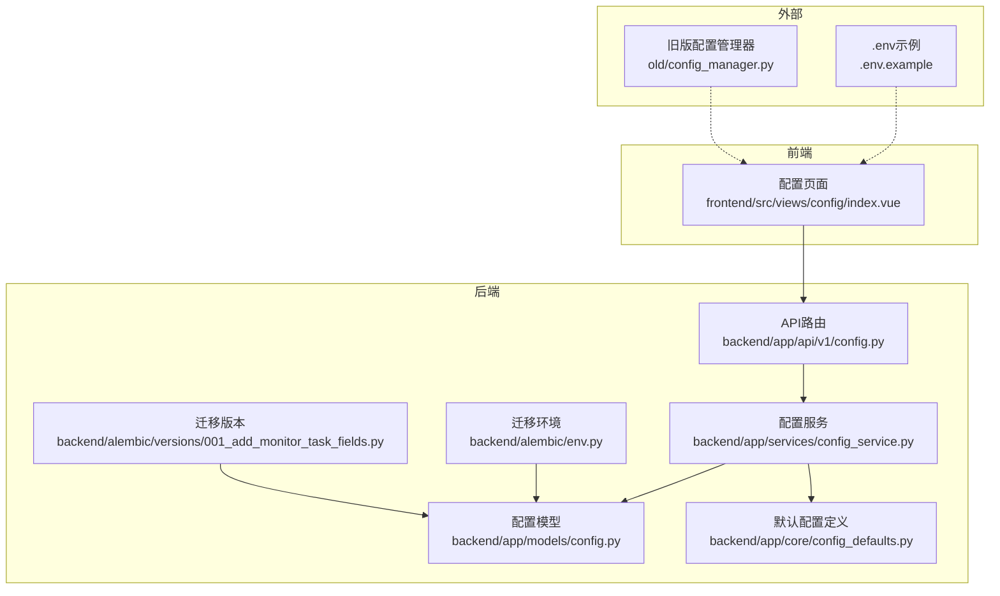
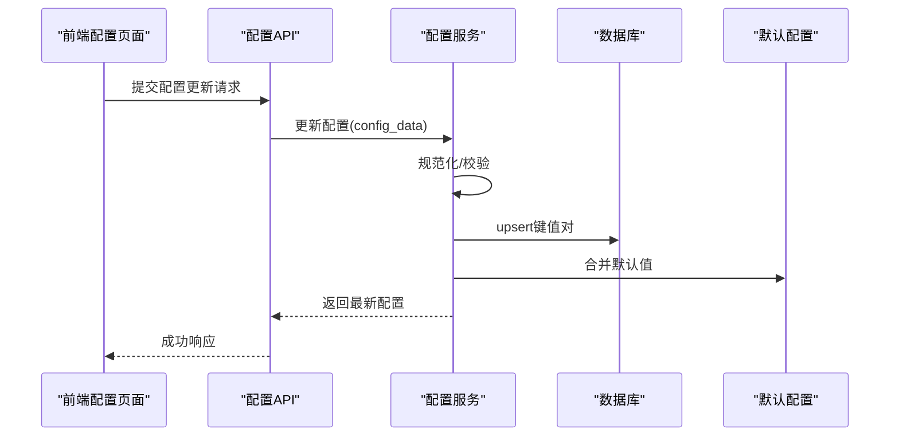
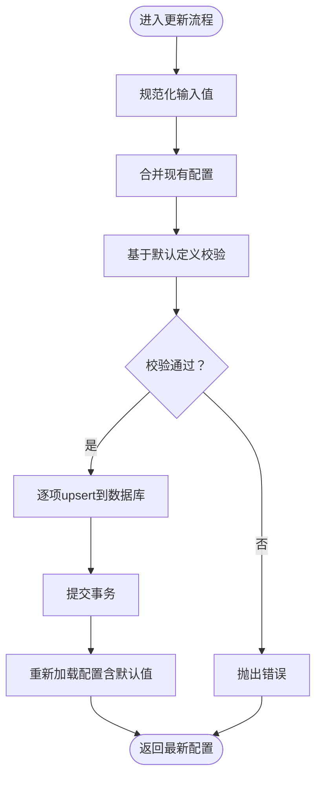
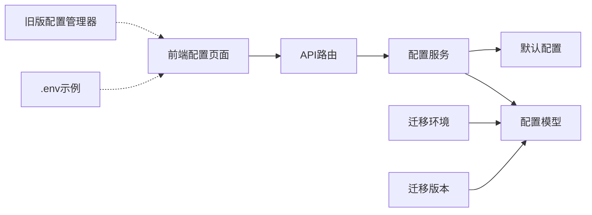

# 系统配置模型

<cite>
**本文引用的文件**
- [backend/app/models/config.py](file://backend/app/models/config.py)
- [backend/app/services/config_service.py](file://backend/app/services/config_service.py)
- [backend/app/core/config_defaults.py](file://backend/app/core/config_defaults.py)
- [backend/app/api/v1/config.py](file://backend/app/api/v1/config.py)
- [backend/alembic/env.py](file://backend/alembic/env.py)
- [backend/alembic/versions/001_add_monitor_task_fields.py](file://backend/alembic/versions/001_add_monitor_task_fields.py)
- [.env.example](file://.env.example)
- [old/config_manager.py](file://old/config_manager.py)
- [frontend/src/views/config/index.vue](file://frontend/src/views/config/index.vue)
</cite>

## 目录
1. [简介](#简介)
2. [项目结构](#项目结构)
3. [核心组件](#核心组件)
4. [架构总览](#架构总览)
5. [详细组件分析](#详细组件分析)
6. [依赖关系分析](#依赖关系分析)
7. [性能考量](#性能考量)
8. [故障排查指南](#故障排查指南)
9. [结论](#结论)
10. [附录](#附录)

## 简介
本文件围绕系统配置数据模型进行深入说明，覆盖以下主题：
- Config实体字段组成与键值对存储模式
- 全局配置与用户个性化配置的区分策略与查询优先级
- 敏感配置项（如API密钥）的加密与密钥管理现状与建议
- 配置变更的监听机制与运行时热更新实现方式
- 配置版本控制与回滚技术路径
- 高可用场景下的配置同步最佳实践

## 项目结构
后端采用FastAPI + SQLAlchemy + Alembic，配置模型以键值对形式存储于数据库表；前端提供可视化配置界面，支持保存至本地.env文件并在重启后生效。迁移脚本用于数据库结构演进。

图表来源
- [backend/app/api/v1/config.py](file://backend/app/api/v1/config.py#L1-L91)
- [backend/app/services/config_service.py](file://backend/app/services/config_service.py#L1-L182)
- [backend/app/models/config.py](file://backend/app/models/config.py#L1-L21)
- [backend/app/core/config_defaults.py](file://backend/app/core/config_defaults.py#L1-L154)
- [backend/alembic/env.py](file://backend/alembic/env.py#L1-L78)
- [backend/alembic/versions/001_add_monitor_task_fields.py](file://backend/alembic/versions/001_add_monitor_task_fields.py#L1-L44)
- [.env.example](file://.env.example#L1-L111)
- [old/config_manager.py](file://old/config_manager.py#L1-L261)
- [frontend/src/views/config/index.vue](file://frontend/src/views/config/index.vue#L1-L469)

章节来源
- [backend/app/api/v1/config.py](file://backend/app/api/v1/config.py#L1-L91)
- [backend/app/services/config_service.py](file://backend/app/services/config_service.py#L1-L182)
- [backend/app/models/config.py](file://backend/app/models/config.py#L1-L21)
- [backend/app/core/config_defaults.py](file://backend/app/core/config_defaults.py#L1-L154)
- [backend/alembic/env.py](file://backend/alembic/env.py#L1-L78)
- [backend/alembic/versions/001_add_monitor_task_fields.py](file://backend/alembic/versions/001_add_monitor_task_fields.py#L1-L44)
- [.env.example](file://.env.example#L1-L111)
- [old/config_manager.py](file://old/config_manager.py#L1-L261)
- [frontend/src/views/config/index.vue](file://frontend/src/views/config/index.vue#L1-L469)

## 核心组件
- 配置模型（AppConfig）：以键值对存储配置，包含键、值、描述、更新时间等字段。
- 配置服务（ConfigService）：负责读取、合并默认值、校验、更新与测试配置。
- 默认配置定义（CONFIG_DEFAULTS）：集中声明必填项、类型、默认值与描述。
- API路由：提供获取、更新、验证与测试配置的REST接口。
- 迁移环境与版本：通过Alembic管理数据库结构演进，确保模型与数据库一致。

章节来源
- [backend/app/models/config.py](file://backend/app/models/config.py#L1-L21)
- [backend/app/services/config_service.py](file://backend/app/services/config_service.py#L1-L182)
- [backend/app/core/config_defaults.py](file://backend/app/core/config_defaults.py#L1-L154)
- [backend/app/api/v1/config.py](file://backend/app/api/v1/config.py#L1-L91)
- [backend/alembic/env.py](file://backend/alembic/env.py#L1-L78)

## 架构总览
系统配置采用“数据库键值对 + 默认值合并”的双层策略：数据库存储实际运行值，若缺失则回退到默认值。前端提供配置界面，保存到本地.env文件，重启后生效。

图表来源
- [backend/app/api/v1/config.py](file://backend/app/api/v1/config.py#L1-L91)
- [backend/app/services/config_service.py](file://backend/app/services/config_service.py#L1-L182)
- [backend/app/core/config_defaults.py](file://backend/app/core/config_defaults.py#L1-L154)

## 详细组件分析

### 配置模型与键值对存储
- 模型字段
  - key：字符串主键，索引，用于唯一标识配置项
  - value：文本，非空，默认空串，存储配置值
  - description：文本，可空，用于说明配置用途
  - updated_at：时间戳，非空，默认当前UTC，更新时自动刷新
- 存储模式
  - 采用键值对表存储，适合动态扩展与灵活查询
  - 支持通过key精确检索与更新
- 与迁移的关系
  - 迁移环境注册了目标元数据，确保模型与数据库一致

章节来源
- [backend/app/models/config.py](file://backend/app/models/config.py#L1-L21)
- [backend/alembic/env.py](file://backend/alembic/env.py#L1-L78)

### 默认配置与查询优先级
- 默认配置定义（CONFIG_DEFAULTS）
  - 统一声明必填项、类型、默认值与描述
  - 用于首次初始化与缺失值回退
- 查询优先级
  - 读取顺序：数据库现有值 → 默认值
  - 更新顺序：前端传入值 → 合并现有值 → 校验 → 写入数据库
- 测试与验证
  - 提供针对DeepSeek、邮件、Webhook、MySQL的测试逻辑
  - 校验规则基于默认定义与业务约束

章节来源
- [backend/app/core/config_defaults.py](file://backend/app/core/config_defaults.py#L1-L154)
- [backend/app/services/config_service.py](file://backend/app/services/config_service.py#L1-L182)

### API与服务交互流程
- 获取配置
  - 服务加载数据库配置，缺失项使用默认值
- 更新配置
  - 规范化布尔/None为字符串
  - 合并与校验，逐项upsert，提交事务
- 验证与测试
  - 验证：基于默认定义与关键字段长度/格式
  - 测试：按类型调用对应测试器，返回状态与提示

图表来源
- [backend/app/services/config_service.py](file://backend/app/services/config_service.py#L1-L182)

章节来源
- [backend/app/api/v1/config.py](file://backend/app/api/v1/config.py#L1-L91)
- [backend/app/services/config_service.py](file://backend/app/services/config_service.py#L1-L182)

### 前端配置界面与.env文件
- 前端页面
  - 提供基础配置表单，包含API密钥、数据源、量化交易、通知等
  - 保存后提示需要重启后端服务生效
- .env文件
  - 示例模板集中列出各类配置项，强调敏感信息保护
  - 旧版配置管理器支持读取/写入.env并进行基本校验与重载

章节来源
- [frontend/src/views/config/index.vue](file://frontend/src/views/config/index.vue#L1-L469)
- [.env.example](file://.env.example#L1-L111)
- [old/config_manager.py](file://old/config_manager.py#L1-L261)

### 敏感配置项与加密存储
- 现状
  - 配置模型未内置加密字段或加密逻辑
  - 前端表单对敏感项提供隐藏输入与密码显示切换
- 建议
  - 在模型层新增加密字段（如加密后的value），并引入对称加密算法（如AES-256-GCM）
  - 密钥管理采用环境变量注入与密钥轮换策略，避免硬编码
  - 引入密文解密与明文比较的最小权限接口，避免泄露

章节来源
- [backend/app/models/config.py](file://backend/app/models/config.py#L1-L21)
- [frontend/src/views/config/index.vue](file://frontend/src/views/config/index.vue#L1-L469)

### 配置变更监听与热更新
- 现状
  - 后端未实现配置变更监听与运行时热更新
  - 前端保存配置后提示需重启后端服务生效
- 建议
  - 后端：监听数据库变更（如触发器/轮询），或通过消息队列/事件总线推送变更
  - 应用层：提供配置刷新接口，按模块订阅者回调更新内部缓存
  - 前端：增加“重新加载”按钮，调用后端刷新接口并刷新页面

章节来源
- [frontend/src/views/config/index.vue](file://frontend/src/views/config/index.vue#L1-L469)
- [backend/app/api/v1/config.py](file://backend/app/api/v1/config.py#L1-L91)

### 配置版本控制与回滚
- 现状
  - 未见专门的配置版本表或审计日志
- 技术路径建议
  - 新增配置版本表，记录每次变更的键、旧值、新值、操作人、时间戳
  - 回滚：按版本号恢复到历史快照；支持批量回滚与差异对比
  - 迁移：结合Alembic对配置表结构演进，保持向后兼容

章节来源
- [backend/alembic/env.py](file://backend/alembic/env.py#L1-L78)
- [backend/alembic/versions/001_add_monitor_task_fields.py](file://backend/alembic/versions/001_add_monitor_task_fields.py#L1-L44)

### 高可用场景下的配置同步
- 现状
  - 未见分布式配置中心或集群同步机制
- 最佳实践建议
  - 使用集中式配置中心（如Consul、etcd、Nacos）统一管理
  - 通过健康检查与故障转移保障一致性
  - 对敏感配置进行分组隔离与访问控制

## 依赖关系分析
- 组件耦合
  - API路由依赖配置服务
  - 配置服务依赖模型与默认配置
  - 迁移环境注册模型元数据，保证数据库与模型一致
- 外部依赖
  - .env文件作为本地配置载体，与前端界面配合
  - 旧版配置管理器提供.env读写能力

图表来源
- [backend/app/api/v1/config.py](file://backend/app/api/v1/config.py#L1-L91)
- [backend/app/services/config_service.py](file://backend/app/services/config_service.py#L1-L182)
- [backend/app/models/config.py](file://backend/app/models/config.py#L1-L21)
- [backend/app/core/config_defaults.py](file://backend/app/core/config_defaults.py#L1-L154)
- [backend/alembic/env.py](file://backend/alembic/env.py#L1-L78)
- [backend/alembic/versions/001_add_monitor_task_fields.py](file://backend/alembic/versions/001_add_monitor_task_fields.py#L1-L44)
- [.env.example](file://.env.example#L1-L111)
- [old/config_manager.py](file://old/config_manager.py#L1-L261)
- [frontend/src/views/config/index.vue](file://frontend/src/views/config/index.vue#L1-L469)

章节来源
- [backend/app/api/v1/config.py](file://backend/app/api/v1/config.py#L1-L91)
- [backend/app/services/config_service.py](file://backend/app/services/config_service.py#L1-L182)
- [backend/app/models/config.py](file://backend/app/models/config.py#L1-L21)
- [backend/app/core/config_defaults.py](file://backend/app/core/config_defaults.py#L1-L154)
- [backend/alembic/env.py](file://backend/alembic/env.py#L1-L78)
- [backend/alembic/versions/001_add_monitor_task_fields.py](file://backend/alembic/versions/001_add_monitor_task_fields.py#L1-L44)
- [.env.example](file://.env.example#L1-L111)
- [old/config_manager.py](file://old/config_manager.py#L1-L261)
- [frontend/src/views/config/index.vue](file://frontend/src/views/config/index.vue#L1-L469)

## 性能考量
- 数据库查询
  - 读取配置时一次性拉取全表，再与默认值合并，复杂度O(n)+O(k)，n为配置项数量，k为默认项数量
- 更新流程
  - 逐项upsert，事务提交，适合小规模配置集
- 建议
  - 对高频读取场景增加内存缓存与失效策略
  - 对大规模配置采用分页或分区存储

## 故障排查指南
- 常见问题
  - 配置未生效：确认是否已重启后端服务
  - API密钥无效：检查长度与格式，参考测试逻辑
  - 邮件/Webhook配置缺失：核对必填字段是否完整
- 排查步骤
  - 使用测试接口验证各配置类型
  - 检查默认值是否被覆盖
  - 核对.env文件与数据库中的实际值

章节来源
- [backend/app/services/config_service.py](file://backend/app/services/config_service.py#L1-L182)
- [frontend/src/views/config/index.vue](file://frontend/src/views/config/index.vue#L1-L469)

## 结论
- 本系统采用“数据库键值对 + 默认值合并”的配置模型，具备良好的扩展性与易维护性
- 前端提供直观的配置界面，但当前未实现运行时热更新，需重启后端服务生效
- 敏感配置尚未内置加密，建议引入对称加密与密钥管理方案
- 版本控制与回滚、分布式同步与高可用策略尚属空白，后续可按建议路径逐步完善

## 附录
- 关键字段说明
  - key：配置键，唯一标识
  - value：配置值，文本存储
  - description：配置说明
  - updated_at：更新时间
- 默认配置要点
  - 必填项、类型、默认值与描述集中定义，便于统一校验与展示
- .env示例要点
  - 敏感信息需妥善保管，避免提交到版本控制

章节来源
- [backend/app/models/config.py](file://backend/app/models/config.py#L1-L21)
- [backend/app/core/config_defaults.py](file://backend/app/core/config_defaults.py#L1-L154)
- [.env.example](file://.env.example#L1-L111)