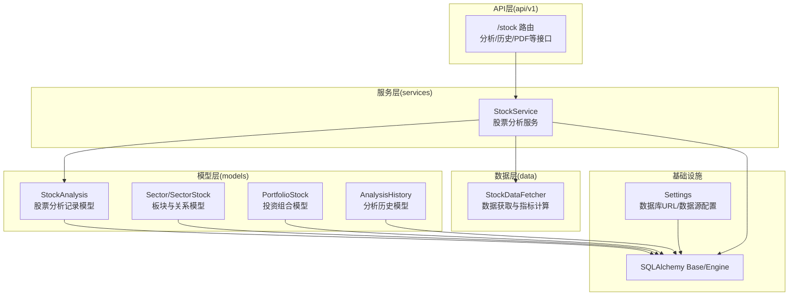
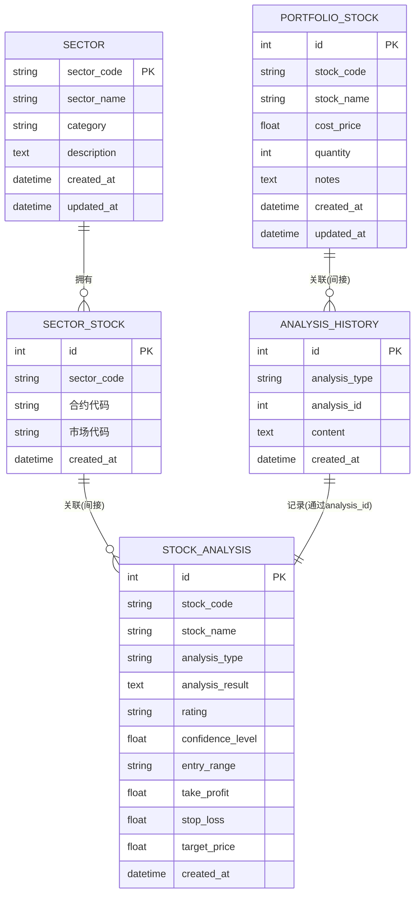
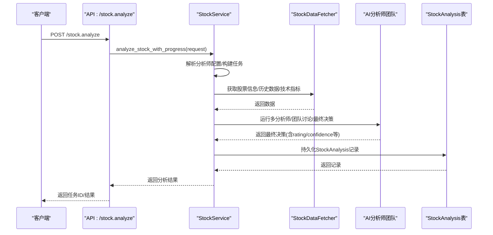
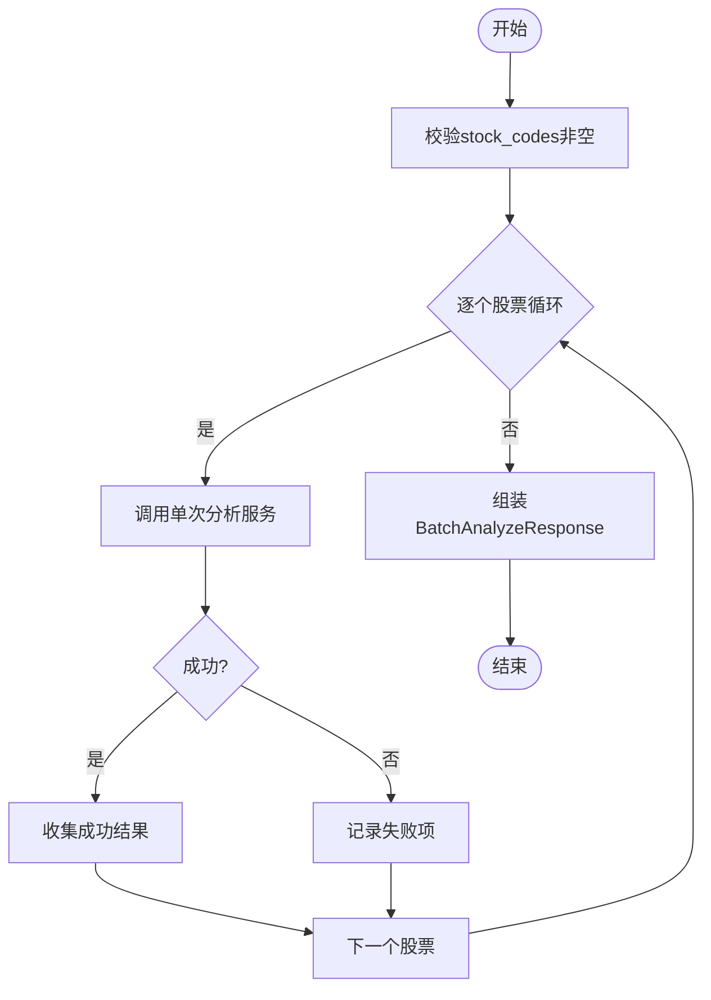
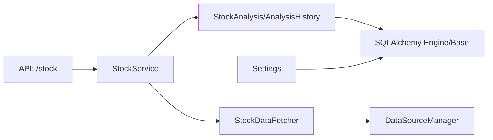

# 股票模型

<cite>
**本文引用的文件**
- [backend/app/models/stock.py](file://backend/app/models/stock.py)
- [backend/app/models/sector.py](file://backend/app/models/sector.py)
- [backend/app/models/portfolio.py](file://backend/app/models/portfolio.py)
- [backend/app/models/analysis.py](file://backend/app/models/analysis.py)
- [backend/app/schemas/stock.py](file://backend/app/schemas/stock.py)
- [backend/app/services/stock_service.py](file://backend/app/services/stock_service.py)
- [backend/app/api/v1/stock.py](file://backend/app/api/v1/stock.py)
- [backend/app/data/stock_data.py](file://backend/app/data/stock_data.py)
- [backend/app/database.py](file://backend/app/database.py)
- [backend/app/config.py](file://backend/app/config.py)
- [backend/app/dependencies.py](file://backend/app/dependencies.py)
- [docs/前后端拆分规划文档.md](file://docs/前后端拆分规划文档.md)
- [backend/migrate_db.py](file://backend/migrate_db.py)
</cite>

## 目录
1. [简介](#简介)
2. [项目结构](#项目结构)
3. [核心组件](#核心组件)
4. [架构总览](#架构总览)
5. [详细组件分析](#详细组件分析)
6. [依赖关系分析](#依赖关系分析)
7. [性能考量](#性能考量)
8. [故障排查指南](#故障排查指南)
9. [结论](#结论)
10. [附录](#附录)

## 简介
本文件围绕“股票模型”展开，重点解释StockAnalysis实体的字段构成、数据类型、验证规则及市场含义，并阐述其与板块（sector）、分析历史（analysis）、投资组合（portfolio）等模块的关系。同时提供ER图展示与sector、analysis、portfolio的关联路径，说明数据库层面的复合索引设计思路，以及股票数据更新策略、缓存机制与实时性保障措施，并给出批量导入股票数据的最佳实践与性能调优建议。

## 项目结构
后端采用FastAPI + SQLAlchemy架构，模型层位于models目录，服务层在services，API路由在api/v1，数据获取封装在data目录，数据库连接与配置在database与config目录。



图表来源
- [backend/app/models/stock.py](file://backend/app/models/stock.py#L1-L26)
- [backend/app/models/sector.py](file://backend/app/models/sector.py#L1-L98)
- [backend/app/models/portfolio.py](file://backend/app/models/portfolio.py#L1-L22)
- [backend/app/models/analysis.py](file://backend/app/models/analysis.py#L1-L19)
- [backend/app/services/stock_service.py](file://backend/app/services/stock_service.py#L1-L573)
- [backend/app/api/v1/stock.py](file://backend/app/api/v1/stock.py#L1-L190)
- [backend/app/data/stock_data.py](file://backend/app/data/stock_data.py#L1-L318)
- [backend/app/database.py](file://backend/app/database.py#L1-L45)
- [backend/app/config.py](file://backend/app/config.py#L1-L92)

章节来源
- [backend/app/models/stock.py](file://backend/app/models/stock.py#L1-L26)
- [backend/app/models/sector.py](file://backend/app/models/sector.py#L1-L98)
- [backend/app/models/portfolio.py](file://backend/app/models/portfolio.py#L1-L22)
- [backend/app/models/analysis.py](file://backend/app/models/analysis.py#L1-L19)
- [backend/app/services/stock_service.py](file://backend/app/services/stock_service.py#L1-L573)
- [backend/app/api/v1/stock.py](file://backend/app/api/v1/stock.py#L1-L190)
- [backend/app/data/stock_data.py](file://backend/app/data/stock_data.py#L1-L318)
- [backend/app/database.py](file://backend/app/database.py#L1-L45)
- [backend/app/config.py](file://backend/app/config.py#L1-L92)

## 核心组件
- StockAnalysis：股票分析记录模型，存储单次或多轮分析结果的关键字段，包括股票代码、名称、评级、置信度、建议进场区间、止盈止损价、目标价、分析类型、创建时间等。
- Sector/SectorStock：板块与板块-股票关系模型，支持按板块维度组织股票，便于跨模块关联。
- PortfolioStock：投资组合模型，记录用户持有的股票成本价、数量、备注等。
- AnalysisHistory：分析历史模型，统一记录各类分析（股票/板块/龙虎榜）的历史内容。
- StockService：股票分析服务，负责数据获取、指标计算、AI分析师团队协作、结果持久化与PDF生成。
- StockDataFetcher：数据获取器，封装A股/美股数据源、财务数据、技术指标计算等。
- API路由：提供分析、历史查询、PDF生成、进度跟踪与WebSocket实时推送等接口。

章节来源
- [backend/app/models/stock.py](file://backend/app/models/stock.py#L1-L26)
- [backend/app/models/sector.py](file://backend/app/models/sector.py#L1-L98)
- [backend/app/models/portfolio.py](file://backend/app/models/portfolio.py#L1-L22)
- [backend/app/models/analysis.py](file://backend/app/models/analysis.py#L1-L19)
- [backend/app/services/stock_service.py](file://backend/app/services/stock_service.py#L1-L573)
- [backend/app/data/stock_data.py](file://backend/app/data/stock_data.py#L1-L318)
- [backend/app/api/v1/stock.py](file://backend/app/api/v1/stock.py#L1-L190)

## 架构总览
下图展示StockAnalysis与sector、analysis、portfolio之间的ER关系路径，以及与数据获取层的交互。



图表来源
- [backend/app/models/sector.py](file://backend/app/models/sector.py#L1-L98)
- [backend/app/models/portfolio.py](file://backend/app/models/portfolio.py#L1-L22)
- [backend/app/models/analysis.py](file://backend/app/models/analysis.py#L1-L19)
- [backend/app/models/stock.py](file://backend/app/models/stock.py#L1-L26)

## 详细组件分析

### StockAnalysis实体字段与含义
- 字段与类型
  - id: 整型，主键
  - stock_code: 字符串，股票代码，非空，建立索引
  - stock_name: 字符串，股票名称
  - analysis_type: 字符串，分析类型（single/batch）
  - analysis_result: 文本，JSON格式的完整分析结果
  - rating: 字符串，评级（买入/持有/卖出）
  - confidence_level: 浮点数，置信度(0-1)
  - entry_range: 字符串，建议进场区间
  - take_profit: 浮点数，止盈价位(元)
  - stop_loss: 浮点数，止损价位(元)
  - target_price: 浮点数，目标价(元)
  - created_at: 时间戳，默认服务器时间
- 验证规则与市场含义
  - stock_code非空且建立索引，便于按股票维度检索与聚合统计。
  - rating、confidence_level、entry_range、take_profit、stop_loss、target_price来源于AI分析师团队的最终决策，反映市场预期与风险控制建议。
  - analysis_result为JSON，承载多源数据与AI分析过程，便于导出PDF报告与二次加工。
- 关系映射
  - 与sector：通过sector_stocks中间表间接关联，便于按板块维度统计分析结果。
  - 与portfolio：通过stock_code关联，便于在组合管理中回溯分析记录。
  - 与analysis：analysis_history可通过analysis_id指向StockAnalysis，形成统一的历史归档。

章节来源
- [backend/app/models/stock.py](file://backend/app/models/stock.py#L1-L26)
- [backend/app/models/sector.py](file://backend/app/models/sector.py#L83-L98)
- [backend/app/models/portfolio.py](file://backend/app/models/portfolio.py#L1-L22)
- [backend/app/models/analysis.py](file://backend/app/models/analysis.py#L1-L19)

### 数据流与处理逻辑（单次分析）


图表来源
- [backend/app/api/v1/stock.py](file://backend/app/api/v1/stock.py#L21-L51)
- [backend/app/services/stock_service.py](file://backend/app/services/stock_service.py#L63-L138)
- [backend/app/data/stock_data.py](file://backend/app/data/stock_data.py#L1-L318)

### 批量分析流程


图表来源
- [backend/app/services/stock_service.py](file://backend/app/services/stock_service.py#L140-L168)

### 数据模型类图（代码级）
```mermaid
classDiagram
class StockAnalysis {
+int id
+string stock_code
+string stock_name
+string analysis_type
+string analysis_result
+string rating
+float confidence_level
+string entry_range
+float take_profit
+float stop_loss
+float target_price
+datetime created_at
}
class Sector {
+int id
+string sector_code
+string sector_name
+string category
+text description
+datetime created_at
+datetime updated_at
}
class SectorStock {
+int id
+string sector_code
+string 合约代码
+string 市场代码
+datetime created_at
}
class PortfolioStock {
+int id
+string stock_code
+string stock_name
+float cost_price
+int quantity
+text notes
+datetime created_at
+datetime updated_at
}
class AnalysisHistory {
+int id
+string analysis_type
+int analysis_id
+text content
+datetime created_at
}
Sector ||--o{ SectorStock : "拥有"
SectorStock ||--o{ StockAnalysis : "间接关联"
PortfolioStock ||--o{ AnalysisHistory : "间接关联"
AnalysisHistory ||--|| StockAnalysis : "记录(analysis_id)"
```

图表来源
- [backend/app/models/stock.py](file://backend/app/models/stock.py#L1-L26)
- [backend/app/models/sector.py](file://backend/app/models/sector.py#L1-L98)
- [backend/app/models/portfolio.py](file://backend/app/models/portfolio.py#L1-L22)
- [backend/app/models/analysis.py](file://backend/app/models/analysis.py#L1-L19)

## 依赖关系分析
- 组件耦合
  - API层依赖服务层；服务层依赖模型层与数据获取器；模型层依赖SQLAlchemy Base与数据库引擎。
  - StockService与StockDataFetcher解耦，便于替换数据源与扩展指标。
- 外部依赖
  - 数据库：SQLite/MySQL（配置于Settings），支持异步会话与索引优化。
  - 数据源：Tushare/TDX/MySQL行情库等（通过DataSourceManager抽象）。
- 可能的循环依赖
  - 当前结构清晰，无明显循环依赖；若后续引入更多中间表或历史表，需注意外键与索引设计。



图表来源
- [backend/app/api/v1/stock.py](file://backend/app/api/v1/stock.py#L1-L190)
- [backend/app/services/stock_service.py](file://backend/app/services/stock_service.py#L1-L573)
- [backend/app/data/stock_data.py](file://backend/app/data/stock_data.py#L1-L318)
- [backend/app/database.py](file://backend/app/database.py#L1-L45)
- [backend/app/config.py](file://backend/app/config.py#L1-L92)

章节来源
- [backend/app/api/v1/stock.py](file://backend/app/api/v1/stock.py#L1-L190)
- [backend/app/services/stock_service.py](file://backend/app/services/stock_service.py#L1-L573)
- [backend/app/data/stock_data.py](file://backend/app/data/stock_data.py#L1-L318)
- [backend/app/database.py](file://backend/app/database.py#L1-L45)
- [backend/app/config.py](file://backend/app/config.py#L1-L92)

## 性能考量
- 数据库索引设计
  - stock_code建立索引，便于按股票维度检索与聚合统计。
  - 建议在StockAnalysis上增加复合索引：
    - (stock_code, created_at)：高频按股票+时间排序查询。
    - (analysis_type, stock_code)：按分析类型分组统计。
  - 在sector_stocks上已有复合唯一索引(idx_sector_stock)，建议在查询板块-股票关系时优先使用该索引。
- 查询优化
  - 历史查询支持分页与按stock_code过滤，建议结合上述复合索引提升性能。
  - PDF生成与历史查询均涉及JSON解析，建议在入库时保证analysis_result的结构稳定与大小可控。
- 缓存与实时性
  - 当前未见Redis等缓存层实现；可在StockDataFetcher层增加本地缓存（如内存缓存）以减少重复拉取。
  - 实时性保障：WebSocket推送分析进度，适合长耗时任务的用户体验；对于实时行情，建议通过专用行情订阅或定时任务刷新。
- 批量导入最佳实践
  - 使用批量插入（ORM bulk_insert_mappings）减少事务次数。
  - 导入前先清理重复stock_code，避免违反索引约束。
  - 分批导入（如每批1000条），并设置合理的超时与重试策略。
  - 导入完成后执行VACUUM/ANALYZE（SQLite/MySQL）以优化查询计划。

章节来源
- [backend/app/models/stock.py](file://backend/app/models/stock.py#L1-L26)
- [backend/app/models/sector.py](file://backend/app/models/sector.py#L83-L98)
- [backend/app/services/stock_service.py](file://backend/app/services/stock_service.py#L170-L221)
- [backend/app/data/stock_data.py](file://backend/app/data/stock_data.py#L1-L318)
- [backend/migrate_db.py](file://backend/migrate_db.py#L39-L67)

## 故障排查指南
- 常见问题
  - 数据库连接异常：检查DATABASE_URL与SQLite路径权限。
  - 数据源获取失败：确认Tushare/TDX/MySQL配置正确，网络可达。
  - 分析结果为空：检查StockDataFetcher返回的数据完整性与指标计算是否异常。
  - WebSocket连接断开：确认客户端心跳与连接管理逻辑。
- 日志与定位
  - 服务层使用logging输出错误堆栈，便于定位具体环节。
  - API层对异常进行HTTP 500响应，前端可据此提示用户重试或联系管理员。
- 建议
  - 对外暴露的接口增加参数校验与限流。
  - 对长时间任务增加超时与重试策略，避免阻塞。

章节来源
- [backend/app/services/stock_service.py](file://backend/app/services/stock_service.py#L1-L573)
- [backend/app/api/v1/stock.py](file://backend/app/api/v1/stock.py#L1-L190)
- [backend/app/config.py](file://backend/app/config.py#L1-L92)

## 结论
StockAnalysis作为核心分析记录模型，承载了多源数据与AI决策结果，是连接数据获取、分析服务与业务模块（板块、组合、历史）的桥梁。通过合理的索引设计、批量导入策略与实时性保障机制，可显著提升系统的查询性能与用户体验。建议在现有基础上逐步引入缓存与更细粒度的监控指标，持续优化分析链路的稳定性与吞吐能力。

## 附录
- 数据库表结构参考（来自文档与历史迁移脚本）
  - 投资组合表：portfolio_stocks（stock_code、stock_name、cost_price、quantity、notes、created_at、updated_at）
  - 定时任务表：scheduled_tasks（task_type、schedule_time、enabled、last_run_at、next_run_at、created_at）
  - 监测任务迁移：monitor_tasks新增字段（entry_min、entry_max、take_profit、stop_loss、notification_enabled、quant_config）

章节来源
- [docs/前后端拆分规划文档.md](file://docs/前后端拆分规划文档.md#L740-L774)
- [backend/migrate_db.py](file://backend/migrate_db.py#L39-L67)