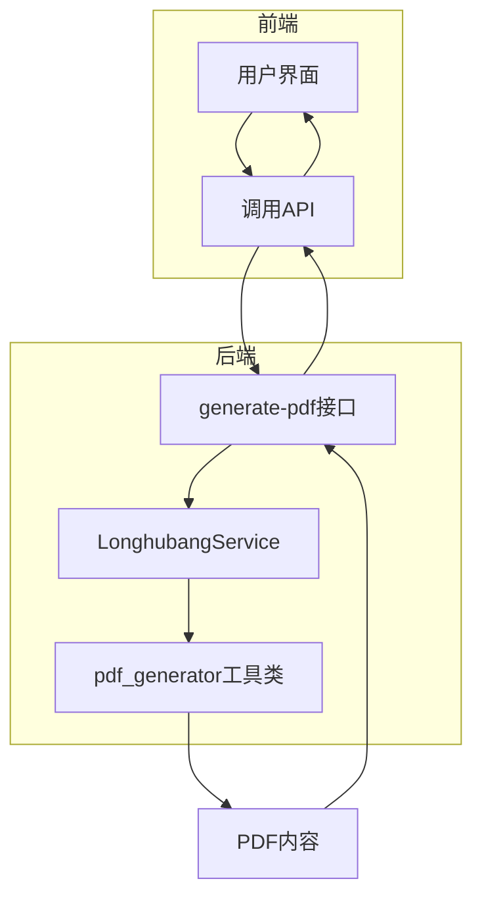
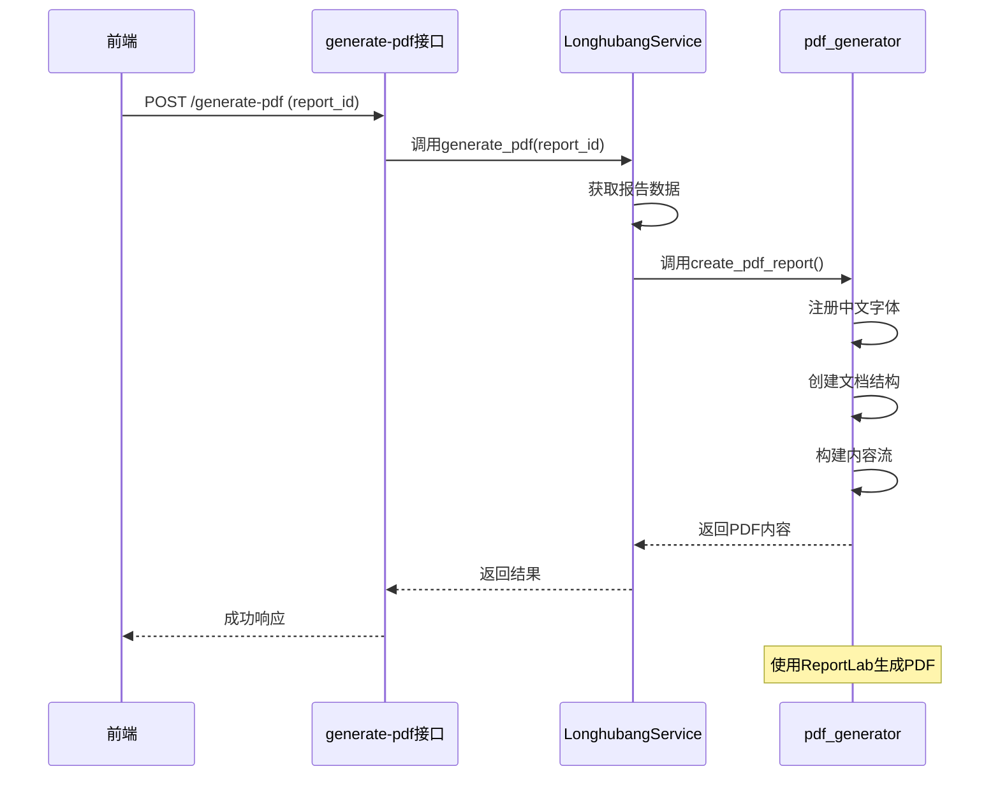
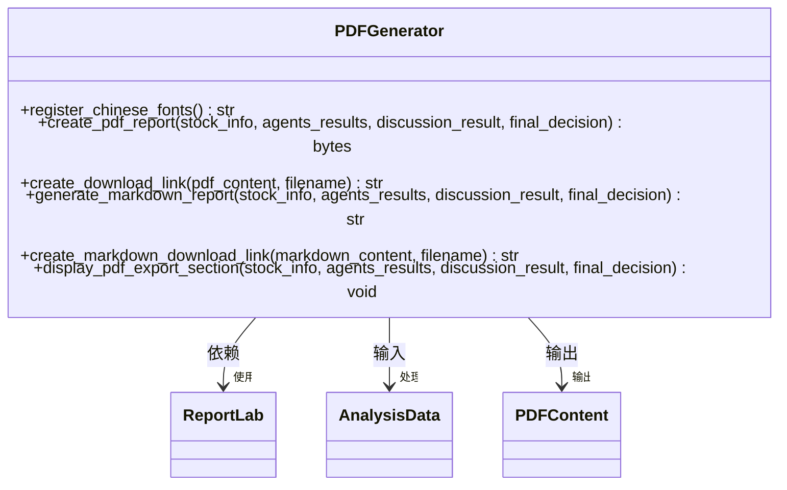
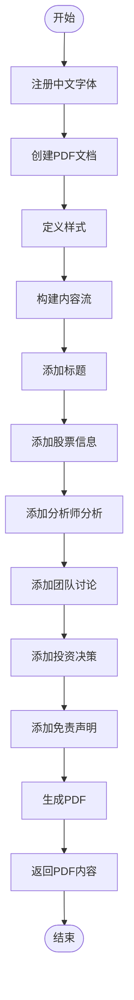
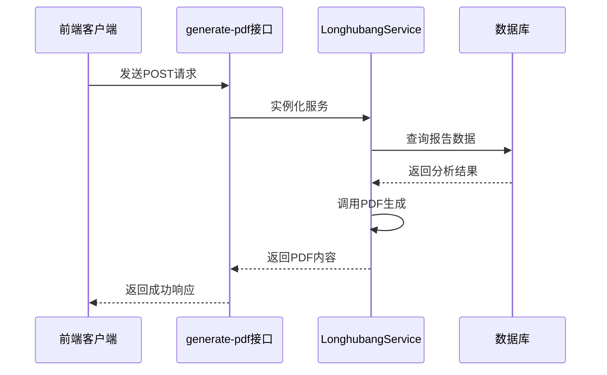
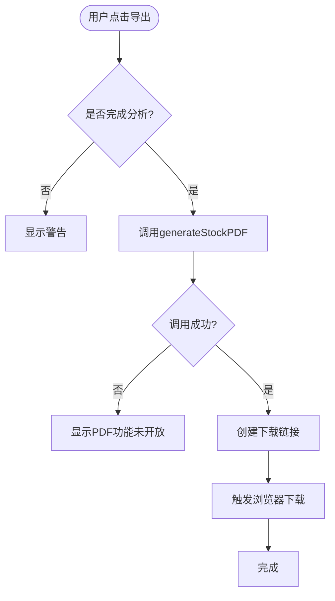
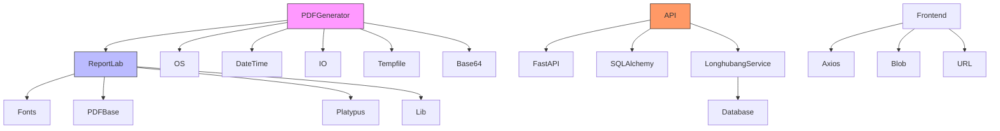
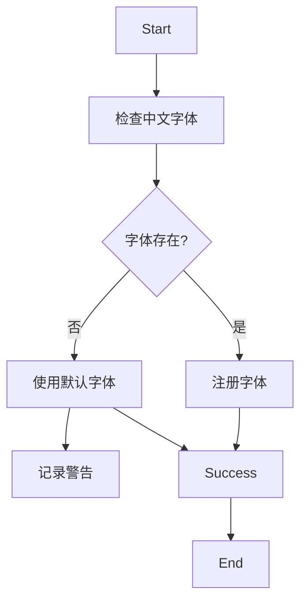

# PDF报告生成

<cite>
**本文档引用的文件**  
- [pdf_generator.py](file://backend/app/utils/pdf_generator.py)
- [longhubang.py](file://backend/app/api/v1/longhubang.py)
- [longhubang_service.py](file://backend/app/services/longhubang_service.py)
- [longhubang_pdf.py](file://old/longhubang_pdf.py)
- [sector_strategy_pdf.py](file://old/sector_strategy_pdf.py)
- [stock.py](file://frontend/src/views/stock/index.vue)
- [longhubang.py](file://frontend/src/views/longhubang/index.vue)
- [sector.py](file://frontend/src/views/sector/index.vue)
</cite>

## 目录
1. [简介](#简介)
2. [项目结构](#项目结构)
3. [核心组件](#核心组件)
4. [架构概述](#架构概述)
5. [详细组件分析](#详细组件分析)
6. [依赖分析](#依赖分析)
7. [性能考虑](#性能考虑)
8. [故障排除指南](#故障排除指南)
9. [结论](#结论)

## 简介
本系统实现了基于AI分析结果的PDF报告生成功能，支持股票、板块和龙虎榜等多种分析场景。系统通过`generate_pdf`接口调用LonghubangService获取指定报告ID的完整分析数据，并利用pdf_generator工具类将HTML或JSON格式的内容转换为专业排版的PDF文档。该功能采用ReportLab作为核心PDF生成引擎，结合中文字体支持、样式定义和分页控制，确保输出文档的专业性和可读性。

## 项目结构
PDF报告生成功能分布在前后端多个模块中，形成完整的生成-导出链路。

**Diagram sources**
- [longhubang.py](file://backend/app/api/v1/longhubang.py#L74-L86)
- [pdf_generator.py](file://backend/app/utils/pdf_generator.py#L69-L254)

**Section sources**
- [pdf_generator.py](file://backend/app/utils/pdf_generator.py#L1-L461)
- [longhubang.py](file://backend/app/api/v1/longhubang.py#L1-L87)

## 核心组件
系统的核心组件包括PDF生成工具类、API接口和前端导出功能。`pdf_generator.py`提供了创建PDF报告的主要功能，包括中文字体注册、样式定义和内容构建。`longhubang.py`中的`generate_pdf`接口负责接收前端请求并调用服务层生成PDF。前端组件则提供了用户友好的导出界面和下载功能。

**Section sources**
- [pdf_generator.py](file://backend/app/utils/pdf_generator.py#L69-L254)
- [longhubang.py](file://backend/app/api/v1/longhubang.py#L74-L86)

## 架构概述
PDF报告生成采用分层架构设计，从前端请求到最终PDF输出经过多个处理阶段。

**Diagram sources**
- [longhubang.py](file://backend/app/api/v1/longhubang.py#L74-L86)
- [longhubang_service.py](file://backend/app/services/longhubang_service.py#L34-L37)
- [pdf_generator.py](file://backend/app/utils/pdf_generator.py#L69-L254)

## 详细组件分析

### PDF生成器分析
`pdf_generator.py`是系统的核心工具类，负责将分析数据转换为专业的PDF文档。

#### 类结构分析

**Diagram sources**
- [pdf_generator.py](file://backend/app/utils/pdf_generator.py#L23-L461)

#### 生成流程分析

**Diagram sources**
- [pdf_generator.py](file://backend/app/utils/pdf_generator.py#L69-L254)

**Section sources**
- [pdf_generator.py](file://backend/app/utils/pdf_generator.py#L1-L461)

### API接口分析
`generate_pdf`接口是PDF生成功能的入口点，负责协调前后端的数据交互。

#### 接口调用流程

**Diagram sources**
- [longhubang.py](file://backend/app/api/v1/longhubang.py#L74-L86)
- [longhubang_service.py](file://backend/app/services/longhubang_service.py#L34-L37)

**Section sources**
- [longhubang.py](file://backend/app/api/v1/longhubang.py#L74-L86)

### 前端导出功能分析
前端提供了用户友好的PDF导出界面，简化了用户的操作流程。

#### 前端交互流程

**Diagram sources**
- [stock.py](file://frontend/src/views/stock/index.vue#L1028-L1039)
- [longhubang.py](file://frontend/src/views/longhubang/index.vue#L824-L832)

**Section sources**
- [stock.py](file://frontend/src/views/stock/index.vue#L1025-L1060)
- [longhubang.py](file://frontend/src/views/longhubang/index.vue#L824-L832)

## 依赖分析
PDF报告生成功能依赖多个外部库和内部模块，形成复杂的依赖关系。

**Diagram sources**
- [pdf_generator.py](file://backend/app/utils/pdf_generator.py#L9-L22)
- [longhubang.py](file://backend/app/api/v1/longhubang.py#L1-L87)

**Section sources**
- [pdf_generator.py](file://backend/app/utils/pdf_generator.py#L1-L461)
- [longhubang.py](file://backend/app/api/v1/longhubang.py#L1-L87)

## 性能考虑
系统在PDF生成过程中考虑了多个性能优化点，确保在大数据量下的稳定运行。

### 内存管理
系统采用内存缓冲区（BytesIO）来存储PDF内容，避免了临时文件的创建和删除开销。对于大文件处理，系统通过分页机制将内容分割成多个部分，减少单次内存占用。

### 异步处理
虽然当前实现中没有明确的异步处理，但API接口设计为异步函数，为未来的性能优化留下了扩展空间。建议在处理大型报告时引入Celery等任务队列，将PDF生成作为后台任务执行。

### 文件存储
系统支持两种存储模式：直接返回PDF内容供前端下载，或保存到服务器指定路径。对于历史报告，建议采用后者并设置合理的文件清理策略。

**Section sources**
- [pdf_generator.py](file://backend/app/utils/pdf_generator.py#L76-L77)
- [longhubang_pdf.py](file://old/longhubang_pdf.py#L66-L69)

## 故障排除指南
系统实现了完善的错误处理机制，能够应对多种异常情况。

### 字体异常处理
当系统无法找到中文字体时，会自动降级到默认字体（Helvetica），并记录警告信息。建议在Docker环境中安装中文字体包以避免此问题。

**Diagram sources**
- [pdf_generator.py](file://backend/app/utils/pdf_generator.py#L23-L67)

### 模板缺失处理
系统没有使用外部模板文件，所有样式和布局都在代码中定义，避免了模板缺失的问题。样式定义采用层次化结构，确保即使部分样式失败，文档仍能正常生成。

### 内存溢出应对
系统通过以下措施防止内存溢出：
1. 使用内存缓冲区而非临时文件
2. 对长文本进行截断处理
3. 分页生成大型文档
4. 及时关闭资源

**Section sources**
- [pdf_generator.py](file://backend/app/utils/pdf_generator.py#L23-L67)
- [longhubang_pdf.py](file://old/longhubang_pdf.py#L426-L430)

## 结论
PDF报告生成功能通过前后端协同工作，实现了从分析数据到专业文档的转换。系统采用ReportLab作为核心引擎，确保了PDF文档的质量和兼容性。中文字体支持、样式定义和分页控制等功能使得生成的报告具有专业外观。虽然当前实现已满足基本需求，但仍有优化空间，如引入异步处理、改进错误处理和增强安全性等。