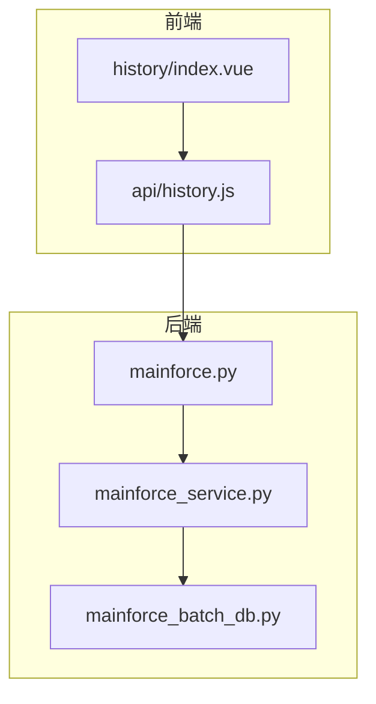
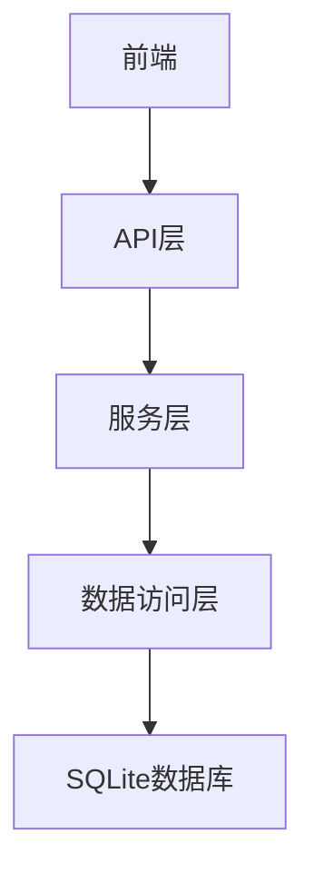
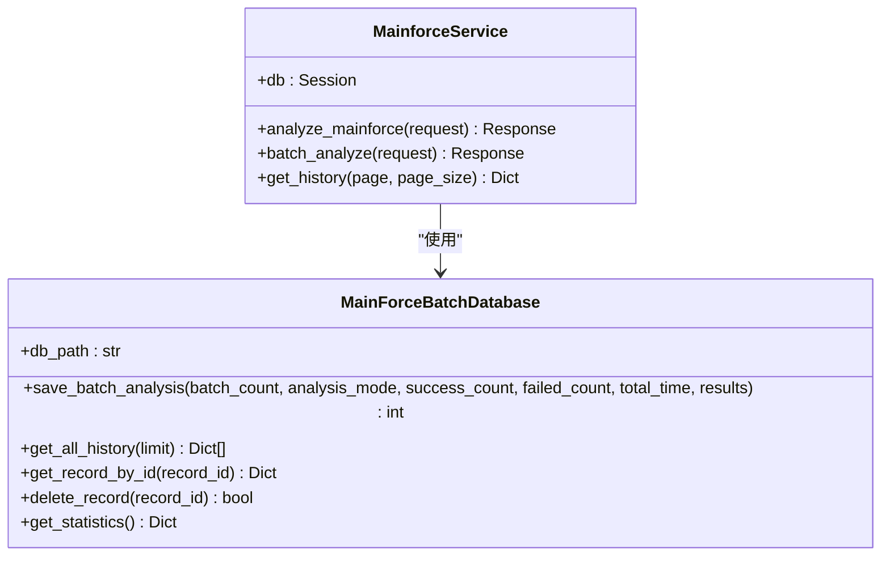
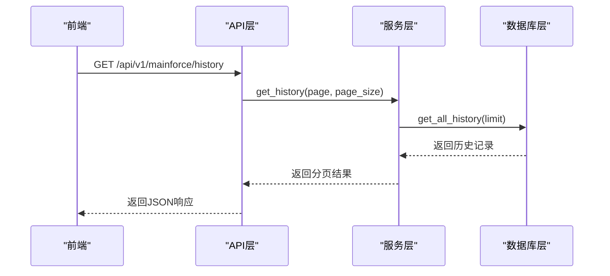
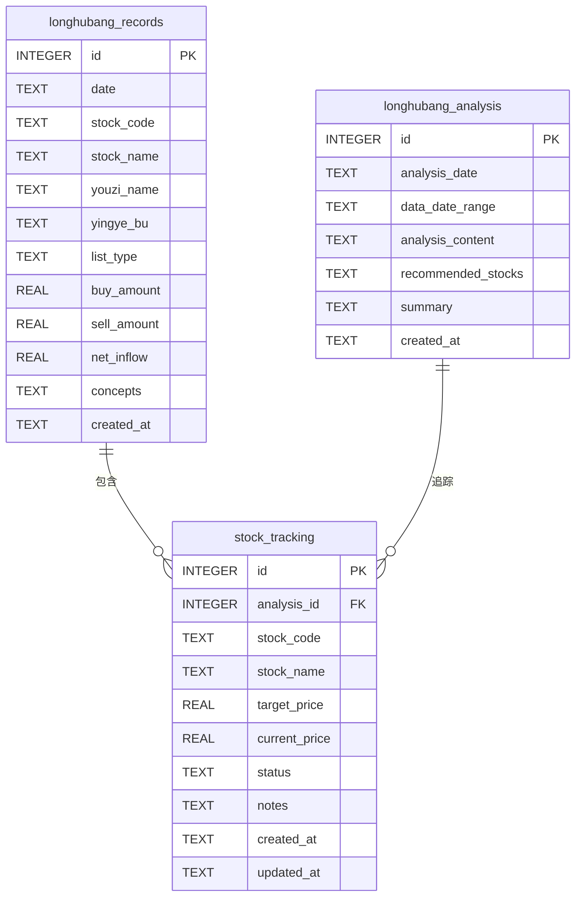

# 历史报告管理

<cite>
**本文档引用文件**  
- [mainforce_service.py](file://backend/app/services/mainforce_service.py)
- [mainforce_batch_db.py](file://backend/app/db/mainforce_batch_db.py)
- [longhubang_db.py](file://old/longhubang_db.py)
- [history.js](file://frontend/src/api/history.js)
- [index.vue](file://frontend/src/views/history/index.vue)
- [mainforce.py](file://backend/app/api/v1/mainforce.py)
- [longhubang.py](file://backend/app/api/v1/longhubang.py)
</cite>

## 目录
1. [引言](#引言)
2. [项目结构](#项目结构)
3. [核心组件](#核心组件)
4. [架构概述](#架构概述)
5. [详细组件分析](#详细组件分析)
6. [依赖分析](#依赖分析)
7. [性能考虑](#性能考虑)
8. [故障排除指南](#故障排除指南)
9. [结论](#结论)

## 引言
本文档详细说明智瞰龙虎历史报告的存储、查询与展示机制。系统通过专用数据库存储历史分析报告，提供分页查询接口，并在前端实现时间轴浏览和详情查看功能。文档涵盖数据归档策略、存储优化和隐私保护措施。

## 项目结构
系统采用前后端分离架构，后端使用Python FastAPI框架，前端使用Vue.js。历史报告功能分布在多个模块中，包括主力选股、智瞰龙虎等。



**图表来源**  
- [index.vue](file://frontend/src/views/history/index.vue)
- [history.js](file://frontend/src/api/history.js)
- [mainforce.py](file://backend/app/api/v1/mainforce.py)

**章节来源**
- [mainforce_service.py](file://backend/app/services/mainforce_service.py)
- [mainforce_batch_db.py](file://backend/app/db/mainforce_batch_db.py)

## 核心组件
系统核心组件包括历史报告数据库、服务层和API接口。数据库使用SQLite存储历史分析记录，服务层提供业务逻辑处理，API接口暴露RESTful服务。

**章节来源**
- [mainforce_service.py](file://backend/app/services/mainforce_service.py)
- [mainforce_batch_db.py](file://backend/app/db/mainforce_batch_db.py)

## 架构概述
系统采用分层架构，包括数据访问层、服务层和API层。前端通过HTTP请求与后端交互，后端通过数据库连接访问持久化数据。



**图表来源**  
- [mainforce_service.py](file://backend/app/services/mainforce_service.py)
- [mainforce_batch_db.py](file://backend/app/db/mainforce_batch_db.py)

## 详细组件分析

### 主力选股历史服务分析
主力选股历史服务提供历史记录的增删改查功能。服务通过数据库连接访问SQLite数据库，执行CRUD操作。

#### 类图


**图表来源**  
- [mainforce_service.py](file://backend/app/services/mainforce_service.py#L26-L234)
- [mainforce_batch_db.py](file://backend/app/db/mainforce_batch_db.py#L14-L302)

#### 序列图


**图表来源**  
- [mainforce.py](file://backend/app/api/v1/mainforce.py#L48-L61)
- [mainforce_service.py](file://backend/app/services/mainforce_service.py#L208-L234)
- [mainforce_batch_db.py](file://backend/app/db/mainforce_batch_db.py#L149-L193)

### 智瞰龙虎历史报告分析
智瞰龙虎功能使用独立的数据库模块存储历史报告，包括龙虎榜原始数据和AI分析报告。

#### 数据模型图


**图表来源**  
- [longhubang_db.py](file://old/longhubang_db.py#L39-L124)

**章节来源**
- [mainforce_service.py](file://backend/app/services/mainforce_service.py)
- [mainforce_batch_db.py](file://backend/app/db/mainforce_batch_db.py)

## 依赖分析
系统依赖关系清晰，各组件耦合度低。前端依赖API接口，后端服务依赖数据库模块。

```mermaid
graph TD
A[history/index.vue] --> B[api/history.js]
B --> C[/api/v1/mainforce/history]
C --> D[mainforce.py]
D --> E[mainforce_service.py]
E --> F[mainforce_batch_db.py]
F --> G[main_force_batch.db]
```

**图表来源**  
- [index.vue](file://frontend/src/views/history/index.vue)
- [history.js](file://frontend/src/api/history.js)
- [mainforce.py](file://backend/app/api/v1/mainforce.py)

**章节来源**
- [mainforce_service.py](file://backend/app/services/mainforce_service.py)
- [mainforce_batch_db.py](file://backend/app/db/mainforce_batch_db.py)

## 性能考虑
系统在性能方面进行了多项优化。数据库查询使用索引提高检索速度，历史记录查询按创建时间倒序排列，分页查询限制返回记录数量。

## 故障排除指南
常见问题包括数据库连接失败、历史记录查询超时等。建议检查数据库文件权限、磁盘空间和网络连接。

**章节来源**
- [mainforce_service.py](file://backend/app/services/mainforce_service.py#L231-L233)
- [mainforce_batch_db.py](file://backend/app/db/mainforce_batch_db.py#L252-L256)

## 结论
智瞰龙虎历史报告系统设计合理，功能完整。通过分层架构和模块化设计，系统具有良好的可维护性和扩展性。建议定期备份数据库文件，监控存储空间使用情况。