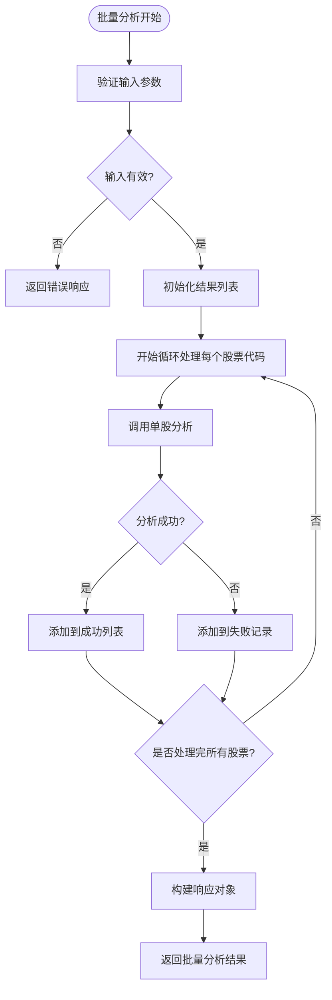
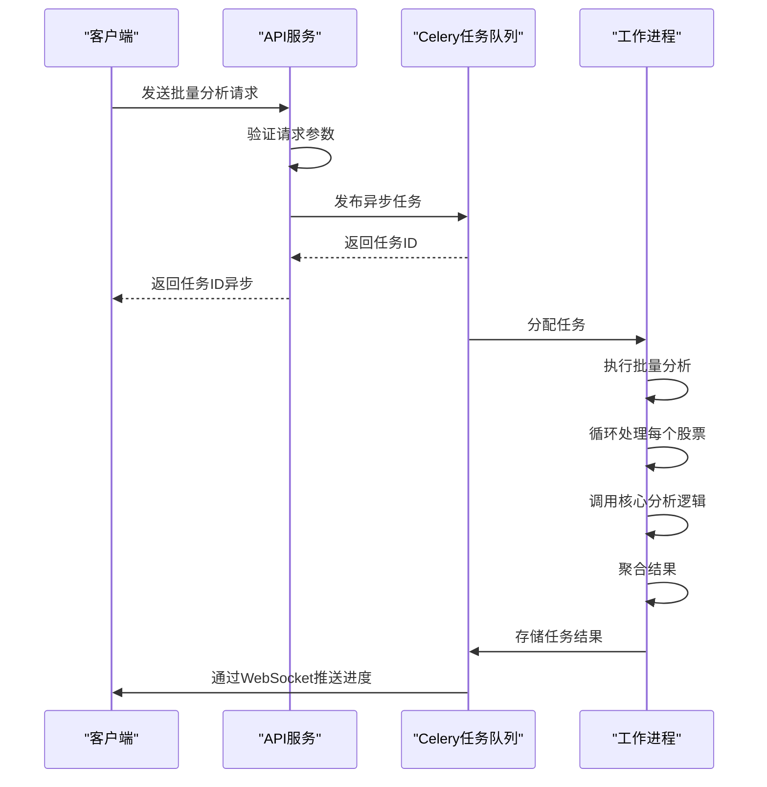

# 批量分析功能

<cite>
**本文档引用的文件**   
- [batch.vue](file://frontend/src/views/longhubang/batch.vue)
- [stock_service.py](file://backend/app/services/stock_service.py)
- [mainforce_service.py](file://backend/app/services/mainforce_service.py)
- [longhubang_service.py](file://backend/app/services/longhubang_service.py)
- [celery_app.py](file://backend/app/tasks/celery_app.py)
- [progress_tracker.py](file://backend/app/core/progress_tracker.py)
- [stock.py](file://backend/app/schemas/stock.py)
- [longhubang.py](file://backend/app/api/v1/longhubang.py)
- [mainforce_batch_db.py](file://backend/app/db/mainforce_batch_db.py)
</cite>

## 目录
1. [简介](#简介)
2. [API接口设计](#api接口设计)
3. [服务层实现机制](#服务层实现机制)
4. [并发与异步处理](#并发与异步处理)
5. [错误容忍与结果聚合](#错误容忍与结果聚合)
6. [前端交互设计](#前端交互设计)
7. [性能优化建议](#性能优化建议)

## 简介
智瞰龙虎批量分析功能旨在为用户提供对多个股票代码进行高效、并行化分析的能力。该功能通过后端API接收股票代码列表，利用异步任务队列（Celery）或并发处理技术提升大规模分析的效率。服务层对每个股票代码循环调用核心分析逻辑，并实现结果聚合与错误容忍策略。前端界面提供任务进度显示、结果分页展示和导出功能，确保用户体验流畅。

## API接口设计
批量分析功能通过RESTful API暴露服务，主要接口位于`backend/app/api/v1/longhubang.py`中。`batch_analyze`端点接收包含股票代码列表的请求，支持指定分析模型等参数。请求体遵循`BatchAnalyzeRequest`模式定义，包含`stock_codes`数组、`period`周期、`mode`模式（顺序/并行）和`max_workers`最大工作线程数等字段。响应体为`BatchAnalyzeResponse`，包含总数量、成功数量、失败数量、成功结果列表和失败股票记录。

**Section sources**
- [longhubang.py](file://backend/app/api/v1/longhubang.py#L30-L43)
- [stock.py](file://backend/app/schemas/stock.py#L44-L60)

## 服务层实现机制
服务层核心逻辑位于`backend/app/services/stock_service.py`中的`StockService`类。`batch_analyze`方法接收`BatchAnalyzeRequest`对象，首先验证股票代码列表非空，然后遍历每个股票代码，调用`analyze_stock`方法进行单个股票分析。成功结果添加到`success_results`列表，失败记录捕获异常信息并添加到`failed_records`列表。最终返回包含统计信息和结果的`BatchAnalyzeResponse`对象。该设计实现了对每个股票代码的循环调用核心分析逻辑。

**Diagram sources**
- [stock_service.py](file://backend/app/services/stock_service.py#L140-L168)

**Section sources**
- [stock_service.py](file://backend/app/services/stock_service.py#L140-L168)

## 并发与异步处理
系统支持多种并发处理模式以提升分析效率。在`mainforce_service.py`中，`_run_batch_analysis`方法根据`analysis_mode`参数选择顺序或并行模式。并行模式使用`ThreadPoolExecutor`创建线程池，`max_workers`参数控制最大并发数，默认为3以避免API限流。每个股票分析任务提交到线程池执行，通过`as_completed`监控任务完成情况。同时，系统集成Celery作为异步任务队列，`celery_app.py`配置了Redis作为消息代理和结果后端，支持将耗时的分析任务异步执行，提高系统响应性。

**Diagram sources**
- [mainforce_service.py](file://backend/app/services/mainforce_service.py#L129-L172)
- [celery_app.py](file://backend/app/tasks/celery_app.py#L7-L20)

**Section sources**
- [mainforce_service.py](file://backend/app/services/mainforce_service.py#L106-L184)
- [celery_app.py](file://backend/app/tasks/celery_app.py#L1-L21)

## 错误容忍与结果聚合
批量分析功能实现了完善的错误容忍机制。在遍历股票代码时，使用try-catch块捕获单个股票分析的异常，记录失败信息而不中断整个批量处理流程。失败记录包含股票代码和错误消息，最终与成功结果一起返回。结果聚合通过`success_results`和`failed_records`两个列表实现，响应对象提供总数、成功数和失败数的统计信息。此外，系统通过`progress_tracker.py`实现进度追踪，支持WebSocket实时推送任务进度，即使在部分失败情况下也能提供清晰的执行状态反馈。

**Section sources**
- [stock_service.py](file://backend/app/services/stock_service.py#L148-L161)
- [progress_tracker.py](file://backend/app/core/progress_tracker.py#L19-L170)

## 前端交互设计
前端批量分析界面位于`frontend/src/views/longhubang/batch.vue`，采用Vue.js框架构建。界面提供股票代码输入区域、分析参数配置和启动按钮。任务进度通过进度条和状态文本实时显示，利用WebSocket接收后端推送的进度更新。结果展示采用分页表格形式，支持查看成功和失败的分析结果。导出功能允许用户将分析结果下载为CSV或PDF格式。尽管当前界面显示"批量分析功能开发中..."，但其设计遵循了完整的交互流程，包括任务提交、进度监控、结果展示和历史记录访问。

**Section sources**
- [batch.vue](file://frontend/src/views/longhubang/batch.vue#L1-L14)

## 性能优化建议
为提升批量分析性能，建议实施以下优化策略：首先，实现批量请求合并，将多个股票的数据请求合并为单个网络调用，减少I/O开销。其次，引入缓存策略，对频繁访问的股票数据和分析结果进行缓存，设置合理的过期时间。第三，实施资源限流控制，通过`max_workers`参数限制并发数，避免系统资源耗尽。第四，优化数据库操作，使用批量插入而非逐条插入历史记录。最后，考虑引入Redis等内存数据库作为缓存层，并对Celery任务队列进行调优，合理配置worker数量和任务路由策略。