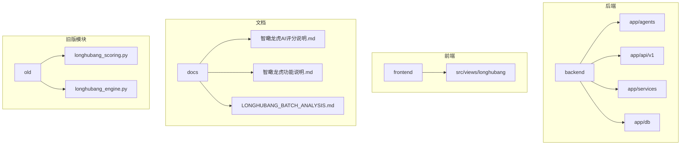
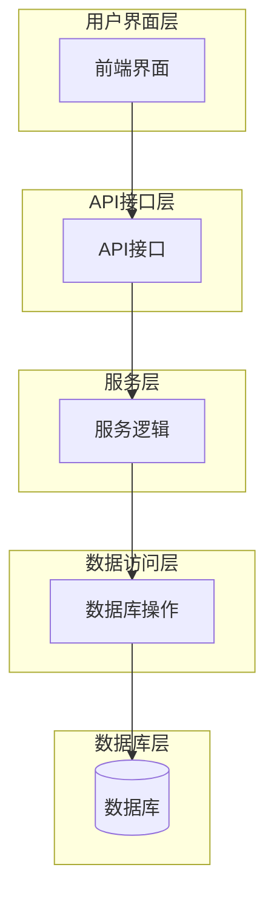
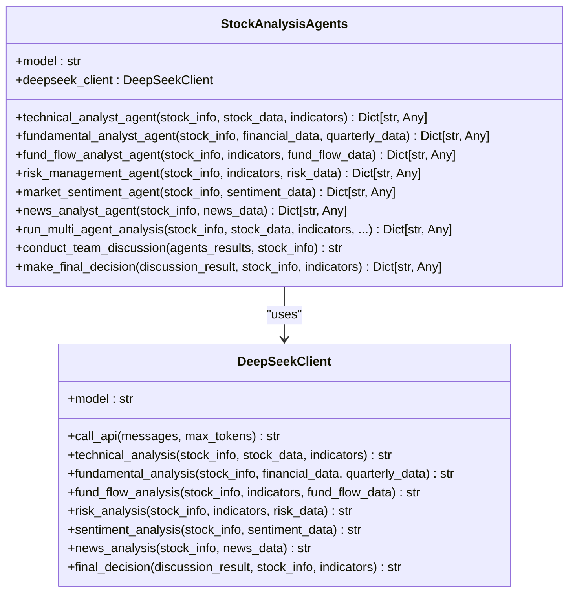
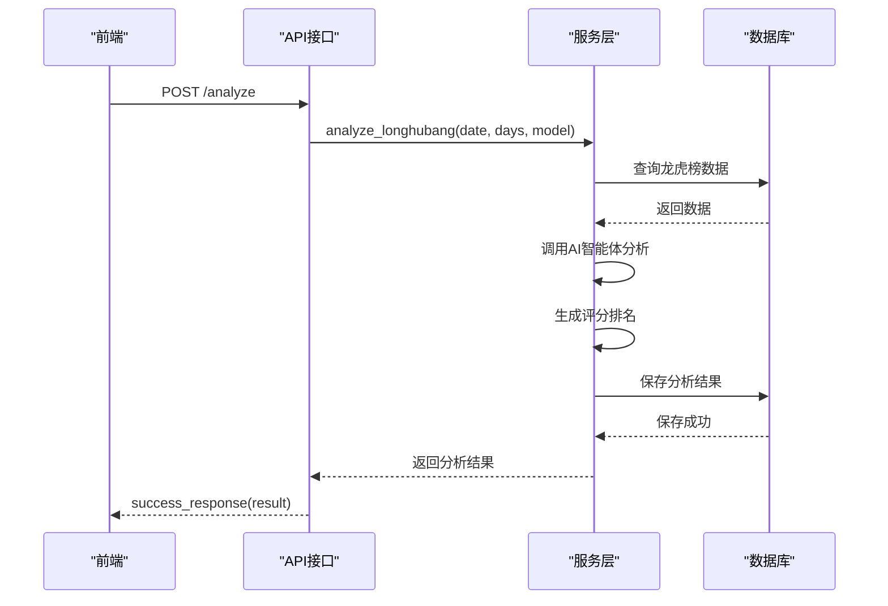
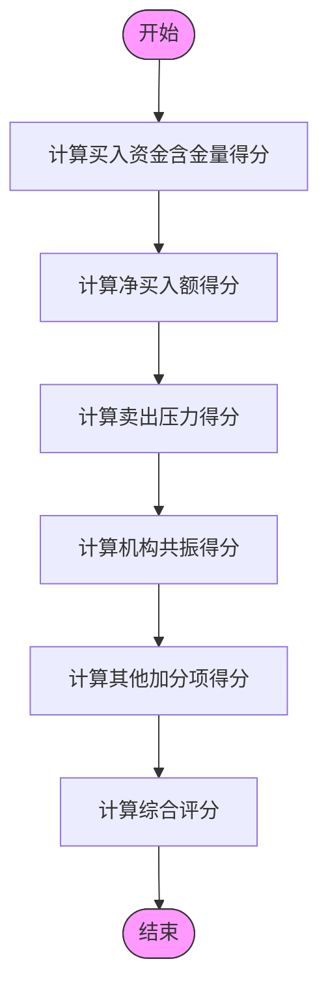
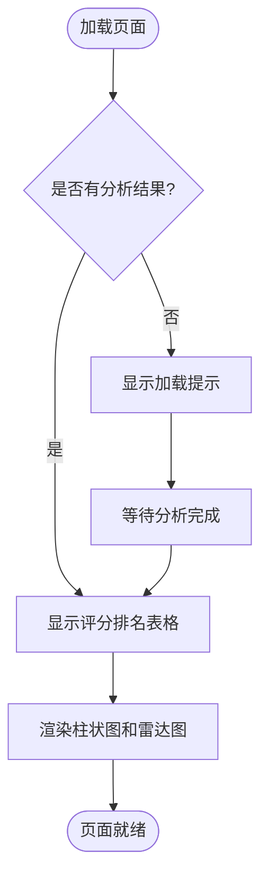
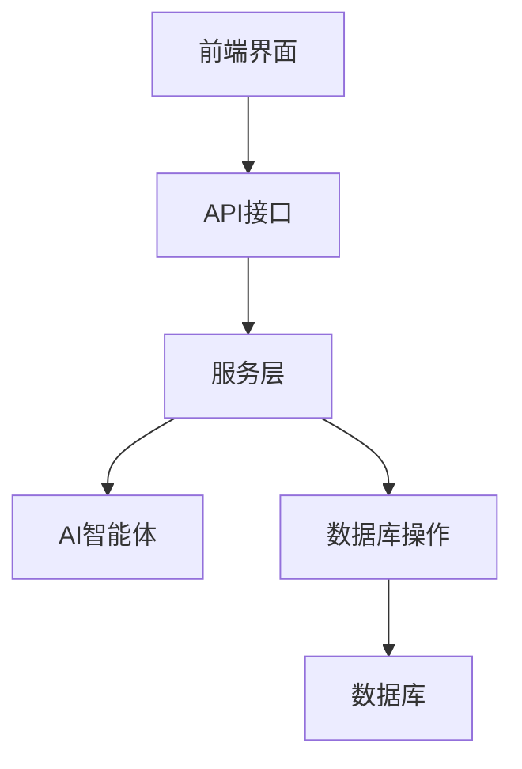

# 智瞰龙虎榜分析

<cite>
**本文档引用文件**   
- [ai_agents.py](file://backend/app/agents/ai_agents.py)
- [longhubang_agents.py](file://backend/app/agents/longhubang_agents.py)
- [longhubang.py](file://backend/app/api/v1/longhubang.py)
- [longhubang_service.py](file://backend/app/services/longhubang_service.py)
- [longhubang_db.py](file://backend/app/db/longhubang_db.py)
- [scoring.vue](file://frontend/src/views/longhubang/scoring.vue)
- [智瞰龙虎AI评分说明.md](file://docs/智瞰龙虎AI评分说明.md)
- [智瞰龙虎功能说明.md](file://docs/智瞰龙虎功能说明.md)
- [LONGHUBANG_BATCH_ANALYSIS.md](file://docs/LONGHUBANG_BATCH_ANALYSIS.md)
- [longhubang_scoring.py](file://old/longhubang_scoring.py)
- [longhubang_engine.py](file://old/longhubang_engine.py)
</cite>

## 目录
1. [引言](#引言)
2. [项目结构](#项目结构)
3. [核心组件](#核心组件)
4. [架构概述](#架构概述)
5. [详细组件分析](#详细组件分析)
6. [依赖分析](#依赖分析)
7. [性能考虑](#性能考虑)
8. [故障排除指南](#故障排除指南)
9. [结论](#结论)
10. [附录](#附录)

## 引言
智瞰龙虎榜分析系统是一个基于多AI智能体的龙虎榜深度分析平台，旨在通过专业分析师团队的协同工作，挖掘次日大概率上涨的潜力股票。该系统整合了数据获取、AI分析、评分排名、历史报告存储与查询、PDF报告生成等核心功能，为投资者提供全面的投资决策支持。

## 项目结构
智瞰龙虎榜分析系统的项目结构清晰，分为后端、前端、文档和旧版模块四个主要部分。后端采用FastAPI框架，实现了API接口、服务逻辑、数据库操作和AI智能体；前端基于Vue.js构建用户界面；文档部分包含了详细的使用说明和技术文档；旧版模块保留了系统早期的实现代码，为新功能的迁移提供了参考。

**图源**
- [智瞰龙虎功能说明.md](file://docs/智瞰龙虎功能说明.md#📁-文件结构)

## 核心组件
智瞰龙虎榜分析系统的核心组件包括AI智能体、API接口、服务层、数据库和前端界面。AI智能体负责多维度分析，API接口提供RESTful服务，服务层处理业务逻辑，数据库存储分析结果，前端界面展示评分排名和分析报告。

**组件源**
- [ai_agents.py](file://backend/app/agents/ai_agents.py#L5-L546)
- [longhubang.py](file://backend/app/api/v1/longhubang.py#L1-L87)
- [longhubang_service.py](file://backend/app/services/longhubang_service.py#L8-L39)
- [longhubang_db.py](file://backend/app/db/longhubang_db.py#L1-L6)
- [scoring.vue](file://frontend/src/views/longhubang/scoring.vue#L1-L14)

## 架构概述
智瞰龙虎榜分析系统采用分层架构，从前端到后端依次为：用户界面层、API接口层、服务层、数据访问层和数据库层。用户通过前端界面发起分析请求，API接口层接收请求并调用服务层，服务层协调AI智能体进行分析，数据访问层将结果存入数据库，最终前端界面展示分析结果。

**图源**
- [智瞰龙虎功能说明.md](file://docs/智瞰龙虎功能说明.md#📁-文件结构)

## 详细组件分析
### AI智能体分析
AI智能体是智瞰龙虎榜分析系统的核心，负责从多个维度对龙虎榜数据进行深度分析。系统包含技术面、基本面、资金面、风险管理和市场情绪五个智能体，每个智能体专注于特定领域的分析。

#### AI智能体类图

**图源**
- [ai_agents.py](file://backend/app/agents/ai_agents.py#L5-L546)

### API接口分析
API接口层提供了龙虎榜分析、批量分析、获取评分排名、历史报告和生成PDF等核心功能。每个接口都通过FastAPI的路由机制暴露，接收前端请求并调用相应的服务方法。

#### 龙虎榜分析API序列图

**图源**
- [longhubang.py](file://backend/app/api/v1/longhubang.py#L14-L27)

### 评分模型分析
评分模型是智瞰龙虎榜分析系统的关键，采用100分制综合评分，从买入资金含金量、净买入额、卖出压力、机构共振和其他加分项五个维度全面评估股票受资金青睐的程度。

#### 评分模型流程图

**图源**
- [智瞰龙虎AI评分说明.md](file://docs/智瞰龙虎AI评分说明.md#🎯-五大评分维度)

### 前端界面分析
前端界面采用Vue.js框架构建，提供了评分排名、历史报告、批量分析等功能。评分排名界面展示了TOP10股票的综合评分和各维度得分，用户可以直观地了解每只股票的投资价值。

#### 评分排名界面流程图

**图源**
- [scoring.vue](file://frontend/src/views/longhubang/scoring.vue#L1-L14)

## 依赖分析
智瞰龙虎榜分析系统的组件之间存在明确的依赖关系。前端界面依赖API接口获取数据，API接口依赖服务层处理业务逻辑，服务层依赖AI智能体进行分析，数据访问层依赖数据库存储结果。

**图源**
- [longhubang.py](file://backend/app/api/v1/longhubang.py#L9)
- [longhubang_service.py](file://backend/app/services/longhubang_service.py#L11)

## 性能考虑
智瞰龙虎榜分析系统在设计时充分考虑了性能因素。API接口采用异步处理，避免阻塞主线程；AI智能体分析支持并行执行，提高分析效率；数据库操作使用索引优化查询性能；前端界面采用懒加载技术，减少初始加载时间。

## 故障排除指南
当智瞰龙虎榜分析系统出现问题时，可以按照以下步骤进行排查：
1. 检查网络连接是否正常
2. 验证DeepSeek API密钥是否正确
3. 确认数据库文件是否有写入权限
4. 检查Python依赖包是否完整安装
5. 查看日志文件，定位具体错误

**组件源**
- [智瞰龙虎功能说明.md](file://docs/智瞰龙虎功能说明.md#🔧-技术支持)

## 结论
智瞰龙虎榜分析系统通过多AI智能体的协同工作，实现了对龙虎榜数据的深度分析和智能评分。系统架构清晰，功能完整，为投资者提供了全面的投资决策支持。未来可以进一步优化AI模型，提高分析准确率，增加更多维度的分析功能。

## 附录
### 评分维度说明
| 维度 | 权重 | 说明 |
|------|------|------|
| 买入资金含金量 | 30分 | 顶级游资加分多，普通游资加分少 |
| 净买入额 | 25分 | 真金白银越多分数越高 |
| 卖出压力 | 20分 | 卖出压力越小分数越高 |
| 机构共振 | 15分 | 机构+游资共振最高分 |
| 其他加分项 | 10分 | 买卖比例、主力集中度、热门概念等 |

**表源**
- [智瞰龙虎AI评分说明.md](file://docs/智瞰龙虎AI评分说明.md#🎯-五大评分维度)

### API接口文档
| 接口 | 方法 | 参数 | 描述 |
|------|------|------|------|
| /analyze | POST | date, days, model | 龙虎榜分析 |
| /batch-analyze | POST | stock_codes, model | 批量分析 |
| /scoring | GET | report_id | 获取评分排名 |
| /history | GET | page, page_size | 历史报告 |
| /generate-pdf | POST | report_id | 生成PDF |

**表源**
- [longhubang.py](file://backend/app/api/v1/longhubang.py#L14-L87)