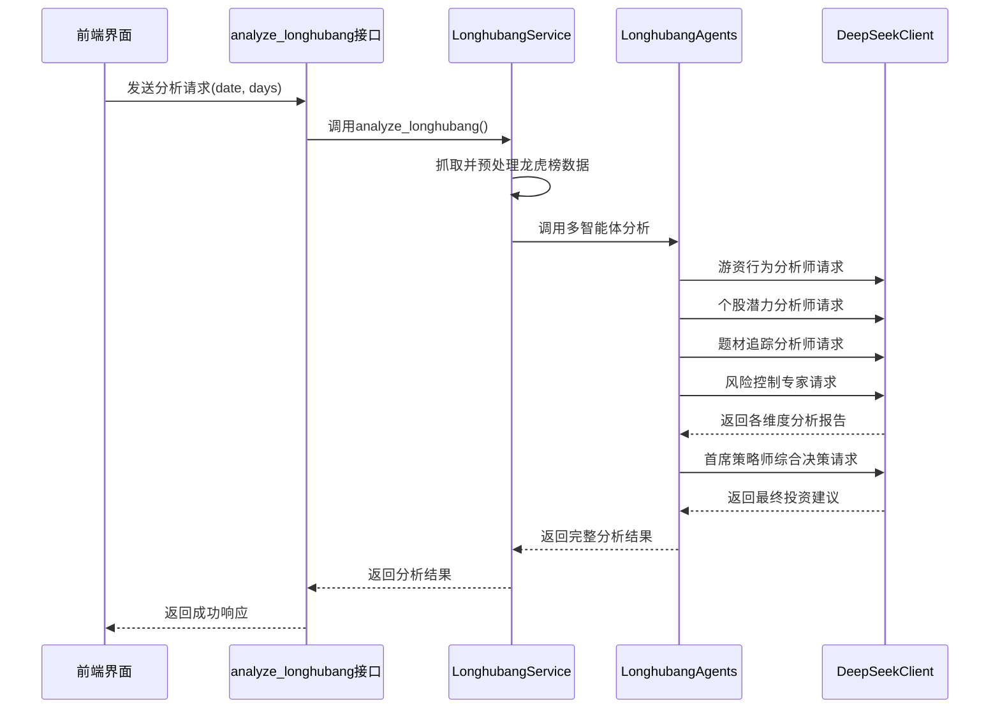
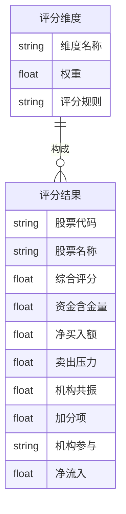

# 核心分析功能

<cite>
**本文档引用的文件**   
- [longhubang.py](file://backend/app/api/v1/longhubang.py)
- [longhubang_service.py](file://backend/app/services/longhubang_service.py)
- [ai_agents.py](file://backend/app/agents/ai_agents.py)
- [deepseek_client.py](file://backend/app/agents/deepseek_client.py)
- [longhubang_agents.py](file://old/longhubang_agents.py)
- [longhubang_scoring.py](file://old/longhubang_scoring.py)
- [analysis.py](file://backend/app/models/analysis.py)
- [config.py](file://backend/app/config.py)
</cite>

## 目录
1. [接口调用与数据获取](#接口调用与数据获取)
2. [AI代理系统与多智能体协同](#ai代理系统与多智能体协同)
3. [AI评分模型与特征权重](#ai评分模型与特征权重)
4. [分析结果与异常处理](#分析结果与异常处理)

## 接口调用与数据获取

智瞰龙虎榜的核心分析功能始于 `analyze_longhubang` 接口。该接口位于 `backend/app/api/v1/longhubang.py` 文件中，是一个 FastAPI 的 POST 路由。它接收三个主要参数：`date`（日期，可选，默认为当天）、`days`（天数，默认为1）和 `model`（使用的AI模型，默认为 "deepseek-chat"）。

当用户发起分析请求时，该接口会创建一个 `LonghubangService` 服务实例，并调用其 `analyze_longhubang` 方法。此方法负责整个分析流程的协调。在旧版本的实现中（`old/longhubang_engine.py`），该服务会首先调用数据抓取模块，根据指定的日期或日期范围，从数据源（如东方财富网）获取龙虎榜的原始数据。获取到的数据是结构化的，包含了每只上榜股票的详细信息，如股票代码、名称、买卖方营业部（席位）、买入金额、卖出金额、净流入金额以及相关的概念题材等。

数据获取后，服务会进行预处理，将原始数据清洗、格式化，并生成一个包含所有上榜股票信息的汇总数据结构，以便后续的AI分析。

**Section sources**
- [longhubang.py](file://backend/app/api/v1/longhubang.py#L14-L27)
- [longhubang_service.py](file://backend/app/services/longhubang_service.py#L14-L17)

## AI代理系统与多智能体协同

预处理后的龙虎榜数据会被传递给AI代理系统，该系统的核心是 `StockAnalysisAgents` 类（位于 `backend/app/agents/ai_agents.py`）。然而，对于龙虎榜这一特定场景，系统使用的是一个专门的 `LonghubangAgents` 智能体集群（位于 `old/longhubang_agents.py`），它继承了多智能体协同分析的框架。

该集群包含多个专业化的AI智能体，它们并行工作，从不同维度对龙虎榜数据进行深度分析：
*   **游资行为分析师**：专注于识别活跃的游资席位（如“赵老哥”、“章盟主”），分析其操作风格（激进型、稳健型）、目标股票和进出节奏。
*   **个股潜力分析师**：从资金流向、技术形态和题材概念等角度，挖掘次日大概率上涨的潜力股。
*   **题材追踪分析师**：识别当前市场最热门的题材和概念，分析其炒作周期和持续性，并预判下一个可能启动的热点。
*   **风险控制专家**：专门识别高风险信号，如游资出货、资金陷阱和题材退潮的股票。

这些智能体通过 `DeepSeekClient`（位于 `backend/app/agents/deepseek_client.py`）与DeepSeek大模型进行交互。每个智能体都会根据其专业领域，构建一个包含系统角色设定和详细分析要求的Prompt，然后调用DeepSeek API生成专业的分析报告。`DeepSeekClient` 负责管理API密钥、基础URL（在 `config.py` 中配置）和调用参数。

所有智能体完成分析后，它们的报告会被汇总，并传递给**首席策略师**智能体。首席策略师扮演着最终决策者的角色，它会综合所有专业分析师的意见，权衡机会与风险，最终生成一份包含具体投资建议（如推荐股票、买入价位、目标价位、止损位）的综合性投资策略报告。

**Diagram sources**
- [longhubang.py](file://backend/app/api/v1/longhubang.py#L14-L27)
- [longhubang_service.py](file://backend/app/services/longhubang_service.py#L14-L17)
- [ai_agents.py](file://backend/app/agents/ai_agents.py#L407-L546)
- [deepseek_client.py](file://backend/app/agents/deepseek_client.py#L6-L458)
- [longhubang_agents.py](file://old/longhubang_agents.py#L11-L507)

**Section sources**
- [ai_agents.py](file://backend/app/agents/ai_agents.py#L5-L546)
- [deepseek_client.py](file://backend/app/agents/deepseek_client.py#L6-L458)
- [longhubang_agents.py](file://old/longhubang_agents.py#L11-L507)

## AI评分模型与特征权重

除了多智能体的深度分析，系统还提供了一个量化的AI评分功能，用于对上榜股票进行快速排名。该功能由 `LonghubangScoring` 类（位于 `old/longhubang_scoring.py`）实现。

评分模型采用多维度加权的方式，总分为100分，主要包含以下五个特征及其权重分配逻辑：
1.  **买入资金含金量 (0-30分)**：评估买入资金的“质量”。顶级游资（如“赵老哥”）的席位每个贡献10分，知名游资（如“深股通”）每个贡献5分，普通游资则贡献1.5分。该维度权重最高，体现了对市场“聪明钱”的重视。
2.  **净买入额评分 (0-25分)**：衡量资金的“真金白银”投入。净流入金额越大，分数越高。例如，净流入超过1亿元可获得22-25分，体现了资金规模的重要性。
3.  **卖出压力评分 (0-20分)**：评估后续的抛售压力。通过计算卖出金额与买入金额的比例来评分，比例越低（即卖出压力越小），分数越高。例如，卖出比例低于10%可获得满分20分。
4.  **机构共振评分 (0-15分)**：判断是否存在机构资金与游资的“共振”。如果同时有机构专用席位和顶级游资买入，则可获得最高15分，这是最强的看多信号。
5.  **其他加分项 (0-10分)**：包含多个子项，如主力集中度（席位越少越集中，加分越多）、热门概念（如AI、新能源等，加分）、连续上榜和优秀的买卖比例。

通过这种结构化的权重分配，系统能够客观地对所有上榜股票进行量化排名，为用户提供一个快速筛选的依据。

**Diagram sources**
- [longhubang_scoring.py](file://old/longhubang_scoring.py#L11-L585)

**Section sources**
- [longhubang_scoring.py](file://old/longhubang_scoring.py#L11-L585)

## 分析结果与异常处理

分析的最终结果以结构化的JSON格式返回给前端。该结果包含了首席策略师的综合报告、各个专业分析师的详细报告、AI评分排名以及原始数据的摘要。结果存储在数据库的 `analysis_history` 表中（模型定义在 `backend/app/models/analysis.py`），便于用户查看历史记录。

系统具备完善的异常处理机制。在 `analyze_longhubang` 接口层面，使用了 `try...except` 语句捕获所有可能的异常。一旦发生错误（如数据抓取失败、AI服务不可用），系统会捕获异常，并通过 `HTTPException` 返回一个500状态码和具体的错误信息，确保前端能够优雅地处理错误，而不是让请求直接崩溃。

**Section sources**
- [longhubang.py](file://backend/app/api/v1/longhubang.py#L23-L27)
- [analysis.py](file://backend/app/models/analysis.py#L9-L19)