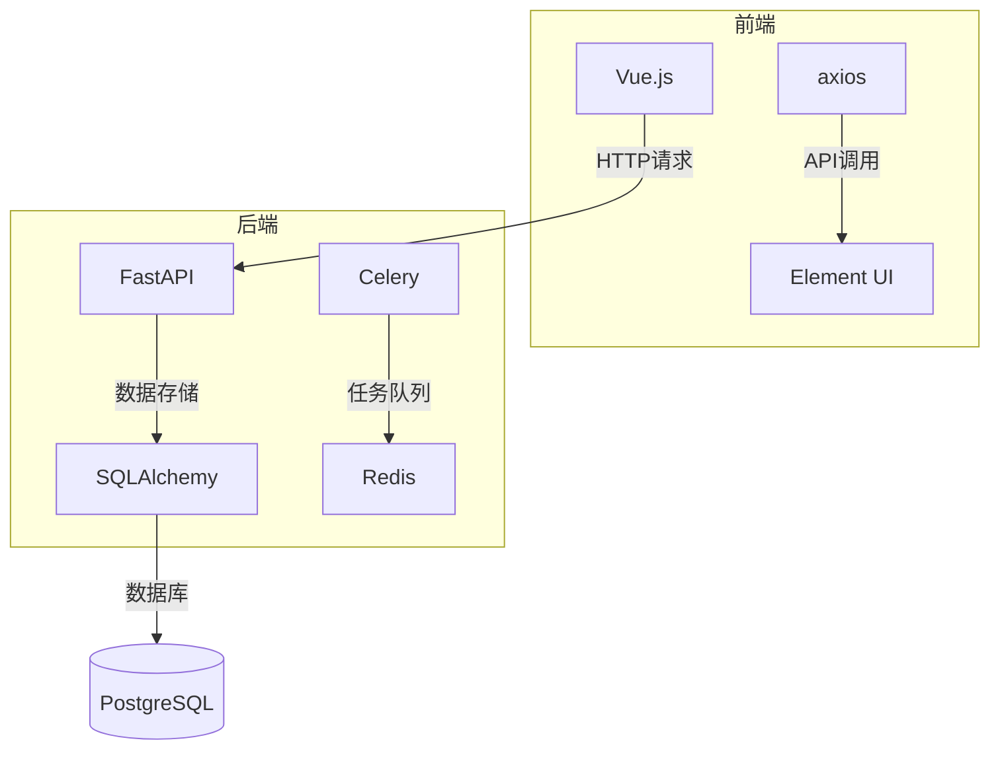
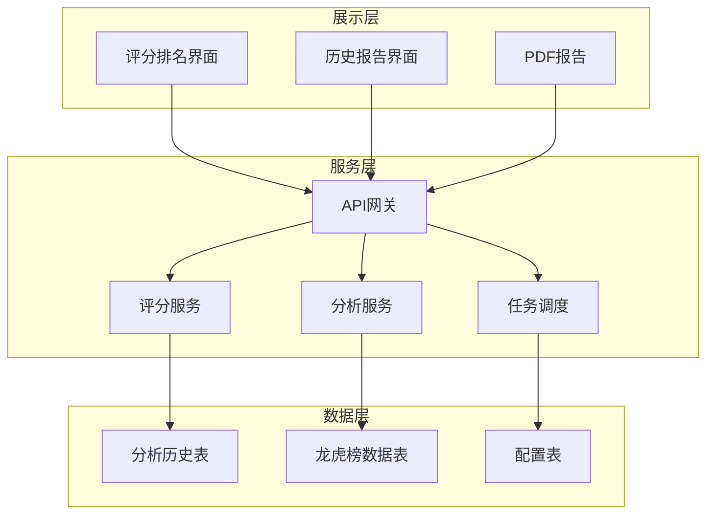
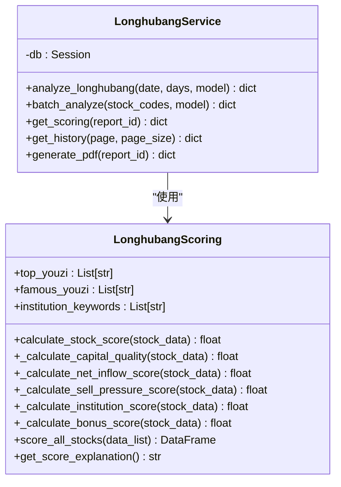
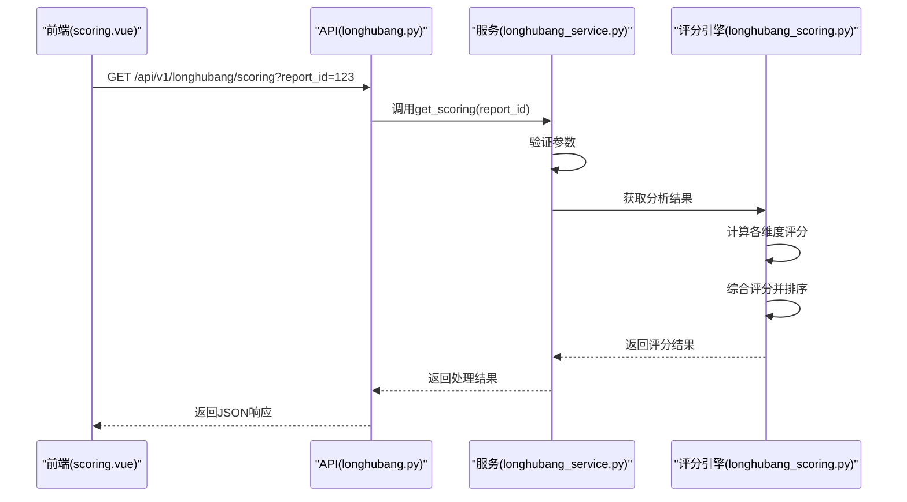
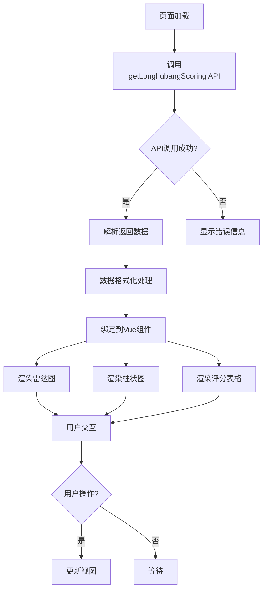
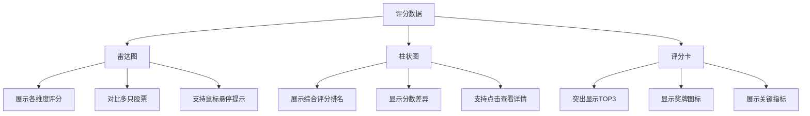
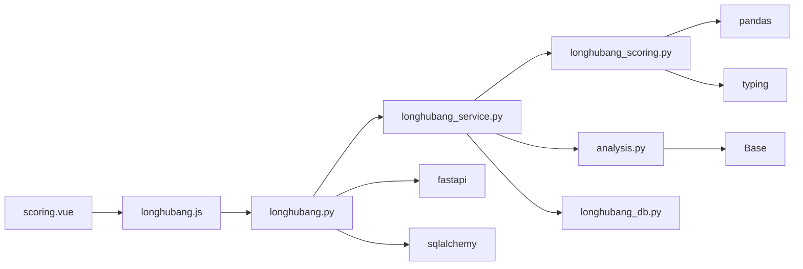

# 评分与排名系统

<cite>
**本文档引用的文件**
- [scoring.vue](file://frontend/src/views/longhubang/scoring.vue)
- [longhubang.py](file://backend/app/api/v1/longhubang.py)
- [longhubang_service.py](file://backend/app/services/longhubang_service.py)
- [longhubang_scoring.py](file://old/longhubang_scoring.py)
- [longhubang_db.py](file://backend/app/db/longhubang_db.py)
- [analysis.py](file://backend/app/models/analysis.py)
- [analysis.py](file://backend/app/schemas/analysis.py)
- [longhubang.js](file://frontend/src/api/longhubang.js)
- [智瞰龙虎AI评分说明.md](file://docs/智瞰龙虎AI评分说明.md)
</cite>

## 目录
1. [简介](#简介)
2. [项目结构](#项目结构)
3. [核心组件](#核心组件)
4. [架构概述](#架构概述)
5. [详细组件分析](#详细组件分析)
6. [依赖分析](#依赖分析)
7. [性能考虑](#性能考虑)
8. [故障排除指南](#故障排除指南)
9. [结论](#结论)

## 简介
本文档全面记录智瞰龙虎评分系统的架构与实现。系统通过AI智能评分模型对龙虎榜上榜股票进行综合评分排名，从资金含金量、净买入额、卖出压力、机构共振等多个维度进行量化评估。前端通过Vue.js实现评分展示界面，后端采用FastAPI提供RESTful API服务，结合数据库存储分析结果。评分模型基于预设算法计算个股在当日龙虎榜中的综合得分与排名，并支持PDF报告生成和历史记录查询功能。

## 项目结构
智瞰龙虎评分系统采用前后端分离架构，前端位于`frontend`目录，后端位于`backend`目录。系统主要功能模块包括龙虎榜分析、评分排名、历史报告和PDF生成等。

**图表来源**
- [scoring.vue](file://frontend/src/views/longhubang/scoring.vue)
- [longhubang.py](file://backend/app/api/v1/longhubang.py)

**本节来源**
- [scoring.vue](file://frontend/src/views/longhubang/scoring.vue)
- [longhubang.py](file://backend/app/api/v1/longhubang.py)

## 核心组件
系统核心组件包括评分引擎、API接口、数据库模型和前端展示界面。评分引擎基于多维度算法计算股票综合得分，API接口提供评分查询、历史记录等服务，数据库存储分析结果，前端实现数据可视化展示。

**本节来源**
- [longhubang_scoring.py](file://old/longhubang_scoring.py)
- [longhubang_service.py](file://backend/app/services/longhubang_service.py)
- [analysis.py](file://backend/app/models/analysis.py)

## 架构概述
系统采用分层架构设计，从前端展示层到后端服务层再到数据存储层，各层职责分明，耦合度低。

**图表来源**
- [longhubang.py](file://backend/app/api/v1/longhubang.py)
- [longhubang_service.py](file://backend/app/services/longhubang_service.py)
- [analysis.py](file://backend/app/models/analysis.py)

## 详细组件分析

### 评分服务分析
评分服务是系统的核心业务逻辑，负责计算股票综合得分和排名。

#### 评分算法实现

**图表来源**
- [longhubang_scoring.py](file://old/longhubang_scoring.py)
- [longhubang_service.py](file://backend/app/services/longhubang_service.py)

#### API接口调用流程

**图表来源**
- [scoring.vue](file://frontend/src/views/longhubang/scoring.vue)
- [longhubang.py](file://backend/app/api/v1/longhubang.py)
- [longhubang_service.py](file://backend/app/services/longhubang_service.py)
- [longhubang_scoring.py](file://old/longhubang_scoring.py)

#### 评分维度量化方法
系统采用多维度评分模型，各维度评分规则如下：

| 评分维度 | 满分 | 量化方法 | 归一化处理 |
|---------|-----|---------|-----------|
| 买入资金含金量 | 30分 | 顶级游资+10分/个 知名游资+5分/个 普通游资+1.5分/个 | 累加后截断至30分 |
| 净买入额 | 25分 | <1000万:0-10分 1000-5000万:10-18分 5000万-1亿:18-22分 >1亿:22-25分 | 分段线性插值 |
| 卖出压力 | 20分 | 卖出比例0-10%:20分 10-30%:15-20分 30-50%:10-15分 50-80%:5-10分 >80%:0-5分 | 反向分段线性插值 |
| 机构共振 | 15分 | 机构+游资共振:15分 仅机构:8-12分 仅游资:5-10分 | 条件判断赋值 |
| 其他加分项 | 10分 | 主力集中度:1-3分 热门概念:0-3分 连续上榜:0-2分 买卖比例:0-2分 | 累加后截断至10分 |

**图表来源**
- [longhubang_scoring.py](file://old/longhubang_scoring.py)
- [智瞰龙虎AI评分说明.md](file://docs/智瞰龙虎AI评分说明.md)

**本节来源**
- [longhubang_scoring.py](file://old/longhubang_scoring.py)
- [longhubang_service.py](file://backend/app/services/longhubang_service.py)
- [智瞰龙虎AI评分说明.md](file://docs/智瞰龙虎AI评分说明.md)

### 前端展示分析
前端实现评分结果的可视化展示和用户交互功能。

#### 数据绑定与渲染逻辑

**图表来源**
- [scoring.vue](file://frontend/src/views/longhubang/scoring.vue)
- [longhubang.js](file://frontend/src/api/longhubang.js)

#### 可视化图表实现
前端使用ECharts实现多种图表可视化：

**图表来源**
- [scoring.vue](file://frontend/src/views/longhubang/scoring.vue)

**本节来源**
- [scoring.vue](file://frontend/src/views/longhubang/scoring.vue)
- [longhubang.js](file://frontend/src/api/longhubang.js)

## 依赖分析
系统各组件之间的依赖关系清晰，采用松耦合设计。

**图表来源**
- [scoring.vue](file://frontend/src/views/longhubang/scoring.vue)
- [longhubang.js](file://frontend/src/api/longhubang.js)
- [longhubang.py](file://backend/app/api/v1/longhubang.py)
- [longhubang_service.py](file://backend/app/services/longhubang_service.py)

**本节来源**
- [longhubang.py](file://backend/app/api/v1/longhubang.py)
- [longhubang_service.py](file://backend/app/services/longhubang_service.py)
- [longhubang_db.py](file://backend/app/db/longhubang_db.py)

## 性能考虑
系统在设计时考虑了性能优化，采用异步处理和缓存机制提高响应速度。

- 评分计算采用向量化操作，利用pandas进行批量处理
- API接口使用async/await实现异步非阻塞
- 数据库查询添加适当索引优化性能
- 支持结果缓存，避免重复计算
- 前端实现懒加载和虚拟滚动

## 故障排除指南
常见问题及解决方案：

1. **评分接口返回500错误**
   - 检查数据库连接是否正常
   - 验证report_id是否存在
   - 查看服务日志获取详细错误信息

2. **前端无法显示评分数据**
   - 检查网络请求是否成功
   - 验证API地址配置是否正确
   - 确认后端服务是否正常运行

3. **评分结果不准确**
   - 核对评分算法参数
   - 检查原始数据质量
   - 验证计算逻辑是否正确

4. **页面加载缓慢**
   - 检查数据量是否过大
   - 确认是否需要分页处理
   - 优化数据库查询性能

**本节来源**
- [longhubang.py](file://backend/app/api/v1/longhubang.py)
- [longhubang_service.py](file://backend/app/services/longhubang_service.py)
- [scoring.vue](file://frontend/src/views/longhubang/scoring.vue)

## 结论
智瞰龙虎评分系统通过科学的多维度评分模型，实现了对龙虎榜股票的智能化评估。系统架构清晰，前后端分离设计便于维护和扩展。评分算法综合考虑资金含金量、净买入额、卖出压力等多个因素，量化评估股票投资价值。前端界面直观展示评分结果，支持多种可视化图表。系统具备良好的可配置性和扩展性，可根据市场变化调整评分权重，支持版本迭代管理。整体系统为投资者提供了有价值的决策参考工具。