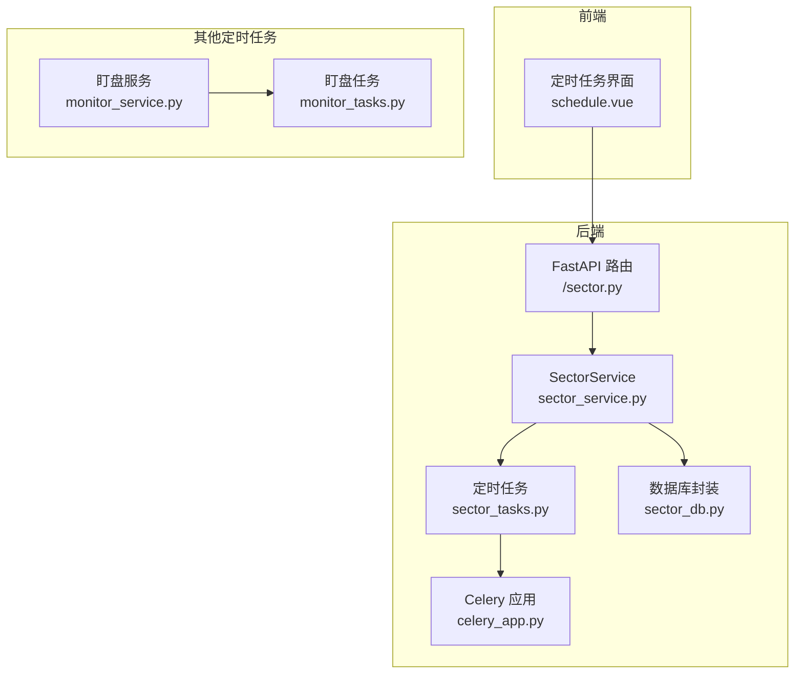
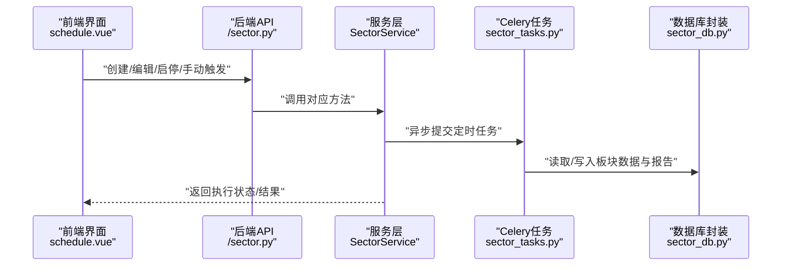
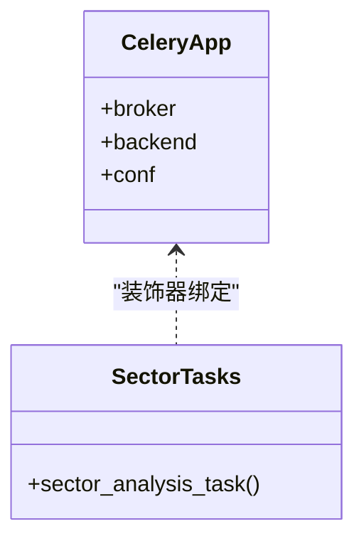
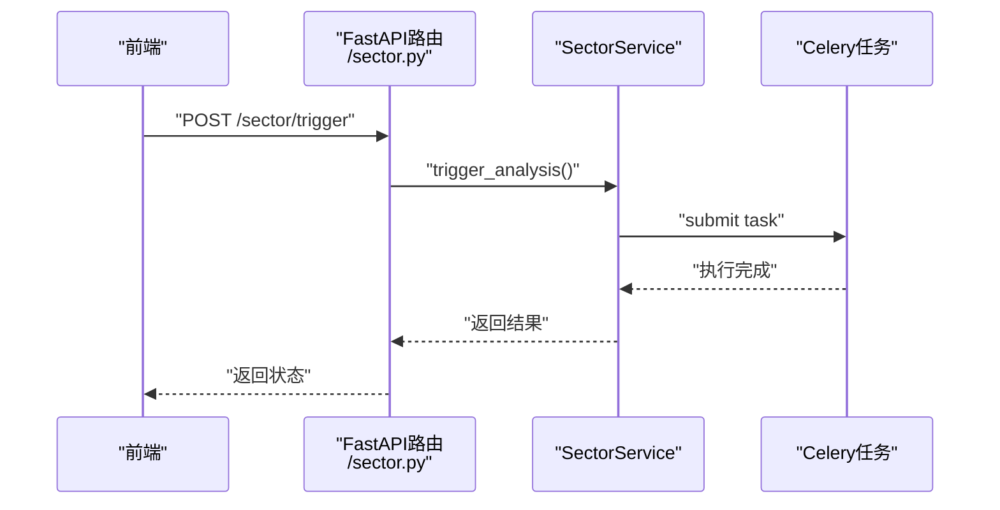
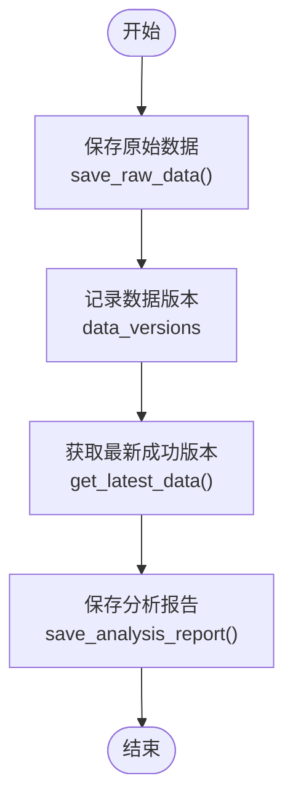
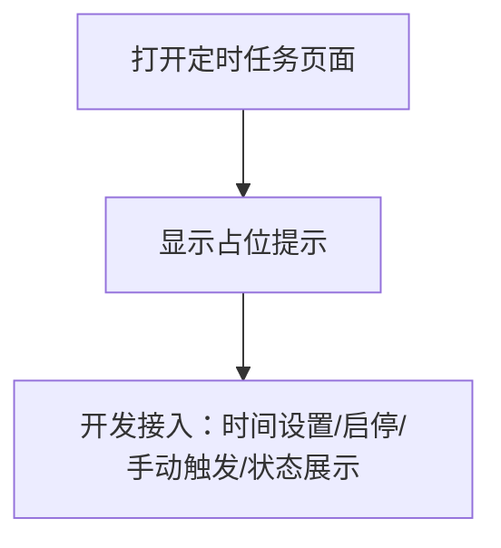
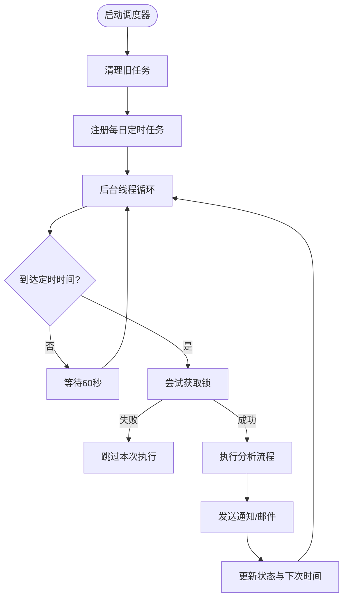
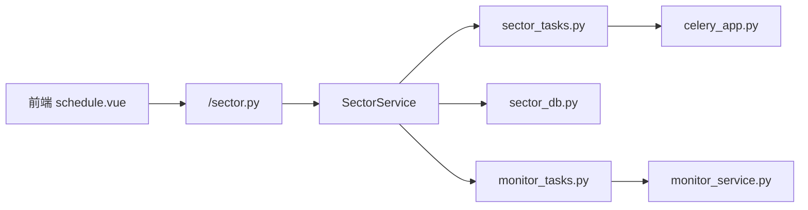

# 定时板块分析

<cite>
**本文引用的文件**
- [backend/app/tasks/sector_tasks.py](file://backend/app/tasks/sector_tasks.py)
- [backend/app/tasks/celery_app.py](file://backend/app/tasks/celery_app.py)
- [backend/app/services/sector_service.py](file://backend/app/services/sector_service.py)
- [backend/app/api/v1/sector.py](file://backend/app/api/v1/sector.py)
- [frontend/src/views/sector/schedule.vue](file://frontend/src/views/sector/schedule.vue)
- [docs/智策定时分析使用指南.md](file://docs/智策定时分析使用指南.md)
- [backend/app/db/sector_db.py](file://backend/app/db/sector_db.py)
- [backend/app/tasks/monitor_tasks.py](file://backend/app/tasks/monitor_tasks.py)
- [backend/app/services/monitor_service.py](file://backend/app/services/monitor_service.py)
- [backend/app/api/v1/monitor.py](file://backend/app/api/v1/monitor.py)
- [old/sector_strategy_scheduler.py](file://old/sector_strategy_scheduler.py)
</cite>

## 目录
1. [简介](#简介)
2. [项目结构](#项目结构)
3. [核心组件](#核心组件)
4. [架构总览](#架构总览)
5. [详细组件分析](#详细组件分析)
6. [依赖关系分析](#依赖关系分析)
7. [性能与资源协调](#性能与资源协调)
8. [故障排查与最佳实践](#故障排查与最佳实践)
9. [结论](#结论)

## 简介
本文件聚焦“智策板块”的定时分析任务调度机制，围绕后端 Celery 任务模块与服务层协作、前端定时任务管理界面、以及与其他系统定时任务（如盯盘、持仓更新）的资源协调进行深入解析。文档同时给出定时任务配置方式、执行上下文管理、异常重试策略、日志追踪与执行状态监控的最佳实践，并结合实际配置案例说明如何设置每日开盘前自动分析任务。

## 项目结构
- 后端采用 FastAPI + SQLAlchemy + Celery 架构，定时分析任务以 Celery 任务形式存在，服务层负责业务逻辑与数据持久化，API 层提供对外接口。
- 前端提供“定时任务”页面占位组件，用于后续接入定时任务管理功能。
- 文档提供了完整的使用指南，包括邮件配置、启动停止、手动触发、日志查看等。

**图示来源**
- [backend/app/api/v1/sector.py](file://backend/app/api/v1/sector.py#L1-L107)
- [backend/app/services/sector_service.py](file://backend/app/services/sector_service.py#L1-L48)
- [backend/app/tasks/sector_tasks.py](file://backend/app/tasks/sector_tasks.py#L1-L13)
- [backend/app/tasks/celery_app.py](file://backend/app/tasks/celery_app.py#L1-L21)
- [backend/app/db/sector_db.py](file://backend/app/db/sector_db.py#L1-L120)
- [frontend/src/views/sector/schedule.vue](file://frontend/src/views/sector/schedule.vue#L1-L14)
- [backend/app/tasks/monitor_tasks.py](file://backend/app/tasks/monitor_tasks.py#L1-L13)
- [backend/app/services/monitor_service.py](file://backend/app/services/monitor_service.py#L1-L120)

**Section sources**
- [backend/app/api/v1/sector.py](file://backend/app/api/v1/sector.py#L1-L107)
- [backend/app/services/sector_service.py](file://backend/app/services/sector_service.py#L1-L48)
- [backend/app/tasks/sector_tasks.py](file://backend/app/tasks/sector_tasks.py#L1-L13)
- [backend/app/tasks/celery_app.py](file://backend/app/tasks/celery_app.py#L1-L21)
- [frontend/src/views/sector/schedule.vue](file://frontend/src/views/sector/schedule.vue#L1-L14)
- [docs/智策定时分析使用指南.md](file://docs/智策定时分析使用指南.md#L1-L120)

## 核心组件
- Celery 应用与任务
  - Celery 应用在 celery_app.py 中初始化，配置序列化、时区与 Redis 作为消息中间件。
  - sector_tasks.py 定义了定时任务入口，当前为占位实现，后续将填充板块分析逻辑。
- 服务层与 API
  - sector_service.py 提供分析、定时任务管理、手动触发、历史报告与 PDF 生成等接口占位。
  - sector.py 提供对外 API：分析、定时任务 CRUD、手动触发、历史与 PDF。
- 数据层
  - sector_db.py 提供板块数据与分析报告的 SQLite 数据库封装，支持版本化存储与清理。
- 前端界面
  - schedule.vue 当前为占位组件，后续将接入定时任务的创建、编辑、启停与状态展示。
- 其他定时任务参考
  - old/sector_strategy_scheduler.py 展示了基于 schedule 库的本地定时器实现，包含并发锁、通知去重、状态查询等特性，可作为 Celery 方案的对照参考。
  - monitor_tasks.py 与 monitor_service.py 展示了盯盘任务的 Celery 任务与服务实现，便于理解系统中定时任务的统一模式。

**Section sources**
- [backend/app/tasks/celery_app.py](file://backend/app/tasks/celery_app.py#L1-L21)
- [backend/app/tasks/sector_tasks.py](file://backend/app/tasks/sector_tasks.py#L1-L13)
- [backend/app/services/sector_service.py](file://backend/app/services/sector_service.py#L1-L48)
- [backend/app/api/v1/sector.py](file://backend/app/api/v1/sector.py#L1-L107)
- [backend/app/db/sector_db.py](file://backend/app/db/sector_db.py#L1-L120)
- [frontend/src/views/sector/schedule.vue](file://frontend/src/views/sector/schedule.vue#L1-L14)
- [old/sector_strategy_scheduler.py](file://old/sector_strategy_scheduler.py#L1-L120)
- [backend/app/tasks/monitor_tasks.py](file://backend/app/tasks/monitor_tasks.py#L1-L13)
- [backend/app/services/monitor_service.py](file://backend/app/services/monitor_service.py#L1-L120)

## 架构总览
定时分析的端到端流程如下：
- 前端发起定时任务管理请求（创建/编辑/启停/手动触发）。
- 后端 API 接收请求，调用 SectorService 执行业务逻辑。
- SectorService 触发 Celery 任务（sector_tasks.py），任务在 Celery Worker 中执行。
- 任务执行过程中访问数据库（sector_db.py）进行数据读写与版本化管理。
- 任务完成后，系统可通过邮件等方式输出分析结果（参考使用指南）。

**图示来源**
- [frontend/src/views/sector/schedule.vue](file://frontend/src/views/sector/schedule.vue#L1-L14)
- [backend/app/api/v1/sector.py](file://backend/app/api/v1/sector.py#L1-L107)
- [backend/app/services/sector_service.py](file://backend/app/services/sector_service.py#L1-L48)
- [backend/app/tasks/sector_tasks.py](file://backend/app/tasks/sector_tasks.py#L1-L13)
- [backend/app/db/sector_db.py](file://backend/app/db/sector_db.py#L1-L120)

## 详细组件分析

### Celery 应用与任务模块
- Celery 应用初始化
  - 在 celery_app.py 中创建 Celery 实例，使用 Redis 作为 broker 和 backend；设置序列化、时区与 UTC。
- 定时任务定义
  - sector_tasks.py 定义了 @celery_app.task 的入口函数，当前为占位实现，后续将填充板块分析逻辑。

**图示来源**
- [backend/app/tasks/celery_app.py](file://backend/app/tasks/celery_app.py#L1-L21)
- [backend/app/tasks/sector_tasks.py](file://backend/app/tasks/sector_tasks.py#L1-L13)

**Section sources**
- [backend/app/tasks/celery_app.py](file://backend/app/tasks/celery_app.py#L1-L21)
- [backend/app/tasks/sector_tasks.py](file://backend/app/tasks/sector_tasks.py#L1-L13)

### 服务层与 API
- SectorService
  - 提供 analyze_sector、get_schedule、set_schedule、delete_schedule、trigger_analysis、get_history、generate_pdf 等方法占位。
- API 路由
  - /sector/analyze：手动触发分析
  - /sector/schedule：查询/设置/删除定时任务
  - /sector/trigger：手动触发一次分析
  - /sector/history：历史报告
  - /sector/generate-pdf：生成PDF

**图示来源**
- [backend/app/api/v1/sector.py](file://backend/app/api/v1/sector.py#L1-L107)
- [backend/app/services/sector_service.py](file://backend/app/services/sector_service.py#L1-L48)

**Section sources**
- [backend/app/api/v1/sector.py](file://backend/app/api/v1/sector.py#L1-L107)
- [backend/app/services/sector_service.py](file://backend/app/services/sector_service.py#L1-L48)

### 数据层与版本化存储
- sector_db.py 提供：
  - 板块原始数据表、新闻数据表、分析报告表、追踪表与数据版本表。
  - 保存/获取/清理数据与版本化管理，支持按日期与版本检索最新数据。
  - 保存分析报告、删除报告、获取报告详情等。

**图示来源**
- [backend/app/db/sector_db.py](file://backend/app/db/sector_db.py#L1-L200)
- [backend/app/db/sector_db.py](file://backend/app/db/sector_db.py#L314-L364)

**Section sources**
- [backend/app/db/sector_db.py](file://backend/app/db/sector_db.py#L1-L200)
- [backend/app/db/sector_db.py](file://backend/app/db/sector_db.py#L314-L364)

### 前端定时任务管理界面
- schedule.vue 当前为占位组件，仅显示“定时任务配置功能开发中…”。
- 后续应接入：
  - 定时时间设置（支持盘前/盘后/夜间）
  - 启动/停止定时任务
  - 手动触发一次分析
  - 查看下次运行时间与状态

**图示来源**
- [frontend/src/views/sector/schedule.vue](file://frontend/src/views/sector/schedule.vue#L1-L14)

**Section sources**
- [frontend/src/views/sector/schedule.vue](file://frontend/src/views/sector/schedule.vue#L1-L14)

### 与其他定时任务的资源协调
- 参考 old/sector_strategy_scheduler.py 的实现，展示了：
  - 并发锁（防止重复执行）
  - 通知去重（5分钟内不重复发送）
  - 状态查询（运行中/启用中/下次运行时间）
  - 后台线程循环与任务取消
- 系统中其他定时任务（如盯盘）可采用类似模式，避免资源竞争与重复执行。

**图示来源**
- [old/sector_strategy_scheduler.py](file://old/sector_strategy_scheduler.py#L42-L120)
- [old/sector_strategy_scheduler.py](file://old/sector_strategy_scheduler.py#L120-L200)

**Section sources**
- [old/sector_strategy_scheduler.py](file://old/sector_strategy_scheduler.py#L42-L120)
- [old/sector_strategy_scheduler.py](file://old/sector_strategy_scheduler.py#L120-L200)

## 依赖关系分析
- 组件耦合
  - API 层依赖服务层；服务层依赖 Celery 任务与数据库封装。
  - 前端依赖后端 API；当前前端组件为占位，后续需对接。
- 外部依赖
  - Celery 使用 Redis 作为 broker/backend。
  - 数据库封装使用 SQLite（可替换为 PostgreSQL）。
  - 邮件通知依赖 .env 中的 SMTP 配置（参考使用指南）。

**图示来源**
- [frontend/src/views/sector/schedule.vue](file://frontend/src/views/sector/schedule.vue#L1-L14)
- [backend/app/api/v1/sector.py](file://backend/app/api/v1/sector.py#L1-L107)
- [backend/app/services/sector_service.py](file://backend/app/services/sector_service.py#L1-L48)
- [backend/app/tasks/sector_tasks.py](file://backend/app/tasks/sector_tasks.py#L1-L13)
- [backend/app/tasks/celery_app.py](file://backend/app/tasks/celery_app.py#L1-L21)
- [backend/app/db/sector_db.py](file://backend/app/db/sector_db.py#L1-L120)
- [backend/app/tasks/monitor_tasks.py](file://backend/app/tasks/monitor_tasks.py#L1-L13)
- [backend/app/services/monitor_service.py](file://backend/app/services/monitor_service.py#L1-L120)

**Section sources**
- [backend/app/api/v1/sector.py](file://backend/app/api/v1/sector.py#L1-L107)
- [backend/app/services/sector_service.py](file://backend/app/services/sector_service.py#L1-L48)
- [backend/app/tasks/sector_tasks.py](file://backend/app/tasks/sector_tasks.py#L1-L13)
- [backend/app/tasks/celery_app.py](file://backend/app/tasks/celery_app.py#L1-L21)
- [backend/app/db/sector_db.py](file://backend/app/db/sector_db.py#L1-L120)
- [backend/app/tasks/monitor_tasks.py](file://backend/app/tasks/monitor_tasks.py#L1-L13)
- [backend/app/services/monitor_service.py](file://backend/app/services/monitor_service.py#L1-L120)

## 性能与资源协调
- 并发与锁
  - 建议在 Celery 任务中加入互斥锁，避免同一时间多次执行导致资源竞争与重复通知。
- 资源隔离
  - 将数据获取、AI 分析、邮件发送拆分为独立步骤，便于监控与重试。
- 通知去重
  - 参考 old/sector_strategy_scheduler.py 的通知去重策略（如5分钟内不重复发送），降低通知风暴。
- 时区与时钟
  - Celery 应使用 Asia/Shanghai 时区，确保定时任务在正确时间点执行。
- 数据版本化
  - 使用 sector_db.py 的版本化存储，避免数据覆盖与回溯困难。

[无直接文件分析引用]

## 故障排查与最佳实践

### 定时任务配置与执行上下文
- 邮件配置
  - 参考使用指南中的 .env 配置项（SMTP_SERVER、SMTP_PORT、EMAIL_FROM、EMAIL_PASSWORD、EMAIL_TO）。
- 启动/停止/手动触发
  - 通过后端 API 或前端界面进行启停与手动触发。
- 下次运行时间
  - 可通过状态查询接口获取（参考 SectorService 的状态方法占位与 old/sector_strategy_scheduler.py 的状态查询思路）。

**Section sources**
- [docs/智策定时分析使用指南.md](file://docs/智策定时分析使用指南.md#L1-L120)
- [backend/app/api/v1/sector.py](file://backend/app/api/v1/sector.py#L1-L107)
- [backend/app/services/sector_service.py](file://backend/app/services/sector_service.py#L1-L48)
- [old/sector_strategy_scheduler.py](file://old/sector_strategy_scheduler.py#L574-L600)

### 异常重试策略
- Celery 重试
  - 在 sector_tasks.py 中可配置任务重试策略（如 retry、max_retries、retry_backoff 等），并捕获常见异常（网络、API、数据库）。
- 通知失败处理
  - 若邮件发送失败，记录错误并重试或降级为日志输出。
- 数据获取失败
  - 对数据源不可用的情况，等待重试或提示用户稍后再试。

**Section sources**
- [backend/app/tasks/sector_tasks.py](file://backend/app/tasks/sector_tasks.py#L1-L13)
- [old/sector_strategy_scheduler.py](file://old/sector_strategy_scheduler.py#L120-L200)

### 日志追踪与执行状态监控
- 控制台日志
  - 参考使用指南中的日志输出示例，包含“开始定时分析”、“数据获取成功/失败”、“分析完成/失败”、“邮件发送成功/失败”等关键节点。
- 状态查询
  - 可参考 old/sector_strategy_scheduler.py 的 get_status 方法，返回 running/enabled/schedule_time/last_run_time/next_run_time 等状态信息。
- 前端状态展示
  - 建议在 schedule.vue 中展示“运行中/已停止”、“下次运行时间”、“最近一次运行时间”等信息。

**Section sources**
- [docs/智策定时分析使用指南.md](file://docs/智策定时分析使用指南.md#L306-L330)
- [old/sector_strategy_scheduler.py](file://old/sector_strategy_scheduler.py#L574-L600)
- [frontend/src/views/sector/schedule.vue](file://frontend/src/views/sector/schedule.vue#L1-L14)

### 实际配置案例：每日开盘前自动分析
- 时间设置
  - 建议设置在盘前（例如 08:00-09:00），避开交易高峰时段，确保数据更稳定。
- 资源协调
  - 若系统同时运行盯盘任务，建议：
    - 为不同任务分配不同的 Celery 队列或 worker 进程，避免 CPU/IO 抢占。
    - 在任务中增加互斥锁与通知去重，避免重复执行与重复通知。
- 执行流程
  - 数据获取 → AI 分析 → 生成报告 → 邮件发送 → 记录状态与日志。

**Section sources**
- [docs/智策定时分析使用指南.md](file://docs/智策定时分析使用指南.md#L218-L245)
- [old/sector_strategy_scheduler.py](file://old/sector_strategy_scheduler.py#L42-L120)

## 结论
- 当前后端已具备 Celery 应用与任务占位、服务层与 API 占位、数据库封装与前端占位组件。
- 建议尽快完善 sector_tasks.py 的板块分析逻辑，并在 SectorService 中实现定时任务管理与手动触发的具体业务逻辑。
- 参考 old/sector_strategy_scheduler.py 的并发锁、通知去重与状态查询模式，提升定时任务的稳定性与可观测性。
- 通过合理的队列/进程隔离与重试策略，确保定时分析与盯盘、持仓更新等任务在资源上协调共存。