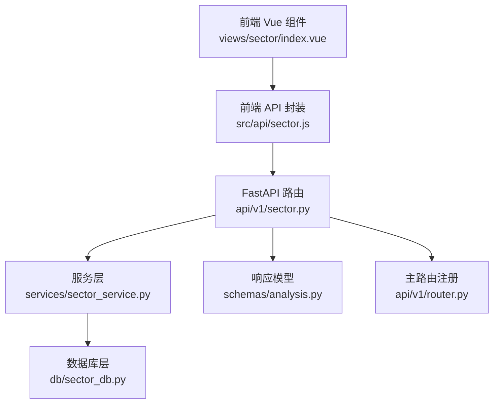
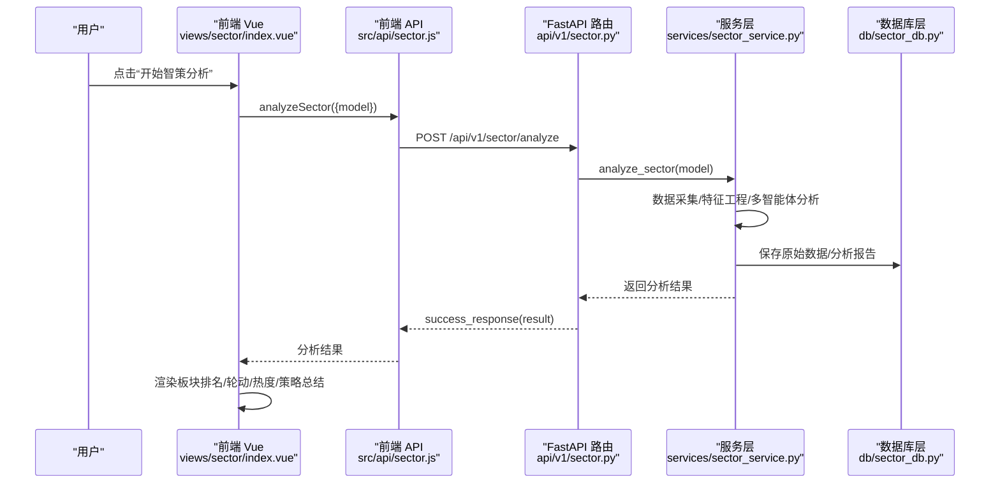
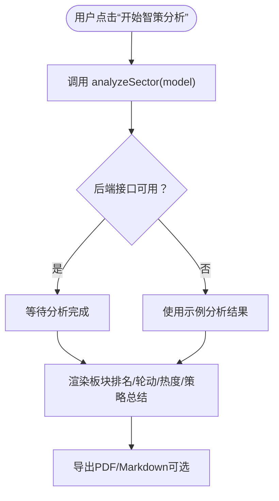
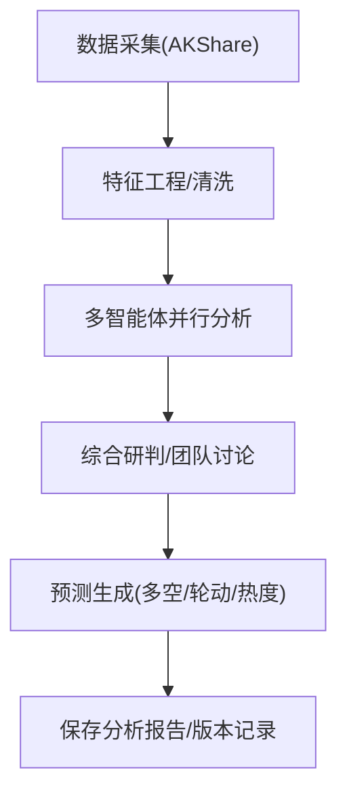
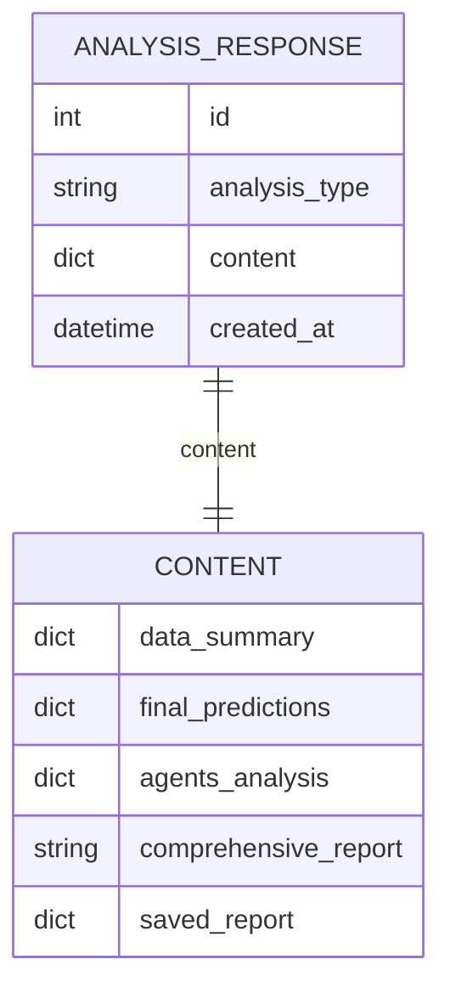
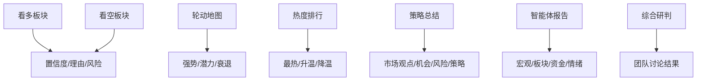
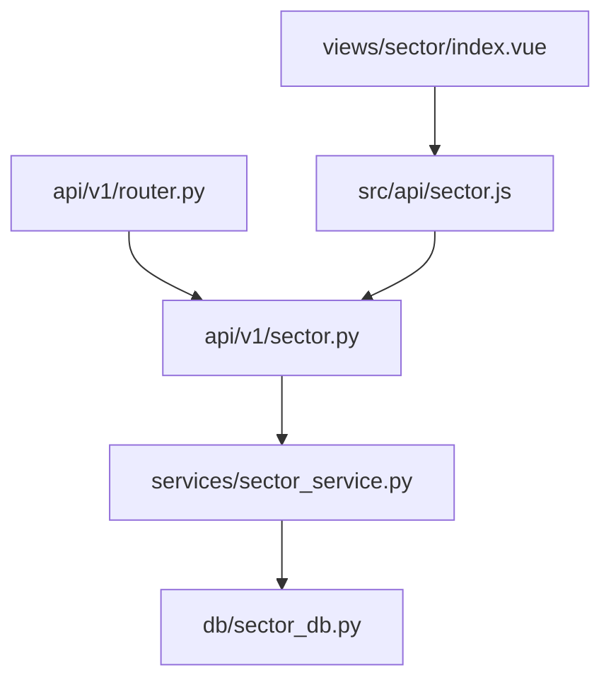

# 实时板块分析

<cite>
**本文引用的文件**
- [backend/app/api/v1/sector.py](file://backend/app/api/v1/sector.py)
- [backend/app/services/sector_service.py](file://backend/app/services/sector_service.py)
- [backend/app/db/sector_db.py](file://backend/app/db/sector_db.py)
- [backend/app/schemas/analysis.py](file://backend/app/schemas/analysis.py)
- [backend/app/api/v1/router.py](file://backend/app/api/v1/router.py)
- [frontend/src/api/sector.js](file://frontend/src/api/sector.js)
- [frontend/src/views/sector/index.vue](file://frontend/src/views/sector/index.vue)
- [docs/智策板块使用指南.md](file://docs/智策板块使用指南.md)
- [docs/智策功能总览.md](file://docs/智策功能总览.md)
- [docs/智策板块快速开始.md](file://docs/智策板块快速开始.md)
</cite>

## 目录
1. [引言](#引言)
2. [项目结构](#项目结构)
3. [核心组件](#核心组件)
4. [架构总览](#架构总览)
5. [详细组件分析](#详细组件分析)
6. [依赖分析](#依赖分析)
7. [性能考虑](#性能考虑)
8. [故障排查指南](#故障排查指南)
9. [结论](#结论)
10. [附录](#附录)

## 引言
本文件面向“智策板块”的实时分析能力，系统性说明从前端触发、后端接口到服务层、数据层与响应结构的设计与实现要点。重点涵盖：
- 前端通过API触发板块数据的即时分析
- 后端服务层的分析入口、数据聚合与AI评分处理流程
- 响应结果的数据结构设计
- 资金流向、市场情绪等多维度数据的整合逻辑
- 板块热度指数的计算方式
- 前端Vue组件对分析结果的可视化呈现（板块排名表格、涨跌分布、趋势热力图等）
- 实际调用示例与常见问题排查（数据延迟、评分异常）

## 项目结构
智策板块分析涉及前后端与数据库层的协同：
- 前端：通过API模块调用后端接口，渲染分析结果与可视化
- 后端：FastAPI路由接收请求，调用服务层执行分析，持久化历史报告
- 数据层：SQLite数据库存储原始数据、分析报告与版本信息



**图表来源**
- [frontend/src/views/sector/index.vue](file://frontend/src/views/sector/index.vue#L1-L120)
- [frontend/src/api/sector.js](file://frontend/src/api/sector.js#L1-L64)
- [backend/app/api/v1/sector.py](file://backend/app/api/v1/sector.py#L1-L107)
- [backend/app/services/sector_service.py](file://backend/app/services/sector_service.py#L1-L48)
- [backend/app/db/sector_db.py](file://backend/app/db/sector_db.py#L1-L120)
- [backend/app/schemas/analysis.py](file://backend/app/schemas/analysis.py#L1-L21)
- [backend/app/api/v1/router.py](file://backend/app/api/v1/router.py#L1-L36)

**章节来源**
- [frontend/src/views/sector/index.vue](file://frontend/src/views/sector/index.vue#L1-L120)
- [frontend/src/api/sector.js](file://frontend/src/api/sector.js#L1-L64)
- [backend/app/api/v1/sector.py](file://backend/app/api/v1/sector.py#L1-L107)
- [backend/app/services/sector_service.py](file://backend/app/services/sector_service.py#L1-L48)
- [backend/app/db/sector_db.py](file://backend/app/db/sector_db.py#L1-L120)
- [backend/app/schemas/analysis.py](file://backend/app/schemas/analysis.py#L1-L21)
- [backend/app/api/v1/router.py](file://backend/app/api/v1/router.py#L1-L36)

## 核心组件
- 前端分析触发与结果渲染
  - 触发分析：选择模型后点击“开始智策分析”，调用POST /api/v1/sector/analyze
  - 手动触发：POST /api/v1/sector/trigger
  - 历史加载：GET /api/v1/sector/history
  - PDF导出：POST /api/v1/sector/generate-pdf
- 后端路由与服务
  - FastAPI路由：提供分析、定时任务、历史、PDF导出等接口
  - SectorService：分析入口、定时任务、历史与PDF生成（当前为占位）
  - 数据库：保存原始数据、分析报告、版本信息
- 响应结构
  - AnalysisResponse：统一响应模型，包含分析类型、内容与时间戳

**章节来源**
- [frontend/src/api/sector.js](file://frontend/src/api/sector.js#L1-L64)
- [frontend/src/views/sector/index.vue](file://frontend/src/views/sector/index.vue#L1-L120)
- [backend/app/api/v1/sector.py](file://backend/app/api/v1/sector.py#L1-L107)
- [backend/app/services/sector_service.py](file://backend/app/services/sector_service.py#L1-L48)
- [backend/app/schemas/analysis.py](file://backend/app/schemas/analysis.py#L1-L21)

## 架构总览
下图展示了从用户点击到分析完成的关键交互路径与数据流。



**图表来源**
- [frontend/src/views/sector/index.vue](file://frontend/src/views/sector/index.vue#L718-L736)
- [frontend/src/api/sector.js](file://frontend/src/api/sector.js#L1-L10)
- [backend/app/api/v1/sector.py](file://backend/app/api/v1/sector.py#L14-L26)
- [backend/app/services/sector_service.py](file://backend/app/services/sector_service.py#L13-L16)
- [backend/app/db/sector_db.py](file://backend/app/db/sector_db.py#L314-L364)

## 详细组件分析

### 前端触发与结果渲染
- 触发分析
  - 用户选择模型后，handleAnalyze调用analyzeSector，等待后端返回
  - 若后端未就绪，前端回退到示例分析结果，提示“接口暂未打通”
- 结果渲染
  - 快速统计卡片、市场概览、核心预测（看多/看空）、板块轮动地图、热度排行、策略总结、智能体报告、综合研判
  - 热度排行表格：最热、升温、降温三列分别展示板块、热度、趋势
  - PDF导出：Markdown/PDF两种导出方式
- 定时任务与手动触发
  - 加载/保存定时任务，手动触发一次定时运行



**图表来源**
- [frontend/src/views/sector/index.vue](file://frontend/src/views/sector/index.vue#L718-L736)
- [frontend/src/api/sector.js](file://frontend/src/api/sector.js#L1-L10)

**章节来源**
- [frontend/src/views/sector/index.vue](file://frontend/src/views/sector/index.vue#L1-L268)
- [frontend/src/api/sector.js](file://frontend/src/api/sector.js#L1-L64)

### 后端接口与服务层
- FastAPI路由
  - POST /api/v1/sector/analyze：接收模型参数，调用服务层执行分析
  - GET /api/v1/sector/schedule：获取定时任务
  - POST /api/v1/sector/schedule：设置定时任务
  - DELETE /api/v1/sector/schedule/{id}：删除定时任务
  - POST /api/v1/sector/trigger：手动触发一次定时任务
  - GET /api/v1/sector/history：获取历史报告
  - POST /api/v1/sector/generate-pdf：生成PDF
- SectorService
  - analyze_sector(model)：分析入口（当前为占位）
  - trigger_analysis()：手动触发分析（当前为占位）
  - get_schedule/set_schedule/delete_schedule：定时任务管理（当前为占位）
  - get_history/generate_pdf：历史与PDF（当前为占位）

```mermaid
classDiagram
class SectorService {
+analyze_sector(model)
+trigger_analysis()
+get_schedule()
+set_schedule(schedule_time, enabled)
+delete_schedule(schedule_id)
+get_history(page, page_size)
+generate_pdf(report_id)
}
class SectorAPI {
+POST /sector/analyze
+GET /sector/schedule
+POST /sector/schedule
+DELETE /sector/schedule/{id}
+POST /sector/trigger
+GET /sector/history
+POST /sector/generate-pdf
}
SectorAPI --> SectorService : "调用"
```

**图表来源**
- [backend/app/api/v1/sector.py](file://backend/app/api/v1/sector.py#L1-L107)
- [backend/app/services/sector_service.py](file://backend/app/services/sector_service.py#L1-L48)

**章节来源**
- [backend/app/api/v1/sector.py](file://backend/app/api/v1/sector.py#L1-L107)
- [backend/app/services/sector_service.py](file://backend/app/services/sector_service.py#L1-L48)

### 数据聚合与AI评分处理流程
- 数据采集与特征工程
  - 使用AKShare获取行业/概念板块、资金流向、市场概览、北向资金、新闻等数据
  - 数据清洗与特征提取，形成可用于AI分析的结构化输入
- 多智能体并行分析
  - 宏观策略师：政策、宏观、新闻
  - 板块诊断师：行业轮动、估值、景气度
  - 资金流向分析师：主力、北向、量价配合
  - 市场情绪解码员：赚钱效应、热点热度、恐慌贪婪
- 综合研判与预测生成
  - 四位智能体报告合并，进行团队讨论与权重考量
  - 输出板块多空、轮动、热度预测与策略总结
- 历史报告与版本管理
  - 保存分析内容、置信度、风险等级、市场展望等
  - 数据版本记录，便于缓存与回溯



**图表来源**
- [docs/智策功能总览.md](file://docs/智策功能总览.md#L1-L200)
- [docs/智策板块使用指南.md](file://docs/智策板块使用指南.md#L220-L241)
- [backend/app/db/sector_db.py](file://backend/app/db/sector_db.py#L314-L364)

**章节来源**
- [docs/智策功能总览.md](file://docs/智策功能总览.md#L1-L200)
- [docs/智策板块使用指南.md](file://docs/智策板块使用指南.md#L220-L241)
- [backend/app/db/sector_db.py](file://backend/app/db/sector_db.py#L314-L364)

### 响应结果结构设计
- 统一响应模型
  - AnalysisResponse：包含id、analysis_type、content、created_at
- 分析结果典型字段
  - data_summary：市场概览（上证指数、上涨家数、行业/概念数量）
  - final_predictions：核心预测（long_short、rotation、heat、summary）
  - agents_analysis：四位智能体报告
  - comprehensive_report：综合研判
  - saved_report：历史报告元信息（置信度、风险等级、市场展望、数据区间）
- 前端消费
  - handleAnalyze接收后端返回payload，赋值给analysisResult并渲染



**图表来源**
- [backend/app/schemas/analysis.py](file://backend/app/schemas/analysis.py#L1-L21)
- [frontend/src/views/sector/index.vue](file://frontend/src/views/sector/index.vue#L718-L736)

**章节来源**
- [backend/app/schemas/analysis.py](file://backend/app/schemas/analysis.py#L1-L21)
- [frontend/src/views/sector/index.vue](file://frontend/src/views/sector/index.vue#L718-L736)

### 资金流向与市场情绪整合
- 资金流向
  - 主力净流入、超大单/大单/中单/小单流向
  - 20日累计净流入/净流出、趋势性特征、流入天数占比
  - 量价配合、关键信号识别（买入/卖出/观望）
- 市场情绪
  - 赚钱效应指数、涨停家数、连板高度
  - 恐慌/贪婪指数分级与解读
- 多维度融合
  - 资金面与情绪面共同影响板块热度与轮动
  - 智能体在Prompt中强调基于真实资金流向数据的趋势分析

**章节来源**
- [docs/智策功能总览.md](file://docs/智策功能总览.md#L114-L147)
- [docs/季报和资金流向更新说明.md](file://docs/季报和资金流向更新说明.md#L80-L160)
- [docs/智策板块使用指南.md](file://docs/智策板块使用指南.md#L220-L241)

### 板块热度指数计算
- 热度评分来源
  - 市场情绪、板块涨跌强度、资金流入强度、赚钱效应等多因子加权
  - 文档中给出0-100分的区间划分与解读
- 前端展示
  - 热度排行表格：最热、升温、降温三类板块，分别按热度排序
  - 策略总结：市场观点、核心机会、主要风险、整体策略

**章节来源**
- [docs/智策板块使用指南.md](file://docs/智策板块使用指南.md#L122-L140)
- [frontend/src/views/sector/index.vue](file://frontend/src/views/sector/index.vue#L188-L214)

### 前端可视化呈现
- 板块排名表格
  - 看多/看空板块列表，显示板块名称、置信度、理由与风险
- 板块轮动地图
  - 当前强势、潜力接力、衰退板块的时间窗口、逻辑与建议
- 策略总结
  - 市场观点、核心机会、主要风险、整体策略
- 智能体报告
  - 四位分析师的职责、关注领域、分析文本与时间戳
- 综合研判
  - 团队讨论结果与最终报告



**图表来源**
- [frontend/src/views/sector/index.vue](file://frontend/src/views/sector/index.vue#L104-L268)

**章节来源**
- [frontend/src/views/sector/index.vue](file://frontend/src/views/sector/index.vue#L104-L268)

## 依赖分析
- 路由注册
  - api/v1/router.py将/sector路由挂载至/api/v1/sector，统一标签为“智策板块”
- 前后端依赖
  - 前端API封装与组件方法相互依赖，确保接口调用与结果渲染一致
- 数据库依赖
  - sector_db提供原始数据保存、分析报告保存、版本管理与历史查询



**图表来源**
- [backend/app/api/v1/router.py](file://backend/app/api/v1/router.py#L1-L36)
- [backend/app/api/v1/sector.py](file://backend/app/api/v1/sector.py#L1-L107)
- [backend/app/services/sector_service.py](file://backend/app/services/sector_service.py#L1-L48)
- [backend/app/db/sector_db.py](file://backend/app/db/sector_db.py#L1-L120)
- [frontend/src/api/sector.js](file://frontend/src/api/sector.js#L1-L64)
- [frontend/src/views/sector/index.vue](file://frontend/src/views/sector/index.vue#L1-L120)

**章节来源**
- [backend/app/api/v1/router.py](file://backend/app/api/v1/router.py#L1-L36)
- [backend/app/api/v1/sector.py](file://backend/app/api/v1/sector.py#L1-L107)
- [backend/app/services/sector_service.py](file://backend/app/services/sector_service.py#L1-L48)
- [backend/app/db/sector_db.py](file://backend/app/db/sector_db.py#L1-L120)
- [frontend/src/api/sector.js](file://frontend/src/api/sector.js#L1-L64)
- [frontend/src/views/sector/index.vue](file://frontend/src/views/sector/index.vue#L1-L120)

## 性能考虑
- 数据获取与AI分析耗时较长，建议：
  - 前端显示加载状态与提示
  - 后端采用异步处理与并发（当前服务层为占位，后续可引入任务队列）
  - 缓存近期数据，减少重复抓取
- 响应体积控制
  - AnalysisResponse仅传递必要字段，避免冗余
- 可扩展性
  - 多智能体并行分析，可按需启用/禁用特定分析师
  - 历史报告分页查询，避免一次性传输大量数据

[本节为通用指导，无需列出具体文件来源]

## 故障排查指南
- 数据获取失败
  - 检查网络与AKShare服务状态，稍后重试
- API调用失败
  - 检查DeepSeek API Key配置与有效性
- 分析超时
  - 更换时间段或降低并发，重试分析
- 定时任务未就绪
  - 前端回退到示例配置，等待后端实现
- PDF导出异常
  - 确认后端generate-pdf接口可用，或使用Markdown导出

**章节来源**
- [docs/智策板块快速开始.md](file://docs/智策板块快速开始.md#L140-L161)

## 结论
智策板块的实时分析以“多智能体协同+多维度数据融合”为核心，从前端触发到后端服务与数据库持久化形成闭环。当前服务层接口为占位实现，后续可结合历史数据与版本管理完善分析流程与响应结构，同时加强前端可视化与错误兜底，提升用户体验与稳定性。

[本节为总结性内容，无需列出具体文件来源]

## 附录

### 实际调用示例
- 触发分析
  - 方法：POST /api/v1/sector/analyze
  - 参数：model（默认deepseek-chat）
  - 返回：success_response(result)，其中result为AnalysisResponse.content
- 手动触发
  - 方法：POST /api/v1/sector/trigger
  - 返回：success_response(result, msg="分析任务已触发")
- 历史报告
  - 方法：GET /api/v1/sector/history?page&page_size
  - 返回：success_response(result)
- PDF导出
  - 方法：POST /api/v1/sector/generate-pdf
  - 返回：success_response(result, msg="PDF生成成功")

**章节来源**
- [backend/app/api/v1/sector.py](file://backend/app/api/v1/sector.py#L14-L106)
- [frontend/src/api/sector.js](file://frontend/src/api/sector.js#L1-L64)