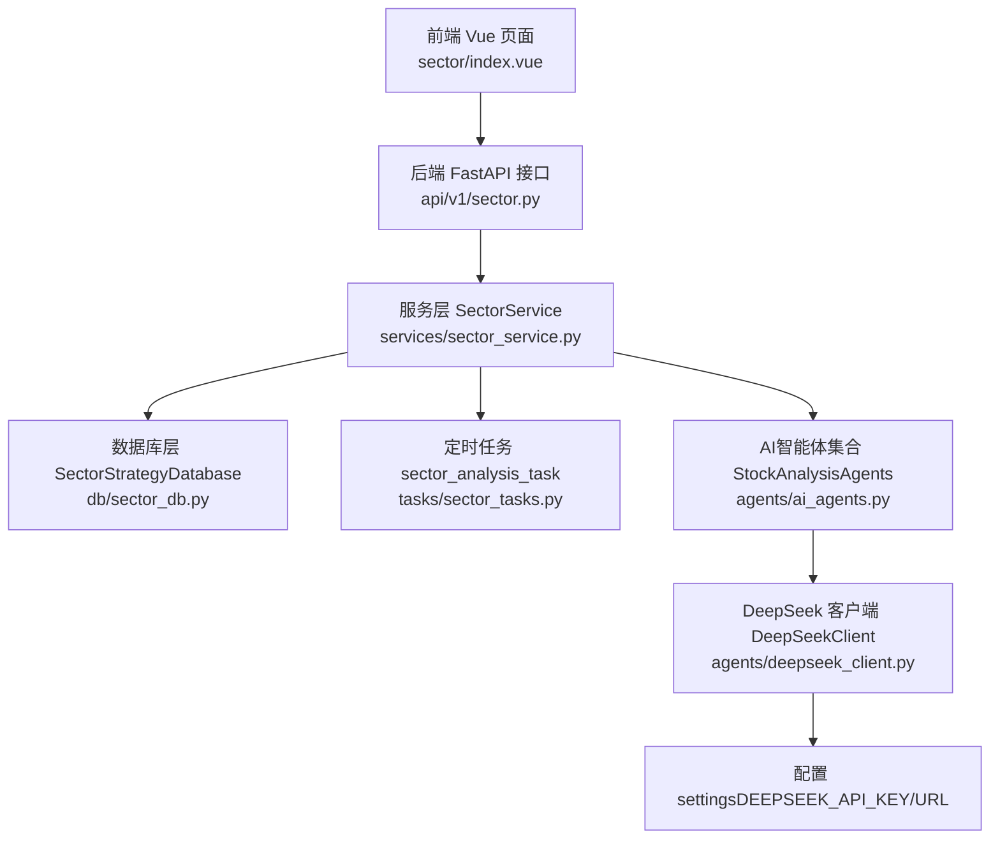
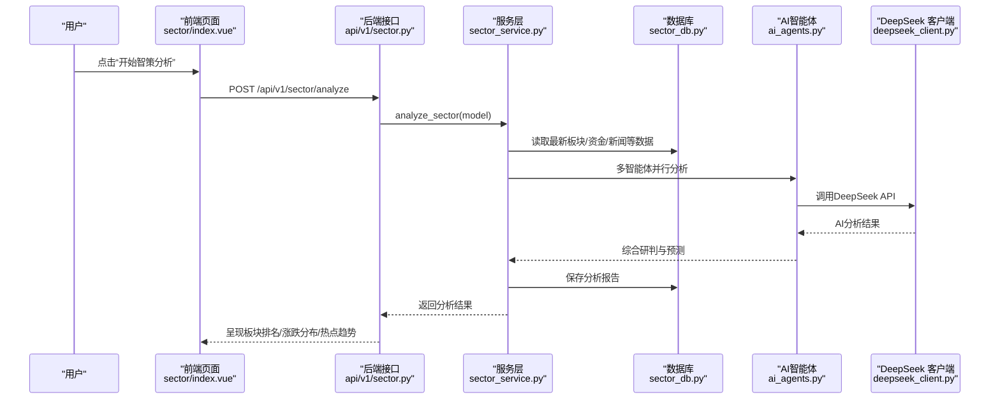
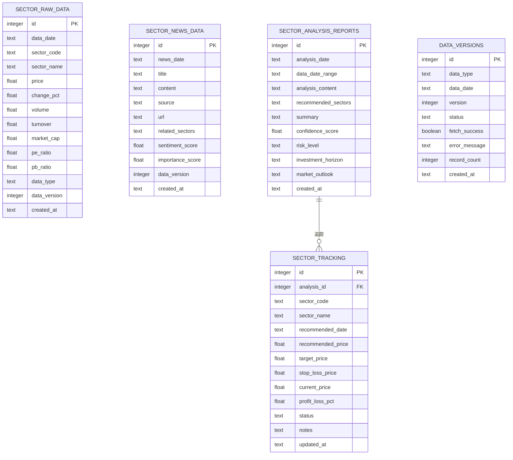
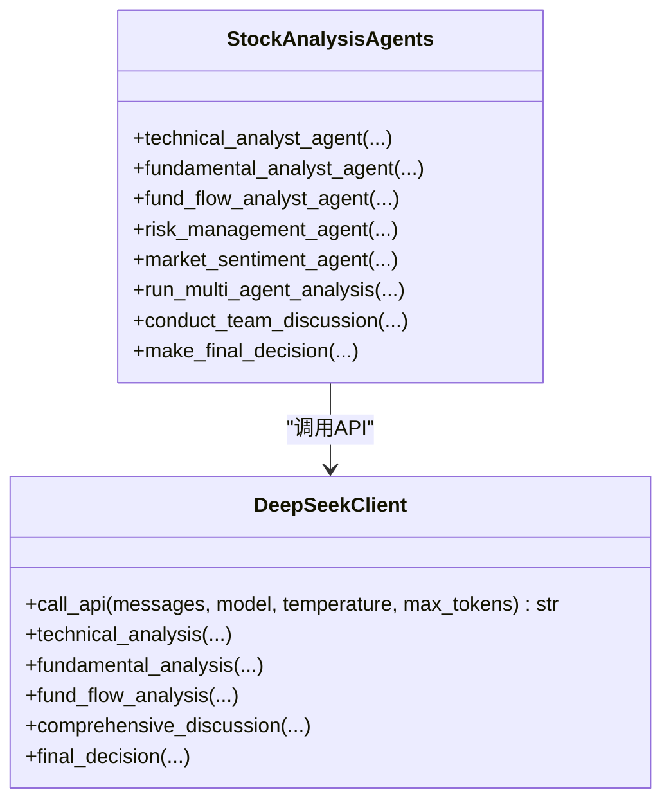
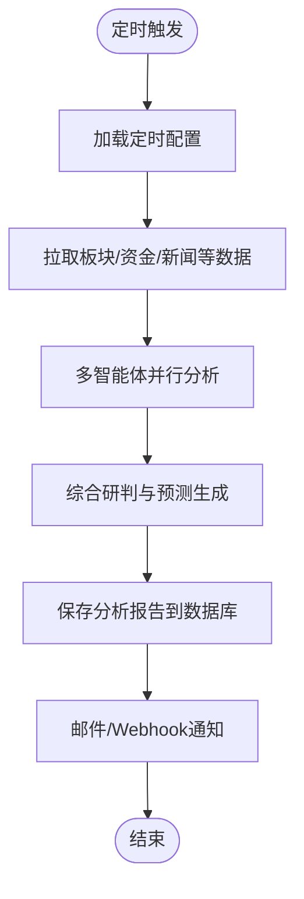
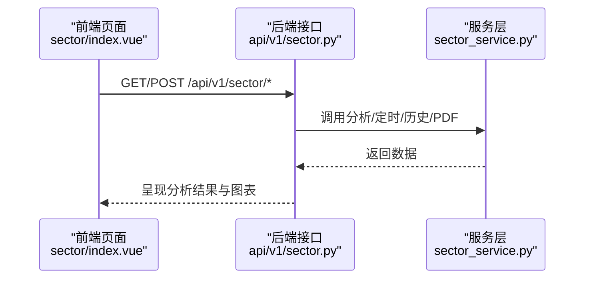
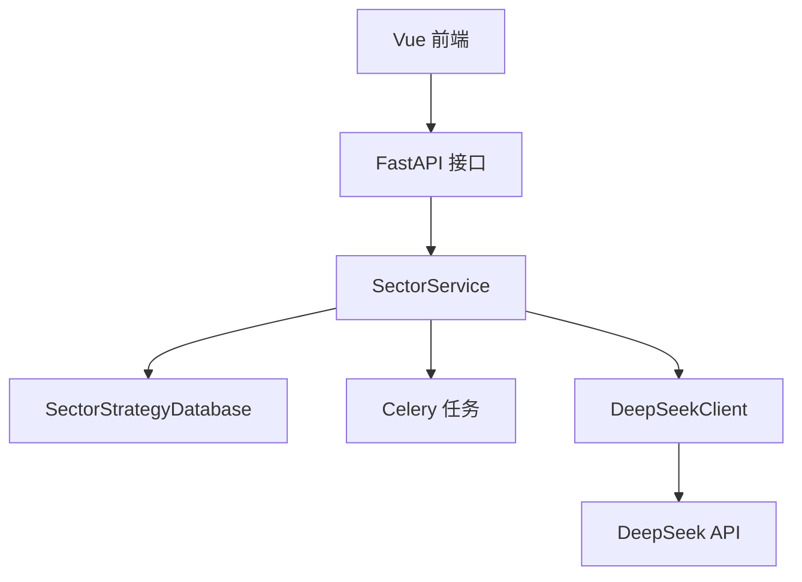

# 智策板块分析

<cite>
**本文引用的文件**
- [backend/app/agents/sector_agents.py](file://backend/app/agents/sector_agents.py)
- [backend/app/tasks/sector_tasks.py](file://backend/app/tasks/sector_tasks.py)
- [backend/app/services/sector_service.py](file://backend/app/services/sector_service.py)
- [backend/app/db/sector_db.py](file://backend/app/db/sector_db.py)
- [backend/app/api/v1/sector.py](file://backend/app/api/v1/sector.py)
- [backend/app/agents/ai_agents.py](file://backend/app/agents/ai_agents.py)
- [backend/app/agents/deepseek_client.py](file://backend/app/agents/deepseek_client.py)
- [frontend/src/views/sector/index.vue](file://frontend/src/views/sector/index.vue)
- [frontend/src/api/sector.js](file://frontend/src/api/sector.js)
- [docs/智策板块使用指南.md](file://docs/智策板块使用指南.md)
- [docs/智策定时分析使用指南.md](file://docs/智策定时分析使用指南.md)
- [backend/app/models/sector.py](file://backend/app/models/sector.py)
</cite>

## 目录
1. [简介](#简介)
2. [项目结构](#项目结构)
3. [核心组件](#核心组件)
4. [架构总览](#架构总览)
5. [详细组件分析](#详细组件分析)
6. [依赖分析](#依赖分析)
7. [性能考虑](#性能考虑)
8. [故障排查指南](#故障排查指南)
9. [结论](#结论)
10. [附录](#附录)

## 简介
本文件面向开发者与使用者，系统性阐述“智策板块分析”功能的设计与实现。内容涵盖：
- 如何对行业板块进行智能筛选与趋势预测（含资金流向、市场情绪等数据维度）
- 分析算法与AI模型介入点
- 定时分析任务（sector_tasks.py）的调度机制与执行流程
- 前端界面如何展示板块排名、涨跌分布、热点趋势图等内容
- 手动触发分析与定时自动分析两种模式及其配置方式
- 结合实际代码片段展示API调用与服务间协作关系，帮助扩展与维护

## 项目结构
智策板块分析功能横跨后端FastAPI服务、Celery定时任务、SQLite数据库、AI智能体与前端Vue页面，采用前后端分离架构，核心模块如下：
- 后端API层：提供分析、定时任务、历史报告、PDF导出等接口
- 服务层：封装业务逻辑，协调数据获取与AI分析
- 数据层：SQLite数据库，持久化板块原始数据、新闻、分析报告与追踪
- AI智能体：多智能体协同（宏观、板块诊断、资金流向、市场情绪），通过DeepSeek API生成分析
- 前端：板块分析页面，支持手动分析、定时任务配置、历史报告查看与导出

图表来源
- [backend/app/api/v1/sector.py](file://backend/app/api/v1/sector.py#L1-L107)
- [backend/app/services/sector_service.py](file://backend/app/services/sector_service.py#L1-L48)
- [backend/app/db/sector_db.py](file://backend/app/db/sector_db.py#L1-L120)
- [backend/app/tasks/sector_tasks.py](file://backend/app/tasks/sector_tasks.py#L1-L13)
- [backend/app/agents/ai_agents.py](file://backend/app/agents/ai_agents.py#L1-L120)
- [backend/app/agents/deepseek_client.py](file://backend/app/agents/deepseek_client.py#L1-L60)

章节来源
- [backend/app/api/v1/sector.py](file://backend/app/api/v1/sector.py#L1-L107)
- [backend/app/services/sector_service.py](file://backend/app/services/sector_service.py#L1-L48)
- [backend/app/db/sector_db.py](file://backend/app/db/sector_db.py#L1-L120)
- [backend/app/tasks/sector_tasks.py](file://backend/app/tasks/sector_tasks.py#L1-L13)
- [backend/app/agents/ai_agents.py](file://backend/app/agents/ai_agents.py#L1-L120)
- [backend/app/agents/deepseek_client.py](file://backend/app/agents/deepseek_client.py#L1-L60)

## 核心组件
- API路由与控制器：提供分析、定时任务、历史报告、PDF导出等接口
- 服务层：封装分析入口、定时任务管理、历史报告与PDF生成
- 数据层：统一的板块策略数据库，支持原始数据、新闻、报告、追踪等表
- AI智能体：宏观策略师、板块诊断师、资金流向分析师、市场情绪解码员
- 前端页面：板块分析、定时任务、历史报告、团队介绍等标签页

章节来源
- [backend/app/api/v1/sector.py](file://backend/app/api/v1/sector.py#L1-L107)
- [backend/app/services/sector_service.py](file://backend/app/services/sector_service.py#L1-L48)
- [backend/app/db/sector_db.py](file://backend/app/db/sector_db.py#L1-L120)
- [backend/app/agents/ai_agents.py](file://backend/app/agents/ai_agents.py#L1-L120)
- [frontend/src/views/sector/index.vue](file://frontend/src/views/sector/index.vue#L1-L120)

## 架构总览
系统采用“数据采集—AI智能体分析—综合研判—预测输出”的流水线式架构，前端通过REST API与后端交互，后端通过Celery定时任务实现自动分析与通知。

图表来源
- [backend/app/api/v1/sector.py](file://backend/app/api/v1/sector.py#L14-L26)
- [backend/app/services/sector_service.py](file://backend/app/services/sector_service.py#L13-L16)
- [backend/app/db/sector_db.py](file://backend/app/db/sector_db.py#L248-L313)
- [backend/app/agents/ai_agents.py](file://backend/app/agents/ai_agents.py#L407-L469)
- [backend/app/agents/deepseek_client.py](file://backend/app/agents/deepseek_client.py#L1-L60)

## 详细组件分析

### 数据来源与分析维度
- 数据来源：AKShare（行业/概念板块行情、资金流向、北向资金、市场统计数据、财经新闻）
- 分析维度：宏观、板块诊断、资金流向、市场情绪
- 输出：板块多空预测、轮动预测、热度排行、综合研判与报告

章节来源
- [docs/智策板块使用指南.md](file://docs/智策板块使用指南.md#L92-L123)
- [docs/智策板块使用指南.md](file://docs/智策板块使用指南.md#L226-L232)

### 数据模型与数据库设计
- 板块原始数据表：sector_raw_data（含行业/概念/资金/市场概览/北向等多类型）
- 新闻数据表：sector_news_data（标题、内容、来源、情感分、重要性等）
- 分析报告表：sector_analysis_reports（分析内容、推荐板块、置信度、风险等级、市场展望等）
- 板块追踪表：sector_tracking（推荐后的后续表现跟踪）
- 数据版本管理：data_versions（按日期/类型/版本记录抓取状态与记录数）

图表来源
- [backend/app/db/sector_db.py](file://backend/app/db/sector_db.py#L82-L122)
- [backend/app/db/sector_db.py](file://backend/app/db/sector_db.py#L149-L205)
- [backend/app/db/sector_db.py](file://backend/app/db/sector_db.py#L314-L364)
- [backend/app/db/sector_db.py](file://backend/app/db/sector_db.py#L388-L424)
- [backend/app/db/sector_db.py](file://backend/app/db/sector_db.py#L462-L486)

章节来源
- [backend/app/db/sector_db.py](file://backend/app/db/sector_db.py#L1-L120)
- [backend/app/db/sector_db.py](file://backend/app/db/sector_db.py#L149-L205)
- [backend/app/db/sector_db.py](file://backend/app/db/sector_db.py#L314-L364)
- [backend/app/db/sector_db.py](file://backend/app/db/sector_db.py#L388-L424)
- [backend/app/db/sector_db.py](file://backend/app/db/sector_db.py#L462-L486)

### AI智能体与模型接入
- 智能体团队：宏观策略师、板块诊断师、资金流向分析师、市场情绪解码员
- 模型接入：DeepSeek OpenAI兼容接口，支持chat/reasoner等模型
- 调用流程：AI智能体构建多轮消息，DeepSeekClient调用API，返回分析文本

图表来源
- [backend/app/agents/ai_agents.py](file://backend/app/agents/ai_agents.py#L1-L120)
- [backend/app/agents/deepseek_client.py](file://backend/app/agents/deepseek_client.py#L1-L60)

章节来源
- [backend/app/agents/ai_agents.py](file://backend/app/agents/ai_agents.py#L1-L120)
- [backend/app/agents/deepseek_client.py](file://backend/app/agents/deepseek_client.py#L1-L60)

### 定时分析任务（sector_tasks.py）
- 当前实现：sector_analysis_task为占位任务，尚未实现具体逻辑
- 调度机制：通过Celery注册任务，后端服务层负责触发与编排
- 执行流程：服务层获取配置、拉取数据、调用AI智能体、生成报告、持久化、通知（邮件/Webhook）

图表来源
- [backend/app/tasks/sector_tasks.py](file://backend/app/tasks/sector_tasks.py#L1-L13)
- [backend/app/services/sector_service.py](file://backend/app/services/sector_service.py#L18-L31)
- [docs/智策定时分析使用指南.md](file://docs/智策定时分析使用指南.md#L1-L120)

章节来源
- [backend/app/tasks/sector_tasks.py](file://backend/app/tasks/sector_tasks.py#L1-L13)
- [backend/app/services/sector_service.py](file://backend/app/services/sector_service.py#L18-L31)
- [docs/智策定时分析使用指南.md](file://docs/智策定时分析使用指南.md#L1-L120)

### 前端界面与展示
- 页面结构：核心预测、智能体报告、综合研判、历史报告、定时任务、团队介绍等标签页
- 数据展示：板块多空、轮动、热度排行、涨跌分布、策略总结等
- 交互能力：手动触发分析、定时任务设置、历史报告加载、PDF导出

图表来源
- [frontend/src/views/sector/index.vue](file://frontend/src/views/sector/index.vue#L1-L120)
- [frontend/src/api/sector.js](file://frontend/src/api/sector.js#L1-L64)
- [backend/app/api/v1/sector.py](file://backend/app/api/v1/sector.py#L14-L107)

章节来源
- [frontend/src/views/sector/index.vue](file://frontend/src/views/sector/index.vue#L1-L120)
- [frontend/src/api/sector.js](file://frontend/src/api/sector.js#L1-L64)
- [backend/app/api/v1/sector.py](file://backend/app/api/v1/sector.py#L14-L107)

## 依赖分析
- 后端依赖：FastAPI、SQLAlchemy、Celery、OpenAI兼容客户端、SQLite
- 前端依赖：Element UI、Axios、Day.js、Markdown/PDF导出工具
- 外部数据源：AKShare（行业/概念/资金/新闻/市场概览）
- 外部模型：DeepSeek API（chat/reasoner）

图表来源
- [backend/app/api/v1/sector.py](file://backend/app/api/v1/sector.py#L1-L107)
- [backend/app/services/sector_service.py](file://backend/app/services/sector_service.py#L1-L48)
- [backend/app/db/sector_db.py](file://backend/app/db/sector_db.py#L1-L120)
- [backend/app/agents/deepseek_client.py](file://backend/app/agents/deepseek_client.py#L1-L60)
- [frontend/src/views/sector/index.vue](file://frontend/src/views/sector/index.vue#L1-L120)

章节来源
- [backend/app/api/v1/sector.py](file://backend/app/api/v1/sector.py#L1-L107)
- [backend/app/services/sector_service.py](file://backend/app/services/sector_service.py#L1-L48)
- [backend/app/db/sector_db.py](file://backend/app/db/sector_db.py#L1-L120)
- [backend/app/agents/deepseek_client.py](file://backend/app/agents/deepseek_client.py#L1-L60)
- [frontend/src/views/sector/index.vue](file://frontend/src/views/sector/index.vue#L1-L120)

## 性能考虑
- 数据抓取与缓存：数据库层提供“最近N小时”缓存读取接口，减少重复抓取
- 并行智能体：多智能体并行分析，缩短总分析时间
- 任务异步化：定时分析通过Celery异步执行，避免阻塞主服务
- 报告持久化：分析完成后统一入库，便于历史回溯与PDF导出

章节来源
- [backend/app/db/sector_db.py](file://backend/app/db/sector_db.py#L768-L841)
- [backend/app/agents/ai_agents.py](file://backend/app/agents/ai_agents.py#L407-L469)
- [backend/app/tasks/sector_tasks.py](file://backend/app/tasks/sector_tasks.py#L1-L13)

## 故障排查指南
- 邮件配置：确认.env中EMAIL_ENABLED、SMTP_SERVER、SMTP_PORT、EMAIL_FROM、EMAIL_PASSWORD、EMAIL_TO等配置齐全
- DeepSeek API：确认DEEPSEEK_API_KEY与DEEPSEEK_BASE_URL配置正确
- 数据源：AKShare数据源可用性与网络连通性
- 定时任务：Celery worker是否运行、任务是否注册、日志是否输出
- 前端接口：检查/api/v1/sector/*接口返回状态与错误信息

章节来源
- [docs/智策定时分析使用指南.md](file://docs/智策定时分析使用指南.md#L1-L120)
- [backend/app/agents/deepseek_client.py](file://backend/app/agents/deepseek_client.py#L1-L60)
- [backend/app/api/v1/sector.py](file://backend/app/api/v1/sector.py#L14-L107)

## 结论
智策板块分析通过“多智能体+AI模型+数据库+定时任务+前端可视化”的完整闭环，实现了对行业板块的智能筛选与趋势预测。当前后端接口与数据库结构已具备，AI智能体与定时任务逻辑正在完善中。前端提供了直观的分析展示与配置入口，支持手动与定时两种模式。后续可进一步完善定时任务的具体执行逻辑、通知渠道扩展与报告追踪表的使用。

## 附录

### 手动触发分析与定时自动分析配置
- 手动触发：前端点击“开始智策分析”，后端接口POST /api/v1/sector/analyze，服务层协调数据与AI分析，返回结果
- 定时自动：前端配置定时任务（启用/停止/立即运行/测试邮件），后端服务层保存配置并通过Celery执行分析与通知

章节来源
- [frontend/src/views/sector/index.vue](file://frontend/src/views/sector/index.vue#L1-L120)
- [frontend/src/api/sector.js](file://frontend/src/api/sector.js#L1-L64)
- [backend/app/api/v1/sector.py](file://backend/app/api/v1/sector.py#L14-L107)
- [docs/智策定时分析使用指南.md](file://docs/智策定时分析使用指南.md#L1-L120)

### 数据流与服务协作
- 数据采集：从AKShare获取板块行情、资金流向、新闻、市场概览
- 特征工程：清洗与标准化，按类型组织为分析所需结构
- 多智能体分析：宏观、板块诊断、资金流向、市场情绪并行分析
- 综合研判：整合多维分析，生成预测与报告
- 持久化：保存分析报告、推荐板块、追踪表现

章节来源
- [docs/智策板块使用指南.md](file://docs/智策板块使用指南.md#L226-L232)
- [backend/app/db/sector_db.py](file://backend/app/db/sector_db.py#L149-L205)
- [backend/app/db/sector_db.py](file://backend/app/db/sector_db.py#L314-L364)