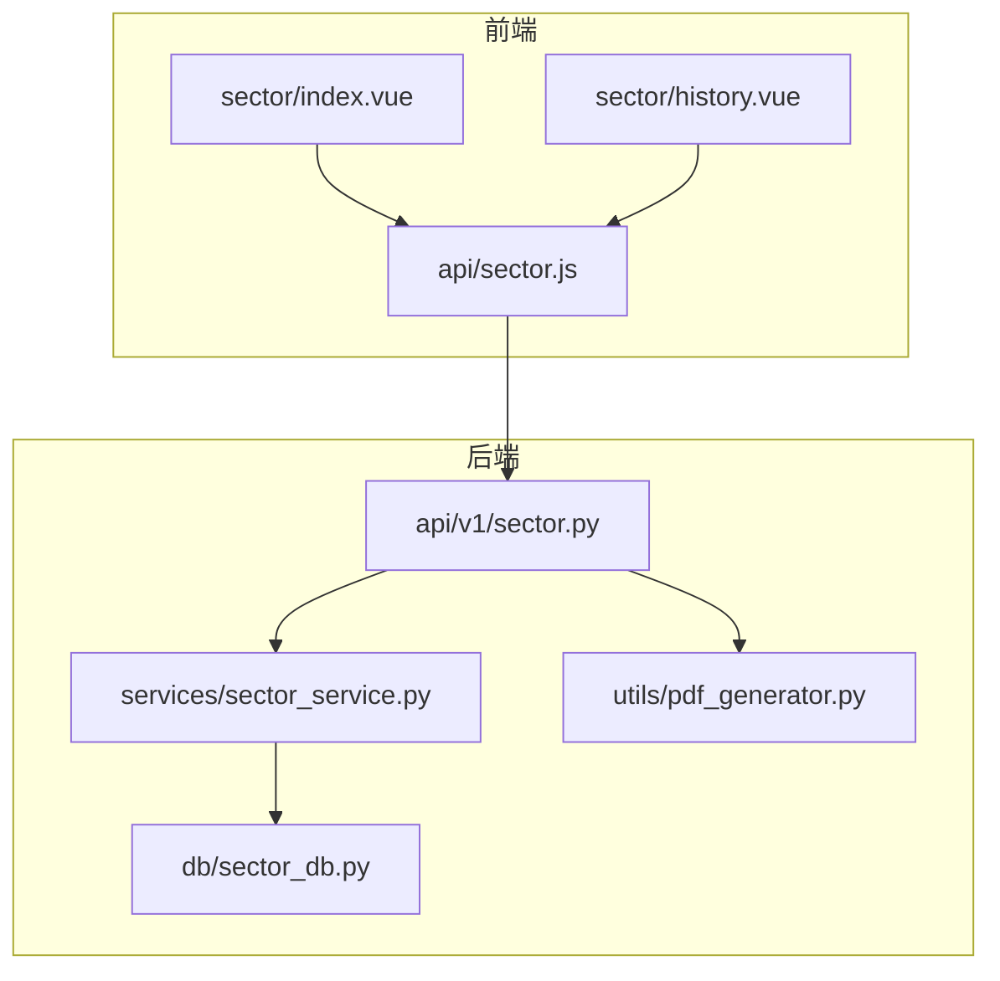
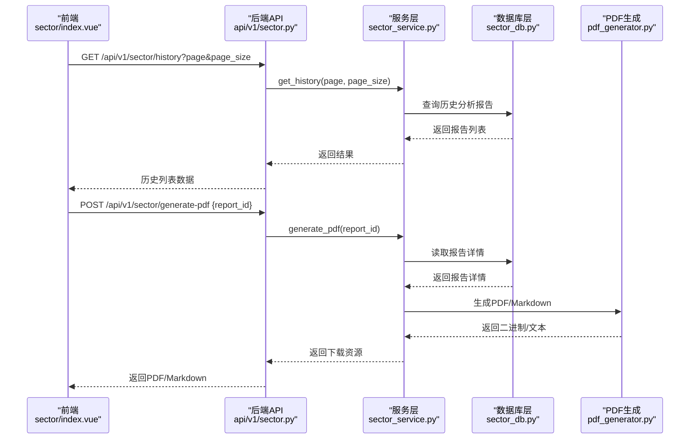
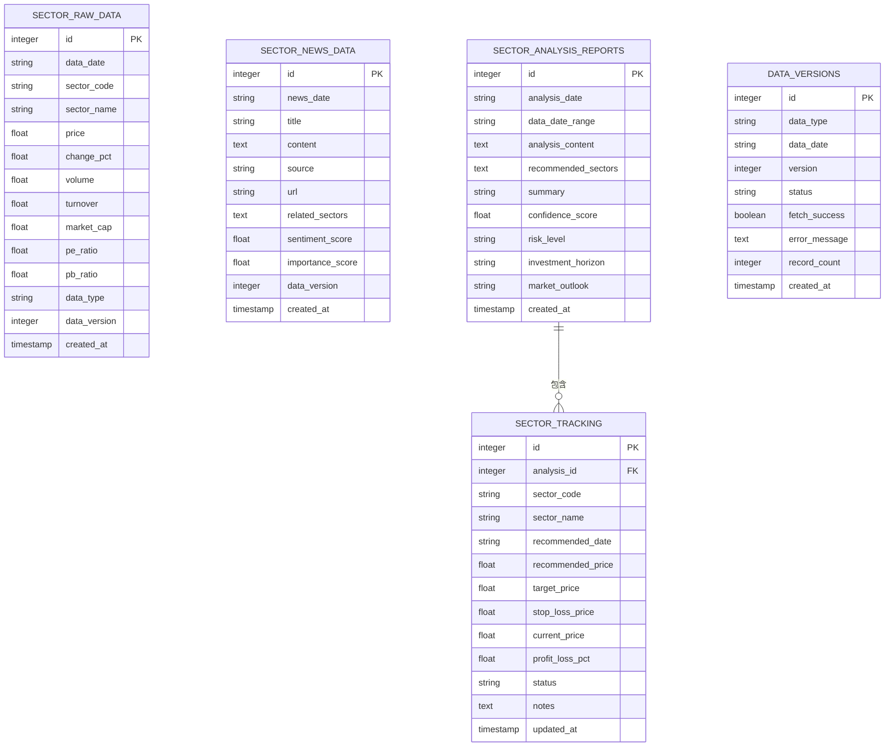
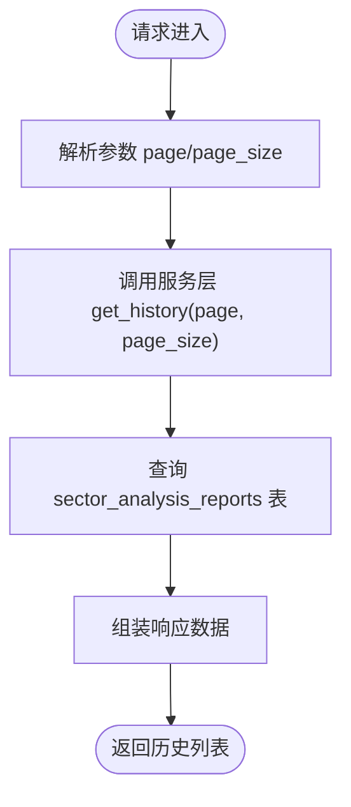
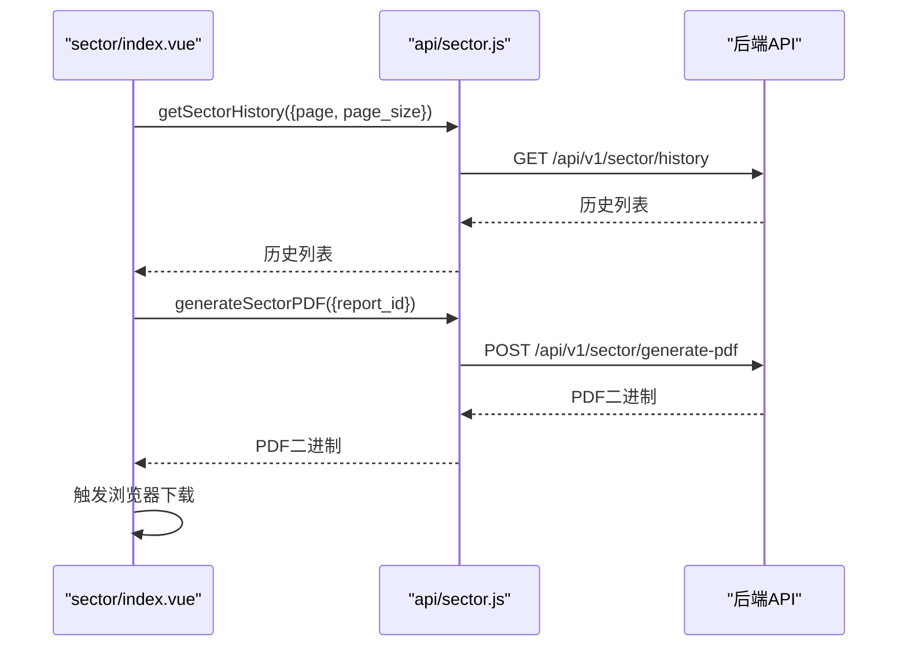
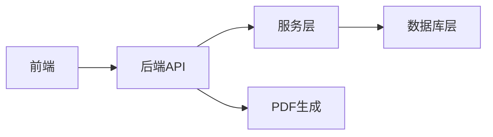

# 板块分析历史记录

<cite>
**本文引用的文件**
- [backend/app/db/sector_db.py](file://backend/app/db/sector_db.py)
- [backend/app/api/v1/sector.py](file://backend/app/api/v1/sector.py)
- [backend/app/services/sector_service.py](file://backend/app/services/sector_service.py)
- [frontend/src/views/sector/index.vue](file://frontend/src/views/sector/index.vue)
- [frontend/src/views/sector/history.vue](file://frontend/src/views/sector/history.vue)
- [frontend/src/api/sector.js](file://frontend/src/api/sector.js)
- [backend/app/utils/pdf_generator.py](file://backend/app/utils/pdf_generator.py)
</cite>

## 目录
1. [简介](#简介)
2. [项目结构](#项目结构)
3. [核心组件](#核心组件)
4. [架构总览](#架构总览)
5. [详细组件分析](#详细组件分析)
6. [依赖分析](#依赖分析)
7. [性能考虑](#性能考虑)
8. [故障排查指南](#故障排查指南)
9. [结论](#结论)
10. [附录](#附录)

## 简介
本文件面向“板块分析历史记录”功能，系统性梳理其技术实现，覆盖以下方面：
- 分析结果如何通过数据库持久化存储（sector_db.py）与数据模型设计（关键字段：分析时间、板块评分、资金数据快照等）。
- API 层提供的历史查询接口（分页、筛选、导出）实现细节。
- 前端 history.vue 组件如何展示历史分析报告列表，并支持结果对比与趋势回溯。
- 数据库索引优化建议、数据保留策略与归档机制。
- 结合实际使用场景演示如何通过历史记录评估策略有效性。

## 项目结构
围绕板块分析历史记录的关键目录与文件如下：
- 后端数据库与服务层：backend/app/db/sector_db.py、backend/app/api/v1/sector.py、backend/app/services/sector_service.py、backend/app/utils/pdf_generator.py
- 前端页面与接口：frontend/src/views/sector/index.vue、frontend/src/views/sector/history.vue、frontend/src/api/sector.js

图表来源
- [backend/app/api/v1/sector.py](file://backend/app/api/v1/sector.py#L1-L107)
- [backend/app/services/sector_service.py](file://backend/app/services/sector_service.py#L1-L48)
- [backend/app/db/sector_db.py](file://backend/app/db/sector_db.py#L1-L148)
- [backend/app/utils/pdf_generator.py](file://backend/app/utils/pdf_generator.py#L1-L120)
- [frontend/src/views/sector/index.vue](file://frontend/src/views/sector/index.vue#L342-L371)
- [frontend/src/views/sector/history.vue](file://frontend/src/views/sector/history.vue#L1-L14)
- [frontend/src/api/sector.js](file://frontend/src/api/sector.js#L1-L63)

章节来源
- [backend/app/api/v1/sector.py](file://backend/app/api/v1/sector.py#L1-L107)
- [backend/app/services/sector_service.py](file://backend/app/services/sector_service.py#L1-L48)
- [backend/app/db/sector_db.py](file://backend/app/db/sector_db.py#L1-L148)
- [frontend/src/views/sector/index.vue](file://frontend/src/views/sector/index.vue#L342-L371)
- [frontend/src/views/sector/history.vue](file://frontend/src/views/sector/history.vue#L1-L14)
- [frontend/src/api/sector.js](file://frontend/src/api/sector.js#L1-L63)

## 核心组件
- 数据库层（sector_db.py）
  - 负责板块原始数据、新闻数据、分析报告、追踪记录与数据版本管理的建模与持久化。
  - 关键表：sector_raw_data、sector_news_data、sector_analysis_reports、sector_tracking、data_versions。
  - 关键能力：保存分析报告、获取历史报告、版本控制、清理旧数据。
- API 层（api/v1/sector.py）
  - 提供历史查询接口（分页）、PDF 导出接口。
- 服务层（services/sector_service.py）
  - 当前为占位实现，历史查询与PDF导出逻辑待完善。
- 前端（views/sector/index.vue、views/sector/history.vue、api/sector.js）
  - 历史列表展示、关键词筛选、PDF 导出交互。
- PDF 生成工具（utils/pdf_generator.py）
  - 提供 PDF/Markdown 报告生成能力（通用模板，可适配板块分析报告）。

章节来源
- [backend/app/db/sector_db.py](file://backend/app/db/sector_db.py#L92-L148)
- [backend/app/api/v1/sector.py](file://backend/app/api/v1/sector.py#L79-L106)
- [backend/app/services/sector_service.py](file://backend/app/services/sector_service.py#L33-L47)
- [frontend/src/views/sector/index.vue](file://frontend/src/views/sector/index.vue#L342-L371)
- [frontend/src/views/sector/history.vue](file://frontend/src/views/sector/history.vue#L1-L14)
- [frontend/src/api/sector.js](file://frontend/src/api/sector.js#L45-L63)
- [backend/app/utils/pdf_generator.py](file://backend/app/utils/pdf_generator.py#L1-L120)

## 架构总览
板块分析历史记录的端到端流程如下：
- 前端通过 api/sector.js 调用后端接口，请求历史列表与PDF导出。
- 后端 api/v1/sector.py 接收请求，委派给服务层 sector_service.py。
- 服务层访问数据库层 sector_db.py，执行查询与持久化。
- PDF 生成由 utils/pdf_generator.py 提供。

图表来源
- [backend/app/api/v1/sector.py](file://backend/app/api/v1/sector.py#L79-L106)
- [backend/app/services/sector_service.py](file://backend/app/services/sector_service.py#L33-L47)
- [backend/app/db/sector_db.py](file://backend/app/db/sector_db.py#L365-L424)
- [backend/app/utils/pdf_generator.py](file://backend/app/utils/pdf_generator.py#L1-L120)
- [frontend/src/views/sector/index.vue](file://frontend/src/views/sector/index.vue#L826-L841)
- [frontend/src/api/sector.js](file://frontend/src/api/sector.js#L45-L63)

## 详细组件分析

### 数据库层：sector_db.py 的数据模型与持久化
- 表结构概览
  - sector_raw_data：板块原始数据（含价格、涨跌幅、成交量、成交额、市值、市盈率、市净率、数据类型、版本等）。
  - sector_news_data：新闻数据（含标题、内容、来源、链接、相关板块、情感分、重要性分、版本等）。
  - sector_analysis_reports：分析报告（含分析日期、数据日期范围、分析内容、推荐板块、摘要、置信度、风险等级、投资周期、市场展望、创建时间等）。
  - sector_tracking：对推荐板块的后续跟踪（含推荐日期、推荐价、目标价、止损价、当前价、收益百分比、状态、备注、更新时间等）。
  - data_versions：数据版本管理（含数据类型、日期、版本、状态、抓取是否成功、错误信息、记录数、创建时间等）。
- 关键索引
  - 对 sector_raw_data 的 data_date、sector_code、data_type、data_version 建立索引，便于按日期/板块/类型/版本检索。
- 关键能力
  - 保存分析报告：将分析内容、置信度、风险等级、投资周期、市场展望等持久化。
  - 获取历史报告：按创建时间倒序返回报告列表。
  - 获取报告详情：解析 JSON 字段，返回结构化报告。
  - 删除报告：级联删除追踪记录与报告。
  - 数据清理：按保留天数清理旧数据并同步清理版本记录。

图表来源
- [backend/app/db/sector_db.py](file://backend/app/db/sector_db.py#L40-L148)

章节来源
- [backend/app/db/sector_db.py](file://backend/app/db/sector_db.py#L40-L148)
- [backend/app/db/sector_db.py](file://backend/app/db/sector_db.py#L314-L364)
- [backend/app/db/sector_db.py](file://backend/app/db/sector_db.py#L365-L424)
- [backend/app/db/sector_db.py](file://backend/app/db/sector_db.py#L425-L461)
- [backend/app/db/sector_db.py](file://backend/app/db/sector_db.py#L650-L696)

### API 层：历史查询与导出接口
- 历史查询接口
  - 路径：GET /api/v1/sector/history
  - 参数：page、page_size
  - 返回：历史报告列表（按创建时间倒序）
- PDF 导出接口
  - 路径：POST /api/v1/sector/generate-pdf
  - 参数：report_id
  - 返回：PDF 文件（二进制）

图表来源
- [backend/app/api/v1/sector.py](file://backend/app/api/v1/sector.py#L79-L92)
- [backend/app/services/sector_service.py](file://backend/app/services/sector_service.py#L33-L41)
- [backend/app/db/sector_db.py](file://backend/app/db/sector_db.py#L365-L386)

章节来源
- [backend/app/api/v1/sector.py](file://backend/app/api/v1/sector.py#L79-L106)
- [frontend/src/api/sector.js](file://frontend/src/api/sector.js#L45-L63)

### 服务层：历史查询与PDF导出（待完善）
- 当前现状
  - sector_service.py 中的历史查询与PDF导出方法为占位实现，尚未接入数据库查询与PDF生成逻辑。
- 建议实现要点
  - get_history(page, page_size)：调用数据库层获取报告列表，支持分页与排序。
  - generate_pdf(report_id)：读取报告详情，调用 PDF 工具生成报告，返回二进制流。

章节来源
- [backend/app/services/sector_service.py](file://backend/app/services/sector_service.py#L33-L47)
- [backend/app/db/sector_db.py](file://backend/app/db/sector_db.py#L388-L424)
- [backend/app/utils/pdf_generator.py](file://backend/app/utils/pdf_generator.py#L1-L120)

### 前端：历史列表展示与导出
- 历史列表展示
  - 页面通过接口获取历史报告列表，渲染卡片式时间线，展示报告编号、摘要、数据区间、置信度、市场展望等。
  - 支持关键词筛选（基于摘要、ID 等字段）。
- 导出功能
  - 调用 generate-pdf 接口，下载 PDF 报告；前端负责构造下载链接与提示。

图表来源
- [frontend/src/views/sector/index.vue](file://frontend/src/views/sector/index.vue#L342-L371)
- [frontend/src/views/sector/index.vue](file://frontend/src/views/sector/index.vue#L792-L828)
- [frontend/src/views/sector/index.vue](file://frontend/src/views/sector/index.vue#L826-L841)
- [frontend/src/api/sector.js](file://frontend/src/api/sector.js#L45-L63)
- [backend/app/api/v1/sector.py](file://backend/app/api/v1/sector.py#L94-L106)

章节来源
- [frontend/src/views/sector/index.vue](file://frontend/src/views/sector/index.vue#L342-L371)
- [frontend/src/views/sector/index.vue](file://frontend/src/views/sector/index.vue#L792-L841)
- [frontend/src/api/sector.js](file://frontend/src/api/sector.js#L45-L63)

### 前端历史页面（history.vue）
- 当前状态：页面为占位，功能开发中。
- 建议扩展方向
  - 引入与 index.vue 类似的列表展示与筛选能力。
  - 支持多维度对比（同一板块不同时间点的对比、不同板块对比）。
  - 支持趋势回溯（按时间轴查看评分与指标变化）。

章节来源
- [frontend/src/views/sector/history.vue](file://frontend/src/views/sector/history.vue#L1-L14)

## 依赖分析
- 组件耦合
  - API 层依赖服务层；服务层依赖数据库层；前端依赖 API 层。
  - PDF 生成工具与 API 层解耦，通过服务层调用。
- 可能的循环依赖
  - 当前结构清晰，未见循环依赖迹象。
- 外部依赖
  - 前端通过 axios 请求后端接口；后端使用 FastAPI 与 SQLAlchemy ORM。

图表来源
- [backend/app/api/v1/sector.py](file://backend/app/api/v1/sector.py#L1-L107)
- [backend/app/services/sector_service.py](file://backend/app/services/sector_service.py#L1-L48)
- [backend/app/db/sector_db.py](file://backend/app/db/sector_db.py#L1-L148)
- [backend/app/utils/pdf_generator.py](file://backend/app/utils/pdf_generator.py#L1-L120)

章节来源
- [backend/app/api/v1/sector.py](file://backend/app/api/v1/sector.py#L1-L107)
- [backend/app/services/sector_service.py](file://backend/app/services/sector_service.py#L1-L48)
- [backend/app/db/sector_db.py](file://backend/app/db/sector_db.py#L1-L148)
- [backend/app/utils/pdf_generator.py](file://backend/app/utils/pdf_generator.py#L1-L120)

## 性能考虑
- 数据库索引优化建议
  - 在 sector_raw_data 上建立复合索引：(data_date, data_type, data_version)，以加速按日期/类型/版本的查询。
  - 在 sector_analysis_reports 上建立索引：(created_at) 以支持按时间倒序分页。
  - 在 sector_tracking 上建立索引：(analysis_id, sector_code) 以加速追踪查询。
- 分页与筛选
  - 历史查询应使用 LIMIT/OFFSET 或游标分页，避免一次性加载大量数据。
  - 前端关键词筛选建议在后端进行（模糊匹配）以减少传输量。
- 数据保留策略与归档
  - 建议按数据类型设定保留天数（如30/90/180天），定期清理旧数据并同步清理版本记录。
  - 对于长期保留的报告，可考虑导出为PDF/Markdown并迁移至对象存储或冷存储。

[本节为通用性能建议，无需特定文件引用]

## 故障排查指南
- 历史查询接口异常
  - 检查服务层 get_history 是否已实现并正确调用数据库层。
  - 核对数据库连接与表结构是否一致。
- PDF 导出失败
  - 确认 generate_pdf 已实现并正确读取报告详情。
  - 检查 PDF 生成工具的字体注册与输出路径。
- 前端无法展示历史
  - 确认接口返回字段与前端渲染字段一致（如 summary、confidence_score、data_date_range）。
  - 检查跨域与网络请求状态码。

章节来源
- [backend/app/services/sector_service.py](file://backend/app/services/sector_service.py#L33-L47)
- [backend/app/db/sector_db.py](file://backend/app/db/sector_db.py#L365-L424)
- [backend/app/utils/pdf_generator.py](file://backend/app/utils/pdf_generator.py#L1-L120)
- [frontend/src/views/sector/index.vue](file://frontend/src/views/sector/index.vue#L792-L841)

## 结论
板块分析历史记录功能在当前仓库中已完成 API 层与数据库层的基础设计与接口定义，前端历史页面处于占位状态。数据库层提供了完善的分析报告存储与版本管理能力，API 层具备历史查询与导出接口，服务层与前端仍需补充实现。通过合理的索引设计、分页与筛选策略以及数据保留与归档机制，可有效支撑历史记录的高效查询与长期维护。

[本节为总结性内容，无需特定文件引用]

## 附录

### 数据模型字段设计考量
- 分析时间
  - analysis_date：分析执行时间；created_at：记录创建时间，用于排序与审计。
- 板块评分
  - confidence_score：置信度分数，用于衡量报告质量与可信度。
- 资金数据快照
  - sector_raw_data 中的价格、涨跌幅、成交量、成交额、市值、市盈率、市净率等字段，构成资金与基本面快照。
- 报告元信息
  - data_date_range：数据日期范围；summary：摘要；risk_level、investment_horizon、market_outlook：策略维度信息。

章节来源
- [backend/app/db/sector_db.py](file://backend/app/db/sector_db.py#L92-L148)
- [backend/app/db/sector_db.py](file://backend/app/db/sector_db.py#L314-L364)

### 实际使用场景：通过历史记录评估策略有效性
- 回测与对比
  - 选择多个历史报告，对比其推荐板块、置信度、市场展望与后续跟踪收益，评估策略一致性与稳定性。
- 趋势回溯
  - 以时间轴查看同一板块在不同报告中的评分与指标变化，识别趋势拐点与策略适应性。
- 归档与复盘
  - 将长期有效的报告导出为PDF/Markdown，形成知识库，辅助后续策略迭代与复盘。

[本节为使用建议，无需特定文件引用]