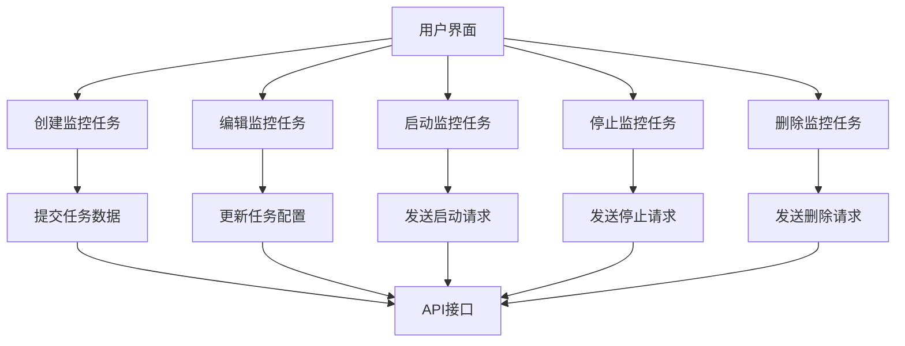
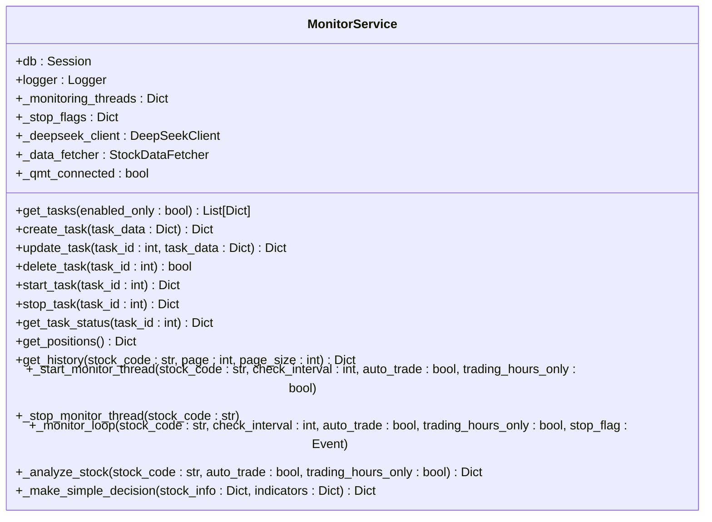
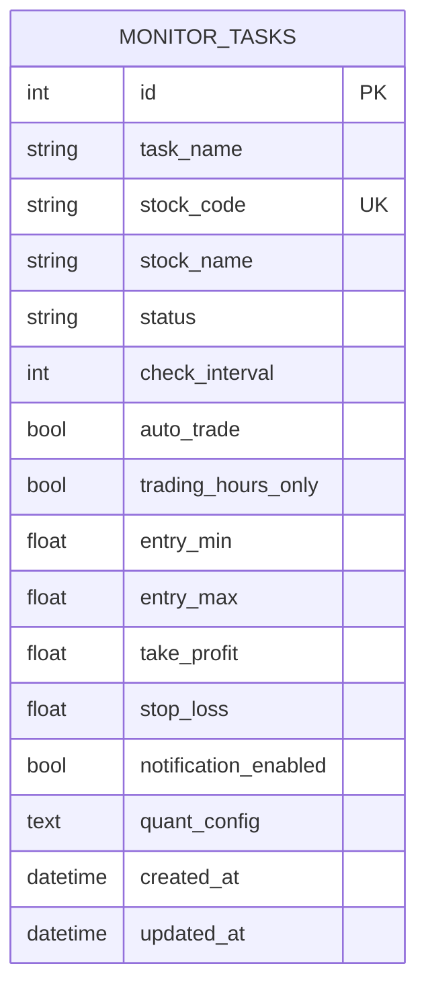
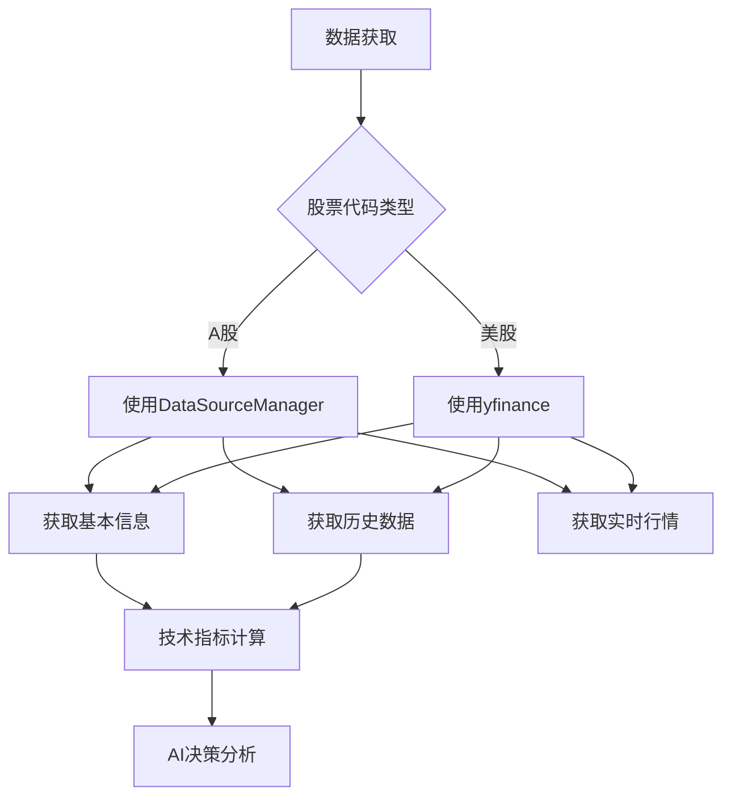
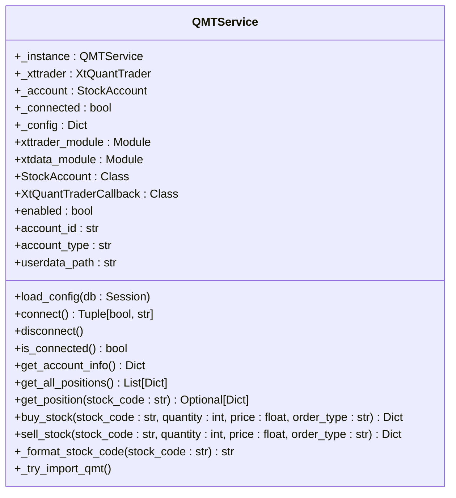
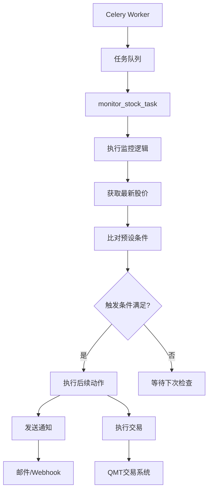
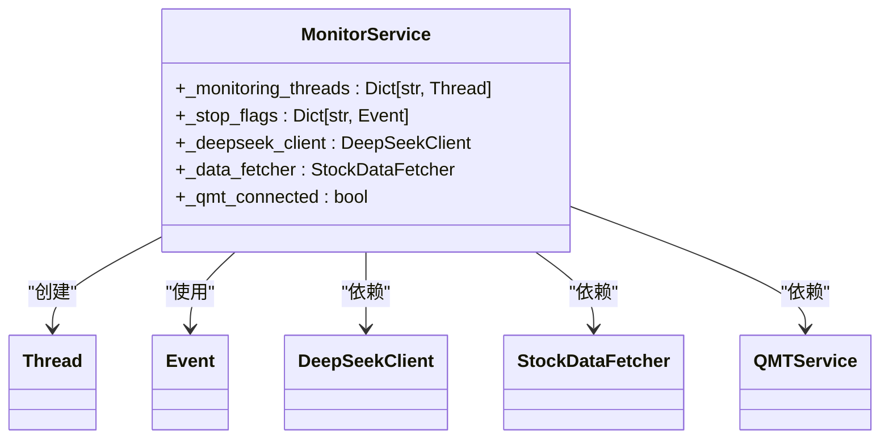
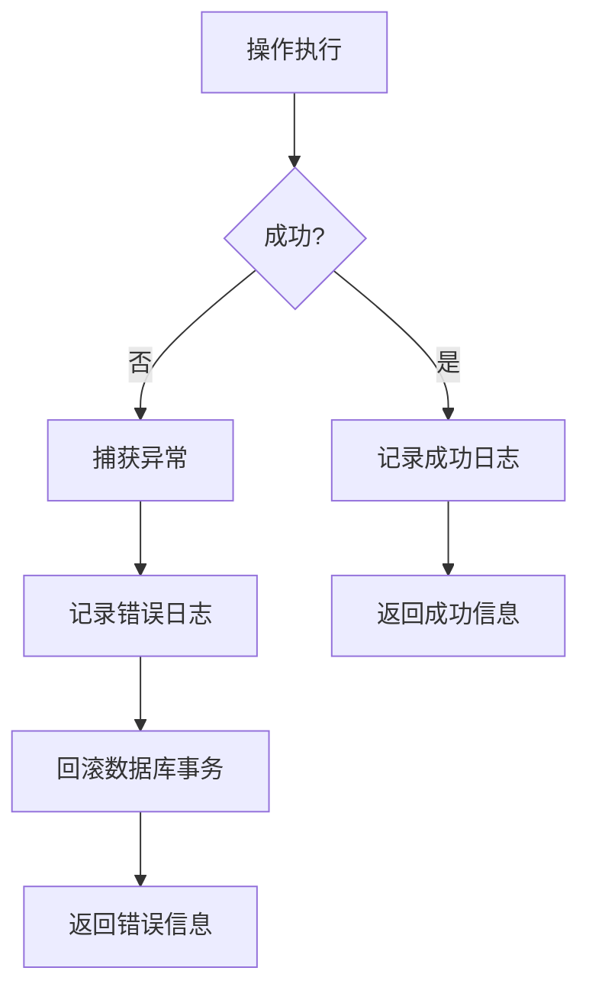

# 实时监测功能

<cite>
**本文档引用的文件**   
- [monitor.py](file://backend/app/api/v1/monitor.py)
- [monitor_service.py](file://backend/app/services/monitor_service.py)
- [monitor_tasks.py](file://backend/app/tasks/monitor_tasks.py)
- [monitor.py](file://backend/app/models/monitor.py)
- [stock_data.py](file://backend/app/data/stock_data.py)
- [deepseek_client.py](file://backend/app/agents/deepseek_client.py)
- [qmt_service.py](file://backend/app/services/qmt_service.py)
- [monitor.js](file://frontend/src/api/monitor.js)
- [MonitorLayout.vue](file://frontend/src/views/monitor/components/MonitorLayout.vue)
- [celery_app.py](file://backend/app/tasks/celery_app.py)
</cite>

## 目录
1. [简介](#简介)
2. [前端监控任务管理](#前端监控任务管理)
3. [后端监控服务逻辑](#后端监控服务逻辑)
4. [监控任务数据模型](#监控任务数据模型)
5. [数据获取与分析](#数据获取与分析)
6. [交易执行与QMT集成](#交易执行与qmt集成)
7. [异步任务处理](#异步任务处理)
8. [系统配置与状态管理](#系统配置与状态管理)
9. [错误处理与日志记录](#错误处理与日志记录)
10. [总结](#总结)

## 简介
实时监测功能是本系统的核心组件之一，允许用户通过前端界面设置监控任务，设定价格阈值和触发条件。后端通过monitor_service.py处理监控逻辑，结合Celery异步任务实现周期性检测。monitor.py API接收创建、更新、删除监控任务的请求，并验证输入参数。系统从数据源获取最新股价并与预设条件比对，触发后续动作。该功能支持监控任务的启用/禁用、执行频率配置和异常重试机制。

## 前端监控任务管理
前端通过Vue.js框架实现监控任务的管理界面，用户可以在"AI 盯盘中心"界面中创建、编辑、启动、停止和删除监控任务。界面提供了直观的表单让用户输入股票代码、名称、监测间隔、进场区间、止盈价位和止损价位等参数。

**Diagram sources**
- [MonitorLayout.vue](file://frontend/src/views/monitor/components/MonitorLayout.vue)
- [monitor.js](file://frontend/src/api/monitor.js)

**Section sources**
- [MonitorLayout.vue](file://frontend/src/views/monitor/components/MonitorLayout.vue)
- [monitor.js](file://frontend/src/api/monitor.js)

## 后端监控服务逻辑
后端监控服务由monitor_service.py文件实现，提供了完整的监控任务管理功能。服务类MonitorService通过数据库会话管理监控任务的生命周期，包括创建、更新、删除、启动和停止操作。

**Diagram sources**
- [monitor_service.py](file://backend/app/services/monitor_service.py)

**Section sources**
- [monitor_service.py](file://backend/app/services/monitor_service.py)

## 监控任务数据模型
监控任务的数据模型定义在monitor.py文件中，使用SQLAlchemy ORM实现。模型包含任务的基本信息、监控配置、交易设置和状态信息。

**Diagram sources**
- [monitor.py](file://backend/app/models/monitor.py)

**Section sources**
- [monitor.py](file://backend/app/models/monitor.py)

## 数据获取与分析
系统通过StockDataFetcher类获取股票数据，支持A股和美股。数据获取器根据股票代码判断市场类型，使用不同的数据源获取信息。对于A股，使用内部的数据源管理器；对于美股，使用yfinance库。

**Diagram sources**
- [stock_data.py](file://backend/app/data/stock_data.py)
- [deepseek_client.py](file://backend/app/agents/deepseek_client.py)

**Section sources**
- [stock_data.py](file://backend/app/data/stock_data.py)
- [deepseek_client.py](file://backend/app/agents/deepseek_client.py)

## 交易执行与QMT集成
系统通过QMTService类与miniQMT交易系统集成，实现自动交易功能。服务类提供了连接管理、账户信息获取、持仓查询和交易执行等功能。

**Diagram sources**
- [qmt_service.py](file://backend/app/services/qmt_service.py)

**Section sources**
- [qmt_service.py](file://backend/app/services/qmt_service.py)

## 异步任务处理
系统使用Celery作为异步任务队列，处理周期性的监控任务。Celery应用配置使用Redis作为消息代理和结果后端。

**Diagram sources**
- [monitor_tasks.py](file://backend/app/tasks/monitor_tasks.py)
- [celery_app.py](file://backend/app/tasks/celery_app.py)

**Section sources**
- [monitor_tasks.py](file://backend/app/tasks/monitor_tasks.py)
- [celery_app.py](file://backend/app/tasks/celery_app.py)

## 系统配置与状态管理
系统通过类级别的静态变量管理监控线程和状态，确保每个股票代码只有一个监控线程在运行。这种设计避免了重复监控和资源浪费。

**Diagram sources**
- [monitor_service.py](file://backend/app/services/monitor_service.py)

**Section sources**
- [monitor_service.py](file://backend/app/services/monitor_service.py)

## 错误处理与日志记录
系统实现了完善的错误处理和日志记录机制，所有关键操作都有异常捕获和日志输出。这有助于问题排查和系统监控。

**Diagram sources**
- [monitor_service.py](file://backend/app/services/monitor_service.py)

**Section sources**
- [monitor_service.py](file://backend/app/services/monitor_service.py)

## 总结
实时监测功能通过前后端协同工作，实现了完整的监控任务管理。前端提供友好的用户界面，后端通过monitor_service.py处理业务逻辑，结合Celery异步任务实现周期性检测。系统从数据源获取最新股价并与预设条件比对，触发后续动作。监控任务的启用/禁用、执行频率配置和异常重试机制都得到了良好支持。通过QMT集成，系统还能实现自动交易功能，为用户提供智能化的投资辅助。