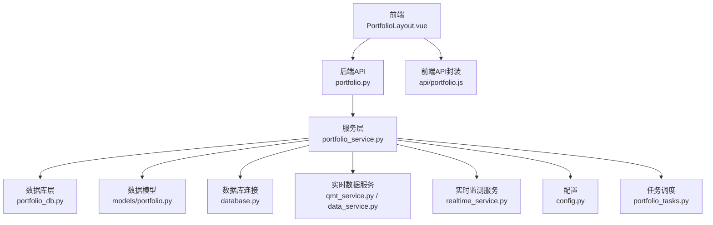
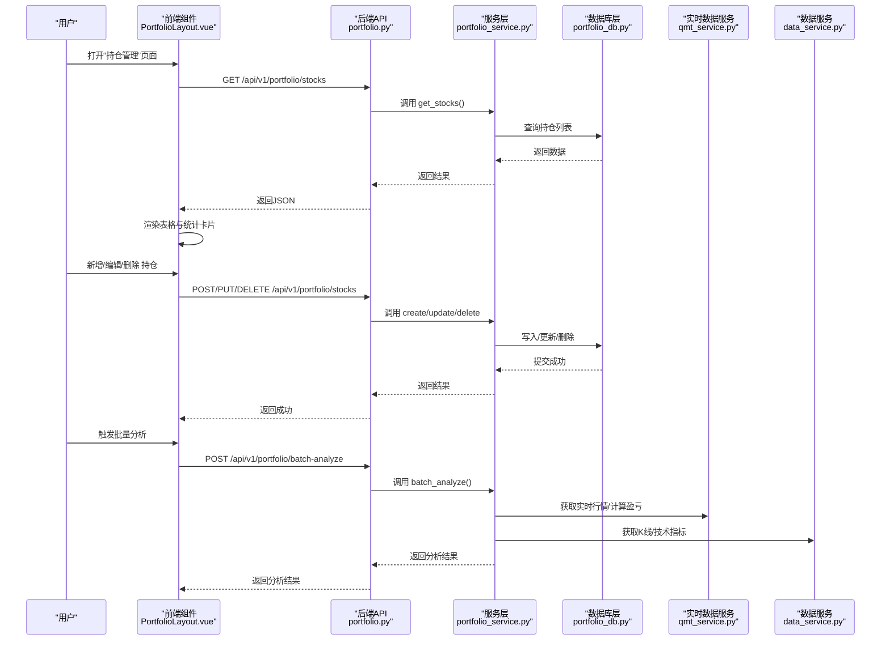
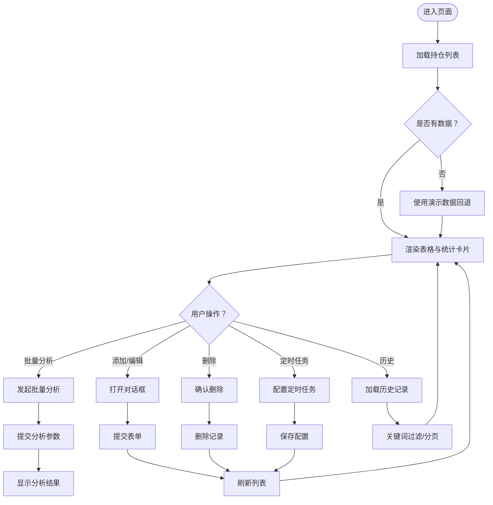
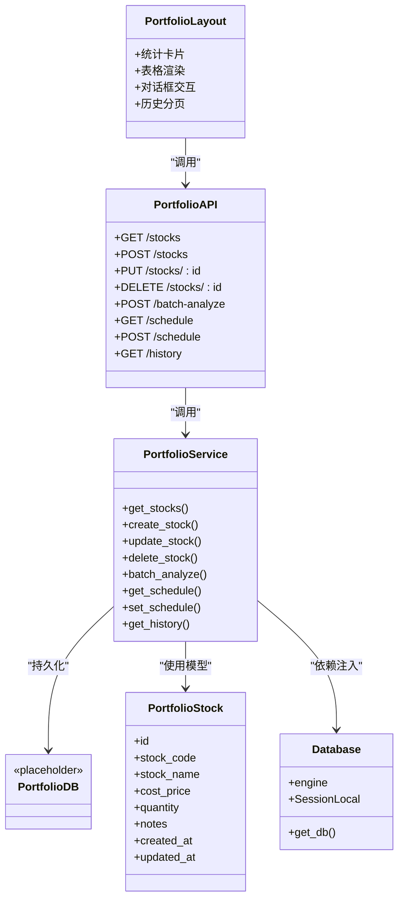
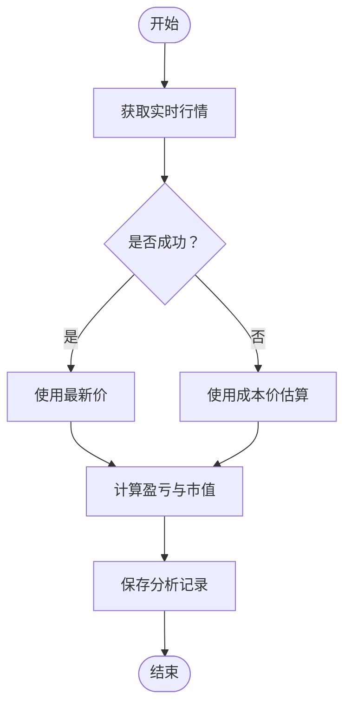
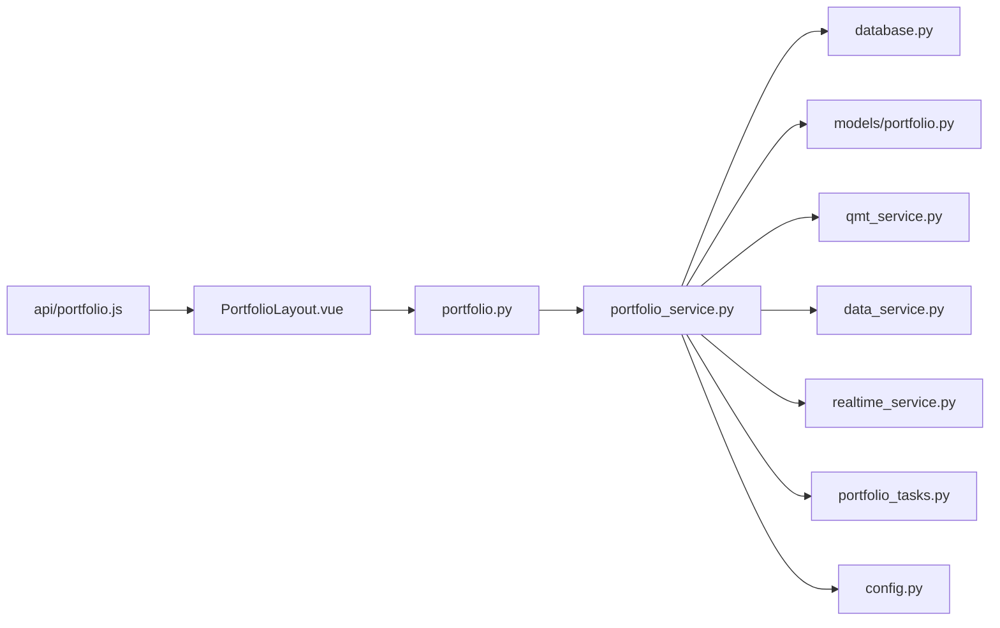

# 持仓管理功能

<cite>
**本文引用的文件**
- [backend/app/api/v1/portfolio.py](file://backend/app/api/v1/portfolio.py)
- [backend/app/services/portfolio_service.py](file://backend/app/services/portfolio_service.py)
- [backend/app/db/portfolio_db.py](file://backend/app/db/portfolio_db.py)
- [backend/app/models/portfolio.py](file://backend/app/models/portfolio.py)
- [backend/app/database.py](file://backend/app/database.py)
- [frontend/src/views/portfolio/index.vue](file://frontend/src/views/portfolio/index.vue)
- [frontend/src/views/portfolio/components/PortfolioLayout.vue](file://frontend/src/views/portfolio/components/PortfolioLayout.vue)
- [frontend/src/api/portfolio.js](file://frontend/src/api/portfolio.js)
- [backend/app/services/qmt_service.py](file://backend/app/services/qmt_service.py)
- [backend/app/services/data_service.py](file://backend/app/services/data_service.py)
- [backend/app/services/realtime_service.py](file://backend/app/services/realtime_service.py)
- [backend/app/config.py](file://backend/app/config.py)
- [backend/app/tasks/portfolio_tasks.py](file://backend/app/tasks/portfolio_tasks.py)
- [docs/前后端拆分规划文档.md](file://docs/前后端拆分规划文档.md)
- [docs/TDX数据源集成完成说明.md](file://docs/TDX数据源集成完成说明.md)
- [old/portfolio_db.py](file://old/portfolio_db.py)
</cite>

## 目录
1. [简介](#简介)
2. [项目结构](#项目结构)
3. [核心组件](#核心组件)
4. [架构总览](#架构总览)
5. [详细组件分析](#详细组件分析)
6. [依赖关系分析](#依赖关系分析)
7. [性能考量](#性能考量)
8. [故障排查指南](#故障排查指南)
9. [结论](#结论)
10. [附录](#附录)

## 简介
本文件系统化阐述“持仓管理功能”，覆盖用户如何添加、编辑、删除持仓记录（股票代码、持仓数量、成本价、备注等字段），说明后端如何通过服务层计算当前盈亏、持仓成本、收益率等关键指标，并通过数据库层进行持久化；同时解释前端如何展示持仓列表、实时市值变化及盈亏趋势图表；并描述与实时行情服务的集成方式，确保价格数据的及时更新。文档还包含多账户支持、分红送股调整、交易记录同步等高级场景的处理思路与最佳实践，以及API调用示例与错误处理建议。

## 项目结构
围绕“持仓管理”的前后端协作，主要涉及以下层次：
- 前端视图与交互：PortfolioLayout.vue负责展示与交互，index.vue作为入口。
- 前端API封装：portfolio.js统一封装HTTP请求。
- 后端API路由：FastAPI路由定义增删改查、批量分析、定时配置、历史查询等接口。
- 服务层：PortfolioService负责业务逻辑（当前为占位实现，后续补充）。
- 数据模型与数据库：SQLAlchemy模型定义表结构，数据库连接由database.py管理。
- 实时数据与行情：qmt_service.py与data_service.py提供实时行情与技术分析能力；realtime_service.py提供监测服务能力。
- 任务调度：Celery任务portfolio_analysis_task用于异步分析。

**图表来源**
- [frontend/src/views/portfolio/components/PortfolioLayout.vue](file://frontend/src/views/portfolio/components/PortfolioLayout.vue#L1-L120)
- [frontend/src/api/portfolio.js](file://frontend/src/api/portfolio.js#L1-L73)
- [backend/app/api/v1/portfolio.py](file://backend/app/api/v1/portfolio.py#L1-L123)
- [backend/app/services/portfolio_service.py](file://backend/app/services/portfolio_service.py#L1-L54)
- [backend/app/db/portfolio_db.py](file://backend/app/db/portfolio_db.py#L1-L6)
- [backend/app/models/portfolio.py](file://backend/app/models/portfolio.py#L1-L22)
- [backend/app/database.py](file://backend/app/database.py#L1-L45)
- [backend/app/services/qmt_service.py](file://backend/app/services/qmt_service.py#L338-L366)
- [backend/app/services/data_service.py](file://backend/app/services/data_service.py#L1-L29)
- [backend/app/services/realtime_service.py](file://backend/app/services/realtime_service.py#L1-L49)
- [backend/app/config.py](file://backend/app/config.py#L1-L92)
- [backend/app/tasks/portfolio_tasks.py](file://backend/app/tasks/portfolio_tasks.py#L1-L13)

**章节来源**
- [frontend/src/views/portfolio/index.vue](file://frontend/src/views/portfolio/index.vue#L1-L14)
- [frontend/src/views/portfolio/components/PortfolioLayout.vue](file://frontend/src/views/portfolio/components/PortfolioLayout.vue#L1-L120)
- [frontend/src/api/portfolio.js](file://frontend/src/api/portfolio.js#L1-L73)
- [backend/app/api/v1/portfolio.py](file://backend/app/api/v1/portfolio.py#L1-L123)
- [backend/app/services/portfolio_service.py](file://backend/app/services/portfolio_service.py#L1-L54)
- [backend/app/db/portfolio_db.py](file://backend/app/db/portfolio_db.py#L1-L6)
- [backend/app/models/portfolio.py](file://backend/app/models/portfolio.py#L1-L22)
- [backend/app/database.py](file://backend/app/database.py#L1-L45)
- [backend/app/services/qmt_service.py](file://backend/app/services/qmt_service.py#L338-L366)
- [backend/app/services/data_service.py](file://backend/app/services/data_service.py#L1-L29)
- [backend/app/services/realtime_service.py](file://backend/app/services/realtime_service.py#L1-L49)
- [backend/app/config.py](file://backend/app/config.py#L1-L92)
- [backend/app/tasks/portfolio_tasks.py](file://backend/app/tasks/portfolio_tasks.py#L1-L13)

## 核心组件
- 前端组件
  - PortfolioLayout.vue：提供“持仓管理”“批量分析”“定时任务”“分析历史”四个标签页，负责数据加载、对话框交互、统计卡片与表格渲染。
  - index.vue：作为入口，直接嵌套PortfolioLayout.vue。
  - api/portfolio.js：封装HTTP请求，统一调用后端API。
- 后端组件
  - API路由：提供获取/新增/更新/删除持仓、批量分析、定时配置、历史查询等接口。
  - 服务层：PortfolioService（当前为占位实现，后续补充）。
  - 数据模型：PortfolioStock（定义表结构与字段）。
  - 数据库层：portfolio_db.py（占位，后续迁移旧逻辑）。
  - 数据库连接：database.py（统一创建引擎、会话与依赖注入）。
  - 实时数据与行情：qmt_service.py（实时行情与盈亏计算）、data_service.py（数据获取）、realtime_service.py（监测服务）。
  - 配置：config.py（数据库URL、数据源开关、MiniQMT等）。
  - 任务调度：portfolio_tasks.py（Celery任务）。

**章节来源**
- [frontend/src/views/portfolio/components/PortfolioLayout.vue](file://frontend/src/views/portfolio/components/PortfolioLayout.vue#L1-L120)
- [frontend/src/views/portfolio/index.vue](file://frontend/src/views/portfolio/index.vue#L1-L14)
- [frontend/src/api/portfolio.js](file://frontend/src/api/portfolio.js#L1-L73)
- [backend/app/api/v1/portfolio.py](file://backend/app/api/v1/portfolio.py#L1-L123)
- [backend/app/services/portfolio_service.py](file://backend/app/services/portfolio_service.py#L1-L54)
- [backend/app/models/portfolio.py](file://backend/app/models/portfolio.py#L1-L22)
- [backend/app/db/portfolio_db.py](file://backend/app/db/portfolio_db.py#L1-L6)
- [backend/app/database.py](file://backend/app/database.py#L1-L45)
- [backend/app/services/qmt_service.py](file://backend/app/services/qmt_service.py#L338-L366)
- [backend/app/services/data_service.py](file://backend/app/services/data_service.py#L1-L29)
- [backend/app/services/realtime_service.py](file://backend/app/services/realtime_service.py#L1-L49)
- [backend/app/config.py](file://backend/app/config.py#L1-L92)
- [backend/app/tasks/portfolio_tasks.py](file://backend/app/tasks/portfolio_tasks.py#L1-L13)

## 架构总览
下图展示了从前端到后端、再到实时数据与数据库的整体流程。

**图表来源**
- [frontend/src/views/portfolio/components/PortfolioLayout.vue](file://frontend/src/views/portfolio/components/PortfolioLayout.vue#L1-L120)
- [frontend/src/api/portfolio.js](file://frontend/src/api/portfolio.js#L1-L73)
- [backend/app/api/v1/portfolio.py](file://backend/app/api/v1/portfolio.py#L1-L123)
- [backend/app/services/portfolio_service.py](file://backend/app/services/portfolio_service.py#L1-L54)
- [backend/app/db/portfolio_db.py](file://backend/app/db/portfolio_db.py#L1-L6)
- [backend/app/services/qmt_service.py](file://backend/app/services/qmt_service.py#L338-L366)
- [backend/app/services/data_service.py](file://backend/app/services/data_service.py#L1-L29)

## 详细组件分析

### 前端：PortfolioLayout.vue
- 页面结构
  - 四个标签页：“持仓管理”“批量分析”“定时任务”“分析历史”。
  - “持仓管理”页包含统计卡片（总股票数、自动同步数、已填持仓、估算成本）、表格（股票代码/名称、成本价、数量、自动监测、创建时间）与操作列（编辑/删除）。
  - 对话框用于添加/编辑持仓，表单字段包括：股票代码、名称、成本价、数量、备注、自动监测。
- 数据加载与回退
  - 首次加载或接口异常时，使用演示数据回退，提示用户接口不可用。
- 交互行为
  - 支持刷新、添加、编辑、删除、分页查看历史等。
- 展示逻辑
  - 统计卡片通过计算stockList得出；表格按字段渲染；历史页支持关键词搜索与分页。

**图表来源**
- [frontend/src/views/portfolio/components/PortfolioLayout.vue](file://frontend/src/views/portfolio/components/PortfolioLayout.vue#L1-L120)

**章节来源**
- [frontend/src/views/portfolio/components/PortfolioLayout.vue](file://frontend/src/views/portfolio/components/PortfolioLayout.vue#L1-L120)
- [frontend/src/views/portfolio/index.vue](file://frontend/src/views/portfolio/index.vue#L1-L14)
- [frontend/src/api/portfolio.js](file://frontend/src/api/portfolio.js#L1-L73)

### 后端：API路由与服务层
- API路由
  - GET /api/v1/portfolio/stocks：获取持仓列表。
  - POST /api/v1/portfolio/stocks：新增持仓。
  - PUT /api/v1/portfolio/stocks/{stock_id}：更新持仓。
  - DELETE /api/v1/portfolio/stocks/{stock_id}：删除持仓。
  - POST /api/v1/portfolio/batch-analyze：批量分析。
  - GET /api/v1/portfolio/schedule：获取定时配置。
  - POST /api/v1/portfolio/schedule：设置定时配置。
  - GET /api/v1/portfolio/history：获取分析历史。
- 服务层
  - PortfolioService当前为占位实现，预留方法：get_stocks、create_stock、update_stock、delete_stock、batch_analyze、get_schedule、set_schedule、get_history。
- 数据模型
  - PortfolioStock：定义表结构（id、stock_code、stock_name、cost_price、quantity、notes、created_at、updated_at）。
- 数据库层
  - portfolio_db.py当前为占位，后续将迁移旧逻辑（old/portfolio_db.py）中的表结构与操作。
- 数据库连接
  - database.py统一创建引擎、会话工厂与依赖注入函数，支持SQLite路径规范化与跨线程连接。

**图表来源**
- [frontend/src/views/portfolio/components/PortfolioLayout.vue](file://frontend/src/views/portfolio/components/PortfolioLayout.vue#L1-L120)
- [backend/app/api/v1/portfolio.py](file://backend/app/api/v1/portfolio.py#L1-L123)
- [backend/app/services/portfolio_service.py](file://backend/app/services/portfolio_service.py#L1-L54)
- [backend/app/models/portfolio.py](file://backend/app/models/portfolio.py#L1-L22)
- [backend/app/db/portfolio_db.py](file://backend/app/db/portfolio_db.py#L1-L6)
- [backend/app/database.py](file://backend/app/database.py#L1-L45)

**章节来源**
- [backend/app/api/v1/portfolio.py](file://backend/app/api/v1/portfolio.py#L1-L123)
- [backend/app/services/portfolio_service.py](file://backend/app/services/portfolio_service.py#L1-L54)
- [backend/app/models/portfolio.py](file://backend/app/models/portfolio.py#L1-L22)
- [backend/app/db/portfolio_db.py](file://backend/app/db/portfolio_db.py#L1-L6)
- [backend/app/database.py](file://backend/app/database.py#L1-L45)

### 实时行情与盈亏计算
- 实时行情
  - qmt_service.py中存在实时行情获取与盈亏计算逻辑片段，优先使用xtdata获取全量tick，若失败则回退到成本价估算。
- 盈亏与市值计算
  - 当成本价与当前价均大于0时，计算百分比与金额盈亏；市值优先使用QMT返回的市值，否则按当前价×数量估算。
- 数据服务
  - data_service.py提供获取实时报价、K线、技术指标等能力（占位实现，后续完善）。
- 配置
  - config.py提供数据源开关（如TDX、MySQL行情库、MiniQMT等），便于灵活切换与降级。

**图表来源**
- [backend/app/services/qmt_service.py](file://backend/app/services/qmt_service.py#L338-L366)
- [backend/app/services/data_service.py](file://backend/app/services/data_service.py#L1-L29)
- [backend/app/config.py](file://backend/app/config.py#L1-L92)

**章节来源**
- [backend/app/services/qmt_service.py](file://backend/app/services/qmt_service.py#L338-L366)
- [backend/app/services/data_service.py](file://backend/app/services/data_service.py#L1-L29)
- [backend/app/config.py](file://backend/app/config.py#L1-L92)

### 与实时监测服务的集成
- realtime_service.py提供监测列表、创建/更新/删除监测、启动/停止服务、通知历史等能力（占位实现）。
- PortfolioLayout.vue中的“自动监测”字段可用于控制是否将分析结果同步到实时监测。
- 配合定时任务（portfolio_tasks.py）可实现每日定时分析与同步。

**章节来源**
- [backend/app/services/realtime_service.py](file://backend/app/services/realtime_service.py#L1-L49)
- [frontend/src/views/portfolio/components/PortfolioLayout.vue](file://frontend/src/views/portfolio/components/PortfolioLayout.vue#L1-L120)
- [backend/app/tasks/portfolio_tasks.py](file://backend/app/tasks/portfolio_tasks.py#L1-L13)

### 高级场景处理
- 多账户支持
  - 配置中包含MiniQMT相关字段（账户ID、类型、路径），可扩展为多账户维度的持仓管理与分析。
- 分红送股调整
  - 可在历史分析记录中增加“除权除息”标记与调整后的成本价/数量，前端历史页展示时体现调整影响。
- 交易记录同步
  - 通过xtquant的交易明细导出与外部同步接口，将成交记录同步到分析历史，形成完整的交易闭环。

**章节来源**
- [backend/app/config.py](file://backend/app/config.py#L1-L92)
- [backend/app/services/qmt_service.py](file://backend/app/services/qmt_service.py#L338-L366)
- [backend/app/services/data_service.py](file://backend/app/services/data_service.py#L1-L29)

## 依赖关系分析
- 前端依赖
  - PortfolioLayout.vue依赖api/portfolio.js提供的HTTP封装。
  - index.vue作为入口，直接嵌套PortfolioLayout.vue。
- 后端依赖
  - portfolio.py依赖依赖注入get_database获取Session，构造PortfolioService并调用。
  - PortfolioService依赖数据库连接（database.py）与PortfolioStock模型。
  - qmt_service.py与data_service.py提供实时数据能力；realtime_service.py提供监测能力；portfolio_tasks.py提供异步任务。
- 数据库与模型
  - PortfolioStock模型定义表结构；portfolio_db.py占位，后续迁移old/portfolio_db.py中的表结构与操作。

**图表来源**
- [frontend/src/api/portfolio.js](file://frontend/src/api/portfolio.js#L1-L73)
- [frontend/src/views/portfolio/components/PortfolioLayout.vue](file://frontend/src/views/portfolio/components/PortfolioLayout.vue#L1-L120)
- [backend/app/api/v1/portfolio.py](file://backend/app/api/v1/portfolio.py#L1-L123)
- [backend/app/services/portfolio_service.py](file://backend/app/services/portfolio_service.py#L1-L54)
- [backend/app/database.py](file://backend/app/database.py#L1-L45)
- [backend/app/models/portfolio.py](file://backend/app/models/portfolio.py#L1-L22)
- [backend/app/services/qmt_service.py](file://backend/app/services/qmt_service.py#L338-L366)
- [backend/app/services/data_service.py](file://backend/app/services/data_service.py#L1-L29)
- [backend/app/services/realtime_service.py](file://backend/app/services/realtime_service.py#L1-L49)
- [backend/app/tasks/portfolio_tasks.py](file://backend/app/tasks/portfolio_tasks.py#L1-L13)
- [backend/app/config.py](file://backend/app/config.py#L1-L92)

**章节来源**
- [frontend/src/api/portfolio.js](file://frontend/src/api/portfolio.js#L1-L73)
- [frontend/src/views/portfolio/components/PortfolioLayout.vue](file://frontend/src/views/portfolio/components/PortfolioLayout.vue#L1-L120)
- [backend/app/api/v1/portfolio.py](file://backend/app/api/v1/portfolio.py#L1-L123)
- [backend/app/services/portfolio_service.py](file://backend/app/services/portfolio_service.py#L1-L54)
- [backend/app/database.py](file://backend/app/database.py#L1-L45)
- [backend/app/models/portfolio.py](file://backend/app/models/portfolio.py#L1-L22)
- [backend/app/services/qmt_service.py](file://backend/app/services/qmt_service.py#L338-L366)
- [backend/app/services/data_service.py](file://backend/app/services/data_service.py#L1-L29)
- [backend/app/services/realtime_service.py](file://backend/app/services/realtime_service.py#L1-L49)
- [backend/app/tasks/portfolio_tasks.py](file://backend/app/tasks/portfolio_tasks.py#L1-L13)
- [backend/app/config.py](file://backend/app/config.py#L1-L92)

## 性能考量
- 前端
  - 使用骨架屏与分页减少大数据渲染压力；对话框与按钮加载态提升交互反馈。
- 后端
  - 使用SQLAlchemy异步占位方法，后续可结合数据库连接池与索引优化查询性能。
  - 批量分析支持顺序/并行两种模式，合理设置并发线程数以平衡吞吐与稳定性。
- 实时数据
  - 优先使用高性能数据源（如TDX），失败自动降级；对高频请求进行缓存与节流。
- 数据库
  - portfolio_analysis_history表建立索引以提升查询性能；建议对stock_code与analysis_time建立复合索引。

[本节为通用指导，不直接分析具体文件]

## 故障排查指南
- 接口不可用或返回错误
  - 前端：PortfolioLayout.vue在加载失败时会回退演示数据并提示“接口暂不可用”。检查后端服务状态与网络连通性。
  - 后端：API路由对异常抛出HTTP 500，建议在服务层捕获并记录详细日志。
- 实时行情获取失败
  - qmt_service.py中若xtdata获取失败，会回退到成本价估算；检查数据源配置（TDX、MySQL行情库、MiniQMT）。
- 数据库连接问题
  - database.py对sqlite路径进行规范化处理；若出现“无法打开数据库文件”，检查路径权限与绝对路径。
- 定时任务未执行
  - 检查Celery运行状态与队列；确认schedule配置已保存并生效。

**章节来源**
- [frontend/src/views/portfolio/components/PortfolioLayout.vue](file://frontend/src/views/portfolio/components/PortfolioLayout.vue#L1-L120)
- [backend/app/api/v1/portfolio.py](file://backend/app/api/v1/portfolio.py#L1-L123)
- [backend/app/services/qmt_service.py](file://backend/app/services/qmt_service.py#L338-L366)
- [backend/app/database.py](file://backend/app/database.py#L1-L45)
- [backend/app/tasks/portfolio_tasks.py](file://backend/app/tasks/portfolio_tasks.py#L1-L13)

## 结论
本功能以“前端展示+后端API+服务层业务+数据库持久化”为主线，结合实时数据服务与任务调度，构建了完整的持仓管理闭环。当前服务层与数据库层仍处于占位阶段，后续应重点补齐以下内容：
- 完成PortfolioService的增删改查、批量分析、定时配置与历史查询实现。
- 迁移old/portfolio_db.py的表结构与操作到新的ORM模型与数据库层。
- 完善实时行情获取与盈亏计算逻辑，确保价格数据及时更新。
- 强化错误处理与日志记录，提升系统可观测性与可维护性。

[本节为总结性内容，不直接分析具体文件]

## 附录

### API调用示例（基于前端封装）
- 获取持仓列表
  - GET /api/v1/portfolio/stocks
- 新增持仓
  - POST /api/v1/portfolio/stocks
  - 请求体字段：code、name、cost_price、quantity、note、auto_monitor
- 更新持仓
  - PUT /api/v1/portfolio/stocks/{stock_id}
  - 请求体字段：同上
- 删除持仓
  - DELETE /api/v1/portfolio/stocks/{stock_id}
- 批量分析
  - POST /api/v1/portfolio/batch-analyze
  - 请求体字段：mode（sequential/parallel）、max_workers、auto_sync、send_notification
- 获取定时配置
  - GET /api/v1/portfolio/schedule
- 设置定时配置
  - POST /api/v1/portfolio/schedule
  - 请求体字段：times、analysis_mode、max_workers、auto_sync、send_notification
- 获取分析历史
  - GET /api/v1/portfolio/history
  - 查询参数：stock_code、page、page_size

**章节来源**
- [frontend/src/api/portfolio.js](file://frontend/src/api/portfolio.js#L1-L73)
- [backend/app/api/v1/portfolio.py](file://backend/app/api/v1/portfolio.py#L1-L123)

### 数据模型与表结构
- 持仓表（portfolio_stocks）
  - 字段：id、stock_code、stock_name、cost_price、quantity、notes、created_at、updated_at
- 定时任务表（scheduled_tasks）
  - 字段：id、task_type、schedule_time、enabled、last_run_at、next_run_at、created_at
- 历史记录表（portfolio_analysis_history）
  - 字段：id、portfolio_stock_id、analysis_time、rating、confidence、current_price、target_price、entry_min、entry_max、take_profit、stop_loss、summary

**章节来源**
- [docs/前后端拆分规划文档.md](file://docs/前后端拆分规划文档.md#L740-L774)
- [old/portfolio_db.py](file://old/portfolio_db.py#L47-L80)

### 实时行情与数据源集成
- TDX数据源优先策略：A股（6位数字代码）优先使用TDX，失败自动降级到默认数据源（AKShare/yfinance）。
- 配置项：TDX_ENABLED、TDX_BASE_URL、MySQL行情库配置、MiniQMT相关配置。

**章节来源**
- [docs/TDX数据源集成完成说明.md](file://docs/TDX数据源集成完成说明.md#L66-L109)
- [backend/app/config.py](file://backend/app/config.py#L1-L92)