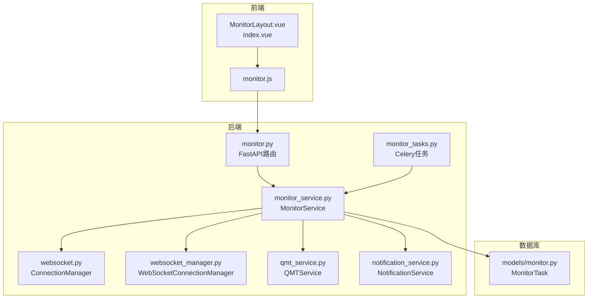
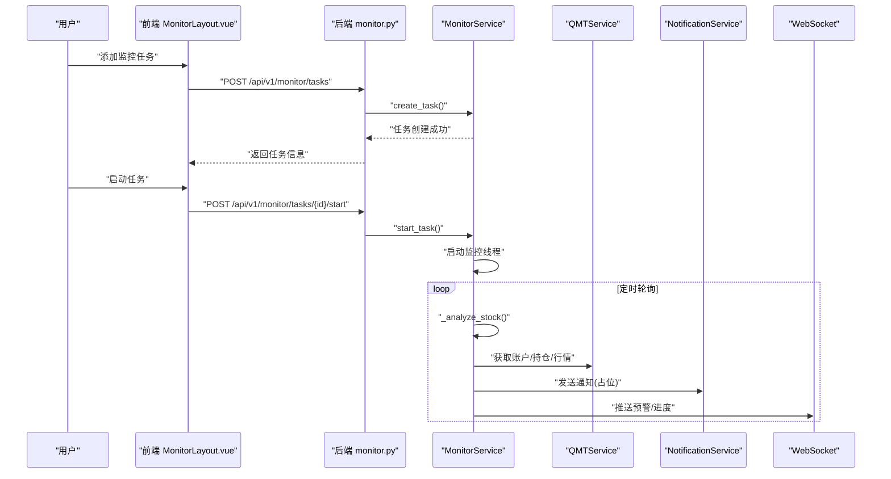
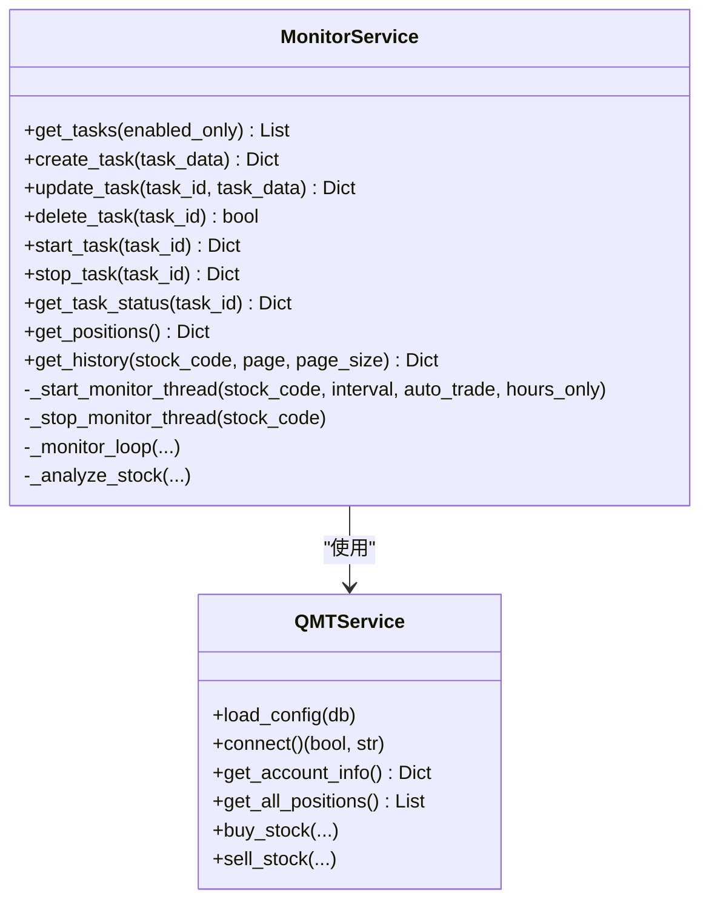
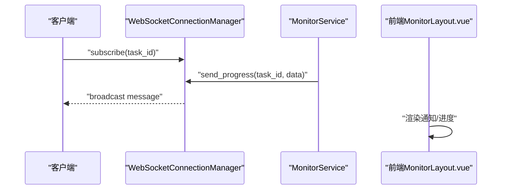
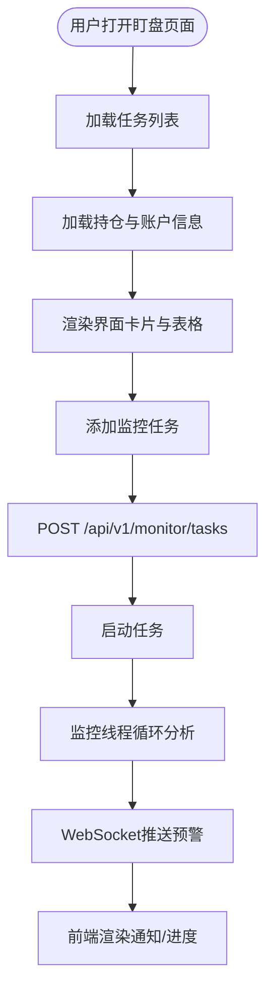
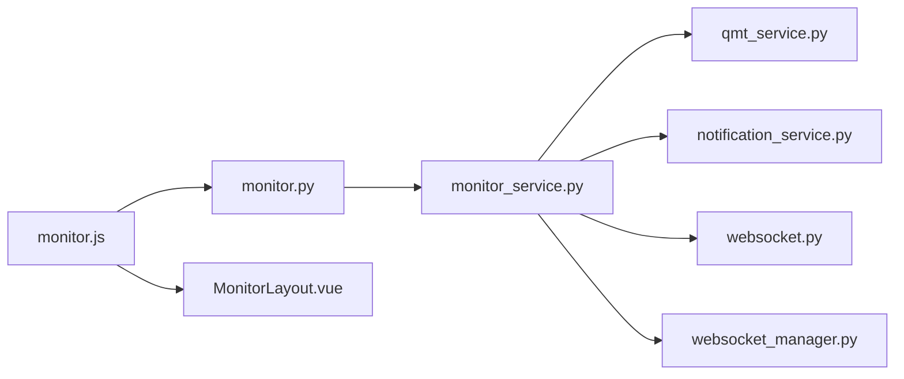

# 智能盯盘与持仓管理

<cite>
**本文引用的文件**
- [backend/app/services/monitor_service.py](file://backend/app/services/monitor_service.py)
- [backend/app/api/v1/monitor.py](file://backend/app/api/v1/monitor.py)
- [backend/app/api/websocket.py](file://backend/app/api/websocket.py)
- [backend/app/core/websocket_manager.py](file://backend/app/core/websocket_manager.py)
- [backend/app/models/monitor.py](file://backend/app/models/monitor.py)
- [backend/app/schemas/monitor.py](file://backend/app/schemas/monitor.py)
- [backend/app/services/qmt_service.py](file://backend/app/services/qmt_service.py)
- [backend/app/services/notification_service.py](file://backend/app/services/notification_service.py)
- [backend/app/tasks/monitor_tasks.py](file://backend/app/tasks/monitor_tasks.py)
- [frontend/src/views/monitor/index.vue](file://frontend/src/views/monitor/index.vue)
- [frontend/src/views/monitor/components/MonitorLayout.vue](file://frontend/src/views/monitor/components/MonitorLayout.vue)
- [frontend/src/api/monitor.js](file://frontend/src/api/monitor.js)
- [docs/智能盯盘使用指南.md](file://docs/智能盯盘使用指南.md)
- [docs/智能盯盘持仓管理功能说明.md](file://docs/智能盯盘持仓管理功能说明.md)
- [docs/智能盯盘配置说明.md](file://docs/智能盯盘配置说明.md)
</cite>

## 目录
1. [引言](#引言)
2. [项目结构](#项目结构)
3. [核心组件](#核心组件)
4. [架构总览](#架构总览)
5. [详细组件分析](#详细组件分析)
6. [依赖关系分析](#依赖关系分析)
7. [性能考量](#性能考量)
8. [故障排查指南](#故障排查指南)
9. [结论](#结论)
10. [附录](#附录)

## 引言
本文件系统化梳理“智能盯盘与持仓管理”功能，覆盖用户如何添加关注股票、设定价格阈值、选择通知方式；后端如何通过定时任务或实时数据流检测条件触发；WebSocket如何将预警消息实时推送到前端；以及多账户管理、持仓成本计算、盈亏统计等高级能力。同时提供API接口说明与错误处理策略，确保用户稳定使用盯盘服务。

## 项目结构
系统采用前后端分离架构：
- 后端FastAPI提供REST API与WebSocket支持，负责监控任务管理、数据采集、AI决策、通知与交易执行。
- 前端Vue基于Element UI构建，提供盯盘任务管理、持仓展示、通知与历史记录等界面。
- 数据层使用SQLAlchemy模型与PostgreSQL，监控任务与配置持久化。
- 交易侧集成miniQMT（xtquant），支持实盘或模拟交易。

图表来源
- [frontend/src/views/monitor/components/MonitorLayout.vue](file://frontend/src/views/monitor/components/MonitorLayout.vue#L1-L120)
- [frontend/src/api/monitor.js](file://frontend/src/api/monitor.js#L1-L79)
- [backend/app/api/v1/monitor.py](file://backend/app/api/v1/monitor.py#L1-L135)
- [backend/app/api/websocket.py](file://backend/app/api/websocket.py#L1-L41)
- [backend/app/core/websocket_manager.py](file://backend/app/core/websocket_manager.py#L1-L119)
- [backend/app/services/monitor_service.py](file://backend/app/services/monitor_service.py#L1-L120)
- [backend/app/services/qmt_service.py](file://backend/app/services/qmt_service.py#L1-L120)
- [backend/app/services/notification_service.py](file://backend/app/services/notification_service.py#L1-L34)
- [backend/app/tasks/monitor_tasks.py](file://backend/app/tasks/monitor_tasks.py#L1-L13)
- [backend/app/models/monitor.py](file://backend/app/models/monitor.py#L1-L39)

章节来源
- [backend/app/api/v1/monitor.py](file://backend/app/api/v1/monitor.py#L1-L135)
- [frontend/src/views/monitor/index.vue](file://frontend/src/views/monitor/index.vue#L1-L14)
- [frontend/src/views/monitor/components/MonitorLayout.vue](file://frontend/src/views/monitor/components/MonitorLayout.vue#L1-L200)
- [backend/app/models/monitor.py](file://backend/app/models/monitor.py#L1-L39)

## 核心组件
- 监控服务（MonitorService）
  - 负责任务生命周期管理（创建、更新、启动、停止、删除）、任务状态查询、持仓信息获取、AI决策历史查询。
  - 内部维护监控线程池与停止标志，支持按股票代码并发监控。
- WebSocket（ConnectionManager 与 WebSocketConnectionManager）
  - 提供连接管理、订阅/退订、广播与进度推送能力。
- QMT服务（QMTService）
  - 封装miniQMT连接、账户信息查询、持仓列表、买卖下单等交易能力，支持模拟与实盘。
- 通知服务（NotificationService）
  - 提供邮件与Webhook通知接口占位，便于扩展。
- API路由（monitor.py）
  - 对外暴露任务管理、持仓查询、历史查询等REST接口。
- 前端组件（MonitorLayout.vue）
  - 提供任务列表、创建/编辑、通知与历史、持仓展示等交互界面。

章节来源
- [backend/app/services/monitor_service.py](file://backend/app/services/monitor_service.py#L1-L120)
- [backend/app/api/websocket.py](file://backend/app/api/websocket.py#L1-L41)
- [backend/app/core/websocket_manager.py](file://backend/app/core/websocket_manager.py#L1-L119)
- [backend/app/services/qmt_service.py](file://backend/app/services/qmt_service.py#L1-L120)
- [backend/app/services/notification_service.py](file://backend/app/services/notification_service.py#L1-L34)
- [backend/app/api/v1/monitor.py](file://backend/app/api/v1/monitor.py#L1-L135)
- [frontend/src/views/monitor/components/MonitorLayout.vue](file://frontend/src/views/monitor/components/MonitorLayout.vue#L1-L200)

## 架构总览
整体工作流如下：
- 用户在前端添加监控任务，设置股票代码、检查间隔、进场区间、止盈止损、通知开关、量化配置等。
- 后端API接收请求，调用MonitorService持久化任务并启动监控线程。
- MonitorService周期性拉取数据、进行AI决策（当前为简化逻辑），并根据配置触发通知或交易。
- WebSocket向订阅的前端推送实时进度与预警消息。
- 前端MonitorLayout展示任务状态、持仓与通知历史。

图表来源
- [backend/app/api/v1/monitor.py](file://backend/app/api/v1/monitor.py#L1-L135)
- [backend/app/services/monitor_service.py](file://backend/app/services/monitor_service.py#L1-L200)
- [backend/app/services/qmt_service.py](file://backend/app/services/qmt_service.py#L1-L200)
- [backend/app/services/notification_service.py](file://backend/app/services/notification_service.py#L1-L34)
- [backend/app/api/websocket.py](file://backend/app/api/websocket.py#L1-L41)
- [frontend/src/views/monitor/components/MonitorLayout.vue](file://frontend/src/views/monitor/components/MonitorLayout.vue#L1-L200)

## 详细组件分析

### 监控服务（MonitorService）
- 任务管理
  - 创建/更新/删除/启动/停止/查询任务状态。
  - 支持字段映射（兼容symbol与stock_code），JSON序列化量化配置。
- 持仓与账户
  - 通过QMTService获取账户信息与持仓列表，计算总盈亏、可用资金、市值等。
- 监控线程
  - 为每个股票代码维护独立线程，使用Event控制停止；线程内循环调用分析逻辑。
- AI决策
  - 当前为简化逻辑，后续应接入DeepSeekClient与技术指标计算。

图表来源
- [backend/app/services/monitor_service.py](file://backend/app/services/monitor_service.py#L1-L200)
- [backend/app/services/qmt_service.py](file://backend/app/services/qmt_service.py#L1-L200)

章节来源
- [backend/app/services/monitor_service.py](file://backend/app/services/monitor_service.py#L1-L200)
- [backend/app/models/monitor.py](file://backend/app/models/monitor.py#L1-L39)
- [backend/app/schemas/monitor.py](file://backend/app/schemas/monitor.py#L1-L32)

### WebSocket与实时推送
- ConnectionManager（后端）：基础连接管理与广播。
- WebSocketConnectionManager（后端）：按任务维度管理订阅，支持订阅/退订、进度推送、断连清理。
- 前端monitor.js：封装API调用；前端MonitorLayout.vue负责渲染与交互。

图表来源
- [backend/app/core/websocket_manager.py](file://backend/app/core/websocket_manager.py#L1-L119)
- [backend/app/api/websocket.py](file://backend/app/api/websocket.py#L1-L41)
- [frontend/src/views/monitor/components/MonitorLayout.vue](file://frontend/src/views/monitor/components/MonitorLayout.vue#L1-L200)

章节来源
- [backend/app/core/websocket_manager.py](file://backend/app/core/websocket_manager.py#L1-L119)
- [backend/app/api/websocket.py](file://backend/app/api/websocket.py#L1-L41)
- [frontend/src/views/monitor/components/MonitorLayout.vue](file://frontend/src/views/monitor/components/MonitorLayout.vue#L1-L200)

### 前端交互与数据展示
- MonitorLayout.vue
  - 任务面板：任务列表、状态卡片、筛选、批量启动/暂停。
  - 持仓面板：账户概览、持仓表格、浮动盈亏、总盈亏。
  - 通知与历史：通知时间线、历史记录。
  - 创建面板：股票代码、进场区间、止盈止损、通知开关、量化配置。
- monitor.js
  - 封装任务、持仓、历史查询API。

图表来源
- [frontend/src/views/monitor/components/MonitorLayout.vue](file://frontend/src/views/monitor/components/MonitorLayout.vue#L1-L200)
- [frontend/src/api/monitor.js](file://frontend/src/api/monitor.js#L1-L79)

章节来源
- [frontend/src/views/monitor/index.vue](file://frontend/src/views/monitor/index.vue#L1-L14)
- [frontend/src/views/monitor/components/MonitorLayout.vue](file://frontend/src/views/monitor/components/MonitorLayout.vue#L1-L200)
- [frontend/src/api/monitor.js](file://frontend/src/api/monitor.js#L1-L79)

### 价格预警触发与通知
- 价格预警
  - 前端创建任务时设置进场区间、止盈止损；后端MonitorService在分析循环中根据当前价与阈值触发。
- 通知
  - NotificationService预留邮件与Webhook接口；当前MonitorService返回占位，后续接入具体通知通道。
- WebSocket
  - 通过WebSocketConnectionManager向订阅客户端推送预警消息。

章节来源
- [backend/app/services/monitor_service.py](file://backend/app/services/monitor_service.py#L1-L200)
- [backend/app/services/notification_service.py](file://backend/app/services/notification_service.py#L1-L34)
- [backend/app/core/websocket_manager.py](file://backend/app/core/websocket_manager.py#L1-L119)

### 多账户管理与持仓成本计算
- 多账户
  - QMTService封装账户连接与订阅，MonitorService通过其获取账户信息与持仓列表。
- 持仓成本与盈亏
  - 从QMT获取成本价、数量、当前价，计算浮动盈亏与盈亏比例；账户总盈亏汇总所有持仓。
- 前端展示
  - MonitorLayout.vue展示账户概览与持仓明细，支持格式化货币/百分比。

章节来源
- [backend/app/services/qmt_service.py](file://backend/app/services/qmt_service.py#L1-L200)
- [frontend/src/views/monitor/components/MonitorLayout.vue](file://frontend/src/views/monitor/components/MonitorLayout.vue#L1-L200)

## 依赖关系分析
- 组件耦合
  - MonitorService依赖QMTService与NotificationService；API路由依赖MonitorService；前端依赖monitor.js与MonitorLayout.vue。
- 外部依赖
  - miniQMT（xtquant）用于实盘交易；DeepSeek API用于AI决策（当前简化逻辑）。
- 潜在环依赖
  - 通过延迟初始化与模块导入避免循环依赖。

图表来源
- [backend/app/api/v1/monitor.py](file://backend/app/api/v1/monitor.py#L1-L135)
- [backend/app/services/monitor_service.py](file://backend/app/services/monitor_service.py#L1-L200)
- [backend/app/services/qmt_service.py](file://backend/app/services/qmt_service.py#L1-L200)
- [backend/app/services/notification_service.py](file://backend/app/services/notification_service.py#L1-L34)
- [backend/app/api/websocket.py](file://backend/app/api/websocket.py#L1-L41)
- [backend/app/core/websocket_manager.py](file://backend/app/core/websocket_manager.py#L1-L119)
- [frontend/src/api/monitor.js](file://frontend/src/api/monitor.js#L1-L79)
- [frontend/src/views/monitor/components/MonitorLayout.vue](file://frontend/src/views/monitor/components/MonitorLayout.vue#L1-L200)

章节来源
- [backend/app/api/v1/monitor.py](file://backend/app/api/v1/monitor.py#L1-L135)
- [backend/app/services/monitor_service.py](file://backend/app/services/monitor_service.py#L1-L200)

## 性能考量
- 监控线程池
  - 每个股票一个线程，使用Event等待降低CPU占用；建议合理设置check_interval，避免频繁轮询。
- 数据获取
  - 优先使用xtdata接口获取实时行情与股票名称，失败时回退成本价估算，减少异常影响。
- WebSocket
  - 按任务维度管理订阅，断连清理，避免广播无效连接。
- 前端
  - 使用骨架屏与空态提升加载体验；分页加载历史与任务列表。

[本节为通用指导，不直接分析具体文件]

## 故障排查指南
- QMT连接失败
  - 确认MINIQMT_ENABLED、账户ID、服务地址与端口配置；检查miniQMT客户端状态。
- API调用失败
  - 检查DEEPSEEK_API_KEY与网络；查看后端日志定位异常。
- 通知未送达
  - 邮件/Webhook配置需在后端生效；前端通知列表为空时检查后端通知服务实现。
- 任务无法启动/停止
  - 检查任务是否存在、线程是否已存在；查看MonitorService日志。

章节来源
- [docs/智能盯盘配置说明.md](file://docs/智能盯盘配置说明.md#L1-L264)
- [backend/app/services/qmt_service.py](file://backend/app/services/qmt_service.py#L1-L200)
- [backend/app/services/monitor_service.py](file://backend/app/services/monitor_service.py#L1-L200)

## 结论
本系统通过“任务驱动 + 实时监控 + WebSocket推送”的方式，为用户提供从任务配置、价格预警、通知到多账户与持仓管理的完整盯盘体验。当前AI决策逻辑为简化实现，后续可接入DeepSeekClient与完善技术指标体系；通知与交易通道亦可按需扩展，以满足不同用户需求。

[本节为总结性内容，不直接分析具体文件]

## 附录

### API接口说明
- 获取任务列表
  - 方法：GET /api/v1/monitor/tasks
  - 返回：任务列表（含状态、阈值、通知开关、量化配置）
- 创建任务
  - 方法：POST /api/v1/monitor/tasks
  - 请求体：任务字段（股票代码、检查间隔、进场区间、止盈止损、通知开关、量化配置）
  - 返回：创建成功的任务信息
- 更新任务
  - 方法：PUT /api/v1/monitor/tasks/{task_id}
  - 请求体：任务字段
  - 返回：更新后的任务信息
- 删除任务
  - 方法：DELETE /api/v1/monitor/tasks/{task_id}
  - 返回：布尔值
- 启动任务
  - 方法：POST /api/v1/monitor/tasks/{task_id}/start
  - 返回：启动结果
- 停止任务
  - 方法：POST /api/v1/monitor/tasks/{task_id}/stop
  - 返回：停止结果
- 获取任务状态
  - 方法：GET /api/v1/monitor/tasks/{task_id}/status
  - 返回：任务状态详情
- 获取持仓
  - 方法：GET /api/v1/monitor/positions
  - 返回：账户信息与持仓列表
- 决策历史
  - 方法：GET /api/v1/monitor/history?page&page_size
  - 返回：历史列表（当前占位）

章节来源
- [backend/app/api/v1/monitor.py](file://backend/app/api/v1/monitor.py#L1-L135)
- [frontend/src/api/monitor.js](file://frontend/src/api/monitor.js#L1-L79)

### 错误处理策略
- 后端
  - 所有API捕获异常并返回HTTP 500；MonitorService对数据库操作使用事务回滚。
- 前端
  - 对API调用失败进行降级（示例数据），并提示用户。
- WebSocket
  - 发送失败时清理断连连接，保证管理器一致性。

章节来源
- [backend/app/api/v1/monitor.py](file://backend/app/api/v1/monitor.py#L1-L135)
- [frontend/src/views/monitor/components/MonitorLayout.vue](file://frontend/src/views/monitor/components/MonitorLayout.vue#L1-L200)
- [backend/app/core/websocket_manager.py](file://backend/app/core/websocket_manager.py#L1-L119)