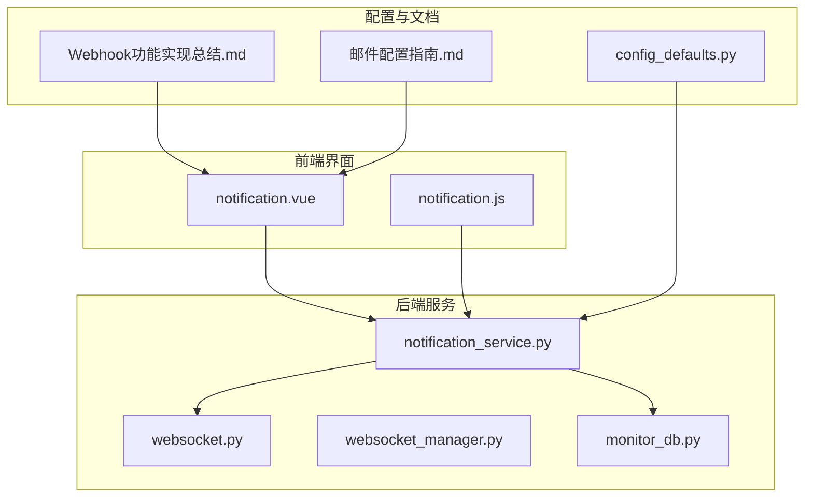
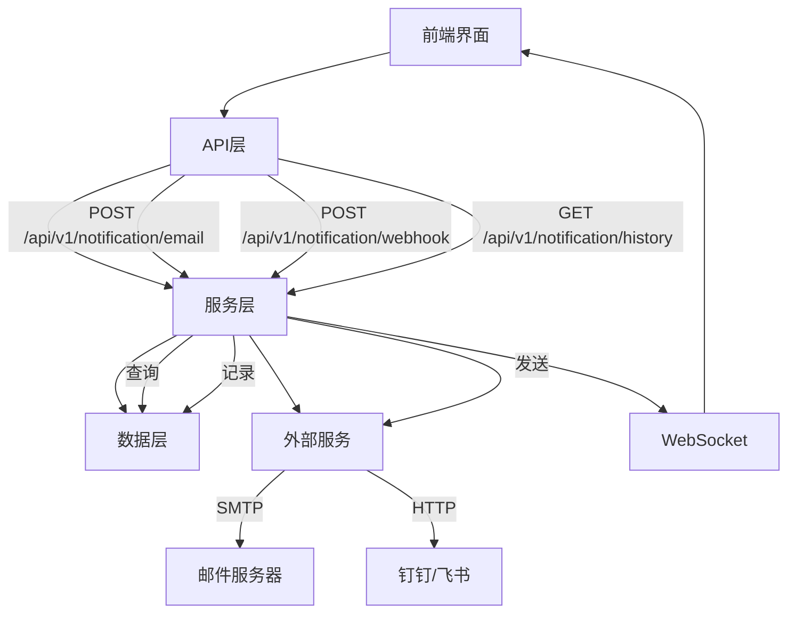
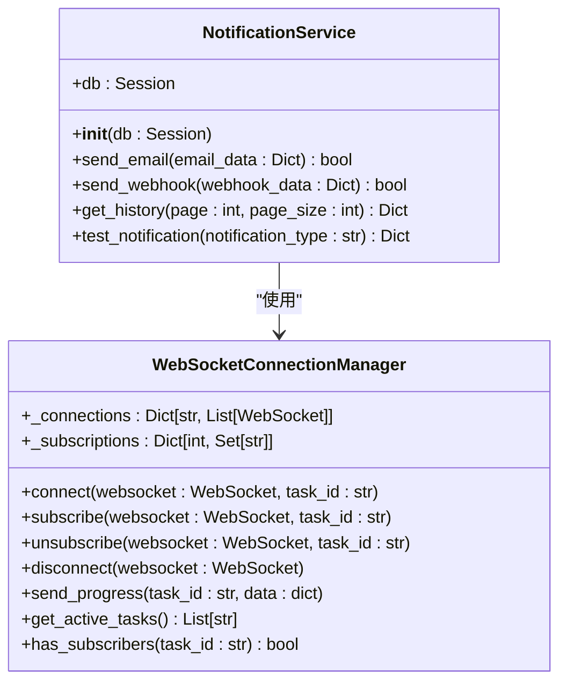
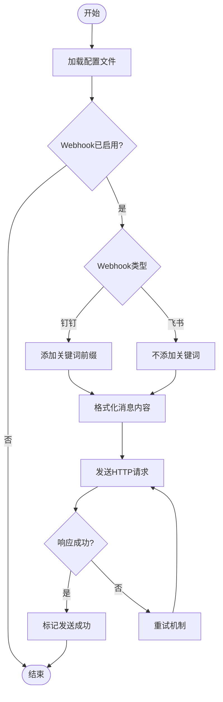
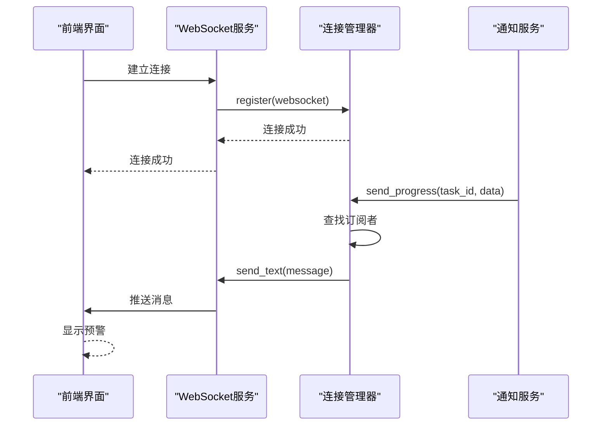
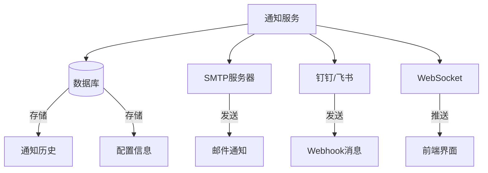

# 预警通知系统

<cite>
**本文档引用的文件**  
- [notification_service.py](file://backend/app/services/notification_service.py)
- [websocket.py](file://backend/app/api/websocket.py)
- [websocket_manager.py](file://backend/app/core/websocket_manager.py)
- [notification.py](file://backend/app/api/v1/notification.py)
- [monitor.py](file://backend/app/models/monitor.py)
- [monitor_service.py](file://backend/app/services/monitor_service.py)
- [Webhook功能实现总结.md](file://docs/Webhook功能实现总结.md)
- [Webhook自定义关键词功能说明.md](file://docs/Webhook自定义关键词功能说明.md)
- [邮件配置指南.md](file://docs/邮件配置指南.md)
- [config_defaults.py](file://backend/app/core/config_defaults.py)
- [notification.js](file://frontend/src/api/notification.js)
- [notification.vue](file://frontend/src/views/config/notification.vue)
</cite>

## 目录
1. [简介](#简介)
2. [项目结构](#项目结构)
3. [核心组件](#核心组件)
4. [架构概述](#架构概述)
5. [详细组件分析](#详细组件分析)
6. [依赖分析](#依赖分析)
7. [性能考虑](#性能考虑)
8. [故障排除指南](#故障排除指南)
9. [结论](#结论)

## 简介
预警通知系统是AI股票分析平台的核心功能之一，负责在监控条件触发后向用户发送实时预警信息。系统支持多种通知渠道，包括邮件、Webhook（钉钉/飞书）和前端弹窗，确保用户能够及时获取关键投资信息。本系统通过WebSocket实现低延迟的实时推送，并提供灵活的配置选项，包括通知模板定制、发送频率控制和失败重试机制。

## 项目结构
预警通知系统主要由后端服务、前端界面和配置文档三大部分组成。后端服务位于`backend/app/services/`目录下，核心文件为`notification_service.py`，负责处理所有通知逻辑。前端界面位于`frontend/src/views/config/`目录下，提供可视化配置界面。系统还包含详细的文档说明，帮助用户快速配置和使用各种通知方式。

**图源**  
- [notification_service.py](file://backend/app/services/notification_service.py)
- [websocket.py](file://backend/app/api/websocket.py)
- [websocket_manager.py](file://backend/app/core/websocket_manager.py)
- [notification.vue](file://frontend/src/views/config/notification.vue)
- [notification.js](file://frontend/src/api/notification.js)
- [config_defaults.py](file://backend/app/core/config_defaults.py)

## 核心组件
预警通知系统的核心组件包括通知服务、WebSocket管理器和配置管理器。`NotificationService`类负责处理所有通知的发送逻辑，支持邮件和Webhook两种主要渠道。`WebSocketConnectionManager`类管理所有WebSocket连接，确保预警信息能够实时推送到前端界面。系统通过环境变量和配置文件实现灵活的配置管理，用户可以轻松启用或禁用不同的通知方式。

**节源**  
- [notification_service.py](file://backend/app/services/notification_service.py#L8-L34)
- [websocket_manager.py](file://backend/app/core/websocket_manager.py#L12-L119)
- [config_defaults.py](file://backend/app/core/config_defaults.py#L49-L99)

## 架构概述
预警通知系统的架构采用分层设计，分为API层、服务层和数据层。API层暴露RESTful接口，供前端调用；服务层包含核心业务逻辑，处理通知的发送和管理；数据层负责存储通知历史和配置信息。系统通过WebSocket实现双向通信，确保预警信息的实时性。当监控条件触发时，系统会根据用户配置，通过邮件、Webhook或前端弹窗发送预警。

**图源**  
- [notification.py](file://backend/app/api/v1/notification.py)
- [notification_service.py](file://backend/app/services/notification_service.py)
- [websocket.py](file://backend/app/api/websocket.py)

## 详细组件分析
### 通知服务分析
`NotificationService`类是预警通知系统的核心，负责处理所有通知的发送逻辑。系统支持邮件和Webhook两种主要通知方式，用户可以通过配置文件或前端界面进行设置。当监控条件触发时，系统会根据配置调用相应的通知适配器发送消息。

#### 通知服务类图

**图源**  
- [notification_service.py](file://backend/app/services/notification_service.py#L8-L34)
- [websocket_manager.py](file://backend/app/core/websocket_manager.py#L12-L119)

### Webhook高级功能实现
Webhook功能支持自定义关键词和钉钉集成等高级特性。用户可以在`.env`文件中配置`WEBHOOK_KEYWORD`，系统会自动在消息中添加相应的关键词前缀。对于钉钉机器人，必须配置正确的关键词才能成功发送消息；而飞书机器人则不需要关键词。

#### Webhook配置流程图

**图源**  
- [Webhook自定义关键词功能说明.md](file://docs/Webhook自定义关键词功能说明.md)
- [notification_service.py](file://backend/app/services/notification_service.py)

### WebSocket实时推送
WebSocket系统通过`websocket_manager.py`实现，确保预警事件能够实时推送到前端界面。系统采用订阅-发布模式，前端通过WebSocket连接到服务器并订阅特定任务，当任务状态更新时，服务器会自动推送进度信息。

#### WebSocket通信序列图

**图源**  
- [websocket.py](file://backend/app/api/websocket.py#L9-L41)
- [websocket_manager.py](file://backend/app/core/websocket_manager.py#L12-L119)

## 依赖分析
预警通知系统依赖多个外部组件和库，包括数据库、邮件服务器和即时通讯平台。系统通过配置文件管理这些依赖，确保灵活性和可维护性。核心依赖包括SQLAlchemy用于数据库操作，requests库用于HTTP请求，以及FastAPI框架提供的WebSocket支持。

**图源**  
- [notification_service.py](file://backend/app/services/notification_service.py)
- [monitor.py](file://backend/app/models/monitor.py)
- [config_defaults.py](file://backend/app/core/config_defaults.py)

## 性能考虑
预警通知系统在设计时充分考虑了性能因素。系统采用异步处理机制，确保通知发送不会阻塞主业务流程。对于高频预警场景，系统实现了发送频率控制，避免短时间内发送过多通知。WebSocket连接经过优化，支持大量并发连接，确保低延迟的实时推送。

## 故障排除指南
当遇到通知发送失败的问题时，建议按照以下步骤进行排查：
1. 检查`.env`文件中的配置是否正确
2. 验证网络连接是否正常
3. 查看系统日志中的错误信息
4. 测试SMTP服务器或Webhook URL的连通性
5. 确认钉钉/飞书机器人的安全设置是否正确

**节源**  
- [Webhook功能实现总结.md](file://docs/Webhook功能实现总结.md)
- [邮件配置指南.md](file://docs/邮件配置指南.md)
- [Webhook自定义关键词功能说明.md](file://docs/Webhook自定义关键词功能说明.md)

## 结论
预警通知系统通过多种渠道和灵活的配置选项，为用户提供及时可靠的投资预警服务。系统架构清晰，组件职责明确，易于维护和扩展。未来可以考虑增加更多通知渠道，如企业微信、短信等，并进一步优化通知模板的定制能力。