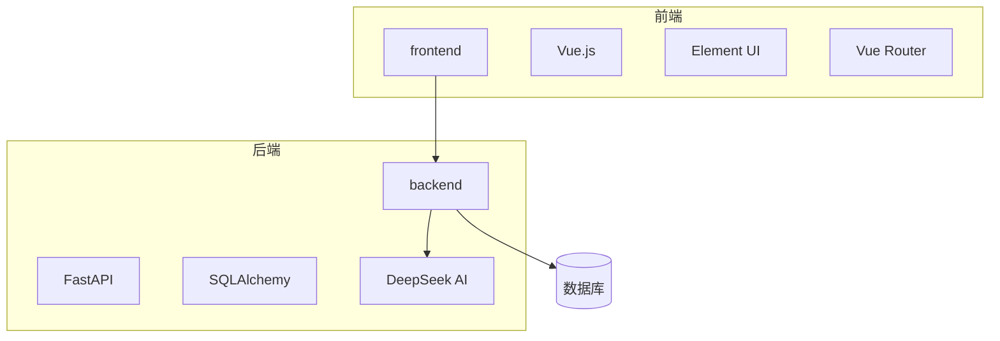
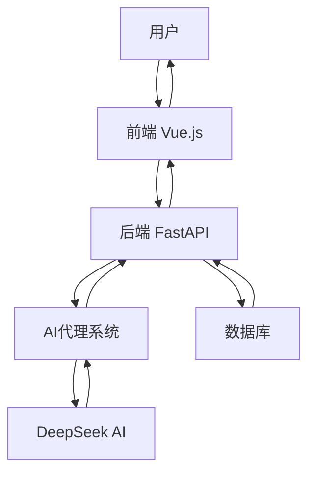
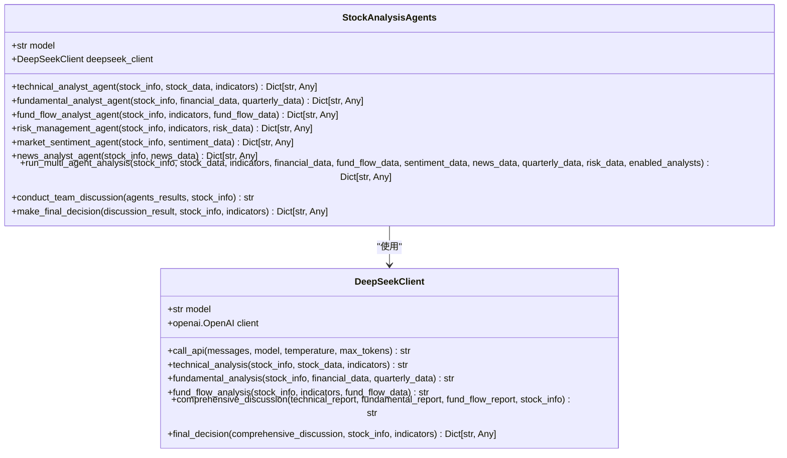
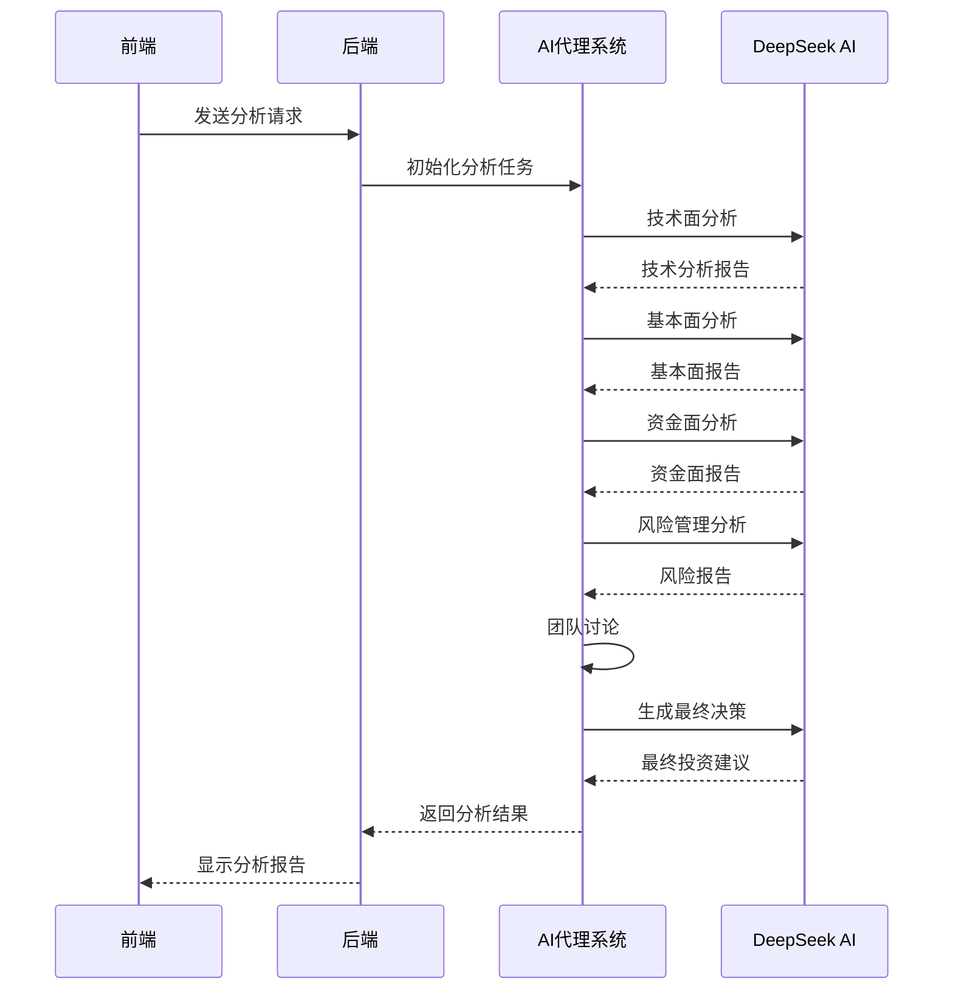
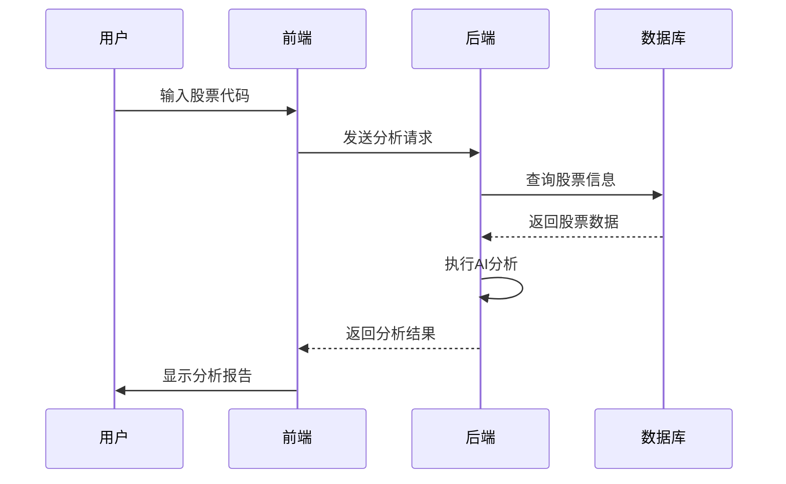
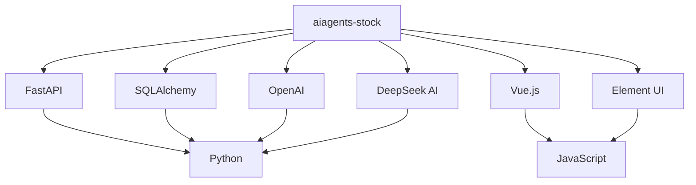

# 系统概述

<cite>
**本文档引用的文件**   
- [main.py](file://backend/app/main.py)
- [ai_agents.py](file://backend/app/agents/ai_agents.py)
- [deepseek_client.py](file://backend/app/agents/deepseek_client.py)
- [router.py](file://backend/app/api/v1/router.py)
- [stock.py](file://backend/app/api/v1/stock.py)
- [stock_service.py](file://backend/app/services/stock_service.py)
- [stock.py](file://backend/app/models/stock.py)
- [index.js](file://frontend/src/router/index.js)
- [index.vue](file://frontend/src/views/stock/index.vue)
- [config.py](file://backend/app/config.py)
- [main.js](file://frontend/src/main.js)
</cite>

## 目录
1. [简介](#简介)
2. [项目结构](#项目结构)
3. [核心组件](#核心组件)
4. [架构概述](#架构概述)
5. [详细组件分析](#详细组件分析)
6. [依赖分析](#依赖分析)
7. [性能考虑](#性能考虑)
8. [故障排除指南](#故障排除指南)
9. [结论](#结论)

## 简介
aiagents-stock项目是一个AI驱动的股票投资分析平台，旨在为投资者、分析师和交易员提供全面的智能分析服务。该系统采用前后端分离的设计理念，前端基于Vue.js构建用户界面，后端采用FastAPI提供RESTful API服务，并集成DeepSeek AI模型进行智能分析。系统主要功能模块包括智策板块、智瞰龙虎、主力选股、智能盯盘等，这些模块之间通过清晰的数据流动路径相互关联。系统设计目标是为用户提供一个高效、准确的投资决策支持工具，适用于不同类型的用户群体，包括个人投资者、专业分析师和交易员。典型使用场景包括股票筛选、投资决策支持、风险评估和市场监控。

## 项目结构
aiagents-stock项目采用清晰的分层架构，分为前端和后端两个主要部分。后端位于`backend`目录下，使用FastAPI框架构建RESTful API服务，主要包含应用逻辑、数据库操作、AI代理和API路由等组件。前端位于`frontend`目录下，基于Vue.js框架构建用户界面，包含视图、组件、路由和API调用等。`docs`目录包含详细的文档，`old`目录存放旧版本代码，`xtquant`目录包含量化交易相关的工具和配置。

**图源**
- [main.py](file://backend/app/main.py)
- [main.js](file://frontend/src/main.js)

## 核心组件
aiagents-stock项目的核心组件包括前端用户界面、后端API服务、AI代理系统和数据库。前端基于Vue.js构建，提供直观的用户界面和交互体验。后端采用FastAPI框架，提供高性能的RESTful API服务。AI代理系统集成DeepSeek模型，实现智能分析功能。数据库使用SQLAlchemy进行ORM操作，存储股票分析结果和用户数据。

**组件源**
- [main.py](file://backend/app/main.py)
- [main.js](file://frontend/src/main.js)
- [ai_agents.py](file://backend/app/agents/ai_agents.py)
- [stock.py](file://backend/app/models/stock.py)

## 架构概述
aiagents-stock项目采用前后端分离的架构设计，前端基于Vue.js构建用户界面，后端采用FastAPI提供RESTful API服务。系统通过API进行数据交互，前端负责展示和用户交互，后端负责业务逻辑和数据处理。AI代理系统集成DeepSeek模型，实现智能分析功能。数据库使用SQLAlchemy进行ORM操作，存储股票分析结果和用户数据。

**图源**
- [main.py](file://backend/app/main.py)
- [main.js](file://frontend/src/main.js)

## 详细组件分析
### AI代理系统分析
AI代理系统是aiagents-stock项目的核心智能组件，负责执行多维度的股票分析任务。该系统由多个专业分析师代理组成，包括技术面分析师、基本面分析师、资金面分析师、风险管理师、市场情绪分析师和新闻分析师。这些代理协同工作，为用户提供全面的投资决策支持。

#### AI代理类图

**图源**
- [ai_agents.py](file://backend/app/agents/ai_agents.py)
- [deepseek_client.py](file://backend/app/agents/deepseek_client.py)

#### 股票分析工作流程

**图源**
- [ai_agents.py](file://backend/app/agents/ai_agents.py)
- [stock_service.py](file://backend/app/services/stock_service.py)

### 前后端交互分析
前后端交互是aiagents-stock项目的关键组成部分，负责连接用户界面和后端服务。前端基于Vue.js框架，使用Element UI组件库构建用户界面，通过Axios库调用后端API。后端采用FastAPI框架，提供RESTful API服务，处理前端请求并返回数据。

#### 前后端交互流程

**图源**
- [stock.py](file://backend/app/api/v1/stock.py)
- [index.vue](file://frontend/src/views/stock/index.vue)

## 依赖分析
aiagents-stock项目依赖多个外部库和服务，包括FastAPI、SQLAlchemy、OpenAI、Vue.js、Element UI等。这些依赖项通过`requirements.txt`和`package.json`文件进行管理。项目还依赖DeepSeek AI服务进行智能分析，通过API密钥进行身份验证。

**图源**
- [requirements.txt](file://backend/requirements.txt)
- [package.json](file://frontend/package.json)

## 性能考虑
aiagents-stock项目在设计时考虑了性能优化，采用异步处理和缓存机制提高响应速度。后端使用FastAPI框架，支持异步请求处理，能够高效处理大量并发请求。AI分析任务采用后台任务模式，避免阻塞主线程。前端使用Vue.js的响应式系统，实现高效的UI更新。

## 故障排除指南
### 常见问题及解决方案
| 问题 | 可能原因 | 解决方案 |
|------|---------|---------|
| 分析任务超时 | 网络延迟或AI服务响应慢 | 检查网络连接，确认DeepSeek API可用性 |
| 数据库连接失败 | 数据库配置错误或服务未启动 | 检查数据库配置，确认数据库服务运行状态 |
| 前端页面加载慢 | 网络延迟或资源加载问题 | 检查网络连接，优化前端资源加载 |
| AI分析结果不准确 | 输入数据质量或模型问题 | 检查输入数据质量，确认AI模型版本 |

**组件源**
- [config.py](file://backend/app/config.py)
- [main.py](file://backend/app/main.py)

## 结论
aiagents-stock项目是一个功能全面的AI驱动股票投资分析平台，采用前后端分离的架构设计，前端基于Vue.js构建用户界面，后端采用FastAPI提供RESTful API服务。系统集成DeepSeek AI模型，实现智能分析功能，为用户提供全面的投资决策支持。项目结构清晰，组件职责明确，具有良好的可扩展性和维护性。通过详细的文档和示例，开发者可以快速理解和使用该系统，为投资者、分析师和交易员提供高效、准确的投资决策工具。