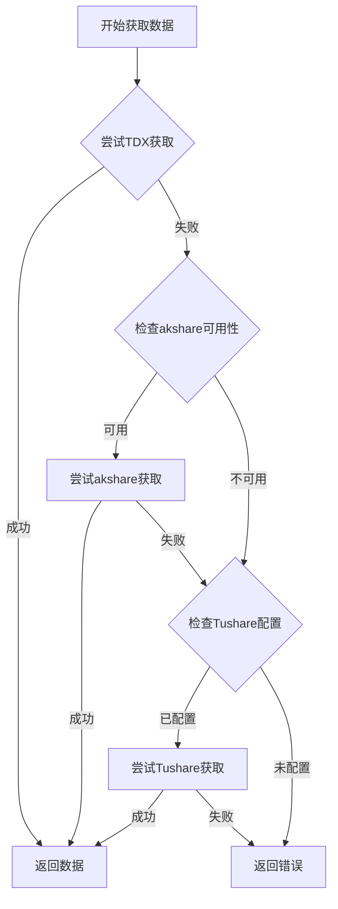
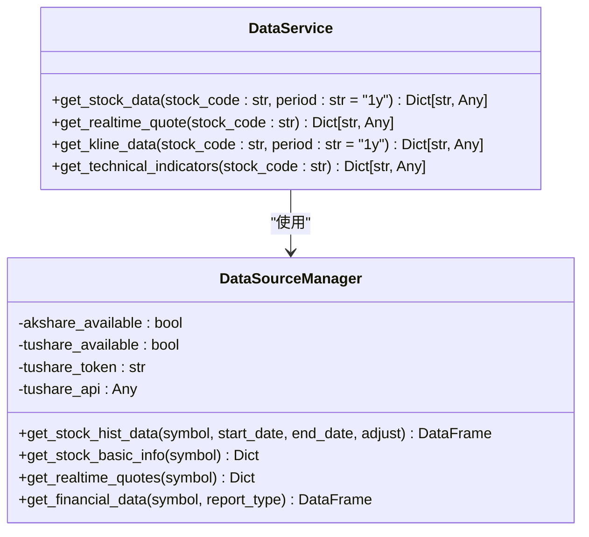
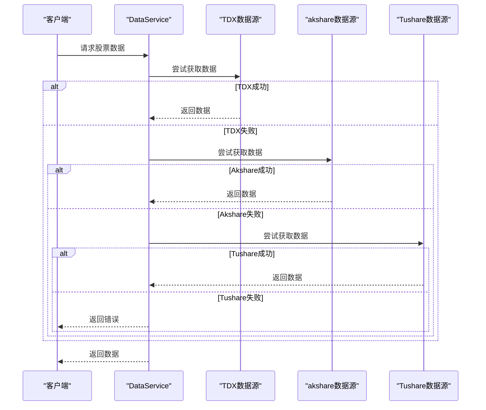
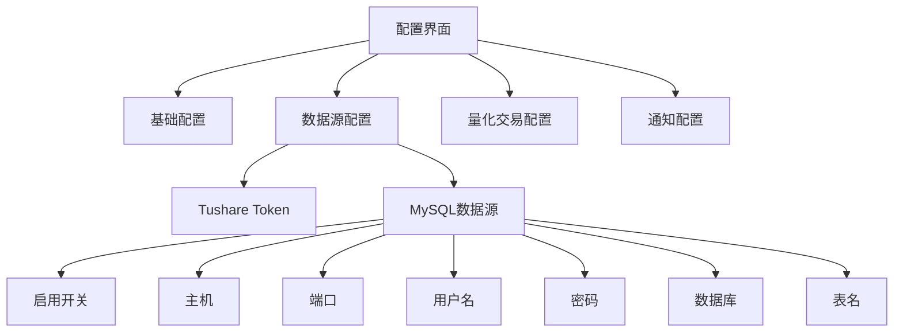

# 数据源管理

<cite>
**本文档引用的文件**  
- [data_service.py](file://backend/app/services/data_service.py)
- [data_management_service.py](file://backend/app/services/data_management_service.py)
- [config_service.py](file://backend/app/services/config_service.py)
- [config.py](file://backend/app/api/v1/config.py)
- [config_defaults.py](file://backend/app/core/config_defaults.py)
- [index.vue](file://frontend/src/views/config/index.vue)
- [config.js](file://frontend/src/api/config.js)
- [TDX数据源配置指南.md](file://docs/TDX数据源配置指南.md)
- [数据源冗余机制使用指南.md](file://docs/数据源冗余机制使用指南.md)
- [数据源冗余功能完成总结.md](file://docs/数据源冗余功能完成总结.md)
- [smart_monitor_data.py](file://old/smart_monitor_data.py)
- [data_source_manager.py](file://old/data_source_manager.py)
</cite>

## 目录
1. [简介](#简介)
2. [多数据源接入配置](#多数据源接入配置)
3. [数据源优先级与降级策略](#数据源优先级与降级策略)
4. [数据源抽象层实现](#数据源抽象层实现)
5. [数据源冗余机制](#数据源冗余机制)
6. [API接口文档](#api接口文档)
7. [前端配置界面](#前端配置界面)
8. [数据一致性与缓存策略](#数据一致性与缓存策略)
9. [故障处理与恢复策略](#故障处理与恢复策略)
10. [总结](#总结)

## 简介

本系统实现了多数据源管理机制，支持TDX、Tushare、akshare等多种数据源的接入与管理。系统通过统一的数据源抽象层，实现了不同数据接口的统一调用协议，并支持故障自动切换与负载均衡。数据源冗余机制确保了在主数据源不可用时，系统能够自动切换到备用数据源，保障数据获取的稳定性和可靠性。

**Section sources**
- [TDX数据源配置指南.md](file://docs/TDX数据源配置指南.md)
- [数据源冗余机制使用指南.md](file://docs/数据源冗余机制使用指南.md)

## 多数据源接入配置

系统支持多种数据源的接入配置，包括TDX、Tushare和akshare。这些数据源的配置主要通过环境变量和数据库配置两种方式实现。

### TDX数据源配置

TDX数据源通过环境变量进行配置，主要配置项包括：

- `TDX_ENABLED`: 是否启用TDX数据源（true/false）
- `TDX_BASE_URL`: TDX API服务地址

配置示例：
```bash
# 启用TDX数据源
TDX_ENABLED=true
# TDX API服务地址
TDX_BASE_URL=http://192.168.1.222:8080
```

### Tushare数据源配置

Tushare数据源通过配置文件进行管理，主要配置项为`TUSHARE_TOKEN`。该配置项可以在前端配置界面中进行设置，也可以直接在`.env`文件中配置。

### akshare数据源

akshare数据源为默认数据源，无需特殊配置。系统会自动使用akshare获取数据，当其他数据源不可用时，akshare作为备用数据源。

**Section sources**
- [TDX数据源配置指南.md](file://docs/TDX数据源配置指南.md)
- [config_defaults.py](file://backend/app/core/config_defaults.py)

## 数据源优先级与降级策略

系统采用多级数据源优先级策略，确保数据获取的效率和稳定性。数据源的优先级顺序如下：

1. **TDX数据源**：优先使用，提供快速、稳定的本地化数据接口
2. **akshare数据源**：作为备选，提供免费的金融数据接口
3. **Tushare数据源**：作为兜底，提供需要积分的专业数据接口

### 降级机制

当高优先级数据源不可用时，系统会自动降级到低优先级数据源。降级流程如下：

```
1. 首选TDX（如果启用）
   ↓ 失败
2. 降级到akshare
   ↓ 失败
3. 降级到Tushare（如果配置）
   ↓ 失败
4. 返回错误，停止分析
```

这种智能降级策略确保了数据获取的可靠性，即使在主数据源出现故障时，系统仍能通过备用数据源获取数据。



**Diagram sources**
- [TDX数据源配置指南.md](file://docs/TDX数据源配置指南.md)
- [数据源冗余机制使用指南.md](file://docs/数据源冗余机制使用指南.md)

**Section sources**
- [TDX数据源配置指南.md](file://docs/TDX数据源配置指南.md)
- [数据源冗余机制使用指南.md](file://docs/数据源冗余机制使用指南.md)

## 数据源抽象层实现

系统通过`data_service.py`中的`DataService`类实现了数据源的抽象层，统一了不同数据接口的调用协议。

### 数据服务类

`DataService`类提供了统一的数据获取接口，包括：

- `get_stock_data`: 获取股票数据
- `get_realtime_quote`: 获取实时行情
- `get_kline_data`: 获取K线数据
- `get_technical_indicators`: 获取技术指标

这些方法屏蔽了底层数据源的差异，上层应用无需关心具体使用哪个数据源。

### 数据源管理器

`data_source_manager.py`实现了数据源管理器，负责管理多个数据源的连接和调用。数据源管理器的主要功能包括：

- 初始化各个数据源
- 管理数据源的连接状态
- 实现数据源的自动切换
- 提供统一的数据获取接口

数据源管理器通过配置动态初始化，支持从数据库加载配置，确保配置的持久化。



**Diagram sources**
- [data_service.py](file://backend/app/services/data_service.py)
- [data_source_manager.py](file://old/data_source_manager.py)

**Section sources**
- [data_service.py](file://backend/app/services/data_service.py)
- [data_source_manager.py](file://old/data_source_manager.py)

## 数据源冗余机制

系统实现了完善的数据源冗余机制，确保在主数据源不可用时，能够自动切换到备用数据源。

### 主备切换逻辑

数据源冗余机制采用主备切换逻辑，优先使用主数据源（TDX），当主数据源失败时，自动切换到备用数据源（akshare或Tushare）。

切换逻辑如下：
1. 尝试从主数据源获取数据
2. 如果获取失败，记录错误日志
3. 尝试从第一个备用数据源获取数据
4. 如果仍然失败，尝试从第二个备用数据源获取数据
5. 如果所有数据源都失败，返回错误

### 健康检查与恢复策略

系统通过定期的健康检查来监控数据源的状态。健康检查主要包括：

- 连接测试：测试数据源的网络连接是否正常
- 接口测试：测试数据源的API接口是否可用
- 数据完整性检查：验证获取的数据是否完整有效

当数据源恢复可用时，系统会自动将其重新加入可用数据源列表，并在后续请求中优先使用。



**Diagram sources**
- [data_service.py](file://backend/app/services/data_service.py)
- [data_source_manager.py](file://old/data_source_manager.py)

**Section sources**
- [数据源冗余机制使用指南.md](file://docs/数据源冗余机制使用指南.md)
- [数据源冗余功能完成总结.md](file://docs/数据源冗余功能完成总结.md)

## API接口文档

系统提供了完整的API接口用于数据源的配置管理。

### 配置管理API

配置管理API位于`/api/v1/config`，支持以下操作：

- `GET /`: 获取当前配置
- `PUT /`: 更新配置
- `POST /validate`: 验证配置
- `POST /test`: 测试配置

### 配置数据结构

配置数据采用键值对形式存储，主要配置项包括：

| 配置项 | 类型 | 描述 |
|--------|------|------|
| DEEPSEEK_API_KEY | password | DeepSeek API密钥 |
| TUSHARE_TOKEN | password | Tushare数据接口Token |
| MYSQL_ENABLED | boolean | 是否启用MySQL数据源 |
| MYSQL_HOST | text | MySQL服务器地址 |
| MYSQL_PORT | text | MySQL端口 |
| MYSQL_USER | text | MySQL用户名 |
| MYSQL_PASSWORD | password | MySQL密码 |
| MYSQL_DATABASE | text | MySQL数据库名称 |
| MYSQL_STOCK_TABLE | text | 行情表名称 |

### 示例请求

获取配置：
```http
GET /api/v1/config
```

更新配置：
```http
PUT /api/v1/config
Content-Type: application/json

{
  "TUSHARE_TOKEN": "your_token_here",
  "MYSQL_ENABLED": "true",
  "MYSQL_HOST": "127.0.0.1"
}
```

**Section sources**
- [config.py](file://backend/app/api/v1/config.py)
- [config_service.py](file://backend/app/services/config_service.py)

## 前端配置界面

系统提供了友好的前端配置界面，用户可以通过界面方便地配置数据源。

### 配置界面功能

前端配置界面位于`/config`，提供以下功能：

- 查看当前配置
- 修改配置项
- 验证配置有效性
- 保存配置
- 预览.env文件内容

### 数据源配置区域

在"数据源配置"标签页中，用户可以配置以下内容：

- **Tushare Token**: 输入Tushare的Token
- **MySQL数据源**: 配置MySQL数据库连接信息，包括主机、端口、用户名、密码、数据库名称和表名

配置界面会根据配置项的类型显示相应的输入控件，如文本框、密码框、开关等，并提供实时的配置预览功能。



**Diagram sources**
- [index.vue](file://frontend/src/views/config/index.vue)

**Section sources**
- [index.vue](file://frontend/src/views/config/index.vue)
- [config.js](file://frontend/src/api/config.js)

## 数据一致性与缓存策略

为确保数据的一致性和提高系统性能，系统采用了多种数据一致性和缓存策略。

### 数据一致性保障

系统通过以下方式保障数据一致性：

1. **数据源优先级**：明确的数据源优先级确保在多个数据源返回不同数据时，系统能够选择最可靠的数据源
2. **数据验证**：对接收到的数据进行完整性验证，确保数据质量
3. **时间戳同步**：所有数据都带有时间戳，确保数据的时效性

### 缓存策略

系统采用多级缓存策略，包括：

- **内存缓存**：对频繁访问的数据进行内存缓存，提高访问速度
- **数据库缓存**：将获取的数据存储到数据库中，避免重复请求
- **过期机制**：为缓存设置合理的过期时间，确保数据的时效性

对于实时性要求高的数据（如实时行情），缓存时间较短；对于历史数据，缓存时间较长。

**Section sources**
- [data_service.py](file://backend/app/services/data_service.py)
- [data_management_service.py](file://backend/app/services/data_management_service.py)

## 故障处理与恢复策略

系统具备完善的故障处理与恢复策略，确保在数据源不可用时能够优雅降级。

### 降级处理方案

当数据源不可用时，系统采用以下降级处理方案：

1. **自动切换**：自动切换到备用数据源
2. **返回缓存数据**：如果启用了缓存，返回最近的缓存数据
3. **返回默认值**：对于非关键数据，返回合理的默认值
4. **记录日志**：详细记录故障信息，便于后续分析

### 错误处理

系统对各种可能的错误进行了分类处理：

- **网络错误**：重试机制，最多重试3次
- **认证错误**：提示用户检查Token配置
- **数据格式错误**：尝试解析或返回空数据
- **服务不可用**：切换到备用数据源

### 恢复策略

当故障数据源恢复可用时，系统会：

1. 自动重新建立连接
2. 验证数据源的可用性
3. 将数据源重新加入可用列表
4. 在后续请求中优先使用该数据源

**Section sources**
- [数据源冗余机制使用指南.md](file://docs/数据源冗余机制使用指南.md)
- [数据源冗余功能完成总结.md](file://docs/数据源冗余功能完成总结.md)

## 总结

本系统通过完善的多数据源管理机制，实现了TDX、Tushare、akshare等多种数据源的统一管理和智能切换。数据源抽象层的设计使得系统能够灵活应对不同数据源的接入需求，而冗余机制和降级策略则确保了系统的高可用性和稳定性。前端配置界面和API接口为用户提供了便捷的配置管理方式，使得数据源的配置和管理变得简单高效。

未来可以进一步优化数据源选择策略，引入智能数据源选择算法，根据数据质量、响应时间等因素动态选择最优数据源，进一步提升系统的性能和可靠性。